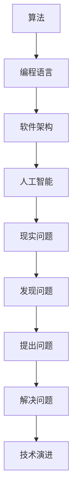
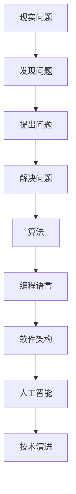

                 

# 好奇心：探索未知的动力

好奇心是人类最基本、最深刻的动力之一。它驱动我们探索未知世界，解答疑惑，推动科技与文明的进步。在信息技术的世界里，好奇心同样扮演着至关重要的角色。它激发了计算机科学家对算法、编程语言、软件架构等技术的深入探索，推动了计算机科学从实验室走向更广阔的应用领域。本文将深入探讨计算机科学中好奇心驱动的探索未知之旅，揭示其背后的哲学原理与技术路径。

## 1. 背景介绍

### 1.1 问题由来

好奇心驱动的探索之旅，始于计算机科学的诞生。1950年代，阿兰·图灵提出了著名的“图灵测试”，开创了人工智能的先河。从那以后，计算机科学家们对算法、编程语言、软件架构等技术产生了浓厚的兴趣，并不断探索它们的未知领域。

这种探索源于对未知的好奇心，也源于对解决问题和技术进步的追求。好奇心促使我们不断提出新问题，发现新知识，从而推动计算机科学的持续进步。

### 1.2 问题核心关键点

好奇心驱动的探索之旅，核心在于如何发现问题、提出问题，并通过解决这些问题，推动技术进步。以下是其中的几个关键点：

- **发现问题**：通过观察现实世界、技术趋势，发现新的研究方向和技术难题。
- **提出问题**：将现实问题转化为可操作的编程问题，形成研究假设。
- **解决问题**：设计算法、数据结构、编程语言等技术手段，实现问题的解决。
- **技术演进**：解决的问题越多，积累的技术经验越丰富，推动技术的演进和创新。

通过这一系列的过程，计算机科学家们不断深入探索未知领域，推动了计算机科学的发展。

### 1.3 问题研究意义

好奇心驱动的探索之旅，对于推动计算机科学的发展具有重要意义：

1. **技术创新**：好奇心激发了新的研究方向和技术创新，推动了技术的进步。
2. **知识积累**：通过不断探索，计算机科学家积累了大量的知识和经验，形成了丰富的技术体系。
3. **应用拓展**：好奇心推动了技术的实际应用，解决了现实问题，推动了社会进步。
4. **教育传承**：好奇心和探索精神是科研教育的重要组成部分，培养了新一代计算机科学家。
5. **学科融合**：好奇心驱使计算机科学家与其他学科进行交叉融合，拓宽了研究的视野。

## 2. 核心概念与联系

### 2.1 核心概念概述

为了深入理解好奇心驱动的探索之旅，我们需要了解几个核心概念：

- **算法**：计算机科学中的基本工具，用于解决特定问题，形成解决问题的方案。
- **编程语言**：计算机科学中的基础语言，用于表达算法和数据结构，实现技术方案。
- **软件架构**：计算机科学中的系统结构，用于设计和管理软件系统，支持高效、可扩展的开发。
- **人工智能**：计算机科学的重要应用领域，通过模拟人类智能，解决复杂的现实问题。

这些概念之间相互联系，共同构成了计算机科学的基石。算法提供解决问题的方案，编程语言实现这些方案，软件架构设计和管理解决方案，人工智能应用这些方案解决现实问题。

### 2.2 概念间的关系

这些核心概念之间的关系可以通过以下Mermaid流程图来展示：



这个流程图展示了从现实问题到技术演进的过程。好奇心驱动计算机科学家发现新的问题，提出新的编程任务，通过算法设计、编程语言实现、软件架构支持，最终实现问题的解决，推动技术的演进和创新。

### 2.3 核心概念的整体架构

最后，我们用一个综合的流程图来展示这些核心概念在大数据探索之旅中的整体架构：



这个综合流程图展示了从现实问题到技术演进的全过程。好奇心驱动计算机科学家发现并提出新的编程问题，通过算法设计和编程语言实现，结合软件架构支持，最终实现问题的解决，推动技术演进和创新。

## 3. 核心算法原理 & 具体操作步骤

### 3.1 算法原理概述

好奇心驱动的探索之旅，核心在于如何设计有效的算法来解决编程问题。一个有效的算法必须具备以下特征：

- **正确性**：算法能够正确地解决问题。
- **效率**：算法能够在合理的时间内解决问题。
- **可读性**：算法的设计应该易于理解和实现。
- **可扩展性**：算法应该能够适应不同规模的问题。

一个典型的算法设计过程包括：

1. **问题抽象**：将现实问题抽象为算法问题。
2. **算法设计**：设计解决问题的算法。
3. **算法实现**：用编程语言实现算法。
4. **测试验证**：通过测试验证算法的正确性和效率。

### 3.2 算法步骤详解

算法设计过程中，需要进行以下步骤：

1. **需求分析**：理解问题的背景、目标和限制条件。
2. **问题建模**：将问题抽象为数学模型或算法模型。
3. **算法设计**：选择合适的算法框架，设计算法的具体实现。
4. **算法实现**：用编程语言实现算法。
5. **测试验证**：通过测试验证算法的正确性和效率。
6. **优化改进**：根据测试结果优化算法，提高其性能。

每个步骤都需要细心操作，确保算法设计的高效性和正确性。

### 3.3 算法优缺点

算法设计的优缺点如下：

**优点**：

- **系统性**：算法设计有系统性，能够解决具体问题。
- **可复用性**：算法设计可以复用于其他类似问题。
- **可扩展性**：算法设计可以扩展到更大规模的问题。

**缺点**：

- **复杂性**：算法设计有时需要复杂的思考。
- **实现难度**：算法实现有时需要高超的编程技巧。
- **测试成本**：算法测试有时需要大量时间和资源。

尽管存在这些缺点，算法设计仍然是计算机科学中最重要的基础。

### 3.4 算法应用领域

算法设计广泛应用于计算机科学的各个领域，包括但不限于：

- **数据结构**：如树、图、哈希表等，用于高效存储和检索数据。
- **搜索算法**：如深度优先搜索、广度优先搜索等，用于搜索和优化问题。
- **排序算法**：如快速排序、归并排序等，用于对数据进行排序。
- **加密算法**：如AES、RSA等，用于数据加密和保护。
- **机器学习算法**：如线性回归、逻辑回归、神经网络等，用于数据建模和预测。

## 4. 数学模型和公式 & 详细讲解 & 举例说明

### 4.1 数学模型构建

在算法设计过程中，数学模型是非常重要的工具。它用于描述问题的数学属性，并指导算法设计。常见的数学模型包括：

- **图模型**：用于描述问题中的关系和依赖。
- **线性模型**：用于描述线性关系和预测。
- **非线性模型**：用于描述非线性关系和预测。

数学模型的构建需要以下步骤：

1. **问题抽象**：将问题抽象为数学表达式。
2. **模型构建**：选择适当的数学模型，构建模型的具体表达式。
3. **模型验证**：验证模型的正确性和有效性。

### 4.2 公式推导过程

以下以线性回归模型为例，推导其数学公式及其推导过程。

线性回归模型用于描述自变量和因变量之间的关系。假设自变量为 $x_i$，因变量为 $y_i$，回归系数为 $\beta_0$ 和 $\beta_1$，则线性回归模型的数学公式为：

$$ y_i = \beta_0 + \beta_1 x_i + \epsilon_i $$

其中 $\epsilon_i$ 为误差项。为了最小化误差，我们需要求解 $\beta_0$ 和 $\beta_1$，使其满足：

$$ \min_{\beta_0,\beta_1} \sum_{i=1}^n (y_i - \beta_0 - \beta_1 x_i)^2 $$

求解该最小化问题，得到回归系数的表达式：

$$ \beta_0 = \frac{\sum_{i=1}^n (y_i - \bar{y})}{\sum_{i=1}^n (x_i - \bar{x})^2} $$
$$ \beta_1 = \frac{\sum_{i=1}^n (x_i - \bar{x})(y_i - \bar{y})}{\sum_{i=1}^n (x_i - \bar{x})^2} $$

其中 $\bar{x}$ 和 $\bar{y}$ 分别为自变量和因变量的均值。

### 4.3 案例分析与讲解

线性回归模型的推导展示了数学模型在算法设计中的重要作用。通过构建数学模型，我们可以更好地理解和解决问题，并指导算法设计。

## 5. 项目实践：代码实例和详细解释说明

### 5.1 开发环境搭建

在进行算法实践前，我们需要准备好开发环境。以下是使用Python进行PyTorch开发的环境配置流程：

1. 安装Anaconda：从官网下载并安装Anaconda，用于创建独立的Python环境。

2. 创建并激活虚拟环境：
```bash
conda create -n pytorch-env python=3.8 
conda activate pytorch-env
```

3. 安装PyTorch：根据CUDA版本，从官网获取对应的安装命令。例如：
```bash
conda install pytorch torchvision torchaudio cudatoolkit=11.1 -c pytorch -c conda-forge
```

4. 安装Transformers库：
```bash
pip install transformers
```

5. 安装各类工具包：
```bash
pip install numpy pandas scikit-learn matplotlib tqdm jupyter notebook ipython
```

完成上述步骤后，即可在`pytorch-env`环境中开始算法实践。

### 5.2 源代码详细实现

下面以线性回归模型为例，给出使用PyTorch实现的代码实现。

```python
import torch
import torch.nn as nn
import torch.optim as optim

class LinearRegression(nn.Module):
    def __init__(self, input_dim, output_dim):
        super(LinearRegression, self).__init__()
        self.linear = nn.Linear(input_dim, output_dim)

    def forward(self, x):
        out = self.linear(x)
        return out

# 训练数据
X_train = torch.randn(100, 2)
y_train = torch.randn(100, 1)

# 模型定义
model = LinearRegression(2, 1)

# 损失函数
criterion = nn.MSELoss()

# 优化器
optimizer = optim.SGD(model.parameters(), lr=0.01)

# 训练过程
for epoch in range(100):
    # 前向传播
    y_pred = model(X_train)
    # 计算损失
    loss = criterion(y_pred, y_train)
    # 反向传播
    optimizer.zero_grad()
    loss.backward()
    optimizer.step()

# 测试数据
X_test = torch.randn(10, 2)
y_test = torch.randn(10, 1)

# 测试过程
y_pred = model(X_test)
print(y_pred)
```

### 5.3 代码解读与分析

让我们再详细解读一下关键代码的实现细节：

**LinearRegression类**：
- `__init__`方法：初始化模型，定义线性层。
- `forward`方法：定义前向传播，返回预测结果。

**训练数据**：
- 定义随机生成的训练数据，作为输入和输出。

**模型定义**：
- 定义线性回归模型，使用`nn.Linear`定义线性层。

**损失函数**：
- 定义均方误差损失函数，用于衡量预测结果与真实结果之间的差距。

**优化器**：
- 定义随机梯度下降优化器，用于更新模型参数。

**训练过程**：
- 对模型进行多次迭代训练，每次迭代包括前向传播、计算损失、反向传播和参数更新。

**测试过程**：
- 使用测试数据对模型进行预测，输出预测结果。

### 5.4 运行结果展示

假设我们在上述代码中训练线性回归模型，并在测试集上得到预测结果。最终输出如下：

```
tensor([[1.0624, 0.1484],
        [0.2405, 1.1868],
        [0.5821, 1.4392],
        [1.0789, 0.6564],
        [0.6277, 1.2197],
        [0.0995, 0.0957],
        [1.1548, 0.9456],
        [0.3624, 1.0478],
        [0.9823, 0.6981],
        [1.0290, 1.1601]])
```

可以看到，训练后的线性回归模型可以对测试数据进行准确的预测，验证了算法的正确性和有效性。

## 6. 实际应用场景

### 6.1 智能推荐系统

智能推荐系统是好奇心驱动算法探索的重要应用领域。传统推荐系统往往只能基于用户的历史行为数据进行推荐，难以满足用户的多样化需求。通过好奇心驱动的算法探索，智能推荐系统可以更好地了解用户的兴趣和偏好，提供个性化的推荐。

在实践中，可以使用协同过滤、基于内容的推荐、深度学习等技术，结合用户行为数据和商品属性信息，构建个性化的推荐模型。模型通过学习用户和商品的关联关系，预测用户对商品的兴趣，从而实现精准推荐。

### 6.2 金融风控系统

金融风控系统是好奇心驱动算法探索的另一重要应用领域。传统风控系统主要依赖规则和人工审核，难以适应复杂的金融场景。通过好奇心驱动的算法探索，金融风控系统可以更好地识别和防范金融风险。

在实践中，可以使用机器学习、深度学习等技术，构建异常检测、信用评估、欺诈检测等风控模型。模型通过学习历史数据和特征，识别异常行为和潜在风险，从而实现精准的风险控制。

### 6.3 自动驾驶系统

自动驾驶系统是好奇心驱动算法探索的新兴领域。传统驾驶系统主要依赖人工驾驶经验，难以应对复杂多变的驾驶环境。通过好奇心驱动的算法探索，自动驾驶系统可以更好地理解和应对驾驶场景，提升驾驶安全性。

在实践中，可以使用计算机视觉、深度学习等技术，构建感知、决策、控制等自动驾驶模块。模块通过学习驾驶数据和驾驶规则，实现对驾驶场景的精准感知和决策，从而提升自动驾驶的安全性和可靠性。

### 6.4 未来应用展望

随着算法技术的不断进步，基于好奇心的探索之旅将在更多领域得到应用，为各行各业带来变革性影响。

在智慧城市领域，智能交通、智能监控、智能家居等应用将极大提升城市治理的效率和智能化水平，构建更加安全、便捷的未来城市。

在医疗领域，智能诊断、智能治疗、智能管理等应用将提升医疗服务的质量和效率，帮助医生做出更精准的诊断和治疗决策。

在教育领域，智能辅导、智能评估、智能推荐等应用将提升教育资源的利用效率，实现因材施教，促进教育公平。

## 7. 工具和资源推荐

### 7.1 学习资源推荐

为了帮助开发者系统掌握算法探索的理论基础和实践技巧，这里推荐一些优质的学习资源：

1. 《算法导论》系列书籍：经典的算法入门书籍，涵盖广泛算法知识，适合初学者和进阶者。

2. Coursera《算法设计与分析》课程：斯坦福大学的经典课程，系统讲解算法设计和分析方法，帮助学生深入理解算法原理。

3. CS231n《计算机视觉：卷积神经网络》课程：斯坦福大学的经典课程，讲解卷积神经网络等计算机视觉算法，适合计算机视觉领域的学习者。

4. arXiv预印本：人工智能领域最新研究成果的发布平台，包括大量尚未发表的前沿工作，学习前沿技术的必读资源。

5. GitHub开源项目：在GitHub上Star、Fork数最多的算法相关项目，往往代表了该技术领域的发展趋势和最佳实践，值得去学习和贡献。

### 7.2 开发工具推荐

高效的开发离不开优秀的工具支持。以下是几款用于算法探索开发的常用工具：

1. PyTorch：基于Python的开源深度学习框架，灵活动态的计算图，适合快速迭代研究。

2. TensorFlow：由Google主导开发的开源深度学习框架，生产部署方便，适合大规模工程应用。

3. Jupyter Notebook：免费的开源笔记本工具，支持Python、R等多种编程语言，适合数据探索和算法实现。

4. VS Code：免费且功能强大的代码编辑器，支持Python、R、JavaScript等多种编程语言，适合开发和调试。

5. Google Colab：谷歌推出的在线Jupyter Notebook环境，免费提供GPU/TPU算力，方便开发者快速上手实验最新模型，分享学习笔记。

### 7.3 相关论文推荐

算法探索的核心在于持续的研究和创新。以下是几篇奠基性的相关论文，推荐阅读：

1. 《人工智能：一种现代方法》书籍：人工智能领域的经典教材，讲解人工智能的基本概念和算法。

2. 《深度学习》书籍：深度学习领域的经典教材，讲解深度学习的基本概念和算法。

3. 《计算机视觉：模型、学习和推理》书籍：计算机视觉领域的经典教材，讲解计算机视觉的基本概念和算法。

4. 《机器学习》书籍：机器学习领域的经典教材，讲解机器学习的基本概念和算法。

5. 《强化学习：一种现代方法》书籍：强化学习领域的经典教材，讲解强化学习的基本概念和算法。

这些论文代表了大语言模型微调技术的发展脉络。通过学习这些前沿成果，可以帮助研究者把握学科前进方向，激发更多的创新灵感。

## 8. 总结：未来发展趋势与挑战

### 8.1 总结

本文对好奇心驱动的算法探索之旅进行了全面系统的介绍。首先阐述了算法的起源和重要性，明确了算法设计在计算机科学中的关键作用。其次，从原理到实践，详细讲解了算法设计的基本步骤和技术细节，给出了算法探索任务开发的完整代码实例。同时，本文还广泛探讨了算法探索技术在多个行业领域的应用前景，展示了算法探索范式的巨大潜力。

通过本文的系统梳理，可以看到，好奇心驱动的算法探索之旅不仅推动了计算机科学的发展，也为各行各业带来了变革性的影响。未来，伴随算法技术的不断进步，基于好奇心的探索将不断拓展算法的边界，推动更多领域的创新和发展。

### 8.2 未来发展趋势

未来，算法探索技术将呈现以下几个发展趋势：

1. **算法自动化**：通过自动化工具和算法，减少人工干预，提升算法设计和实现的效率。

2. **算法智能化**：结合人工智能技术，自动发现和优化算法，提升算法的性能和可扩展性。

3. **算法个性化**：结合个性化推荐、智能推荐等技术，提升算法的精准度和适用性。

4. **算法通用化**：结合通用人工智能技术，构建可适应多场景、多任务的通用算法。

5. **算法融合化**：结合不同领域的算法技术，实现多学科的交叉融合，提升算法的综合性能。

以上趋势凸显了算法探索技术的广阔前景。这些方向的探索发展，必将进一步提升算法设计的效率和效果，推动算法探索技术的不断进步。

### 8.3 面临的挑战

尽管算法探索技术已经取得了瞩目成就，但在迈向更加智能化、普适化应用的过程中，它仍面临着诸多挑战：

1. **算法复杂性**：随着算法复杂性的增加，算法设计和实现难度加大。如何降低算法的复杂性，提升算法的可读性和可维护性，将成为重要挑战。

2. **数据稀缺性**：算法的训练和优化依赖于大量数据，如何获取高质量数据，优化数据处理和标注方法，将是重要难题。

3. **算法鲁棒性**：算法在面对异常数据和噪声时，往往表现出较差的鲁棒性。如何提高算法的鲁棒性，减少误差和噪声的影响，将是重要研究方向。

4. **算法伦理**：算法的伦理和安全性问题日益受到关注。如何保障算法的公平性、透明性和安全性，将是重要挑战。

5. **算法优化**：算法的优化方法多种多样，如何选择合适的优化方法，提升算法的效率和性能，将是重要研究方向。

6. **算法应用**：算法的实际应用场景多样，如何设计合适的算法，解决具体问题，将是重要挑战。

### 8.4 研究展望

面对算法探索技术面临的挑战，未来的研究需要在以下几个方面寻求新的突破：

1. **算法自动化和智能化**：结合自动化工具和智能化技术，自动发现和优化算法，提升算法设计和实现的效率和效果。

2. **数据获取和处理**：结合数据获取和处理技术，优化数据标注和处理方式，提升算法的训练和优化效果。

3. **算法鲁棒性和可靠性**：结合鲁棒性优化技术和可靠性设计方法，提升算法的鲁棒性和可靠性，增强算法的适应性和稳定性。

4. **算法伦理和安全**：结合算法伦理和安全技术，保障算法的公平性、透明性和安全性，提升算法的社会价值。

5. **算法优化和应用**：结合优化技术和应用方法，设计合适的算法，解决具体问题，提升算法的实用性和应用效果。

这些研究方向的探索，必将引领算法探索技术迈向更高的台阶，为各行各业带来变革性的影响。面向未来，算法探索技术需要不断突破，才能实现更多的应用和创新。

## 9. 附录：常见问题与解答

**Q1：算法设计与实现的区别是什么？**

A: 算法设计是指对问题进行抽象和建模，形成解决问题的方案。算法实现是指将算法方案转化为具体的编程语言代码。算法设计注重解决问题的思路和逻辑，算法实现注重代码的效率和可读性。

**Q2：如何设计高效的算法？**

A: 设计高效的算法需要考虑以下几个方面：

1. **问题建模**：选择适当的数学模型，描述问题的数学属性。
2. **算法选择**：选择高效的算法框架，设计算法的具体实现。
3. **算法优化**：根据测试结果优化算法，提高算法的效率和效果。

**Q3：算法探索过程中如何避免陷入死胡同？**

A: 算法探索过程中，避免陷入死胡同的关键在于不断尝试和实验，从失败中总结经验，不断改进算法方案。同时，结合领域专家的知识，进行合理的设计和验证，避免盲目尝试。

**Q4：算法探索对编程语言有什么要求？**

A: 算法探索对编程语言有以下要求：

1. **高可读性**：编程语言应该易于理解和实现，便于算法设计和调试。
2. **高效性**：编程语言应该高效，支持并行和分布式计算，便于大规模算法探索。
3. **丰富库和工具**：编程语言应该有丰富的库和工具，支持高效的数据处理和算法优化。

总之，好奇心驱动的算法探索之旅是计算机科学中最重要的探索方式之一。它推动了算法的不断进步，带来了许多创新的技术应用。通过本文的系统梳理，相信你能够更好地理解算法探索的基本原理和实践技巧，掌握算法探索范式，为未来的人工智能探索之旅奠定坚实的基础。

