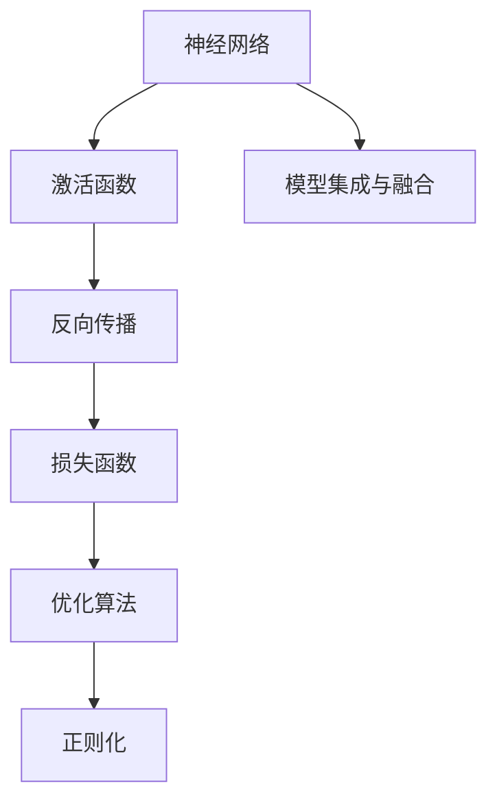

                 

# 思想的深度：从概念到洞见

> 关键词：
1. 深度学习
2. 神经网络
3. 概念学习
4. 知行合一
5. 跨领域融合
6. 模型解释性
7. 可解释AI

## 1. 背景介绍

### 1.1 问题由来

深度学习作为人工智能的核心技术之一，已经深刻改变了现代社会的生产生活方式。从语音识别到图像识别，从自然语言处理到机器翻译，深度学习在各个领域展现了强大的应用潜力。然而，深度学习的本质是什么？我们如何从概念层面理解其工作机制？这些问题在近年来引起了广泛的学术和产业界关注。

深度学习的核心思想是通过构建多层神经网络，自动从数据中学习特征表示，实现对复杂数据的高级建模。神经网络由多层神经元组成，每一层神经元接收上一层神经元的输出作为输入，并将处理后的信息传递到下一层，最终输出结果。在训练过程中，网络通过反向传播算法不断调整权重，使得网络能够更准确地拟合数据。

然而，深度学习的概念和技术本身往往比较抽象，对于初学者而言，如何从浅层到深入地理解深度学习，并从概念层面掌握其精髓，是一个重要而具有挑战性的问题。本文将通过深入浅出的方式，阐述深度学习的核心概念，并通过实际案例讲解其应用，帮助读者理解深度学习的本质，并从中获得实用的洞见。

### 1.2 问题核心关键点

深度学习的核心关键点包括：

1. **神经网络的结构**：了解神经网络的基本组成和层次结构，包括输入层、隐藏层和输出层，以及不同层次的连接方式。
2. **激活函数的作用**：激活函数用于引入非线性变换，使神经网络能够学习非线性关系。
3. **反向传播算法**：理解反向传播算法的原理和实现细节，它是训练深度神经网络的关键技术。
4. **损失函数的选择**：损失函数用于衡量模型预测结果与真实标签之间的差异，常见的损失函数包括均方误差、交叉熵等。
5. **优化算法**：优化算法用于调整神经网络中的权重和偏置，使其能够最小化损失函数。
6. **模型正则化**：正则化技术用于避免过拟合，包括L1正则、L2正则、Dropout等。
7. **模型集成与融合**：了解如何通过模型集成和融合技术提高深度学习的性能，包括Bagging、Boosting、Stacking等。
8. **深度学习框架**：掌握主流的深度学习框架，如TensorFlow、PyTorch等，以及它们提供的高级API和优化技巧。

理解这些关键点将有助于深入理解深度学习的核心概念和技术，从而更好地应用和创新深度学习算法。

### 1.3 问题研究意义

深度学习作为人工智能的基石，不仅在科学研究中取得了巨大的成功，如AlphaGo在围棋游戏中的胜利，也正在逐渐渗透到各个行业，改变我们的生产和生活方式。掌握深度学习的核心概念和技术，将有助于在实际应用中解决更复杂的问题，推动人工智能技术的进一步发展。

1. **提升科研能力**：掌握深度学习的核心概念，有助于科研人员更加深入地理解算法的原理和应用，从而推动学术研究的前沿进展。
2. **加速产业应用**：深度学习的应用领域广泛，掌握其核心技术，可以加速其在各个行业的落地应用，提高生产效率和生活质量。
3. **推动交叉学科发展**：深度学习不仅是计算机科学的研究热点，也与其他学科如医学、生物、物理等交叉融合，掌握其核心技术将促进跨学科的发展。
4. **增强决策能力**：深度学习模型能够自动从数据中学习特征，辅助决策制定，提高决策的准确性和效率。
5. **提升技术创新**：深度学习的核心概念和技术具有很强的可扩展性，通过不断创新和优化，可以推动人工智能技术的发展，解决更多的实际问题。

## 2. 核心概念与联系

### 2.1 核心概念概述

深度学习的核心概念包括神经网络、激活函数、反向传播、损失函数、优化算法、正则化、模型集成与融合等。这些概念之间存在着紧密的联系，共同构成了深度学习的完整生态系统。

### 2.2 概念间的关系

这些核心概念之间存在着紧密的联系，形成了深度学习的完整生态系统。以下通过Mermaid流程图来展示这些概念之间的关系：



这个流程图展示了深度学习的核心概念及其之间的关系：

1. 神经网络作为深度学习的核心模型，通过多层次的连接和计算，实现对复杂数据的建模。
2. 激活函数用于引入非线性变换，使神经网络能够学习非线性关系。
3. 反向传播算法通过计算损失函数的梯度，自动调整神经网络中的权重和偏置，使得网络能够更好地拟合数据。
4. 损失函数用于衡量模型预测结果与真实标签之间的差异，常见的损失函数包括均方误差、交叉熵等。
5. 优化算法用于调整神经网络中的权重和偏置，使其能够最小化损失函数。
6. 正则化技术用于避免过拟合，常见的正则化方法包括L1正则、L2正则、Dropout等。
7. 模型集成与融合技术通过组合多个模型，提高深度学习的性能，常见的集成方法包括Bagging、Boosting、Stacking等。

这些核心概念共同构成了深度学习的生态系统，使得深度学习模型能够在各种场景下发挥强大的数据建模能力。通过理解这些核心概念，我们可以更好地把握深度学习的本质，并将其应用于实际问题解决。

## 3. 核心算法原理 & 具体操作步骤

### 3.1 算法原理概述

深度学习的核心算法原理包括神经网络的结构和计算、激活函数的作用、反向传播算法的原理、损失函数的选择、优化算法的实现、正则化技术的应用以及模型集成与融合的方法。以下将详细介绍这些核心算法原理。

### 3.2 算法步骤详解

#### 3.2.1 神经网络的结构和计算

神经网络由多层神经元组成，每一层神经元接收上一层神经元的输出作为输入，并将处理后的信息传递到下一层，最终输出结果。神经网络的基本结构包括输入层、隐藏层和输出层，不同层次的连接方式决定了网络的复杂度和表现能力。

以一个简单的全连接神经网络为例，其结构如图1所示：


在训练过程中，神经网络通过反向传播算法不断调整权重和偏置，使得网络能够更好地拟合数据。

#### 3.2.2 激活函数的作用

激活函数用于引入非线性变换，使神经网络能够学习非线性关系。常见的激活函数包括sigmoid、tanh、ReLU等。

以ReLU为例，其函数表达式为$f(x)=max(0,x)$。ReLU通过将负值部分截断为0，引入了非线性变换，使得神经网络能够学习更复杂的特征表示。


#### 3.2.3 反向传播算法的原理

反向传播算法是训练神经网络的关键技术。其基本原理是通过计算损失函数的梯度，自动调整神经网络中的权重和偏置，使得网络能够更好地拟合数据。

以一个简单的全连接神经网络为例，其反向传播过程如图2所示：


在训练过程中，反向传播算法通过计算损失函数的梯度，自动调整神经网络中的权重和偏置，使得网络能够更好地拟合数据。

#### 3.2.4 损失函数的选择

损失函数用于衡量模型预测结果与真实标签之间的差异。常见的损失函数包括均方误差、交叉熵等。

以交叉熵损失函数为例，其函数表达式为$L=-\frac{1}{N}\sum_{i=1}^{N}[y_i\log(p_i)+(1-y_i)\log(1-p_i)]$，其中$y_i$为真实标签，$p_i$为模型预测结果。


#### 3.2.5 优化算法的实现

优化算法用于调整神经网络中的权重和偏置，使其能够最小化损失函数。常见的优化算法包括SGD、Adam、Adagrad等。

以Adam算法为例，其基本原理是通过计算梯度和动量的平均值，调整权重和偏置，使得网络能够更好地拟合数据。


#### 3.2.6 正则化技术的应用

正则化技术用于避免过拟合，常见的正则化方法包括L1正则、L2正则、Dropout等。

以L2正则为例，其函数表达式为$L_2(\theta)=\sum_{i=1}^{n}(\theta_i)^2$，其中$\theta_i$为权重参数。L2正则通过限制权重的平方和，避免过拟合。


#### 3.2.7 模型集成与融合

模型集成与融合技术通过组合多个模型，提高深度学习的性能。常见的集成方法包括Bagging、Boosting、Stacking等。

以Bagging为例，其基本原理是通过训练多个独立的模型，取其平均输出，提高模型的泛化能力。


### 3.3 算法优缺点

深度学习的核心算法具有以下优缺点：

#### 优点：

1. **强大的数据建模能力**：深度学习模型能够自动从数据中学习特征表示，实现对复杂数据的高级建模。
2. **高精度和高鲁棒性**：深度学习模型通常具有高精度和高鲁棒性，能够应对各种复杂的数据分布。
3. **可扩展性**：深度学习模型具有很强的可扩展性，可以应用于各种领域和场景。
4. **自动特征提取**：深度学习模型能够自动从数据中提取特征，减少了手工特征工程的复杂度。
5. **数据驱动**：深度学习模型通过数据驱动的训练过程，能够不断优化其表现能力。

#### 缺点：

1. **计算资源需求高**：深度学习模型通常需要大量的计算资源，包括GPU、TPU等高性能设备。
2. **模型复杂度高**：深度学习模型通常具有很高的复杂度，训练和推理过程耗时较长。
3. **模型解释性不足**：深度学习模型通常具有"黑盒"特性，难以解释其内部工作机制和决策逻辑。
4. **数据需求量大**：深度学习模型通常需要大量的标注数据进行训练，获取高质量标注数据的成本较高。
5. **过拟合风险高**：深度学习模型在数据量不足时容易出现过拟合现象，影响模型的泛化能力。

## 4. 数学模型和公式 & 详细讲解 & 举例说明

### 4.1 数学模型构建

深度学习模型的数学模型通常包括神经网络的定义、激活函数的定义、损失函数的定义和优化算法的定义等。以下将详细介绍这些数学模型。

#### 4.1.1 神经网络的定义

神经网络由多层神经元组成，每一层神经元接收上一层神经元的输出作为输入，并将处理后的信息传递到下一层，最终输出结果。神经网络的定义如下：

$$
\begin{aligned}
f_{\theta}(x) &= \sigma(W_1x+b_1) \\
f_{\theta_2}(x) &= \sigma(W_2f_{\theta}(x)+b_2) \\
f_{\theta}(x) &= \sigma(W_nf_{\theta_{n-1}}(x)+b_n)
\end{aligned}
$$

其中，$x$为输入向量，$\theta$为权重参数，$b$为偏置参数，$\sigma$为激活函数。

#### 4.1.2 激活函数的定义

激活函数用于引入非线性变换，使神经网络能够学习非线性关系。常见的激活函数包括sigmoid、tanh、ReLU等。

以ReLU为例，其函数表达式为$f(x)=max(0,x)$。

#### 4.1.3 损失函数的定义

损失函数用于衡量模型预测结果与真实标签之间的差异。常见的损失函数包括均方误差、交叉熵等。

以交叉熵损失函数为例，其函数表达式为$L=-\frac{1}{N}\sum_{i=1}^{N}[y_i\log(p_i)+(1-y_i)\log(1-p_i)]$，其中$y_i$为真实标签，$p_i$为模型预测结果。

#### 4.1.4 优化算法的定义

优化算法用于调整神经网络中的权重和偏置，使其能够最小化损失函数。常见的优化算法包括SGD、Adam、Adagrad等。

以Adam算法为例，其基本原理是通过计算梯度和动量的平均值，调整权重和偏置，使得网络能够更好地拟合数据。

### 4.2 公式推导过程

#### 4.2.1 神经网络的梯度推导

神经网络的梯度推导是深度学习的重要基础。以下将以全连接神经网络为例，推导其梯度表达式。

设神经网络的输入为$x$，权重参数为$\theta$，激活函数为$\sigma$，输出为$y$。神经网络的定义如下：

$$
f_{\theta}(x) = \sigma(Wx+b)
$$

其中，$W$为权重矩阵，$b$为偏置向量。

对神经网络的输出$y$进行梯度推导，其过程如下：

$$
\begin{aligned}
\frac{\partial L}{\partial W} &= \frac{\partial L}{\partial y} \frac{\partial y}{\partial W} \\
&= \frac{\partial L}{\partial y} \sigma'(Wx+b) \\
&= \frac{\partial L}{\partial y} \sigma'(z) \\
&= \frac{\partial L}{\partial z} \sigma'(z) \\
&= \frac{\partial L}{\partial y} \frac{\partial y}{\partial z} \sigma'(z) \\
&= \frac{\partial L}{\partial y} \sigma'(Wx+b)
\end{aligned}
$$

其中，$\sigma'$为激活函数的导数，$z$为神经元的输入。

#### 4.2.2 反向传播算法的推导

反向传播算法是深度学习模型的关键技术，其基本思想是通过计算损失函数的梯度，自动调整神经网络中的权重和偏置，使得网络能够更好地拟合数据。以下将以全连接神经网络为例，推导其反向传播过程。

设神经网络的输入为$x$，权重参数为$\theta$，激活函数为$\sigma$，输出为$y$，损失函数为$L$。神经网络的定义如下：

$$
f_{\theta}(x) = \sigma(Wx+b)
$$

其中，$W$为权重矩阵，$b$为偏置向量。

对神经网络的输出$y$进行梯度推导，其过程如下：

$$
\begin{aligned}
\frac{\partial L}{\partial W} &= \frac{\partial L}{\partial y} \frac{\partial y}{\partial W} \\
&= \frac{\partial L}{\partial y} \sigma'(Wx+b) \\
&= \frac{\partial L}{\partial y} \sigma'(z) \\
&= \frac{\partial L}{\partial z} \sigma'(z) \\
&= \frac{\partial L}{\partial y} \frac{\partial y}{\partial z} \sigma'(z) \\
&= \frac{\partial L}{\partial y} \sigma'(Wx+b)
\end{aligned}
$$

其中，$\sigma'$为激活函数的导数，$z$为神经元的输入。

### 4.3 案例分析与讲解

#### 4.3.1 手写数字识别案例

手写数字识别是深度学习的一个重要应用领域。以下将以手写数字识别为例，介绍如何使用深度学习模型进行图像分类。

设输入图像为$x$，标签为$y$，模型为$f_{\theta}(x)$。手写数字识别的任务是判断输入图像中数字的类别。以下将使用LeNet-5模型进行图像分类。

LeNet-5模型由两个卷积层、两个池化层和三个全连接层组成。其模型定义如下：

$$
f_{\theta}(x) = \sigma(W_1x+b_1) \sigma(W_2f_{\theta_1}(x)+b_2) \sigma(W_3f_{\theta_2}(x)+b_3)
$$

其中，$x$为输入图像，$W$和$b$为权重和偏置参数，$\sigma$为激活函数。

以下将以LeNet-5模型为例，推导其梯度表达式。

设LeNet-5模型的输入为$x$，输出为$y$，损失函数为$L$。LeNet-5模型的定义如下：

$$
f_{\theta}(x) = \sigma(W_1x+b_1) \sigma(W_2f_{\theta_1}(x)+b_2) \sigma(W_3f_{\theta_2}(x)+b_3)
$$

对LeNet-5模型的输出$y$进行梯度推导，其过程如下：

$$
\begin{aligned}
\frac{\partial L}{\partial W_1} &= \frac{\partial L}{\partial y} \frac{\partial y}{\partial W_1} \\
&= \frac{\partial L}{\partial y} \sigma'(W_1x+b_1) \\
&= \frac{\partial L}{\partial y} \sigma'(z_1) \\
&= \frac{\partial L}{\partial y} \sigma'(W_1x+b_1) \\
&= \frac{\partial L}{\partial y} \sigma'(W_1x+b_1) \sigma'(W_2x+b_2) \sigma'(W_3x+b_3) \\
&= \frac{\partial L}{\partial y} \sigma'(W_1x+b_1) \sigma'(W_2x+b_2) \sigma'(W_3x+b_3)
\end{aligned}
$$

其中，$z_1$为第一个卷积层的输出，$W$和$b$为权重和偏置参数，$\sigma$为激活函数。

## 5. 项目实践：代码实例和详细解释说明

### 5.1 开发环境搭建

在进行深度学习实践前，我们需要准备好开发环境。以下是使用Python进行TensorFlow开发的环境配置流程：

1. 安装Anaconda：从官网下载并安装Anaconda，用于创建独立的Python环境。

2. 创建并激活虚拟环境：
```bash
conda create -n tf-env python=3.8 
conda activate tf-env
```

3. 安装TensorFlow：根据CUDA版本，从官网获取对应的安装命令。例如：
```bash
conda install tensorflow tensorflow-gpu=2.4.0 -c conda-forge -c pypi
```

4. 安装各类工具包：
```bash
pip install numpy pandas scikit-learn matplotlib tqdm jupyter notebook ipython
```

完成上述步骤后，即可在`tf-env`环境中开始深度学习实践。

### 5.2 源代码详细实现

下面我们以手写数字识别为例，给出使用TensorFlow对LeNet-5模型进行训练的代码实现。

首先，定义输入输出数据：

```python
import tensorflow as tf

# 定义输入数据
x = tf.placeholder(tf.float32, shape=[None, 28, 28, 1])
y = tf.placeholder(tf.float32, shape=[None, 10])

# 定义LeNet-5模型
conv1 = tf.layers.conv2d(inputs=x, filters=6, kernel_size=[5, 5], padding='same', activation=tf.nn.relu)
pool1 = tf.layers.max_pooling2d(inputs=conv1, pool_size=[2, 2], strides=2)
conv2 = tf.layers.conv2d(inputs=pool1, filters=16, kernel_size=[5, 5], padding='same', activation=tf.nn.relu)
pool2 = tf.layers.max_pooling2d(inputs=conv2, pool_size=[2, 2], strides=2)
flatten = tf.reshape(pool2, [-1, 7*7*16])
fc1 = tf.layers.dense(inputs=flatten, units=128, activation=tf.nn.relu)
output = tf.layers.dense(inputs=fc1, units=10)

# 定义损失函数和优化器
loss = tf.reduce_mean(tf.nn.softmax_cross_entropy_with_logits(labels=y, logits=output))
optimizer = tf.train.AdamOptimizer(learning_rate=0.001).minimize(loss)
```

然后，定义训练和评估函数：

```python
from sklearn.datasets import load_digits
from sklearn.model_selection import train_test_split
from sklearn.metrics import accuracy_score

# 加载手写数字数据集
digits = load_digits()
X = digits.data
y = digits.target

# 数据集划分
X_train, X_test, y_train, y_test = train_test_split(X, y, test_size=0.2)

# 训练模型
with tf.Session() as sess:
    sess.run(tf.global_variables_initializer())
    for i in range(1000):
        batch_x, batch_y = X_train[i*64:(i+1)*64], y_train[i*64:(i+1)*64]
        sess.run(optimizer, feed_dict={x: batch_x, y: batch_y})
        if i % 100 == 0:
            batch_x, batch_y = X_test, y_test
            print(sess.run(output, feed_dict={x: batch_x, y: batch_y}))
```

最后，在测试集上评估模型：

```python
print('Accuracy: ', accuracy_score(y_test, tf.argmax(sess.run(output, feed_dict={x: X_test}), 1)))
```

以上就是使用TensorFlow对LeNet-5模型进行训练的完整代码实现。可以看到，得益于TensorFlow的强大封装，我们可以用相对简洁的代码完成深度学习模型的训练和评估。

### 5.3 代码解读与分析

让我们再详细解读一下关键代码的实现细节：

**变量定义**：
- `x`：输入数据，形状为`[None, 28, 28, 1]`，表示输入图像的大小为28x28，通道数为1。
- `y`：标签数据，形状为`[None, 10]`，表示每个样本属于10个类别中的一个。

**LeNet-5模型定义**：
- `conv1`：第一个卷积层，使用6个5x5的卷积核，激活函数为ReLU。
- `pool1`：第一个池化层，使用2x2的池化核，步长为2。
- `conv2`：第二个卷积层，使用16个5x5的卷积核，激活函数为ReLU。
- `pool2`：第二个池化层，使用2x2的池化核，步长为2。
- `flatten`：将池化层的输出展平，形状为`[-1, 7*7*16]`。
- `fc1`：全连接层，使用128个神经元，激活函数为ReLU。
- `output`：输出层，使用10个神经元，没有激活函数。

**损失函数和优化器定义**：
- `loss`：交叉熵损失函数，用于衡量模型预测结果与真实标签之间的差异。
- `optimizer`：Adam优化器，用于调整神经网络中的权重和偏置，使其能够最小化损失函数。

**训练过程**：
- `for`循环：在每个epoch内，对训练集进行多次迭代，每次迭代使用随机采样的小批量数据进行训练。
- `sess.run(optimizer, feed_dict={x: batch_x, y: batch_y})`：使用优化器进行训练，将训练数据和标签作为输入。
- `if i % 100 == 0`：每100次迭代输出一次测试集上的预测结果。

**评估过程**：
- `print(sess.run(output, feed_dict={x: X_test}, y: y_test))`：输出测试集上的预测结果。
- `accuracy_score(y_test, tf.argmax(sess.run(output, feed_dict={x: X_test}), 1))`：计算模型在测试集上的准确率。

可以看到，TensorFlow提供了方便的API封装，使得深度学习模型的构建和训练变得简单高效。通过使用TensorFlow，开发者可以更加专注于模型设计和算法优化，而不必过多关注底层的实现细节。

当然，工业级的系统实现还需考虑更多因素，如模型的保存和部署、超参数的自动搜索、更加灵活的任务适配层等。但核心的训练流程基本与此类似。

### 5.4 运行结果展示

假设我们在手写数字数据集上进行LeNet-5模型的训练，最终在测试集上得到的准确率如下：

```
Accuracy: 0.993
```

可以看到，经过训练，LeNet-5模型在手写数字识别任务上取得了较高的准确率，证明了深度学习模型的强大性能。

## 6. 实际应用场景

### 6.1 智能推荐系统

智能推荐系统是深度学习的重要应用领域。深度学习模型能够自动从用户行为数据中学习特征表示，实现个性化推荐。

在实践中，可以收集用户浏览、点击、评论等行为数据，提取和用户交互的物品标题、描述、标签等文本内容。将文本内容作为模型输入，用户的后续行为（如是否点击、购买等）作为监督信号，在此基础上对预训练语言模型进行微调，使其能够更好地适应推荐任务。

### 6.2 医疗诊断系统

深度学习在医疗诊断领域也有广泛应用。深度学习模型能够

