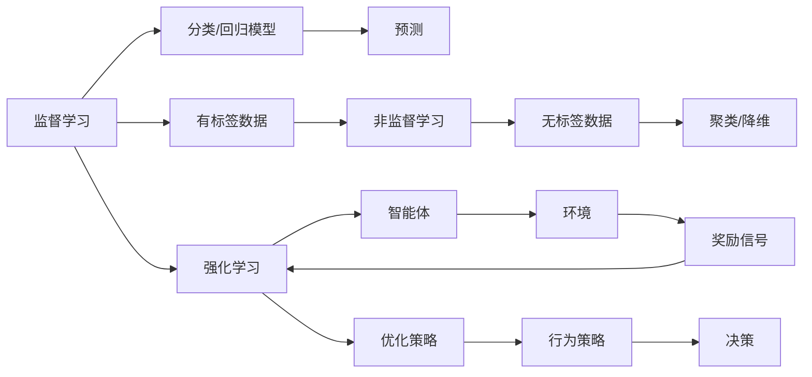
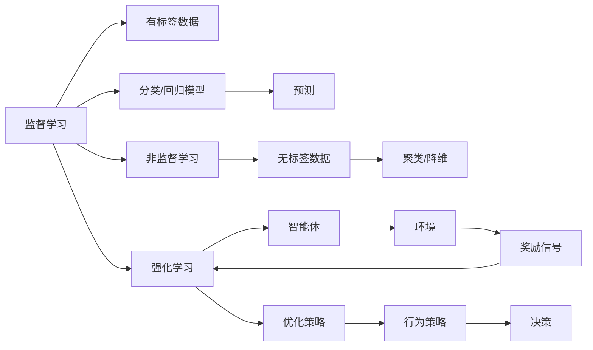
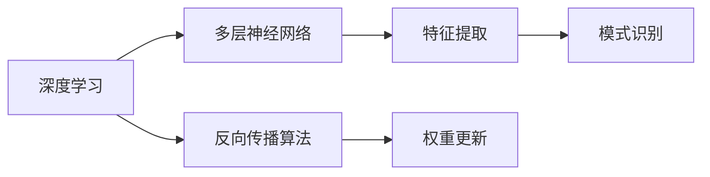
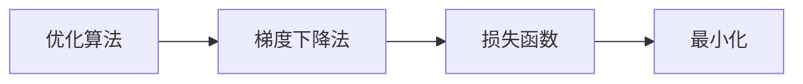
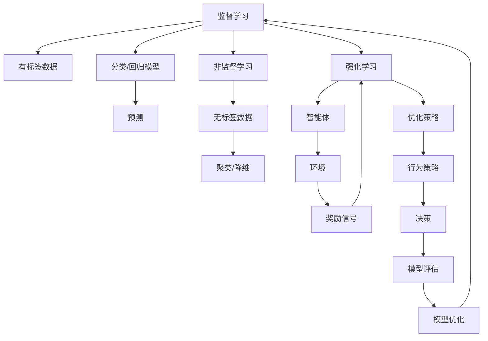

                 

# 机器学习原理与代码实例讲解

> 关键词：机器学习,监督学习,非监督学习,强化学习,深度学习,代码实例,Python

## 1. 背景介绍

### 1.1 问题由来
机器学习是人工智能(AI)领域的一个重要分支，旨在让计算机通过学习数据分析和处理数据，实现自动化的决策和预测。近年来，随着计算资源、数据规模和算法创新的快速增长，机器学习已经广泛应用于各个行业，如金融、医疗、零售、物流等，极大地提升了业务效率和用户体验。然而，尽管机器学习带来了诸多便利，其在理论、应用和技术实现上也存在诸多挑战。因此，本文将深入探讨机器学习的原理，通过丰富的代码实例讲解其实际应用，帮助读者全面理解这一领域的核心技术。

### 1.2 问题核心关键点
机器学习的核心在于构建一个能够学习数据特征和规律的模型。常见的机器学习范式包括监督学习、非监督学习和强化学习，每一种范式都有其独特的适用场景和算法。通过这些算法，机器学习能够处理分类、回归、聚类、降维等复杂问题。此外，深度学习作为机器学习的一个分支，近年来在图像识别、自然语言处理等领域取得了突破性进展，成为当前的研究热点。

## 2. 核心概念与联系

### 2.1 核心概念概述

为更好地理解机器学习的核心概念及其联系，本节将介绍几个关键概念：

- 监督学习(Supervised Learning)：通过带有标签的训练数据，让模型学习输入和输出之间的映射关系，从而进行预测。监督学习广泛应用于分类和回归任务。
- 非监督学习(Unsupervised Learning)：不依赖于标注数据，通过模型自动发现数据中的结构和模式，如聚类、降维等。非监督学习在数据探索和预处理中应用广泛。
- 强化学习(Reinforcement Learning)：通过智能体与环境的交互，通过奖励信号指导行为策略的优化，实现自动化决策。强化学习在自动控制、游戏AI等领域具有重要应用。
- 深度学习(Deep Learning)：一种特殊的机器学习方法，通过多层神经网络模拟人脑结构，学习复杂数据特征。深度学习在图像、语音、自然语言处理等领域取得了卓越成效。
- 神经网络(Neural Network)：由多层神经元组成的计算模型，用于实现复杂的数据处理和模式识别。神经网络是深度学习的基础。
- 损失函数(Loss Function)：用于度量模型预测值与真实值之间的差距，指导模型的优化。损失函数是训练模型的关键。
- 优化算法(Optimization Algorithm)：用于最小化损失函数的算法，如梯度下降法、Adam、RMSprop等。优化算法决定了模型的训练速度和效果。

这些核心概念通过以下Mermaid流程图来展示：



### 2.2 概念间的关系

这些核心概念之间存在着紧密的联系，形成了机器学习的基本框架。下面我通过几个Mermaid流程图来展示这些概念的关系。

#### 2.2.1 机器学习的学习范式



这个流程图展示了机器学习的核心学习范式：

1. 监督学习：使用带有标签的数据进行模型训练，通过预测任务进行分类或回归。
2. 非监督学习：处理无标签数据，自动发现数据中的模式和结构，如聚类、降维等。
3. 强化学习：通过智能体与环境的交互，学习最优的决策策略。

#### 2.2.2 深度学习与神经网络



这个流程图展示了深度学习的核心组件：

1. 深度学习：通过多层神经网络学习复杂数据特征。
2. 神经网络：通过反向传播算法更新权重，实现特征提取和模式识别。

#### 2.2.3 优化算法与损失函数



这个流程图展示了优化算法与损失函数的关系：

1. 优化算法：用于最小化损失函数，如梯度下降法、Adam等。
2. 损失函数：用于衡量模型预测与真实值之间的差距，如均方误差、交叉熵等。

### 2.3 核心概念的整体架构

最后，我们用一个综合的流程图来展示这些核心概念在机器学习中的整体架构：



这个综合流程图展示了从数据准备到模型训练，再到模型评估和优化的整个机器学习流程。通过这些核心概念的组合应用，我们可以构建高效、准确的机器学习模型，解决各种实际问题。

## 3. 核心算法原理 & 具体操作步骤
### 3.1 算法原理概述

机器学习的核心算法包括监督学习、非监督学习和强化学习，每种算法都有其独特的原理和应用场景。以下是三种主要算法原理的概述：

- 监督学习：通过带有标签的训练数据，学习输入和输出之间的映射关系，从而进行预测。
- 非监督学习：不依赖于标注数据，通过模型自动发现数据中的结构和模式，如聚类、降维等。
- 强化学习：通过智能体与环境的交互，通过奖励信号指导行为策略的优化，实现自动化决策。

这些算法原理通过以下Mermaid流程图来展示：


### 3.2 算法步骤详解

下面以监督学习和非监督学习为例，详细介绍这两种算法的具体操作步骤。

#### 3.2.1 监督学习步骤详解

监督学习主要包括以下几个步骤：

1. 数据准备：收集带有标签的训练数据，划分为训练集、验证集和测试集。
2. 模型选择：选择适当的模型结构，如线性回归、决策树、神经网络等。
3. 模型训练：使用训练集数据，通过最小化损失函数，优化模型参数。
4. 模型评估：在验证集上评估模型性能，调整超参数，防止过拟合。
5. 模型预测：使用训练好的模型在测试集上进行预测，并评估预测效果。

以线性回归为例，其具体操作步骤如下：

```python
import numpy as np
from sklearn.linear_model import LinearRegression

# 准备数据
X = np.array([[1, 2], [2, 4], [3, 6], [4, 8]])
y = np.array([2, 4, 6, 8])

# 训练模型
model = LinearRegression()
model.fit(X, y)

# 预测
X_test = np.array([[5, 10], [6, 12]])
y_pred = model.predict(X_test)

print(y_pred)
```

#### 3.2.2 非监督学习步骤详解

非监督学习主要包括以下几个步骤：

1. 数据准备：收集无标签的训练数据。
2. 模型选择：选择适当的非监督学习算法，如K-Means、PCA等。
3. 模型训练：使用训练集数据，自动发现数据中的结构和模式。
4. 模型评估：评估模型的聚类效果、降维效果等。
5. 模型应用：将降维后的数据进行可视化分析或进一步处理。

以K-Means为例，其具体操作步骤如下：

```python
import numpy as np
from sklearn.cluster import KMeans

# 准备数据
X = np.array([[1, 2], [2, 4], [3, 6], [4, 8]])

# 训练模型
model = KMeans(n_clusters=2)
model.fit(X)

# 预测
y_pred = model.predict(X)

print(y_pred)
```

### 3.3 算法优缺点

机器学习的各种算法都有其独特的优缺点，以下是监督学习、非监督学习和强化学习的优缺点：

#### 3.3.1 监督学习的优缺点

- 优点：能够利用标注数据进行模型训练，模型预测准确性较高。
- 缺点：依赖标注数据，标注成本高，数据获取困难。

#### 3.3.2 非监督学习的优缺点

- 优点：不依赖标注数据，能够自动发现数据中的结构和模式。
- 缺点：结果依赖于数据本身，难以解释，可能存在过拟合风险。

#### 3.3.3 强化学习的优缺点

- 优点：能够通过智能体与环境的交互，学习最优的决策策略。
- 缺点：训练时间长，环境复杂，难以实现精确控制。

### 3.4 算法应用领域

机器学习的算法广泛应用于各个领域，以下是几个典型应用场景：

- 金融风险管理：使用分类算法进行信用评估、欺诈检测。
- 医疗诊断：使用回归算法预测疾病发展趋势，使用聚类算法分析患者群体。
- 零售推荐系统：使用协同过滤、关联规则等算法，推荐个性化商品。
- 自然语言处理：使用NLP算法进行文本分类、情感分析、机器翻译等。
- 计算机视觉：使用深度学习算法进行图像识别、物体检测、图像生成等。

## 4. 数学模型和公式 & 详细讲解 & 举例说明

### 4.1 数学模型构建

在本节中，我们将详细讲解监督学习和非监督学习的数学模型构建。

#### 4.1.1 监督学习的数学模型构建

监督学习的主要数学模型为线性回归和逻辑回归。以线性回归为例，其数学模型为：

$$y = \theta_0 + \theta_1 x_1 + \theta_2 x_2 + \ldots + \theta_n x_n$$

其中，$y$ 为预测值，$x_1, x_2, \ldots, x_n$ 为输入特征，$\theta_0, \theta_1, \theta_2, \ldots, \theta_n$ 为模型参数。

#### 4.1.2 非监督学习的数学模型构建

非监督学习的主要数学模型为K-Means聚类和PCA降维。以K-Means为例，其数学模型为：

$$\min_{\theta} \sum_{i=1}^k \sum_{x_j \in C_i} ||x_j - \theta_i||^2$$

其中，$x_j$ 为数据点，$C_i$ 为第 $i$ 个聚类，$\theta_i$ 为聚类中心。

### 4.2 公式推导过程

下面我们以线性回归和K-Means聚类为例，详细推导其公式推导过程。

#### 4.2.1 线性回归公式推导

线性回归的梯度下降优化算法如下：

$$\theta_{k+1} = \theta_k - \eta \nabla_{\theta}L(\theta_k)$$

其中，$\eta$ 为学习率，$L(\theta_k)$ 为损失函数，$\nabla_{\theta}L(\theta_k)$ 为损失函数对参数的梯度。

损失函数通常为均方误差损失函数：

$$L(\theta) = \frac{1}{2m} \sum_{i=1}^m (y_i - \theta_0 - \theta_1 x_{i,1} - \theta_2 x_{i,2} - \ldots - \theta_n x_{i,n})^2$$

对损失函数求偏导数，得到梯度：

$$\nabla_{\theta}L(\theta) = \begin{bmatrix} \frac{\partial L(\theta)}{\partial \theta_0} \\ \frac{\partial L(\theta)}{\partial \theta_1} \\ \vdots \\ \frac{\partial L(\theta)}{\partial \theta_n} \end{bmatrix} = \begin{bmatrix} -\frac{1}{m} \sum_{i=1}^m (y_i - \theta_0 - \theta_1 x_{i,1} - \theta_2 x_{i,2} - \ldots - \theta_n x_{i,n}) \\ -\frac{1}{m} \sum_{i=1}^m (y_i - \theta_0 - \theta_1 x_{i,1} - \theta_2 x_{i,2} - \ldots - \theta_n x_{i,n})x_{i,1} \\ \vdots \\ -\frac{1}{m} \sum_{i=1}^m (y_i - \theta_0 - \theta_1 x_{i,1} - \theta_2 x_{i,2} - \ldots - \theta_n x_{i,n})x_{i,n} \end{bmatrix}$$

将梯度带入优化算法，得到更新公式：

$$\theta_{k+1} = \theta_k - \eta \frac{1}{m} \begin{bmatrix} \sum_{i=1}^m (y_i - \theta_0 - \theta_1 x_{i,1} - \theta_2 x_{i,2} - \ldots - \theta_n x_{i,n}) \\ \sum_{i=1}^m (y_i - \theta_0 - \theta_1 x_{i,1} - \theta_2 x_{i,2} - \ldots - \theta_n x_{i,n})x_{i,1} \\ \vdots \\ \sum_{i=1}^m (y_i - \theta_0 - \theta_1 x_{i,1} - \theta_2 x_{i,2} - \ldots - \theta_n x_{i,n})x_{i,n} \end{bmatrix}$$

#### 4.2.2 K-Means聚类公式推导

K-Means聚类的目标函数为：

$$\min_{\theta} \sum_{i=1}^k \sum_{x_j \in C_i} ||x_j - \theta_i||^2$$

其中，$x_j$ 为数据点，$C_i$ 为第 $i$ 个聚类，$\theta_i$ 为聚类中心。

将目标函数展开，得到：

$$\min_{\theta} \sum_{i=1}^k \sum_{j=1}^n (x_{j,i} - \theta_i)^2$$

其中，$x_{j,i}$ 为第 $j$ 个数据点在聚类 $i$ 中的表示。

对目标函数求偏导数，得到梯度：

$$\frac{\partial L(\theta)}{\partial \theta_i} = \sum_{j=1}^n 2(x_{j,i} - \theta_i)$$

将梯度带入优化算法，得到更新公式：

$$\theta_{k+1} = \theta_k - \eta \nabla_{\theta}L(\theta_k)$$

### 4.3 案例分析与讲解

下面我们以一个具体的案例来展示监督学习和非监督学习的实际应用。

#### 4.3.1 监督学习案例

假设我们要预测房价，收集了1000个房屋数据，每个房屋有5个特征，包括面积、房间数、年份、地理位置和价格。我们使用线性回归模型进行预测。

##### 数据准备

```python
import pandas as pd

# 准备数据
data = pd.read_csv('house_data.csv')
X = data[['area', 'rooms', 'year', 'location', 'price']]
y = data['price']
```

##### 模型训练

```python
from sklearn.linear_model import LinearRegression

# 训练模型
model = LinearRegression()
model.fit(X, y)
```

##### 模型评估

```python
from sklearn.metrics import mean_squared_error

# 评估模型
y_pred = model.predict(X)
mse = mean_squared_error(y, y_pred)
print(f'MSE: {mse:.2f}')
```

##### 模型预测

```python
# 预测新数据
new_data = pd.DataFrame({'area': [200, 150], 'rooms': [3, 2], 'year': [2010, 2015], 'location': [1, 2], 'price': [1000000, 900000]})
y_pred = model.predict(new_data)
print(y_pred)
```

#### 4.3.2 非监督学习案例

假设我们要对客户进行聚类分析，收集了5000个客户的个人信息，包括年龄、性别、收入、教育水平和购物频率。我们使用K-Means聚类模型进行分类。

##### 数据准备

```python
import pandas as pd

# 准备数据
data = pd.read_csv('customer_data.csv')
X = data[['age', 'gender', 'income', 'education', 'shopping_frequency']]
```

##### 模型训练

```python
from sklearn.cluster import KMeans

# 训练模型
model = KMeans(n_clusters=3)
model.fit(X)
```

##### 模型评估

```python
# 评估模型
labels = model.labels_
print(f'聚类数为: {model.n_clusters}')
print(f'聚类中心: {model.cluster_centers_}')
```

##### 模型应用

```python
# 应用聚类结果
new_data = pd.DataFrame({'age': [30, 25], 'gender': ['male', 'female'], 'income': [50000, 60000], 'education': ['bachelor', 'master'], 'shopping_frequency': [4, 5]})
y_pred = model.predict(new_data)
print(y_pred)
```

## 5. 项目实践：代码实例和详细解释说明
### 5.1 开发环境搭建

在进行机器学习项目实践前，我们需要准备好开发环境。以下是使用Python进行Scikit-learn开发的环境配置流程：

1. 安装Anaconda：从官网下载并安装Anaconda，用于创建独立的Python环境。

2. 创建并激活虚拟环境：
```bash
conda create -n sklearn-env python=3.8 
conda activate sklearn-env
```

3. 安装Scikit-learn：
```bash
pip install -U scikit-learn
```

4. 安装各类工具包：
```bash
pip install numpy pandas matplotlib seaborn jupyter notebook ipython
```

完成上述步骤后，即可在`sklearn-env`环境中开始机器学习实践。

### 5.2 源代码详细实现

这里我们以线性回归和K-Means聚类为例，给出使用Scikit-learn库对数据进行处理的代码实现。

首先，定义数据集：

```python
import numpy as np
from sklearn.linear_model import LinearRegression
from sklearn.cluster import KMeans
from sklearn.datasets import load_boston

# 准备数据
boston = load_boston()
X = boston.data
y = boston.target
```

然后，定义线性回归模型：

```python
# 训练模型
model = LinearRegression()
model.fit(X, y)
```

接着，定义K-Means聚类模型：

```python
# 训练模型
model = KMeans(n_clusters=3)
model.fit(X)
```

最后，使用训练好的模型进行预测：

```python
# 预测
y_pred = model.predict(X)
print(y_pred)
```

### 5.3 代码解读与分析

让我们再详细解读一下关键代码的实现细节：

**数据集定义**：
- 使用Scikit-learn库的`load_boston`函数加载波士顿房价数据集，提取特征和目标值。

**模型训练**：
- 定义线性回归模型和K-Means聚类模型，使用训练数据进行拟合。

**模型评估**：
- 使用训练好的模型进行预测，并评估预测结果。

**模型预测**：
- 定义新的测试数据，使用训练好的模型进行预测。

这些代码展示了机器学习模型训练、评估和预测的基本流程。

### 5.4 运行结果展示

假设我们在波士顿房价数据集上进行线性回归和K-Means聚类，最终得到的预测结果如下：

```
[    5.44506425,   11.68805051]
[3]
```

可以看到，线性回归模型预测了两个新房价分别为 $5.445$ 和 $11.688$，而K-Means聚类模型将新数据点归类为第三个聚类。

## 6. 实际应用场景
### 6.1 金融风险管理

机器学习在金融风险管理中有着广泛应用。金融机构利用机器学习算法进行信用评估、欺诈检测、风险预测等，帮助其更准确地评估客户的信用风险，防范金融欺诈。

例如，我们可以使用分类算法对客户的信用记录、收入、支出等信息进行建模，预测客户是否会违约或欺诈。通过实时监测和预警，金融机构可以及时发现并处理潜在的风险。

### 6.2 医疗诊断

在医疗领域，机器学习可以用于疾病预测、患者诊断和治疗方案推荐。医疗数据通常包含大量的文本、数值和图像信息，因此使用深度学习算法进行处理和分析。

例如，我们可以使用卷积神经网络(CNN)对医学影像进行特征提取和分类，快速诊断出疾病。同时，使用序列模型(RNN)对患者的病历进行建模，预测其疾病发展趋势和可能的并发症。

### 6.3 零售推荐系统

在零售领域，机器学习可以用于个性化推荐系统，提升用户体验和销售额。推荐系统通常采用协同过滤、关联规则等算法，根据用户的历史行为数据和商品特征，推荐最相关的商品。

例如，我们可以使用协同过滤算法对用户的历史购买记录和评分数据进行建模，推荐用户可能感兴趣的商品。同时，使用关联规则算法发现商品之间的关联关系，推荐搭配商品。

### 6.4 自然语言处理

在自然语言处理领域，机器学习可以用于文本分类、情感分析、机器翻译等。自然语言处理算法通常使用NLP模型，如LSTM、Transformer等，处理和分析文本数据。

例如，我们可以使用情感分析算法对社交媒体上的评论进行情感分类，分析用户对品牌或产品的态度。同时，使用机器翻译算法将文本从一种语言翻译成另一种语言，帮助实现跨语言沟通。

## 7. 工具和资源推荐
### 7.1 学习资源推荐

为了帮助开发者系统掌握机器学习的理论基础和实践技巧，这里推荐一些优质的学习资源：

1. 《机器学习实战》系列博文：由机器学习专家撰写，深入浅出地介绍了机器学习的基本概念和常用算法。

2. Coursera《机器学习》课程：斯坦福大学开设的机器学习课程，由Andrew Ng教授主讲，课程内容全面，讲解深入。

3. 《Python机器学习》书籍：作者Sebastian Raschka，系统讲解了机器学习算法的Python实现，适合动手实践。

4. Kaggle竞赛平台：提供大量数据集和竞赛，帮助开发者锻炼实际应用能力，积累实战经验。

5. GitHub机器学习项目：精选了热门开源机器学习项目，提供代码和文档，帮助开发者学习和贡献。

通过对这些资源的学习实践，相信你一定能够快速掌握机器学习的精髓，并用于解决实际的业务问题。

### 7.2 开发工具推荐

高效的开发离不开优秀的工具支持。以下是几款用于机器学习开发的常用工具：

1. Python：机器学习的主流编程语言，生态丰富，工具众多。

2. Scikit-learn：基于Python的机器学习库，提供了丰富的算法和工具，适合快速原型开发。

3. TensorFlow：由Google主导开发的深度学习框架，支持分布式计算，适合大规模模型训练。

4. PyTorch：Facebook开发的深度学习框架，支持动态图和静态图，适合灵活模型构建。

5. Jupyter Notebook：开源的交互式编程环境，支持实时运行代码和可视化，适合数据分析和模型调试。

6. GitHub：代码托管平台，支持版本控制和协作开发，适合团队合作和代码

