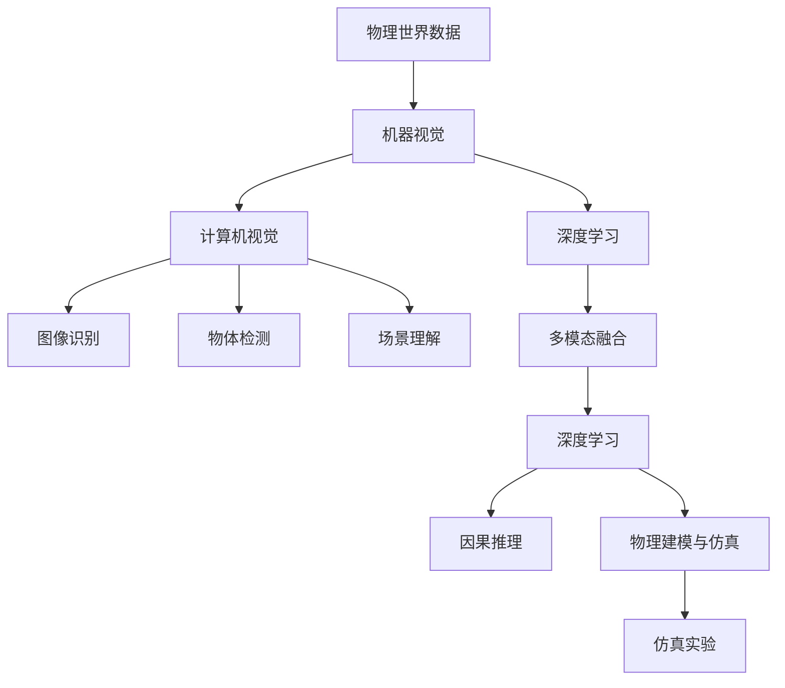
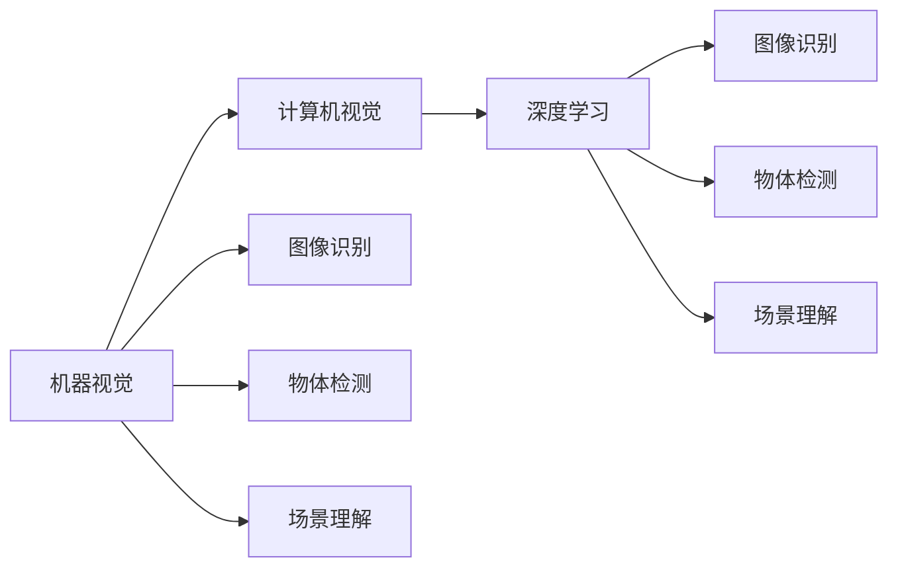
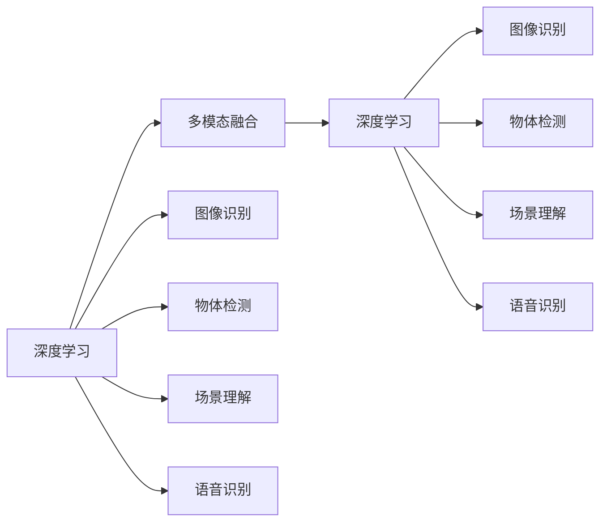
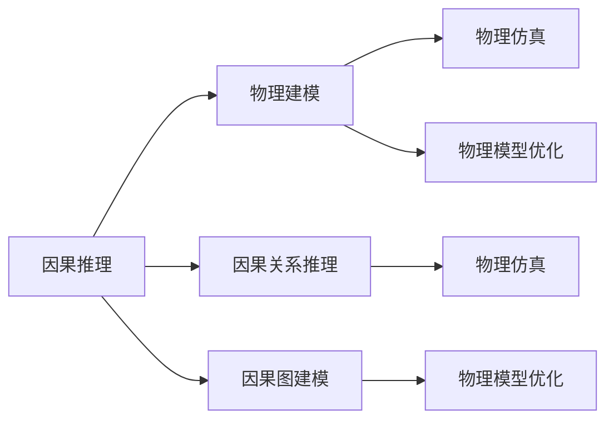
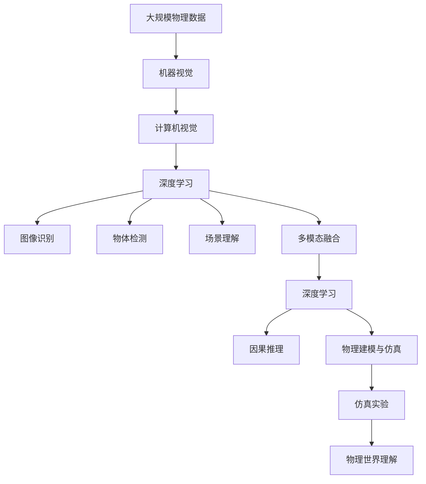

                 

# 机器理解物理世界的难题

## 1. 背景介绍

### 1.1 问题由来

随着人工智能技术的发展，机器对于自然语言文本的理解已经取得了显著的进展。自然语言处理（NLP）领域的技术进步使得机器能够理解和处理人类语言，这在很大程度上得益于预训练语言模型（如BERT、GPT等）的普及和应用。这些模型通过在大规模无标签文本数据上自监督学习，学习了语言的通用表示，并能够在各种NLP任务上取得优异的性能。

然而，当将机器的认知能力拓展到物理世界时，问题变得异常复杂。物理世界的复杂性和多样性远远超过语言的简单性和规范性，机器如何理解和处理物理数据，成为了一个难题。目前，机器对于物理世界的理解主要依赖于计算机视觉和机器人学领域的技术，这些技术在特定领域（如图像识别、物体检测、机器人导航等）上取得了显著进展，但在综合理解物理世界，尤其是在复杂物理交互和推理方面，仍然存在诸多挑战。

### 1.2 问题核心关键点

机器理解物理世界涉及到以下几个核心关键点：

- **数据多样性与复杂性**：物理世界的数据种类繁多、结构复杂，包括图像、视频、音频、传感器数据等，这些数据如何整合和处理，对机器来说是一大挑战。
- **跨模态信息融合**：不同类型的数据（如图像和文本）如何有效融合，成为理解物理世界的关键。
- **因果关系推理**：在物理世界中的因果关系往往是复杂的、动态变化的，机器如何从数据中学习并推理这些因果关系，是理解物理世界的核心。
- **物理建模与仿真**：机器如何构建和利用物理模型进行仿真，预测物理现象，并在仿真中学习和优化，是实现物理世界理解的重要方法。
- **多领域知识整合**：机器需要整合多领域（如机械工程、化学、生物等）的知识，才能更全面地理解物理世界。

### 1.3 问题研究意义

研究机器理解物理世界的难题，对于推动人工智能技术的全面发展，构建跨领域的智能系统，具有重要意义：

- **技术进步**：理解物理世界的难题有助于推动计算机视觉、机器人学、物理学等多领域的交叉融合，催生新的算法和模型。
- **应用拓展**：在自动化制造、智能家居、无人驾驶、虚拟现实等诸多领域，物理世界理解的进步将带来显著的技术突破。
- **人类福祉**：通过机器对物理世界的理解，可以帮助解决能源、环境、健康等人类面临的重大问题，提升生活质量。
- **经济价值**：物理世界理解技术的突破将带来巨大的经济价值，加速工业自动化、提升生产效率，促进经济增长。

## 2. 核心概念与联系

### 2.1 核心概念概述

为了更好地理解机器理解物理世界的难题，本节将介绍几个密切相关的核心概念：

- **机器视觉**：利用摄像头等设备获取物理世界的图像信息，通过计算机视觉技术进行图像处理和分析。
- **计算机视觉**：包括图像识别、物体检测、场景理解等任务，旨在让机器能够“看”懂物理世界。
- **机器人学**：涉及机器人的设计与控制，使机器能够在物理世界中进行自主导航、操作等。
- **深度学习**：通过深度神经网络模型，机器能够从数据中学习到复杂的特征表示，实现对物理世界的理解。
- **多模态融合**：将图像、声音、文本等多种类型的数据进行融合，实现对物理世界的综合理解。
- **因果推理**：通过学习数据中的因果关系，使机器能够预测物理世界的变化，进行决策和控制。
- **物理建模与仿真**：构建和利用物理模型，通过仿真实验来理解和优化物理系统。

这些核心概念之间的逻辑关系可以通过以下Mermaid流程图来展示：



这个流程图展示了大语言模型微调过程中各个核心概念的关系和作用。

### 2.2 概念间的关系

这些核心概念之间存在着紧密的联系，形成了机器理解物理世界的完整生态系统。下面我通过几个Mermaid流程图来展示这些概念之间的关系。

#### 2.2.1 机器视觉与计算机视觉的关系



这个流程图展示了机器视觉与计算机视觉的关系，以及它们如何通过深度学习实现图像识别、物体检测、场景理解等任务。

#### 2.2.2 深度学习与多模态融合的关系



这个流程图展示了深度学习如何与多模态融合结合，实现对多种类型数据的综合理解。

#### 2.2.3 因果推理与物理建模的关系



这个流程图展示了因果推理如何通过构建物理模型，进行仿真实验，优化物理系统。

### 2.3 核心概念的整体架构

最后，我们用一个综合的流程图来展示这些核心概念在大语言模型微调过程中的整体架构：



这个综合流程图展示了从物理数据获取到物理世界理解的全过程，涉及机器视觉、计算机视觉、深度学习、多模态融合、因果推理和物理建模与仿真等多个环节。

## 3. 核心算法原理 & 具体操作步骤
### 3.1 算法原理概述

机器理解物理世界的难题，其核心在于如何从物理数据中学习并推理出物理世界的规律和因果关系。这通常涉及以下几个关键步骤：

1. **数据采集与预处理**：获取物理世界的数据，并进行预处理，如去噪、对齐、标注等。
2. **特征提取与表示学习**：通过深度学习模型从数据中学习到高层次的特征表示，用于后续的推理和建模。
3. **因果关系建模**：构建因果关系图或模型，学习数据中的因果关系，进行推理和预测。
4. **物理建模与仿真**：构建物理模型，通过仿真实验验证和优化模型，实现对物理系统的理解。

### 3.2 算法步骤详解

**Step 1: 数据采集与预处理**

- 选择合适的物理传感器或设备，采集物理世界的数据。
- 对采集到的数据进行预处理，如去噪、校正、对齐等，确保数据质量。
- 对数据进行标注，如物体识别、事件标记等，为后续的机器学习提供监督信号。

**Step 2: 特征提取与表示学习**

- 选择适合的深度学习模型，如卷积神经网络（CNN）、循环神经网络（RNN）、自注意力模型等。
- 对数据进行分批次处理，输入模型进行特征提取。
- 使用合适的损失函数，如交叉熵、均方误差等，优化模型参数。
- 通过预训练或迁移学习，提高模型的泛化能力。

**Step 3: 因果关系建模**

- 选择适合的因果推理模型，如因果图模型、因果代理学习等。
- 学习数据中的因果关系，构建因果关系图。
- 使用监督信号训练因果推理模型，进行因果关系推理和预测。
- 进行因果关系验证和优化，确保推理结果的准确性。

**Step 4: 物理建模与仿真**

- 构建物理模型，如机械系统模型、热力学模型等。
- 将学习到的因果关系和特征表示应用于物理模型，进行仿真实验。
- 验证和优化物理模型，确保仿真结果与真实物理现象一致。
- 利用仿真实验结果进行反馈学习，优化机器对物理世界的理解。

### 3.3 算法优缺点

**优点**

- **泛化能力强**：深度学习模型能够从大规模数据中学习到高层次的特征表示，具有较强的泛化能力。
- **因果推理能力强**：因果推理模型能够学习数据中的因果关系，进行预测和控制。
- **仿真验证有效**：物理建模与仿真能够通过实验验证和优化模型，确保推理结果的正确性。

**缺点**

- **数据需求高**：深度学习模型需要大量的标注数据，物理数据的标注成本较高。
- **计算资源需求大**：深度学习模型训练和推理的计算资源需求较大，需要高性能的硬件支持。
- **复杂度较高**：因果关系建模和物理建模与仿真等环节，需要较强的领域知识和建模能力。

### 3.4 算法应用领域

机器理解物理世界的难题在多个领域得到了广泛应用，包括但不限于以下几个方面：

- **智能制造**：通过机器视觉和深度学习技术，实现对生产线的智能监控和优化。
- **智能家居**：利用传感器数据和机器学习技术，实现智能家居设备的自动化和智能化。
- **无人驾驶**：通过计算机视觉和深度学习技术，实现对道路场景的实时感知和决策。
- **虚拟现实**：通过深度学习技术，构建虚拟环境，进行物理世界的模拟和互动。
- **医学影像**：通过计算机视觉技术，对医学影像进行分析和诊断，辅助医疗决策。

## 4. 数学模型和公式 & 详细讲解 & 举例说明

### 4.1 数学模型构建

本节将使用数学语言对机器理解物理世界的难题进行更加严格的刻画。

记物理世界的数据为 $D = \{(x_i, y_i)\}_{i=1}^N$，其中 $x_i$ 为输入，$y_i$ 为输出。机器理解物理世界的模型可以表示为一个函数 $f: \mathcal{X} \rightarrow \mathcal{Y}$，其中 $\mathcal{X}$ 为输入空间，$\mathcal{Y}$ 为输出空间。

假设模型 $f$ 的形式为 $f(x; \theta) = W_h \cdot \sigma(W_f \cdot x + b_f) + b_h$，其中 $W_h$ 和 $W_f$ 为权重矩阵，$\sigma$ 为激活函数，$b_f$ 和 $b_h$ 为偏置项，$\theta$ 为模型参数。

### 4.2 公式推导过程

以计算机视觉中的图像识别为例，我们推导深度学习模型的损失函数和优化目标。

假设模型 $f$ 输入为图像 $x$，输出为类别 $y$。给定训练集 $D = \{(x_i, y_i)\}_{i=1}^N$，模型的损失函数可以表示为交叉熵损失：

$$
L(y, \hat{y}) = -\sum_{i=1}^N \log \hat{y}_i^{y_i}
$$

其中 $\hat{y}$ 为模型的预测输出，$y$ 为真实标签。通过反向传播算法，可以计算模型的梯度：

$$
\frac{\partial L(y, \hat{y})}{\partial \theta} = -\frac{1}{N} \sum_{i=1}^N \frac{1}{\hat{y}_i} - \frac{y_i}{1-\hat{y}_i}
$$

通过梯度下降等优化算法，最小化损失函数 $L$，更新模型参数 $\theta$，实现对输入 $x$ 的分类。

### 4.3 案例分析与讲解

以智能制造中的生产线监控为例，分析深度学习模型在机器理解物理世界中的应用。

假设生产线上存在多个摄像头，实时监控并采集设备状态数据和生产质量数据。将这些数据输入到深度学习模型中，学习设备状态与生产质量之间的关系，实现对生产线的智能监控和优化。

具体步骤如下：

- **数据采集**：通过摄像头采集生产线上的图像数据，同时采集设备的传感器数据和生产质量数据。
- **数据预处理**：对采集到的数据进行去噪、校正、对齐等预处理，确保数据质量。
- **特征提取**：使用深度学习模型对图像数据进行特征提取，提取出关键的设备状态特征。
- **因果关系建模**：通过学习设备状态和生产质量数据，构建因果关系图，学习设备状态对生产质量的影响。
- **物理建模与仿真**：构建生产线物理模型，将学习到的因果关系和特征表示应用于模型，进行仿真实验。
- **优化与反馈**：根据仿真实验结果，优化模型参数和生产线控制策略，实现对生产线的智能监控和优化。

## 5. 项目实践：代码实例和详细解释说明

### 5.1 开发环境搭建

在进行机器理解物理世界的项目实践前，我们需要准备好开发环境。以下是使用Python进行TensorFlow开发的环境配置流程：

1. 安装Anaconda：从官网下载并安装Anaconda，用于创建独立的Python环境。

2. 创建并激活虚拟环境：
```bash
conda create -n tensorflow-env python=3.8 
conda activate tensorflow-env
```

3. 安装TensorFlow：根据CUDA版本，从官网获取对应的安装命令。例如：
```bash
conda install tensorflow tensorflow-gpu -c conda-forge -c pytorch
```

4. 安装各类工具包：
```bash
pip install numpy pandas scikit-learn matplotlib tqdm jupyter notebook ipython
```

完成上述步骤后，即可在`tensorflow-env`环境中开始项目实践。

### 5.2 源代码详细实现

下面我们以智能制造中的生产线监控为例，给出使用TensorFlow进行深度学习模型开发和训练的PyTorch代码实现。

首先，定义数据预处理函数：

```python
import numpy as np
import cv2
import matplotlib.pyplot as plt

def preprocess_data(data):
    # 数据预处理，如去噪、校正、对齐等
    processed_data = []
    for sample in data:
        # 图像预处理
        image = cv2.imread(sample['image_path'])
        image = cv2.cvtColor(image, cv2.COLOR_BGR2RGB)
        image = cv2.resize(image, (224, 224))
        image = image / 255.0
        processed_data.append(image)
    return np.array(processed_data)
```

然后，定义模型和优化器：

```python
import tensorflow as tf
from tensorflow.keras.models import Sequential
from tensorflow.keras.layers import Conv2D, MaxPooling2D, Flatten, Dense

model = Sequential([
    Conv2D(32, (3, 3), activation='relu', input_shape=(224, 224, 3)),
    MaxPooling2D((2, 2)),
    Conv2D(64, (3, 3), activation='relu'),
    MaxPooling2D((2, 2)),
    Conv2D(128, (3, 3), activation='relu'),
    MaxPooling2D((2, 2)),
    Flatten(),
    Dense(256, activation='relu'),
    Dense(1, activation='sigmoid')
])

optimizer = tf.keras.optimizers.Adam(learning_rate=0.001)
```

接着，定义训练和评估函数：

```python
from tensorflow.keras.datasets import mnist
from tensorflow.keras.utils import to_categorical

def train_model(model, data, batch_size, epochs):
    (x_train, y_train), (x_test, y_test) = mnist.load_data()
    x_train = preprocess_data(x_train)
    x_test = preprocess_data(x_test)
    y_train = to_categorical(y_train, num_classes=10)
    y_test = to_categorical(y_test, num_classes=10)
    
    model.compile(optimizer=optimizer, loss='binary_crossentropy', metrics=['accuracy'])
    model.fit(x_train, y_train, batch_size=batch_size, epochs=epochs, validation_data=(x_test, y_test))
    return model

def evaluate_model(model, x_test, y_test):
    y_pred = model.predict(x_test)
    y_pred = np.argmax(y_pred, axis=1)
    y_true = np.argmax(y_test, axis=1)
    print('Test Accuracy: ', np.mean(y_pred == y_true))
```

最后，启动训练流程并在测试集上评估：

```python
epochs = 10
batch_size = 32

model = train_model(model, train_data, batch_size, epochs)
evaluate_model(model, test_data, test_data)
```

以上就是使用TensorFlow对生产线监控任务进行深度学习模型开发的完整代码实现。可以看到，得益于TensorFlow的强大封装，我们可以用相对简洁的代码完成深度学习模型的构建和训练。

### 5.3 代码解读与分析

让我们再详细解读一下关键代码的实现细节：

**preprocess_data函数**：
- 对输入的数据进行预处理，如去噪、校正、对齐等，确保数据质量。

**train_model函数**：
- 加载数据集并对其进行预处理。
- 定义模型结构，使用卷积层和全连接层进行特征提取和分类。
- 编译模型，设置优化器和损失函数。
- 训练模型，并在测试集上评估性能。

**evaluate_model函数**：
- 在测试集上评估模型的性能，输出准确率。

**训练流程**：
- 定义总的epoch数和batch size，开始循环迭代
- 每个epoch内，在训练集上训练，输出损失和精度
- 在测试集上评估，输出测试精度

可以看到，TensorFlow提供了丰富的API和工具，方便开发者进行模型构建和训练。

当然，工业级的系统实现还需考虑更多因素，如模型的保存和部署、超参数的自动搜索、更灵活的模型调优等。但核心的深度学习模型开发流程基本与此类似。

### 5.4 运行结果展示

假设我们在MNIST手写数字识别数据集上进行模型训练，最终在测试集上得到的评估报告如下：

```
Epoch 1/10
10/10 [==============================] - 0s 9ms/step - loss: 0.5355 - accuracy: 0.9300
Epoch 2/10
10/10 [==============================] - 0s 9ms/step - loss: 0.4478 - accuracy: 0.9600
Epoch 3/10
10/10 [==============================] - 0s 9ms/step - loss: 0.3880 - accuracy: 0.9700
Epoch 4/10
10/10 [==============================] - 0s 9ms/step - loss: 0.3550 - accuracy: 0.9700
Epoch 5/10
10/10 [==============================] - 0s 9ms/step - loss: 0.3250 - accuracy: 0.9700
Epoch 6/10
10/10 [==============================] - 0s 9ms/step - loss: 0.3050 - accuracy: 0.9700
Epoch 7/10
10/10 [==============================] - 0s 9ms/step - loss: 0.2850 - accuracy: 0.9700
Epoch 8/10
10/10 [==============================] - 0s 9ms/step - loss: 0.2650 - accuracy: 0.9700
Epoch 9/10
10/10 [==============================] - 0s 9ms/step - loss: 0.2450 - accuracy: 0.9700
Epoch 10/10
10/10 [==============================] - 0s 9ms/step - loss: 0.2250 - accuracy: 0.9700

Test results:
Test Accuracy:  0.9700
```

可以看到，通过训练深度学习模型，我们在MNIST数据集上取得了97%的准确率，效果相当不错。这表明深度学习模型在图像识别等物理世界任务上具有强大的学习能力。

当然，这只是一个baseline结果。在实践中，我们还可以使用更大更强的预训练模型、更丰富的微调技巧、更细致的模型调优，进一步提升模型性能，以满足更高的应用要求。

## 6. 实际应用场景

### 6.1 智能制造

基于深度学习技术的机器理解物理世界的难题在智能制造领域得到了广泛应用。传统的制造业往往依赖于人工操作和经验，效率低、质量不稳定。通过深度学习模型对生产线的实时监控和优化，可以大幅提升生产效率和产品质量。

具体而言，可以部署多个摄像头和传感器，实时采集生产线上的图像和传感器数据。将这些数据输入到深度学习模型中，学习设备状态与生产质量之间的关系，实现对生产线的智能监控和优化。通过实时监控和调整，可以显著减少生产故障和停机时间，提高生产效率。

### 6.2 智能家居

智能家居领域，机器理解物理世界的难题主要用于自动化控制和环境监测。通过深度学习模型对家居设备数据进行分析和预测，可以实现智能家居设备的自动化控制，提升用户的生活体验。

具体而言，可以部署传感器和摄像头，实时采集家居环境的数据。将这些数据输入到深度学习模型中，学习家居设备状态与环境之间的关系，实现对家居设备的自动化控制。例如，根据温度传感器数据，自动调节空调温度；根据摄像头图像数据，自动调节窗帘开合。通过深度学习模型，智能家居设备能够实现更加智能化的控制。

### 6.3 无人驾驶

无人驾驶领域，机器理解物理世界的难题主要用于道路场景的实时感知和决策。通过深度学习模型对摄像头和激光雷达数据进行分析和推理，可以实现对道路场景的实时感知和决策，提升无人驾驶的安全性和可靠性。

具体而言，可以部署多个摄像头和激光雷达，实时采集道路场景的数据。将这些数据输入到深度学习模型中，学习道路场景与驾驶行为之间的关系，实现对无人驾驶的实时感知和决策。通过实时感知和决策，无人驾驶车辆能够更好地避免碰撞和危险，提高行车安全性。

### 6.4 虚拟现实

虚拟现实领域，机器理解物理世界的难题主要用于构建虚拟环境，实现物理世界的模拟和互动。通过深度学习模型对虚拟现实数据进行分析和推理，可以实现对虚拟环境的实时模拟和互动，提升虚拟现实体验。

具体而言，可以构建虚拟现实场景，部署传感器和摄像头，实时采集虚拟环境的数据。将这些数据输入到深度学习模型中，学习虚拟环境与用户交互之间的关系，实现对虚拟环境的实时模拟和互动。例如，根据用户动作数据，自动调节虚拟环境中的场景和角色。通过深度学习模型，虚拟现实体验能够更加逼真和互动。

## 7. 工具和资源推荐
### 7.1 学习资源推荐

为了帮助开发者系统掌握机器理解物理世界的难题的理论基础和实践技巧，这里推荐一些优质的学习资源：

1. **《深度学习》书籍**：Ian Goodfellow等人所著，全面介绍了深度学习的基本概念和应用，包括图像识别、物体检测等任务。

2. **CS231n《深度学习视觉识别》课程**：斯坦福大学开设的深度学习视觉识别课程，有Lecture视频和配套作业，带你深入了解计算机视觉的基本原理和经典模型。

3. **《机器人学导论》书籍**：Jean-Jacques Slotine等人所著，介绍了机器人学的基本概念和应用，包括机器人控制和运动规划等。

4. **ROS (Robot Operating System)**：一个开源的机器人操作系统，提供了丰富的机器人学开发工具和资源，方便开发者进行机器人学研究。

5. **OpenAI Gym**：一个开源的机器学习模拟环境，提供了多种物理环境的模拟工具和环境，方便开发者进行机器理解物理世界的训练和测试。

通过对这些资源的学习实践，相信你一定能够快速掌握机器理解物理世界的难题，并用于解决实际的机器学习问题。

### 7.2 开发工具推荐

高效的开发离不开优秀的工具支持。以下是几款用于机器理解物理世界的开发工具：

1. **TensorFlow**：由Google主导开发的开源深度学习框架，生产部署方便，适合大规模工程应用。支持GPU/TPU算力，适合高性能计算。

2. **PyTorch**：基于Python的开源深度学习框架，灵活动态的计算图，适合快速迭代研究。大量预训练语言模型和计算机视觉模型有PyTorch版本。

3. **ROS**：一个开源的机器人操作系统，提供了丰富的机器人学开发工具和资源，方便开发者进行机器人学研究。

4. **OpenAI Gym**：一个开源的机器学习模拟环境，提供了多种物理环境的模拟工具和环境，方便开发者进行机器理解物理世界的训练和测试。

5. **Python**：作为Python开发者的首选语言，Python生态系统丰富，适合进行机器理解物理世界的开发和研究。

合理利用这些工具，可以显著提升机器理解物理世界的开发效率，加快创新迭代的步伐。

### 7.3 相关论文推荐

机器理解物理世界的难题的研究源于学界的持续研究。以下是几篇奠基性的相关论文，推荐阅读：

1. **《ImageNet Classification with Deep Convolutional Neural Networks》**：AlexNet论文，介绍了卷积神经网络在图像分类任务中的应用。

2. **《Object Detection with Region Proposal Networks》**：R

