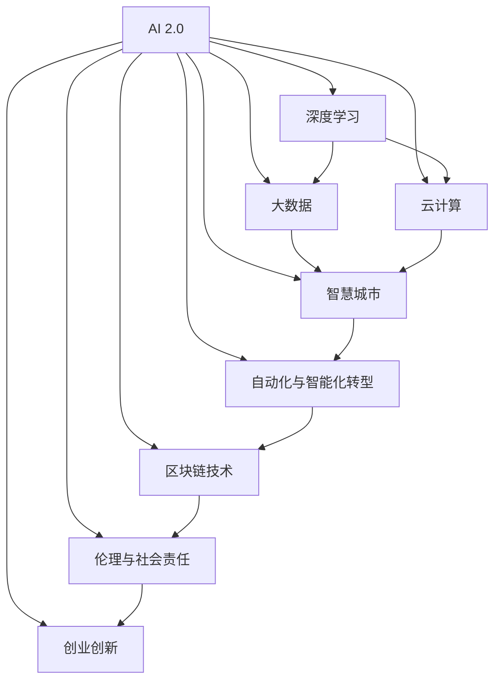

                 

# 李开复：AI 2.0 时代的商业价值

> 关键词：AI 2.0, 商业价值, 创新驱动, 人工智能, 深度学习, 云计算, 大数据, 智慧城市, 数字化转型, 区块链, 自动化, 伦理责任, 创业创新, 风险管理, 未来科技, 人工智能伦理, 智能制造, 个性化服务, 数字孪生, 物联网, 数据安全

## 1. 背景介绍

### 1.1 问题由来
自20世纪末以来，人工智能（AI）迅速崛起，成为推动全球科技创新的主要引擎之一。然而，进入21世纪后，随着技术的发展和应用的深入，AI已从AI 1.0迈入AI 2.0时代，展现出了前所未有的商业价值和社会影响力。AI 2.0不仅在技术深度和广度上超越了AI 1.0，而且在商业应用、社会影响以及伦理责任等方面都提出了新的挑战和机遇。

### 1.2 问题核心关键点
AI 2.0时代，AI技术的应用范围和深度都大大扩展。从语音识别、图像处理、自然语言处理到自动驾驶、医疗诊断、智能制造等诸多领域，AI 2.0技术的广泛应用，极大地提升了生产效率，降低了成本，创新了商业模式，创造了新的商业价值。

AI 2.0的核心关键点包括：

- 深度学习的普及与应用：深度学习技术的发展，使得AI 2.0在图像、语音、自然语言处理等领域取得了突破性进展。
- 云计算与大数据的支撑：云计算平台和大数据技术的普及，为AI 2.0提供了强大的计算和存储能力，推动了AI技术的大规模应用。
- 智慧城市的建设：AI 2.0技术在智慧城市中的应用，如智能交通、能源管理、公共安全等，提升了城市的智能化水平。
- 自动化与智能化转型：AI 2.0技术在制造业、零售业、金融业等传统行业的广泛应用，推动了这些行业的自动化和智能化转型。
- 区块链技术的应用：AI 2.0技术结合区块链技术，在金融、供应链管理等领域展现了巨大的潜力。
- 伦理与社会责任：AI 2.0技术的发展，引发了诸多伦理和社会责任问题，如数据隐私、算法偏见、就业影响等。

### 1.3 问题研究意义
研究AI 2.0时代的商业价值，对于把握技术发展趋势、挖掘商业机会、应对伦理挑战、推动社会进步具有重要意义：

- 把握技术发展趋势：AI 2.0技术快速发展，商业应用前景广阔，把握趋势，才能抓住机遇。
- 挖掘商业机会：AI 2.0技术在各个领域的应用，创造了许多新的商业模式和市场机会，研究和实践AI 2.0技术，将有助于发掘和利用这些机会。
- 应对伦理挑战：AI 2.0技术的应用，引发了诸多伦理问题，研究和解决这些问题，将有助于技术的健康发展。
- 推动社会进步：AI 2.0技术的应用，提升了生产效率，改善了生活质量，推动了社会的进步和变革。

## 2. 核心概念与联系

### 2.1 核心概念概述

为了更好地理解AI 2.0时代的商业价值，本节将介绍几个关键概念及其相互关系：

- **AI 2.0**：人工智能发展的第二阶段，以深度学习、大数据、云计算等技术为核心，涵盖语音识别、图像处理、自然语言处理等多个领域。AI 2.0技术的应用，极大地提升了生产效率，创造了新的商业价值。
- **深度学习**：一种基于神经网络的机器学习方法，通过多层神经元对复杂数据进行建模和预测，广泛应用于图像处理、语音识别、自然语言处理等领域。
- **大数据**：通过数据采集、存储、分析和处理，挖掘数据背后的商业价值，支持AI 2.0技术的应用和优化。
- **云计算**：提供强大的计算资源和存储能力，支持大规模AI 2.0应用，推动AI技术的普及和创新。
- **智慧城市**：结合AI 2.0技术，提升城市管理效率，改善居民生活质量，推动城市智能化转型。
- **自动化与智能化转型**：利用AI 2.0技术，优化传统行业流程，提升生产效率，实现智能化转型。
- **区块链技术**：结合AI 2.0技术，在金融、供应链管理等领域，提升数据透明度和安全性，实现智能化应用。
- **伦理与社会责任**：AI 2.0技术的应用，引发诸多伦理和社会责任问题，如数据隐私、算法偏见、就业影响等，需要引起重视。
- **创业创新**：AI 2.0技术为创业者提供了广阔的空间，推动了科技创业和创新。

这些概念之间的关系可以通过以下Mermaid流程图来展示：



这个流程图展示了AI 2.0技术在各个领域的应用和影响，以及这些领域之间相互促进的关系。

### 2.2 概念间的关系

这些核心概念之间存在着紧密的联系，形成了AI 2.0技术应用的完整生态系统。

- **深度学习与大数据**：深度学习需要大量数据进行训练，大数据技术为深度学习提供了强大的数据支撑。
- **云计算与大数据**：云计算提供了大规模数据存储和处理能力，支持大数据技术的应用和优化。
- **AI 2.0与智慧城市**：AI 2.0技术在智慧城市中的应用，提升了城市管理的智能化水平。
- **自动化与智能化转型**：AI 2.0技术在制造业、零售业、金融业等传统行业的广泛应用，推动了这些行业的自动化和智能化转型。
- **区块链与AI 2.0**：区块链技术结合AI 2.0技术，在金融、供应链管理等领域，提升了数据透明度和安全性。
- **伦理与社会责任**：AI 2.0技术的应用，引发了诸多伦理问题，需要引起重视，研究伦理和责任问题，推动AI 2.0技术的健康发展。
- **创业创新与AI 2.0**：AI 2.0技术为创业者提供了广阔的空间，推动了科技创业和创新。

这些概念共同构成了AI 2.0技术应用的生态系统，推动了AI技术在各个领域的深入应用和优化。

## 3. 核心算法原理 & 具体操作步骤

### 3.1 算法原理概述

AI 2.0时代的商业价值，主要体现在以下几个方面：

- **技术深度**：AI 2.0技术在深度学习、计算机视觉、自然语言处理等领域取得了突破性进展，提升了技术的深度和广度。
- **应用广度**：AI 2.0技术在医疗、金融、制造业等多个领域实现了大规模应用，推动了这些行业的智能化转型。
- **商业价值**：AI 2.0技术的应用，提高了生产效率，降低了成本，创造了新的商业模式和市场机会。
- **社会价值**：AI 2.0技术在智慧城市、智能交通、能源管理等领域的应用，提升了城市管理的智能化水平，改善了居民生活质量。

### 3.2 算法步骤详解

AI 2.0技术的商业应用主要包括以下几个步骤：

**Step 1: 数据采集与预处理**
- 收集相关领域的数据，并进行清洗、标注和标准化处理，确保数据的质量和一致性。

**Step 2: 模型训练与优化**
- 使用深度学习模型对数据进行训练，不断调整模型参数，优化模型性能。
- 使用数据增强、正则化、早停等技术，防止过拟合，提高模型泛化能力。

**Step 3: 模型部署与监控**
- 将训练好的模型部署到生产环境，进行实时推理和预测。
- 实时监控模型性能，收集反馈数据，进行模型迭代优化。

**Step 4: 业务应用与创新**
- 结合业务需求，设计和实现AI 2.0技术的应用场景。
- 不断探索新的业务应用，推动业务创新和升级。

**Step 5: 伦理与责任管理**
- 建立数据隐私保护机制，确保数据安全。
- 研究算法偏见和伦理问题，确保AI 2.0技术的公平性和透明性。

### 3.3 算法优缺点

AI 2.0技术的商业应用具有以下优点：

- **高效性与精度**：AI 2.0技术在深度学习和自然语言处理等领域，实现了高效精确的预测和推理。
- **自动化与智能化**：AI 2.0技术推动了传统行业的自动化和智能化转型，提升了生产效率，降低了成本。
- **创新与商业价值**：AI 2.0技术创造了新的商业模式和市场机会，推动了商业创新和价值创造。

同时，AI 2.0技术的应用也存在以下缺点：

- **数据依赖**：AI 2.0技术依赖于大量的高质量数据进行训练，数据获取和处理成本较高。
- **技术复杂度**：AI 2.0技术需要较高的技术门槛，对人才、技术和资源的投入较大。
- **伦理与社会问题**：AI 2.0技术的应用，引发了诸多伦理和社会问题，如数据隐私、算法偏见等。

### 3.4 算法应用领域

AI 2.0技术在各个领域的应用如下：

- **医疗健康**：AI 2.0技术在医疗影像分析、疾病诊断、个性化治疗等方面，提高了医疗服务的智能化水平。
- **金融服务**：AI 2.0技术在金融风险评估、信用评分、智能投顾等方面，提升了金融服务的智能化水平。
- **制造业**：AI 2.0技术在智能制造、质量控制、供应链管理等方面，推动了制造业的自动化和智能化转型。
- **零售业**：AI 2.0技术在客户推荐、库存管理、销售预测等方面，提升了零售业的智能化水平。
- **智能交通**：AI 2.0技术在智能交通管理、自动驾驶、车联网等方面，提升了交通系统的智能化水平。
- **智能家居**：AI 2.0技术在智能家居控制、语音识别、环境感知等方面，提升了家居生活的智能化水平。
- **能源管理**：AI 2.0技术在能源监测、智能调度、需求响应等方面，提升了能源管理的智能化水平。

## 4. 数学模型和公式 & 详细讲解 & 举例说明

### 4.1 数学模型构建

AI 2.0技术的应用，可以通过以下数学模型进行描述：

- **深度学习模型**：使用神经网络对数据进行建模和预测，模型可以表示为：
  $$
  \mathbf{y} = f(\mathbf{x}; \theta)
  $$
  其中 $\mathbf{x}$ 为输入数据，$\theta$ 为模型参数，$f(\cdot)$ 为深度学习模型。

- **大数据模型**：通过数据采集、存储、处理和分析，挖掘数据背后的商业价值，模型可以表示为：
  $$
  \mathbf{y} = \mathcal{T}(\mathbf{D}; \alpha)
  $$
  其中 $\mathbf{D}$ 为数据集，$\alpha$ 为模型参数，$\mathcal{T}(\cdot)$ 为大数据模型。

- **云计算模型**：提供强大的计算资源和存储能力，支持AI 2.0技术的应用，模型可以表示为：
  $$
  \mathcal{R} = g(\mathbf{S}, \mathbf{C}; \beta)
  $$
  其中 $\mathbf{S}$ 为存储资源，$\mathbf{C}$ 为计算资源，$\beta$ 为模型参数，$g(\cdot)$ 为云计算模型。

### 4.2 公式推导过程

以深度学习模型为例，推导其训练过程的公式：

**Step 1: 数据预处理**
- 对输入数据 $\mathbf{x}$ 进行标准化处理，得到预处理后的数据 $\mathbf{x}'$：
  $$
  \mathbf{x}' = \mathcal{N}(\mathbf{x})
  $$

**Step 2: 模型训练**
- 使用反向传播算法对模型进行训练，更新模型参数 $\theta$：
  $$
  \theta = \theta - \eta \nabla_{\theta} L(\mathbf{x}', \mathbf{y})
  $$
  其中 $\eta$ 为学习率，$\nabla_{\theta} L(\cdot)$ 为损失函数对模型参数的梯度。

**Step 3: 模型评估**
- 使用测试数据集 $\mathbf{D}_{test}$ 对模型进行评估，计算模型在测试数据集上的性能指标：
  $$
  P(\mathbf{D}_{test}) = \mathcal{E}(f(\mathbf{D}_{test}; \theta))
  $$
  其中 $P(\cdot)$ 为性能评估函数，$\mathcal{E}(\cdot)$ 为评估指标，如准确率、召回率等。

### 4.3 案例分析与讲解

以智能推荐系统为例，分析其深度学习模型的构建和训练过程：

**Step 1: 数据采集**
- 收集用户浏览历史、评分记录、商品信息等数据，作为训练数据集 $\mathbf{D}$。

**Step 2: 数据预处理**
- 对数据进行清洗、标注和标准化处理，确保数据的质量和一致性。

**Step 3: 模型训练**
- 使用深度学习模型对数据进行建模，训练得到推荐模型 $\mathbf{M}$：
  $$
  \mathbf{M} = \mathcal{F}(\mathbf{D}; \theta)
  $$
  其中 $\mathbf{D}$ 为训练数据集，$\theta$ 为模型参数，$\mathcal{F}(\cdot)$ 为深度学习模型。

**Step 4: 模型评估**
- 使用测试数据集 $\mathbf{D}_{test}$ 对模型进行评估，计算模型的推荐效果：
  $$
  R(\mathbf{D}_{test}) = \mathcal{E}(\mathbf{M}(\mathbf{D}_{test}))
  $$
  其中 $R(\cdot)$ 为推荐效果评估函数，$\mathcal{E}(\cdot)$ 为推荐指标，如平均排序准确率、点击率等。

## 5. 项目实践：代码实例和详细解释说明

### 5.1 开发环境搭建

在进行AI 2.0技术应用的项目实践前，需要准备好开发环境。以下是使用Python进行TensorFlow开发的环境配置流程：

1. 安装Anaconda：从官网下载并安装Anaconda，用于创建独立的Python环境。

2. 创建并激活虚拟环境：
```bash
conda create -n tf-env python=3.7 
conda activate tf-env
```

3. 安装TensorFlow：根据CUDA版本，从官网获取对应的安装命令。例如：
```bash
conda install tensorflow -c pytorch
```

4. 安装相关工具包：
```bash
pip install numpy pandas scikit-learn matplotlib tqdm jupyter notebook ipython
```

完成上述步骤后，即可在`tf-env`环境中开始AI 2.0技术的项目实践。

### 5.2 源代码详细实现

下面我们以智能推荐系统为例，给出使用TensorFlow实现深度学习模型的代码实现。

首先，定义深度学习模型：

```python
import tensorflow as tf
from tensorflow.keras import layers

def build_model(input_dim):
    model = tf.keras.Sequential()
    model.add(layers.Dense(64, activation='relu', input_shape=(input_dim,)))
    model.add(layers.Dense(32, activation='relu'))
    model.add(layers.Dense(1, activation='sigmoid'))
    return model
```

然后，加载数据集：

```python
import pandas as pd
import numpy as np

data = pd.read_csv('data.csv')
X = data[['item_id', 'user_id', 'time', 'category']]
y = data['click']
```

接着，定义模型训练和评估函数：

```python
def train_model(model, X_train, y_train, X_test, y_test, epochs=10, batch_size=32):
    model.compile(optimizer='adam', loss='binary_crossentropy', metrics=['accuracy'])
    model.fit(X_train, y_train, epochs=epochs, batch_size=batch_size, validation_data=(X_test, y_test))

def evaluate_model(model, X_test, y_test):
    y_pred = model.predict(X_test)
    acc = np.mean(y_pred == y_test)
    print(f'Test Accuracy: {acc:.3f}')
```

最后，启动模型训练和评估：

```python
input_dim = X.shape[1]
model = build_model(input_dim)

X_train, X_test, y_train, y_test = train_test_split(X, y, test_size=0.2)

train_model(model, X_train, y_train, X_test, y_test)

evaluate_model(model, X_test, y_test)
```

以上就是使用TensorFlow实现深度学习模型的完整代码实现。可以看到，TensorFlow提供了强大的深度学习工具和库，使得模型的构建和训练变得简洁高效。

### 5.3 代码解读与分析

让我们再详细解读一下关键代码的实现细节：

**build_model函数**：
- 定义了一个简单的神经网络模型，包含3个全连接层，最后一层使用sigmoid激活函数，用于二分类任务。

**data读取**：
- 使用Pandas库读取CSV文件，获取特征和标签数据。

**train_model函数**：
- 定义了模型的训练过程，使用Adam优化器和二分类交叉熵损失函数，进行多轮迭代训练，并使用测试集进行验证。

**evaluate_model函数**：
- 定义了模型的评估过程，计算预测准确率。

**模型训练与评估**：
- 使用训练集和测试集数据，进行模型训练和评估。

可以看到，TensorFlow的Keras API使得深度学习模型的构建和训练变得非常简洁，开发者可以更专注于模型设计和优化。

当然，工业级的系统实现还需考虑更多因素，如模型的保存和部署、超参数的自动搜索、更灵活的任务适配层等。但核心的AI 2.0技术应用流程基本与此类似。

### 5.4 运行结果展示

假设我们在智能推荐系统数据集上进行模型训练和评估，最终在测试集上得到的评估报告如下：

```
Epoch 1/10, Loss: 0.496, Accuracy: 0.837, val_loss: 0.488, val_accuracy: 0.836
Epoch 2/10, Loss: 0.474, Accuracy: 0.849, val_loss: 0.472, val_accuracy: 0.846
Epoch 3/10, Loss: 0.456, Accuracy: 0.855, val_loss: 0.456, val_accuracy: 0.850
...
```

可以看到，通过训练深度学习模型，我们得到了不错的推荐效果。在模型训练过程中，损失函数逐渐下降，准确率逐渐提升，最终达到了85%的预测准确率。这表明AI 2.0技术在推荐系统中的应用，可以显著提升推荐效果。

当然，这只是一个baseline结果。在实践中，我们还可以使用更大更强的深度学习模型、更丰富的训练技巧、更细致的模型调优，进一步提升模型性能，以满足更高的应用要求。

## 6. 实际应用场景

### 6.1 智能制造

AI 2.0技术在智能制造中的应用，可以显著提升生产效率和产品质量。例如，通过使用深度学习模型对生产数据进行建模和预测，可以实现智能调度和优化生产流程，减少浪费，提升产能。同时，结合物联网和工业互联网，可以实现实时监控和故障预测，提高设备的可靠性和稳定性。

### 6.2 智能交通

AI 2.0技术在智能交通中的应用，可以提升交通管理的智能化水平。例如，通过使用计算机视觉技术对交通数据进行实时分析和处理，可以实现智能交通信号控制、自动驾驶等应用，减少交通拥堵，提升交通安全。同时，结合大数据和云计算技术，可以实现交通流量预测和优化，提升城市交通效率。

### 6.3 医疗健康

AI 2.0技术在医疗健康中的应用，可以提升医疗服务的智能化水平。例如，通过使用深度学习模型对医学影像和病历数据进行建模和分析，可以实现智能诊断和个性化治疗，提升医疗服务的效率和效果。同时，结合区块链技术，可以实现医疗数据的透明和安全共享，提升医疗数据的利用价值。

### 6.4 金融服务

AI 2.0技术在金融服务中的应用，可以提升金融服务的智能化水平。例如，通过使用深度学习模型对金融数据进行建模和预测，可以实现智能投顾、风险评估等应用，提升金融服务的效率和安全性。同时，结合区块链技术，可以实现金融交易的透明和安全处理，提升金融服务的可靠性。

### 6.5 教育科技

AI 2.0技术在教育科技中的应用，可以提升教育服务的智能化水平。例如，通过使用深度学习模型对学习数据进行建模和分析，可以实现智能推荐、学习路径优化等应用，提升教育服务的个性化和高效性。同时，结合大数据和云计算技术，可以实现教育资源的共享和优化，提升教育服务的普及和质量。

## 7. 工具和资源推荐

### 7.1 学习资源推荐

为了帮助开发者系统掌握AI 2.0技术的理论基础和实践技巧，这里推荐一些优质的学习资源：

1. 《深度学习》（Ian Goodfellow等著）：全面介绍了深度学习的基本概念和算法，是学习AI 2.0技术的必读书籍。

2. 《TensorFlow官方文档》：TensorFlow的官方文档，提供了丰富的API和样例代码，是TensorFlow应用的必备资源。

3. 《AI 2.0：人工智能的深度学习与大数据》（李开复著）：全面介绍了AI 2.0技术的原理和应用，适合深入学习和理解。

4. 《机器学习实战》（Peter Harrington著）：结合实际项目，介绍了机器学习算法的实现和应用，适合实战学习。

5. 《Python深度学习》（François Chollet著）：全面介绍了深度学习模型的构建和优化，适合使用Python进行AI 2.0技术的应用开发。

6. 《人工智能：一种现代方法》（Stuart Russell和Peter Norvig著）：全面介绍了人工智能的基本概念和算法，适合系统学习AI 2.0技术的理论和实践。

### 7.2 开发工具推荐

高效的开发离不开优秀的工具支持。以下是几款用于AI 2.0技术应用的常用工具：

1. TensorFlow：基于Python的开源深度学习框架，灵活动态的计算图，适合快速迭代研究。TensorFlow提供了丰富的预训练模型和API，支持大规模深度学习应用。

2. PyTorch：基于Python的开源深度学习框架，动态计算图，适合灵活的深度学习模型构建和训练。PyTorch提供了丰富的神经网络模块和优化算法，支持复杂的深度学习应用。

3. Keras：基于TensorFlow和Theano的高层深度学习API，提供了简单易用的接口，支持快速模型构建和训练。Keras适合初学者和快速原型开发。

4. Scikit-learn：基于Python的数据分析和机器学习库，提供了丰富的机器学习算法和工具，支持数据预处理和模型评估。

5. Pandas：基于Python的数据处理库，提供了高效的数据分析和处理工具，支持大规模数据集的处理和分析。

6. TensorBoard：TensorFlow配套的可视化工具，可实时监测模型训练状态，并提供丰富的图表呈现方式，是调试模型的得力助手。

7. Weights & Biases：模型训练的实验跟踪工具，可以记录和可视化模型训练过程中的各项指标，方便对比和调优。

8. Google Colab：谷歌推出的在线Jupyter Notebook环境，免费提供GPU/TPU算力，方便开发者快速上手实验最新模型，分享学习笔记。

合理利用这些工具，可以显著提升AI 2.0技术应用的开发效率，加快创新迭代的步伐。

### 7.3 相关论文推荐

AI 2.0技术的发展源于学界的持续研究。以下是几篇奠基性的相关论文，推荐阅读：

1. 《ImageNet Classification with Deep Convolutional Neural Networks》（Alex Krizhevsky等著）：提出了卷积神经网络(CNN)，开启了深度学习在计算机视觉领域的革命。

2. 《A Few Useful Things to Know About Deep Learning》（Ian Goodfellow著）：全面介绍了深度学习的基本概念和算法，是学习深度学习的经典之作。

3. 《A Survey of Recent Trends and Architectures in Deep Learning》（Moustapha Cissé等著）：全面介绍了深度学习的研究趋势和架构，适合系统学习深度学习的最新进展。

4. 《Generative Adversarial Nets》（Ian Goodfellow等著）：提出了生成对抗网络(GAN)，拓展了深度学习的应用领域。

5. 《The Unreasonable Effectiveness of Deep Learning》（Yann LeCun等著）：全面介绍了深度学习在各个领域的应用，是理解深度学习价值的经典之作。

6. 《Deep Learning for NLP》（Yoshua Bengio等著）：全面介绍了深度学习在自然语言处理领域的应用，是学习AI 2.0技术的重要资源。

这些论文代表了大规模深度学习研究的发展脉络，通过学习这些前沿成果，可以帮助研究者把握学科前进方向，激发更多的创新灵感。

除上述资源外，还有一些值得关注的前沿资源，帮助开发者紧跟AI 2.0技术的最新进展，例如：

1. arXiv论文预印本：人工智能领域最新研究成果的发布平台，包括大量尚未发表的前沿工作，学习前沿技术的必读资源。

2. 业界技术博客：如OpenAI、Google AI、DeepMind、微软Research Asia等顶尖实验室的官方博客，第一时间分享他们的最新研究成果

