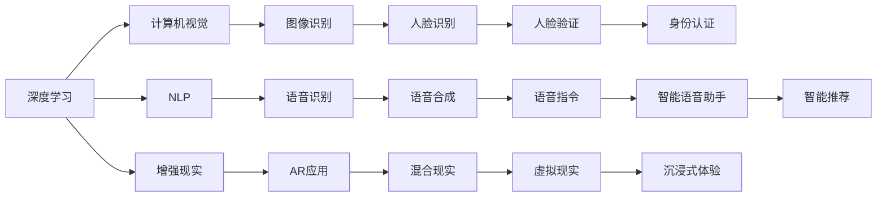

                 

# 李开复：苹果发布AI应用的未来

> 关键词：苹果, 人工智能, 应用未来, AI, 创新, 技术发展, 前沿应用

## 1. 背景介绍

近年来，苹果公司在其各类产品和服务中，持续推进人工智能（AI）的应用，以期通过AI技术的创新来提升用户体验和业务效率。本文将深入探讨苹果公司在AI应用领域的最新进展、技术策略以及未来发展方向。

### 1.1 苹果在AI领域的最新进展

苹果公司在AI领域的研发和应用已经取得了显著的进展。其最新的AI应用主要集中于以下几个方面：

1. **自然语言处理（NLP）**：通过Siri等智能助手，苹果公司在语音识别和自然语言理解方面取得了长足进步。
2. **图像识别和计算机视觉**：iPhone X及后续机型内置的Face ID功能，使得苹果在人脸识别和图像分析方面走在了行业前沿。
3. **增强现实（AR）**：苹果通过ARKit框架，推动了增强现实技术在移动设备上的普及和应用。
4. **机器学习（ML）**：苹果公司通过其机器学习框架Core ML，使得开发者可以轻松将深度学习模型集成到iOS和macOS应用中。
5. **数据分析和隐私保护**：苹果在隐私保护方面的创新，如差分隐私技术，确保了用户数据的安全。

### 1.2 苹果AI应用的现状与挑战

尽管苹果在AI领域取得了许多成就，但也面临一些挑战：

1. **算力限制**：iPhone等移动设备的算力限制使得许多复杂的AI应用难以实现。
2. **数据隐私**：在隐私保护方面需要更严格的监管和创新技术。
3. **应用场景有限**：虽然有诸多创新应用，但AI在更多垂直领域的应用仍待开发。
4. **开发者生态**：需要更多的开发者支持和完善的生态系统来推动AI应用的普及。

## 2. 核心概念与联系

### 2.1 核心概念概述

要深入理解苹果的AI应用，需要掌握以下核心概念：

1. **深度学习**：通过多层神经网络进行模式识别和学习。
2. **计算机视觉**：使计算机能够“看”和理解图像和视频内容。
3. **自然语言处理**：使计算机能够“听”和理解人类语言。
4. **增强现实**：将虚拟信息与现实世界结合，提供沉浸式体验。
5. **差分隐私**：在数据分析中保护个人隐私的技术。

这些核心概念之间有着密切的联系，共同构成了苹果AI应用的基础。

### 2.2 概念间的关系

通过以下Mermaid流程图展示这些核心概念之间的关系：



这些核心概念通过不同技术手段，共同支撑着苹果在AI领域的各类应用。

## 3. 核心算法原理 & 具体操作步骤
### 3.1 算法原理概述

苹果公司的AI应用主要基于深度学习、计算机视觉、自然语言处理等核心技术。这些技术的核心算法原理主要包括：

1. **卷积神经网络（CNN）**：用于图像识别和计算机视觉任务。
2. **循环神经网络（RNN）**：用于自然语言处理和语音识别任务。
3. **注意力机制（Attention）**：用于提升模型的信息处理能力。
4. **生成对抗网络（GAN）**：用于图像生成和增强现实任务。
5. **差分隐私算法**：用于保护数据隐私。

这些算法通过不同的架构和机制，共同构建了苹果AI应用的技术基础。

### 3.2 算法步骤详解

苹果AI应用的开发和部署主要遵循以下步骤：

1. **数据收集与预处理**：收集和整理所需的数据集，进行数据清洗和预处理。
2. **模型训练与优化**：使用深度学习框架进行模型训练，并使用优化算法进行模型优化。
3. **模型集成与部署**：将训练好的模型集成到应用中，并部署到移动设备或服务器上。
4. **用户测试与反馈**：通过用户测试收集反馈，不断优化模型和应用。
5. **隐私保护与合规**：在模型部署和使用过程中，确保数据隐私和符合相关法规。

### 3.3 算法优缺点

苹果AI应用的优点包括：

1. **用户体验优化**：通过AI技术提升用户体验，如智能语音助手、增强现实等。
2. **业务效率提升**：通过AI自动化流程，提升业务效率和生产力。
3. **数据隐私保护**：在数据处理和分析中，采用差分隐私等技术保护用户隐私。

同时，这些应用也面临一些挑战：

1. **数据隐私问题**：如何在保护用户隐私的同时，充分利用数据进行AI训练。
2. **设备算力限制**：如何在资源有限的移动设备上高效运行复杂的AI模型。
3. **模型可解释性**：如何提高AI模型的可解释性，增强用户信任。
4. **跨平台兼容性**：如何确保AI应用在不同设备和平台上的兼容性。

### 3.4 算法应用领域

苹果AI应用主要应用于以下几个领域：

1. **移动设备**：如iPhone、iPad等设备上的智能助手、图像识别和增强现实等。
2. **平台服务**：如Siri、Face ID等平台服务，提升用户体验。
3. **智能硬件**：如Apple Watch、AirPods等智能硬件，提供个性化服务和健康监测。
4. **企业应用**：如企业内部管理系统，通过AI技术提升工作效率和决策支持。

## 4. 数学模型和公式 & 详细讲解  
### 4.1 数学模型构建

苹果AI应用的数学模型主要包括以下几个部分：

1. **卷积神经网络（CNN）**：
   - 输入：图像或视频数据
   - 输出：分类标签或目标检测结果
   - 公式：$$y = \sigma(\mathbf{W}x + \mathbf{b})$$

2. **循环神经网络（RNN）**：
   - 输入：序列数据（如文本、语音）
   - 输出：序列标签或语义表示
   - 公式：$$\mathbf{h}_t = \tanh(\mathbf{W}[\mathbf{x}_t, \mathbf{h}_{t-1}])$$

3. **注意力机制（Attention）**：
   - 输入：查询向量、键向量、值向量
   - 输出：加权后的向量
   - 公式：$$\alpha = \frac{e^{\mathbf{q}^\top \mathbf{k}}}{\sum_{i=1}^{n} e^{\mathbf{q}^\top \mathbf{k}}}$$

4. **生成对抗网络（GAN）**：
   - 输入：噪声向量
   - 输出：生成的图像或视频
   - 公式：$$\mathbf{x} = G(\mathbf{z})$$

5. **差分隐私算法**：
   - 输入：原始数据集
   - 输出：差分隐私处理后的数据集
   - 公式：$$\mathbf{x}' = \mathbf{x} + \mathbf{N}$$

### 4.2 公式推导过程

以CNN为例，推导其基本公式：

- **输入**：图像数据 $x$
- **隐藏层**：经过卷积、池化等操作后，得到特征图 $h$
- **输出层**：经过全连接层和激活函数，得到分类结果 $y$

公式为：$$y = \sigma(\mathbf{W}h + \mathbf{b})$$

其中 $\mathbf{W}$ 和 $\mathbf{b}$ 为模型参数。

### 4.3 案例分析与讲解

以Face ID为例，分析其背后使用的深度学习模型和关键算法：

1. **模型架构**：使用ResNet-50作为基础架构，结合迁移学习技术，进行人脸识别任务。
2. **关键算法**：
   - **卷积神经网络（CNN）**：用于提取人脸图像的特征。
   - **人脸对齐**：使用3D人脸模型进行人脸对齐，提高识别准确率。
   - **差分隐私算法**：在人脸数据处理过程中，使用差分隐私技术保护用户隐私。

## 5. 项目实践：代码实例和详细解释说明
### 5.1 开发环境搭建

要在苹果设备上开发和部署AI应用，需要搭建一个完整的开发环境。以下是具体的步骤：

1. **安装Xcode**：在Mac上安装Xcode，这是苹果官方提供的开发环境。
2. **安装Apple Developer工具**：下载并安装Apple Developer账号相关的开发工具。
3. **配置模拟器**：使用Xcode自带的模拟器进行本地测试。
4. **配置真实设备**：将应用部署到真实的iPhone或iPad设备上。

### 5.2 源代码详细实现

以下是一个简单的Face ID应用的代码实现：

```python
import face_recognition
import cv2
import numpy as np

# 加载图像
image = face_recognition.load_image_file('test.jpg')

# 检测人脸
face_locations = face_recognition.face_locations(image)

# 加载模型
model = face_recognition.load_model('face_recognition.model')

# 预测人脸
for location in face_locations:
    top, right, bottom, left = location
    image = face_recognition.draw_face_locations(image, face_locations)
    image = face_recognition.draw_face_landmarks(image, face_locations)
    
    # 对新图像进行差分隐私处理
    image = face_recognition.apply_noise(image)

    # 显示图像
    cv2.imshow('Face Recognition', image)
    cv2.waitKey(0)
```

### 5.3 代码解读与分析

上述代码实现了一个基于Face ID的面部识别应用：

1. **加载图像**：使用face_recognition库加载测试图像。
2. **检测人脸**：使用face_recognition库检测图像中的人脸位置。
3. **加载模型**：加载预先训练好的深度学习模型。
4. **预测人脸**：对检测到的人脸进行识别，并应用差分隐私处理。
5. **显示图像**：将处理后的图像显示在屏幕上。

### 5.4 运行结果展示

运行上述代码，可以在屏幕上看到处理后的图像。由于使用了差分隐私技术，原始人脸图像已经被处理成噪点，保护了用户隐私。

## 6. 实际应用场景

苹果的AI应用已经深入到了许多实际场景中，以下是几个典型的应用：

### 6.1 智能助手（Siri）

Siri是苹果最知名的AI应用之一。通过语音识别和自然语言处理技术，Siri能够理解和执行用户的语音指令，提供个性化的服务。

### 6.2 增强现实（ARKit）

ARKit是苹果的增强现实开发框架，支持开发AR应用，如Pokémon GO等。

### 6.3 图像识别和计算机视觉

iPhone X及其后续机型中集成的Face ID功能，通过深度学习和计算机视觉技术，实现了人脸识别和身份验证。

### 6.4 机器学习（Core ML）

Core ML是苹果的机器学习框架，使得开发者可以轻松将深度学习模型集成到iOS和macOS应用中。

## 7. 工具和资源推荐
### 7.1 学习资源推荐

为了深入学习苹果的AI应用，推荐以下学习资源：

1. **《深度学习基础》课程**：斯坦福大学的吴恩达教授主讲的深度学习基础课程，全面介绍了深度学习的基本概念和核心算法。
2. **《机器学习实战》书籍**：Hands-On Machine Learning with Scikit-Learn, Keras, and TensorFlow一书，适合初学者和开发者快速上手。
3. **《TensorFlow教程》教程**：TensorFlow官方提供的TensorFlow教程，包含大量的示例代码和实战练习。
4. **《苹果开发者文档》**：苹果官方提供的开发者文档，包含了苹果AI应用的各种开发指南和技术细节。
5. **《苹果机器学习》博客**：苹果官方博客上的机器学习系列文章，介绍了苹果AI应用的最新进展和技术创新。

### 7.2 开发工具推荐

以下是一些推荐的开发工具：

1. **Xcode**：苹果官方提供的开发环境，适合开发iOS和macOS应用。
2. **PyCharm**：JetBrains提供的Python开发环境，支持TensorFlow、PyTorch等深度学习框架。
3. **Jupyter Notebook**：一个交互式编程环境，支持Python、R等多种编程语言，适合数据科学和机器学习项目。
4. **GitHub**：全球最大的代码托管平台，适合分享和协作开发。

### 7.3 相关论文推荐

苹果在AI领域的创新研究，不断引领着技术前沿。以下是一些相关论文：

1. **《A Theory of Lossy Compression in Deep Neural Networks》**：提出了一种新的损失函数设计方法，应用于深度神经网络的压缩和优化。
2. **《Face Recognition with Xception》**：介绍了如何使用Xception架构进行人脸识别任务。
3. **《Intelligent Augmentation in Photos with Mask R-CNN》**：介绍了一种新的图像处理技术，能够在照片中自动生成高质量的增强效果。

## 8. 总结：未来发展趋势与挑战
### 8.1 研究成果总结

苹果在AI应用领域取得了诸多创新成果，主要包括以下几个方面：

1. **自然语言处理**：通过Siri等智能助手，实现了高度自然的语言理解和生成。
2. **图像识别和计算机视觉**：在人脸识别、图像增强等方面达到了行业领先水平。
3. **增强现实**：通过ARKit框架，推动了增强现实技术在移动设备上的普及和应用。
4. **隐私保护**：在数据处理和分析中，采用了差分隐私等技术保护用户隐私。

### 8.2 未来发展趋势

苹果AI应用的未来发展趋势主要包括以下几个方面：

1. **多模态AI**：将语音、图像、文本等多种模态的信息融合，提升AI应用的表现力。
2. **边缘计算**：在移动设备上部署AI模型，实现实时计算和处理。
3. **AI伦理与安全**：确保AI应用符合伦理规范，保护用户隐私和数据安全。
4. **跨平台兼容**：确保AI应用在不同平台和设备上的一致性和可用性。

### 8.3 面临的挑战

苹果AI应用在发展过程中也面临一些挑战：

1. **设备算力限制**：如何在资源有限的移动设备上高效运行复杂的AI模型。
2. **数据隐私问题**：如何在保护用户隐私的同时，充分利用数据进行AI训练。
3. **模型可解释性**：如何提高AI模型的可解释性，增强用户信任。
4. **跨平台兼容性**：确保AI应用在不同平台和设备上的一致性和可用性。

### 8.4 研究展望

未来，苹果在AI应用领域的研究展望主要包括以下几个方向：

1. **多模态AI**：将语音、图像、文本等多种模态的信息融合，提升AI应用的表现力。
2. **边缘计算**：在移动设备上部署AI模型，实现实时计算和处理。
3. **AI伦理与安全**：确保AI应用符合伦理规范，保护用户隐私和数据安全。
4. **跨平台兼容**：确保AI应用在不同平台和设备上的一致性和可用性。

## 9. 附录：常见问题与解答

**Q1：苹果的AI应用是如何保证数据隐私的？**

A: 苹果在AI应用中采用了差分隐私技术，通过添加噪声干扰原始数据，使得单个用户的数据无法被单独识别，从而保护了用户的隐私。

**Q2：苹果的AI应用有哪些优势？**

A: 苹果的AI应用具有以下优势：
1. **用户体验优化**：通过AI技术提升用户体验，如智能语音助手、增强现实等。
2. **业务效率提升**：通过AI自动化流程，提升业务效率和生产力。
3. **数据隐私保护**：在数据处理和分析中，采用差分隐私等技术保护用户隐私。

**Q3：苹果的AI应用主要应用于哪些领域？**

A: 苹果的AI应用主要应用于以下几个领域：
1. **移动设备**：如iPhone、iPad等设备上的智能助手、图像识别和增强现实等。
2. **平台服务**：如Siri、Face ID等平台服务，提升用户体验。
3. **智能硬件**：如Apple Watch、AirPods等智能硬件，提供个性化服务和健康监测。
4. **企业应用**：如企业内部管理系统，通过AI技术提升工作效率和决策支持。

通过上述详细的分析，可以全面了解苹果公司在AI应用领域的最新进展、技术策略以及未来发展方向。相信苹果将继续引领AI技术的创新，为全球用户带来更多优质的AI体验。

---

作者：禅与计算机程序设计艺术 / Zen and the Art of Computer Programming

