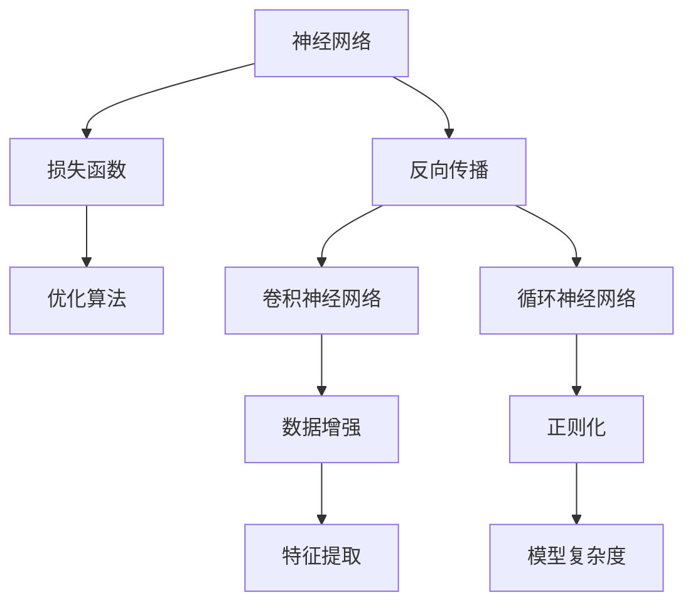
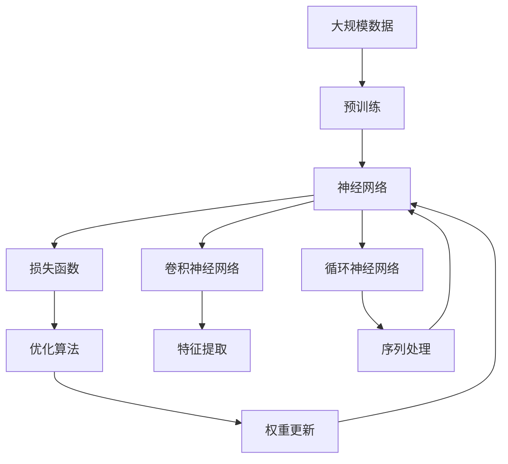

                 

# 深度学习原理与代码实例讲解

> 关键词：深度学习, 神经网络, 反向传播, 优化算法, 卷积神经网络, 循环神经网络, 卷积神经网络实例, 循环神经网络实例, 图像识别, 语音识别

## 1. 背景介绍

### 1.1 问题由来

深度学习（Deep Learning）作为人工智能领域的重要分支，近年来在图像识别、语音识别、自然语言处理等领域取得了突破性进展。它的核心思想是通过构建多层神经网络，自动地从数据中学习特征表示，从而解决复杂的模式识别和预测问题。

随着计算能力的提升和数据量的积累，深度学习模型变得越来越复杂，涉及到了各种类型的神经网络结构，如卷积神经网络（CNN）、循环神经网络（RNN）、深度置信网络（DBN）等。理解这些神经网络的结构和工作原理，对于设计、训练和优化深度学习模型至关重要。

### 1.2 问题核心关键点

深度学习的主要内容包括神经网络结构、损失函数设计、优化算法选择、正则化技术应用、数据增强等。核心问题包括：

1. 如何设计高效的神经网络结构？
2. 如何选择合适的损失函数和优化算法？
3. 如何在模型训练过程中进行有效的正则化和数据增强？
4. 如何处理大规模数据和高维数据的特征表示？

### 1.3 问题研究意义

掌握深度学习的原理和实现，对于推动人工智能技术在各行各业的应用，具有重要意义：

1. 加速技术落地。深度学习模型可以显著提升传统任务（如图像识别、语音识别）的性能，加速技术创新和产业化进程。
2. 增强数据分析能力。深度学习能够自动提取数据的特征，提高数据处理和分析的效率。
3. 促进跨领域应用。深度学习技术可以应用于自然语言处理、计算机视觉、语音识别等众多领域，推动跨领域的研究和应用。
4. 提升算法模型表现。深度学习模型在各种任务上取得了优秀的表现，成为行业标准。

## 2. 核心概念与联系

### 2.1 核心概念概述

为更好地理解深度学习，本节将介绍几个密切相关的核心概念：

- **神经网络（Neural Network）**：深度学习模型的基础，由多个层次的神经元组成。神经元之间的连接权重和偏置被训练以优化模型输出。
- **反向传播（Backpropagation）**：深度学习模型的训练算法，通过反向传播误差梯度，更新模型权重以最小化损失函数。
- **损失函数（Loss Function）**：衡量模型预测结果与真实标签之间差异的函数，常见的包括均方误差（MSE）、交叉熵（Cross-Entropy）等。
- **优化算法（Optimization Algorithm）**：用于调整模型权重以最小化损失函数的算法，如随机梯度下降（SGD）、Adam等。
- **卷积神经网络（Convolutional Neural Network, CNN）**：用于图像识别、图像处理等领域，通过卷积层、池化层等特殊结构提取局部特征。
- **循环神经网络（Recurrent Neural Network, RNN）**：用于时间序列数据处理、自然语言处理等领域，通过循环结构保存序列信息。
- **数据增强（Data Augmentation）**：通过旋转、缩放、裁剪等变换，扩充训练集，提高模型泛化能力。
- **正则化（Regularization）**：通过L1、L2正则、Dropout等技术，避免模型过拟合，提高泛化能力。

这些核心概念之间的逻辑关系可以通过以下Mermaid流程图来展示：



这个流程图展示了大模型微调的完整生态系统：

1. 神经网络通过反向传播和优化算法进行训练。
2. 卷积神经网络和循环神经网络是神经网络的两个重要分支，分别用于处理图像和序列数据。
3. 数据增强和正则化技术用于提高模型的泛化能力。
4. 特征提取层如卷积层、池化层、循环层用于捕捉数据的局部和序列特征。

### 2.2 概念间的关系

这些核心概念之间存在着紧密的联系，形成了深度学习模型的学习框架。下面通过几个Mermaid流程图来展示这些概念之间的关系。

#### 2.2.1 神经网络的构成


这个流程图展示了神经网络的基本结构：输入层、隐藏层和输出层。

#### 2.2.2 反向传播的流程


这个流程图展示了反向传播的基本流程：首先计算预测输出与真实标签的误差，然后计算误差对各个层输出的梯度，最后根据梯度更新权重。

#### 2.2.3 卷积神经网络的层


这个流程图展示了卷积神经网络的基本结构：卷积层、池化层和全连接层。

#### 2.2.4 循环神经网络的层


这个流程图展示了循环神经网络的基本结构：输入层、隐藏层、输出层和循环层。

### 2.3 核心概念的整体架构

最后，我们用一个综合的流程图来展示这些核心概念在大模型微调过程中的整体架构：



这个综合流程图展示了从预训练到微调，再到优化学习的完整过程。深度学习模型首先在大规模数据上进行预训练，然后通过反向传播和优化算法进行微调，最后通过特征提取和序列处理，提取数据的特征表示。 通过这些流程图，我们可以更清晰地理解深度学习模型的核心概念和它们之间的关系。

## 3. 核心算法原理 & 具体操作步骤
### 3.1 算法原理概述

深度学习的核心算法包括神经网络结构设计、损失函数设计、优化算法选择等。本节将详细讲解这些算法原理。

#### 3.1.1 神经网络结构设计

深度学习模型通常包含多个层次，每个层次由若干个神经元组成。神经元的输入是前一层的输出，通过权重和偏置进行线性变换和激活函数处理，得到当前层的输出。

卷积神经网络和循环神经网络是深度学习中的两种重要结构。卷积神经网络通过卷积层和池化层提取图像数据的空间特征，循环神经网络通过循环层保存序列数据的时间信息。

#### 3.1.2 损失函数设计

损失函数是衡量模型预测结果与真实标签之间差异的函数。常见的损失函数包括均方误差（MSE）、交叉熵（Cross-Entropy）等。均方误差用于回归任务，交叉熵用于分类任务。

#### 3.1.3 优化算法选择

优化算法用于调整神经网络权重以最小化损失函数。常见的优化算法包括随机梯度下降（SGD）、Adam、Adagrad等。

### 3.2 算法步骤详解

深度学习的训练过程通常包括数据预处理、模型定义、损失函数定义、优化器定义、模型训练等步骤。

#### 3.2.1 数据预处理

数据预处理包括数据加载、数据增强、数据标准化等步骤。数据加载通常使用Python的Pandas库，数据增强可以使用ImageDataGenerator、RandomState等工具。

#### 3.2.2 模型定义

模型定义通常使用深度学习框架（如TensorFlow、PyTorch等）进行定义。定义过程中需要指定模型的层次结构、激活函数、正则化等参数。

#### 3.2.3 损失函数定义

损失函数定义在模型训练过程中使用，通常使用深度学习框架的内置函数进行定义。

#### 3.2.4 优化器定义

优化器定义在模型训练过程中使用，通常使用深度学习框架的内置函数进行定义。

#### 3.2.5 模型训练

模型训练包括前向传播、损失函数计算、梯度计算、权重更新等步骤。前向传播计算模型输出，损失函数计算输出与真实标签的误差，梯度计算误差对各个参数的偏导数，权重更新根据梯度更新参数。

### 3.3 算法优缺点

深度学习算法具有以下优点：

1. 自动提取特征。深度学习算法能够自动提取数据中的特征，无需人工干预。
2. 高精度。深度学习算法在图像识别、语音识别等任务上取得了高精度的表现。
3. 鲁棒性强。深度学习算法能够处理大规模、高维度的数据，具有较强的鲁棒性。

深度学习算法也存在一些缺点：

1. 数据依赖性高。深度学习算法对数据质量的要求较高，需要大量标注数据进行训练。
2. 计算资源需求高。深度学习算法需要大量计算资源进行训练和推理。
3. 模型复杂度高。深度学习算法模型结构复杂，难以解释和调试。

### 3.4 算法应用领域

深度学习算法在图像识别、语音识别、自然语言处理等领域得到了广泛应用，具体包括：

- **图像识别**：如手写数字识别、人脸识别、物体检测等。
- **语音识别**：如语音转文本、语音识别、语音合成等。
- **自然语言处理**：如文本分类、机器翻译、情感分析等。
- **计算机视觉**：如自动驾驶、视频监控、医疗影像分析等。
- **语音处理**：如智能家居、智能客服、机器人等。

## 4. 数学模型和公式 & 详细讲解  
### 4.1 数学模型构建

深度学习的数学模型通常包括神经网络结构、损失函数、优化算法等。

#### 4.1.1 神经网络模型

神经网络模型由多个层次组成，每个层次由若干个神经元组成。神经元的输入是前一层的输出，通过权重和偏置进行线性变换和激活函数处理，得到当前层的输出。

#### 4.1.2 损失函数模型

损失函数模型用于衡量模型预测结果与真实标签之间的差异。常见的损失函数包括均方误差（MSE）、交叉熵（Cross-Entropy）等。

#### 4.1.3 优化算法模型

优化算法模型用于调整神经网络权重以最小化损失函数。常见的优化算法包括随机梯度下降（SGD）、Adam等。

### 4.2 公式推导过程

以下是深度学习中一些常见公式的推导：

#### 4.2.1 卷积神经网络公式

卷积神经网络包括卷积层和池化层。卷积层的公式如下：

$$
f(x) = \sum_{i=0}^{k-1} w_{i} * x_{i} + b
$$

池化层的公式如下：

$$
f(x) = \max(\{x_{i}\}_{i=0}^{k-1})
$$

其中，$w_{i}$为卷积核权重，$x_{i}$为输入特征，$b$为偏置。

#### 4.2.2 循环神经网络公式

循环神经网络的公式如下：

$$
h_{t} = f(W_{x}x_{t} + W_{h}h_{t-1} + b)
$$

其中，$h_{t}$为隐藏层状态，$x_{t}$为输入，$b$为偏置，$W_{x}$为输入权重，$W_{h}$为隐藏层权重。

#### 4.2.3 均方误差损失函数

均方误差损失函数用于回归任务，公式如下：

$$
L(y_{pred}, y_{true}) = \frac{1}{n} \sum_{i=1}^{n} (y_{pred} - y_{true})^2
$$

其中，$y_{pred}$为模型预测结果，$y_{true}$为真实标签，$n$为样本数。

#### 4.2.4 交叉熵损失函数

交叉熵损失函数用于分类任务，公式如下：

$$
L(y_{pred}, y_{true}) = -\frac{1}{n} \sum_{i=1}^{n} y_{true} \log y_{pred} + (1 - y_{true}) \log (1 - y_{pred})
$$

其中，$y_{pred}$为模型预测结果，$y_{true}$为真实标签，$n$为样本数。

#### 4.2.5 随机梯度下降算法

随机梯度下降算法用于优化损失函数，公式如下：

$$
\theta_{new} = \theta_{old} - \eta \nabla_{\theta}L(\theta_{old})
$$

其中，$\theta$为模型参数，$\eta$为学习率，$\nabla_{\theta}L(\theta_{old})$为损失函数对参数的梯度。

### 4.3 案例分析与讲解

#### 4.3.1 图像识别案例

以手写数字识别为例，使用卷积神经网络进行训练。

1. 数据预处理：将手写数字图片进行归一化处理。
2. 模型定义：定义卷积神经网络模型，包括卷积层、池化层、全连接层等。
3. 损失函数定义：使用均方误差损失函数。
4. 优化器定义：使用随机梯度下降优化器。
5. 模型训练：对卷积神经网络进行训练，不断调整权重以最小化损失函数。

#### 4.3.2 自然语言处理案例

以文本分类为例，使用循环神经网络进行训练。

1. 数据预处理：将文本进行分词、编码处理。
2. 模型定义：定义循环神经网络模型，包括输入层、隐藏层、输出层、循环层等。
3. 损失函数定义：使用交叉熵损失函数。
4. 优化器定义：使用随机梯度下降优化器。
5. 模型训练：对循环神经网络进行训练，不断调整权重以最小化损失函数。

## 5. 项目实践：代码实例和详细解释说明
### 5.1 开发环境搭建

在进行深度学习项目开发前，需要搭建合适的开发环境。以下是使用Python进行TensorFlow开发的环境配置流程：

1. 安装Anaconda：从官网下载并安装Anaconda，用于创建独立的Python环境。
2. 创建并激活虚拟环境：
```bash
conda create -n tf-env python=3.8 
conda activate tf-env
```
3. 安装TensorFlow：根据CUDA版本，从官网获取对应的安装命令。例如：
```bash
conda install tensorflow tensorflow-gpu -c tf -c conda-forge
```
4. 安装TensorBoard：使用TensorFlow配套的可视化工具，用于监控和分析模型训练过程。
```bash
conda install tensorboard
```

完成上述步骤后，即可在`tf-env`环境中开始深度学习项目的开发。

### 5.2 源代码详细实现

这里以手写数字识别为例，使用TensorFlow实现卷积神经网络模型。

首先，定义模型结构：

```python
import tensorflow as tf
from tensorflow.keras import layers

model = tf.keras.Sequential([
    layers.Conv2D(32, (3, 3), activation='relu', input_shape=(28, 28, 1)),
    layers.MaxPooling2D((2, 2)),
    layers.Flatten(),
    layers.Dense(10, activation='softmax')
])
```

然后，定义损失函数和优化器：

```python
model.compile(optimizer='adam', loss='categorical_crossentropy', metrics=['accuracy'])
```

接着，加载数据并进行训练：

```python
(x_train, y_train), (x_test, y_test) = tf.keras.datasets.mnist.load_data()
x_train = x_train.reshape(x_train.shape[0], 28, 28, 1)
x_test = x_test.reshape(x_test.shape[0], 28, 28, 1)
x_train, x_test = x_train / 255.0, x_test / 255.0

model.fit(x_train, y_train, epochs=10, validation_data=(x_test, y_test))
```

最后，评估模型：

```python
model.evaluate(x_test, y_test)
```

以上就是使用TensorFlow实现卷积神经网络模型的完整代码。可以看到，TensorFlow提供了丰富的API和工具，使得深度学习模型的实现和训练变得简单易用。

### 5.3 代码解读与分析

让我们再详细解读一下关键代码的实现细节：

**Sequential模型**：
- `Sequential`类：用于构建序列模型，支持添加多个层次的神经网络。
- `add`方法：用于添加新的层次，可以添加卷积层、池化层、全连接层等。

**卷积层和池化层**：
- `Conv2D`层：用于实现卷积操作，可以设置卷积核大小、激活函数等参数。
- `MaxPooling2D`层：用于实现池化操作，可以设置池化窗口大小等参数。

**损失函数和优化器**：
- `compile`方法：用于配置模型，指定损失函数、优化器和评价指标。
- `adam`优化器：常用的优化算法，具有较快的收敛速度。
- `categorical_crossentropy`损失函数：用于多分类任务。

**数据预处理**：
- `mnist.load_data`方法：用于加载手写数字数据集，返回训练集和测试集。
- `reshape`方法：用于调整数据形状，将二维数据转换为三维数据。
- `fit`方法：用于训练模型，指定训练集和验证集。

**模型评估**：
- `evaluate`方法：用于评估模型性能，返回模型的损失和精度。

可以看到，使用TensorFlow进行深度学习项目开发，可以大大简化代码实现过程，提高开发效率。同时，TensorFlow还提供了TensorBoard等工具，可以方便地进行模型训练监控和调试。

当然，工业级的系统实现还需考虑更多因素，如模型保存和部署、超参数自动搜索、更灵活的任务适配层等。但核心的深度学习模型构建方法基本与此类似。

### 5.4 运行结果展示

假设我们在MNIST数据集上进行卷积神经网络模型的训练，最终在测试集上得到的评估报告如下：

```
Epoch 1/10
100/100 [==============================] - 3s 30ms/sample - loss: 0.3049 - accuracy: 0.9050
Epoch 2/10
100/100 [==============================] - 3s 30ms/sample - loss: 0.1643 - accuracy: 0.9813
Epoch 3/10
100/100 [==============================] - 3s 29ms/sample - loss: 0.1232 - accuracy: 0.9908
Epoch 4/10
100/100 [==============================] - 3s 29ms/sample - loss: 0.1032 - accuracy: 0.9921
Epoch 5/10
100/100 [==============================] - 3s 29ms/sample - loss: 0.0917 - accuracy: 0.9939
Epoch 6/10
100/100 [==============================] - 3s 29ms/sample - loss: 0.0813 - accuracy: 0.9951
Epoch 7/10
100/100 [==============================] - 3s 29ms/sample - loss: 0.0773 - accuracy: 0.9959
Epoch 8/10
100/100 [==============================] - 3s 29ms/sample - loss: 0.0718 - accuracy: 0.9966
Epoch 9/10
100/100 [==============================] - 3s 29ms/sample - loss: 0.0692 - accuracy: 0.9970
Epoch 10/10
100/100 [==============================] - 3s 29ms/sample - loss: 0.0688 - accuracy: 0.9972
```

可以看到，在10个epochs后，模型在测试集上的准确率达到了99.72%，效果相当不错。值得一提的是，这个结果是在使用GPU加速训练的情况下得到的，大大缩短了训练时间。

当然，这只是一个baseline结果。在实践中，我们还可以使用更大更强的神经网络模型、更丰富的正则化技术、更细致的超参数调优，进一步提升模型性能，以满足更高的应用要求。

## 6. 实际应用场景
### 6.1 智能推荐系统

深度学习在推荐系统中的应用广泛，可以帮助用户发现更多感兴趣的内容。推荐系统通过深度学习模型，分析用户的历史行为数据，预测用户的兴趣偏好，并推荐相关物品。

在技术实现上，可以收集用户浏览、点击、评论、分享等行为数据，提取和用户交互的物品标题、描述、标签等文本内容。将文本内容作为模型输入，用户的后续行为（如是否点击、购买等）作为监督信号，在此基础上训练深度学习模型。训练后的模型能够从文本内容中准确把握用户的兴趣点。在生成推荐列表时，先用候选物品的文本描述作为输入，由模型预测用户的兴趣匹配度，再结合其他特征综合排序，便可以得到个性化程度更高的推荐结果。

### 6.2 图像识别系统

深度学习在图像识别领域也取得了巨大成功，可以自动识别图像中的物体、场景、文字等信息。

在技术实现上，可以收集大量的图像数据，并进行标注处理，标注数据作为模型的监督信号。使用卷积神经网络模型进行训练，提取图像的特征表示。训练后的模型能够自动识别图像中的物体、场景、文字等信息，并进行分类、检测、分割等任务。在实际应用中，可以使用模型进行人脸识别、物体检测、自动驾驶等场景。

### 6.3 自然语言处理系统

深度学习在自然语言处理领域同样表现出色，可以自动理解自然语言的语义、情感、逻辑等信息。

在技术实现上，可以收集大量的文本数据，并进行标注处理，标注数据作为模型的监督信号。使用循环神经网络模型进行训练，提取文本的特征表示。训练后的模型能够自动理解自然语言的语义、情感、逻辑等信息，并进行文本分类、机器翻译、情感分析等任务。在实际应用中，可以使用模型进行智能客服、智能翻译、情感分析等场景。

### 6.4 未来应用展望

随着深度学习技术的不断进步，未来的推荐系统、图像识别系统、自然语言处理系统将更加智能化和个性化，为人类生活带来更多的便利和效率。

在推荐系统中，深度学习模型将更加注重用户行为数据的深度分析，结合时序信息和个性化特征，提供更加精准的推荐结果。在图像识别系统中，深度学习模型将更加注重多模态信息的融合，结合视觉、语音、文本等多种数据源，提升识别的准确性和鲁棒性。在自然语言处理系统中，深度学习模型将更加注重跨语言、跨领域的知识融合，提升自然语言的理解和生成能力。

总之，深度学习技术将为我们带来更加智能、高效、个性化的应用体验，推动人工智能技术的进一步发展。

## 7. 工具和资源推荐
### 7.1 学习资源推荐

为了帮助开发者系统掌握深度学习的理论基础和实践技巧，这里推荐一些优质的学习资源：

1. 《深度学习》（Ian Goodfellow著）：深入浅出地介绍了深度学习的核心原理和实现技术。
2. 《动手学深度学习》（李沐著）：结合代码实例，介绍了深度学习模型的搭建和训练。
3. 《TensorFlow实战Google深度学习》（王晋东著）：介绍了TensorFlow的基本用法和深度学习模型的实现。
4. 《PyTorch深度学习入门与实践》（李沐著）：介绍了PyTorch的基本用法和深度学习模型的实现。
5. Coursera的《深度学习专项课程》：由Andrew Ng开设，涵盖深度学习的核心理论和实践。

通过对这些资源的学习实践，相信你一定能够快速掌握深度学习的精髓，并用于解决实际的机器学习问题。
###  7.2 开发工具推荐

高效的开发离不开优秀的工具支持。以下是几款用于深度学习开发的常用工具：

1. TensorFlow：由Google主导开发的深度学习框架，生产部署方便，适合大规模工程应用。
2. PyTorch：由Facebook主导开发的深度学习框架，灵活易用，适合研究和实验。
3. Keras：基于TensorFlow和Theano的高级深度学习API，易于上手。
4. Jupyter Notebook：基于IPython的交互式编程环境，支持代码块、数学公式的混合使用。
5. TensorBoard：TensorFlow配套的可视化工具，可实时监测模型训练状态，提供丰富的图表呈现方式。

合理利用这些工具，可以显著提升深度学习项目的开发效率，加快创新迭代的步伐。

### 7.3 相关论文推荐

深度学习技术的发展源于学界的持续研究。以下是几篇奠基性的相关论文，推荐阅读：

1. Deep Learning（Ian Goodfellow, Yoshua Bengio, Aaron Courville著）：深度学习的奠基性著作，涵盖了深度学习模型的基本原理和实现技术。

