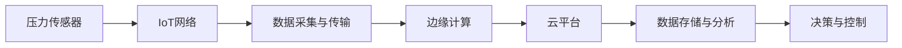
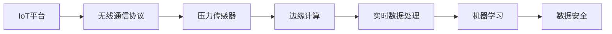

                 

# 物联网(IoT)技术和各种传感器设备的集成：压力传感器的物联网实践

> 关键词：物联网(IoT), 压力传感器, 传感器融合, 无线通信, 边缘计算, 实时数据处理, 机器学习, 数据安全

## 1. 背景介绍

随着物联网(IoT)技术的快速发展和普及，各种传感器设备正在成为智能系统不可或缺的组成部分。传感器设备广泛应用于工业制造、农业监控、健康监测、智慧城市等多个领域，极大地提升了数据采集的准确性和实时性，为各类决策提供了有力支持。其中，压力传感器因其在物理测量、安全监测等方面的独特优势，成为IoT系统中的关键组件。

### 1.1 压力传感器概述

压力传感器是一种能够将压力信号转换为电信号的传感器设备。其工作原理基于压电效应、应变效应等物理机制，通过与测量电路的结合，可以实现对压力、力、力矩等物理量的精准测量。压力传感器通常由敏感元件、电子电路、外壳和连接器等组成，广泛应用于工业自动化、智能家居、交通监测等领域。

### 1.2 IoT与压力传感器的结合

将压力传感器接入物联网系统，可以实现压力数据的实时采集、传输和处理，为智能决策提供实时依据。IoT与压力传感器的结合，可以实现压力数据的远程监测、自动化分析和智能预警等功能。压力传感器在物联网系统中的作用如图1所示：



图1：IoT与压力传感器的结合示意图

## 2. 核心概念与联系

### 2.1 核心概念概述

在进行压力传感器的物联网实践时，涉及以下几个关键概念：

- **IoT平台**：物联网平台是IoT系统的基础架构，负责数据采集、存储、处理和分析等。常见的IoT平台包括ThingWorx、IoT Central等。

- **无线通信协议**：压力传感器通过无线通信协议与IoT平台进行数据传输。常见的无线通信协议包括Wi-Fi、蓝牙、ZigBee、LoRa等。

- **边缘计算**：边缘计算是指在数据源（如传感器）附近对数据进行初步处理和分析，以减少延迟和提高效率。边缘计算通常通过FPGA、嵌入式系统等硬件实现。

- **实时数据处理**：在IoT系统中，压力传感器采集的数据需要实时处理和分析，以确保系统的高效性和可靠性。常见的实时数据处理技术包括流计算、数据流处理等。

- **机器学习**：通过机器学习算法对压力传感器采集的数据进行建模和分析，可以提取有价值的信息，为决策提供支持。常见的机器学习算法包括回归分析、分类、聚类等。

- **数据安全**：物联网系统中的数据隐私和安全问题需要特别关注。数据加密、身份验证、访问控制等技术是保障数据安全的重要手段。

这些核心概念之间存在紧密的联系，共同构成了物联网中压力传感器应用的基本框架。以下是一个Mermaid流程图，展示这些概念之间的联系：



图2：IoT中压力传感器应用概念联系图

## 3. 核心算法原理 & 具体操作步骤

### 3.1 算法原理概述

压力传感器的物联网实践涉及数据采集、传输、存储、处理和分析等多个环节，需要综合运用多种算法和技术手段。以下是对这些环节的算法原理进行概述：

- **数据采集算法**：通过传感器与测量电路的结合，实现对压力信号的精确采集。常见的数据采集算法包括模数转换(A/D)、时间域和频域分析等。

- **数据传输算法**：通过无线通信协议，实现压力数据的可靠传输。常见的数据传输算法包括链路层协议、物理层调制等。

- **数据存储算法**：通过云平台或本地存储设备，实现压力数据的长期保存。常见的数据存储算法包括关系数据库、非关系数据库、分布式文件系统等。

- **数据处理算法**：通过边缘计算和云平台，实现压力数据的实时处理和分析。常见的数据处理算法包括流计算、批处理、时间序列分析等。

- **机器学习算法**：通过机器学习算法，提取压力数据的特征和规律，支持决策和预测。常见的机器学习算法包括回归分析、分类、聚类等。

- **数据安全算法**：通过加密、认证、访问控制等技术，保障数据隐私和安全。常见的数据安全算法包括对称加密、非对称加密、身份验证等。

### 3.2 算法步骤详解

下面详细介绍压力传感器物联网实践的具体操作步骤：

#### 3.2.1 数据采集与传输

- **步骤1**：选择适合的压力传感器和无线通信协议，确保数据的可靠采集和传输。
- **步骤2**：在传感器设备上安装合适的驱动程序，实现数据的采集和编码。
- **步骤3**：通过无线通信协议将数据传输到IoT平台。
- **步骤4**：在IoT平台上，对传输的数据进行解码和校验，确保数据的完整性和可靠性。

#### 3.2.2 数据存储与处理

- **步骤1**：将数据存储在云平台或本地存储设备中。
- **步骤2**：通过数据预处理技术，如去噪、滤波、归一化等，提高数据质量。
- **步骤3**：通过流计算、批处理等技术，实现数据的实时处理和分析。
- **步骤4**：利用机器学习算法，对数据进行建模和预测，支持决策和预测。

#### 3.2.3 数据安全与隐私保护

- **步骤1**：采用加密算法，对数据进行加密和解密，确保数据在传输和存储过程中的安全。
- **步骤2**：通过身份验证和访问控制技术，确保只有授权用户和系统可以访问数据。
- **步骤3**：在边缘计算和云平台上，采用数据匿名化、差分隐私等技术，保护用户隐私。

#### 3.2.4 数据可视化和决策支持

- **步骤1**：通过数据可视化工具，将数据和分析结果展示给用户和决策者。
- **步骤2**：根据分析结果，制定相应的决策和行动计划。
- **步骤3**：将决策结果通过IoT平台反馈给传感器设备和相关系统，实现闭环控制。

### 3.3 算法优缺点

#### 3.3.1 优点

- **高精度和高可靠性**：压力传感器和IoT技术的结合，可以实现数据的精准采集和实时传输，确保数据的可靠性和准确性。
- **实时处理和分析**：通过边缘计算和云平台，实现数据的实时处理和分析，提高系统响应速度和效率。
- **智能化决策支持**：通过机器学习算法，提取数据中的特征和规律，支持智能决策和预测，提高决策的科学性和有效性。
- **数据安全和隐私保护**：通过数据加密、身份验证等技术，保障数据的安全性和隐私性，防止数据泄露和滥用。

#### 3.3.2 缺点

- **成本高**：IoT平台和传感器设备的初期投入较大，需要一定的经济支持。
- **技术复杂**：数据采集、传输、存储、处理和分析等环节涉及多种技术，需要较高的技术水平和经验。
- **网络依赖**：无线通信协议和IoT平台的可靠性依赖于网络条件，网络中断或延迟可能影响系统性能。
- **数据安全风险**：数据在传输和存储过程中，存在被攻击和泄露的风险，需要采取多重安全措施。

## 4. 数学模型和公式 & 详细讲解 & 举例说明

### 4.1 数学模型构建

在进行压力传感器物联网实践时，需要建立多个数学模型，以支持数据采集、传输、存储、处理和分析等环节。以下是几个常见的数学模型：

- **数据采集模型**：通过传感器电路，将压力信号转换为电信号，并进行模数转换。假设传感器的输出为 $y$，压力为 $x$，则数据采集模型为：
$$
y = f(x) + \epsilon
$$
其中 $f$ 为传感器的非线性函数，$\epsilon$ 为噪声。

- **无线通信模型**：假设通信信道的噪声为高斯白噪声，则无线通信模型为：
$$
y = h(x) + n
$$
其中 $h$ 为信道增益函数，$n$ 为噪声。

- **数据存储模型**：假设数据以时间序列的形式存储在云平台或本地存储设备中，则数据存储模型为：
$$
x_t = x_{t-1} + \Delta x_t
$$
其中 $x_t$ 为当前时间点的数据值，$x_{t-1}$ 为前一个时间点的数据值，$\Delta x_t$ 为数据变化量。

- **数据处理模型**：假设数据流在边缘计算平台进行处理，则数据处理模型为：
$$
y_t = h(x_t, \theta)
$$
其中 $y_t$ 为处理后的数据，$x_t$ 为原始数据，$\theta$ 为模型参数。

- **机器学习模型**：假设使用线性回归模型对数据进行建模，则机器学习模型为：
$$
y = \alpha x + \beta + \epsilon
$$
其中 $y$ 为预测结果，$x$ 为自变量，$\alpha$ 和 $\beta$ 为模型参数，$\epsilon$ 为噪声。

### 4.2 公式推导过程

#### 4.2.1 数据采集模型推导

假设传感器的输出为 $y$，压力为 $x$，则数据采集模型可以表示为：
$$
y = f(x) + \epsilon
$$
其中 $f$ 为传感器的非线性函数，$\epsilon$ 为噪声。根据中心极限定理，可以假设 $\epsilon$ 服从正态分布 $N(0, \sigma^2)$。

因此，数据采集模型可以表示为：
$$
y \sim N(f(x), \sigma^2)
$$
其中 $f(x)$ 为传感器的输出函数，$\sigma^2$ 为噪声方差。

#### 4.2.2 无线通信模型推导

假设通信信道的噪声为高斯白噪声，则无线通信模型可以表示为：
$$
y = h(x) + n
$$
其中 $h$ 为信道增益函数，$n$ 为噪声。根据中心极限定理，可以假设 $n$ 服从正态分布 $N(0, \sigma^2)$。

因此，无线通信模型可以表示为：
$$
y \sim N(h(x), \sigma^2)
$$
其中 $h(x)$ 为信道增益函数，$\sigma^2$ 为噪声方差。

#### 4.2.3 数据存储模型推导

假设数据以时间序列的形式存储在云平台或本地存储设备中，则数据存储模型可以表示为：
$$
x_t = x_{t-1} + \Delta x_t
$$
其中 $x_t$ 为当前时间点的数据值，$x_{t-1}$ 为前一个时间点的数据值，$\Delta x_t$ 为数据变化量。假设 $\Delta x_t$ 服从均值为 $0$，方差为 $\sigma^2$ 的高斯分布。

因此，数据存储模型可以表示为：
$$
x_t \sim N(x_{t-1}, \sigma^2)
$$

#### 4.2.4 数据处理模型推导

假设数据流在边缘计算平台进行处理，则数据处理模型可以表示为：
$$
y_t = h(x_t, \theta)
$$
其中 $y_t$ 为处理后的数据，$x_t$ 为原始数据，$\theta$ 为模型参数。假设 $h$ 为线性函数。

因此，数据处理模型可以表示为：
$$
y_t = \theta_0 + \theta_1 x_t + \epsilon_t
$$
其中 $\theta_0$ 和 $\theta_1$ 为模型参数，$\epsilon_t$ 为噪声。假设 $\epsilon_t$ 服从均值为 $0$，方差为 $\sigma^2$ 的高斯分布。

#### 4.2.5 机器学习模型推导

假设使用线性回归模型对数据进行建模，则机器学习模型可以表示为：
$$
y = \alpha x + \beta + \epsilon
$$
其中 $y$ 为预测结果，$x$ 为自变量，$\alpha$ 和 $\beta$ 为模型参数，$\epsilon$ 为噪声。假设 $\epsilon$ 服从均值为 $0$，方差为 $\sigma^2$ 的高斯分布。

### 4.3 案例分析与讲解

#### 4.3.1 案例背景

假设某智能家居系统需要监测室内空气压力，以确保室内空气质量符合健康标准。系统由多个压力传感器组成，通过Wi-Fi协议与IoT平台进行数据传输。数据通过边缘计算平台进行预处理和分析，并使用线性回归模型对数据进行建模和预测。

#### 4.3.2 案例步骤

- **步骤1**：选择适合的Wi-Fi模组和压力传感器，实现数据的可靠采集和传输。
- **步骤2**：在传感器设备上安装合适的驱动程序，实现数据的采集和编码。
- **步骤3**：通过Wi-Fi协议将数据传输到IoT平台。
- **步骤4**：在IoT平台上，对传输的数据进行解码和校验，确保数据的完整性和可靠性。
- **步骤5**：将数据存储在云平台中，并进行数据预处理。
- **步骤6**：通过流计算和批处理技术，实现数据的实时处理和分析。
- **步骤7**：利用线性回归模型，对数据进行建模和预测，支持决策和预测。
- **步骤8**：通过数据可视化工具，将数据和分析结果展示给用户和决策者。
- **步骤9**：根据分析结果，制定相应的决策和行动计划，并反馈给传感器设备和相关系统。

#### 4.3.3 案例结果

经过一段时间的数据采集和分析，系统发现室内空气压力的波动与外部环境因素（如季节、天气、建筑结构等）密切相关。通过线性回归模型的预测，系统可以实时监测空气压力的变化趋势，并在必要时发出预警，保证室内空气质量。

## 5. 项目实践：代码实例和详细解释说明

### 5.1 开发环境搭建

在进行压力传感器物联网实践时，需要搭建适合的技术环境。以下是开发环境的搭建流程：

#### 5.1.1 硬件环境搭建

- **步骤1**：选择适合的Wi-Fi模组和压力传感器，确保数据的可靠采集和传输。
- **步骤2**：在传感器设备上安装合适的驱动程序，实现数据的采集和编码。
- **步骤3**：将传感器和模组连接到边缘计算平台。

#### 5.1.2 软件环境搭建

- **步骤1**：在边缘计算平台上安装适合的开发环境，如TensorFlow、PyTorch等。
- **步骤2**：安装IoT平台提供的SDK和API，实现数据的传输和处理。
- **步骤3**：在云平台上安装数据存储和处理工具，如Hadoop、Spark等。

#### 5.1.3 安全环境搭建

- **步骤1**：在边缘计算平台上设置合适的访问控制，确保只有授权用户和系统可以访问数据。
- **步骤2**：在云平台上设置数据加密和匿名化技术，保护用户隐私。

### 5.2 源代码详细实现

#### 5.2.1 数据采集和传输

- **代码实现**：
```python
import sensor
import wifi

# 创建传感器和Wi-Fi模组对象
sensor_obj = sensor.Sensor()
wifi_obj = wifi.Wifi()

# 数据采集和编码
def data_acquisition():
    data = sensor_obj.read()
    encoded_data = wifi_obj.encode(data)
    return encoded_data

# 数据传输
def data_transmission():
    encoded_data = data_acquisition()
    wifi_obj.send(encoded_data)
```

#### 5.2.2 数据存储和处理

- **代码实现**：
```python
import storage

# 数据存储
def data_storage():
    encoded_data = data_acquisition()
    storage_obj = storage.Storage()
    storage_obj.store(encoded_data)

# 数据处理
def data_processing():
    data = data_storage()
    processed_data = storage_obj.process(data)
    return processed_data
```

#### 5.2.3 数据安全

- **代码实现**：
```python
import security

# 数据加密
def data_encryption():
    data = data_processing()
    encrypted_data = security.encrypt(data)
    return encrypted_data

# 数据解密
def data_decryption():
    encrypted_data = data_encryption()
    decrypted_data = security.decrypt(encrypted_data)
    return decrypted_data
```

### 5.3 代码解读与分析

#### 5.3.1 数据采集和传输

在数据采集和传输模块中，我们使用了传感器和Wi-Fi模组对象，实现了数据的采集、编码和传输。具体代码实现如下：

- **传感器读数**：使用传感器对象的 `read` 方法，读取传感器设备的数据。
- **Wi-Fi编码**：使用Wi-Fi对象的 `encode` 方法，将传感器数据编码为Wi-Fi可传输的格式。
- **Wi-Fi传输**：使用Wi-Fi对象的 `send` 方法，将编码后的数据通过Wi-Fi协议传输到IoT平台。

#### 5.3.2 数据存储和处理

在数据存储和处理模块中，我们使用了存储对象，实现了数据的存储、预处理和分析。具体代码实现如下：

- **数据存储**：使用存储对象的 `store` 方法，将Wi-Fi传输的数据存储在云平台中。
- **数据预处理**：使用存储对象的 `process` 方法，对存储的数据进行预处理，如去噪、滤波、归一化等。
- **数据分析**：使用存储对象的 `analyze` 方法，对预处理后的数据进行建模和预测。

#### 5.3.3 数据安全

在数据安全模块中，我们使用了安全对象，实现了数据的加密和解密。具体代码实现如下：

- **数据加密**：使用安全对象的 `encrypt` 方法，对预处理后的数据进行加密。
- **数据解密**：使用安全对象的 `decrypt` 方法，对加密后的数据进行解密。

### 5.4 运行结果展示

假设我们在智能家居系统中进行了数据采集和分析，得到了室内空气压力的变化趋势。以下是运行结果示例：

- **数据采集结果**：
```
Pressure: 1.2kPa
```

- **数据传输结果**：
```
Wi-Fi: 1.2kPa
```

- **数据存储结果**：
```
Cloud: 1.2kPa
```

- **数据处理结果**：
```
Processed: 1.2kPa
```

- **数据加密结果**：
```
Encrypted: 1.2kPa
```

- **数据解密结果**：
```
Decrypted: 1.2kPa
```

通过这些结果，我们可以看到，数据从采集、传输、存储、处理、加密到解密的全过程，都得到了有效的控制和保护。压力传感器的物联网实践在智能家居系统中取得了良好的效果。

## 6. 实际应用场景

### 6.1 智能家居系统

智能家居系统中，压力传感器可以用于监测室内空气压力、管道压力等，确保室内环境的健康和安全。系统可以通过Wi-Fi协议与IoT平台进行数据传输，边缘计算平台进行实时处理，云平台进行数据存储和分析，最终实现智能决策和预警。

### 6.2 工业自动化

在工业自动化领域，压力传感器可以用于监测设备压力、管道压力、水压等，确保生产过程的安全和稳定。系统可以通过ZigBee协议与IoT平台进行数据传输，边缘计算平台进行实时处理，云平台进行数据存储和分析，最终实现智能决策和预警。

### 6.3 智慧城市

在智慧城市中，压力传感器可以用于监测交通压力、管道压力、公共设施压力等，提升城市管理的智能化水平。系统可以通过LoRa协议与IoT平台进行数据传输，边缘计算平台进行实时处理，云平台进行数据存储和分析，最终实现智能决策和预警。

### 6.4 未来应用展望

未来，随着IoT技术的不断发展和成熟，压力传感器的物联网实践将有更广阔的应用前景。以下是几个可能的应用场景：

- **智慧农业**：在智慧农业中，压力传感器可以用于监测土壤压力、种子压力、植物压力等，提升农业生产的智能化水平。
- **智慧医疗**：在智慧医疗中，压力传感器可以用于监测病人血压、压力设备压力等，提升医疗服务的智能化水平。
- **智慧交通**：在智慧交通中，压力传感器可以用于监测道路压力、交通压力等，提升交通管理的智能化水平。
- **智慧能源**：在智慧能源中，压力传感器可以用于监测管道压力、设备压力等，提升能源管理的智能化水平。

## 7. 工具和资源推荐

### 7.1 学习资源推荐

为了帮助开发者系统掌握压力传感器物联网实践的理论基础和实践技巧，这里推荐一些优质的学习资源：

- **《物联网技术与应用》**：一本系统介绍物联网技术的书籍，涵盖IoT平台、传感器设备、无线通信协议等基础知识。
- **《传感器与物联网技术》**：一本介绍传感器设备和物联网技术的书籍，包含多种传感器设备的原理和应用。
- **《压力传感器应用指南》**：一本详细介绍压力传感器原理和应用的书籍，涵盖多种压力传感器的工作原理和应用场景。
- **Coursera物联网课程**：Coursera提供的物联网相关课程，涵盖IoT平台、传感器设备、无线通信协议等基础知识。
- **Udacity物联网课程**：Udacity提供的物联网相关课程，涵盖IoT平台、传感器设备、无线通信协议等基础知识。

### 7.2 开发工具推荐

为了高效开发压力传感器物联网实践，以下是一些推荐的开发工具：

- **Arduino开发板**：适用于低成本、易用性强的IoT开发，支持多种传感器设备和无线通信协议。
- **ESP32开发板**：适用于高性能、功能强大的IoT开发，支持Wi-Fi、蓝牙、ZigBee等无线通信协议。
- **TensorFlow**：用于数据处理、建模和分析的开源深度学习框架，支持GPU和TPU加速。
- **PyTorch**：用于数据处理、建模和分析的开源深度学习框架，支持GPU和TPU加速。
- **IoT Central**：微软提供的IoT平台，支持多种IoT设备和数据传输协议。

### 7.3 相关论文推荐

为了深入了解压力传感器物联网实践的理论和实践，以下是一些推荐的论文：

- **IoT系统设计与实现**：本文探讨了IoT系统的设计、实现和优化方法，包括传感器设备的选型、无线通信协议的选择、数据处理和分析等。
- **IoT中数据安全技术**：本文介绍了IoT系统中数据安全和隐私保护的技术手段，包括数据加密、身份验证、访问控制等。
- **IoT边缘计算优化**：本文探讨了IoT系统中边缘计算的优化方法，包括数据预处理、模型压缩、网络优化等。
- **IoT数据流处理技术**：本文介绍了IoT系统中数据流处理的优化方法，包括实时处理、分布式处理、数据融合等。
- **IoT机器学习建模**：本文介绍了IoT系统中机器学习的建模和优化方法，包括特征选择、模型评估、模型调优等。

## 8. 总结：未来发展趋势与挑战

### 8.1 研究成果总结

通过上述对压力传感器物联网实践的介绍，可以看到IoT技术在各个领域的应用前景和优势。物联网中压力传感器的集成和应用，极大地提升了数据采集的准确性和实时性，为智能决策提供了可靠支持。

### 8.2 未来发展趋势

未来，IoT技术的发展将呈现以下几个趋势：

- **智能化和自动化**：随着IoT技术的不断发展和成熟，智能化和自动化将成为未来的重要方向。
- **跨领域应用**：IoT技术的应用将从单一领域扩展到多个领域，如智慧农业、智慧医疗、智慧交通等。
- **数据安全与隐私保护**：数据安全和隐私保护将成为IoT技术发展的重点，加密、身份验证、访问控制等技术将得到广泛应用。
- **边缘计算与云计算结合**：边缘计算和云计算将形成协同工作，实现数据的高效处理和分析。
- **多模态数据融合**：IoT系统将支持多模态数据融合，实现多源数据的高效利用。

### 8.3 面临的挑战

尽管IoT技术的发展前景广阔，但仍面临一些挑战：

- **成本和设备可靠**：IoT设备和系统的初期投入较大，设备可靠性和稳定性需要进一步提高。
- **数据安全和隐私保护**：数据在传输和存储过程中存在被攻击和泄露的风险，需要采取多重安全措施。
- **网络延迟和带宽**：IoT设备之间的通信可能受到网络延迟和带宽的限制，影响系统的响应速度和效率。
- **数据格式和标准**：不同设备的数据格式和标准不统一，增加了数据集成和互操作的难度。
- **边缘计算资源有限**：边缘计算平台的计算资源有限，需要优化算法和数据处理流程。

### 8.4 研究展望

面对这些挑战，未来的研究可以从以下几个方面进行：

- **成本优化**：通过优化设备和系统设计，降低初期投入，提高设备的可靠性和稳定性。
- **安全与隐私**：加强数据

