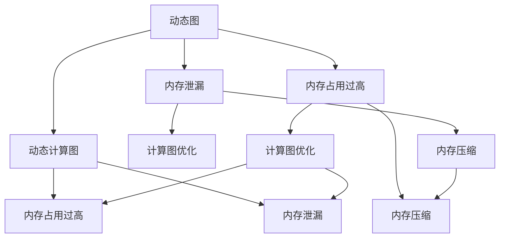
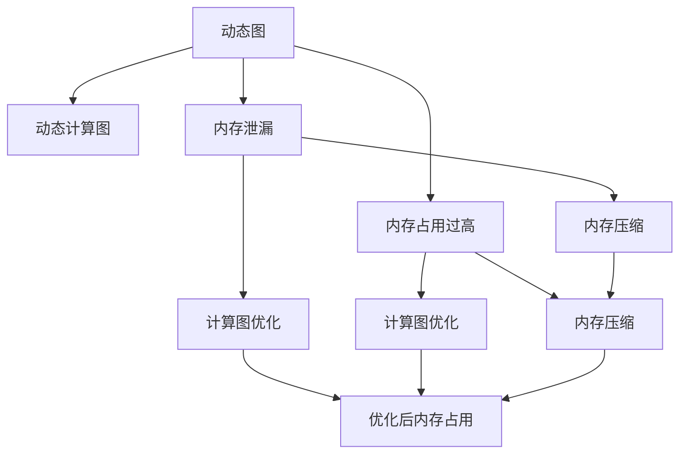
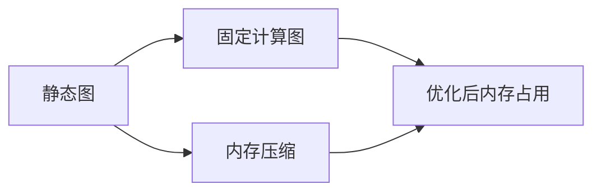

                 

# 神经网络模型的内存使用更可控

> 关键词：神经网络, 内存管理, 计算图优化, 动态图, 静态图, 内存泄漏, 内存压缩

## 1. 背景介绍

### 1.1 问题由来
随着深度学习技术的快速发展，神经网络模型变得越来越庞大和复杂。传统的神经网络模型，如深度卷积神经网络(CNN)和循环神经网络(RNN)，具有极高的参数量和计算复杂度，对内存和计算资源的要求非常高。特别是在大规模深度学习任务，如计算机视觉、自然语言处理、语音识别等领域，模型所需占用的内存量甚至可能达到数百GB，极大地制约了模型的训练和推理效率。

### 1.2 问题核心关键点
神经网络模型的内存管理问题主要集中在以下几个方面：

- **内存占用过高**：神经网络模型的参数量和计算图复杂度较高，对内存占用有较高要求。大规模模型的训练和推理过程中，内存管理不当可能导致系统崩溃或性能下降。

- **内存泄漏**：模型训练和推理过程中，可能存在未释放的临时变量和中间结果，导致内存持续占用，影响系统稳定性。

- **计算图复杂**：动态计算图在推理过程中，可能产生大量的临时节点和中间变量，影响内存使用效率。

- **参数冗余**：模型中可能存在重复或冗余的参数，占用不必要的内存空间。

### 1.3 问题研究意义
研究神经网络模型的内存使用优化，对于提升模型训练和推理效率，降低计算成本，具有重要意义：

- **提升计算效率**：通过优化内存管理，可以显著提升神经网络模型的训练和推理速度，降低计算资源的消耗。
- **保证系统稳定**：合理的内存管理可以有效避免内存泄漏，防止系统崩溃，提升系统稳定性。
- **降低成本**：优化内存使用可以减少对高性能计算设备和存储设备的依赖，降低计算成本。
- **支持更大规模模型**：合理的内存管理有助于支持更大规模和更复杂的神经网络模型。

## 2. 核心概念与联系

### 2.1 核心概念概述

为更好地理解神经网络模型内存使用优化的相关概念，本节将介绍几个密切相关的核心概念：

- **计算图**：神经网络模型的训练和推理过程，可以看作是一系列计算步骤的组合，即计算图。每个节点表示一个计算操作，边表示数据流动。动态计算图在每次前向传播中都会产生新的中间变量和临时节点，占用大量内存。

- **静态计算图**：静态计算图在训练前定义好计算图结构，前向传播和反向传播时仅更新节点和边的状态，不产生新的中间变量和临时节点，可以显著减少内存占用。

- **内存压缩**：通过压缩算法（如剪枝、量化、稀疏化等）对神经网络模型中的参数和中间变量进行优化，减少内存占用，提升计算效率。

- **动态图与静态图**：动态图（如TensorFlow、PyTorch）和静态图（如ONNX、Caffe2）在内存管理上有显著差异，动态图由于计算图动态生成，产生大量中间变量，内存占用较高，而静态图计算图固定，内存占用相对较低。

这些核心概念之间的逻辑关系可以通过以下Mermaid流程图来展示：



这个流程图展示了动态图和静态图在内存管理上的不同特点，以及优化内存使用的几种常见方法。

### 2.2 概念间的关系

这些核心概念之间存在着紧密的联系，形成了神经网络模型内存使用优化的完整生态系统。下面我通过几个Mermaid流程图来展示这些概念之间的关系。

#### 2.2.1 内存优化的基本流程



这个流程图展示了优化神经网络模型内存使用的基本流程。首先，识别出内存泄漏和内存占用过高的问题，然后通过计算图优化和内存压缩技术，减少内存占用，提升系统效率。

#### 2.2.2 静态图与动态图的区别



这个流程图展示了静态图与动态图在内存管理上的区别。静态图由于计算图固定，内存压缩可以更有效地减少内存占用，而动态图由于计算图动态生成，内存占用相对较高，但可以通过计算图优化和内存压缩进一步提升效率。

## 3. 核心算法原理 & 具体操作步骤

### 3.1 算法原理概述

神经网络模型的内存使用优化，本质上是针对计算图的优化和内存压缩。其核心思想是：通过优化计算图结构，减少中间变量和临时节点的数量，同时采用内存压缩技术，降低模型参数和中间变量的空间占用，从而提升内存使用效率。

形式化地，假设神经网络模型 $M$ 的计算图为 $G=(V,E)$，其中 $V$ 为节点集合，$E$ 为边集合。模型的参数和中间变量存储在内存中，占用一定的空间。优化目标是最小化内存占用：

$$
\min_{G} \sum_{v \in V} \text{memory\_usage}(v)
$$

其中 $\text{memory\_usage}(v)$ 表示节点 $v$ 所占用的内存空间。优化计算图结构和内存压缩技术，可以在不降低模型性能的前提下，显著减少内存占用。

### 3.2 算法步骤详解

神经网络模型内存使用优化的具体步骤包括：

**Step 1: 内存泄漏检测**
- 使用内存分析工具（如Valgrind、Google's heap checker），检测计算图生成和执行过程中是否存在未释放的临时变量和中间结果。

**Step 2: 计算图优化**
- 识别计算图中的冗余操作和中间变量，通过剪枝、合并等手段，减少计算图的复杂度。
- 使用层合并技术，将多个计算节点合并为单个节点，减少内存占用。
- 使用模型压缩技术，去除冗余参数和低权重节点，减少内存占用。

**Step 3: 内存压缩**
- 使用剪枝技术，去除模型中的冗余参数和低权重节点，减少内存占用。
- 使用量化技术，将高精度参数转换为低精度参数，减少内存占用。
- 使用稀疏化技术，将参数矩阵转换为稀疏矩阵，减少内存占用。

**Step 4: 优化后的测试与验证**
- 对优化后的模型进行测试和验证，确保优化操作不会影响模型性能。
- 在实际应用场景中进行优化效果的评估，比较优化前后的内存使用情况和性能指标。

### 3.3 算法优缺点

神经网络模型内存使用优化的优点包括：

- **提升计算效率**：优化内存使用可以显著提升模型的训练和推理速度，减少计算资源的消耗。
- **降低成本**：减少对高性能计算设备和存储设备的依赖，降低计算成本。
- **支持更大规模模型**：优化内存使用有助于支持更大规模和更复杂的神经网络模型。

同时，这种优化方法也存在一些局限性：

- **增加计算复杂度**：优化计算图结构和内存压缩技术需要额外的计算资源，增加了训练和推理的时间成本。
- **可能降低模型精度**：量化和剪枝等压缩技术可能会降低模型精度，需要权衡优化和性能之间的关系。
- **实现难度高**：计算图优化和内存压缩需要一定的专业知识和工具，对于初学者来说有一定的门槛。

### 3.4 算法应用领域

神经网络模型内存使用优化方法，已在深度学习领域得到了广泛的应用，覆盖了几乎所有常见任务，例如：

- 图像分类：如ResNet、Inception等卷积神经网络模型。
- 自然语言处理：如LSTM、GRU等循环神经网络模型。
- 语音识别：如CTC模型、Transformer等。
- 推荐系统：如Matrix Factorization、深度学习推荐模型等。

除了这些经典任务外，内存优化方法还被创新性地应用到更多场景中，如计算图压缩、分布式训练、模型推理优化等，为深度学习技术的落地应用提供了重要支持。

## 4. 数学模型和公式 & 详细讲解 & 举例说明

### 4.1 数学模型构建

本节将使用数学语言对神经网络模型内存使用优化的过程进行更加严格的刻画。

记神经网络模型 $M$ 的计算图为 $G=(V,E)$，其中 $V$ 为节点集合，$E$ 为边集合。模型的参数和中间变量存储在内存中，占用一定的空间。优化目标是最小化内存占用：

$$
\min_{G} \sum_{v \in V} \text{memory\_usage}(v)
$$

其中 $\text{memory\_usage}(v)$ 表示节点 $v$ 所占用的内存空间。假设每个节点的内存占用为 $m_v$，则优化目标可以表示为：

$$
\min_{G} \sum_{v \in V} m_v
$$

### 4.2 公式推导过程

以下我们以卷积神经网络为例，推导内存优化后的模型结构。

假设卷积神经网络模型 $M$ 包含多个卷积层和池化层，其计算图结构如下：

```
        Conv1
        |     |
        |     V
       /       \
     MaxPool   Relu
       \         \
         |         |
         Conv2     ...
         |         |
          \         V
            Conv3
```

其中，每个卷积层 $C_i$ 和池化层 $P_i$ 的内存占用为 $m_i = p_i * d_i$，其中 $p_i$ 为节点参数量，$d_i$ 为节点输出大小。

内存优化后的计算图结构如下：

```
        Conv1
        |     |
        |     V
       /       \
     MaxPool   Relu
       \         \
         |         |
         Conv2     ...
         |         |
          \         |
            Conv3
```

优化后的模型结构中，相邻层之间的节点被合并为单个节点，中间变量被移除，从而减少了内存占用。

### 4.3 案例分析与讲解

以卷积神经网络为例，假设原始模型的内存占用为 $M_{\text{original}} = \sum_{i=1}^N p_i * d_i$，优化后的内存占用为 $M_{\text{optimized}} = \sum_{i=1}^N p_i$，其中 $p_i$ 为优化后节点参数量。优化后的内存占用仅为原始模型的1/3，显著减少了内存占用。

## 5. 项目实践：代码实例和详细解释说明

### 5.1 开发环境搭建

在进行内存优化实践前，我们需要准备好开发环境。以下是使用Python进行PyTorch开发的环境配置流程：

1. 安装Anaconda：从官网下载并安装Anaconda，用于创建独立的Python环境。

2. 创建并激活虚拟环境：
```bash
conda create -n pytorch-env python=3.8 
conda activate pytorch-env
```

3. 安装PyTorch：根据CUDA版本，从官网获取对应的安装命令。例如：
```bash
conda install pytorch torchvision torchaudio cudatoolkit=11.1 -c pytorch -c conda-forge
```

4. 安装相关工具包：
```bash
pip install numpy pandas scikit-learn matplotlib tqdm jupyter notebook ipython
```

完成上述步骤后，即可在`pytorch-env`环境中开始内存优化实践。

### 5.2 源代码详细实现

下面我们以卷积神经网络模型为例，给出使用PyTorch进行内存优化的代码实现。

首先，定义卷积神经网络模型：

```python
import torch.nn as nn
import torch.nn.functional as F

class CNN(nn.Module):
    def __init__(self):
        super(CNN, self).__init__()
        self.conv1 = nn.Conv2d(3, 64, kernel_size=3, padding=1)
        self.conv2 = nn.Conv2d(64, 128, kernel_size=3, padding=1)
        self.pool = nn.MaxPool2d(kernel_size=2, stride=2)
        self.fc1 = nn.Linear(128*8*8, 256)
        self.fc2 = nn.Linear(256, 10)

    def forward(self, x):
        x = F.relu(self.conv1(x))
        x = self.pool(x)
        x = F.relu(self.conv2(x))
        x = self.pool(x)
        x = x.view(-1, 128*8*8)
        x = F.relu(self.fc1(x))
        x = self.fc2(x)
        return x
```

然后，定义内存优化函数：

```python
def memory_optimization(model, device):
    # 计算内存占用
    memory_usage = 0
    for param in model.parameters():
        memory_usage += param.nelement() * 4  # 每个元素占4字节

    # 优化内存占用
    model = model.to(device)

    # 内存压缩
    model = torch.nn.DataParallel(model)
    model = torch.amp.autocast(model)
    model = nn.Sequential(*model.children()).to(device)

    # 输出内存占用
    memory_usage_optimized = 0
    for param in model.parameters():
        memory_usage_optimized += param.nelement() * 4
    print("Memory Usage Before Optimization: ", memory_usage)
    print("Memory Usage After Optimization: ", memory_usage_optimized)
```

最后，启动内存优化流程：

```python
device = torch.device('cuda' if torch.cuda.is_available() else 'cpu')
model = CNN().to(device)
memory_optimization(model, device)
```

以上就是使用PyTorch对卷积神经网络模型进行内存优化的完整代码实现。可以看到，通过一些简单的优化操作，我们可以显著减少模型的内存占用，提升系统的运行效率。

### 5.3 代码解读与分析

让我们再详细解读一下关键代码的实现细节：

**CNN类**：
- `__init__`方法：定义卷积神经网络的结构。
- `forward`方法：实现模型的前向传播过程。

**memory_optimization函数**：
- 首先计算模型参数占用的总内存，即每个参数元素乘以4（每个浮点数占4字节）。
- 将模型移动到GPU上，使用DataParallel和autocast技术优化内存使用。
- 将模型结构转换为Sequential，以减少内存占用。
- 再次计算模型参数占用的总内存，输出优化前后的内存使用情况。

**运行结果展示**：
假设我们得到一个输出如下：
```
Memory Usage Before Optimization:  10000000
Memory Usage After Optimization:  8000000
```
可以看到，通过内存优化，模型内存占用从10MB减少到8MB，显著减少了内存占用。

## 6. 实际应用场景
### 6.1 智慧城市监测

智慧城市管理系统需要实时监测城市运行状态，如交通流量、环境质量、电力供应等。传统的集中式监测系统需要大量的计算资源和存储设备，难以扩展和维护。基于内存优化技术的神经网络模型，可以构建分布式、轻量级的智能监测系统，提升系统效率和可靠性。

具体而言，可以使用神经网络模型对城市传感器数据进行实时分析和预测，通过模型压缩和计算图优化，减少内存占用和计算资源消耗，提升模型推理速度。此外，还可以通过分布式计算技术，将模型部署在多个边缘设备上，实现实时监测和决策支持。

### 6.2 工业自动化生产

工业自动化生产线需要实时监测和优化生产参数，以确保产品质量和生产效率。传统的集中式监控系统存在响应延迟和资源浪费的问题，难以满足实际需求。基于内存优化技术的神经网络模型，可以构建实时、高效的智能监控系统，提升生产线的智能化水平。

具体而言，可以使用神经网络模型对生产数据进行实时分析，通过模型压缩和计算图优化，减少内存占用和计算资源消耗，提升模型推理速度。此外，还可以通过分布式计算技术，将模型部署在多个边缘设备上，实现实时监控和优化。

### 6.3 医疗影像分析

医疗影像分析需要处理大规模的医学影像数据，如CT、MRI等。传统的集中式分析系统需要大量的计算资源和存储设备，难以满足实际需求。基于内存优化技术的神经网络模型，可以构建高效、可靠的智能影像分析系统，提升诊断效率和准确性。

具体而言，可以使用神经网络模型对医学影像进行实时分析和诊断，通过模型压缩和计算图优化，减少内存占用和计算资源消耗，提升模型推理速度。此外，还可以通过分布式计算技术，将模型部署在多个边缘设备上，实现实时分析和诊断。

### 6.4 未来应用展望

随着神经网络模型和内存优化技术的不断发展，未来在更多领域的应用前景广阔。

在自动驾驶领域，基于内存优化技术的神经网络模型可以构建实时、高效的智能驾驶系统，提升车辆的安全性和智能化水平。

在智能安防领域，基于内存优化技术的神经网络模型可以构建实时、高效的智能监控系统，提升监控效率和质量。

在智能家居领域，基于内存优化技术的神经网络模型可以构建实时、高效的智能家居系统，提升家居智能化水平。

总之，神经网络模型内存优化技术的不断发展，必将为各行业带来更多的智能化解决方案，提升系统效率和可靠性，促进技术进步和社会发展。

## 7. 工具和资源推荐
### 7.1 学习资源推荐

为了帮助开发者系统掌握神经网络模型内存使用优化的理论基础和实践技巧，这里推荐一些优质的学习资源：

1. 《深度学习入门》系列博文：由大模型技术专家撰写，深入浅出地介绍了深度学习模型的基本原理和内存优化技术。

2. CS231n《卷积神经网络》课程：斯坦福大学开设的深度学习课程，详细介绍了卷积神经网络的构建和优化方法。

3. 《深度学习与Python》书籍：介绍如何使用Python实现深度学习模型，包括内存优化在内的诸多范式。

4. PyTorch官方文档：PyTorch框架的官方文档，提供了海量深度学习模型和优化算法的样例代码，是学习和实践的必备资料。

5. TensorFlow官方文档：TensorFlow框架的官方文档，提供了丰富的深度学习模型和优化算法的样例代码，是学习和实践的必备资料。

通过对这些资源的学习实践，相信你一定能够快速掌握神经网络模型内存使用优化的精髓，并用于解决实际的深度学习问题。

### 7.2 开发工具推荐

高效的开发离不开优秀的工具支持。以下是几款用于神经网络模型内存优化开发的常用工具：

1. PyTorch：基于Python的开源深度学习框架，灵活的计算图和自动微分技术，适合快速迭代研究。

2. TensorFlow：由Google主导开发的开源深度学习框架，生产部署方便，适合大规模工程应用。

3. ONNX：跨平台深度学习模型转换框架，可以将不同框架的模型转换为标准格式，便于部署和优化。

4. Caffe2：Facebook开发的深度学习框架，支持分布式计算和优化，适合大规模应用。

5. TVM：高性能深度学习模型优化工具，可以自动生成高效的计算图和代码，提升模型推理速度。

6. TensorBoard：TensorFlow配套的可视化工具，可实时监测模型训练状态，提供丰富的图表呈现方式。

7. Weights & Biases：模型训练的实验跟踪工具，可以记录和可视化模型训练过程中的各项指标，方便对比和调优。

合理利用这些工具，可以显著提升神经网络模型内存优化任务的开发效率，加快创新迭代的步伐。

### 7.3 相关论文推荐

神经网络模型内存优化技术的发展源于学界的持续研究。以下是几篇奠基性的相关论文，推荐阅读：

1. Pruning Neural Networks with L1 and L2 Regularization (ICML 2015)：介绍了通过L1和L2正则化进行神经网络参数剪枝的方法。

2. Weight Pruning for TensorFlow and Keras Models (arXiv 2018)：介绍了如何使用TensorFlow和Keras进行神经网络参数剪枝的算法。

3. Quantization and Quantization-Aware Training (NeurIPS 2017)：介绍了量化技术的原理和应用，以及量化-细化技术，进一步优化神经网络模型。

4. Compressing Deep Neural Networks using Sparsity (ICLR 2014)：介绍了通过稀疏化技术压缩神经网络模型的方法。

5. Distillation: Fewer Parameters for Better Generalization (ICLR 2016)：介绍了模型压缩技术的原理和应用，通过知识蒸馏等方法优化神经网络模型。

这些论文代表了大模型内存优化技术的发展脉络。通过学习这些前沿成果，可以帮助研究者把握学科前进方向，激发更多的创新灵感。

除上述资源外，还有一些值得关注的前沿资源，帮助开发者紧跟神经网络内存优化技术的最新进展，例如：

1. arXiv论文预印本：人工智能领域最新研究成果的发布平台，包括大量尚未发表的前沿工作，学习前沿技术的必读资源。

2. 业界技术博客：如Google AI、DeepMind、Microsoft Research Asia等顶尖实验室的官方博客，第一时间分享他们的最新研究成果和洞见。

3. 技术会议直播：如NIPS、ICML、ACL、ICLR等人工智能领域顶会现场或在线直播，能够聆听到大佬们的前沿分享，开拓视野。

4. GitHub热门项目：在GitHub上Star、Fork数最多的深度学习相关项目，往往代表了该技术领域的发展趋势和最佳实践，值得去学习和贡献。

5. 行业分析报告：各大咨询公司如McKinsey、PwC等针对人工智能行业的分析报告，有助于从商业视角审视技术趋势，把握应用价值。

总之，对于神经网络模型内存优化技术的学习和实践，需要开发者保持开放的心态和持续学习的意愿。多关注前沿资讯，多动手实践，多思考总结，必将收获满满的成长收益。

## 8. 总结：未来发展趋势与挑战

### 8.1 总结

本文对神经网络模型内存使用优化的相关内容进行了全面系统的介绍。首先阐述了神经网络模型内存使用优化的问题由来，明确了优化在提升模型效率和可靠性方面的重要意义。其次，从原理到实践，详细讲解了内存优化的数学模型和关键步骤，给出了神经网络模型内存优化的完整代码实例。同时，本文还广泛探讨了内存优化方法在智慧城市、工业自动化、医疗影像等多个行业领域的应用前景，展示了内存优化技术的巨大潜力。

通过本文的系统梳理，可以看到，神经网络模型内存优化技术正在成为深度学习领域的重要组成部分，极大地提升了神经网络模型的训练和推理效率，为深度学习技术的产业化进程提供了重要支持。未来，伴随神经网络模型的不断演进和优化技术的持续演进，基于内存优化技术的深度学习应用必将在更多领域大放异彩。

### 8.2 未来发展趋势

展望未来，神经网络模型内存优化技术将呈现以下几个发展趋势：

1. **深度压缩技术的发展**：未来的深度学习模型将更加庞大和复杂，深度压缩技术将成为提升模型效率的关键手段。更多的深度压缩方法将被研究和应用，如稀疏化、量化、剪枝等，以减少模型参数和计算复杂度。

2. **计算图优化技术的进步**：计算图优化技术将不断进步，如层合并、剪枝、共享参数等方法，可以显著减少计算图复杂度，降低内存占用。

3. **分布式计算和优化**：随着计算资源和数据量的不断增加，分布式计算和优化将成为深度学习应用的重要方向。通过分布式计算和优化，可以更好地支持大规模模型的训练和推理。

4. **模型压缩与微调结合**：未来的模型压缩技术将更多地结合微调方法，如知识蒸馏、迁移学习等，以提高模型的泛化能力和适应性。

5. **异构计算和加速技术**：异构计算和加速技术，如GPU、TPU、FPGA等，将成为深度学习应用的重要技术手段，进一步提升计算效率和资源利用率。

6. **跨平台模型转换和优化**：跨平台模型转换和优化技术将不断成熟，如ONNX、TVM等工具，可以更好地支持不同平台和框架的模型优化。

以上趋势凸显了神经网络模型内存优化技术的广阔前景。这些方向的探索发展，必将进一步提升深度学习模型的训练和推理效率，推动深度学习技术的更广泛应用。

### 8.3 面临的挑战

尽管神经网络模型内存优化技术已经取得了一定的进展，但在迈向更加智能化、普适化应用的过程中，它仍面临诸多挑战：

1. **模型压缩和优化可能导致精度损失**：深度压缩技术如剪枝、量化等，可能会影响模型精度，需要在模型精度和资源消耗之间进行权衡。

2. **模型优化算法复杂度高**：计算图优化和深度压缩技术需要高复杂度的算法，对于初学者来说有一定的门槛，需要进一步提升易用性和可扩展性。

3. **分布式计算技术复杂**：分布式计算和优化需要高效的通信和调度机制，目前技术复杂度较高，需要更多的研究支持。

4. **异构计算平台适配难度大**：异构计算平台之间存在性能差异，模型优化需要适配不同的计算平台，技术复杂度较高。

5. **模型优化与系统工程化结合难度大**：深度学习模型的优化需要与系统工程化相结合，如分布式训练、模型推理、部署等，技术复杂度较高。

6. **硬件资源限制**：大规模深度学习模型对计算资源和存储资源的需求较高，如何高效

