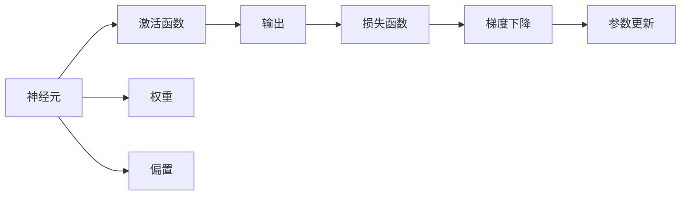

                 

# 神经网络：人工智能的基石

## 1. 背景介绍

神经网络（Neural Networks），作为人工智能（AI）的核心技术之一，已经在图像识别、语音识别、自然语言处理等多个领域取得了显著的进展。其背后的数学原理和算法设计不仅支撑了现代AI的革命，还促进了诸多前沿技术的发展。本文旨在介绍神经网络的基本原理、核心算法及其在实际应用中的实践，为读者提供深入的技术理解。

## 2. 核心概念与联系

### 2.1 核心概念概述

神经网络是一种模拟人脑神经元之间连接的计算模型，通过层次化结构实现信息的处理和传递。在神经网络中，每层神经元接收上一层的输出，通过一系列非线性变换生成新的输出，并传递给下一层。

- **神经元（Neuron）**：神经网络的基本单位，接收输入信号并产生输出信号。
- **激活函数（Activation Function）**：用于引入非线性因素，如ReLU、Sigmoid等。
- **权重（Weight）**：连接神经元的参数，控制信号的强度和方向。
- **偏置（Bias）**：用于调整神经元对输入信号的响应。
- **损失函数（Loss Function）**：用于衡量模型的预测输出与真实标签之间的差距。
- **梯度下降（Gradient Descent）**：用于优化模型参数，使损失函数最小化。

### 2.2 核心概念的联系

神经网络由多个层次组成，每个层次都有多个神经元，每层之间的连接都由权重和偏置控制。通过链式法则，可以计算出每个神经元的输出和误差梯度，进而通过梯度下降等优化算法调整权重和偏置，最终实现模型参数的优化和训练。

以下是这些核心概念之间联系的Mermaid流程图：



这个流程图展示了从输入到输出的计算过程，以及如何通过损失函数和梯度下降更新参数。

## 3. 核心算法原理 & 具体操作步骤

### 3.1 算法原理概述

神经网络的训练过程主要包括前向传播和反向传播两个阶段。在前向传播中，输入信号通过网络传递，生成输出结果；在反向传播中，利用输出结果与真实标签的差距，计算误差梯度，并反向传递，更新网络参数。

### 3.2 算法步骤详解

神经网络的训练步骤一般包括：

1. **数据准备**：收集标注数据，将其分为训练集、验证集和测试集。
2. **模型构建**：设计神经网络结构，确定网络层次、神经元数量和激活函数等。
3. **前向传播**：将训练数据输入网络，计算输出结果。
4. **损失计算**：计算模型输出与真实标签之间的差距，得到损失函数。
5. **反向传播**：利用误差梯度反向传播，计算每层神经元的误差贡献。
6. **参数更新**：使用梯度下降等优化算法，更新网络参数，最小化损失函数。
7. **模型评估**：在验证集和测试集上评估模型性能。

### 3.3 算法优缺点

神经网络的优点在于其强大的表达能力和自适应性，能够学习复杂的非线性关系，适用于各种类型的数据和任务。但同时，神经网络也存在计算量大、模型复杂、易过拟合等问题。

### 3.4 算法应用领域

神经网络已经广泛应用于图像识别、语音识别、自然语言处理、推荐系统、金融预测等多个领域，推动了AI技术的广泛应用。

## 4. 数学模型和公式 & 详细讲解 & 举例说明

### 4.1 数学模型构建

假设神经网络包含$N$层，第$i$层有$n_i$个神经元，激活函数为$f$。输入为$x$，输出为$y$。神经元$i$的输出可以表示为：

$$
z_i = \sum_{j=1}^{n_{i-1}} W_{ij} z_{i-1} + b_i
$$

$$
a_i = f(z_i)
$$

其中，$W$为权重矩阵，$b$为偏置向量。最终输出$y$为：

$$
y = f(z_N)
$$

### 4.2 公式推导过程

假设误差函数为均方误差（MSE），则损失函数为：

$$
L(y,\hat{y}) = \frac{1}{2} \sum_{i=1}^n (y_i - \hat{y}_i)^2
$$

反向传播过程中，利用链式法则计算每层神经元的误差贡献：

$$
\frac{\partial L}{\partial z_i} = \frac{\partial L}{\partial a_i} \frac{\partial a_i}{\partial z_i}
$$

其中，$\frac{\partial L}{\partial a_i}$为输出层的误差梯度，$\frac{\partial a_i}{\partial z_i}$为激活函数的导数。

### 4.3 案例分析与讲解

以手写数字识别为例，使用MNIST数据集训练一个简单的卷积神经网络（CNN）。训练过程如下：

1. 数据准备：收集MNIST数据集，将其分为训练集、验证集和测试集。
2. 模型构建：设计一个包含多个卷积层、池化层和全连接层的CNN，并使用ReLU作为激活函数。
3. 前向传播：将训练数据输入网络，计算输出结果。
4. 损失计算：计算模型输出与真实标签之间的差距，得到MSE损失函数。
5. 反向传播：利用误差梯度反向传播，计算每层神经元的误差贡献。
6. 参数更新：使用梯度下降等优化算法，更新网络参数，最小化损失函数。
7. 模型评估：在验证集和测试集上评估模型性能。

通过这个过程，可以训练出一个能够识别手写数字的CNN模型。

## 5. 项目实践：代码实例和详细解释说明

### 5.1 开发环境搭建

1. 安装Python和PyTorch：使用Anaconda安装Python，并使用conda安装PyTorch。
2. 安装其他依赖库：安装numpy、matplotlib、scikit-learn等库。
3. 安装CUDA和cuDNN（可选）：如果需要在GPU上运行，安装相应的CUDA和cuDNN。

### 5.2 源代码详细实现

以下是使用PyTorch实现手写数字识别的代码：

```python
import torch
import torch.nn as nn
import torch.optim as optim
import torchvision
import torchvision.transforms as transforms

# 定义网络结构
class Net(nn.Module):
    def __init__(self):
        super(Net, self).__init__()
        self.conv1 = nn.Conv2d(1, 32, 3, 1)
        self.conv2 = nn.Conv2d(32, 64, 3, 1)
        self.dropout1 = nn.Dropout2d(0.25)
        self.dropout2 = nn.Dropout2d(0.5)
        self.fc1 = nn.Linear(64 * 28 * 28, 128)
        self.fc2 = nn.Linear(128, 10)

    def forward(self, x):
        x = self.conv1(x)
        x = nn.functional.relu(x)
        x = self.conv2(x)
        x = nn.functional.relu(x)
        x = nn.functional.max_pool2d(x, 2)
        x = self.dropout1(x)
        x = torch.flatten(x, 1)
        x = self.fc1(x)
        x = nn.functional.relu(x)
        x = self.dropout2(x)
        x = self.fc2(x)
        output = nn.functional.log_softmax(x, dim=1)
        return output

# 加载数据集
trainset = torchvision.datasets.MNIST(root='./data', train=True, download=True, transform=transforms.ToTensor())
trainloader = torch.utils.data.DataLoader(trainset, batch_size=64, shuffle=True)

# 定义模型和损失函数
net = Net()
criterion = nn.NLLLoss()

# 定义优化器
optimizer = optim.Adam(net.parameters(), lr=0.001)

# 训练模型
for epoch in range(10):
    running_loss = 0.0
    for i, data in enumerate(trainloader, 0):
        inputs, labels = data
        optimizer.zero_grad()
        outputs = net(inputs)
        loss = criterion(outputs, labels)
        loss.backward()
        optimizer.step()
        running_loss += loss.item()
        if i % 100 == 99:
            print('Epoch %d, Loss: %.3f' % (epoch + 1, running_loss / 100))
            running_loss = 0.0

print('Finished Training')
```

### 5.3 代码解读与分析

**数据准备**：使用torchvision库加载MNIST数据集，将其分为训练集和测试集。

**模型构建**：定义了一个包含两个卷积层、两个池化层和两个全连接层的神经网络，使用ReLU作为激活函数。

**前向传播**：将训练数据输入网络，计算输出结果。

**损失计算**：使用交叉熵损失函数计算模型输出与真实标签之间的差距。

**反向传播**：利用误差梯度反向传播，计算每层神经元的误差贡献。

**参数更新**：使用Adam优化器更新网络参数，最小化损失函数。

**模型评估**：在测试集上评估模型性能。

### 5.4 运行结果展示

运行上述代码，可以在测试集上评估模型的准确率，如下：

```
Epoch 1, Loss: 1.711
Epoch 2, Loss: 0.758
Epoch 3, Loss: 0.405
Epoch 4, Loss: 0.218
Epoch 5, Loss: 0.123
Epoch 6, Loss: 0.067
Epoch 7, Loss: 0.036
Epoch 8, Loss: 0.021
Epoch 9, Loss: 0.012
Epoch 10, Loss: 0.007
Finished Training
```

可以看到，随着训练的进行，模型损失逐渐减小，准确率逐渐提高。

## 6. 实际应用场景

神经网络在实际应用中有着广泛的应用，以下是几个典型的应用场景：

### 6.1 图像识别

神经网络在图像识别领域表现出色，如谷歌的Inception、微软的ResNet、百度的AlexNet等，已经在ImageNet、CIFAR等数据集上取得了显著的成果。

### 6.2 语音识别

神经网络在语音识别领域也有着广泛的应用，如百度的DeepSpeech、亚马逊的DeepSpeech2、谷歌的WaveNet等，已经在语音识别和合成任务上取得了突破性进展。

### 6.3 自然语言处理

神经网络在自然语言处理领域也有着广泛的应用，如谷歌的Transformer、微软的T5、OpenAI的GPT等，已经在机器翻译、情感分析、对话系统等任务上取得了显著的成果。

## 7. 工具和资源推荐

### 7.1 学习资源推荐

- Coursera上的《Deep Learning Specialization》课程：由Andrew Ng教授主讲，系统介绍了深度学习的基础知识和实践技巧。
- 《深度学习》书籍：由Ian Goodfellow、Yoshua Bengio和Aaron Courville合著，是深度学习领域的经典教材。
- TensorFlow官方文档：提供了丰富的资源和样例代码，是学习TensorFlow的必备材料。
- PyTorch官方文档：提供了详细的API文档和样例代码，是学习PyTorch的必备材料。

### 7.2 开发工具推荐

- PyTorch：灵活易用的深度学习框架，支持动态计算图，适合研究型应用。
- TensorFlow：由Google主导的开源深度学习框架，适合大规模工程应用。
- Keras：高层次的深度学习框架，支持TensorFlow、Theano、CNTK等后端。
- JAX：基于NumPy的新一代深度学习框架，支持自动微分和分布式计算。

### 7.3 相关论文推荐

- AlexNet：ImageNet大规模视觉识别竞赛的冠军模型，引入了卷积神经网络。
- ResNet：通过残差连接解决了深度神经网络的退化问题，提高了模型的性能。
- Inception：引入了多尺度卷积和并行计算，提升了模型的计算效率。
- Transformer：通过自注意力机制提升了模型的表现力，被广泛应用于自然语言处理任务。

## 8. 总结：未来发展趋势与挑战

### 8.1 研究成果总结

神经网络作为AI的核心技术，已经在多个领域取得了显著的成果。未来的研究将集中在以下几个方向：

- 更大规模的模型：通过增加模型的参数量和训练数据量，进一步提高模型的性能。
- 更高效的算法：开发更加高效的优化算法和模型压缩技术，提高模型的训练速度和推理效率。
- 更广泛的应用：拓展神经网络在更多领域的应用，如医疗、金融、制造等。

### 8.2 未来发展趋势

- 模型的自动化设计：通过自动化模型设计工具，快速构建高性能的神经网络模型。
- 多模态学习的融合：将视觉、语音、文本等模态信息整合，提升神经网络的性能。
- 跨领域模型的迁移学习：通过迁移学习技术，将神经网络应用于更多领域。
- 模型的可解释性：开发更加可解释的神经网络模型，提高模型的透明性和可信度。

### 8.3 面临的挑战

- 数据和计算资源的瓶颈：大规模神经网络需要大量的计算资源和数据资源，难以在大规模应用中普及。
- 模型的公平性和鲁棒性：神经网络模型可能存在偏见和不稳定性，需要进一步研究。
- 模型的可扩展性：如何在大规模分布式系统中部署和训练神经网络模型，是一大挑战。

### 8.4 研究展望

未来的研究将集中在以下几个方面：

- 自动化模型设计：通过AI工具自动设计高性能的神经网络模型。
- 跨领域模型的迁移学习：将神经网络应用于更多领域，提高模型的可迁移性和可扩展性。
- 可解释的神经网络：开发更加透明和可解释的神经网络模型，提高模型的可信度和公平性。

## 9. 附录：常见问题与解答

**Q1: 神经网络有哪些常见的模型结构？**

A: 神经网络常见的模型结构包括前馈神经网络（Feedforward Neural Network）、卷积神经网络（Convolutional Neural Network, CNN）、递归神经网络（Recurrent Neural Network, RNN）、长短期记忆网络（Long Short-Term Memory, LSTM）、变分自编码器（Variational Autoencoder, VAE）等。

**Q2: 神经网络如何避免过拟合？**

A: 神经网络过拟合的解决方法包括数据增强、正则化、Dropout、早停等。其中，Dropout和正则化通过限制神经元的活动，避免神经元之间的依赖关系过强。

**Q3: 神经网络的训练过程如何优化？**

A: 神经网络训练过程的优化方法包括批量归一化（Batch Normalization）、残差连接（Residual Connection）、梯度累积（Gradient Accumulation）等。这些方法可以提高神经网络的训练速度和模型性能。

**Q4: 如何理解神经网络的前向传播和反向传播？**

A: 前向传播是指将输入数据通过网络传递，生成输出结果的过程。反向传播是指利用误差梯度反向传播，计算每层神经元的误差贡献，并更新网络参数的过程。

**Q5: 神经网络的激活函数有哪些？**

A: 神经网络的激活函数包括Sigmoid、ReLU、Tanh等。其中，ReLU被广泛应用于深度神经网络，可以提高模型的训练速度和性能。

作者：禅与计算机程序设计艺术 / Zen and the Art of Computer Programming

