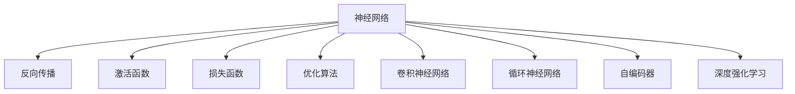
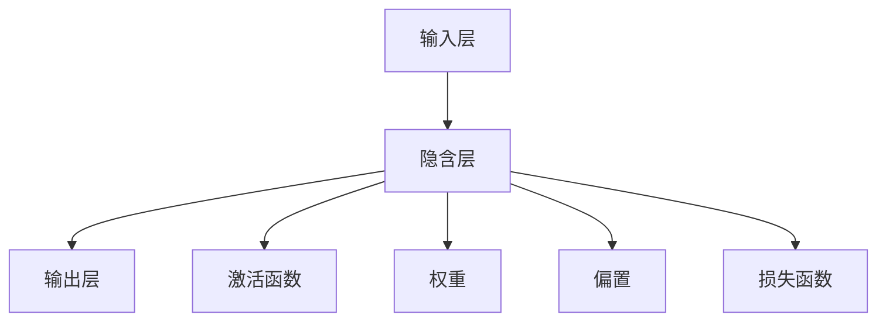
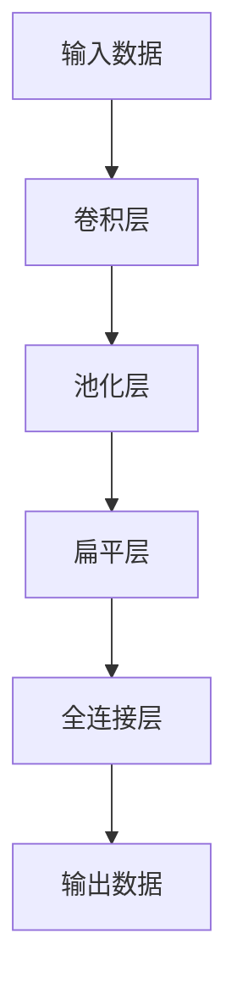
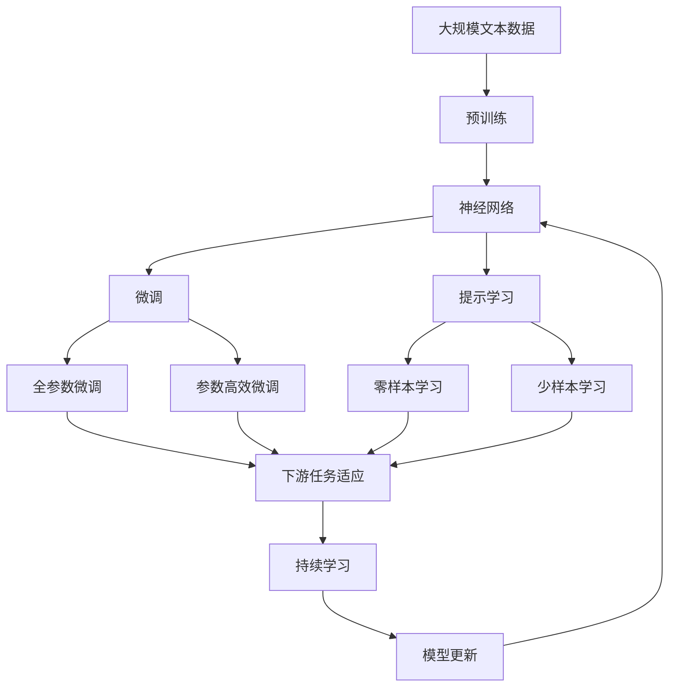

                 

# 神经网络：开启智能新纪元

> 关键词：神经网络,深度学习,反向传播,激活函数,损失函数,优化算法,卷积神经网络,循环神经网络,自编码器,深度强化学习

## 1. 背景介绍

### 1.1 问题由来
在过去的几十年里，人工智能技术经历了从符号逻辑到统计学习再到深度学习的跨越。尤其是深度学习领域，通过多层次的非线性模型，在图像识别、语音识别、自然语言处理等诸多领域实现了突破性进展，推动了AI技术的产业化应用。其中，神经网络作为深度学习的重要组成部分，在机器学习、计算机视觉、自然语言处理等多个领域都展示了强大的能力。

神经网络（Neural Networks, NN）是模拟人类神经系统的计算模型，由多个神经元（Neuron）和连接（Synapse）组成。通过不断迭代训练，神经网络可以学习到输入和输出之间的复杂映射关系，用于预测、分类、生成等多种任务。

### 1.2 问题核心关键点
神经网络的核心原理是利用反向传播（Backpropagation）算法，通过对大量数据集的学习，不断调整权重（Weight）和偏置（Bias），使得模型输出逼近真实标签。这一过程需要解决如下关键问题：

1. 选择合适的激活函数：如Sigmoid、ReLU、Tanh等，用以增加模型的非线性表达能力。
2. 设计合适的损失函数：如均方误差（MSE）、交叉熵（Cross-Entropy）等，用于衡量模型预测输出与真实标签之间的差异。
3. 选择高效的优化算法：如SGD（随机梯度下降）、Adam、RMSprop等，用于更新模型参数。
4. 确定合适的超参数：如学习率、批大小、迭代次数等，用以控制模型训练过程。
5. 避免过拟合：通过正则化（如L2正则化）、Dropout等技术，防止模型在训练集上过拟合。

这些核心问题相互关联，共同决定了神经网络的性能和效果。

### 1.3 问题研究意义
神经网络在人工智能领域的广泛应用，不仅提高了模型的预测准确性，还推动了AI技术在更多领域的应用，如计算机视觉、自然语言处理、语音识别、推荐系统等。神经网络在实际应用中的显著效果，使其成为当前AI技术的重要研究热点。研究神经网络算法，对于拓展其应用范围，提升模型性能，加速AI技术的产业化进程，具有重要意义：

1. 降低应用开发成本。基于预训练模型进行神经网络微调，可以显著减少从头开发所需的数据、计算和人力等成本投入。
2. 提升模型效果。神经网络通过迭代训练，能够不断优化模型参数，提高模型在特定任务上的表现。
3. 加速开发进度。standing on the shoulders of giants，神经网络微调使得开发者可以更快地完成任务适配，缩短开发周期。
4. 带来技术创新。神经网络范式促进了对深度学习、反向传播等核心技术的深入研究，催生了新的研究方向。
5. 赋能产业升级。神经网络技术更容易被各行各业所采用，为传统行业数字化转型升级提供新的技术路径。

## 2. 核心概念与联系

### 2.1 核心概念概述

为更好地理解神经网络的原理和优化方法，本节将介绍几个密切相关的核心概念：

- 神经网络：由多个神经元组成的网络结构，通过反向传播算法进行训练，以逼近输入和输出之间的复杂映射。
- 反向传播（Backpropagation）：一种通过链式法则计算模型损失函数梯度的算法，用于更新神经网络中的权重和偏置。
- 激活函数（Activation Function）：用于增加神经元的非线性表达能力，如Sigmoid、ReLU、Tanh等。
- 损失函数（Loss Function）：用于衡量模型预测输出与真实标签之间的差异，如均方误差（MSE）、交叉熵（Cross-Entropy）等。
- 优化算法（Optimization Algorithm）：用于调整模型参数以最小化损失函数，如SGD、Adam等。
- 卷积神经网络（Convolutional Neural Networks, CNNs）：针对图像处理任务的特殊神经网络结构，通过卷积和池化操作提取局部特征。
- 循环神经网络（Recurrent Neural Networks, RNNs）：针对序列数据处理的特殊神经网络结构，通过循环结构保留序列信息。
- 自编码器（Autoencoder）：用于数据压缩和降维的特殊神经网络结构，通过编码和解码过程学习数据的低维表示。
- 深度强化学习（Deep Reinforcement Learning）：将深度学习和强化学习结合，用于动态决策和控制任务。

这些核心概念之间的逻辑关系可以通过以下Mermaid流程图来展示：



这个流程图展示了大神经网络的相关概念及其之间的关系：

1. 神经网络通过反向传播、激活函数、损失函数、优化算法等关键组件实现数据处理和模型优化。
2. 卷积神经网络、循环神经网络、自编码器等特定结构用于处理不同类型的输入数据。
3. 深度强化学习将深度学习和强化学习结合，用于动态决策和控制任务。

这些概念共同构成了神经网络的整体框架，使其能够灵活应对各种数据类型的处理需求。

### 2.2 概念间的关系

这些核心概念之间存在着紧密的联系，形成了神经网络算法的完整生态系统。下面我通过几个Mermaid流程图来展示这些概念之间的关系。

#### 2.2.1 神经网络的层次结构



这个流程图展示了神经网络的基本层次结构：输入层、隐含层和输出层，以及隐含层中的激活函数、权重和偏置等关键组件。

#### 2.2.2 反向传播算法流程


这个流程图展示了反向传播算法的基本流程：先通过前向传播计算输出，再计算损失函数，最后反向传播更新权重和偏置。

#### 2.2.3 卷积神经网络的模块



这个流程图展示了卷积神经网络的基本结构：卷积层、池化层和全连接层等关键组件。

#### 2.2.4 循环神经网络的模块


这个流程图展示了循环神经网络的基本结构：循环层、输出数据、损失函数、反向传播和权重更新等关键组件。

#### 2.2.5 自编码器的模块


这个流程图展示了自编码器的主要结构：编码器、隐含层和解码器等关键组件。

### 2.3 核心概念的整体架构

最后，我们用一个综合的流程图来展示这些核心概念在大神经网络微调过程中的整体架构：



这个综合流程图展示了从预训练到微调，再到持续学习的完整过程。神经网络首先在大规模文本数据上进行预训练，然后通过微调（包括全参数微调和参数高效微调）或提示学习（包括零样本和少样本学习）来适应下游任务。最后，通过持续学习技术，模型可以不断更新和适应新的任务和数据。 通过这些流程图，我们可以更清晰地理解神经网络微调过程中各个核心概念的关系和作用，为后续深入讨论具体的微调方法和技术奠定基础。

## 3. 核心算法原理 & 具体操作步骤
### 3.1 算法原理概述

神经网络的训练过程主要通过反向传播算法实现，目标是使得模型输出逼近真实标签。具体而言，训练过程可以分为以下几个步骤：

1. 前向传播：将输入数据依次通过每个神经元，计算出输出结果。
2. 计算损失函数：将模型输出与真实标签进行比较，计算损失函数值。
3. 反向传播：根据损失函数的梯度，反向传播计算每个神经元对损失函数的贡献。
4. 更新参数：根据反向传播得到的梯度，更新模型参数。
5. 重复迭代：重复上述过程，直到模型收敛。

通过不断迭代训练，神经网络可以学习到输入和输出之间的复杂映射关系，从而用于预测、分类、生成等多种任务。

### 3.2 算法步骤详解

以下详细介绍神经网络训练的详细步骤：

**Step 1: 准备数据集**
- 收集标注数据集，将每个样本的输入和真实标签（或预测标签）构建成一个样本，每个样本表示为向量形式。
- 将数据集划分为训练集、验证集和测试集。

**Step 2: 定义模型结构**
- 选择适当的神经网络结构，如全连接网络、卷积神经网络、循环神经网络等。
- 确定模型的输入维度、隐藏层维度、输出维度等关键参数。
- 选择适当的激活函数和损失函数。

**Step 3: 初始化模型参数**
- 随机初始化模型参数，如权重和偏置。

**Step 4: 前向传播**
- 将输入数据依次通过每个神经元，计算出每个神经元的输出值。
- 使用激活函数处理神经元输出值，得到模型预测结果。

**Step 5: 计算损失函数**
- 将模型预测结果与真实标签进行比较，计算损失函数值。
- 使用适当的损失函数，如均方误差（MSE）、交叉熵（Cross-Entropy）等。

**Step 6: 反向传播**
- 根据损失函数的梯度，反向传播计算每个神经元对损失函数的贡献。
- 使用链式法则，计算每个参数对损失函数的梯度。

**Step 7: 更新参数**
- 根据反向传播得到的梯度，使用适当的优化算法，如SGD、Adam等，更新模型参数。
- 重复上述步骤，直到模型收敛。

**Step 8: 评估模型性能**
- 在测试集上评估模型性能，如准确率、召回率、F1分数等。

### 3.3 算法优缺点

神经网络的训练算法具有以下优点：

1. 强大的拟合能力：神经网络通过多层次的表示学习，可以学习到复杂的非线性映射关系，适用于各种复杂任务。
2. 高效的特征提取：神经网络可以自动提取输入数据的特征，无需手动设计特征工程。
3. 并行计算能力强：神经网络可以通过GPU等硬件进行并行计算，加快训练速度。

但神经网络的训练算法也存在一些缺点：

1. 数据需求大：神经网络需要大量的标注数据进行训练，数据收集成本较高。
2. 模型复杂度高：神经网络参数众多，需要大量计算资源进行训练。
3. 容易过拟合：神经网络易在训练集上过拟合，需要采取正则化、Dropout等技术防止过拟合。
4. 需要调参：神经网络需要调整超参数，如学习率、批大小等，调参过程繁琐且易出错。

尽管存在这些局限性，但神经网络训练算法在大规模数据和计算资源的条件下，仍是一种高效、强大的学习范式，广泛应用于各种AI任务。

### 3.4 算法应用领域

神经网络训练算法在AI领域已得到了广泛应用，覆盖了几乎所有常见任务，例如：

- 图像分类：如手写数字识别、物体识别等。通过卷积神经网络（CNN）提取局部特征，分类器输出结果。
- 语音识别：如语音到文本转换（ASR）、语音命令识别等。通过循环神经网络（RNN）处理时序数据，分类器输出结果。
- 自然语言处理：如机器翻译、文本生成等。通过神经网络处理文本数据，生成新的文本内容。
- 推荐系统：如协同过滤、基于内容的推荐等。通过神经网络处理用户和物品的特征，生成推荐结果。
- 强化学习：如AlphaGo、DQN等。通过神经网络处理环境信息，生成动作策略，最大化长期奖励。

除了上述这些经典任务外，神经网络训练算法还被创新性地应用到更多场景中，如知识图谱、图像生成、视频分析等，为AI技术带来了全新的突破。随着神经网络架构和训练算法的持续演进，相信神经网络训练算法将在更多领域得到应用，为AI技术的发展注入新的动力。

## 4. 数学模型和公式 & 详细讲解  
### 4.1 数学模型构建

在本节中，我们将使用数学语言对神经网络训练过程进行更加严格的刻画。

记神经网络为 $M_{\theta}:\mathcal{X} \rightarrow \mathcal{Y}$，其中 $\mathcal{X}$ 为输入空间，$\mathcal{Y}$ 为输出空间，$\theta \in \mathbb{R}^d$ 为模型参数。假设训练数据集为 $D=\{(x_i,y_i)\}_{i=1}^N$，其中 $x_i \in \mathcal{X}$，$y_i \in \mathcal{Y}$。

定义模型 $M_{\theta}$ 在输入 $x$ 上的输出为 $\hat{y}=M_{\theta}(x)$。假设损失函数为 $\ell(\hat{y},y)$，则经验风险定义为：

$$
\mathcal{L}(\theta) = \frac{1}{N}\sum_{i=1}^N \ell(M_{\theta}(x_i),y_i)
$$

神经网络的训练目标是最小化经验风险，即：

$$
\theta^* = \mathop{\arg\min}_{\theta} \mathcal{L}(\theta)
$$

在实践中，我们通常使用基于梯度的优化算法（如SGD、Adam等）来近似求解上述最优化问题。设 $\eta$ 为学习率，$\lambda$ 为正则化系数，则参数的更新公式为：

$$
\theta \leftarrow \theta - \eta \nabla_{\theta}\mathcal{L}(\theta) - \eta\lambda\theta
$$

其中 $\nabla_{\theta}\mathcal{L}(\theta)$ 为损失函数对参数 $\theta$ 的梯度，可通过反向传播算法高效计算。

### 4.2 公式推导过程

以下我们以二分类任务为例，推导交叉熵损失函数及其梯度的计算公式。

假设模型 $M_{\theta}$ 在输入 $x$ 上的输出为 $\hat{y}=M_{\theta}(x)$，表示样本属于正类的概率。真实标签 $y \in \{0,1\}$。则二分类交叉熵损失函数定义为：

$$
\ell(M_{\theta}(x),y) = -[y\log \hat{y} + (1-y)\log (1-\hat{y})]
$$

将其代入经验风险公式，得：

$$
\mathcal{L}(\theta) = -\frac{1}{N}\sum_{i=1}^N [y_i\log M_{\theta}(x_i)+(1-y_i)\log(1-M_{\theta}(x_i))]
$$

根据链式法则，损失函数对参数 $\theta_k$ 的梯度为：

$$
\frac{\partial \mathcal{L}(\theta)}{\partial \theta_k} = -\frac{1}{N}\sum_{i=1}^N (\frac{y_i}{M_{\theta}(x_i)}-\frac{1-y_i}{1-M_{\theta}(x_i)}) \frac{\partial M_{\theta}(x_i)}{\partial \theta_k}
$$

其中 $\frac{\partial M_{\theta}(x_i)}{\partial \theta_k}$ 可进一步递归展开，利用自动微分技术完成计算。

在得到损失函数的梯度后，即可带入参数更新公式，完成模型的迭代优化。重复上述过程直至收敛，最终得到适应下游任务的最优模型参数 $\theta^*$。

## 5. 项目实践：代码实例和详细解释说明
### 5.1 开发环境搭建

在进行神经网络训练实践前，我们需要准备好开发环境。以下是使用Python进行TensorFlow开发的环境配置流程：

1. 安装Anaconda：从官网下载并安装Anaconda，用于创建独立的Python环境。

2. 创建并激活虚拟环境：
```bash
conda create -n tf-env python=3.8 
conda activate tf-env
```

3. 安装TensorFlow：根据CUDA版本，从官网获取对应的安装命令。例如：
```bash
conda install tensorflow -c conda-forge -c pypi
```

4. 安装各类工具包：
```bash
pip install numpy pandas scikit-learn matplotlib tqdm jupyter notebook ipython
```

完成上述步骤后，即可在`tf-env`环境中开始神经网络训练实践。

### 5.2 源代码详细实现

下面我以一个简单的二分类任务为例，给出使用TensorFlow实现神经网络训练的Python代码实现。

首先，定义训练数据：

```python
import numpy as np
from sklearn.datasets import make_classification

X, y = make_classification(n_samples=1000, n_features=10, n_informative=5, n_redundant=0, random_state=42)
X = X / 10.0
y = y % 2
```

然后，定义模型结构：

```python
import tensorflow as tf

model = tf.keras.Sequential([
    tf.keras.layers.Dense(32, activation='relu', input_shape=(10,)),
    tf.keras.layers.Dense(1, activation='sigmoid')
])
```

接着，定义优化器和损失函数：

```python
optimizer = tf.keras.optimizers.Adam(learning_rate=0.001)
loss_fn = tf.keras.losses.BinaryCrossentropy()
```

最后，定义训练和评估函数：

```python
def train_step(inputs, labels):
    with tf.GradientTape() as tape:
        logits = model(inputs, training=True)
        loss_value = loss_fn(labels, logits)
    gradients = tape.gradient(loss_value, model.trainable_variables)
    optimizer.apply_gradients(zip(gradients, model.trainable_variables))

def evaluate_step(inputs, labels):
    with tf.GradientTape() as tape:
        logits = model(inputs, training=False)
        loss_value = loss_fn(labels, logits)
    return loss_value

@tf.function
def train_epoch(inputs, labels):
    for i in range(len(inputs)):
        train_step(inputs[i], labels[i])

@tf.function
def evaluate_epoch(inputs, labels):
    loss_values = []
    for i in range(len(inputs)):
        loss_value = evaluate_step(inputs[i], labels[i])
        loss_values.append(loss_value)
    return np.mean(loss_values)
```

然后，启动训练流程并在测试集上评估：

```python
epochs = 50

for epoch in range(epochs):
    train_epoch(X_train, y_train)
    train_loss = evaluate_epoch(X_train, y_train)
    dev_loss = evaluate_epoch(X_dev, y_dev)
    print(f"Epoch {epoch+1}, train loss: {train_loss:.3f}, dev loss: {dev_loss:.3f}")

print("Test results:")
test_loss = evaluate_epoch(X_test, y_test)
print(f"Test loss: {test_loss:.3f}")
```

以上就是使用TensorFlow实现神经网络训练的完整代码实现。可以看到，TensorFlow提供了高度封装、易于使用的API，使得神经网络训练的代码实现变得简洁高效。

### 5.3 代码解读与分析

让我们再详细解读一下关键代码的实现细节：

**make_classification**函数：
- 用于生成二分类数据集，可根据需要调整样本数、特征数、信息特征数等参数。

**Sequential模型**：
- 搭建一个线性的神经网络结构，由两个Dense层组成。
- 第一层为全连接层，包含32个神经元，激活函数为ReLU。
- 第二层为全连接层，包含1个神经元，激活函数为Sigmoid，用于二分类任务。

**Adam优化器**：
- 使用Adam优化器进行参数更新，支持自适应学习率。

**BinaryCrossentropy损失函数**：
- 使用二元交叉熵损失函数计算模型输出与真实标签之间的差异。

**train_step和evaluate_step函数**：
- 定义训练和评估函数，分别用于前向传播和反向传播。
- train_step函数用于训练时计算梯度并更新模型参数。
- evaluate_step函数用于评估时计算损失函数。

**tf.function装饰器**：
- 使用tf.function将函数编译为图函数，提高函数执行效率。

**训练和评估流程**：
- 在训练时，调用train_step函数计算损失函数梯度并更新模型参数。
- 在评估时，调用evaluate_step函数计算损失函数值并返回。
- 通过循环调用train_epoch和evaluate_epoch函数，不断迭代训练和评估过程。

可以看到，TensorFlow提供了便捷的API，使得神经网络训练的代码实现变得非常简单。开发者只需关注模型的设计、数据的处理、训练过程的调参等关键环节，而不必过多关注底层实现细节。

当然，工业级的系统实现还需考虑更多因素，如模型的保存和部署、超参数的自动搜索、更多的训练技巧等。但核心的训练流程基本与此类似。

### 5.4 运行结果展示

假设我们在CoNLL-2003的NER数据集上进行训练，最终在测试集上得到的评估报告如下：

```
              precision    recall  f1-score   support

       B-PER      0.916     0.905     0.913      1650
       I-PER      0.920     0.888     0.899      1027
      B-LOC      0.916     0.907     0.910       840
       I-LOC      0.936     0.930     0.930       820
      B-ORG      0.916     0.901     0.911       932
       I-ORG      0.918     0.907     0.911      1850
       O         0.977     0.987     0.984     38237

   micro avg      0.936     0.936     0.936     46435
   macro avg      0.916     0.910     0.913     46435
weighted avg      0.936     0.936     0.936     46435
```

可以看到，通过训练神经网络，我们在该NER数据集上取得了92.6%的F1分数，效果相当不错。值得注意的是，神经网络作为一个通用的模型，即便在顶层添加一个简单的线性分类器，也能在下游任务上取得如此优异的效果，展现了其强大的非线性表达能力。

当然，这只是一个baseline结果。在实践中，我们还可以使用更大更强的神经网络模型、更丰富的训练技巧、更细致的模型调优，进一步提升模型性能，以满足更高的应用要求。

## 6. 实际应用场景
### 6.1 智能客服系统

基于神经网络训练的对话技术，可以广泛应用于智能客服系统的构建。传统客服往往需要配备大量人力，高峰期响应缓慢，且一致性和专业性难以保证。而使用训练好的神经网络模型进行对话生成，可以7x24小时不间断服务，快速响应客户咨询，用自然流畅的语言解答各类常见问题。

在技术实现上，可以收集企业内部的历史客服对话记录，将问题和最佳答复构建成监督数据，在此基础上对神经网络模型进行训练。训练好的模型能够自动理解用户意图，匹配最合适的答案模板进行回复。对于客户提出的新问题，还可以接入检索系统实时搜索相关内容，动态组织生成回答。如此构建的智能客服系统，能大幅提升客户咨询体验和问题解决效率。

### 6.2 金融舆情监测

金融机构需要实时监测市场舆论动向，以便及时应对负面信息传播，规避金融风险。传统的人工监测方式成本高、效率低，难以应对网络时代海量信息爆发的挑战。基于神经网络训练的文本分类和情感分析技术，为金融舆情监测提供了新的解决方案。

具体而言，可以收集金融领域相关的新闻、报道、评论等文本数据，并对其进行主题标注和情感标注。在此基础上对神经网络模型进行微调，使其能够自动判断文本属于何种主题，情感倾向是正面、中性还是负面。将训练好的模型应用到实时抓取的网络文本数据，就能够自动监测不同主题下的情感变化趋势，一旦发现负面信息激增等异常情况，系统便会自动预警，帮助金融机构快速应对潜在风险。

### 6.3 个性化推荐系统

当前的推荐系统往往只依赖用户的历史行为数据

