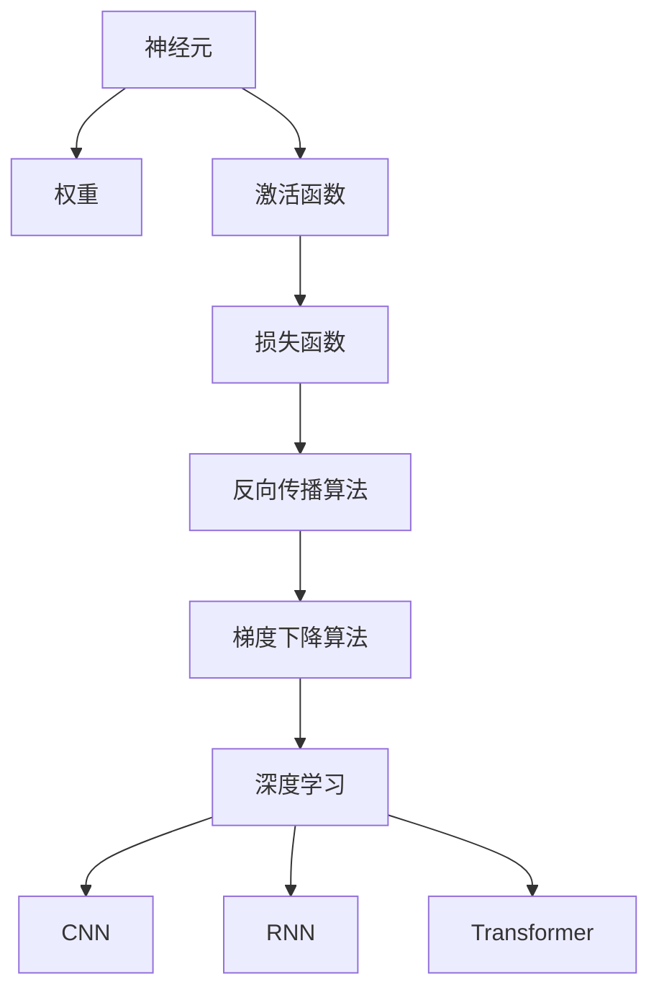

                 

# 神经网络：推动社会进步的力量

> 关键词：神经网络,深度学习,人工智能,机器学习,自动化,工业4.0

## 1. 背景介绍

### 1.1 问题由来
随着信息时代的到来，我们周围的生活被智能化和自动化的浪潮所席卷。从智能手机、智能家居到自动驾驶、智慧医疗，人工智能（AI）技术正以我们难以想象的速度改变着人类的生产、生活乃至社会的运行方式。在众多AI技术中，神经网络（Neural Network）无疑是最引人注目的。

神经网络通过模仿人类大脑的神经元结构，实现从输入到输出的复杂映射，成为现代人工智能的核心技术之一。自1950s被提出以来，神经网络经历了数次兴衰，直到近年来深度学习（Deep Learning）的突破，再次焕发出前所未有的生命力。

神经网络之所以能够成为推动社会进步的力量，主要归因于以下几个方面：

- **复杂映射能力**：神经网络能够处理高维度、非线性的数据，是实现复杂问题求解的理想工具。
- **自我学习**：通过反向传播算法，神经网络能够从大量数据中自我学习，无需显式编程。
- **广泛应用**：神经网络已成功应用于图像识别、语音识别、自然语言处理、自动驾驶等多个领域，对各行各业产生深远影响。
- **创新驱动**：神经网络技术的进步，如卷积神经网络（CNN）、循环神经网络（RNN）、变换器（Transformer）等，极大地推动了科技和产业的进步。

### 1.2 问题核心关键点
神经网络的核心思想是模拟人脑神经元之间的连接，通过一系列线性变换和非线性激活函数，实现对输入数据的抽象和映射。其主要组成部分包括：

- **输入层**：接收输入数据，将原始数据转换为网络可以处理的形式。
- **隐藏层**：神经网络的核心部分，通过一系列神经元计算，提取数据中的高层次特征。
- **输出层**：根据隐藏层的输出，输出最终结果。

神经网络的训练过程通常使用反向传播算法，通过对比模型预测与实际标签的差异，反向计算梯度，不断调整权重，最小化损失函数，优化模型性能。训练过程一般包括数据准备、模型构建、损失函数设计、优化算法选择、模型验证和测试等步骤。

当前，深度学习领域的神经网络技术已经取得了令人瞩目的成就，成为推动社会进步的重要力量。以下，我们将通过数学建模和具体案例，深入探讨神经网络的核心原理和实际应用。

## 2. 核心概念与联系

### 2.1 核心概念概述

为更好地理解神经网络的原理和应用，本节将介绍几个核心概念及其相互联系：

- **神经元（Neuron）**：神经网络的基本单元，通过输入加权求和并经过激活函数映射得到输出。
- **权重（Weight）**：神经元之间的连接参数，决定了输入与输出之间的映射关系。
- **激活函数（Activation Function）**：引入非线性映射，增强神经网络的表达能力。
- **损失函数（Loss Function）**：评估模型预测与真实标签的差异，指导模型优化。
- **反向传播算法（Backpropagation）**：通过链式法则计算梯度，实现权重更新。
- **梯度下降算法（Gradient Descent）**：优化算法的一种，通过梯度信息调整权重，最小化损失函数。
- **深度学习（Deep Learning）**：使用多层次的神经网络进行学习，从数据中抽取高层次特征。
- **卷积神经网络（CNN）**：专门用于图像处理，通过卷积和池化操作提取局部特征。
- **循环神经网络（RNN）**：用于处理序列数据，通过隐藏状态的传递和更新，提取时间序列特征。
- **变换器（Transformer）**：基于注意力机制，能够处理长距离依赖，适用于自然语言处理任务。

这些概念通过以下Mermaid流程图来展示它们之间的联系：



这个流程图展示了神经网络的几个核心组件及其相互关系。神经元通过权重和激活函数进行计算，得到输出；损失函数评估预测与实际之间的差异；反向传播算法通过链式法则计算梯度；梯度下降算法用于权重更新；深度学习使用多层神经元进行特征抽取；CNN、RNN、Transformer等不同架构在特定领域展示了优越性能。

### 2.2 概念间的关系

神经网络中的各组件之间存在复杂的相互作用关系，它们共同构成了神经网络的核心逻辑。以下通过几个例子详细阐述这些关系：

#### 2.2.1 神经元与权重
神经元的输出是输入与权重的加权和经过激活函数映射的结果。例如，对于一个单层的神经网络，神经元的输出 $h$ 可以表示为：

$$
h = \sigma(\sum_{i=1}^d w_i x_i + b)
$$

其中 $x$ 为输入向量，$w$ 为权重向量，$b$ 为偏置项，$\sigma$ 为激活函数。

#### 2.2.2 激活函数
激活函数引入非线性映射，使得神经网络能够处理非线性问题。例如，Sigmoid函数可以将神经元的输出映射到 $(0,1)$ 之间，ReLU函数在神经元输出为正时激活，负时置零。常见的激活函数包括Sigmoid、Tanh、ReLU、Leaky ReLU等。

#### 2.2.3 损失函数
损失函数用于评估模型预测与实际标签之间的差异，常见的损失函数包括均方误差（MSE）、交叉熵（Cross Entropy）等。例如，对于一个分类任务，交叉熵损失函数可以表示为：

$$
\mathcal{L}(y,\hat{y}) = -\frac{1}{N} \sum_{i=1}^N y_i \log \hat{y}_i
$$

其中 $y$ 为真实标签，$\hat{y}$ 为模型预测概率。

#### 2.2.4 反向传播算法
反向传播算法通过链式法则计算损失函数对每个权重和偏置项的梯度，用于权重更新。例如，对于一个包含一个隐藏层的神经网络，反向传播过程可以表示为：

$$
\frac{\partial \mathcal{L}}{\partial w_1} = \frac{\partial \mathcal{L}}{\partial h} \frac{\partial h}{\partial w_1} = \frac{\partial \mathcal{L}}{\partial \hat{y}} \frac{\partial \hat{y}}{\partial h} \frac{\partial h}{\partial w_1}
$$

其中 $\frac{\partial \mathcal{L}}{\partial h}$ 为损失函数对隐藏层输出的梯度，$\frac{\partial h}{\partial w_1}$ 为隐藏层输出对权重 $w_1$ 的梯度，$\frac{\partial \hat{y}}{\partial h}$ 为预测概率对隐藏层输出的梯度。

#### 2.2.5 梯度下降算法
梯度下降算法通过计算损失函数对每个权重和偏置项的梯度，更新权重和偏置项，以最小化损失函数。例如，对于单层神经网络，梯度下降算法可以表示为：

$$
w \leftarrow w - \eta \frac{\partial \mathcal{L}}{\partial w}
$$

其中 $\eta$ 为学习率，$\frac{\partial \mathcal{L}}{\partial w}$ 为损失函数对权重的梯度。

#### 2.2.6 深度学习与架构
深度学习通过多层次的神经网络进行特征提取，增强模型的表达能力。常见的深度学习架构包括卷积神经网络（CNN）、循环神经网络（RNN）和变换器（Transformer）等。

- CNN通过卷积和池化操作，在图像处理中表现出色。
- RNN通过循环连接，用于处理序列数据，如自然语言处理、时间序列预测等。
- Transformer通过自注意力机制，实现全局依赖的建模，适用于自然语言处理。

#### 2.2.7 训练过程
神经网络的训练过程包括数据准备、模型构建、损失函数设计、优化算法选择、模型验证和测试等步骤。例如，对于一个分类任务，训练过程可以包括以下步骤：

1. **数据准备**：将原始数据划分为训练集、验证集和测试集，进行数据预处理，如归一化、标准化等。
2. **模型构建**：选择适当的神经网络架构，初始化权重和偏置项。
3. **损失函数设计**：根据任务类型选择适当的损失函数，如交叉熵损失。
4. **优化算法选择**：选择适当的优化算法，如梯度下降、Adam等。
5. **模型验证**：在验证集上评估模型性能，调整超参数。
6. **模型测试**：在测试集上测试模型性能，进行模型部署。

通过以上分析，我们可以看出，神经网络的各个组件之间相互依赖，共同构成了一个复杂的系统。理解这些组件及其相互关系，对于深入理解神经网络的工作原理和应用具有重要意义。

## 3. 核心算法原理 & 具体操作步骤
### 3.1 算法原理概述

神经网络的核心算法包括反向传播算法和梯度下降算法，用于计算损失函数对权重和偏置项的梯度，并更新模型参数，最小化损失函数。

反向传播算法通过链式法则，计算损失函数对每个权重和偏置项的梯度，具体步骤如下：

1. 前向传播：计算模型对输入数据的预测输出。
2. 反向传播：从输出层开始，通过链式法则计算每个隐藏层和输入层对损失函数的梯度。
3. 权重更新：根据梯度更新权重和偏置项，最小化损失函数。

梯度下降算法通过计算损失函数对权重和偏置项的梯度，更新模型参数，具体步骤如下：

1. 计算梯度：计算损失函数对每个权重和偏置项的梯度。
2. 更新权重：根据梯度信息，更新权重和偏置项。
3. 重复迭代：多次迭代，直到损失函数收敛。

### 3.2 算法步骤详解

以下详细介绍神经网络的训练过程，包括数据准备、模型构建、损失函数设计、优化算法选择、模型验证和测试等步骤。

#### 3.2.1 数据准备
数据准备是神经网络训练的第一步，主要包括数据清洗、数据划分、特征提取和数据标准化等步骤。例如，对于图像分类任务，数据准备过程可以包括以下步骤：

1. **数据清洗**：去除不合法或不完整的数据，确保数据质量。
2. **数据划分**：将数据划分为训练集、验证集和测试集，一般比例为6:2:2。
3. **特征提取**：提取图像的特征，如颜色、纹理、形状等，用于训练模型。
4. **数据标准化**：对数据进行标准化处理，如归一化、均值偏移等，提高模型的收敛速度。

#### 3.2.2 模型构建
模型构建是神经网络训练的核心步骤，主要包括选择架构、初始化权重和偏置项等。例如，对于一个简单的神经网络，模型构建过程可以包括以下步骤：

1. **选择架构**：选择合适的神经网络架构，如单层感知机、多层感知机（MLP）等。
2. **初始化权重**：随机初始化权重和偏置项，例如，对于一个单层神经网络，权重 $w$ 和偏置项 $b$ 可以随机初始化为一个小的随机数。
3. **设置超参数**：设置学习率、批大小、迭代轮数等超参数。

#### 3.2.3 损失函数设计
损失函数用于评估模型预测与实际标签之间的差异，常用的损失函数包括均方误差（MSE）、交叉熵（Cross Entropy）等。例如，对于一个二分类任务，交叉熵损失函数可以表示为：

$$
\mathcal{L}(y,\hat{y}) = -\frac{1}{N} \sum_{i=1}^N y_i \log \hat{y}_i
$$

其中 $y$ 为真实标签，$\hat{y}$ 为模型预测概率。

#### 3.2.4 优化算法选择
优化算法用于最小化损失函数，常用的优化算法包括梯度下降（GD）、随机梯度下降（SGD）、Adam等。例如，对于单层神经网络，梯度下降算法可以表示为：

$$
w \leftarrow w - \eta \frac{\partial \mathcal{L}}{\partial w}
$$

其中 $\eta$ 为学习率，$\frac{\partial \mathcal{L}}{\partial w}$ 为损失函数对权重的梯度。

#### 3.2.5 模型验证
模型验证用于评估模型在验证集上的性能，调整超参数以优化模型。例如，对于一个分类任务，模型验证过程可以包括以下步骤：

1. **划分验证集**：将数据集划分为训练集和验证集。
2. **训练模型**：在训练集上训练模型，计算损失函数。
3. **验证模型**：在验证集上测试模型，计算损失函数。
4. **调整超参数**：根据验证集上的性能，调整学习率、批大小等超参数。

#### 3.2.6 模型测试
模型测试用于评估模型在测试集上的性能，进行模型部署。例如，对于一个分类任务，模型测试过程可以包括以下步骤：

1. **划分测试集**：将数据集划分为训练集、验证集和测试集。
2. **训练模型**：在训练集上训练模型，计算损失函数。
3. **测试模型**：在测试集上测试模型，计算损失函数。
4. **评估性能**：根据测试集上的性能，评估模型性能。

### 3.3 算法优缺点

神经网络训练的主要优点包括：

1. **自我学习**：神经网络通过反向传播算法，可以从大量数据中自我学习，无需显式编程。
2. **表达能力强**：神经网络可以通过多层次的神经元进行复杂特征的提取，增强表达能力。
3. **应用广泛**：神经网络已成功应用于图像识别、语音识别、自然语言处理等多个领域，具有广泛的应用前景。
4. **精度高**：神经网络通过多层次的非线性映射，能够在复杂问题上取得优异的精度。

神经网络训练的主要缺点包括：

1. **数据依赖**：神经网络需要大量标注数据进行训练，标注成本高昂。
2. **过拟合风险**：神经网络容易过拟合训练集，泛化性能不足。
3. **计算资源需求高**：神经网络训练需要大量计算资源，如GPU、TPU等高性能设备。
4. **可解释性不足**：神经网络通常被视为“黑盒”模型，难以解释其内部工作机制和决策逻辑。

### 3.4 算法应用领域

神经网络在多个领域取得了显著成果，以下是其主要应用场景：

#### 3.4.1 计算机视觉
神经网络在计算机视觉领域取得了巨大成功，主要用于图像识别、目标检测、图像分割等任务。例如，卷积神经网络（CNN）通过卷积和池化操作，从图像中提取局部特征，实现高精度的图像分类和物体检测。

#### 3.4.2 自然语言处理
神经网络在自然语言处理领域也取得了重要进展，主要用于文本分类、情感分析、机器翻译等任务。例如，循环神经网络（RNN）通过循环连接，实现时间序列数据的处理，适用于自然语言处理中的文本生成和序列标注。

#### 3.4.3 语音识别
神经网络在语音识别领域也有广泛应用，主要用于语音转文本、语音情感识别等任务。例如，循环神经网络（RNN）通过循环连接，实现语音信号的建模和处理。

#### 3.4.4 游戏AI
神经网络在游戏AI领域也取得了重要进展，主要用于游戏AI的开发和优化。例如，深度强化学习（Deep Reinforcement Learning）通过神经网络优化游戏策略，提升游戏性能和体验。

#### 3.4.5 医疗诊断
神经网络在医疗诊断领域也有广泛应用，主要用于医学图像分析、疾病预测等任务。例如，卷积神经网络（CNN）通过卷积和池化操作，实现医学影像的分析和识别。

#### 3.4.6 自动驾驶
神经网络在自动驾驶领域也有广泛应用，主要用于目标检测、路径规划、交通信号识别等任务。例如，卷积神经网络（CNN）通过卷积和池化操作，实现车辆周围环境的感知和识别。

## 4. 数学模型和公式 & 详细讲解 & 举例说明

### 4.1 数学模型构建

神经网络是一种基于数学模型的非线性映射，通过多层神经元的组合，实现对输入数据的复杂映射。以下是神经网络的基本数学模型构建过程：

假设神经网络有 $n$ 个输入，$m$ 个隐藏层神经元，$k$ 个输出，则神经网络的数学模型可以表示为：

$$
y = f(\sigma(W_h^2 x + b_h) + \sigma(W_h^1 \sigma(W_x^1 x + b_x) + b_h) + b)
$$

其中 $x$ 为输入向量，$y$ 为输出向量，$W_x^1$、$W_h^1$、$W_h^2$ 分别为输入层到第一层隐藏层、第一层隐藏层到第二层隐藏层、第二层隐藏层到输出层的权重矩阵，$b_x$、$b_h$、$b$ 分别为输入层到第一层隐藏层、第一层隐藏层到第二层隐藏层、第二层隐藏层到输出层的偏置项，$\sigma$ 为激活函数。

### 4.2 公式推导过程

以下详细介绍神经网络的数学推导过程，包括前向传播、反向传播和梯度下降算法等。

#### 4.2.1 前向传播
前向传播是神经网络的核心步骤，用于计算模型对输入数据的预测输出。例如，对于一个单层神经网络，前向传播过程可以表示为：

$$
h = \sigma(\sum_{i=1}^d w_i x_i + b)
$$

其中 $x$ 为输入向量，$w$ 为权重向量，$b$ 为偏置项，$\sigma$ 为激活函数。

#### 4.2.2 反向传播
反向传播是神经网络的优化过程，用于计算损失函数对权重和偏置项的梯度。例如，对于一个包含一个隐藏层的神经网络，反向传播过程可以表示为：

$$
\frac{\partial \mathcal{L}}{\partial w_1} = \frac{\partial \mathcal{L}}{\partial h} \frac{\partial h}{\partial w_1} = \frac{\partial \mathcal{L}}{\partial \hat{y}} \frac{\partial \hat{y}}{\partial h} \frac{\partial h}{\partial w_1}
$$

其中 $\frac{\partial \mathcal{L}}{\partial h}$ 为损失函数对隐藏层输出的梯度，$\frac{\partial h}{\partial w_1}$ 为隐藏层输出对权重 $w_1$ 的梯度，$\frac{\partial \hat{y}}{\partial h}$ 为预测概率对隐藏层输出的梯度。

#### 4.2.3 梯度下降算法
梯度下降算法用于更新权重和偏置项，最小化损失函数。例如，对于一个单层神经网络，梯度下降算法可以表示为：

$$
w \leftarrow w - \eta \frac{\partial \mathcal{L}}{\partial w}
$$

其中 $\eta$ 为学习率，$\frac{\partial \mathcal{L}}{\partial w}$ 为损失函数对权重的梯度。

### 4.3 案例分析与讲解

以下通过具体案例，详细介绍神经网络的数学模型构建和推导过程。

#### 4.3.1 二分类任务
假设我们有一个二分类任务，输入为 $x$，输出为 $y$，神经网络模型包含一个隐藏层，有 $m$ 个神经元。

首先，计算隐藏层输出 $h$：

$$
h = \sigma(\sum_{i=1}^m w_i x_i + b)
$$

然后，计算输出层输出 $\hat{y}$：

$$
\hat{y} = \sigma(\sum_{i=1}^k w_i h_i + b)
$$

其中 $w$ 为权重向量，$b$ 为偏置项，$\sigma$ 为激活函数。

最后，计算损失函数 $\mathcal{L}$：

$$
\mathcal{L} = -\frac{1}{N} \sum_{i=1}^N y_i \log \hat{y}_i
$$

其中 $y$ 为真实标签，$\hat{y}$ 为模型预测概率。

## 5. 项目实践：代码实例和详细解释说明

### 5.1 开发环境搭建

在进行神经网络项目实践前，我们需要准备好开发环境。以下是使用Python进行PyTorch开发的环境配置流程：

1. 安装Anaconda：从官网下载并安装Anaconda，用于创建独立的Python环境。

2. 创建并激活虚拟环境：
```bash
conda create -n pytorch-env python=3.8 
conda activate pytorch-env
```

3. 安装PyTorch：根据CUDA版本，从官网获取对应的安装命令。例如：
```bash
conda install pytorch torchvision torchaudio cudatoolkit=11.1 -c pytorch -c conda-forge
```

4. 安装各类工具包：
```bash
pip install numpy pandas scikit-learn matplotlib tqdm jupyter notebook ipython
```

完成上述步骤后，即可在`pytorch-env`环境中开始项目实践。

### 5.2 源代码详细实现

下面我们以图像分类任务为例，给出使用PyTorch进行卷积神经网络（CNN）训练的PyTorch代码实现。

首先，定义CNN模型：

```python
import torch
import torch.nn as nn
import torch.optim as optim
import torchvision.transforms as transforms
import torchvision.datasets as datasets

class CNNModel(nn.Module):
    def __init__(self):
        super(CNNModel, self).__init__()
        self.conv1 = nn.Conv2d(3, 64, kernel_size=3, stride=1, padding=1)
        self.relu1 = nn.ReLU()
        self.pool1 = nn.MaxPool2d(kernel_size=2, stride=2)
        self.conv2 = nn.Conv2d(64, 128, kernel_size=3, stride=1, padding=1)
        self.relu2 = nn.ReLU()
        self.pool2 = nn.MaxPool2d(kernel_size=2, stride=2)
        self.fc1 = nn.Linear(128 * 7 * 7, 1024)
        self.relu3 = nn.ReLU()
        self.fc2 = nn.Linear(1024, 10)
        self.softmax = nn.Softmax(dim=1)

    def forward(self, x):
        x = self.conv1(x)
        x = self.relu1(x)
        x = self.pool1(x)
        x = self.conv2(x)
        x = self.relu2(x)
        x = self.pool2(x)
        x = x.view(-1, 128 * 7 * 7)
        x = self.fc1(x)
        x = self.relu3(x)
        x = self.fc2(x)
        x = self.softmax(x)
        return x
```

然后，加载数据集：

```python
transform = transforms.Compose([
    transforms.ToTensor(),
    transforms.Normalize((0.5, 0.5, 0.5), (0.5, 0.5, 0.5))
])

train_dataset = datasets.CIFAR10(root='./data', train=True, download=True, transform=transform)
train_loader = torch.utils.data.DataLoader(train_dataset, batch_size=64, shuffle=True)

test_dataset = datasets.CIFAR10(root='./data', train=False, download=True, transform=transform)
test_loader = torch.utils.data.DataLoader(test_dataset, batch_size=64, shuffle=False)
```

接着，定义优化器和损失函数：

```python
model = CNNModel()
criterion = nn.CrossEntropyLoss()
optimizer = optim.SGD(model.parameters(), lr=0.001, momentum=0.9)
```

最后，启动训练流程：

```python
epochs = 10

for epoch in range(epochs):
    running_loss = 0.0
    for i, data in enumerate(train_loader, 0):
        inputs, labels = data
        optimizer.zero_grad()
        outputs = model(inputs)
        loss = criterion(outputs, labels)
        loss.backward()
        optimizer.step()

        running_loss += loss.item()
        if i % 200 == 199:
            print('[%d, %5d] loss: %.3f' %
                  (epoch + 1, i + 1, running_loss / 200))
            running_loss = 0.0

print('Finished Training')
```

以上就是使用PyTorch进行CNN模型训练的完整代码实现。可以看到，借助PyTorch的强大封装，我们能够快速构建和训练复杂的神经网络模型。

### 5.3 代码解读与分析

让我们再详细解读一下关键代码的实现细节：

**CNNModel类**：
- `__init__`方法：初始化模型的各层组件。
- `forward`方法：定义前向传播过程，将输入数据传递到各层进行处理。

**数据集加载**：
- 使用PyTorch的`torchvision`库，加载CIFAR-10数据集。
- 定义数据转换方式，包括数据归一化和张量化。
- 使用`

