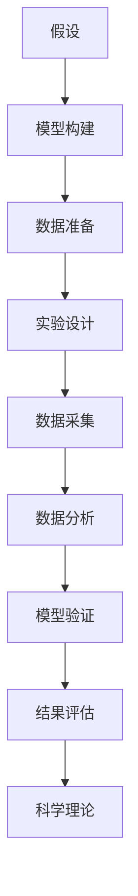
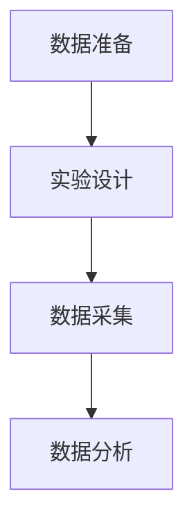
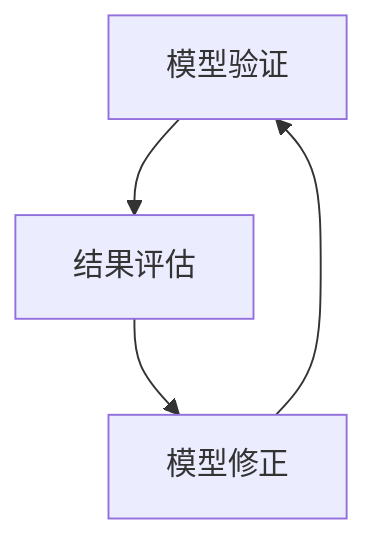
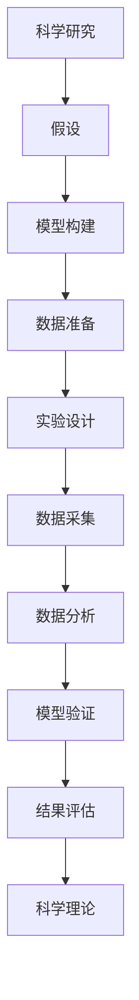

                 

# 科学方法论：从假说到验证

## 1. 背景介绍

### 1.1 问题由来
科学方法论是研究科学知识的发现、评价和验证的逻辑与方法的理论。它是科学研究的基础，也是人工智能和机器学习领域的重要研究工具。从数学模型到实验验证，从理论推导到应用落地，科学方法论贯穿了科学研究的全过程。本文旨在深入探讨科学方法论的基本原理，并结合AI和机器学习的实际应用，给出具体的实践策略。

### 1.2 问题核心关键点
本文将重点讨论科学方法论的核心概念和基本步骤，包括：
- 假设和模型构建
- 数据准备和实验设计
- 模型验证和结果评估
- 科学理论的合理性检验

## 2. 核心概念与联系

### 2.1 核心概念概述

为更好地理解科学方法论，本文将介绍几个关键概念：

- **假设(Hypothesis)**：科学研究的起点。基于已有的科学知识和经验，提出一个或多个关于现象、事件或原因的陈述。
- **模型(Model)**：用来描述和预测现象或事件的数学或逻辑结构。模型可以是理论模型或计算机模型，用来解释和预测现实世界中的现象。
- **数据(Data)**：用于验证或否定假设和模型真实性的观察结果或实验结果。
- **实验设计(Experimental Design)**：制定详细的实验计划，包括实验条件、数据采集方法、数据处理流程等。
- **验证(Verification)**：通过实验和数据分析，检验假设和模型的真实性和有效性。
- **结果评估(Result Evaluation)**：对实验结果进行评估，确定其科学意义和价值。

这些概念之间的联系可以通过以下Mermaid流程图来展示：



这个流程图展示了科学方法论的基本流程：从提出假设开始，到构建模型、准备数据、设计实验、采集数据、分析数据、验证模型，最后进行结果评估，形成科学理论。

### 2.2 概念间的关系

这些核心概念之间存在着紧密的联系，形成了科学研究的完整体系。下面我们通过几个Mermaid流程图来展示这些概念之间的关系。

#### 2.2.1 假设和模型构建的关系


这个流程图展示了假设和模型构建之间的相互影响。模型的构建和验证是基于假设的，如果模型能够很好地验证假设，则该假设的可信度提高；否则，需要对假设和模型进行调整。

#### 2.2.2 数据准备和实验设计的关系



这个流程图展示了数据准备和实验设计之间的关系。数据准备是实验设计的前提，实验设计是基于数据的。数据的质量和类型决定了实验设计的合理性和有效性。

#### 2.2.3 模型验证和结果评估的关系



这个流程图展示了模型验证和结果评估之间的循环过程。模型验证的结果需要经过结果评估，评估的结果可以指导模型的修正和优化，再次进入验证环节。

### 2.3 核心概念的整体架构

最后，我们用一个综合的流程图来展示这些核心概念在科学研究中的整体架构：



这个综合流程图展示了从提出假设开始，到构建模型、准备数据、设计实验、采集数据、分析数据、验证模型，最后进行结果评估，形成科学理论的完整过程。

## 3. 核心算法原理 & 具体操作步骤
### 3.1 算法原理概述

科学方法论的核心原理是假设和模型驱动的验证。具体而言，研究者基于已有知识和经验，提出假设，构建模型，然后使用数据进行实验验证，最后根据验证结果进行结果评估，形成科学理论。这一过程可以通过以下步骤来实现：

1. **提出假设**：基于现有知识和经验，提出一个或多个关于现象或事件的假设。
2. **构建模型**：根据假设构建数学或逻辑模型，用于解释和预测现象。
3. **准备数据**：收集和准备用于验证模型的数据。
4. **设计实验**：制定详细的实验计划，包括实验条件、数据采集方法、数据处理流程等。
5. **进行实验**：按照实验设计进行数据采集和处理，得到实验结果。
6. **验证模型**：使用实验结果检验模型的真实性和有效性。
7. **评估结果**：对实验结果进行评估，确定其科学意义和价值。
8. **形成理论**：基于实验结果，修正和优化假设和模型，形成科学理论。

### 3.2 算法步骤详解

以下是一个具体的科学方法论实践流程，包括假设提出、模型构建、数据准备、实验设计和结果评估等关键步骤：

**Step 1: 提出假设**

1. 根据现有知识和经验，提出一个或多个假设。
2. 假设应具有可检验性和可验证性，即能够通过实验数据进行检验和验证。
3. 假设应具备合理性和可行性，即符合科学理论和现实情况。

**Step 2: 构建模型**

1. 根据假设构建数学或逻辑模型。
2. 模型应具备合理性和适应性，即能够解释现象和预测事件。
3. 模型应具备可扩展性和可解释性，即能够灵活应用和理解。

**Step 3: 准备数据**

1. 收集和准备用于验证模型的数据。
2. 数据应具备代表性、多样性和完整性，即能够代表现象和事件的全貌。
3. 数据应具备高质量和可靠性，即能够保证实验结果的真实性。

**Step 4: 设计实验**

1. 制定详细的实验计划，包括实验条件、数据采集方法、数据处理流程等。
2. 实验设计应具备合理性和科学性，即能够保证实验结果的真实性和可靠性。
3. 实验设计应具备灵活性和适应性，即能够适应不同情况和环境。

**Step 5: 进行实验**

1. 按照实验设计进行数据采集和处理，得到实验结果。
2. 实验过程应具备规范性和标准性，即能够保证实验结果的一致性和可重复性。
3. 实验过程应具备安全性，即能够保障参与者的安全和健康。

**Step 6: 验证模型**

1. 使用实验结果检验模型的真实性和有效性。
2. 模型验证应具备客观性和公正性，即能够客观评价模型的性能和效果。
3. 模型验证应具备透明性和可追溯性，即能够清晰记录和解释验证过程。

**Step 7: 评估结果**

1. 对实验结果进行评估，确定其科学意义和价值。
2. 结果评估应具备客观性和公正性，即能够客观评价实验结果的可靠性和真实性。
3. 结果评估应具备透明性和可追溯性，即能够清晰记录和解释评估过程。

**Step 8: 形成理论**

1. 基于实验结果，修正和优化假设和模型。
2. 科学理论应具备合理性和科学性，即能够符合科学理论和现实情况。
3. 科学理论应具备可应用性和可推广性，即能够应用于不同情况和环境。

### 3.3 算法优缺点

科学方法论具有以下优点：
- 系统性和完整性：科学方法论提供了系统完整的实验流程和理论框架，能够全面验证假设和模型。
- 客观性和公正性：科学方法论强调实验数据和结果的客观性和公正性，能够避免主观性和偏见。
- 可重复性和可验证性：科学方法论注重实验过程的标准化和规范化，能够保证实验结果的可重复性和可验证性。

同时，科学方法论也存在一些缺点：
- 复杂性和高成本：科学方法论流程复杂，涉及大量实验和数据分析，成本较高。
- 时间成本高：科学方法论从提出假设到形成理论，需要较长的实验周期。
- 不确定性：科学方法论的实验结果具有不确定性，需要多次实验和验证才能得到准确结论。

### 3.4 算法应用领域

科学方法论广泛应用于人工智能和机器学习领域，包括但不限于以下几个方面：

- **自然语言处理(NLP)**：通过提出假设和构建模型，使用数据进行实验验证，形成科学理论，指导NLP任务的开发和应用。
- **计算机视觉(CV)**：通过提出假设和构建模型，使用数据进行实验验证，形成科学理论，指导CV任务的开发和应用。
- **机器人学**：通过提出假设和构建模型，使用数据进行实验验证，形成科学理论，指导机器人任务的开发和应用。
- **自动化**：通过提出假设和构建模型，使用数据进行实验验证，形成科学理论，指导自动化任务的开发和应用。
- **智能系统**：通过提出假设和构建模型，使用数据进行实验验证，形成科学理论，指导智能系统的开发和应用。

## 4. 数学模型和公式 & 详细讲解 & 举例说明

### 4.1 数学模型构建

在科学方法论中，数学模型是描述和预测现象的重要工具。常见的数学模型包括线性回归、逻辑回归、支持向量机等。下面以线性回归模型为例，进行详细讲解。

假设我们有一组样本数据 $(x_i, y_i)$，其中 $x_i$ 为自变量，$y_i$ 为因变量。我们的目标是找到一条直线 $y = \theta_0 + \theta_1 x$，使得这条直线能够最好地拟合数据。

### 4.2 公式推导过程

线性回归模型的最小二乘法公式如下：

$$
\min_{\theta_0, \theta_1} \sum_{i=1}^n (y_i - (\theta_0 + \theta_1 x_i))^2
$$

其梯度下降公式为：

$$
\frac{\partial}{\partial \theta_0} \sum_{i=1}^n (y_i - (\theta_0 + \theta_1 x_i))^2 = -2\sum_{i=1}^n (y_i - (\theta_0 + \theta_1 x_i))
$$

$$
\frac{\partial}{\partial \theta_1} \sum_{i=1}^n (y_i - (\theta_0 + \theta_1 x_i))^2 = -2\sum_{i=1}^n x_i(y_i - (\theta_0 + \theta_1 x_i))
$$

通过梯度下降算法，不断更新参数 $\theta_0$ 和 $\theta_1$，最小化损失函数，即可得到拟合直线的参数。

### 4.3 案例分析与讲解

假设我们有一组样本数据：

| $x$ | $y$ |
|-----|-----|
| 1   | 2   |
| 2   | 4   |
| 3   | 6   |
| 4   | 8   |
| 5   | 10  |

我们可以使用线性回归模型进行拟合，使用最小二乘法求解参数。计算过程如下：

1. 计算样本均值 $\bar{x} = \frac{1+2+3+4+5}{5} = 3$，$\bar{y} = \frac{2+4+6+8+10}{5} = 6$。
2. 计算样本方差 $S_x^2 = \frac{(1-3)^2 + (2-3)^2 + (3-3)^2 + (4-3)^2 + (5-3)^2}{4} = 2.5$，$S_y^2 = \frac{(2-6)^2 + (4-6)^2 + (6-6)^2 + (8-6)^2 + (10-6)^2}{4} = 8.25$。
3. 计算协方差 $S_{xy} = \frac{(1-3)(2-6) + (2-3)(4-6) + (3-3)(6-6) + (4-3)(8-6) + (5-3)(10-6)}{4} = 10.5$。
4. 计算斜率 $\theta_1 = \frac{S_{xy}}{S_x^2} = \frac{10.5}{2.5} = 4.2$。
5. 计算截距 $\theta_0 = \bar{y} - \theta_1 \bar{x} = 6 - 4.2 \times 3 = -0.6$。

因此，线性回归模型的参数为 $\theta_0 = -0.6$，$\theta_1 = 4.2$，拟合直线为 $y = 4.2x - 0.6$。

## 5. 项目实践：代码实例和详细解释说明

### 5.1 开发环境搭建

在进行科学方法论实践前，我们需要准备好开发环境。以下是使用Python进行科学计算的环境配置流程：

1. 安装Anaconda：从官网下载并安装Anaconda，用于创建独立的Python环境。

2. 创建并激活虚拟环境：
```bash
conda create -n scipy-env python=3.8 
conda activate scipy-env
```

3. 安装NumPy和SciPy：
```bash
conda install numpy scipy
```

4. 安装MATplotlib和Scikit-learn：
```bash
conda install matplotlib scikit-learn
```

5. 安装Jupyter Notebook：
```bash
conda install jupyter notebook
```

完成上述步骤后，即可在`scipy-env`环境中开始科学方法论的实践。

### 5.2 源代码详细实现

以下是一个使用Python进行线性回归模型实验的代码实现：

```python
import numpy as np
from sklearn.linear_model import LinearRegression
import matplotlib.pyplot as plt

# 构建样本数据
x = np.array([1, 2, 3, 4, 5])
y = np.array([2, 4, 6, 8, 10])

# 创建线性回归模型
model = LinearRegression()

# 训练模型
model.fit(x.reshape(-1, 1), y)

# 预测数据
y_pred = model.predict(x.reshape(-1, 1))

# 绘制拟合直线
plt.scatter(x, y)
plt.plot(x, y_pred, color='red')
plt.xlabel('x')
plt.ylabel('y')
plt.show()
```

### 5.3 代码解读与分析

让我们再详细解读一下关键代码的实现细节：

**构建样本数据**：
- 使用NumPy库构建样本数据。

**创建线性回归模型**：
- 使用Scikit-learn库创建线性回归模型。

**训练模型**：
- 使用训练数据拟合模型。

**预测数据**：
- 使用训练好的模型对新数据进行预测。

**绘制拟合直线**：
- 使用Matplotlib库绘制拟合直线和散点图。

**代码解释**：
- 在代码中，我们首先构建了一组样本数据 $x$ 和 $y$，然后使用Scikit-learn库创建了一个线性回归模型。接着，我们使用训练数据拟合模型，并对新数据进行预测。最后，我们使用Matplotlib库绘制了拟合直线和散点图，展示了模型的拟合效果。

## 6. 实际应用场景

### 6.1 智能推荐系统

智能推荐系统是科学方法论在实际应用中的典型案例。推荐系统的核心任务是根据用户的历史行为和偏好，预测用户可能感兴趣的商品或内容。

在推荐系统中，我们使用科学方法论的基本步骤，通过提出假设、构建模型、准备数据、设计实验、进行实验、验证模型和评估结果，形成科学理论。

**Step 1: 提出假设**

假设用户的行为数据与商品或内容的评分数据之间存在一定的相关性。

**Step 2: 构建模型**

构建一个机器学习模型，用于预测用户对商品或内容的评分。

**Step 3: 准备数据**

收集和准备用户的行为数据和商品或内容的评分数据。

**Step 4: 设计实验**

设计实验，使用部分数据集进行模型训练，使用剩余数据集进行模型测试。

**Step 5: 进行实验**

进行实验，使用训练好的模型对测试数据进行预测，得到预测评分。

**Step 6: 验证模型**

使用实验结果检验模型的真实性和有效性。

**Step 7: 评估结果**

对实验结果进行评估，确定其科学意义和价值。

**Step 8: 形成理论**

基于实验结果，修正和优化假设和模型，形成科学理论，指导推荐系统的开发和应用。

### 6.2 金融预测系统

金融预测系统是科学方法论在金融领域的应用。金融预测系统的核心任务是根据历史数据，预测未来的市场走势。

在金融预测系统中，我们使用科学方法论的基本步骤，通过提出假设、构建模型、准备数据、设计实验、进行实验、验证模型和评估结果，形成科学理论。

**Step 1: 提出假设**

假设历史数据与未来的市场走势之间存在一定的相关性。

**Step 2: 构建模型**

构建一个机器学习模型，用于预测未来的市场走势。

**Step 3: 准备数据**

收集和准备历史的市场数据。

**Step 4: 设计实验**

设计实验，使用部分历史数据进行模型训练，使用剩余数据进行模型测试。

**Step 5: 进行实验**

进行实验，使用训练好的模型对测试数据进行预测，得到预测市场走势。

**Step 6: 验证模型**

使用实验结果检验模型的真实性和有效性。

**Step 7: 评估结果**

对实验结果进行评估，确定其科学意义和价值。

**Step 8: 形成理论**

基于实验结果，修正和优化假设和模型，形成科学理论，指导金融预测系统的开发和应用。

### 6.3 医疗诊断系统

医疗诊断系统是科学方法论在医疗领域的应用。医疗诊断系统的核心任务是根据病人的症状和病史，预测病人的病情和诊断结果。

在医疗诊断系统中，我们使用科学方法论的基本步骤，通过提出假设、构建模型、准备数据、设计实验、进行实验、验证模型和评估结果，形成科学理论。

**Step 1: 提出假设**

假设病人的症状和病史与病情和诊断结果之间存在一定的相关性。

**Step 2: 构建模型**

构建一个机器学习模型，用于预测病人的病情和诊断结果。

**Step 3: 准备数据**

收集和准备病人的症状和病史数据。

**Step 4: 设计实验**

设计实验，使用部分数据集进行模型训练，使用剩余数据集进行模型测试。

**Step 5: 进行实验**

进行实验，使用训练好的模型对测试数据进行预测，得到预测病情和诊断结果。

**Step 6: 验证模型**

使用实验结果检验模型的真实性和有效性。

**Step 7: 评估结果**

对实验结果进行评估，确定其科学意义和价值。

**Step 8: 形成理论**

基于实验结果，修正和优化假设和模型，形成科学理论，指导医疗诊断系统的开发和应用。

## 7. 工具和资源推荐

### 7.1 学习资源推荐

为了帮助开发者系统掌握科学方法论的理论基础和实践技巧，这里推荐一些优质的学习资源：

1. 《科学方法论导论》（第二版）：该书详细介绍了科学方法论的基本原理和应用实例，适合初学者入门。

2. 《统计学习方法》（李航著）：该书介绍了机器学习的核心方法，包括线性回归、逻辑回归等，适合深入理解科学方法论。

3. Coursera的《科学方法论》课程：该课程由斯坦福大学开设，通过视频、阅读和讨论等方式，系统介绍科学方法论的基本原理和方法。

4. Udacity的《机器学习工程师》课程：该课程通过实战项目，教授机器学习算法和科学方法论的应用，适合工程实践。

5. Kaggle的《数据科学竞赛》：该平台提供了大量的数据集和竞赛任务，通过实际应用锻炼科学方法论的实战能力。

通过对这些资源的学习实践，相信你一定能够快速掌握科学方法论的理论基础和实践技巧，为科学研究和技术应用提供坚实基础。

### 7.2 开发工具推荐

高效的开发离不开优秀的工具支持。以下是几款用于科学方法论和机器学习开发的常用工具：

1. Python：Python是科学计算和机器学习的主流语言，支持丰富的科学计算和机器学习库。

2. NumPy和SciPy：NumPy是Python科学计算的基础库，SciPy提供了大量的科学计算和数值计算功能。

3. Matplotlib和Seaborn：Matplotlib和Seaborn是Python数据可视化的主要库，支持各种图表的绘制和展示。

4. Jupyter Notebook：Jupyter Notebook是Python编程和数据科学协作的强大工具，支持实时代码执行和可视化。

5. Scikit-learn：Scikit-learn是Python机器学习的主要库，提供了丰富的机器学习算法和工具。

6. TensorFlow和PyTorch：TensorFlow和PyTorch是Python深度学习的主要库，支持各种深度学习模型和算法的实现。

合理利用这些工具，可以显著提升科学方法论和机器学习的开发效率，加快创新迭代的步伐。

### 7.3 相关论文推荐

科学方法论和机器学习的快速发展离不开学界的持续研究。以下是几篇奠基性的相关论文，推荐阅读：

1. <i>"Pattern Recognition and Machine Learning"</i>（Christopher M. Bishop著）：该书详细介绍了机器学习的基本原理和应用实例，是机器学习领域的经典之作。

2. <i>"Deep Learning"</i>（Ian Goodfellow、Yoshua Bengio、Aaron Courville著）：该书介绍了深度学习的基本原理和应用实例，是深度学习领域的经典之作。

3. <i>"Introduction to Machine Learning with Python"</i>（Jake VanderPlas著）：该书通过Python代码实现机器学习算法和科学方法论的应用，适合实战学习和开发。

4. <i>"Scientific Computing with Python"</i>（Travis Oliphant、Alicia Yi著）：该书详细介绍了Python在科学计算中的应用，适合科学计算和机器学习的初学者。

5. <i>"The Elements of Statistical Learning"</i>（Tibshirani、Hastie、Friedman著）：该书详细介绍了统计学习的基本原理和方法，是统计学习的经典之作。

这些论文代表了大语言模型微调技术的发展脉络。通过学习这些前沿成果，可以帮助研究者把握学科前进方向，激发更多的创新灵感。

## 8. 总结：未来发展趋势与挑战

### 8.1 总结

本文对科学方法论的基本原理和应用进行了全面系统的介绍。首先阐述了科学方法论的核心步骤和基本概念，然后结合实际应用案例，详细讲解了科学方法论在人工智能和机器学习中的具体应用流程。

通过本文的系统梳理，可以看到，科学方法论在科学研究和技术应用中具有重要的地位和作用。无论是理论推导还是工程实践，都需要遵循科学方法论的基本原则，保证研究结果的可靠性和科学性。

### 8.2 未来发展趋势

展望未来，科学方法论将在以下几个方向上继续发展：

1. **多模态融合**：科学方法论将更加注重多模态数据的融合，包括文本、图像、音频等多模态数据的协同建模，提升模型的全面性和鲁棒性。

2. **自适应学习**：科学方法论将更加注重自适应学习，根据环境变化动态调整模型参数和结构，提升模型的灵活性和适应性。

3. **因果推理**：科学方法论将更加注重因果推理，通过因果推断方法，识别模型的因果关系，增强模型的解释性和可理解性。

4. **跨领域应用**：科学方法论将更加注重跨领域应用，结合不同领域的数据和知识，形成更加全面和系统化的解决方案。

5. **伦理和安全性**：科学方法论将更加注重伦理和安全性，通过模型可解释性和透明性，保障模型的公平性、可控性和安全性。

以上趋势凸显了科学方法论在科学研究和技术应用中的重要性和前景。这些方向的探索发展，必将进一步提升科学方法论的实用性和普适性，为科学研究和技术应用提供更加坚实的理论基础。

### 8.3 面临的挑战

尽管科学方法论在科学研究和技术应用中具有重要的地位和作用，但在迈向更加智能化、普适化应用的过程中，它仍面临诸多挑战：

1. **数据获取和处理**：科学方法论需要大量的数据进行训练和验证，但数据获取和处理的成本较高，特别是在非结构化数据和真实数据方面。

2. **模型复杂性和计算资源**：科学方法论需要构建复杂的模型，进行大量的计算和实验，对计算资源和算力要求较高。

3. **结果解释和可信性**：科学方法论需要解释模型的内部工作机制和推理逻辑，但由于模型复杂性，结果解释和可信性仍存在一定困难。

4. **模型鲁棒性和泛化性**：科学方法论需要保证模型的鲁棒性和泛化性，避免模型过拟合和泛化能力不足的问题。

5. **伦理和安全问题**：科学方法论需要考虑模型的伦理和安全问题，避免模型偏见、歧视和恶意用途，保障模型的公平性和安全性。

这些挑战凸显了科学方法论在科学研究和技术应用中的复杂性和复杂性。只有从数据、算法、工程、伦理等多个维度协同发力，才能真正实现科学方法论的实用

