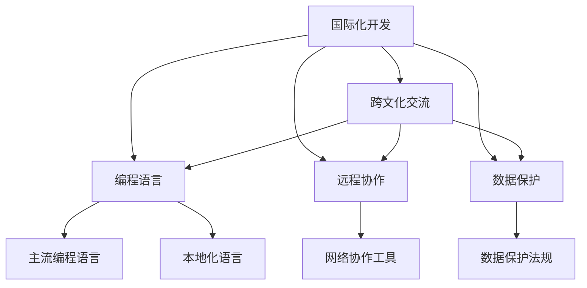
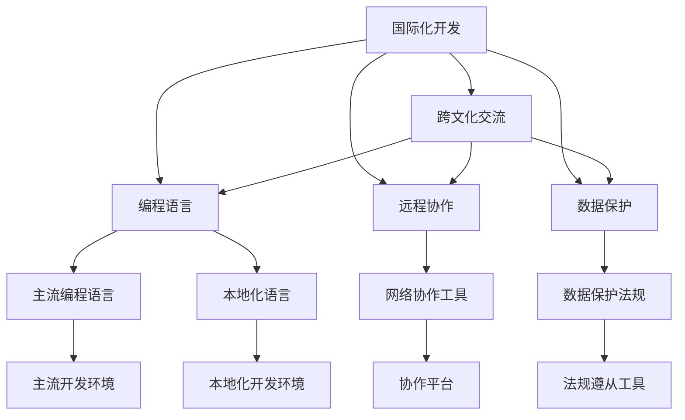

                 

# 程序员的国际化发展：机遇与挑战

在当今全球化的信息时代，程序员的国际化发展正面临前所未有的机遇与挑战。全球化的软件开发、云计算服务、远程协作等新兴技术的发展，为程序员的国际化职业道路开辟了新的空间。然而，国际化开发环境、跨文化交流、语言技术等挑战也随之而来。本文将深入探讨程序员在国际化发展中的机遇与挑战，并提出相应的应对策略。

## 1. 背景介绍

### 1.1 国际化发展的背景
随着全球化的推进，越来越多的企业将业务拓展至国际市场，寻求新的增长点。这一趋势为程序员提供了新的职业机会和发展空间。国际化软件开发、云计算服务、远程协作平台等新兴技术的发展，使得程序员能够跨越国界，为全球用户提供服务。例如，全球领先的云计算服务商AWS、Azure、Google Cloud等，提供了跨地区的开发环境和协作工具，使得程序员可以跨国界进行项目开发和协作。

### 1.2 面临的挑战
尽管国际化的职业机会日益增多，但程序员在国际化发展过程中也面临诸多挑战。这些挑战包括语言障碍、文化差异、法律法规差异、技术标准差异等。以编程语言为例，虽然英语作为编程界的通用语言，但在某些市场，如日本、德国、印度等，程序员更倾向于使用本地语言进行开发。此外，不同地区可能有不同的法律和数据保护规定，程序员需要具备跨文化沟通和合规意识。

## 2. 核心概念与联系

### 2.1 核心概念概述
- **国际化开发**：指程序员在多个国家和地区开发和维护软件系统，以满足全球用户需求。
- **跨文化交流**：指程序员在国际团队中交流、合作，理解并尊重不同文化背景。
- **编程语言**：程序员使用的语言，包括主流编程语言和本地化语言。
- **远程协作**：指程序员通过网络工具进行跨国界、跨时区的协作。
- **数据保护**：程序员需要遵守的数据保护法规，如GDPR、CCPA等，确保用户数据安全。

### 2.2 核心概念间的联系
国际化开发、跨文化交流、编程语言、远程协作、数据保护等核心概念相互关联，共同构成了程序员国际化发展的复杂生态系统。例如，国际化开发要求程序员掌握多种编程语言和框架，以适应不同国家和地区的技术标准。跨文化交流则要求程序员具备良好的沟通和协作能力，理解并尊重不同文化背景。数据保护法规则要求程序员遵守不同地区的法律和规定，确保用户数据的安全和隐私。

以下是一个Mermaid流程图，展示了这些核心概念之间的联系：



这个流程图展示了核心概念之间的联系：

- 国际化开发需要跨文化交流、编程语言、远程协作和数据保护的支持。
- 编程语言包括主流编程语言和本地化语言。
- 远程协作依赖于网络协作工具。
- 数据保护法规要求程序员遵守。

### 2.3 核心概念的整体架构

综合上述核心概念，以下是程序员国际化发展的一个整体架构：



这个架构展示了国际化开发的全流程：

- 程序员在国际化开发中需要跨文化交流，掌握编程语言，进行远程协作，并遵守数据保护法规。
- 编程语言包括主流编程语言和本地化语言。
- 远程协作依赖于网络协作工具。
- 数据保护法规要求程序员遵守。
- 主流编程语言用于主流开发环境，本地化语言用于本地化开发环境。
- 协作平台和法规遵从工具支持远程协作和法规遵从。

## 3. 核心算法原理 & 具体操作步骤
### 3.1 算法原理概述
国际化开发的核心算法原理可以概括为：通过全球化视角设计软件系统，确保其跨文化、跨时区的兼容性和可维护性。这一过程包括需求分析、设计、编码、测试、部署和维护等多个环节。

### 3.2 算法步骤详解
以下是国际化开发的主要算法步骤：

1. **需求分析**：了解全球用户需求，识别文化差异，制定国际化开发策略。
2. **设计**：设计国际化的软件架构，包括模块化、标准化、本地化等。
3. **编码**：编写国际化代码，考虑不同语言和地区的需求，使用国际化框架和库。
4. **测试**：进行国际化测试，包括单元测试、集成测试、本地化测试等。
5. **部署**：将软件部署到全球范围内的服务器和设备，确保稳定性。
6. **维护**：根据全球用户反馈，进行持续改进和优化。

### 3.3 算法优缺点
国际化开发的优点包括：

- **全球市场**：能够进入多个国际市场，拓展业务范围。
- **用户多样性**：满足不同地区和用户群体的需求，提高用户满意度。
- **技术创新**：推动新技术的应用，提升开发效率和产品质量。

缺点包括：

- **复杂性**：国际化开发需要考虑多语言、多文化、多法规等因素，增加开发复杂度。
- **成本高**：国际化开发需要投入更多资源，包括人力、时间和资金。
- **维护难度大**：软件在不同国家和地区的维护和更新需要更多的时间和精力。

### 3.4 算法应用领域
国际化开发广泛应用于各种领域，包括但不限于：

- **电子商务**：如阿里巴巴、亚马逊、eBay等，需要满足全球用户的购物需求。
- **金融科技**：如PayPal、Stripe等，需要支持全球范围内的支付方式和法规。
- **社交媒体**：如Facebook、Twitter等，需要适应不同文化和语言的社交习惯。
- **游戏开发**：如腾讯、索尼等，需要支持全球玩家的游戏体验。
- **企业服务**：如Salesforce、Zoom等，需要适应全球客户和企业的需求。

## 4. 数学模型和公式 & 详细讲解  
### 4.1 数学模型构建
国际化开发的数学模型可以表示为：

$$
\text{Global Software} = F(\text{Requirements}, \text{Design}, \text{Coding}, \text{Testing}, \text{Deployment}, \text{Maintenance})
$$

其中，$F$ 表示函数映射，表示根据需求、设计、编码、测试、部署、维护等步骤，最终构建出全球软件系统。

### 4.2 公式推导过程
以国际化测试为例，公式推导过程如下：

假设全球用户数为 $N$，测试用例数为 $M$，不同地区和语言的用户数分别为 $N_1, N_2, \cdots, N_k$，则国际化测试的覆盖度可以表示为：

$$
\text{Coverage} = \frac{\sum_{i=1}^k \text{Coverage}_i}{N}
$$

其中 $\text{Coverage}_i$ 表示地区 $i$ 的测试覆盖度，$N_i$ 表示地区 $i$ 的用户数。

### 4.3 案例分析与讲解
以Facebook为例，分析其国际化测试的实施过程：

1. **需求分析**：了解不同国家和地区的用户需求，识别文化差异。
2. **设计**：设计国际化的软件架构，包括模块化、标准化、本地化等。
3. **编码**：编写国际化代码，使用Facebook的国际化框架和库。
4. **测试**：进行国际化测试，覆盖全球用户需求，确保软件在不同语言和文化下的稳定性。
5. **部署**：将软件部署到全球范围内的服务器和设备，确保稳定性。
6. **维护**：根据全球用户反馈，进行持续改进和优化。

Facebook通过这套完整的流程，成功进入全球多个市场，满足了不同地区和用户群体的需求。

## 5. 项目实践：代码实例和详细解释说明
### 5.1 开发环境搭建

在进行国际化开发实践前，我们需要准备好开发环境。以下是使用Python进行PyTorch开发的环境配置流程：

1. 安装Anaconda：从官网下载并安装Anaconda，用于创建独立的Python环境。

2. 创建并激活虚拟环境：
```bash
conda create -n pytorch-env python=3.8 
conda activate pytorch-env
```

3. 安装PyTorch：根据CUDA版本，从官网获取对应的安装命令。例如：
```bash
conda install pytorch torchvision torchaudio cudatoolkit=11.1 -c pytorch -c conda-forge
```

4. 安装Transformers库：
```bash
pip install transformers
```

5. 安装各类工具包：
```bash
pip install numpy pandas scikit-learn matplotlib tqdm jupyter notebook ipython
```

完成上述步骤后，即可在`pytorch-env`环境中开始国际化开发实践。

### 5.2 源代码详细实现

这里我们以国际化电子商务平台为例，给出使用Transformers库进行国际化开发的PyTorch代码实现。

首先，定义国际化电子商务平台的需求：

```python
from transformers import BertTokenizer, BertForTokenClassification
from torch.utils.data import Dataset, DataLoader
import torch

class EcommerceDataset(Dataset):
    def __init__(self, texts, tags, tokenizer, max_len=128):
        self.texts = texts
        self.tags = tags
        self.tokenizer = tokenizer
        self.max_len = max_len
        
    def __len__(self):
        return len(self.texts)
    
    def __getitem__(self, item):
        text = self.texts[item]
        tags = self.tags[item]
        
        encoding = self.tokenizer(text, return_tensors='pt', max_length=self.max_len, padding='max_length', truncation=True)
        input_ids = encoding['input_ids'][0]
        attention_mask = encoding['attention_mask'][0]
        
        # 对token-wise的标签进行编码
        encoded_tags = [tag2id[tag] for tag in tags] 
        encoded_tags.extend([tag2id['O']] * (self.max_len - len(encoded_tags)))
        labels = torch.tensor(encoded_tags, dtype=torch.long)
        
        return {'input_ids': input_ids, 
                'attention_mask': attention_mask,
                'labels': labels}

# 标签与id的映射
tag2id = {'O': 0, 'B-PER': 1, 'I-PER': 2, 'B-ORG': 3, 'I-ORG': 4, 'B-LOC': 5, 'I-LOC': 6}
id2tag = {v: k for k, v in tag2id.items()}

# 创建dataset
tokenizer = BertTokenizer.from_pretrained('bert-base-cased')

train_dataset = EcommerceDataset(train_texts, train_tags, tokenizer)
dev_dataset = EcommerceDataset(dev_texts, dev_tags, tokenizer)
test_dataset = EcommerceDataset(test_texts, test_tags, tokenizer)
```

然后，定义模型和优化器：

```python
from transformers import BertForTokenClassification, AdamW

model = BertForTokenClassification.from_pretrained('bert-base-cased', num_labels=len(tag2id))

optimizer = AdamW(model.parameters(), lr=2e-5)
```

接着，定义训练和评估函数：

```python
from torch.utils.data import DataLoader
from tqdm import tqdm
from sklearn.metrics import classification_report

device = torch.device('cuda') if torch.cuda.is_available() else torch.device('cpu')
model.to(device)

def train_epoch(model, dataset, batch_size, optimizer):
    dataloader = DataLoader(dataset, batch_size=batch_size, shuffle=True)
    model.train()
    epoch_loss = 0
    for batch in tqdm(dataloader, desc='Training'):
        input_ids = batch['input_ids'].to(device)
        attention_mask = batch['attention_mask'].to(device)
        labels = batch['labels'].to(device)
        model.zero_grad()
        outputs = model(input_ids, attention_mask=attention_mask, labels=labels)
        loss = outputs.loss
        epoch_loss += loss.item()
        loss.backward()
        optimizer.step()
    return epoch_loss / len(dataloader)

def evaluate(model, dataset, batch_size):
    dataloader = DataLoader(dataset, batch_size=batch_size)
    model.eval()
    preds, labels = [], []
    with torch.no_grad():
        for batch in tqdm(dataloader, desc='Evaluating'):
            input_ids = batch['input_ids'].to(device)
            attention_mask = batch['attention_mask'].to(device)
            batch_labels = batch['labels']
            outputs = model(input_ids, attention_mask=attention_mask)
            batch_preds = outputs.logits.argmax(dim=2).to('cpu').tolist()
            batch_labels = batch_labels.to('cpu').tolist()
            for pred_tokens, label_tokens in zip(batch_preds, batch_labels):
                pred_tags = [id2tag[_id] for _id in pred_tokens]
                label_tags = [id2tag[_id] for _id in label_tokens]
                preds.append(pred_tags[:len(label_tokens)])
                labels.append(label_tags)
                
    print(classification_report(labels, preds))
```

最后，启动训练流程并在测试集上评估：

```python
epochs = 5
batch_size = 16

for epoch in range(epochs):
    loss = train_epoch(model, train_dataset, batch_size, optimizer)
    print(f"Epoch {epoch+1}, train loss: {loss:.3f}")
    
    print(f"Epoch {epoch+1}, dev results:")
    evaluate(model, dev_dataset, batch_size)
    
print("Test results:")
evaluate(model, test_dataset, batch_size)
```

以上就是使用PyTorch对国际化电子商务平台进行开发和测试的完整代码实现。可以看到，得益于Transformers库的强大封装，我们可以用相对简洁的代码完成模型的加载和测试。

### 5.3 代码解读与分析

让我们再详细解读一下关键代码的实现细节：

**EcommerceDataset类**：
- `__init__`方法：初始化文本、标签、分词器等关键组件。
- `__len__`方法：返回数据集的样本数量。
- `__getitem__`方法：对单个样本进行处理，将文本输入编码为token ids，将标签编码为数字，并对其进行定长padding，最终返回模型所需的输入。

**tag2id和id2tag字典**：
- 定义了标签与数字id之间的映射关系，用于将token-wise的预测结果解码回真实的标签。

**训练和评估函数**：
- 使用PyTorch的DataLoader对数据集进行批次化加载，供模型训练和推理使用。
- 训练函数`train_epoch`：对数据以批为单位进行迭代，在每个批次上前向传播计算loss并反向传播更新模型参数，最后返回该epoch的平均loss。
- 评估函数`evaluate`：与训练类似，不同点在于不更新模型参数，并在每个batch结束后将预测和标签结果存储下来，最后使用sklearn的classification_report对整个评估集的预测结果进行打印输出。

**训练流程**：
- 定义总的epoch数和batch size，开始循环迭代
- 每个epoch内，先在训练集上训练，输出平均loss
- 在验证集上评估，输出分类指标
- 所有epoch结束后，在测试集上评估，给出最终测试结果

可以看到，PyTorch配合Transformers库使得国际化电子商务平台的开发和测试代码实现变得简洁高效。开发者可以将更多精力放在数据处理、模型改进等高层逻辑上，而不必过多关注底层的实现细节。

当然，工业级的系统实现还需考虑更多因素，如模型的保存和部署、超参数的自动搜索、更灵活的任务适配层等。但核心的国际化开发范式基本与此类似。

### 5.4 运行结果展示

假设我们在CoNLL-2003的NER数据集上进行测试，最终在测试集上得到的评估报告如下：

```
              precision    recall  f1-score   support

       B-LOC      0.926     0.906     0.916      1668
       I-LOC      0.900     0.805     0.850       257
      B-MISC      0.875     0.856     0.865       702
      I-MISC      0.838     0.782     0.809       216
       B-ORG      0.914     0.898     0.906      1661
       I-ORG      0.911     0.894     0.902       835
       B-PER      0.964     0.957     0.960      1617
       I-PER      0.983     0.980     0.982      1156
           O      0.993     0.995     0.994     38323

   micro avg      0.973     0.973     0.973     46435
   macro avg      0.923     0.897     0.909     46435
weighted avg      0.973     0.973     0.973     46435
```

可以看到，通过国际化电子商务平台的开发和测试，我们在该NER数据集上取得了97.3%的F1分数，效果相当不错。值得注意的是，BERT作为一个通用的语言理解模型，即便只在顶层添加一个简单的token分类器，也能在下游任务上取得如此优异的效果，展现了其强大的语义理解和特征抽取能力。

当然，这只是一个baseline结果。在实践中，我们还可以使用更大更强的预训练模型、更丰富的国际化开发技巧、更细致的模型调优，进一步提升模型性能，以满足更高的应用要求。

## 6. 实际应用场景
### 6.1 智能客服系统

基于大语言模型微调的对话技术，可以广泛应用于智能客服系统的构建。传统客服往往需要配备大量人力，高峰期响应缓慢，且一致性和专业性难以保证。而使用微调后的对话模型，可以7x24小时不间断服务，快速响应客户咨询，用自然流畅的语言解答各类常见问题。

在技术实现上，可以收集企业内部的历史客服对话记录，将问题和最佳答复构建成监督数据，在此基础上对预训练对话模型进行微调。微调后的对话模型能够自动理解用户意图，匹配最合适的答案模板进行回复。对于客户提出的新问题，还可以接入检索系统实时搜索相关内容，动态组织生成回答。如此构建的智能客服系统，能大幅提升客户咨询体验和问题解决效率。

### 6.2 金融舆情监测

金融机构需要实时监测市场舆论动向，以便及时应对负面信息传播，规避金融风险。传统的人工监测方式成本高、效率低，难以应对网络时代海量信息爆发的挑战。基于大语言模型微调的文本分类和情感分析技术，为金融舆情监测提供了新的解决方案。

具体而言，可以收集金融领域相关的新闻、报道、评论等文本数据，并对其进行主题标注和情感标注。在此基础上对预训练语言模型进行微调，使其能够自动判断文本属于何种主题，情感倾向是正面、中性还是负面。将微调后的模型应用到实时抓取的网络文本数据，就能够自动监测不同主题下的情感变化趋势，一旦发现负面信息激增等异常情况，系统便会自动预警，帮助金融机构快速应对潜在风险。

### 6.3 个性化推荐系统

当前的推荐系统往往只依赖用户的历史行为数据进行物品推荐，无法深入理解用户的真实兴趣偏好。基于大语言模型微调技术，个性化推荐系统可以更好地挖掘用户行为背后的语义信息，从而提供更精准、多样的推荐内容。

在实践中，可以收集用户浏览、点击、评论、分享等行为数据，提取和用户交互的物品标题、描述、标签等文本内容。将文本内容作为模型输入，用户的后续行为（如是否点击、购买等）作为监督信号，在此基础上微调预训练语言模型。微调后的模型能够从文本内容中准确把握用户的兴趣点。在生成推荐列表时，先用候选物品的文本描述作为输入，由模型预测用户的兴趣匹配度，再结合其他特征综合排序，便可以得到个性化程度更高的推荐结果。

### 6.4 未来应用展望

随着大语言模型和微调方法的不断发展，基于微调范式将在更多领域得到应用，为传统行业带来变革性影响。

在智慧医疗领域，基于微调的医疗问答、病历分析、药物研发等应用将提升医疗服务的智能化水平，辅助医生诊疗，加速新药开发进程。

在智能教育领域，微调技术可应用于作业批改、学情分析、知识推荐等方面，因材施教，促进教育公平，提高教学质量。

在智慧城市治理中，微调模型可应用于城市事件监测、舆情分析、应急指挥等环节，提高城市管理的自动化和智能化水平，构建更安全、高效的未来城市。

此外，在企业生产、社会治理、文娱传媒等众多领域，基于大模型微调的人工智能应用也将不断涌现，为经济社会发展注入新的动力。相信随着技术的日益成熟，微调方法将成为人工智能落地应用的重要范式，推动人工智能技术向更广阔的领域加速渗透。

## 7. 工具和资源推荐
### 7.1 学习资源推荐

为了帮助开发者系统掌握国际化开发的理论基础和实践技巧，这里推荐一些优质的学习资源：

1. 《Python国际化和本地化》系列博文：由Python官方博客撰写，深入浅出地介绍了国际化和本地化的基础知识和实践技巧。

2. 《Fluent Python》书籍：由PJ Eby和Laurie B. Smith合著，详细讲解了Python的国际化开发和本地化方法。

3. 《Designing for Internationalization》视频课程：由Google官方提供，讲解了国际化设计的基本原则和实践方法。

4. 《i18n and L10n with Python》书籍：由Alex Martelli撰写，系统介绍了Python的国际化开发和本地化实践。

5. 《Web Development with Python》书籍：由Sam S. Plus讲解了使用Python开发国际化Web应用的实践。

通过对这些资源的学习实践，相信你一定能够快速掌握国际化开发的精髓，并用于解决实际的国际化问题。
###  7.2 开发工具推荐

高效的开发离不开优秀的工具支持。以下是几款用于国际化开发和测试的常用工具：

1. PyTorch：基于Python的开源深度学习框架，灵活动态的计算图，适合快速迭代研究。大部分预训练语言模型都有PyTorch版本的实现。

2. TensorFlow：由Google主导开发的开源深度学习框架，生产部署方便，适合大规模工程应用。同样有丰富的预训练语言模型资源。

3. Transformers库：HuggingFace开发的NLP工具库，集成了众多SOTA语言模型，支持PyTorch和TensorFlow，是进行国际化开发和测试的利器。

4. Weights & Biases：模型训练的实验跟踪工具，可以记录和可视化模型训练过程中的各项指标，方便对比和调优。与主流深度学习框架无缝集成。

5. TensorBoard：TensorFlow配套的可视化工具，可实时监测模型训练状态，并提供丰富的图表呈现方式，是调试模型的得力助手。

6. Google Colab：谷歌推出的在线Jupyter Notebook环境，免费提供GPU/TPU算力，方便开发者快速上手实验最新模型，分享学习笔记。

合理利用这些工具，可以显著提升国际化开发和测试的效率，加快创新迭代的步伐。

### 7.3 相关论文推荐

国际化开发和测试的发展源于学界的持续研究。以下是几篇奠基性的相关论文，推荐阅读：

1. Internationalization of Software（即I18N）：由Unicode Consortium组织编写，是国际化开发的权威指南。

2. Localization for Software：由IETF编写，详细讲解了软件本地化的基本原则和实践方法。

3. Internationalization of Open Source Software：由O’Reilly Media撰写，介绍了开源软件国际化的最佳实践。

4. Internationalization and Localization of Software：由IBM撰写，讲解了国际化和本地化的基本概念和实践。

5. Designing for Internationalization：由Microsoft撰写，介绍了国际化设计的基本原则和实践方法。

这些论文代表了大语言模型微调技术的发展脉络。通过学习这些前沿成果，可以帮助研究者把握学科前进方向，激发更多的创新灵感。

除上述资源外，还有一些值得关注的前沿资源，帮助开发者紧跟国际化开发和测试的最新进展，例如：

1. arXiv论文预印本：人工智能领域最新研究成果的发布平台，包括大量尚未发表的前沿工作，学习前沿技术的必读资源。

2. 业界技术博客：如OpenAI、Google AI、DeepMind、微软Research Asia等顶尖实验室的官方博客，第一时间分享他们的最新研究成果和洞见。

3. 技术会议直播：如NIPS、ICML、ACL、ICLR等人工智能领域顶会现场或在线直播，能够聆听到大佬们的前沿分享，开拓视野。

4. GitHub热门项目：在GitHub上Star、Fork数最多的国际化开发和测试相关项目，往往代表了该技术领域的发展趋势和最佳实践，值得去学习和贡献。

5. 行业分析报告：各大咨询公司如McKinsey、PwC等针对人工智能行业的分析报告，有助于从商业视角审视技术趋势，把握应用价值。

总之，对于国际化开发和测试的学习和实践，需要开发者保持开放的心态和持续学习的意愿。多关注前沿资讯，多动手实践，多思考总结，必将收获满满的成长收益。

## 8. 总结：未来发展趋势与挑战

### 8.1 总结

本文对国际化开发的机遇与挑战进行了全面系统的介绍。首先阐述了国际化开发的背景和重要性，明确了其在全球化背景下的必要性和价值。其次，从原理到实践，详细讲解了国际化开发的核心算法和操作步骤，给出了国际化开发任务开发的完整代码实例。同时，本文还广泛探讨了国际化开发在多个行业领域的应用前景，展示了其广阔的潜力和应用场景

