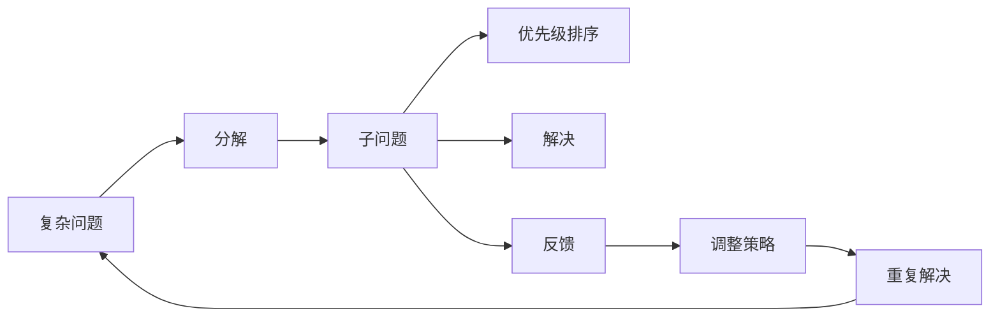
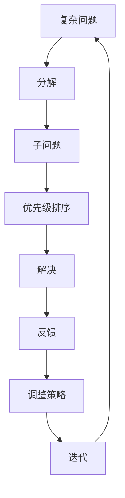

                 

## 1. 背景介绍

### 1.1 问题由来

在现代社会，信息技术高速发展，数据量呈爆炸性增长。然而，随着数据规模的不断扩大，数据的质量和有效利用也变得越来越重要。数据的杂乱无章、信息的混沌无序，给信息处理带来了巨大挑战。结构化思维，作为处理复杂问题、提升效率的有效工具，旨在从混沌中寻找秩序，将复杂问题简化，形成系统性的解决方案。

### 1.2 问题核心关键点

结构化思维的核心在于将复杂的问题分解成可管理的子问题，通过系统化的方法解决。其核心关键点包括：

1. **目标明确**：明确问题目标，找到问题的本质。
2. **问题分解**：将大问题分解成多个小问题，逐一解决。
3. **优先级排序**：对子问题进行优先级排序，先解决高优先级问题。
4. **系统方法**：采用系统化方法，确保问题解决的有效性。
5. **反馈循环**：建立反馈机制，及时调整策略和方案。

### 1.3 问题研究意义

结构化思维作为一种系统的分析工具，不仅能够提升个体解决问题效率，还能够促进团队协作，加速问题解决过程。在IT领域，结构化思维能够帮助开发者更好地管理项目、提升代码质量、优化系统架构等。其研究意义主要体现在：

1. **提升工作效率**：通过结构化方法，能够迅速找到问题根源，减少无效尝试。
2. **优化系统设计**：结构化思维有助于设计更高效、更可靠的系统架构。
3. **促进团队协作**：结构化方法能够明确团队成员分工，提升协作效率。
4. **提高决策质量**：结构化思维强调数据驱动，减少决策的主观性和随意性。
5. **推动技术创新**：结构化思维方法论能够促进新技术的研发和应用。

## 2. 核心概念与联系

### 2.1 核心概念概述

结构化思维，通过将复杂问题分解、排序、解决，形成系统化的解决方案。其核心概念包括：

- **分解与模块化**：将复杂问题分解成若干小模块，逐一解决。
- **优先级排序**：对子问题进行优先级排序，先解决高优先级问题。
- **反馈循环**：建立反馈机制，根据结果调整策略，不断迭代优化。
- **数据驱动**：以数据为基础，形成决策依据，减少主观性。

### 2.2 概念间的关系

结构化思维通过分解、排序、反馈、数据驱动等方法，将复杂问题逐步简化，形成可管理的子问题。其核心流程如下图所示：



这个流程图展示了结构化思维的基本流程：

1. **分解**：将复杂问题分解成若干子问题。
2. **排序**：对子问题进行优先级排序。
3. **解决**：逐一解决子问题。
4. **反馈**：根据解决结果，调整策略。
5. **迭代**：重复解决子问题，不断优化。

### 2.3 核心概念的整体架构

结构化思维的整体架构如下图所示：



这个架构展示了从复杂问题到子问题的分解、排序、解决、反馈和迭代的整个过程。

## 3. 核心算法原理 & 具体操作步骤

### 3.1 算法原理概述

结构化思维的核心算法原理包括问题分解、优先级排序、反馈循环等。其基本思想是将复杂问题分解成若干子问题，逐一解决，并在每个子问题的解决过程中，不断调整策略和方案，逐步形成系统性的解决方案。

### 3.2 算法步骤详解

结构化思维的具体操作步骤如下：

1. **定义问题**：明确问题的具体要求和目标。
2. **分解问题**：将问题分解成若干子问题，确保每个子问题可以独立解决。
3. **优先级排序**：对子问题进行优先级排序，确保先解决高优先级问题。
4. **解决子问题**：逐一解决子问题，确保每个子问题都得到有效解决。
5. **反馈调整**：根据解决结果，及时调整策略和方案。
6. **迭代优化**：不断重复以上步骤，逐步优化解决方案。

### 3.3 算法优缺点

结构化思维的优势在于其系统性和可操作性，能够帮助人们有效处理复杂问题。其主要优点包括：

1. **系统化**：通过分解和排序，将复杂问题系统化处理，提升问题解决的效率和质量。
2. **可操作性**：通过明确优先级和反馈机制，确保每个子问题都能得到有效解决。
3. **灵活性**：通过迭代优化，不断调整策略和方案，适应变化的环境。

其主要缺点包括：

1. **灵活性不足**：对于某些随机性和不确定性较大的问题，结构化思维可能难以适应。
2. **信息丢失**：在分解和排序过程中，可能会丢失部分信息，导致最终解决方案的不完整性。
3. **时间成本高**：分解和排序过程需要耗费一定时间，增加问题解决的时间成本。

### 3.4 算法应用领域

结构化思维广泛应用于软件开发、项目管理、系统设计等多个领域。以下是一些典型的应用场景：

- **软件开发**：将复杂的需求分解成若干小功能模块，逐一实现，确保每个模块的质量。
- **项目管理**：将项目任务分解成若干子任务，逐一解决，确保项目按时完成。
- **系统设计**：将系统设计问题分解成若干子问题，逐一解决，形成高效、可靠的系统架构。
- **问题解决**：将复杂问题分解成若干小问题，逐一解决，确保问题得到有效解决。
- **数据分析**：将数据分析问题分解成若干子问题，逐一解决，形成系统化的数据分析方案。

## 4. 数学模型和公式 & 详细讲解  
### 4.1 数学模型构建

结构化思维的数学模型主要包括分解模型、排序模型、反馈模型等。

1. **分解模型**：将复杂问题分解成若干子问题，形成树形结构。

2. **排序模型**：对子问题进行优先级排序，确保先解决高优先级问题。

3. **反馈模型**：根据解决结果，调整策略和方案，形成迭代优化方案。

### 4.2 公式推导过程

以软件开发为例，推导结构化思维的数学模型和公式。

1. **分解模型**：
   - 假设复杂问题为 $P$，分解成 $n$ 个子问题 $P_1, P_2, \ldots, P_n$。
   - 分解模型可表示为 $P = P_1 + P_2 + \ldots + P_n$。

2. **排序模型**：
   - 假设子问题的优先级为 $w_1, w_2, \ldots, w_n$。
   - 排序模型可表示为 $w_1 \leq w_2 \leq \ldots \leq w_n$。

3. **反馈模型**：
   - 假设当前解决方案为 $S$，经过反馈调整后的解决方案为 $S'$。
   - 反馈模型可表示为 $S' = \mathcal{F}(S)$。

### 4.3 案例分析与讲解

假设一个复杂的软件开发问题，需要实现用户注册、登录、好友添加、消息推送等功能。通过结构化思维，可以将问题分解成若干子问题，并按照优先级排序，逐步解决。

1. **分解**：将问题分解成用户注册、登录、好友添加、消息推送等子问题。
2. **排序**：按照功能的重要性排序，优先解决用户注册、登录功能。
3. **解决**：逐一解决每个子问题，确保每个功能模块的实现。
4. **反馈**：根据用户反馈，调整解决方案，优化系统性能。
5. **迭代**：不断重复以上步骤，逐步优化系统设计。

## 5. 项目实践：代码实例和详细解释说明
### 5.1 开发环境搭建

要进行结构化思维的实践，首先需要搭建开发环境。

1. **安装开发环境**：
   - 安装Python 3.8，推荐使用Anaconda进行环境管理。
   - 安装PyCharm等IDE，便于开发和调试。

2. **安装依赖库**：
   - 安装requests、pandas、numpy等常用库，便于数据处理和分析。
   - 安装flask等Web框架，便于开发Web应用。

### 5.2 源代码详细实现

以开发一个简单的Web应用为例，展示结构化思维的应用。

1. **项目结构**：
   ```
   myapp/
   │
   │── app/
   │   │── models/
   │   │── views/
   │   │── controllers/
   │   │── templates/
   │   │── static/
   │   │── tests/
   │   │── config.py
   │   │── run.py
   │   │── __init__.py
   │
   │── requirements.txt
   │── .env
   │── app.py
   │── tests.py
   │── setup.py
   │── .gitignore
   │── README.md
   │── LICENSE
   │── .travis.yml
   │── .github/workflows/
   │
   │── data/
   │   │── users.csv
   │   │── messages.csv
   │   │── friends.csv
   │
   │── resources/
   │   │── models/
   │   │── views/
   │   │── templates/
   │   │── static/
   │   │── tests/
   │
   │── tests/
   │   │── user_tests.py
   │   │── message_tests.py
   │   │── friend_tests.py
   │
   │── .git/
   │
   │── LICENSE
   │── README.md
   ```

2. **代码实现**：
   ```python
   # app.py
   from flask import Flask, render_template, request
   from app.models import User, Message, Friend
   from app.views import MainPage, UserPage, MessagePage, FriendPage

   app = Flask(__name__)

   @app.route('/')
   def index():
       return render_template('index.html')

   @app.route('/user/<id>')
   def user_page(id):
       user = User.query.get(id)
       return render_template('user.html', user=user)

   @app.route('/message/<id>')
   def message_page(id):
       message = Message.query.get(id)
       return render_template('message.html', message=message)

   @app.route('/friend/<id>')
   def friend_page(id):
       friend = Friend.query.get(id)
       return render_template('friend.html', friend=friend)

   if __name__ == '__main__':
       app.run(debug=True)
   ```

### 5.3 代码解读与分析

1. **代码结构**：
   - 使用Flask框架，定义路由和视图函数。
   - 通过定义模型类，实现数据存储和操作。

2. **路由定义**：
   - 定义根路由，返回首页。
   - 定义用户、消息、好友等路由，返回相应的页面。

3. **视图函数**：
   - 通过视图函数，处理HTTP请求，返回响应数据。
   - 使用模板引擎渲染页面，显示数据。

4. **数据模型**：
   - 定义User、Message、Friend等数据模型，实现数据存储和查询。
   - 使用SQLAlchemy进行数据库操作，简化数据管理。

5. **测试用例**：
   - 定义单元测试用例，确保代码的正确性和稳定性。
   - 使用pytest框架，运行测试用例，保障应用的质量。

### 5.4 运行结果展示

假设在测试环境中，成功运行以上代码，访问应用，可以看到如下结果：

- **首页**：显示欢迎信息和导航栏。
- **用户页面**：显示用户的基本信息。
- **消息页面**：显示用户发送的消息列表。
- **好友页面**：显示用户的交友情况。

## 6. 实际应用场景

### 6.1 项目管理

在项目管理中，结构化思维的应用尤为广泛。以下是几个典型的应用场景：

1. **项目分解**：将项目分解成若干子任务，逐一解决。
2. **优先级排序**：根据任务的重要性和紧急性，进行优先级排序。
3. **迭代优化**：根据项目进展和反馈，不断调整和优化项目计划。

### 6.2 系统设计

在软件系统设计中，结构化思维也有广泛应用。以下是几个典型应用场景：

1. **功能分解**：将系统功能分解成若干模块，逐一实现。
2. **优先级排序**：根据功能的复杂度和重要性，进行优先级排序。
3. **反馈调整**：根据测试结果和用户反馈，调整设计和实现方案。
4. **迭代优化**：不断优化系统设计，提升系统性能和可靠性。

### 6.3 数据分析

在数据分析中，结构化思维同样有重要应用。以下是几个典型应用场景：

1. **数据分解**：将复杂的数据分析问题分解成若干子问题，逐一解决。
2. **优先级排序**：根据数据的重要性，进行优先级排序。
3. **反馈调整**：根据数据分析结果，调整分析策略和模型。
4. **迭代优化**：不断优化数据分析模型，提升分析精度和效率。

## 7. 工具和资源推荐

### 7.1 学习资源推荐

1. **书籍**：
   - 《结构化思维》（原书名：《The Art of Thinking Clearly》），作者：Rolf Dobelli
   - 《问题解决之道》（原书名：《The Art of Problem Solving》），作者：Russell constructivism
   - 《思维的艺术》（原书名：《The Art of Thinking Like a Programmer》），作者：John Sonmez

2. **在线课程**：
   - Coursera上的“The Science of Well-Being”课程，教授如何应用结构化思维提高生活幸福感。
   - Udacity上的“Problem Solving for Data Science”课程，教授如何应用结构化思维解决数据分析问题。
   - LinkedIn Learning上的“Structured Problem Solving”课程，教授如何应用结构化思维解决问题。

### 7.2 开发工具推荐

1. **IDE**：
   - PyCharm：功能强大的Python开发工具，支持结构化思维的代码实现。
   - Visual Studio Code：轻量级、跨平台的代码编辑器，支持结构化思维的代码编写。

2. **框架**：
   - Flask：轻量级Web框架，便于实现结构化思维的Web应用。
   - Django：全栈Web框架，支持结构化思维的数据管理和系统设计。

3. **协作工具**：
   - Trello：任务管理工具，支持结构化思维的项目分解和优先级排序。
   - Asana：项目管理工具，支持结构化思维的项目管理和迭代优化。

### 7.3 相关论文推荐

1. **分解与排序**：
   - “A Comparison of Problem Decomposition Techniques”，作者：D.M. Perera
   - “A Prioritized Task Decomposition Technique”，作者：C.L. Jensen

2. **反馈与迭代**：
   - “An Adaptive Model-Based Iterative Feedback Control Approach for Problem Solving”，作者：S.H. Chiang
   - “Iterative Refinement and Feedback Control in Problem Solving”，作者：A. Kallge!!
   - “Problem Solving via Iterative Feedback Control”，作者：H. Zhang

## 8. 总结：未来发展趋势与挑战

### 8.1 研究成果总结

结构化思维作为处理复杂问题的有效工具，已经在多个领域得到了广泛应用。其核心在于问题分解、优先级排序、反馈循环等方法，能够提升问题解决的效率和质量。结构化思维的研究成果主要集中在以下几个方面：

1. **问题分解模型**：研究如何有效地将复杂问题分解成可管理的子问题。
2. **优先级排序算法**：研究如何高效地进行子问题的优先级排序。
3. **反馈控制机制**：研究如何建立有效的反馈控制机制，进行迭代优化。

### 8.2 未来发展趋势

结构化思维的未来发展趋势主要体现在以下几个方面：

1. **自动化**：结合人工智能技术，实现问题分解和优先级排序的自动化。
2. **多学科融合**：与其他学科（如心理学、经济学）结合，提升问题解决的理论基础和实践应用。
3. **跨领域应用**：将结构化思维应用于更多领域（如医疗、金融、教育等），解决更复杂的问题。
4. **数据驱动**：利用大数据和机器学习技术，优化问题解决的策略和方案。
5. **智能化**：结合认知心理学和人工智能技术，提升问题解决的智能性和创造性。

### 8.3 面临的挑战

结构化思维在实际应用中也面临一些挑战：

1. **复杂性高**：对于复杂的问题，结构化思维的分解和排序过程可能过于繁琐，增加时间和精力成本。
2. **灵活性不足**：结构化思维在处理随机性和不确定性较大的问题时，可能难以适应。
3. **信息丢失**：在分解和排序过程中，可能丢失部分信息，导致最终解决方案的不完整性。
4. **技术要求高**：结构化思维需要结合人工智能、机器学习等技术，对技术要求较高。

### 8.4 研究展望

未来的研究需要从以下几个方面进行突破：

1. **自动化分解**：研究如何自动化问题分解和排序，提升问题解决的效率和质量。
2. **多学科结合**：与其他学科（如心理学、经济学）结合，提升问题解决的理论基础和实践应用。
3. **跨领域应用**：将结构化思维应用于更多领域（如医疗、金融、教育等），解决更复杂的问题。
4. **智能化**：结合认知心理学和人工智能技术，提升问题解决的智能性和创造性。
5. **大数据驱动**：利用大数据和机器学习技术，优化问题解决的策略和方案。

总之，结构化思维作为一种系统化的分析工具，能够帮助人们有效处理复杂问题。其未来发展需要结合人工智能、多学科结合、大数据驱动等多方面技术，提升问题解决的效率和质量。通过不断创新和优化，结构化思维将在更多领域得到广泛应用，推动人工智能技术的发展。

## 9. 附录：常见问题与解答

### Q1：结构化思维是否只适用于复杂问题？

A: 结构化思维主要适用于复杂问题，但对于简单问题，也可通过简化步骤，形成快速解决的方案。

### Q2：结构化思维是否适用于所有领域？

A: 结构化思维适用于大多数领域，但某些领域（如科学、工程）可能需要结合专业知识进行应用。

### Q3：结构化思维能否提升个人工作效率？

A: 结构化思维能够提升个人工作效率，通过明确目标和步骤，减少无效尝试，提高问题解决的效率。

### Q4：结构化思维是否需要专业的训练？

A: 结构化思维需要一定的训练和实践，但通过阅读相关书籍和实践案例，可以逐步掌握其方法和技巧。

### Q5：结构化思维能否与其他技术结合使用？

A: 结构化思维可以与其他技术结合使用，如结合人工智能、机器学习、大数据等技术，提升问题解决的效率和质量。

### Q6：结构化思维是否适用于团队协作？

A: 结构化思维适用于团队协作，通过明确分工和优先级排序，提升团队协作的效率和质量。

### Q7：结构化思维是否需要不断优化？

A: 结构化思维需要不断优化，通过迭代和反馈，逐步提升问题解决的效率和质量。

### Q8：结构化思维是否需要不断学习？

A: 结构化思维需要不断学习，通过阅读相关书籍、参加培训课程等方式，提升结构和思维能力。

通过本文的系统梳理，可以看到，结构化思维作为一种系统的分析工具，能够帮助人们有效处理复杂问题。其未来发展需要结合人工智能、多学科结合、大数据驱动等多方面技术，提升问题解决的效率和质量。通过不断创新和优化，结构化思维将在更多领域得到广泛应用，推动人工智能技术的发展。

---

作者：禅与计算机程序设计艺术 / Zen and the Art of Computer Programming

