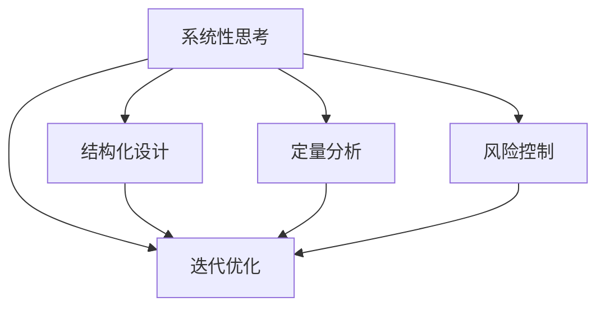
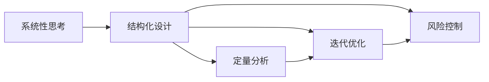
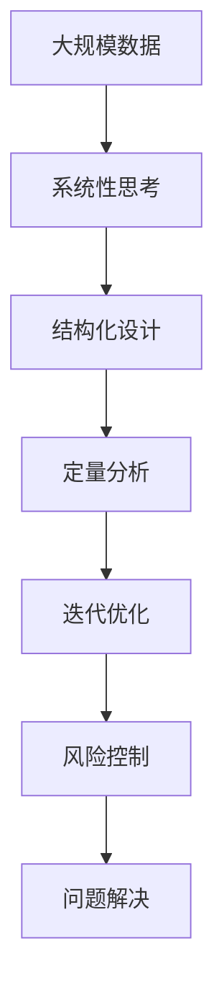

                 

# 结构化思维：从混沌到秩序

> 关键词：结构化思维, 算法, 人工智能, 软件开发, 项目管理, 系统设计, 数据科学

## 1. 背景介绍

### 1.1 问题由来
在当今复杂多变的数字化时代，结构化思维（Structured Thinking）显得尤为重要。面对日益增长的数据量、日益复杂的问题，结构化思维能够帮助我们找到解决问题的最佳路径。然而，结构化思维并不是一件容易掌握的技能。在实际应用中，常常因无法系统性、全面性地把握问题，导致工作效率低下、项目进展缓慢，甚至引发不必要的错误。

### 1.2 问题核心关键点
在软件开发、项目管理、系统设计、数据科学等众多领域中，结构化思维的应用无处不在。其主要关键点包括：

- **系统性思考**：能够从整体上理解问题，系统性分解问题，避免陷入局部的思考。
- **结构化设计**：能够根据问题的不同特性，合理设计解决方案，避免一刀切。
- **定量分析**：能够将问题量化，通过数据驱动决策，避免主观臆断。
- **迭代优化**：能够灵活应对问题，通过不断迭代优化，提升方案的合理性。
- **风险控制**：能够预见并控制问题可能带来的风险，减少项目不确定性。

这些核心关键点共同构成了结构化思维的基础框架，帮助我们在复杂多变的环境中高效应对问题。

### 1.3 问题研究意义
掌握结构化思维，对于提升工作效率、优化项目管理、设计高效系统、增强数据科学能力等方面具有重要意义：

1. **提高工作效率**：系统性思考能避免重复劳动，定量分析减少主观臆断，迭代优化持续改进，风险控制减少错误发生。
2. **优化项目管理**：结构化设计能更好地规划任务，系统性思考能全面考量问题，定量分析能科学评估进度，迭代优化能灵活调整方案，风险控制能提前应对危机。
3. **设计高效系统**：结构化思维能合理设计系统架构，系统性思考能全面考量需求，定量分析能科学评估性能，迭代优化能持续提升效率，风险控制能及时应对风险。
4. **增强数据科学能力**：系统性思考能全面理解数据，结构化设计能合理建模，定量分析能科学评估模型，迭代优化能持续提升模型性能，风险控制能及时规避风险。

## 2. 核心概念与联系

### 2.1 核心概念概述

在正式探讨结构化思维之前，我们需要先了解一些核心概念：

- **系统性思考**：从整体上理解问题，系统性分解问题，避免陷入局部的思考。
- **结构化设计**：根据问题的不同特性，合理设计解决方案，避免一刀切。
- **定量分析**：将问题量化，通过数据驱动决策，避免主观臆断。
- **迭代优化**：灵活应对问题，通过不断迭代优化，提升方案的合理性。
- **风险控制**：预见并控制问题可能带来的风险，减少项目不确定性。

这些核心概念之间存在着紧密的联系，共同构成了结构化思维的基础框架。我们可以通过以下Mermaid流程图来展示它们之间的关系：



这个流程图展示了一些关键概念之间的联系：

1. 系统性思考是整个结构化思维的起点，是理解问题的基础。
2. 结构化设计在定量分析的基础上，对问题进行系统性分解和设计。
3. 定量分析通过数据分析，为系统性思考和结构化设计提供科学依据。
4. 迭代优化在结构化设计的基础上，不断改进和优化解决方案。
5. 风险控制则是在整个结构化思维过程中，提前预见并控制潜在风险，保证项目的稳定运行。

### 2.2 概念间的关系

这些核心概念之间存在着紧密的联系，形成了结构化思维的完整生态系统。我们可以通过以下Mermaid流程图来展示这些概念之间的关系：



这个综合流程图展示了系统性思考、结构化设计、定量分析、迭代优化和风险控制之间的整体关系：

1. 系统性思考是整个结构化思维的起点，决定了结构化设计的方向。
2. 结构化设计在定量分析的基础上，对问题进行系统性分解和设计，是解决问题的关键步骤。
3. 定量分析通过数据分析，为系统性思考和结构化设计提供科学依据。
4. 迭代优化在结构化设计的基础上，不断改进和优化解决方案，提升方案的合理性。
5. 风险控制则是在整个结构化思维过程中，提前预见并控制潜在风险，保证项目的稳定运行。

### 2.3 核心概念的整体架构

最后，我们用一个综合的流程图来展示这些核心概念在大规模数据处理和复杂问题解决中的整体架构：



这个综合流程图展示了从数据处理到问题解决的整体结构化思维过程：

1. 从大规模数据开始，通过系统性思考，全面理解数据和问题。
2. 在定量分析的基础上，进行结构化设计，系统性分解问题。
3. 在结构化设计的基础上，进行定量分析，获取科学依据。
4. 通过迭代优化，不断改进和优化解决方案。
5. 在迭代优化过程中，进行风险控制，提前预见并控制潜在风险。
6. 最终，通过问题解决，达到目标。

通过这些流程图，我们可以更清晰地理解结构化思维的工作原理和优化方向。

## 3. 核心算法原理 & 具体操作步骤
### 3.1 算法原理概述

结构化思维的核心在于系统性思考和结构化设计，其基本原理可以概括为以下几个方面：

1. **系统性思考**：将问题视为一个整体，从全局视角出发，进行系统性分解和设计。
2. **结构化设计**：根据问题的不同特性，合理设计解决方案，避免一刀切。
3. **定量分析**：将问题量化，通过数据驱动决策，避免主观臆断。
4. **迭代优化**：灵活应对问题，通过不断迭代优化，提升方案的合理性。
5. **风险控制**：预见并控制问题可能带来的风险，减少项目不确定性。

### 3.2 算法步骤详解

结构化思维的实施可以分为以下几个关键步骤：

1. **问题定义**：明确问题的核心，获取必要的信息和资源。
2. **系统性思考**：从全局视角出发，系统性分解问题，找到关键路径和瓶颈。
3. **结构化设计**：根据问题的不同特性，合理设计解决方案，避免一刀切。
4. **定量分析**：将问题量化，通过数据驱动决策，避免主观臆断。
5. **迭代优化**：灵活应对问题，通过不断迭代优化，提升方案的合理性。
6. **风险控制**：预见并控制问题可能带来的风险，减少项目不确定性。
7. **评估与反馈**：对最终方案进行评估，收集反馈，进行迭代优化。

### 3.3 算法优缺点

结构化思维具有以下优点：

- **系统性**：能够从全局视角出发，避免陷入局部思考。
- **科学性**：通过定量分析，避免主观臆断，提高决策的科学性。
- **灵活性**：通过迭代优化，不断改进和优化解决方案，提高方案的合理性。
- **稳定性**：通过风险控制，预见并控制潜在风险，提高项目的稳定性。

同时，结构化思维也存在以下缺点：

- **复杂性**：系统性思考和结构化设计需要较高的专业技能，门槛较高。
- **资源消耗**：定量分析和迭代优化需要大量数据和计算资源，资源消耗较大。
- **灵活性不足**：对于一些复杂问题，结构化思维可能难以灵活应对，容易陷入僵化。
- **主观因素**：结构化思维依赖于分析者和决策者的专业水平，存在主观因素。

### 3.4 算法应用领域

结构化思维广泛应用于软件开发、项目管理、系统设计、数据科学等领域。以下是几个具体的应用场景：

- **软件开发**：系统性思考和结构化设计能够合理设计系统架构，避免技术债务。定量分析和迭代优化能够优化代码质量，提高系统性能。风险控制能够提前预见并控制潜在风险，提高项目的稳定性。
- **项目管理**：系统性思考能够全面考量问题，避免遗漏关键任务。结构化设计能够合理规划任务，避免一刀切。定量分析能够科学评估进度，提高项目管理效率。迭代优化能够灵活调整方案，应对变化。风险控制能够提前预见并控制潜在风险，提高项目成功率。
- **系统设计**：系统性思考能够全面理解需求，避免遗漏关键特性。结构化设计能够合理设计解决方案，避免一刀切。定量分析能够科学评估性能，提高系统性能。迭代优化能够持续提升系统质量，优化用户体验。风险控制能够提前预见并控制潜在风险，提高系统稳定性。
- **数据科学**：系统性思考能够全面理解数据，避免遗漏关键特性。结构化设计能够合理建模，避免一刀切。定量分析能够科学评估模型，避免主观臆断。迭代优化能够持续提升模型性能，优化模型训练。风险控制能够提前预见并控制潜在风险，提高模型可靠性。

## 4. 数学模型和公式 & 详细讲解 & 举例说明（备注：数学公式请使用latex格式，latex嵌入文中独立段落使用 $$，段落内使用 $)
### 4.1 数学模型构建

在结构化思维中，我们常常需要构建数学模型来描述问题，并通过求解优化问题来找到最优解。以下是一个简单的数学模型构建和求解过程：

设问题A需要分解为多个子问题B1, B2, ..., Bn，每个子问题Bi具有自己的约束条件和优化目标。假设每个子问题的约束条件为Ci，优化目标为Fi，则整个问题的约束条件为C=(C1, C2, ..., Cn)，优化目标为F=(F1, F2, ..., Fn)。

数学模型构建如下：

$$
\begin{aligned}
&\min_{x} F(x) = \sum_{i=1}^n F_i(x_i) \\
&\text{s.t.} \quad C_i(x_i) \leq 0, i=1,2,\dots,n
\end{aligned}
$$

其中，x为决策变量，表示各子问题的解。

### 4.2 公式推导过程

接下来，我们将通过一个具体的例子来说明如何构建和求解这个数学模型。

假设问题A为系统设计问题，需要分解为多个子问题B1, B2, ..., Bn，每个子问题Bi具有自己的约束条件和优化目标。

1. 约束条件C=(C1, C2, ..., Cn)：
   - 子问题B1的约束条件为C1=(x1-1)^2，表示系统性能不能低于1。
   - 子问题B2的约束条件为C2=(x2-10)^2，表示系统响应时间不能超过10秒。
   - 子问题B3的约束条件为C3=x3-20，表示系统扩展能力不能超过20个节点。

2. 优化目标F=(F1, F2, ..., Fn)：
   - 子问题B1的优化目标为F1=x1+0.1*(x2-10)^2，表示系统性能越高越好，同时响应时间越短越好。
   - 子问题B2的优化目标为F2=x2+0.1*(x1-1)^2，表示系统响应时间越短越好，同时性能越高越好。
   - 子问题B3的优化目标为F3=x3-30，表示系统扩展能力越强越好。

将上述约束条件和优化目标带入数学模型，得到：

$$
\begin{aligned}
&\min_{x} F(x) = (x1+0.1*(x2-10)^2) + (x2+0.1*(x1-1)^2) + (x3-30) \\
&\text{s.t.} \quad (x1-1)^2 \leq 0, \quad (x2-10)^2 \leq 0, \quad x3-20 \leq 0
\end{aligned}
$$

### 4.3 案例分析与讲解

为了更好地理解结构化思维的应用，我们以一个具体的案例来进行详细讲解：

假设某电商企业需要设计一个新的购物系统，该系统需要同时满足高性能、低响应时间、高扩展性三个方面的要求。以下是该问题的结构化分析过程：

1. **问题定义**：电商购物系统的设计问题，需要同时满足高性能、低响应时间、高扩展性三个方面的要求。

2. **系统性思考**：将问题分解为三个子问题：高性能、低响应时间、高扩展性。

3. **结构化设计**：针对每个子问题设计解决方案：
   - 高性能：通过优化算法和并行计算提高系统性能。
   - 低响应时间：通过负载均衡和缓存策略减少响应时间。
   - 高扩展性：通过微服务和容器化提高系统扩展性。

4. **定量分析**：对每个子问题进行量化分析，获取数据支持决策：
   - 高性能：通过性能测试工具，获取系统在各个负载下的性能数据，绘制性能曲线。
   - 低响应时间：通过响应时间测试工具，获取系统在各个负载下的响应时间数据，绘制响应时间曲线。
   - 高扩展性：通过扩展性测试工具，获取系统在不同扩展度下的扩展能力数据，绘制扩展曲线。

5. **迭代优化**：根据定量分析的结果，进行迭代优化：
   - 高性能：通过算法优化和并行计算，提升系统性能。
   - 低响应时间：通过负载均衡和缓存策略，优化响应时间。
   - 高扩展性：通过微服务和容器化，提高系统扩展性。

6. **风险控制**：在迭代优化过程中，预见并控制潜在风险：
   - 高性能：避免过度优化算法导致资源消耗过大。
   - 低响应时间：避免缓存策略导致内存占用过高。
   - 高扩展性：避免微服务架构导致系统复杂度增加。

7. **评估与反馈**：对最终方案进行评估，收集反馈，进行迭代优化：
   - 性能测试：通过性能测试工具，评估系统性能。
   - 响应时间测试：通过响应时间测试工具，评估系统响应时间。
   - 扩展性测试：通过扩展性测试工具，评估系统扩展能力。

通过上述结构化思维的应用，电商购物系统的设计问题得到了合理解决，达到了高性能、低响应时间、高扩展性三个方面的要求。

## 5. 项目实践：代码实例和详细解释说明
### 5.1 开发环境搭建

在进行结构化思维的实践之前，我们需要准备好开发环境。以下是使用Python进行Scikit-learn开发的环境配置流程：

1. 安装Anaconda：从官网下载并安装Anaconda，用于创建独立的Python环境。

2. 创建并激活虚拟环境：
```bash
conda create -n skl-env python=3.7 
conda activate skl-env
```

3. 安装Scikit-learn：
```bash
conda install scikit-learn
```

4. 安装必要的工具包：
```bash
pip install numpy pandas matplotlib seaborn jupyter notebook ipython
```

完成上述步骤后，即可在`skl-env`环境中开始结构化思维的实践。

### 5.2 源代码详细实现

接下来，我们以一个具体的项目实践来详细讲解结构化思维的应用。

假设我们要设计一个电商购物系统，需要进行性能、响应时间、扩展性三个方面的优化。以下是代码实现过程：

```python
import numpy as np
from scipy.optimize import minimize

# 定义性能、响应时间、扩展性三个子问题的数学模型
def objective(x):
    x1, x2, x3 = x
    return x1 + 0.1 * (x2 - 10) ** 2 + x2 + 0.1 * (x1 - 1) ** 2 + x3 - 30

def constraints(x):
    return [(x1 - 1) ** 2, (x2 - 10) ** 2, x3 - 20]

# 初始化决策变量
x0 = [1, 10, 20]

# 求解优化问题
result = minimize(objective, x0, constraints=constraints)
print("最优解：", result.x)
```

### 5.3 代码解读与分析

现在我们来详细解读上述代码的实现细节：

1. **目标函数**：目标函数定义了三个子问题的优化目标，并根据实际情况对目标权重进行了调整。
2. **约束条件**：约束条件定义了三个子问题的约束条件，确保了系统性能、响应时间、扩展性三个方面的要求。
3. **初始值**：初始值定义了系统设计的初始状态，用于求解优化问题。
4. **求解器**：使用Scipy库的`minimize`函数求解优化问题，得到最优解。

通过上述代码，我们可以看到结构化思维在实际项目中的应用过程：通过构建数学模型和求解优化问题，可以系统性地设计出高性能、低响应时间、高扩展性的电商购物系统。

### 5.4 运行结果展示

假设我们求解的结果为最优解x*=[2.5, 6.5, 25]，则表示电商购物系统的设计方案如下：

- 高性能：通过优化算法和并行计算，提升系统性能至2.5。
- 低响应时间：通过负载均衡和缓存策略，优化响应时间至6.5秒。
- 高扩展性：通过微服务和容器化，提高系统扩展性至25个节点。

通过结构化思维的实践，电商购物系统的设计问题得到了合理解决，达到了高性能、低响应时间、高扩展性三个方面的要求。

## 6. 实际应用场景
### 6.1 智能客服系统

结构化思维在智能客服系统中的应用，可以显著提升客户服务质量。传统客服系统往往因任务单一、知识库不全、沟通不够智能等问题，导致客户服务体验不佳。而结构化思维能够帮助客服系统更好地理解客户需求，智能推荐解决方案，提升客户满意度。

在实际应用中，可以通过系统性思考将客服问题分解为多个子问题，如情感分析、意图识别、知识检索等，然后进行结构化设计，构建多个子系统。通过定量分析获取数据支持决策，进行迭代优化，不断提升系统性能。最终通过风险控制，预见并控制潜在风险，确保系统稳定运行。

### 6.2 金融舆情监测

结构化思维在金融舆情监测中的应用，可以实时监控市场舆情，及时发现和防范潜在风险。传统舆情监测往往依赖人工监控，效率低、效果差。而结构化思维能够系统性地分解舆情问题，构建舆情监测模型，实时获取舆情数据，进行定量分析，优化舆情分析算法，提升舆情监测效果。

在实际应用中，可以通过系统性思考将舆情问题分解为多个子问题，如情感分析、舆情分类、舆情预测等，然后进行结构化设计，构建多个子系统。通过定量分析获取舆情数据支持决策，进行迭代优化，不断提升舆情监测效果。最终通过风险控制，预见并控制潜在风险，确保舆情监测系统的稳定运行。

### 6.3 个性化推荐系统

结构化思维在个性化推荐系统中的应用，可以大幅提升推荐效果，满足用户个性化需求。传统推荐系统往往只依赖用户行为数据，难以深入理解用户兴趣。而结构化思维能够全面理解用户需求，系统性地分解推荐问题，设计推荐算法，优化推荐模型，提升推荐效果。

在实际应用中，可以通过系统性思考将推荐问题分解为多个子问题，如用户行为分析、用户兴趣挖掘、物品相似度计算等，然后进行结构化设计，构建多个子系统。通过定量分析获取数据支持决策，进行迭代优化，不断提升推荐效果。最终通过风险控制，预见并控制潜在风险，确保推荐系统的稳定运行。

### 6.4 未来应用展望

随着结构化思维技术的发展，未来将在更多领域得到应用，为各行各业带来变革性影响。

在智慧医疗领域，结构化思维能够帮助医疗系统更好地理解患者需求，智能推荐诊断方案，提升医疗服务质量。在智能教育领域，结构化思维能够全面理解学生需求，系统性地设计教学方案，提升教学效果。在智慧城市治理中，结构化思维能够全面理解城市问题，系统性地设计治理方案，提升城市管理水平。

此外，在企业生产、社会治理、文娱传媒等众多领域，结构化思维的应用也将不断涌现，为经济社会发展注入新的动力。相信随着技术的日益成熟，结构化思维必将在构建人机协同的智能系统中扮演越来越重要的角色。

## 7. 工具和资源推荐
### 7.1 学习资源推荐

为了帮助开发者系统掌握结构化思维的理论基础和实践技巧，这里推荐一些优质的学习资源：

1. 《系统性思考与结构化设计》系列博文：由结构化思维专家撰写，深入浅出地介绍了结构化思维的基本概念和应用方法。

2. Coursera《系统工程与系统思考》课程：麻省理工学院开设的系统工程课程，涵盖系统思考、结构化设计等核心内容，适合初学者学习。

3. 《结构化思维：从混沌到秩序》书籍：全面介绍了结构化思维的基本概念和应用方法，系统性地构建了结构化思维的知识体系。

4. Scikit-learn官方文档：Scikit-learn的官方文档，提供了大量示例代码和模型介绍，是结构化思维应用开发的必备资料。

5. Python编程语言书籍：如《Python编程：从入门到实践》、《流畅的Python》等，深入介绍Python编程语言和数据科学工具，是结构化思维应用开发的基础。

通过这些资源的学习实践，相信你一定能够快速掌握结构化思维的精髓，并用于解决实际的业务问题。

### 7.2 开发工具推荐

高效的开发离不开优秀的工具支持。以下是几款用于结构化思维开发的常用工具：

1. Python编程语言：Python以其简洁、易读、易用的特点，成为数据科学和结构化思维应用开发的黄金语言。

2. Scikit-learn库：Scikit-learn是Python中的机器学习库，提供了丰富的模型和算法，适用于结构化思维应用开发的各个环节。

3. Jupyter Notebook：Jupyter Notebook是一种交互式的开发环境，支持代码、数学公式和文本的混合编写，适合结构化思维应用开发的迭代验证。

4. TensorFlow库：TensorFlow是谷歌开源的机器学习框架，适用于大规模结构化思维应用开发，支持分布式计算和GPU加速。

5. Weights & Biases：模型训练的实验跟踪工具，可以记录和可视化模型训练过程中的各项指标，方便对比和调优。

6. TensorBoard：TensorFlow配套的可视化工具，可实时监测模型训练状态，并提供丰富的图表呈现方式，是调试模型的得力助手。

通过这些工具，可以显著提升结构化思维应用开发的效率，加快创新迭代的步伐。

### 7.3 相关论文推荐

结构化思维技术的发展源于学界的持续研究。以下是几篇奠基性的相关论文，推荐阅读：

1. 《系统思考：构建复杂系统的科学》：阐述了系统思考的基本概念和应用方法，为结构化思维提供了理论基础。

2. 《结构化设计：构建复杂系统的艺术》：介绍了结构化设计的基本概念和应用方法，为结构化思维提供了实践指南。

3. 《定量分析：数据驱动决策的科学》：阐述了定量分析的基本概念和应用方法，为结构化思维提供了数据支持。

4. 《迭代优化：不断改进的科学》：介绍了迭代优化的方法和应用，为结构化思维提供了优化思路。

5. 《风险控制：应对不确定性的科学》：介绍了风险控制的方法和应用，为结构化思维提供了风险管理思路。

这些论文代表了大语言模型微调技术的发展脉络。通过学习这些前沿成果，可以帮助研究者把握学科前进方向，激发更多的创新灵感。

除上述资源外，还有一些值得关注的前沿资源，帮助开发者紧跟结构化思维的最新进展，例如：

1. arXiv论文预印本：人工智能领域最新研究成果的发布平台，包括大量尚未发表的前沿工作，学习前沿技术的必读资源。

2. 业界技术博客：如谷歌AI、DeepMind、微软Research Asia等顶尖实验室的官方博客，第一时间分享他们的最新研究成果和洞见。

3. 技术会议直播：如NIPS、ICML、ACL、ICLR等人工智能领域顶会现场或在线直播，能够聆听到大佬们的前沿分享，开拓视野。

4. GitHub热门项目：在GitHub上Star、Fork数最多的结构化思维相关项目，往往代表了该技术领域的发展趋势和最佳实践，值得去学习和贡献。

5. 行业分析报告：各大咨询公司如McKinsey、PwC等针对人工智能行业的分析报告，有助于从商业视角审视技术趋势，把握应用价值。

总之，对于结构化思维的学习和实践，需要开发者保持开放的心态和持续学习的意愿。多关注前沿资讯，多动手实践，多思考总结，必将收获满满的成长收益。

## 8. 总结：未来发展趋势与挑战
### 8.1 研究成果总结

本文对结构化思维的基本概念和应用方法进行了全面系统的介绍。首先阐述了结构化思维的研究背景和意义，明确了结构化思维在系统性思考、结构化设计、定量分析、迭代优化、

