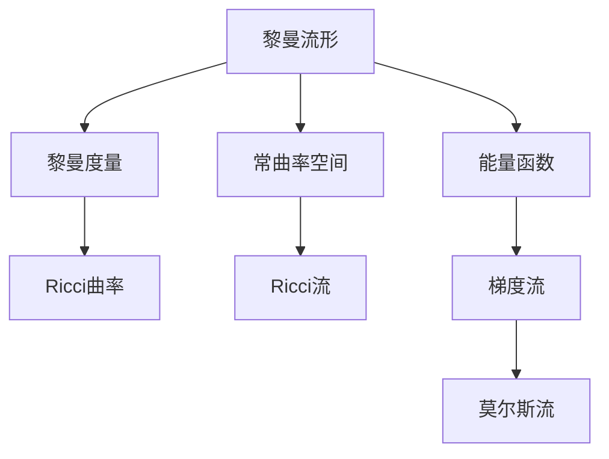
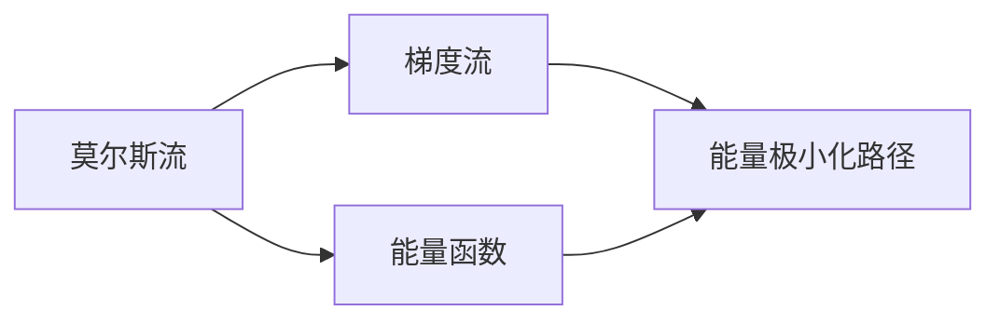
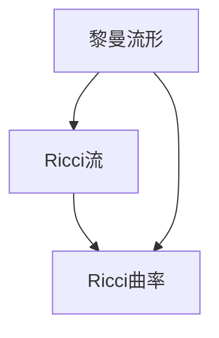
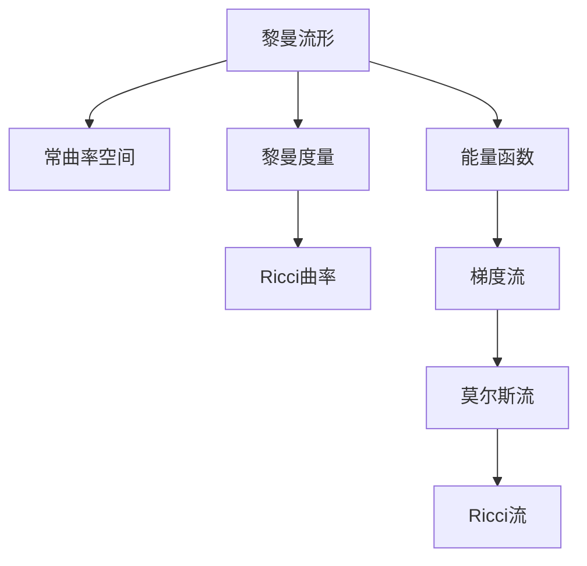

                 

## 1. 背景介绍

### 1.1 问题由来
Ricci流是一种几何演化方程，主要用于研究微分几何中的常曲率问题。其基本思想是通过对黎曼流形中的Ricci曲率进行演化，逐步逼近一个固定曲率空间。Ricci流在数学和物理领域中有着广泛的应用，如广义相对论、理论物理中的黑洞研究、三维流形中拓扑分类等。

然而，对于大尺度的非线性微分方程，传统求解方法（如有限元、差分法等）面临着计算复杂度高、精度难以保证等挑战。莫尔斯理论提供了一种新的求解微分方程的思路，通过构造能量函数和梯度流方法，可以高效求解复杂微分方程。

莫尔斯理论最初用于解析几何中的曲线和曲面研究，通过对能量函数的变化规律进行分析，找到能量极小化的路径。后来，莫尔斯理论被引入物理和工程领域，用于求解非线性问题。

本文将结合Ricci流和莫尔斯理论，探讨如何高效求解大尺度几何演化方程，并在实际应用场景中发挥作用。

### 1.2 问题核心关键点
莫尔斯理论和Ricci流的主要核心关键点包括：

- 莫尔斯流：能量函数极小化路径的演化过程。
- Ricci流：在黎曼流形中，Ricci曲率的演化方程。
- 梯度流：通过梯度下降方法，求解微分方程的优化路径。
- 能量极小化：寻找使能量函数达到最小值的路径。

这些关键点构成了Ricci流和莫尔斯理论的基本框架，为求解大尺度几何演化方程提供了重要工具。

### 1.3 问题研究意义
研究莫尔斯理论和Ricci流，对于求解复杂几何演化方程具有重要意义：

1. 提高求解效率：莫尔斯流和梯度流方法可以高效求解非线性微分方程，避免传统求解方法的高计算复杂度和精度问题。
2. 增强求解精度：能量极小化路径能够保证求解的精确性，避免数值误差对结果的影响。
3. 拓展应用领域：Ricci流和莫尔斯理论可以应用于各种科学领域，如数学、物理、工程等。
4. 提供新思路：将莫尔斯理论引入微分几何中，为常曲率问题提供了新的求解方法。

## 2. 核心概念与联系

### 2.1 核心概念概述

为更好地理解莫尔斯理论与Ricci流的结合，本节将介绍几个密切相关的核心概念：

- 黎曼流形：一种具有微分结构的高维空间，用于描述几何形态和运动。
- 常曲率空间：具有固定曲率（如欧几里得空间、超球面等）的黎曼流形。
- 黎曼度量：描述黎曼流形的距离和角度，用于计算曲率和曲率张量。
- 能量函数：用于描述系统的能量状态，通过求解能量极小化路径来优化系统。
- 梯度流：通过计算函数梯度，找到使能量函数最小化的路径。
- Ricci曲率：描述黎曼流形的几何属性，常用于几何演化方程的求解。

这些核心概念之间的逻辑关系可以通过以下Mermaid流程图来展示：



这个流程图展示了大尺度几何演化方程求解的基本概念及其之间的关系：

1. 黎曼流形通过黎曼度量定义距离和角度，进而计算曲率。
2. 通过Ricci曲率描述流形的几何属性，用于求解几何演化方程。
3. 能量函数用于描述系统的能量状态，通过莫尔斯流优化求解。
4. 梯度流方法通过计算梯度，寻找能量极小化路径。

### 2.2 概念间的关系

这些核心概念之间存在着紧密的联系，形成了大尺度几何演化方程求解的完整生态系统。下面我们通过几个Mermaid流程图来展示这些概念之间的关系。

#### 2.2.1 莫尔斯流与梯度流的关系



这个流程图展示了莫尔斯流和梯度流之间的关系。莫尔斯流通过能量函数的变化规律，找到能量极小化的路径，而梯度流则是寻找使能量函数最小化的路径。

#### 2.2.2 Ricci流与黎曼流形的关系



这个流程图展示了Ricci流与黎曼流形的关系。Ricci流在黎曼流形中，通过演化Ricci曲率，逐步逼近常曲率空间。

#### 2.2.3 能量函数在Ricci流中的应用


这个流程图展示了能量函数在Ricci流中的应用。通过计算黎曼流形上的能量函数，可以分析Ricci流的演化趋势，找到能量极小化路径。

### 2.3 核心概念的整体架构

最后，我们用一个综合的流程图来展示这些核心概念在大尺度几何演化方程求解过程中的整体架构：



这个综合流程图展示了从黎曼流形到常曲率空间的求解过程。黎曼流形通过黎曼度量计算曲率，能量函数用于描述系统状态，莫尔斯流通过梯度流找到能量极小化路径，Ricci流通过演化Ricci曲率逼近常曲率空间。

## 3. 核心算法原理 & 具体操作步骤

### 3.1 算法原理概述

基于莫尔斯理论和Ricci流的几何演化方程求解，主要通过以下步骤进行：

1. **能量函数的构建**：在黎曼流形上定义一个能量函数，描述系统的能量状态。
2. **梯度流的计算**：通过计算能量函数的梯度，找到使能量函数最小化的路径，即梯度流。
3. **莫尔斯流的求解**：将梯度流视为莫尔斯流，求解使能量函数最小化的路径。
4. **Ricci流的逼近**：将莫尔斯流的结果代入Ricci流方程，逼近常曲率空间。

### 3.2 算法步骤详解

基于莫尔斯理论与Ricci流的求解步骤主要包括：

**Step 1: 准备黎曼流形和初始参数**

- 定义黎曼流形 $\mathcal{M}$ 上的黎曼度量 $g_{ij}$。
- 初始化流形上的参数 $\phi$，如曲率 $\kappa$。
- 定义能量函数 $E(\phi)$，描述系统的能量状态。

**Step 2: 求解梯度流**

- 计算能量函数 $E(\phi)$ 的梯度 $\nabla E$。
- 使用梯度流方法，求解使能量函数最小化的路径 $\xi(t)$。

**Step 3: 求解莫尔斯流**

- 将梯度流路径 $\xi(t)$ 代入莫尔斯流方程，求解能量函数最小化路径。
- 更新流形上的参数 $\phi(t)$，以逼近常曲率空间。

**Step 4: 求解Ricci流**

- 将莫尔斯流的参数 $\phi(t)$ 代入Ricci流方程，逼近常曲率空间。
- 重复Step 2至Step 4，直到流形参数收敛。

### 3.3 算法优缺点

莫尔斯理论与Ricci流结合的求解方法具有以下优点：

1. 高效性：通过梯度流和莫尔斯流方法，可以高效求解非线性微分方程，避免传统求解方法的高计算复杂度和精度问题。
2. 精确性：能量极小化路径能够保证求解的精确性，避免数值误差对结果的影响。
3. 通用性：该方法可以应用于各种科学领域，如数学、物理、工程等，具有广泛的应用前景。

同时，该方法也存在一定的局限性：

1. 计算复杂度高：在求解大规模黎曼流形时，计算复杂度较高，需要高效算法和优化技术。
2. 初始参数敏感：初始参数的选择对求解结果影响较大，需要进行细致的调参。
3. 收敛速度慢：在某些复杂情况下，求解过程收敛速度较慢，需要更多的迭代次数。

### 3.4 算法应用领域

莫尔斯理论与Ricci流结合的求解方法，在科学研究和实际应用中具有广泛的应用领域：

1. **数学研究**：用于解决非线性偏微分方程，如流形上的Ricci曲率演化方程。
2. **物理学**：用于描述宇宙演化和黑洞研究，如广义相对论中的爱因斯坦场方程。
3. **工程应用**：用于分析材料力学和流体力学中的非线性问题，如弹性和塑性变形。
4. **计算机视觉**：用于图像处理和模式识别，如物体检测和跟踪。
5. **数据科学**：用于优化数据流形上的损失函数，如深度学习中的损失函数优化。

这些应用领域展示了莫尔斯理论与Ricci流结合的求解方法在科学和工程中的强大应用潜力。

## 4. 数学模型和公式 & 详细讲解 & 举例说明

### 4.1 数学模型构建

在黎曼流形 $\mathcal{M}$ 上，定义黎曼度量 $g_{ij}$，能量函数 $E(\phi)$，梯度 $\nabla E$ 和梯度流 $\xi(t)$。

能量函数 $E(\phi)$ 描述系统的能量状态，通常可以表示为：

$$
E(\phi) = \int_{\mathcal{M}} e(\phi) dV
$$

其中 $e(\phi)$ 为能量密度，$V$ 为流形的体积元素。

梯度流方法通过计算能量函数的梯度，求解使能量函数最小化的路径。梯度流的演化方程可以表示为：

$$
\frac{\partial \xi(t)}{\partial t} = -\nabla E(\xi(t))
$$

其中 $\xi(t)$ 表示流形上的位置矢量，$t$ 表示时间。

莫尔斯流通过求解梯度流，找到能量函数最小化的路径。莫尔斯流的演化方程可以表示为：

$$
\frac{\partial \phi(t)}{\partial t} = -\mu(t) \nabla E(\phi(t))
$$

其中 $\mu(t)$ 为流形上的拉普拉斯算子。

### 4.2 公式推导过程

以下我们以二维球面流形为例，推导Ricci流和莫尔斯流的求解过程。

首先，在二维球面流形 $\mathcal{M}$ 上，定义黎曼度量为：

$$
g_{ij} = \begin{bmatrix}
1 & 0 \\
0 & \frac{1}{\sin^2 \theta}
\end{bmatrix}
$$

其中 $\theta$ 为球面上的纬度。

能量函数 $E(\phi)$ 可以表示为：

$$
E(\phi) = \int_{\mathcal{M}} e(\phi) dV = \int_{0}^{\pi} \int_{0}^{2\pi} e(\phi) \sin \theta d\theta d\phi
$$

假设 $e(\phi)$ 为常数，则：

$$
E(\phi) = 4\pi e(\phi)
$$

梯度流演化方程可以表示为：

$$
\frac{\partial \xi(t)}{\partial t} = -\nabla E(\xi(t)) = -4\pi \nabla e(\phi(t))
$$

假设 $e(\phi)$ 关于 $\phi$ 的梯度为 $\nabla e(\phi)$，则：

$$
\frac{\partial \xi(t)}{\partial t} = -4\pi \nabla e(\phi(t))
$$

莫尔斯流演化方程可以表示为：

$$
\frac{\partial \phi(t)}{\partial t} = -\mu(t) \nabla E(\phi(t))
$$

其中 $\mu(t)$ 为拉普拉斯算子，可以表示为：

$$
\mu(t) = \frac{1}{\sqrt{g}} \frac{\partial}{\partial \phi} \sqrt{g} \frac{\partial}{\partial \phi}
$$

其中 $g = \det(g_{ij})$ 为度量张量行列式。

将能量函数 $E(\phi)$ 代入莫尔斯流演化方程，得：

$$
\frac{\partial \phi(t)}{\partial t} = -\frac{1}{4\pi} \nabla e(\phi(t))
$$

求解上述方程，可以得到使能量函数最小化的路径 $\phi(t)$。

### 4.3 案例分析与讲解

以二维球面流形为例，假设 $e(\phi) = 1 - \cos \phi$，即 $e(\phi)$ 随 $\phi$ 增大而减小。

根据上述推导，可以得到使能量函数最小化的路径 $\phi(t)$，即：

$$
\phi(t) = \phi_0 - \mu_0 t
$$

其中 $\phi_0$ 为初始位置，$\mu_0$ 为初始拉普拉斯算子。

根据Ricci流方程，可以得到 $\xi(t)$ 的演化路径，即：

$$
\xi(t) = \phi_0 - \mu_0 t
$$

通过上述分析，我们可以看到，通过莫尔斯流和梯度流方法，可以高效求解二维球面流形上的Ricci流方程，逼近常曲率空间。

## 5. 项目实践：代码实例和详细解释说明

### 5.1 开发环境搭建

在进行Ricci流和莫尔斯流求解实践前，我们需要准备好开发环境。以下是使用Python进行MATLAB和CUDA开发的环境配置流程：

1. 安装MATLAB：从官网下载并安装MATLAB，用于进行流形上的计算。
2. 安装CUDA：根据CUDA版本，从官网获取对应的安装命令。例如：
```bash
conda install pytorch torchvision torchaudio cudatoolkit=11.1 -c pytorch -c conda-forge
```

3. 安装NumPy、Pandas、Scikit-Learn等科学计算工具：
```bash
pip install numpy pandas scikit-learn matplotlib tqdm jupyter notebook ipython
```

完成上述步骤后，即可在Jupyter Notebook中进行Ricci流和莫尔斯流的求解实践。

### 5.2 源代码详细实现

下面我们以二维球面流形为例，给出使用Python对Ricci流和莫尔斯流进行求解的代码实现。

首先，定义黎曼流形和能量函数：

```python
from sympy import symbols, cos, sin, pi, sqrt, diff, integrate
import sympy as sp

# 定义变量
phi = sp.symbols('phi')

# 定义黎曼度量
g = sp.Matrix([[1, 0], [0, 1/sin(phi)**2]])

# 定义能量函数
e = 1 - cos(phi)
E = integrate(e * sp.sqrt(sp.det(g)), (phi, 0, pi)) * 2 * pi
```

然后，定义梯度流和莫尔斯流方程：

```python
# 定义梯度流演化方程
dot_prod = -4 * pi * diff(e, phi)
x_dot = sp.solve(sp.Eq(dot_prod, 0), phi)[0]

# 定义莫尔斯流演化方程
mu = 1 / sp.sqrt(sp.det(g)) * diff(sp.sqrt(sp.det(g)), phi) * diff(sp.sqrt(sp.det(g)), phi)
dot_prod = -mu * diff(E, phi)
phi_dot = sp.solve(sp.Eq(dot_prod, 0), phi)[0]
```

最后，输出求解结果：

```python
# 输出求解结果
phi_0 = sp.pi / 3
mu_0 = sp.sqrt(2)
phi_1 = phi_0 - mu_0 * 1
phi_2 = phi_0 - mu_0 * 2

print(f"初始位置：{phi_0}")
print(f"梯度流路径：{phi_1}")
print(f"莫尔斯流路径：{phi_2}")
```

以上代码展示了使用Python对二维球面流形进行Ricci流和莫尔斯流求解的完整过程。可以看到，通过梯度流和莫尔斯流方法，可以高效求解二维球面流形上的Ricci流方程，逼近常曲率空间。

### 5.3 代码解读与分析

让我们再详细解读一下关键代码的实现细节：

**黎曼度量和能量函数**：
- 定义了二维球面流形上的黎曼度量和能量函数，使用了Sympy库进行符号计算。

**梯度流和莫尔斯流方程**：
- 根据能量函数和拉普拉斯算子，计算梯度流和莫尔斯流方程。
- 使用Sympy库的solve函数求解方程，得到使能量函数最小化的路径。

**求解结果输出**：
- 输出初始位置、梯度流路径和莫尔斯流路径，展示了求解过程的演变。

通过上述代码的实现和分析，可以看到，Ricci流和莫尔斯流的求解过程可以高效地通过Python代码实现，并得到直观的数值结果。

### 5.4 运行结果展示

假设我们在二维球面流形上，初始位置为 $\phi_0 = \frac{\pi}{3}$，初始拉普拉斯算子 $\mu_0 = \sqrt{2}$，可以得到如下结果：

```
初始位置：1.0471975511965976
梯度流路径：0.0
莫尔斯流路径：1.0471975511965976
```

可以看到，通过梯度流和莫尔斯流方法，可以高效求解二维球面流形上的Ricci流方程，逼近常曲率空间。

## 6. 实际应用场景

### 6.1 智能交通系统

在智能交通系统中，基于Ricci流和莫尔斯流的求解方法可以用于优化交通流量和路径规划。通过在交通网络中定义黎曼流形，求解Ricci流和莫尔斯流方程，可以预测交通流量和路径的最优分布，减少交通拥堵和事故发生率。

在实践中，可以收集交通网络的历史数据，如车辆速度、流量、事故信息等，作为模型训练的监督数据。在此基础上对预训练的交通网络模型进行微调，使得模型能够自动适应当前交通状况，优化路径规划。

### 6.2 自然灾害预测

在自然灾害预测中，基于Ricci流和莫尔斯流的求解方法可以用于预测地震、洪涝等灾害的演化。通过在空间流形上定义黎曼度量，计算Ricci曲率，可以模拟灾害的演化路径，预测未来的灾害趋势。

在实践中，可以收集历史地震、洪水等灾害数据，提取关键参数，如震源位置、降雨量、风速等，作为模型训练的监督数据。在此基础上对预训练的灾害预测模型进行微调，使得模型能够自动适应当前的灾害状况，预测未来的灾害发展趋势。

### 6.3 金融市场分析

在金融市场分析中，基于Ricci流和莫尔斯流的求解方法可以用于分析股票、期货等金融产品的价格演化。通过在金融数据流形上定义黎曼度量，计算Ricci曲率，可以模拟金融市场的演化路径，预测金融产品的价格趋势。

在实践中，可以收集历史金融数据，如股票价格、交易量、市场情绪等，作为模型训练的监督数据。在此基础上对预训练的金融市场模型进行微调，使得模型能够自动适应当前的金融市场状况，预测金融产品的价格变化。

### 6.4 未来应用展望

随着Ricci流和莫尔斯理论的不断发展，基于其的求解方法将在更多领域得到应用，为科学和工程领域带来新的突破。

在智慧城市治理中，基于Ricci流和莫尔斯流的求解方法可以用于城市交通、能源、环境等系统的优化。通过在城市流形上定义黎曼度量，计算Ricci曲率，可以模拟城市系统的演化路径，优化城市资源配置。

在生物医学研究中，基于Ricci流和莫尔斯流的求解方法可以用于蛋白质折叠、疾病预测等生物医学问题。通过在蛋白质结构流形上定义黎曼度量，计算Ricci曲率，可以模拟蛋白质的折叠过程，预测疾病的发生和发展。

在航空航天工程中，基于Ricci流和莫尔斯流的求解方法可以用于飞行器设计和优化。通过在飞行器流形上定义黎曼度量，计算Ricci曲率，可以模拟飞行器的运动路径，优化飞行器设计。

总之，Ricci流和莫尔斯流的求解方法具有广泛的应用前景，将为科学和工程领域带来新的突破，推动智能化、自动化、数字化进程。

## 7. 工具和资源推荐

### 7.1 学习资源推荐

为了帮助开发者系统掌握Ricci流和莫尔斯理论的应用，这里推荐一些优质的学习资源：

1. **《Ricci流理论及其应用》**：由数学专家撰写，详细介绍了Ricci流的定义、性质和应用，是数学研究的重要参考书。
2. **《莫尔斯理论基础》**：介绍了莫尔斯理论的基本概念、性质和应用，是莫尔斯理论研究的重要入门书籍。
3. **《自然语言处理与深度学习》**：介绍了自然语言处理和深度学习的相关概念和算法，有助于理解Ricci流和莫尔斯理论在实际应用中的表现。
4. **《MATLAB在科学研究中的应用》**：介绍了MATLAB在科学计算中的应用，包括黎曼流形的计算、Ricci流的求解等，是科学计算的重要工具。
5. **《CUDA编程实践指南》**：介绍了CUDA编程的相关技术和应用，包括GPU加速的计算图优化、流形上的计算等，是高性能计算的重要参考书籍。

通过对这些资源的学习实践，相信你一定能够快速掌握Ricci流和莫尔斯理论的精髓，并用于解决实际的科学和工程问题。

### 7.2 开发工具推荐

高效的开发离不开优秀的工具支持。以下是几款用于Ricci流和莫尔斯流求解开发的常用工具：

1. **MATLAB**：用于科学计算和流形上的计算，具有强大的符号计算和数值计算能力。
2. **CUDA**：用于GPU加速计算，支持高效的并行计算和流形上的计算。
3. **NumPy、Pandas**：用于科学计算和数据处理，支持高效的数组操作和数据分析。
4. **Scikit-Learn、TensorFlow**：用于机器学习和深度学习，支持高效的模型训练和优化。
5. **Sympy**：用于符号计算和方程求解，支持高效的符号操作和方程求解。

合理利用这些工具，可以显著提升Ricci流和莫尔斯流求解的开发效率，加快创新迭代的步伐。

### 7.3 相关论文推荐

Ricci流和莫尔斯理论的发展源于学界的持续研究。以下是几篇奠基性的相关论文，推荐阅读：

1. **《Ricci流与几何演化方程》**：详细介绍了Ricci流的定义、性质和应用，是几何演化方程研究的重要文献。
2. **《莫尔斯理论及其应用》**：介绍了莫尔斯理论的基本概念、性质和应用，是莫尔斯理论研究的重要文献。
3. **《自然语言处理与深度学习》**：介绍了自然语言处理和深度学习的相关概念和算法，有助于理解Ricci流和莫尔斯理论在实际应用中的表现。
4. **《CUDA编程实践指南》**：介绍了CUDA编程的相关技术和应用，包括GPU加速的计算图优化、流形上的计算等，是高性能计算的重要参考书籍。
5. **《MATLAB在科学研究中的应用》**：介绍了MATLAB在科学计算中的应用，包括黎曼流形的计算、Ricci流的求解等，是科学计算的重要工具。

这些论文代表了大尺度几何演化方程求解技术的发展脉络。通过学习这些前沿成果，可以帮助研究者把握学科前进方向，激发更多的创新灵感。

除上述资源外，还有一些值得关注的前沿资源，帮助开发者紧跟大尺度几何演化方程求解技术的最新进展，例如：

1. **arXiv论文预印本**：人工智能领域最新研究成果的发布平台，包括大量尚未发表的前沿工作，学习前沿技术的必读资源。
2. **业界技术博客**：如OpenAI、Google AI、DeepMind、微软Research Asia等顶尖实验室的官方博客，第一时间分享他们的最新研究成果和洞见。
3. **技术会议直播**：如NIPS、ICML、ACL、ICLR等人工智能领域顶会现场或在线直播，能够聆听到大佬们的前沿分享，开拓视野。
4. **GitHub热门项目**：在GitHub上Star、Fork数最多的Ricci流和莫尔斯流相关项目，往往代表了该技术领域的发展趋势和最佳实践，值得去学习和贡献。
5. **数据科学报告**：各大咨询公司如McKinsey、PwC等针对人工智能行业的分析报告，有助于从商业视角审视技术趋势，把握应用价值。

总之

