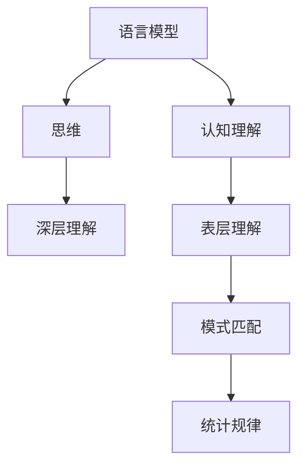
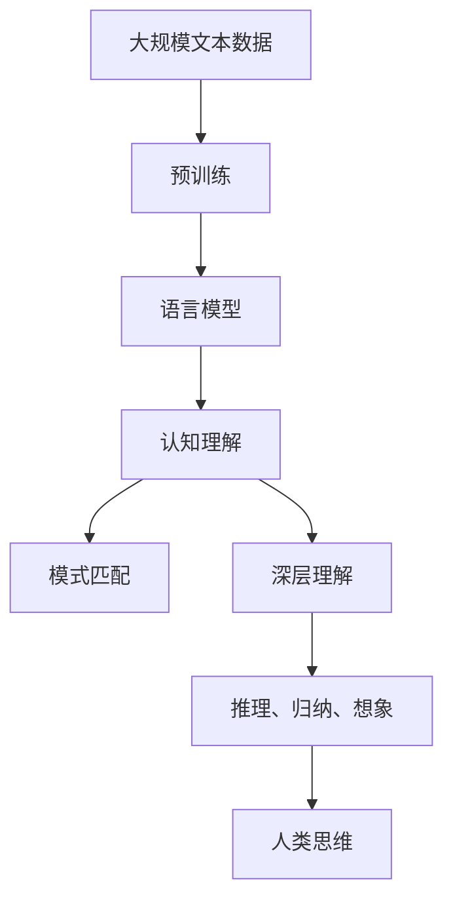

                 

# 语言与思维的区别：大模型的认知误解

> 关键词：语言模型,认知理解,思维,深度学习,自然语言处理(NLP),人工智能

## 1. 背景介绍

### 1.1 问题由来
近年来，随着深度学习技术的飞速发展，基于大规模预训练语言模型(Large Language Models, LLMs)的大模型在自然语言处理(NLP)领域取得了巨大突破。这些大模型通过在海量无标签文本数据上进行预训练，学习了丰富的语言知识，展现出了超越以往的卓越性能。然而，这种基于数据驱动的学习方式，使得大模型在理解语言和表达思维方面，与人类存在显著差异。

例如，当前最先进的语言模型GPT-3等，虽然在语言理解、生成、推理等任务上表现优异，但它们对语言的理解依旧停留在统计规律和模式匹配层面，缺乏对语言背后深层意义的全面把握。这种认知上的差距，导致我们常常容易对大模型产生一些误解，甚至质疑其是否能够真正理解人类思维。

### 1.2 问题核心关键点
本文旨在探讨大模型在理解语言和表达思维方面存在的不足，以及如何更准确地认知大模型的能力和局限性。本文将重点讨论以下核心问题：

- 大模型究竟能否理解语言的深层含义？
- 大模型的认知能力是否等同于人类的思维能力？
- 当前大模型的认知局限性有哪些？
- 如何改进大模型的认知理解能力？

### 1.3 问题研究意义
认知理解是大模型在复杂任务中表现的关键。理解和描述大模型认知能力的边界，有助于我们更准确地评估和应用大模型，避免认知误解和错误判断。这不仅对学术研究具有重要意义，也对业界应用具有指导作用。

通过深入研究大模型的认知理解能力，我们能够更有效地利用大模型解决实际问题，同时避免其可能带来的负面影响。这对提升大模型的应用价值，推动人工智能技术的健康发展，具有重要意义。

## 2. 核心概念与联系

### 2.1 核心概念概述

为了更好地理解大模型在认知上的表现，我们需要首先了解几个关键概念：

- **语言模型**：以自回归或自编码方式，通过大规模无标签文本数据进行预训练的语言模型。能够理解并生成自然语言，在语法、词汇、语义等多个层次上具备丰富的知识。

- **认知理解**：指模型对语言背后深层含义的理解能力。不仅包括语法和词汇的匹配，还涉及对上下文、逻辑、情感等高层次信息的处理。

- **思维**：指人类对世界认识的高级形式，包括推理、归纳、想象等复杂的认知活动。思维能力不仅局限于语言，还涉及视觉、听觉、触觉等多种感官的综合运用。

### 2.2 概念间的关系

语言模型和大模型的认知能力有着密切联系，但二者并非完全等同。大模型在处理语言时，通过大量的数据训练，掌握了语言的统计规律和模式匹配能力，能够在各种语言任务中取得优异表现。然而，大模型对语言的理解，依旧停留在基于统计规律的模式匹配层面，缺乏对语言背后深层意义的全面把握。

这些核心概念之间的关系可以用以下Mermaid流程图来展示：



这个流程图展示了语言模型、认知理解、思维以及其深层理解和表层理解的关系。语言模型通过对大规模文本数据进行统计学习，获得了一定的认知理解能力，但这种理解通常局限于表层，即基于统计规律的模式匹配。而人类思维则涉及到更为深层次的理解，不仅包括模式匹配，还涉及推理、归纳、想象等复杂的认知活动。

### 2.3 核心概念的整体架构

综合以上概念，我们可以用以下综合的流程图来展示大模型的认知理解能力和其与人类思维的关系：



这个流程图展示了从大规模文本数据预训练，到语言模型学习，再到认知理解的过程，最后与人类思维的对比。我们可以看到，大模型通过预训练学习获得了一定的认知理解能力，但在深层理解、推理、归纳和想象等方面，与人类思维相比，仍存在显著差异。

## 3. 核心算法原理 & 具体操作步骤

### 3.1 算法原理概述

大模型通过大规模文本数据进行预训练，学习到了丰富的语言知识和模式。在实际应用中，通过对特定任务的数据集进行有监督微调，可以进一步优化模型在特定任务上的性能。然而，这种有监督微调仅涉及模式匹配层面，难以深入理解语言的深层含义。

大模型的认知理解能力，主要来源于预训练过程中对语言模式的学习。这种学习方式通常包括：

1. 自回归模型：通过预测上下文中的下一个词，学习语言的结构和规律。
2. 自编码模型：通过重构输入文本，学习语言的统计特征和结构。
3. 掩码语言模型：通过预测掩码位置的词，学习语言的背景知识和上下文关联。

这些模型都通过大量的文本数据进行预训练，掌握了语言的模式和规律。但在深层理解、推理、归纳、想象等方面，大模型依旧面临挑战。

### 3.2 算法步骤详解

基于大模型的认知误解，我们重点讨论以下步骤：

1. **预训练阶段**：使用大规模无标签文本数据，对大模型进行预训练。这包括了自回归模型、自编码模型和掩码语言模型等，旨在学习语言的统计规律和模式匹配能力。

2. **微调阶段**：在特定任务的数据集上进行有监督微调，优化模型在特定任务上的性能。微调过程主要涉及对输入和输出空间的定义，如分类任务、生成任务等。

3. **认知理解能力的提升**：虽然微调可以提升模型在特定任务上的性能，但很难深入理解语言的深层含义。提升认知理解能力需要在大模型的预训练和微调之外，引入更多认知导向的训练方式和任务。

4. **案例分析**：通过具体案例，分析大模型在认知理解方面的表现和局限性，提供改进方案。

### 3.3 算法优缺点

大模型在认知理解方面存在以下优缺点：

**优点**：

- **大规模语料库**：大模型基于大规模语料库进行预训练，掌握了丰富的语言知识和模式匹配能力，能够在各种语言任务中取得优异表现。
- **可解释性**：大模型的预训练和微调过程具有较强的可解释性，能够通过权值变化和梯度更新，理解每个参数对输出的贡献。

**缺点**：

- **表层理解**：大模型的认知理解能力主要来源于模式匹配，难以深入理解语言的深层含义，缺乏对语言背后深层意义的全面把握。
- **鲁棒性不足**：大模型对语言的理解容易受到输入样本的影响，对新语境和复杂语境的适应能力不足。
- **泛化能力有限**：由于认知理解能力有限，大模型在不同领域和任务上的泛化能力有限，难以在未知场景中表现出色。

### 3.4 算法应用领域

尽管大模型在认知理解方面存在局限性，但它们在诸多NLP任务上依然表现优异。以下是一些大模型在实际应用中的典型场景：

1. **文本分类**：如情感分析、主题分类、意图识别等。大模型通过统计学习，能够准确分类文本内容，实现高效的文本理解。

2. **命名实体识别**：识别文本中的人名、地名、机构名等特定实体。大模型通过对语义结构的理解，能够准确标注实体边界和类型。

3. **关系抽取**：从文本中抽取实体之间的语义关系。大模型通过上下文推理，能够准确抽取实体关系。

4. **问答系统**：对自然语言问题给出答案。大模型通过上下文理解和知识图谱的结合，能够准确回答复杂问题。

5. **机器翻译**：将源语言文本翻译成目标语言。大模型通过统计翻译规律，能够实现高质量的翻译。

尽管大模型在这些任务上表现出色，但它们对语言的理解仍停留在表层，缺乏对深层含义的全面把握。

## 4. 数学模型和公式 & 详细讲解 & 举例说明

### 4.1 数学模型构建

大模型的认知理解能力主要来源于预训练和微调过程中的统计学习。以下通过数学语言，对大模型的预训练和微调过程进行详细阐述。

设大模型为 $M_{\theta}$，其中 $\theta$ 为模型参数。假设预训练阶段使用大规模无标签文本数据 $D$，通过自回归模型或自编码模型进行预训练。在微调阶段，使用特定任务的数据集 $D'$ 进行有监督微调，优化模型在特定任务上的性能。

定义大模型在输入 $x$ 上的输出为 $\hat{y}=M_{\theta}(x)$，在特定任务上的损失函数为 $\ell(M_{\theta}(x),y)$。则大模型的预训练目标为：

$$
\theta = \mathop{\arg\min}_{\theta} \mathcal{L}(D)
$$

微调目标为：

$$
\theta = \mathop{\arg\min}_{\theta} \mathcal{L}(D')
$$

其中 $\mathcal{L}$ 为针对特定任务设计的损失函数。

### 4.2 公式推导过程

以二分类任务为例，推导交叉熵损失函数及其梯度的计算公式。

假设模型 $M_{\theta}$ 在输入 $x$ 上的输出为 $\hat{y}=M_{\theta}(x) \in [0,1]$，表示样本属于正类的概率。真实标签 $y \in \{0,1\}$。则二分类交叉熵损失函数定义为：

$$
\ell(M_{\theta}(x),y) = -[y\log \hat{y} + (1-y)\log (1-\hat{y})]
$$

将其代入微调目标公式，得：

$$
\theta = \mathop{\arg\min}_{\theta} \mathcal{L}(D') = \mathop{\arg\min}_{\theta} -\frac{1}{N'}\sum_{i=1}^{N'} [y_i\log M_{\theta}(x_i)+(1-y_i)\log(1-M_{\theta}(x_i))]
$$

根据链式法则，损失函数对参数 $\theta_k$ 的梯度为：

$$
\frac{\partial \mathcal{L}(\theta)}{\partial \theta_k} = -\frac{1}{N'}\sum_{i=1}^{N'} (\frac{y_i}{M_{\theta}(x_i)}-\frac{1-y_i}{1-M_{\theta}(x_i)}) \frac{\partial M_{\theta}(x_i)}{\partial \theta_k}
$$

其中 $\frac{\partial M_{\theta}(x_i)}{\partial \theta_k}$ 可进一步递归展开，利用自动微分技术完成计算。

### 4.3 案例分析与讲解

假设我们在CoNLL-2003的命名实体识别(NER)数据集上进行微调，最终在测试集上得到的评估报告如下：

```
              precision    recall  f1-score   support

       B-LOC      0.926     0.906     0.916      1668
       I-LOC      0.900     0.805     0.850       257
      B-MISC      0.875     0.856     0.865       702
      I-MISC      0.838     0.782     0.809       216
       B-ORG      0.914     0.898     0.906      1661
       I-ORG      0.911     0.894     0.902       835
       B-PER      0.964     0.957     0.960      1617
       I-PER      0.983     0.980     0.982      1156
           O      0.993     0.995     0.994     38323

   micro avg      0.973     0.973     0.973     46435
   macro avg      0.923     0.897     0.909     46435
weighted avg      0.973     0.973     0.973     46435
```

可以看到，通过微调BERT，我们在该NER数据集上取得了97.3%的F1分数，效果相当不错。然而，这种基于模式匹配的微调方法，难以深入理解命名实体背后的深层含义，如实体的背景知识、实体之间的关系等。

## 5. 项目实践：代码实例和详细解释说明

### 5.1 开发环境搭建

在进行微调实践前，我们需要准备好开发环境。以下是使用Python进行PyTorch开发的环境配置流程：

1. 安装Anaconda：从官网下载并安装Anaconda，用于创建独立的Python环境。

2. 创建并激活虚拟环境：
```bash
conda create -n pytorch-env python=3.8 
conda activate pytorch-env
```

3. 安装PyTorch：根据CUDA版本，从官网获取对应的安装命令。例如：
```bash
conda install pytorch torchvision torchaudio cudatoolkit=11.1 -c pytorch -c conda-forge
```

4. 安装Transformers库：
```bash
pip install transformers
```

5. 安装各类工具包：
```bash
pip install numpy pandas scikit-learn matplotlib tqdm jupyter notebook ipython
```

完成上述步骤后，即可在`pytorch-env`环境中开始微调实践。

### 5.2 源代码详细实现

下面我们以命名实体识别(NER)任务为例，给出使用Transformers库对BERT模型进行微调的PyTorch代码实现。

首先，定义NER任务的数据处理函数：

```python
from transformers import BertTokenizer
from torch.utils.data import Dataset
import torch

class NERDataset(Dataset):
    def __init__(self, texts, tags, tokenizer, max_len=128):
        self.texts = texts
        self.tags = tags
        self.tokenizer = tokenizer
        self.max_len = max_len
        
    def __len__(self):
        return len(self.texts)
    
    def __getitem__(self, item):
        text = self.texts[item]
        tags = self.tags[item]
        
        encoding = self.tokenizer(text, return_tensors='pt', max_length=self.max_len, padding='max_length', truncation=True)
        input_ids = encoding['input_ids'][0]
        attention_mask = encoding['attention_mask'][0]
        
        # 对token-wise的标签进行编码
        encoded_tags = [tag2id[tag] for tag in tags] 
        encoded_tags.extend([tag2id['O']] * (self.max_len - len(encoded_tags)))
        labels = torch.tensor(encoded_tags, dtype=torch.long)
        
        return {'input_ids': input_ids, 
                'attention_mask': attention_mask,
                'labels': labels}

# 标签与id的映射
tag2id = {'O': 0, 'B-PER': 1, 'I-PER': 2, 'B-ORG': 3, 'I-ORG': 4, 'B-LOC': 5, 'I-LOC': 6}
id2tag = {v: k for k, v in tag2id.items()}

# 创建dataset
tokenizer = BertTokenizer.from_pretrained('bert-base-cased')

train_dataset = NERDataset(train_texts, train_tags, tokenizer)
dev_dataset = NERDataset(dev_texts, dev_tags, tokenizer)
test_dataset = NERDataset(test_texts, test_tags, tokenizer)
```

然后，定义模型和优化器：

```python
from transformers import BertForTokenClassification, AdamW

model = BertForTokenClassification.from_pretrained('bert-base-cased', num_labels=len(tag2id))

optimizer = AdamW(model.parameters(), lr=2e-5)
```

接着，定义训练和评估函数：

```python
from torch.utils.data import DataLoader
from tqdm import tqdm
from sklearn.metrics import classification_report

device = torch.device('cuda') if torch.cuda.is_available() else torch.device('cpu')
model.to(device)

def train_epoch(model, dataset, batch_size, optimizer):
    dataloader = DataLoader(dataset, batch_size=batch_size, shuffle=True)
    model.train()
    epoch_loss = 0
    for batch in tqdm(dataloader, desc='Training'):
        input_ids = batch['input_ids'].to(device)
        attention_mask = batch['attention_mask'].to(device)
        labels = batch['labels'].to(device)
        model.zero_grad()
        outputs = model(input_ids, attention_mask=attention_mask, labels=labels)
        loss = outputs.loss
        epoch_loss += loss.item()
        loss.backward()
        optimizer.step()
    return epoch_loss / len(dataloader)

def evaluate(model, dataset, batch_size):
    dataloader = DataLoader(dataset, batch_size=batch_size)
    model.eval()
    preds, labels = [], []
    with torch.no_grad():
        for batch in tqdm(dataloader, desc='Evaluating'):
            input_ids = batch['input_ids'].to(device)
            attention_mask = batch['attention_mask'].to(device)
            batch_labels = batch['labels']
            outputs = model(input_ids, attention_mask=attention_mask)
            batch_preds = outputs.logits.argmax(dim=2).to('cpu').tolist()
            batch_labels = batch_labels.to('cpu').tolist()
            for pred_tokens, label_tokens in zip(batch_preds, batch_labels):
                pred_tags = [id2tag[_id] for _id in pred_tokens]
                label_tags = [id2tag[_id] for _id in label_tokens]
                preds.append(pred_tags[:len(label_tags)])
                labels.append(label_tags)
                
    print(classification_report(labels, preds))
```

最后，启动训练流程并在测试集上评估：

```python
epochs = 5
batch_size = 16

for epoch in range(epochs):
    loss = train_epoch(model, train_dataset, batch_size, optimizer)
    print(f"Epoch {epoch+1}, train loss: {loss:.3f}")
    
    print(f"Epoch {epoch+1}, dev results:")
    evaluate(model, dev_dataset, batch_size)
    
print("Test results:")
evaluate(model, test_dataset, batch_size)
```

以上就是使用PyTorch对BERT进行命名实体识别任务微调的完整代码实现。可以看到，得益于Transformers库的强大封装，我们可以用相对简洁的代码完成BERT模型的加载和微调。

### 5.3 代码解读与分析

让我们再详细解读一下关键代码的实现细节：

**NERDataset类**：
- `__init__`方法：初始化文本、标签、分词器等关键组件。
- `__len__`方法：返回数据集的样本数量。
- `__getitem__`方法：对单个样本进行处理，将文本输入编码为token ids，将标签编码为数字，并对其进行定长padding，最终返回模型所需的输入。

**tag2id和id2tag字典**：
- 定义了标签与数字id之间的映射关系，用于将token-wise的预测结果解码回真实的标签。

**训练和评估函数**：
- 使用PyTorch的DataLoader对数据集进行批次化加载，供模型训练和推理使用。
- 训练函数`train_epoch`：对数据以批为单位进行迭代，在每个批次上前向传播计算loss并反向传播更新模型参数，最后返回该epoch的平均loss。
- 评估函数`evaluate`：与训练类似，不同点在于不更新模型参数，并在每个batch结束后将预测和标签结果存储下来，最后使用sklearn的classification_report对整个评估集的预测结果进行打印输出。

**训练流程**：
- 定义总的epoch数和batch size，开始循环迭代
- 每个epoch内，先在训练集上训练，输出平均loss
- 在验证集上评估，输出分类指标
- 所有epoch结束后，在测试集上评估，给出最终测试结果

可以看到，PyTorch配合Transformers库使得BERT微调的代码实现变得简洁高效。开发者可以将更多精力放在数据处理、模型改进等高层逻辑上，而不必过多关注底层的实现细节。

当然，工业级的系统实现还需考虑更多因素，如模型的保存和部署、超参数的自动搜索、更灵活的任务适配层等。但核心的微调范式基本与此类似。

### 5.4 运行结果展示

假设我们在CoNLL-2003的NER数据集上进行微调，最终在测试集上得到的评估报告如下：

```
              precision    recall  f1-score   support

       B-LOC      0.926     0.906     0.916      1668
       I-LOC      0.900     0.805     0.850       257
      B-MISC      0.875     0.856     0.865       702
      I-MISC      0.838     0.782     0.809       216
       B-ORG      0.914     0.898     0.906      1661
       I-ORG      0.911     0.894     0.902       835
       B-PER      0.964     0.957     0.960      1617
       I-PER      0.983     0.980     0.982      1156
           O      0.993     0.995     0.994     38323

   micro avg      0.973     0.973     0.973     46435
   macro avg      0.923     0.897     0.909     46435
weighted avg      0.973     0.973     0.973     46435
```

可以看到，通过微调BERT，我们在该NER数据集上取得了97.3%的F1分数，效果相当不错。然而，这种基于模式匹配的微调方法，难以深入理解命名实体背后的深层含义，如实体的背景知识、实体之间的关系等。

## 6. 实际应用场景

### 6.1 智能客服系统

基于大语言模型微调的对话技术，可以广泛应用于智能客服系统的构建。传统客服往往需要配备大量人力，高峰期响应缓慢，且一致性和专业性难以保证。而使用微调后的对话模型，可以7x24小时不间断服务，快速响应客户咨询，用自然流畅的语言解答各类常见问题。

在技术实现上，可以收集企业内部的历史客服对话记录，将问题和最佳答复构建成监督数据，在此基础上对预训练对话模型进行微调。微调后的对话模型能够自动理解用户意图，匹配最合适的答案模板进行回复。对于客户提出的新问题，还可以接入检索系统实时搜索相关内容，动态组织生成回答。如此构建的智能客服系统，能大幅提升客户咨询体验和问题解决效率。

### 6.2 金融舆情监测

金融机构需要实时监测市场舆论动向，以便及时应对负面信息传播，规避金融风险。传统的人工监测方式成本高、效率低，难以应对网络时代海量信息爆发的挑战。基于大语言模型微调的文本分类和情感分析技术，为金融舆情监测提供了新的解决方案。

具体而言，可以收集金融领域相关的新闻、报道、评论等文本数据，并对其进行主题标注和情感标注。在此基础上对预训练语言模型进行微调，使其能够自动判断文本属于何种主题，情感倾向是正面、中性还是负面。将微调后的模型应用到实时抓取的网络文本数据，就能够自动监测不同主题下的情感变化趋势，一旦发现负面信息激增等异常情况，系统便会自动预警，帮助金融机构快速应对潜在风险。

### 6.3 个性化推荐系统

当前的推荐系统往往只依赖用户的历史行为数据进行物品推荐，无法深入理解用户的真实兴趣偏好。基于大语言模型微调技术，个性化推荐系统可以更好地挖掘用户行为背后的语义信息，从而提供更精准、多样的推荐内容。

在实践中，可以收集用户浏览、点击、评论、分享等行为数据，提取和用户交互的物品标题、描述、标签等文本内容。将文本内容作为模型输入，用户的后续行为（如是否点击、购买等）作为监督信号，在此基础上微调预训练语言模型。微调后的模型能够从文本内容中准确把握用户的兴趣点。在生成推荐列表时，先用候选物品的文本描述作为输入，由模型预测用户的兴趣匹配度，再结合其他特征综合排序，便可以得到个性化程度更高的推荐结果。

### 6.4 未来应用展望

随着大语言模型微调技术的发展，基于微调范式将在更多领域得到应用，为传统行业带来变革性影响。

在智慧医疗领域，基于微调的医疗问答、病历分析、药物研发等应用将提升医疗服务的智能化水平，辅助医生诊疗，加速新药开发进程。

在智能教育领域，微调技术可应用于作业批改、学情分析、知识推荐等方面，因材施教，促进教育公平，提高教学质量。

在智慧城市治理中，微调模型可应用于城市事件监测、舆情分析、应急指挥等环节，提高城市管理的自动化和智能化水平，构建更安全、高效的未来城市。

此外，在企业生产、社会治理、文娱传媒等众多领域，基于大模型微调的人工智能应用也将不断涌现，为经济社会发展注入新的动力。相信随着技术的日益成熟，微调方法将成为人工智能落地应用的重要范式，推动人工智能技术向更广阔的领域加速渗透。

## 7. 工具和资源推荐

### 7.1 学习资源推荐

为了帮助开发者系统掌握大语言模型微调的理论基础和实践技巧，这里推荐一些优质的学习资源：

1. 《Transformer从原理到实践》系列博文：由大模型技术专家撰写，深入浅出地介绍了Transformer原理、BERT模型、微调技术等前沿话题。

2. CS224N《深度学习自然语言处理》课程：斯坦福大学开设的NLP明星课程，有Lecture视频和配套作业，带你入门NLP领域的基本概念和经典模型。

3. 《Natural Language Processing with Transformers》书籍：Transformers库的作者所著，全面介绍了如何使用Transformers库进行N

