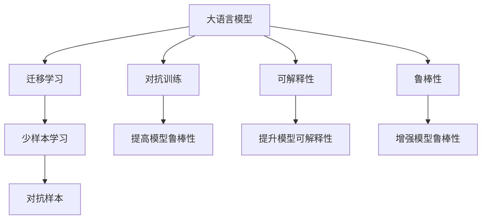

                 

# 语言与思维的差异：大模型的认知困惑

## 1. 背景介绍

### 1.1 问题由来
随着人工智能技术的发展，大语言模型（Large Language Models, LLMs）如BERT、GPT-3等在自然语言处理（Natural Language Processing, NLP）领域取得了显著进展。这些模型基于大规模文本数据的预训练，展现了强大的语言理解和生成能力。然而，这些模型在理解和运用语言过程中，也显现出了与人类认知差异的一面，引发了广泛关注和讨论。

### 1.2 问题核心关键点
大语言模型的认知困惑主要表现在以下几个方面：
- **语言的理解深度**：模型是否能理解语言的复杂性，包括多义性、隐喻、语境依赖等。
- **知识与常识**：模型是否具备人类般广泛的常识和背景知识，能够合理推理和解释。
- **逻辑推理**：模型是否能够进行逻辑推理，解决复杂的推理问题。
- **创造性思维**：模型是否具备创造性，能够生成新颖、有意义的内容。
- **伦理与安全性**：模型是否能够遵守伦理规范，避免有害信息传播。

这些问题在大语言模型中的应用场景中尤为凸显，如智能客服、金融舆情分析、内容生成等。

## 2. 核心概念与联系

### 2.1 核心概念概述

要深入理解大语言模型认知困惑的本质，需先了解以下核心概念：

- **大语言模型**：通过大规模无标签文本数据的预训练，学习通用的语言表示，具备强大的语言理解和生成能力。
- **迁移学习**：将一个领域学习到的知识，迁移应用到另一个不同但相关的领域，通过微调实现。
- **少样本学习**：在仅有少量样本的情况下，模型能快速适应新任务，如提示学习（Prompt Learning）。
- **对抗样本**：通过微小扰动输入，使模型输出错误，揭示模型漏洞。
- **可解释性**：模型输出应具备可解释性，便于理解和调试。
- **鲁棒性**：模型对输入的微小变化不敏感，能稳定输出。

这些概念之间相互联系，共同构成了大语言模型认知困惑的研究框架。

### 2.2 概念间的关系

这些核心概念通过Mermaid流程图展示其内在联系：



这个流程图展示了各个概念间的关系和作用：

1. 大语言模型通过迁移学习适应新任务，同时少样本学习和对抗样本用于增强模型的泛化能力和鲁棒性。
2. 对抗训练和鲁棒性提升模型对抗微小扰动的能力。
3. 可解释性有助于理解和调试模型，提升模型可信度。

## 3. 核心算法原理 & 具体操作步骤

### 3.1 算法原理概述

大语言模型认知困惑的核心算法原理是通过有监督微调方法，提升模型在特定任务上的表现。微调过程中，模型对下游任务的少量标注数据进行学习，优化模型参数，使其能够更好地适应新任务。

### 3.2 算法步骤详解

#### 3.2.1 数据准备

1. **收集数据集**：针对具体任务，收集标注数据集，如对话数据、情感分析数据等。
2. **数据预处理**：清洗数据，去除噪声，标准化格式。

#### 3.2.2 模型选择与适配

1. **选择预训练模型**：选择适合任务的大语言模型，如BERT、GPT等。
2. **添加任务适配层**：根据任务类型，添加相应的输出层和损失函数。

#### 3.2.3 微调过程

1. **设定超参数**：如学习率、批大小、迭代轮数等。
2. **训练与评估**：
   - 训练：将数据集划分为训练集、验证集和测试集，通过前向传播计算损失，反向传播更新模型参数。
   - 评估：在验证集上评估模型性能，调整学习率或早停策略。
   - 测试：在测试集上评估模型最终性能。

### 3.3 算法优缺点

#### 3.3.1 优点

- **效率高**：基于监督学习的微调方法，仅需少量标注数据，即可快速适应新任务。
- **效果好**：能在新任务上获得显著性能提升。
- **可扩展性强**：适用于多种NLP任务，如问答、对话、摘要等。

#### 3.3.2 缺点

- **数据依赖强**：微调效果依赖标注数据的质量和数量。
- **泛化能力有限**：模型在特定任务上表现优异，但在不同任务间泛化能力可能不足。
- **伦理与安全问题**：模型可能输出有害信息，违背伦理规范。

### 3.4 算法应用领域

大语言模型认知困惑的算法应用领域广泛，主要包括以下几个方面：

- **智能客服**：通过对话数据微调，使机器人能够自然对话，回答客户咨询。
- **金融舆情分析**：对新闻、评论等文本进行情感分析，监测市场动向。
- **内容生成**：生成新闻、文章、广告等文本内容。
- **推荐系统**：通过用户行为数据，推荐相关商品或内容。

## 4. 数学模型和公式 & 详细讲解

### 4.1 数学模型构建

大语言模型认知困惑的数学模型构建主要包括以下步骤：

1. **选择预训练模型**：如BERT、GPT等。
2. **定义损失函数**：根据具体任务，如分类任务使用交叉熵损失。
3. **微调目标**：最小化损失函数，优化模型参数。

### 4.2 公式推导过程

#### 4.2.1 交叉熵损失函数

假设模型在输入 $x$ 上的输出为 $\hat{y}$，真实标签为 $y$，则交叉熵损失函数为：

$$
\ell(M_{\theta}(x), y) = -\log M_{\theta}(x)^{y}
$$

其中 $M_{\theta}(x)$ 为模型在输入 $x$ 上的输出，$y$ 为真实标签。

#### 4.2.2 反向传播

通过反向传播算法，计算模型参数 $\theta$ 的梯度：

$$
\frac{\partial \ell}{\partial \theta} = \frac{\partial \log M_{\theta}(x)}{\partial \theta} \cdot y
$$

其中 $\frac{\partial \log M_{\theta}(x)}{\partial \theta}$ 为对数概率输出对参数 $\theta$ 的梯度，$y$ 为真实标签。

### 4.3 案例分析与讲解

以情感分析为例，展示如何构建数学模型：

1. **数据准备**：收集标注数据集，如电影评论数据集。
2. **模型选择**：选择BERT作为预训练模型。
3. **损失函数**：使用二元交叉熵损失，输出为情感分类概率。
4. **微调过程**：通过反向传播更新模型参数，最小化损失函数。

## 5. 项目实践：代码实例和详细解释说明

### 5.1 开发环境搭建

1. **安装Python环境**：使用Anaconda或Miniconda安装Python。
2. **安装相关库**：安装PyTorch、Transformers、TensorBoard等库。

### 5.2 源代码详细实现

以下是一个简单的情感分析任务微调示例：

```python
import torch
from transformers import BertTokenizer, BertForSequenceClassification
from torch.utils.data import Dataset, DataLoader

class MovieReviewDataset(Dataset):
    def __init__(self, texts, labels):
        self.texts = texts
        self.labels = labels
        self.tokenizer = BertTokenizer.from_pretrained('bert-base-uncased')
        self.max_len = 256
    
    def __len__(self):
        return len(self.texts)
    
    def __getitem__(self, idx):
        text = self.texts[idx]
        label = self.labels[idx]
        
        encoding = self.tokenizer(text, max_length=self.max_len, truncation=True, padding='max_length', return_tensors='pt')
        input_ids = encoding['input_ids']
        attention_mask = encoding['attention_mask']
        labels = torch.tensor(label, dtype=torch.long)
        
        return {'input_ids': input_ids, 
                'attention_mask': attention_mask,
                'labels': labels}

# 数据准备
train_dataset = MovieReviewDataset(train_texts, train_labels)
dev_dataset = MovieReviewDataset(dev_texts, dev_labels)
test_dataset = MovieReviewDataset(test_texts, test_labels)

# 模型选择与适配
model = BertForSequenceClassification.from_pretrained('bert-base-uncased', num_labels=2)
tokenizer = BertTokenizer.from_pretrained('bert-base-uncased')

# 训练与评估
device = torch.device('cuda' if torch.cuda.is_available() else 'cpu')
model.to(device)

optimizer = torch.optim.Adam(model.parameters(), lr=2e-5)
epochs = 5
batch_size = 16

for epoch in range(epochs):
    model.train()
    train_loss = 0
    train_correct = 0
    for batch in DataLoader(train_dataset, batch_size=batch_size, shuffle=True):
        input_ids = batch['input_ids'].to(device)
        attention_mask = batch['attention_mask'].to(device)
        labels = batch['labels'].to(device)
        model.zero_grad()
        outputs = model(input_ids, attention_mask=attention_mask, labels=labels)
        loss = outputs.loss
        train_loss += loss.item()
        preds = outputs.logits.argmax(dim=1)
        train_correct += (preds == labels).sum().item()
        loss.backward()
        optimizer.step()
    
    train_acc = train_correct / len(train_dataset)

    model.eval()
    dev_loss = 0
    dev_correct = 0
    with torch.no_grad():
        for batch in DataLoader(dev_dataset, batch_size=batch_size):
            input_ids = batch['input_ids'].to(device)
            attention_mask = batch['attention_mask'].to(device)
            labels = batch['labels'].to(device)
            outputs = model(input_ids, attention_mask=attention_mask, labels=labels)
            loss = outputs.loss
            dev_loss += loss.item()
            preds = outputs.logits.argmax(dim=1)
            dev_correct += (preds == labels).sum().item()
    
    dev_acc = dev_correct / len(dev_dataset)

print(f"Epoch {epoch+1}, train loss: {train_loss/len(train_dataset):.4f}, train acc: {train_acc:.4f}, dev loss: {dev_loss/len(dev_dataset):.4f}, dev acc: {dev_acc:.4f}")
```

### 5.3 代码解读与分析

- **数据处理**：定义`MovieReviewDataset`类，实现数据处理和标准化。
- **模型选择**：选择BERT作为预训练模型，并根据任务适配输出层。
- **训练与评估**：通过PyTorch实现模型训练和评估，使用Adam优化器进行梯度更新。
- **结果展示**：在训练集和验证集上分别计算损失和准确率，展示训练效果。

## 6. 实际应用场景

### 6.4 未来应用展望

随着大语言模型认知困惑研究的深入，其在以下几个方面具有广阔应用前景：

- **智能客服**：通过对话数据微调，使客服机器人更自然地理解用户需求，提供个性化服务。
- **金融舆情分析**：利用多模态数据，分析市场情绪，预测风险。
- **内容生成**：结合知识图谱，生成高质量文章、报告等。
- **推荐系统**：通过用户行为数据，推荐个性化商品、服务。

## 7. 工具和资源推荐

### 7.1 学习资源推荐

1. **《自然语言处理综论》**：介绍NLP的基本概念和算法，适合初学者。
2. **《深度学习与自然语言处理》**：讲解深度学习在NLP中的应用，详细介绍了BERT等大模型的原理和实现。
3. **《人工智能导论》**：涵盖人工智能的多个领域，包括NLP、机器学习等，适合全面了解。

### 7.2 开发工具推荐

1. **PyTorch**：常用的深度学习框架，支持动态计算图，适合研究开发。
2. **TensorFlow**：由Google开发的深度学习框架，支持分布式训练和生产部署。
3. **Transformers**：开源的NLP库，提供预训练模型和微调工具。
4. **TensorBoard**：可视化工具，方便监控和调试模型训练过程。

### 7.3 相关论文推荐

1. **《BERT: Pre-training of Deep Bidirectional Transformers for Language Understanding》**：提出BERT模型，引入掩码语言模型预训练任务。
2. **《GPT-3: Language Models are Unsupervised Multitask Learners》**：展示GPT-3的零样本学习能力，推动大语言模型研究。
3. **《AdaLoRA: Adaptive Low-Rank Adaptation for Parameter-Efficient Fine-Tuning》**：提出AdaLoRA方法，实现参数高效微调。

## 8. 总结：未来发展趋势与挑战

### 8.1 研究成果总结

本文系统介绍了大语言模型认知困惑的原理和操作步骤，详细讲解了微调方法的数学模型和代码实现。通过案例分析和实际应用，展示了微调方法在NLP领域的广泛应用前景。

### 8.2 未来发展趋势

未来大语言模型认知困惑的发展趋势包括：

1. **模型规模继续增大**：预训练模型参数量将持续增长，提升模型的表示能力。
2. **数据需求降低**：利用少样本学习和提示学习，减少对标注数据的依赖。
3. **多模态融合**：结合视觉、语音等多模态信息，提升模型性能。
4. **对抗样本研究**：研究对抗训练方法，增强模型的鲁棒性。
5. **可解释性增强**：开发可解释性模型，提升透明度和可信度。

### 8.3 面临的挑战

大语言模型认知困惑在实际应用中面临以下挑战：

1. **数据获取困难**：许多任务缺乏大规模标注数据。
2. **泛化能力不足**：模型在特定任务上表现优异，但跨领域泛化能力有限。
3. **伦理与安全问题**：模型可能输出有害信息，需加强监管。
4. **计算资源消耗大**：模型参数量庞大，计算资源消耗大。
5. **可解释性不足**：模型黑盒特性，难以解释推理过程。

### 8.4 研究展望

未来研究需关注以下几个方面：

1. **无监督和半监督微调**：降低对标注数据的依赖，利用自监督学习。
2. **参数高效微调**：优化模型结构和训练过程，提升微调效率。
3. **多模态融合**：结合视觉、语音等多模态数据，提升模型的通用性。
4. **伦理与安全性**：研究模型输出和数据隐私的保护。
5. **可解释性**：开发可解释性模型，提升透明度和可信度。

## 9. 附录：常见问题与解答

**Q1: 大语言模型认知困惑的主要表现是什么？**

A: 主要表现包括语言的理解深度、知识与常识、逻辑推理、创造性思维、伦理与安全问题。

**Q2: 大语言模型认知困惑的解决方法有哪些？**

A: 解决方法包括数据增强、正则化、对抗训练、参数高效微调、多模态融合、伦理与安全约束。

**Q3: 如何提升大语言模型的可解释性？**

A: 提升可解释性需要开发可解释性模型，利用可视化工具展示模型内部工作机制，结合符号化知识库，提供详细的推理过程。

---

作者：禅与计算机程序设计艺术 / Zen and the Art of Computer Programming

