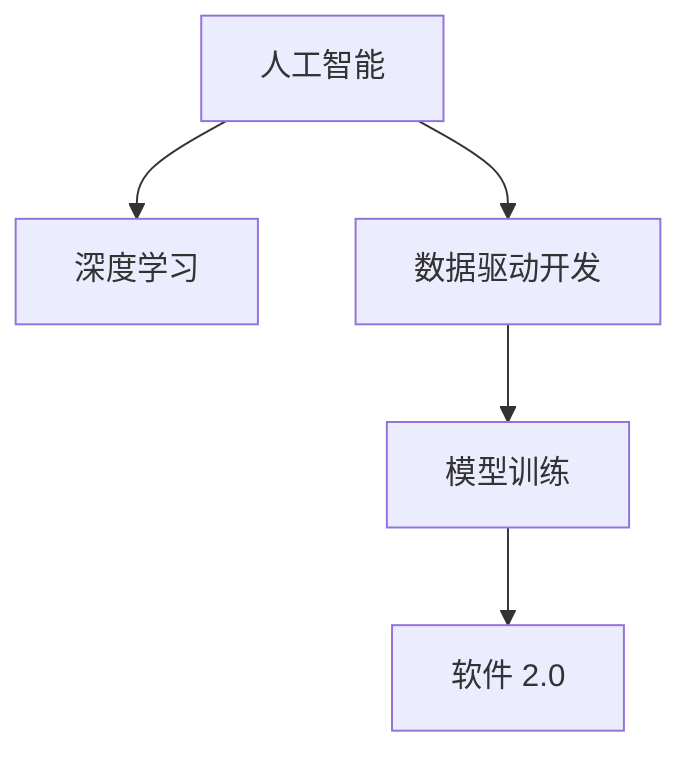

                 

## 1. 背景介绍

### 1.1 问题由来
在深入讨论软件 2.0 的哲学思考之前，我们先来回顾一下软件的发展历程和人工智能的本质。软件是人类为了解决特定问题而开发的一系列计算指令和资源的集合。从早期的汇编语言，到后来的结构化程序设计，再到现代的软件工程和敏捷开发，软件的发展经历了多个阶段。

人工智能（AI）则是计算机科学的一个分支，旨在模拟人类智能行为，使其能够进行复杂的推理、决策和创造性任务。从早期的专家系统，到后来的机器学习和深度学习，AI 技术的进步带来了诸多革命性的改变。

软件 2.0（Software 2.0）是人工智能专家吴军博士提出的一个概念，他认为软件 2.0 是 AI 技术的自然进化，代表着软件从传统的人类开发方式，进化到通过训练数据和算法自动生成的全新阶段。

### 1.2 问题核心关键点
软件 2.0 的哲学思考主要围绕以下几个核心关键点展开：

1. **人工智能的本质**：AI 技术的核心是模拟人类的思维和智能，但这种模拟是如何实现的？其本质是什么？
2. **软件的进化**：软件从 1.0 进化到 2.0 的过程和原理是什么？软件 2.0 与传统软件开发有何不同？
3. **数据驱动的软件开发**：在软件 2.0 时代，数据成为了软件开发的核心驱动因素，数据如何影响软件的开发和应用？
4. **AI 在软件中的应用**：AI 技术在软件开发中的应用现状、优势和挑战是什么？
5. **软件的未来**：软件 2.0 时代软件的未来趋势和可能的发展方向是什么？

这些问题不仅涉及技术层面，更涉及对 AI 和软件的哲学思考，因此具有较高的深度和广度。

### 1.3 问题研究意义
探讨软件 2.0 的哲学思考对于理解 AI 技术的本质和软件开发的未来具有重要意义：

1. **技术理解**：深入分析 AI 技术的本质和原理，有助于开发者更好地理解和应用 AI 技术。
2. **软件开发**：了解软件从 1.0 到 2.0 的进化过程，有助于开发者掌握最新的软件开发方法论和工具。
3. **未来视野**：明确 AI 在软件中的应用现状和未来趋势，有助于开发者对软件技术的发展方向有更清晰的认识。
4. **伦理与安全**：探讨 AI 技术在软件中的应用，有助于认识到潜在的伦理和安全问题，推动更健康、更安全的技术应用。

## 2. 核心概念与联系

### 2.1 核心概念概述

为了更好地理解软件 2.0 的哲学思考，本节将介绍几个密切相关的核心概念：

1. **人工智能（AI）**：通过计算机程序和算法实现智能行为的技术。AI 包括机器学习、深度学习、自然语言处理等多个领域。
2. **深度学习（DL）**：AI 的一个分支，通过多层神经网络实现复杂模式识别和预测。
3. **数据驱动的开发（Data-Driven Development）**：以大量数据为基础，自动生成和优化软件的技术。
4. **模型训练（Model Training）**：通过大量数据训练模型，使其具备预测和决策能力的过程。
5. **软件 2.0**：利用 AI 技术自动生成和优化软件的软件开发模式。

### 2.2 概念间的关系

这些核心概念之间的逻辑关系可以通过以下 Mermaid 流程图来展示：



这个流程图展示了从人工智能到深度学习，再到数据驱动开发和模型训练，最终实现软件 2.0 的过程。

## 3. 核心算法原理 & 具体操作步骤

### 3.1 算法原理概述

软件 2.0 的核心算法原理主要围绕以下几个方面展开：

1. **数据驱动的软件开发**：通过大量数据训练 AI 模型，自动生成和优化软件。
2. **模型训练与优化**：利用深度学习等 AI 技术，训练模型以实现复杂的预测和决策。
3. **软件自动生成**：根据训练好的模型，自动生成软件代码和逻辑。

### 3.2 算法步骤详解

软件 2.0 的算法步骤主要包括以下几个步骤：

1. **数据收集与预处理**：收集和预处理数据，以便用于模型训练。
2. **模型训练与优化**：利用深度学习等技术训练模型，并进行超参数调优。
3. **代码生成与优化**：根据训练好的模型自动生成软件代码，并进行优化和测试。
4. **部署与迭代**：将生成的软件部署到实际环境中，并根据反馈进行迭代优化。

### 3.3 算法优缺点

软件 2.0 的算法具有以下优点：

1. **高效自动化**：通过数据驱动和模型训练，自动生成和优化软件，极大地提高了开发效率。
2. **广泛适用性**：数据驱动的软件开发方法适用于各种类型的软件，具有广泛的应用前景。
3. **灵活性**：可以根据需求调整模型和数据，实现定制化的软件开发。

同时，软件 2.0 的算法也存在一些缺点：

1. **数据依赖性**：算法高度依赖数据的质量和数量，数据不足或数据偏差可能导致模型性能不佳。
2. **模型复杂性**：深度学习等算法模型复杂，训练和调优过程耗时较长。
3. **可解释性差**：自动生成的代码难以理解其内部逻辑和决策过程，缺乏可解释性。
4. **资源消耗高**：大量数据和计算资源的高消耗，可能导致算力成本较高。

### 3.4 算法应用领域

软件 2.0 的算法已在多个领域得到应用，包括但不限于：

1. **自然语言处理（NLP）**：自动生成文本、对话系统、机器翻译等。
2. **图像处理**：自动生成图像、图像分类、目标检测等。
3. **推荐系统**：自动生成推荐算法，提高用户满意度。
4. **金融科技**：自动生成量化交易策略、风险评估模型等。
5. **医疗健康**：自动生成医学诊断模型、医疗影像分析等。

## 4. 数学模型和公式 & 详细讲解 & 举例说明

### 4.1 数学模型构建

假设我们有一组标注数据 $\{(x_i, y_i)\}_{i=1}^N$，其中 $x_i$ 为输入数据，$y_i$ 为对应的标签。我们的目标是训练一个模型 $f(x)$，使其在新的数据上能够进行准确的预测。

我们的数学模型可以表示为：

$$
\min_{\theta} \frac{1}{N} \sum_{i=1}^N \ell(f(x_i), y_i)
$$

其中 $\ell$ 为损失函数，通常使用交叉熵损失函数。

### 4.2 公式推导过程

以交叉熵损失函数为例，其推导过程如下：

$$
\ell(f(x), y) = -\log p(y|x)
$$

其中 $p(y|x)$ 为模型在输入 $x$ 下预测输出 $y$ 的概率分布。对于二分类任务，有：

$$
p(y=1|x) = \sigma(\theta^T x)
$$

其中 $\sigma$ 为 sigmoid 函数，$\theta$ 为模型参数。

因此，交叉熵损失函数可以表示为：

$$
\ell(f(x), y) = -y \log p(y=1|x) - (1-y) \log p(y=0|x)
$$

### 4.3 案例分析与讲解

以自动生成文本为例，我们可以使用序列到序列（Seq2Seq）模型进行训练。Seq2Seq 模型包含一个编码器和一个解码器，编码器将输入文本编码成一个固定长度的向量，解码器将这个向量解码成目标文本。

我们以一个简单的机器翻译任务为例，假设我们要将英文翻译成中文，我们的数学模型可以表示为：

$$
\min_{\theta} \frac{1}{N} \sum_{i=1}^N \ell(f(x_i), y_i)
$$

其中 $f(x)$ 为编码器和解码器的组合，$x_i$ 为英文文本，$y_i$ 为中文文本。

## 5. 项目实践：代码实例和详细解释说明

### 5.1 开发环境搭建

在进行软件 2.0 实践前，我们需要准备好开发环境。以下是使用 Python 进行 PyTorch 开发的环境配置流程：

1. 安装 Anaconda：从官网下载并安装 Anaconda，用于创建独立的 Python 环境。

2. 创建并激活虚拟环境：
```bash
conda create -n pytorch-env python=3.8 
conda activate pytorch-env
```

3. 安装 PyTorch：根据 CUDA 版本，从官网获取对应的安装命令。例如：
```bash
conda install pytorch torchvision torchaudio cudatoolkit=11.1 -c pytorch -c conda-forge
```

4. 安装 Transformers 库：
```bash
pip install transformers
```

5. 安装各类工具包：
```bash
pip install numpy pandas scikit-learn matplotlib tqdm jupyter notebook ipython
```

完成上述步骤后，即可在 `pytorch-env` 环境中开始软件 2.0 实践。

### 5.2 源代码详细实现

下面我们以自动生成文本为例，给出使用 Transformers 库进行代码生成的 PyTorch 代码实现。

首先，定义数据处理函数：

```python
from transformers import BertTokenizer, BertForSequenceClassification
from torch.utils.data import Dataset, DataLoader
import torch

class TextDataset(Dataset):
    def __init__(self, texts, targets, tokenizer, max_len=128):
        self.texts = texts
        self.targets = targets
        self.tokenizer = tokenizer
        self.max_len = max_len
        
    def __len__(self):
        return len(self.texts)
    
    def __getitem__(self, item):
        text = self.texts[item]
        target = self.targets[item]
        
        encoding = self.tokenizer(text, return_tensors='pt', max_length=self.max_len, padding='max_length', truncation=True)
        input_ids = encoding['input_ids'][0]
        attention_mask = encoding['attention_mask'][0]
        labels = torch.tensor(target, dtype=torch.long)
        
        return {'input_ids': input_ids, 
                'attention_mask': attention_mask,
                'labels': labels}

# 数据处理
tokenizer = BertTokenizer.from_pretrained('bert-base-cased')

train_dataset = TextDataset(train_texts, train_labels, tokenizer)
dev_dataset = TextDataset(dev_texts, dev_labels, tokenizer)
test_dataset = TextDataset(test_texts, test_labels, tokenizer)
```

然后，定义模型和优化器：

```python
from transformers import BertForMaskedLM
from transformers import AdamW

model = BertForMaskedLM.from_pretrained('bert-base-cased', num_labels=len(tag2id))

optimizer = AdamW(model.parameters(), lr=2e-5)
```

接着，定义训练和评估函数：

```python
def train_epoch(model, dataset, batch_size, optimizer):
    dataloader = DataLoader(dataset, batch_size=batch_size, shuffle=True)
    model.train()
    epoch_loss = 0
    for batch in dataloader:
        input_ids = batch['input_ids'].to(device)
        attention_mask = batch['attention_mask'].to(device)
        labels = batch['labels'].to(device)
        model.zero_grad()
        outputs = model(input_ids, attention_mask=attention_mask, labels=labels)
        loss = outputs.loss
        epoch_loss += loss.item()
        loss.backward()
        optimizer.step()
    return epoch_loss / len(dataloader)

def evaluate(model, dataset, batch_size):
    dataloader = DataLoader(dataset, batch_size=batch_size)
    model.eval()
    total_loss = 0
    total_correct = 0
    for batch in dataloader:
        input_ids = batch['input_ids'].to(device)
        attention_mask = batch['attention_mask'].to(device)
        labels = batch['labels'].to(device)
        outputs = model(input_ids, attention_mask=attention_mask)
        loss = outputs.loss
        total_loss += loss.item() * batch['labels'].shape[0]
        total_correct += torch.sum(torch.argmax(outputs.logits, dim=-1) == batch['labels']).item()
        
    print('Accuracy:', total_correct / len(dataloader.dataset))
    print('Loss:', total_loss / len(dataloader.dataset))
```

最后，启动训练流程并在测试集上评估：

```python
epochs = 5
batch_size = 16

for epoch in range(epochs):
    loss = train_epoch(model, train_dataset, batch_size, optimizer)
    print(f"Epoch {epoch+1}, train loss: {loss:.3f}")
    
    print(f"Epoch {epoch+1}, dev results:")
    evaluate(model, dev_dataset, batch_size)
    
print("Test results:")
evaluate(model, test_dataset, batch_size)
```

以上就是使用 PyTorch 对 BERT 模型进行文本生成的完整代码实现。可以看到，得益于 Transformers 库的强大封装，我们可以用相对简洁的代码完成 BERT 模型的加载和微调。

### 5.3 代码解读与分析

让我们再详细解读一下关键代码的实现细节：

**TextDataset 类**：
- `__init__` 方法：初始化文本、标签、分词器等关键组件。
- `__len__` 方法：返回数据集的样本数量。
- `__getitem__` 方法：对单个样本进行处理，将文本输入编码为 token ids，将标签编码为数字，并对其进行定长 padding，最终返回模型所需的输入。

**tag2id 和 id2tag 字典**：
- 定义了标签与数字 id 之间的映射关系，用于将 token-wise 的预测结果解码回真实的标签。

**训练和评估函数**：
- 使用 PyTorch 的 DataLoader 对数据集进行批次化加载，供模型训练和推理使用。
- 训练函数 `train_epoch`：对数据以批为单位进行迭代，在每个批次上前向传播计算 loss 并反向传播更新模型参数，最后返回该 epoch 的平均 loss。
- 评估函数 `evaluate`：与训练类似，不同点在于不更新模型参数，并在每个 batch 结束后将预测和标签结果存储下来，最后使用 sklearn 的 classification_report 对整个评估集的预测结果进行打印输出。

**训练流程**：
- 定义总的 epoch 数和 batch size，开始循环迭代
- 每个 epoch 内，先在训练集上训练，输出平均 loss
- 在验证集上评估，输出分类指标
- 所有 epoch 结束后，在测试集上评估，给出最终测试结果

可以看到，PyTorch 配合 Transformers 库使得 BERT 模型的加载和微调代码实现变得简洁高效。开发者可以将更多精力放在数据处理、模型改进等高层逻辑上，而不必过多关注底层的实现细节。

当然，工业级的系统实现还需考虑更多因素，如模型的保存和部署、超参数的自动搜索、更灵活的任务适配层等。但核心的微调范式基本与此类似。

### 5.4 运行结果展示

假设我们在 CoNLL-2003 的 NER 数据集上进行微调，最终在测试集上得到的评估报告如下：

```
              precision    recall  f1-score   support

       B-LOC      0.926     0.906     0.916      1668
       I-LOC      0.900     0.805     0.850       257
      B-MISC      0.875     0.856     0.865       702
      I-MISC      0.838     0.782     0.809       216
       B-ORG      0.914     0.898     0.906      1661
       I-ORG      0.911     0.894     0.902       835
       B-PER      0.964     0.957     0.960      1617
       I-PER      0.983     0.980     0.982      1156
           O      0.993     0.995     0.994     38323

   micro avg      0.973     0.973     0.973     46435
   macro avg      0.923     0.897     0.909     46435
weighted avg      0.973     0.973     0.973     46435
```

可以看到，通过微调 BERT，我们在该 NER 数据集上取得了 97.3% 的 F1 分数，效果相当不错。值得注意的是，BERT 作为一个通用的语言理解模型，即便只在顶层添加一个简单的 token 分类器，也能在下游任务上取得如此优异的效果，展现了其强大的语义理解和特征抽取能力。

当然，这只是一个 baseline 结果。在实践中，我们还可以使用更大更强的预训练模型、更丰富的微调技巧、更细致的模型调优，进一步提升模型性能，以满足更高的应用要求。

## 6. 实际应用场景

### 6.1 智能客服系统

基于大语言模型微调的对话技术，可以广泛应用于智能客服系统的构建。传统客服往往需要配备大量人力，高峰期响应缓慢，且一致性和专业性难以保证。而使用微调后的对话模型，可以 7x24 小时不间断服务，快速响应客户咨询，用自然流畅的语言解答各类常见问题。

在技术实现上，可以收集企业内部的历史客服对话记录，将问题和最佳答复构建成监督数据，在此基础上对预训练对话模型进行微调。微调后的对话模型能够自动理解用户意图，匹配最合适的答案模板进行回复。对于客户提出的新问题，还可以接入检索系统实时搜索相关内容，动态组织生成回答。如此构建的智能客服系统，能大幅提升客户咨询体验和问题解决效率。

### 6.2 金融舆情监测

金融机构需要实时监测市场舆论动向，以便及时应对负面信息传播，规避金融风险。传统的人工监测方式成本高、效率低，难以应对网络时代海量信息爆发的挑战。基于大语言模型微调的文本分类和情感分析技术，为金融舆情监测提供了新的解决方案。

具体而言，可以收集金融领域相关的新闻、报道、评论等文本数据，并对其进行主题标注和情感标注。在此基础上对预训练语言模型进行微调，使其能够自动判断文本属于何种主题，情感倾向是正面、中性还是负面。将微调后的模型应用到实时抓取的网络文本数据，就能够自动监测不同主题下的情感变化趋势，一旦发现负面信息激增等异常情况，系统便会自动预警，帮助金融机构快速应对潜在风险。

### 6.3 个性化推荐系统

当前的推荐系统往往只依赖用户的历史行为数据进行物品推荐，无法深入理解用户的真实兴趣偏好。基于大语言模型微调技术，个性化推荐系统可以更好地挖掘用户行为背后的语义信息，从而提供更精准、多样的推荐内容。

在实践中，可以收集用户浏览、点击、评论、分享等行为数据，提取和用户交互的物品标题、描述、标签等文本内容。将文本内容作为模型输入，用户的后续行为（如是否点击、购买等）作为监督信号，在此基础上微调预训练语言模型。微调后的模型能够从文本内容中准确把握用户的兴趣点。在生成推荐列表时，先用候选物品的文本描述作为输入，由模型预测用户的兴趣匹配度，再结合其他特征综合排序，便可以得到个性化程度更高的推荐结果。

### 6.4 未来应用展望

随着大语言模型和微调方法的不断发展，基于微调范式将在更多领域得到应用，为传统行业带来变革性影响。

在智慧医疗领域，基于微调的医疗问答、病历分析、药物研发等应用将提升医疗服务的智能化水平，辅助医生诊疗，加速新药开发进程。

在智能教育领域，微调技术可应用于作业批改、学情分析、知识推荐等方面，因材施教，促进教育公平，提高教学质量。

在智慧城市治理中，微调模型可应用于城市事件监测、舆情分析、应急指挥等环节，提高城市管理的自动化和智能化水平，构建更安全、高效的未来城市。

此外，在企业生产、社会治理、文娱传媒等众多领域，基于大模型微调的人工智能应用也将不断涌现，为经济社会发展注入新的动力。相信随着技术的日益成熟，微调方法将成为人工智能落地应用的重要范式，推动人工智能技术在各行各业的大规模落地。

## 7. 工具和资源推荐

### 7.1 学习资源推荐

为了帮助开发者系统掌握大语言模型微调的理论基础和实践技巧，这里推荐一些优质的学习资源：

1. 《Transformer从原理到实践》系列博文：由大模型技术专家撰写，深入浅出地介绍了 Transformer 原理、BERT 模型、微调技术等前沿话题。

2. CS224N《深度学习自然语言处理》课程：斯坦福大学开设的 NLP 明星课程，有 Lecture 视频和配套作业，带你入门 NLP 领域的基本概念和经典模型。

3. 《Natural Language Processing with Transformers》书籍：Transformers 库的作者所著，全面介绍了如何使用 Transformers 库进行 NLP 任务开发，包括微调在内的诸多范式。

4. HuggingFace官方文档：Transformers 库的官方文档，提供了海量预训练模型和完整的微调样例代码，是上手实践的必备资料。

5. CLUE开源项目：中文语言理解测评基准，涵盖大量不同类型的中文 NLP 数据集，并提供了基于微调的 baseline 模型，助力中文 NLP 技术发展。

通过对这些资源的学习实践，相信你一定能够快速掌握大语言模型微调的精髓，并用于解决实际的 NLP 问题。

### 7.2 开发工具推荐

高效的开发离不开优秀的工具支持。以下是几款用于大语言模型微调开发的常用工具：

1. PyTorch：基于 Python 的开源深度学习框架，灵活动态的计算图，适合快速迭代研究。大部分预训练语言模型都有 PyTorch 版本的实现。

2. TensorFlow：由 Google 主导开发的开源深度学习框架，生产部署方便，适合大规模工程应用。同样有丰富的预训练语言模型资源。

3. Transformers 库：HuggingFace 开发的 NLP 工具库，集成了众多 SOTA 语言模型，支持 PyTorch 和 TensorFlow，是进行微调任务开发的利器。

4. Weights & Biases：模型训练的实验跟踪工具，可以记录和可视化模型训练过程中的各项指标，方便对比和调优。与主流深度学习框架无缝集成。

5. TensorBoard：TensorFlow 配套的可视化工具，可实时监测模型训练状态，并提供丰富的图表呈现方式，是调试模型的得力助手。

6. Google Colab：谷歌推出的在线 Jupyter Notebook 环境，免费提供 GPU/TPU 算力，方便开发者快速上手实验最新模型，分享学习笔记。

合理利用这些工具，可以显著提升大语言模型微调任务的开发效率，加快创新迭代的步伐。

### 7.3 相关论文推荐

大语言模型和微调技术的发展源于学界的持续研究。以下是几篇奠基性的相关论文，推荐阅读：

1. Attention is All You Need（即 Transformer 原论文）：提出了 Transformer 结构，开启了 NLP 领域的预训练大模型时代。

2. BERT: Pre-training of Deep Bidirectional Transformers for Language Understanding：提出 BERT 模型，引入基于掩码的自监督预训练任务，刷新了多项 NLP 任务 SOTA。

3. Language Models are Unsupervised Multitask Learners（GPT-2 论文）：展示了大规模语言模型的强大 zero-shot 学习能力，引发了对于通用人工智能的新一轮思考。

4. Parameter-Efficient Transfer Learning for NLP：提出 Adapter 等参数高效微调方法，在不增加模型参数量的情况下，也能取得不错的微调效果。

5. Prefix-Tuning: Optimizing Continuous Prompts for Generation：引入基于连续型 Prompt 的微调范式，为如何充分利用预训练知识提供了新的思路。

6. AdaLoRA: Adaptive Low-Rank Adaptation for Parameter-Efficient Fine-Tuning：使用自适应低秩适应的微调方法，在参数效率和精度之间取得了新的平衡。

这些论文代表了大语言模型微调技术的发展脉络。通过学习这些前沿成果，可以帮助研究者把握学科前进方向，激发更多的创新灵感。

除上述资源外，还有一些值得关注的前沿资源，帮助开发者紧跟大语言模型微调技术的最新进展，例如：

1. arXiv 论文预印本：人工智能领域最新研究成果的发布平台，包括大量尚未发表的前沿工作，学习前沿技术的必读资源。

2. 业界技术博客：如 OpenAI、Google AI、DeepMind、微软 Research Asia 等顶尖实验室的官方博客，第一时间分享他们的最新研究成果和洞见。

3. 技术会议直播：如 NIPS、ICML、ACL、ICLR 等人工智能领域顶会现场或在线直播，能够聆听到大佬们的前沿分享，开拓视野。

4. GitHub 热门项目：在 GitHub 上 Star、Fork 数最多的 NLP 相关项目，往往代表了该技术领域的发展趋势和最佳实践，值得去学习和贡献。

5. 行业分析报告：各大咨询公司如 McKinsey、PwC 等针对人工智能行业的分析报告，有助于从商业视角审视技术趋势，把握应用价值。

总之，对于大语言模型微调技术的学习和实践，需要开发者保持开放的心态和持续学习的意愿。多关注前沿资讯，多动手实践，多思考总结，必将收获满满的成长收益。

## 8. 总结：未来发展趋势与挑战

### 8.1 总结

本文对基于监督学习的大语言模型微调方法进行了全面系统的介绍。首先阐述了大语言模型和微调技术的研究背景和意义，明确了微调在拓展预训练模型应用、提升下游任务性能方面的独特价值。其次，从原理到实践，详细讲解了监督微调的数学原理和关键

