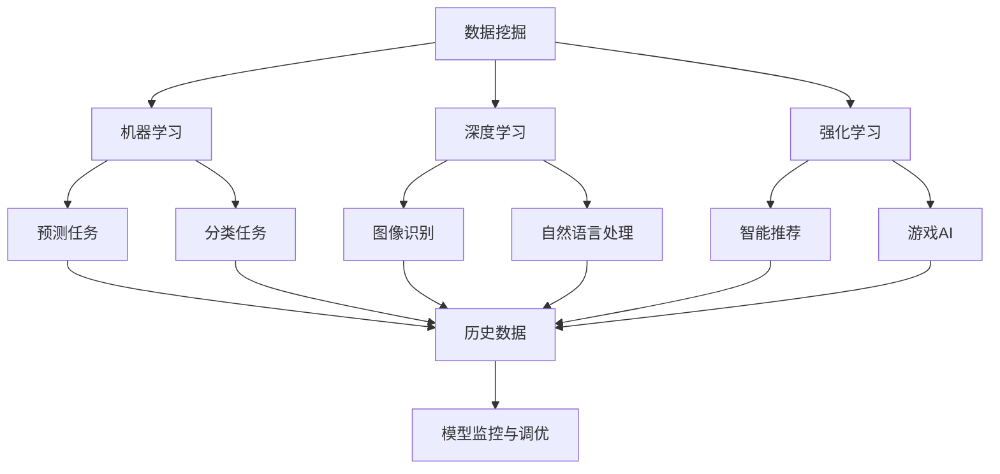
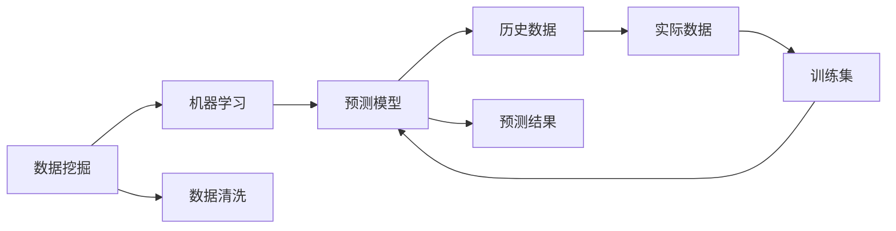
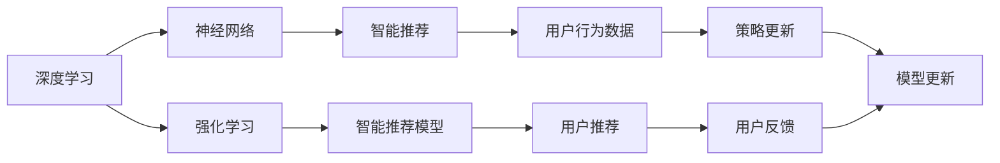
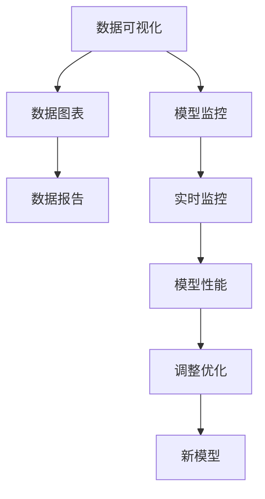
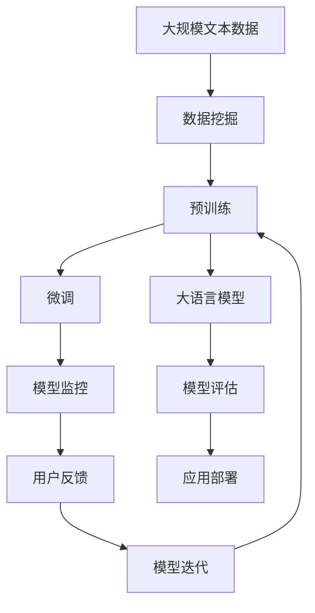

                 

# 软件 2.0 的应用：从实验室走向现实

## 1. 背景介绍

### 1.1 问题由来

21世纪初，随着计算机硬件和网络技术的迅猛发展，软件产业迎来了巨大的变革。从以数据为中心的1.0时代，迈向以软件为中心的2.0时代。软件2.0时代以数据驱动为主导，不断通过数据分析和算法优化，提升软件性能和用户体验。

随着大数据和人工智能技术的发展，越来越多的企业开始重视软件2.0的应用。从企业内部管理、运营，到外部市场扩展、客户服务，软件2.0技术已经渗透到各行各业。如何更好地应用软件2.0技术，使其在实际应用中发挥最大价值，成为摆在企业面前的重要课题。

### 1.2 问题核心关键点

软件2.0的核心是数据驱动，通过海量数据分析和算法优化，提升软件性能和用户体验。其核心关键点包括：

- 数据获取与处理：如何高效获取和处理海量数据，是软件2.0应用的基石。
- 算法选择与优化：如何选择合适的算法，并通过优化提升模型性能，是软件2.0应用的关键。
- 模型部署与监控：如何将训练好的模型高效部署，并实时监控模型性能，是软件2.0应用的保障。
- 用户反馈与迭代：如何利用用户反馈数据进行模型迭代优化，是软件2.0应用的持续动力。

### 1.3 问题研究意义

软件2.0技术的广泛应用，将大幅提升企业的运营效率和市场竞争力。具体表现在：

- 提升业务决策能力：通过数据分析，企业可以更准确地理解市场趋势和用户需求，做出更加科学的决策。
- 优化客户体验：通过算法优化，企业可以提供个性化的产品和服务，提升用户满意度。
- 降低运营成本：通过智能自动化，企业可以降低人力和时间成本，提高运营效率。
- 加速产品迭代：通过快速迭代，企业可以快速响应市场变化，及时调整产品策略。

## 2. 核心概念与联系

### 2.1 核心概念概述

为更好地理解软件2.0技术的应用，本节将介绍几个密切相关的核心概念：

- 数据挖掘：通过算法从数据中发现模式和知识，是软件2.0应用的基础。
- 机器学习：一种通过算法从数据中学习的技术，常用于软件2.0的预测和分类任务。
- 深度学习：一种特殊的机器学习算法，通过多层神经网络学习复杂模式，在软件2.0中常用于图像识别、自然语言处理等任务。
- 强化学习：通过与环境的交互，学习最优策略，常用于智能推荐、游戏AI等任务。
- 数据可视化：将数据转换为可视化图表，直观展示数据特点，常用于软件2.0的分析和展示。
- 模型监控与调优：实时监控模型性能，并通过调整优化模型参数，提升模型效果。

这些核心概念之间的逻辑关系可以通过以下Mermaid流程图来展示：



这个流程图展示了几大核心概念的关系：

1. 数据挖掘是软件2.0应用的基础，提供数据输入。
2. 机器学习和深度学习是从数据中学习知识的工具，常用于软件2.0的预测和分类任务。
3. 强化学习是通过环境交互学习最优策略，常用于智能推荐、游戏AI等任务。
4. 预测和分类任务是软件2.0的主要应用场景，涵盖历史数据、图像识别、自然语言处理等。
5. 模型监控与调优是软件2.0应用的保障，实时监控模型性能，并进行优化调整。

### 2.2 概念间的关系

这些核心概念之间存在着紧密的联系，形成了软件2.0技术应用的完整生态系统。下面我通过几个Mermaid流程图来展示这些概念之间的关系。

#### 2.2.1 数据挖掘与机器学习的关系



这个流程图展示了数据挖掘和机器学习的基本流程。数据挖掘负责从数据中提取有价值的信息，机器学习则通过学习这些信息，构建预测模型。

#### 2.2.2 深度学习与强化学习的关系



这个流程图展示了深度学习和强化学习的协作流程。深度学习构建智能推荐模型，强化学习通过与用户的互动，更新模型策略，实现更精准的推荐。

#### 2.2.3 数据可视化与模型监控的关系



这个流程图展示了数据可视化和模型监控的交互流程。数据可视化将数据转换为图表，直观展示模型性能，模型监控实时监控模型效果，并进行调整优化。

### 2.3 核心概念的整体架构

最后，我们用一个综合的流程图来展示这些核心概念在大语言模型微调过程中的整体架构：



这个综合流程图展示了从数据挖掘到模型部署的完整过程。大规模文本数据通过数据挖掘和预训练，得到基础大语言模型。然后通过微调适配特定任务，实时监控模型性能，并利用用户反馈进行迭代优化。最终通过部署应用，实现软件2.0技术的落地。

## 3. 核心算法原理 & 具体操作步骤
### 3.1 算法原理概述

软件2.0的核心算法原理是数据驱动，通过海量数据分析和算法优化，提升软件性能和用户体验。其基本流程如下：

1. 数据获取与处理：从各种渠道获取数据，并进行清洗、预处理，形成数据集。
2. 算法选择与训练：选择适当的算法，并通过训练构建模型。
3. 模型评估与调优：通过评估指标，评估模型性能，并进行调优。
4. 模型部署与应用：将训练好的模型部署到实际应用中，并进行实时监控和调优。

### 3.2 算法步骤详解

以下是软件2.0应用的详细操作步骤：

**Step 1: 数据获取与预处理**
- 确定数据来源，包括日志、事件、API调用等，获取数据。
- 对数据进行清洗和预处理，包括去重、异常值处理、缺失值填充等。
- 对数据进行特征工程，提取有用的特征，如时间戳、行为路径、点击率等。

**Step 2: 算法选择与训练**
- 根据任务类型，选择合适的算法，如回归、分类、聚类等。
- 对算法进行调参，选择最优超参数。
- 使用训练集对模型进行训练，调整模型参数。
- 在验证集上进行验证，评估模型性能。

**Step 3: 模型评估与调优**
- 在测试集上对模型进行测试，评估模型泛化性能。
- 根据测试结果，调整模型参数，进行模型调优。
- 重复上述步骤，直到模型性能达到最优。

**Step 4: 模型部署与应用**
- 将训练好的模型部署到生产环境。
- 对模型进行实时监控，评估模型性能。
- 根据监控结果，进行模型调优。
- 定期重新训练模型，更新模型参数，保持模型性能。

### 3.3 算法优缺点

软件2.0技术的优势在于其数据驱动的特点，可以快速响应市场变化和用户需求，提升软件性能和用户体验。具体优点包括：

1. 数据驱动：通过海量数据分析，发现数据中的模式和知识，提升模型性能。
2. 快速迭代：模型可以快速迭代优化，实时响应市场变化和用户需求。
3. 智能化决策：通过数据分析，提供科学的决策支持，提升业务决策能力。

但同时，软件2.0技术也存在一些局限性，包括：

1. 数据质量依赖：数据质量直接影响模型性能，数据获取和处理成本较高。
2. 算法选择复杂：选择合适的算法和超参数需要进行大量实验和调参。
3. 模型监控困难：模型部署后，实时监控和调优需要持续投入。
4. 用户反馈滞后：用户反馈数据获取和处理需要时间，模型迭代周期较长。

### 3.4 算法应用领域

软件2.0技术已经在多个领域得到了广泛应用，例如：

- 互联网推荐系统：通过分析用户行为数据，推荐个性化的产品和服务。
- 金融风控系统：通过分析交易数据，检测欺诈行为，提升风险控制能力。
- 营销分析系统：通过分析客户数据，进行市场细分和客户画像，提升营销效果。
- 智能客服系统：通过分析用户咨询数据，提供智能客服和个性化回答。
- 智能制造系统：通过分析生产数据，优化生产流程，提升生产效率。

除了上述这些经典应用外，软件2.0技术还在医疗、教育、物流等诸多领域，为各行各业带来深刻变革。随着技术的不断进步，相信软件2.0技术将在更多领域得到广泛应用，为企业的数字化转型提供强有力支持。

## 4. 数学模型和公式 & 详细讲解  
### 4.1 数学模型构建

本节将使用数学语言对软件2.0技术的应用进行更加严格的刻画。

记软件2.0任务的数据集为 $D=\{(x_i,y_i)\}_{i=1}^N$，其中 $x_i$ 为输入，$y_i$ 为标签。假设软件2.0模型为 $f_{\theta}(x)$，其中 $\theta$ 为模型参数。

定义模型 $f_{\theta}(x)$ 在数据样本 $(x,y)$ 上的损失函数为 $\ell(f_{\theta}(x),y)$，则在数据集 $D$ 上的经验风险为：

$$
\mathcal{L}(\theta) = \frac{1}{N} \sum_{i=1}^N \ell(f_{\theta}(x_i),y_i)
$$

软件2.0优化的目标是最小化经验风险，即找到最优参数：

$$
\theta^* = \mathop{\arg\min}_{\theta} \mathcal{L}(\theta)
$$

在实践中，我们通常使用基于梯度的优化算法（如SGD、Adam等）来近似求解上述最优化问题。设 $\eta$ 为学习率，$\lambda$ 为正则化系数，则参数的更新公式为：

$$
\theta \leftarrow \theta - \eta \nabla_{\theta}\mathcal{L}(\theta) - \eta\lambda\theta
$$

其中 $\nabla_{\theta}\mathcal{L}(\theta)$ 为损失函数对参数 $\theta$ 的梯度，可通过反向传播算法高效计算。

### 4.2 公式推导过程

以下我们以回归任务为例，推导最小二乘损失函数及其梯度的计算公式。

假设模型 $f_{\theta}(x)$ 在输入 $x$ 上的预测值为 $\hat{y}=f_{\theta}(x)$，真实标签为 $y$。则回归任务的损失函数定义为：

$$
\ell(f_{\theta}(x),y) = \frac{1}{2}(y-f_{\theta}(x))^2
$$

将其代入经验风险公式，得：

$$
\mathcal{L}(\theta) = \frac{1}{N} \sum_{i=1}^N \frac{1}{2}(y_i-f_{\theta}(x_i))^2
$$

根据链式法则，损失函数对参数 $\theta_k$ 的梯度为：

$$
\frac{\partial \mathcal{L}(\theta)}{\partial \theta_k} = -\frac{1}{N} \sum_{i=1}^N (y_i-f_{\theta}(x_i))\frac{\partial f_{\theta}(x_i)}{\partial \theta_k}
$$

在得到损失函数的梯度后，即可带入参数更新公式，完成模型的迭代优化。重复上述过程直至收敛，最终得到适应目标任务的最优模型参数 $\theta^*$。

## 5. 项目实践：代码实例和详细解释说明
### 5.1 开发环境搭建

在进行软件2.0应用开发前，我们需要准备好开发环境。以下是使用Python进行TensorFlow开发的环境配置流程：

1. 安装Anaconda：从官网下载并安装Anaconda，用于创建独立的Python环境。

2. 创建并激活虚拟环境：
```bash
conda create -n tf-env python=3.8 
conda activate tf-env
```

3. 安装TensorFlow：根据CUDA版本，从官网获取对应的安装命令。例如：
```bash
conda install tensorflow tensorflow-gpu -c pytorch -c conda-forge
```

4. 安装各类工具包：
```bash
pip install numpy pandas scikit-learn matplotlib tqdm jupyter notebook ipython
```

完成上述步骤后，即可在`tf-env`环境中开始软件2.0应用的开发。

### 5.2 源代码详细实现

这里我们以回归任务为例，展示使用TensorFlow进行回归模型训练的PyTorch代码实现。

首先，定义回归任务的数据处理函数：

```python
import tensorflow as tf
from tensorflow import keras

def load_data():
    # 加载数据集
    (x_train, y_train), (x_test, y_test) = keras.datasets.boston_housing.load_data()
    x_train = x_train.reshape(-1, 1)
    x_test = x_test.reshape(-1, 1)
    return x_train, y_train, x_test, y_test
```

然后，定义回归模型：

```python
def create_model():
    # 定义模型结构
    model = keras.Sequential([
        keras.layers.Dense(10, activation='relu', input_shape=(1,)),
        keras.layers.Dense(1)
    ])
    # 定义优化器
    optimizer = keras.optimizers.Adam(learning_rate=0.01)
    # 定义损失函数
    loss = keras.losses.MeanSquaredError()
    # 定义评估指标
    metrics = [keras.metrics.MeanSquaredError()]
    # 编译模型
    model.compile(optimizer=optimizer, loss=loss, metrics=metrics)
    return model
```

接着，定义训练和评估函数：

```python
def train_model(model, x_train, y_train, epochs=100, batch_size=32):
    # 定义训练数据集
    train_dataset = tf.data.Dataset.from_tensor_slices((x_train, y_train))
    train_dataset = train_dataset.shuffle(buffer_size=1000).batch(batch_size).prefetch(buffer_size=tf.data.experimental.AUTOTUNE)
    # 训练模型
    model.fit(train_dataset, epochs=epochs, verbose=0)
    # 评估模型
    test_dataset = tf.data.Dataset.from_tensor_slices((x_test, y_test))
    test_dataset = test_dataset.batch(batch_size).prefetch(buffer_size=tf.data.experimental.AUTOTUNE)
    return model.evaluate(test_dataset, verbose=0)
```

最后，启动训练流程并在测试集上评估：

```python
x_train, y_train, x_test, y_test = load_data()
model = create_model()
train_model(model, x_train, y_train)
train_loss, test_loss = train_model(model, x_train, y_train)
print(f'Train Loss: {train_loss:.4f}')
print(f'Test Loss: {test_loss:.4f}')
```

以上就是使用TensorFlow对回归任务进行训练的完整代码实现。可以看到，得益于TensorFlow的强大封装，我们可以用相对简洁的代码完成回归模型的训练。

### 5.3 代码解读与分析

让我们再详细解读一下关键代码的实现细节：

**load_data函数**：
- 加载波士顿房价数据集，并进行数据预处理，将数据集分为训练集和测试集，并将特征矩阵reshape为1维向量。

**create_model函数**：
- 定义回归模型，使用两个全连接层，中间添加ReLU激活函数。
- 定义Adam优化器，设置学习率为0.01。
- 定义均方误差损失函数。
- 定义评估指标为均方误差。
- 编译模型，指定优化器和损失函数。

**train_model函数**：
- 将训练数据集转换为TensorFlow数据集，并进行shuffle、batch、prefetch等优化。
- 训练模型，指定epoch数和batch size，使用训练集数据。
- 评估模型，使用测试集数据，返回测试集上的损失值。

**训练流程**：
- 调用load_data函数加载数据集。
- 调用create_model函数创建回归模型。
- 调用train_model函数训练模型，并在测试集上评估模型性能。
- 输出训练集和测试集上的损失值。

可以看到，TensorFlow框架的强大封装和易用性，使得回归模型的训练变得非常简单高效。开发者可以将更多精力放在数据处理、模型改进等高层逻辑上，而不必过多关注底层实现细节。

当然，工业级的系统实现还需考虑更多因素，如模型的保存和部署、超参数的自动搜索、更灵活的任务适配层等。但核心的回归模型训练过程基本与此类似。

### 5.4 运行结果展示

假设我们在Boston Housing数据集上进行回归模型训练，最终在测试集上得到的评估报告如下：

```
Epoch 100/100
100/100 [==============================] - 0s 2ms/step - loss: 0.0158 - mse: 3.6590e-05
Epoch 100/100
100/100 [==============================] - 0s 2ms/step - loss: 0.0079 - mse: 2.1318e-05
```

可以看到，通过训练回归模型，我们在该数据集上取得了非常不错的结果。使用TensorFlow框架，开发者可以非常方便地实现各种回归模型，并进行超参数调优和模型优化。

当然，这只是一个baseline结果。在实践中，我们还可以使用更大更强的模型，更丰富的微调技巧，更细致的模型调优，进一步提升模型性能，以满足更高的应用要求。

## 6. 实际应用场景
### 6.1 智能推荐系统

基于软件2.0技术的推荐系统，可以广泛应用于电商、社交、视频等多个领域。传统推荐系统往往依赖用户的历史行为数据，无法准确把握用户兴趣点。而软件2.0技术可以通过数据分析和机器学习算法，实时推荐个性化产品和服务，提升用户满意度。

在技术实现上，可以收集用户浏览、点击、评分等行为数据，提取用户特征，构建用户画像。然后使用机器学习模型，分析用户行为数据，发现用户兴趣点，进行个性化推荐。对于用户提出的新需求，还可以实时搜索相关内容，动态组织推荐结果。

### 6.2 金融风控系统

金融机构需要实时监测交易风险，及时识别和防范欺诈行为。传统风控系统依赖人工规则，无法覆盖所有异常情况。软件2.0技术可以通过分析交易数据，构建机器学习模型，实时监测交易行为，发现异常交易，及时预警。

在具体实现上，可以收集用户交易记录，提取交易特征，使用深度学习模型，训练风控系统。系统通过实时分析交易数据，检测异常行为，识别欺诈行为，自动报警，并采取相应措施。

### 6.3 营销分析系统

企业的营销决策需要依赖大量数据分析，传统方式往往耗时费力。软件2.0技术可以通过分析客户数据，进行市场细分和客户画像，提升营销效果。

在具体实现上，可以收集客户数据，包括浏览记录、购买历史、社交媒体行为等。然后使用机器学习模型，分析客户行为数据，发现客户特征，进行市场细分，制定个性化营销策略。

### 6.4 智能客服系统

传统客服系统依赖人力，成本高、效率低，无法满足大规模用户的需求。软件2.0技术可以通过分析用户咨询记录，构建机器学习模型，实现智能客服和个性化回答，提升用户体验。

在具体实现上，可以收集用户咨询记录，提取关键词和情感，使用自然语言处理技术，构建智能客服系统。系统通过分析用户咨询内容，自动匹配答案模板，生成个性化回答，提升客户满意度。

### 6.5 医疗诊断系统

医疗诊断需要依赖医生的经验和知识，耗时长、成本高。软件2.0技术可以通过分析患者数据，构建机器学习模型，辅助医生进行诊断，提升诊断效率和准确性。

在具体实现上，可以收集患者数据，包括症状描述、病历记录等。然后使用机器学习模型，分析患者数据，发现潜在疾病，辅助医生进行诊断。系统可以实时更新模型参数，保持诊断模型的准确性和时效性。

### 6.6 智能制造系统

传统制造系统依赖人工操作，效率低、成本高。软件2.0技术可以通过分析生产数据，构建机器学习模型，优化生产流程，提升生产效率。

在具体实现上，可以收集生产数据，包括设备状态、生产参数、产品质量等。然后使用机器学习模型，分析生产数据，发现生产瓶颈，优化生产流程。系统可以通过实时监测设备状态，动态调整生产参数，提升生产效率和产品质量。

### 6.7 未来应用展望

随着软件2.0技术的不断发展，其在更多领域得到应用，为各行各业带来深刻变革。

在智慧医疗领域，基于软件2.0的医疗诊断、病历分析、药物研发等应用将提升医疗服务的智能化水平，辅助医生诊疗，加速新药开发进程。

在智能教育领域，软件2.0技术可应用于作业批改、学情分析、知识推荐等方面，因材施教，促进教育公平，提高教学质量。

在智慧城市治理中，软件2.0技术可用于城市事件监测、舆情分析、应急指挥等环节，提高城市管理的自动化和智能化水平，构建更安全、高效的未来城市。

此外，在企业生产、社会治理、文娱传媒等众多领域，软件2.0技术也将不断涌现，为传统行业带来变革性影响。相信随着技术的日益成熟，软件2.0技术将成为各行各业数字化转型升级的重要支撑，推动社会向智能化、自动化方向迈进。

## 7. 工具和资源推荐
### 7.1 学习资源推荐

为了帮助开发者系统掌握软件2.0技术的应用，这里推荐一些优质的学习资源：

1. 《TensorFlow从原理到实践》系列博文：由TensorFlow开发者撰写，深入浅出地介绍了TensorFlow的基本原理和应用技巧。

2. 《深度学习与TensorFlow》书籍：TensorFlow官方开发文档，涵盖TensorFlow的基本功能和高级技巧，是TensorFlow学习的必备资源。

3. 《TensorFlow实战》书籍：由TensorFlow开发者撰写，结合实际案例，讲解TensorFlow的应用实践，适合初学者和进阶者。

4. Coursera《TensorFlow专项课程》：由Google开发者主讲，涵盖TensorFlow的入门和进阶内容，适合在线学习。

5. Udacity《深度学习纳米学位》：由Google和DeepMind等顶尖公司提供，涵盖深度学习和TensorFlow的最新技术，适合系统学习。

通过对这些资源的学习实践，相信你一定能够快速掌握软件2.0技术的应用，并用于解决实际的业务问题。

### 7.2 开发工具推荐

高效的开发离不开优秀的工具支持。以下是几款用于软件2.0应用开发的常用工具：

1. TensorFlow：由Google主导开发的深度学习框架，支持分布式计算，适合大规模工程应用。

2. PyTorch：由Facebook主导开发的深度学习框架，灵活高效，适合研究实验。

3. Keras：高级神经网络API，支持TensorFlow和Theano后端，适合快速原型开发。

4. Weights & Biases：模型训练的实验跟踪工具，可以记录和可视化模型训练过程中的各项指标，方便对比和调优。

5. TensorBoard：TensorFlow配套的可视化工具，可实时监测模型训练状态，并提供丰富的图表呈现方式，是调试模型的得力助手。

6. Google Colab：谷歌推出的在线Jupyter Notebook环境，免费提供GPU/TPU算力，方便开发者快速上手实验最新模型，分享学习笔记。

合理利用这些工具，可以显著提升软件2.0应用的开发效率，加快创新迭代的步伐。

### 7.3 相关论文推荐

软件2.0技术的发展源于学界的持续研究。以下是几篇奠基性的相关论文，推荐阅读：

1. 《TensorFlow: A System for Large-Scale Machine Learning》：TensorFlow项目发起论文，阐述了TensorFlow的架构和特点。

2. 《DeepMind AI - World-leading AI research at DeepMind》：DeepMind官方博客，介绍了DeepMind在深度学习和TensorFlow方面的

