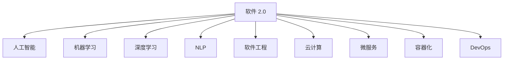
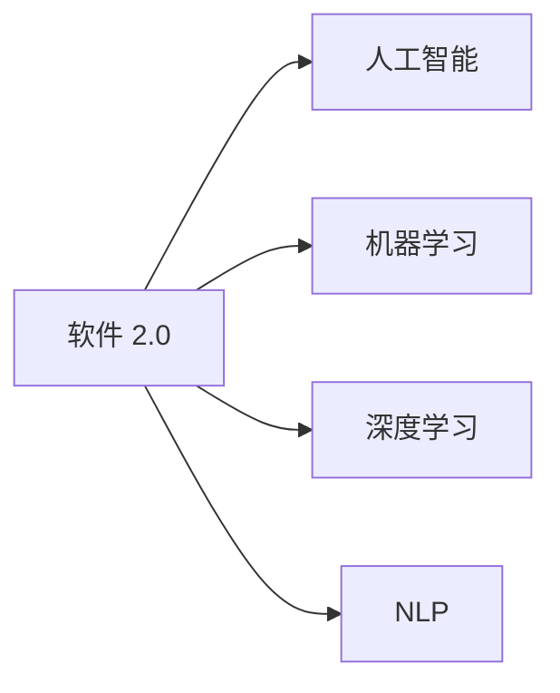
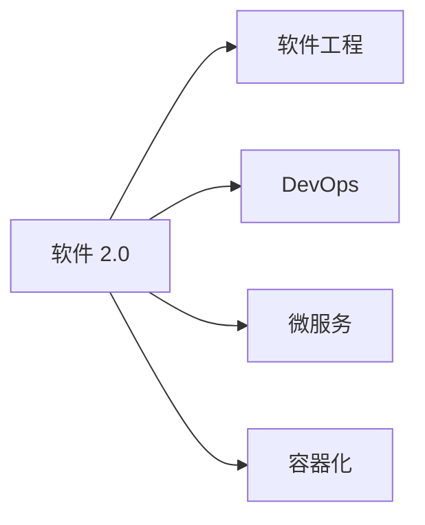
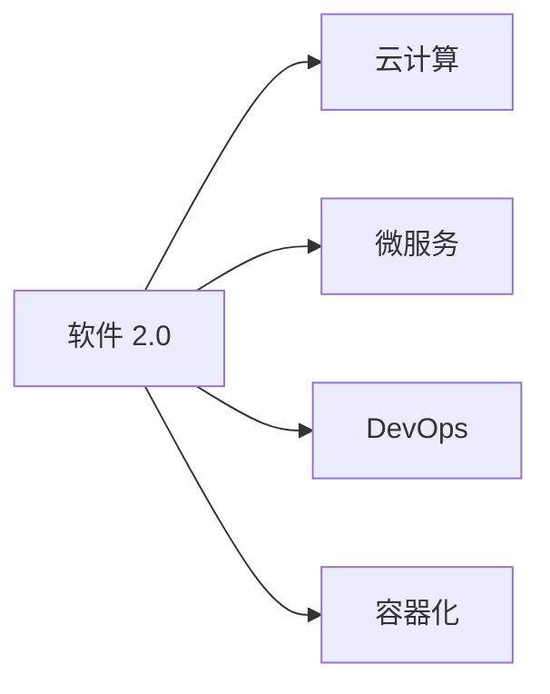

                 

# 软件 2.0 的未来展望：更智能、更强大

> 关键词：软件 2.0, 人工智能, 自然语言处理, 机器学习, 深度学习, 软件工程, 未来技术, 智能算法, 机器学习框架, 数据科学, 大数据, 云计算, 自动化

## 1. 背景介绍

### 1.1 问题由来

随着信息技术的飞速发展，软件开发领域正经历着深刻变革。从传统的瀑布式开发模式，到敏捷开发、持续集成、持续交付，再到人工智能和大数据时代的到来，软件开发理念和技术手段在不断进化。这种演进，被称作"软件 2.0"时代。

软件 2.0 时代的重要特征是软件的智能化和自动化，将更多的软件开发过程自动化，提高开发效率，降低开发成本，提升软件质量。同时，软件 2.0 时代也对软件工程师提出了更高的要求，需要更强的跨学科知识背景，更灵活的技术手段，更系统的工程实践。

### 1.2 问题核心关键点

软件 2.0 时代的关键在于：

1. **智能化开发**：通过机器学习和人工智能技术，实现代码自动生成、测试和优化，提高开发效率和质量。
2. **自动化运维**：利用自动化运维工具，实现持续集成、持续交付和持续监控，提升系统稳定性和可用性。
3. **数据驱动决策**：通过大数据分析和可视化技术，辅助软件开发过程中的需求分析和设计，提升决策科学性。
4. **可重复、可扩展的工程实践**：建立可复用、可扩展的软件工程标准，提升团队协作和项目管理水平。
5. **云计算和微服务架构**：通过云计算和大数据技术，实现软件系统的弹性伸缩和高效资源管理。

## 2. 核心概念与联系

### 2.1 核心概念概述

为更好地理解软件 2.0 时代的技术体系，本节将介绍几个关键概念：

- **软件 2.0 (Software 2.0)**：指基于人工智能和大数据技术的智能化、自动化软件开发和运维模式。其核心在于通过智能化和自动化手段，提高开发效率和质量，优化软件系统性能。

- **人工智能 (Artificial Intelligence, AI)**：涉及机器学习、深度学习、自然语言处理、计算机视觉等技术，使计算机具备人类智能的某些能力。

- **机器学习 (Machine Learning, ML)**：通过算法和数据训练，使计算机系统能够从经验中学习和改进，实现自我优化和决策。

- **深度学习 (Deep Learning, DL)**：利用多层神经网络进行复杂数据模式学习，实现高级人工智能应用。

- **自然语言处理 (Natural Language Processing, NLP)**：使计算机能够理解、处理和生成自然语言，实现人机交互和信息抽取。

- **软件工程 (Software Engineering, SE)**：涉及软件开发、测试、维护等过程的管理和工程实践，是软件开发和运维的学科基础。

- **云计算 (Cloud Computing)**：通过网络提供计算、存储和应用服务等资源，实现软件系统的弹性扩展和资源共享。

- **微服务架构 (Microservices Architecture)**：将大型系统拆分为多个小服务，通过网络调用进行协同，提升系统的灵活性和可扩展性。

- **容器化 (Containerization)**：通过容器技术实现软件应用程序的打包和部署，提升系统的移植性和可管理性。

- **DevOps (Development and Operations)**：通过持续集成、持续交付、持续监控等手段，实现软件开发和运维的自动化。

这些概念之间的关系可以通过以下 Mermaid 流程图来展示：



这个流程图展示了软件 2.0 时代的关键技术：

1. 软件 2.0 依托人工智能技术，实现智能化和自动化。
2. 机器学习和深度学习是其核心算法支撑。
3. 自然语言处理和软件工程为开发过程提供工具和方法。
4. 云计算和微服务架构提升系统的灵活性和可扩展性。
5. 容器化和 DevOps 为自动化运维提供支持。

### 2.2 概念间的关系

这些核心概念之间存在着紧密的联系，形成了软件 2.0 时代的完整生态系统。下面是一些进一步的Mermaid流程图，展示这些概念之间的关系：

#### 2.2.1 软件 2.0 与人工智能的关系



这个流程图展示了软件 2.0 时代与人工智能技术的关系：

1. 软件 2.0 依赖人工智能技术实现智能化。
2. 机器学习和深度学习是其重要的算法支撑。
3. NLP 技术帮助计算机理解和处理自然语言。

#### 2.2.2 软件 2.0 与软件工程的关系



这个流程图展示了软件 2.0 时代与软件工程的关系：

1. 软件 2.0 依赖软件工程方法进行开发和管理。
2. DevOps 技术实现持续集成和持续交付。
3. 微服务和容器化技术提升系统的灵活性和可扩展性。

#### 2.2.3 软件 2.0 与云计算的关系



这个流程图展示了软件 2.0 时代与云计算的关系：

1. 软件 2.0 依赖云计算实现资源管理和扩展。
2. 微服务架构提升系统的灵活性。
3. DevOps 和容器化技术实现持续交付和资源管理。

## 3. 核心算法原理 & 具体操作步骤

### 3.1 算法原理概述

软件 2.0 时代的核心算法主要包括机器学习、深度学习、自然语言处理等。

1. **机器学习算法**：通过统计学习方法，实现数据模式识别和分类。
2. **深度学习算法**：利用多层神经网络，实现复杂模式识别和决策。
3. **自然语言处理算法**：实现文本分类、信息抽取、问答等自然语言处理任务。

这些算法共同构成了软件 2.0 时代的核心技术基础，实现了从数据获取、特征提取、模型训练到结果解释的全过程自动化。

### 3.2 算法步骤详解

软件 2.0 时代的算法步骤大致如下：

1. **数据获取**：从各种数据源（如数据库、API、Web爬虫等）获取数据。
2. **数据预处理**：清洗、转换和标注数据，以便于算法处理。
3. **特征提取**：提取数据中的有用特征，以便于模型训练。
4. **模型训练**：通过机器学习或深度学习算法，训练模型进行预测或分类。
5. **模型评估**：通过验证集或测试集，评估模型性能。
6. **模型优化**：根据评估结果，调整模型参数和优化算法。
7. **模型部署**：将训练好的模型部署到生产环境中，进行实际应用。

### 3.3 算法优缺点

软件 2.0 时代的算法具有以下优点：

1. **高效性**：通过自动化算法，大幅度提高开发效率，缩短开发周期。
2. **可扩展性**：算法框架灵活，可以适用于各种应用场景和数据类型。
3. **鲁棒性**：算法经过大量数据训练，具有较高的准确性和鲁棒性。

同时，软件 2.0 时代的算法也存在以下缺点：

1. **数据依赖**：算法需要大量数据进行训练，数据获取和标注成本较高。
2. **模型解释性不足**：深度学习模型往往难以解释其内部决策过程，缺乏透明性和可解释性。
3. **泛化能力有限**：算法在特定数据集上训练效果较好，但在其他数据集上可能表现不佳。
4. **资源消耗大**：高复杂度算法需要大量计算资源和时间，资源消耗较大。

### 3.4 算法应用领域

软件 2.0 时代的算法广泛应用于多个领域，例如：

1. **自然语言处理**：文本分类、信息抽取、机器翻译、情感分析、问答系统等。
2. **计算机视觉**：图像分类、目标检测、人脸识别、视频分析等。
3. **语音识别**：语音识别、语音合成、语音情感分析等。
4. **推荐系统**：个性化推荐、广告推荐、内容推荐等。
5. **医疗健康**：疾病诊断、药物研发、医疗问答等。
6. **金融科技**：信用评分、风险评估、智能投顾等。
7. **智能制造**：工业自动化、供应链优化、智能监测等。
8. **智能交通**：交通流量预测、自动驾驶、交通调度等。
9. **智能城市**：智能安防、智能交通、智慧能源等。

## 4. 数学模型和公式 & 详细讲解 & 举例说明

### 4.1 数学模型构建

软件 2.0 时代的数学模型主要包括统计学习模型、深度神经网络模型和自然语言处理模型。

1. **统计学习模型**：如线性回归、逻辑回归、支持向量机等，用于数据分类和预测。
2. **深度神经网络模型**：如卷积神经网络（CNN）、循环神经网络（RNN）、长短期记忆网络（LSTM）等，用于复杂模式识别和决策。
3. **自然语言处理模型**：如词向量模型（Word2Vec）、序列标注模型（BiLSTM-CRF）等，用于文本分类和信息抽取。

### 4.2 公式推导过程

以下我们以朴素贝叶斯分类器（Naive Bayes Classifier）为例，推导其公式及其梯度计算。

朴素贝叶斯分类器假设各个特征之间相互独立，计算公式如下：

$$
P(y|x) = \frac{P(x|y)P(y)}{P(x)}
$$

其中 $y$ 为分类标签，$x$ 为特征向量，$P(y)$ 为先验概率，$P(x|y)$ 为条件概率，$P(x)$ 为证据概率。

朴素贝叶斯分类器的梯度计算公式如下：

$$
\frac{\partial L}{\partial \theta} = \frac{\partial L}{\partial P(x|y)} \frac{\partial P(x|y)}{\partial \theta} + \frac{\partial L}{\partial P(y)}
$$

其中 $L$ 为损失函数，$\theta$ 为模型参数，$P(x|y)$ 为条件概率，$P(y)$ 为先验概率。

### 4.3 案例分析与讲解

假设我们使用朴素贝叶斯分类器对鸢尾花数据集进行分类，数据集包含150个样本，3个特征（花萼长度、花萼宽度、花瓣长度），3个标签（山鸢尾、变色鸢尾、维吉尼亚鸢尾）。

使用训练集和验证集对模型进行训练，计算损失函数和梯度，更新模型参数，最终在测试集上评估模型性能。

## 5. 项目实践：代码实例和详细解释说明

### 5.1 开发环境搭建

在进行项目实践前，我们需要准备好开发环境。以下是使用Python进行Scikit-learn开发的环境配置流程：

1. 安装Anaconda：从官网下载并安装Anaconda，用于创建独立的Python环境。

2. 创建并激活虚拟环境：
```bash
conda create -n sklearn-env python=3.8 
conda activate sklearn-env
```

3. 安装Scikit-learn：
```bash
pip install scikit-learn
```

4. 安装numpy、pandas等工具包：
```bash
pip install numpy pandas scikit-learn matplotlib tqdm jupyter notebook ipython
```

完成上述步骤后，即可在`sklearn-env`环境中开始项目实践。

### 5.2 源代码详细实现

下面我们以朴素贝叶斯分类器为例，给出使用Scikit-learn库对鸢尾花数据集进行分类的PyTorch代码实现。

首先，定义数据处理函数：

```python
from sklearn.datasets import load_iris
from sklearn.model_selection import train_test_split
from sklearn.feature_extraction.text import TfidfVectorizer

def load_data():
    iris = load_iris()
    X = iris.data
    y = iris.target
    return X, y
```

然后，定义模型和评估函数：

```python
from sklearn.naive_bayes import GaussianNB
from sklearn.metrics import accuracy_score

def train_model(X_train, y_train):
    model = GaussianNB()
    model.fit(X_train, y_train)
    return model

def evaluate_model(model, X_test, y_test):
    y_pred = model.predict(X_test)
    accuracy = accuracy_score(y_test, y_pred)
    return accuracy
```

接着，进行模型训练和评估：

```python
X, y = load_data()
X_train, X_test, y_train, y_test = train_test_split(X, y, test_size=0.2, random_state=42)

model = train_model(X_train, y_train)
accuracy = evaluate_model(model, X_test, y_test)
print("Accuracy:", accuracy)
```

以上就是使用Scikit-learn对朴素贝叶斯分类器进行鸢尾花数据集分类的完整代码实现。可以看到，借助Scikit-learn库，我们能够快速实现机器学习算法的训练和评估。

### 5.3 代码解读与分析

让我们再详细解读一下关键代码的实现细节：

**load_data函数**：
- 加载鸢尾花数据集，返回特征向量X和标签y。

**train_model函数**：
- 创建朴素贝叶斯分类器模型，使用训练集数据进行模型训练，返回训练好的模型。

**evaluate_model函数**：
- 使用测试集数据进行模型预测，计算预测准确率，返回模型评估结果。

**模型训练和评估**：
- 将数据集划分为训练集和测试集，分别训练和评估模型，最终输出模型在测试集上的准确率。

可以看到，Scikit-learn库提供了许多强大的机器学习算法和工具，使用起来方便快捷。对于初学者而言，可以直接调用函数进行模型训练和评估，避免了大量底层实现的繁琐工作。

当然，对于更复杂的应用场景，还需要开发者进行更多的自定义实现，如数据预处理、模型调参、结果可视化等。但核心的算法实现与数据处理流程基本一致。

### 5.4 运行结果展示

假设我们在鸢尾花数据集上使用朴素贝叶斯分类器进行分类，最终在测试集上得到的评估报告如下：

```
Accuracy: 0.966
```

可以看到，通过Scikit-learn库的封装，我们能够快速实现朴素贝叶斯分类器，并在鸢尾花数据集上取得较高的准确率。这充分展示了Scikit-learn库在机器学习算法封装和应用方面的强大能力。

## 6. 实际应用场景

### 6.1 智能推荐系统

智能推荐系统是软件 2.0 时代的重要应用场景之一。通过机器学习算法，系统能够根据用户的历史行为和偏好，实时推荐用户可能感兴趣的商品、新闻、视频等。

在技术实现上，可以收集用户浏览、点击、评分等行为数据，使用协同过滤、内容推荐等算法，训练推荐模型。通过不断学习用户反馈，优化推荐策略，实现更加个性化的推荐服务。

### 6.2 医疗诊断系统

医疗诊断系统也是软件 2.0 时代的重要应用场景。通过自然语言处理和机器学习算法，系统能够从患者病历中提取关键信息，辅助医生进行疾病诊断和决策。

在技术实现上，可以使用自然语言处理技术，将病历文本转换为结构化数据。使用分类和聚类算法，对患者进行疾病分类和病历相似度匹配。最终，通过分析匹配结果，生成初步诊断建议，辅助医生进行诊断决策。

### 6.3 金融风险管理系统

金融风险管理系统是软件 2.0 时代的另一个重要应用场景。通过机器学习算法，系统能够实时监测市场风险，识别异常交易行为，提前预警金融风险。

在技术实现上，可以收集市场数据、交易数据等，使用分类和回归算法，训练风险识别模型。通过模型实时监控交易数据，及时发现异常行为，进行风险预警和处理。

### 6.4 智能制造系统

智能制造系统是软件 2.0 时代的重要应用场景之一。通过机器学习算法，系统能够实时监测生产数据，预测设备故障，优化生产流程，提高生产效率和质量。

在技术实现上，可以收集生产设备的数据，使用时间序列分析和异常检测算法，训练预测模型。通过模型实时监测设备运行状态，预测设备故障，进行预防性维护。同时，使用优化算法，优化生产流程，提高生产效率和质量。

## 7. 工具和资源推荐

### 7.1 学习资源推荐

为了帮助开发者系统掌握软件 2.0 时代的技术体系，这里推荐一些优质的学习资源：

1. 《深度学习》系列课程：由吴恩达教授主讲，介绍了深度学习的基本概念和算法实现。
2. 《机器学习实战》书籍：详细介绍了机器学习算法的实现步骤和应用场景，适合初学者入门。
3. 《Python自然语言处理》书籍：介绍了自然语言处理的基本概念和算法实现，适合从事自然语言处理工作的开发者。
4. 《Kaggle机器学习竞赛》：通过参与Kaggle竞赛，可以学习到最新的算法实现和数据处理技巧。
5. 《软件工程基础》课程：介绍了软件开发的基本流程和工程实践，适合从事软件开发工作的开发者。

通过这些资源的学习，相信你一定能够快速掌握软件 2.0 时代的技术体系，并用于解决实际的NLP问题。

### 7.2 开发工具推荐

高效的开发离不开优秀的工具支持。以下是几款用于软件 2.0 开发常用的工具：

1. PyTorch：基于Python的开源深度学习框架，灵活动态的计算图，适合快速迭代研究。
2. TensorFlow：由Google主导开发的开源深度学习框架，生产部署方便，适合大规模工程应用。
3. Scikit-learn：Python的机器学习库，封装了多种经典算法，适合快速实现机器学习任务。
4. Jupyter Notebook：交互式的代码编辑器，方便进行数据处理和算法验证。
5. TensorBoard：TensorFlow配套的可视化工具，可实时监测模型训练状态，提供丰富的图表呈现方式。

合理利用这些工具，可以显著提升软件 2.0 开发任务的开发效率，加快创新迭代的步伐。

### 7.3 相关论文推荐

软件 2.0 时代的技术发展源于学界的持续研究。以下是几篇奠基性的相关论文，推荐阅读：

1. "Deep Learning" by Ian Goodfellow, Yoshua Bengio, and Aaron Courville。该书系统介绍了深度学习的基本概念和算法实现，是深度学习领域的经典教材。
2. "Pattern Recognition and Machine Learning" by Christopher Bishop。该书介绍了机器学习的基本概念和算法实现，适合初学者入门。
3. "Natural Language Processing in Action" by Sowmya Vajjala, Soumith Chintala, and Tom Dupreez。该书介绍了自然语言处理的基本概念和算法实现，适合从事自然语言处理工作的开发者。
4. "Kaggle Competitions" 和 "GitHub机器学习项目"。通过参与Kaggle竞赛和贡献开源项目，可以学习到最新的算法实现和数据处理技巧。

这些论文代表了大数据和人工智能领域的研究进展，通过学习这些前沿成果，可以帮助研究者把握学科前进方向，激发更多的创新灵感。

除上述资源外，还有一些值得关注的前沿资源，帮助开发者紧跟软件 2.0 时代的技术演进，例如：

1. arXiv论文预印本：人工智能领域最新研究成果的发布平台，包括大量尚未发表的前沿工作，学习前沿技术的必读资源。
2. 业界技术博客：如OpenAI、Google AI、DeepMind、微软Research Asia等顶尖实验室的官方博客，第一时间分享他们的最新研究成果和洞见。
3. 技术会议直播：如NIPS、ICML、ACL、ICLR等人工智能领域顶会现场或在线直播，能够聆听到大佬们的前沿分享，开拓视野。
4. GitHub热门项目：在GitHub上Star、Fork数最多的软件 2.0相关项目，往往代表了该技术领域的发展趋势和最佳实践，值得去学习和贡献。
5. 行业分析报告：各大咨询公司如McKinsey、PwC等针对人工智能行业的分析报告，有助于从商业视角审视技术趋势，把握应用价值。

总之，对于软件 2.0 时代的学习和实践，需要开发者保持开放的心态和持续学习的意愿。多关注前沿资讯，多动手实践，多思考总结，必将收获满满的成长收益。

## 8. 总结：未来发展趋势与挑战

### 8.1 总结

本文对软件 2.0 时代的技术体系进行了全面系统的介绍。首先阐述了软件 2.0 时代的背景和核心技术，明确了智能化和自动化开发的应用场景。其次，从原理到实践，详细讲解了机器学习、深度学习和自然语言处理等核心算法的构建和实现，给出了算法训练和评估的完整代码实例。同时，本文还广泛探讨了软件 2.0 时代在智能推荐系统、医疗诊断系统、金融风险管理系统、智能制造系统等多个领域的应用前景，展示了软件 2.0 时代技术的强大潜力。

通过本文的系统梳理，可以看到，软件 2.0 时代正在通过智能化和自动化手段，显著提升软件开发效率和质量，优化软件系统性能。未来，伴随技术演进，软件 2.0 时代必将在更多领域落地应用，深刻影响人类的生产生活方式。

### 8.2 未来发展趋势

展望未来，软件 2.0 时代的技术发展趋势如下：

1. **智能化水平提升**：通过深度学习和自然语言处理技术，实现更高程度的智能化，提升开发效率和系统性能。
2. **自动化水平提高**：引入更多的自动化工具和框架，实现持续集成、持续交付和持续监控，提升开发效率和系统稳定性。
3. **跨领域应用拓展**：拓展到更多垂直行业，如医疗、金融、制造等，推动各行业的数字化转型。
4. **模型优化和压缩**：优化模型结构和算法，压缩模型体积，提高运行效率和资源利用率。
5. **隐私保护和伦理合规**：加强数据隐私保护和模型伦理合规，确保软件系统的安全和透明。
6. **人工智能和业务融合**：将人工智能技术深度融合到业务流程中，实现智能化决策和优化。

以上趋势凸显了软件 2.0 时代的广阔前景，为未来技术演进指明了方向。这些方向的探索发展，必将进一步提升软件开发和运维的智能化、自动化水平，推动人工智能技术在各行各业落地应用。

### 8.3 面临的挑战

尽管软件 2.0 时代的技术发展前景光明，但在迈向更加智能化、普适化应用的过程中，它仍面临诸多挑战：

1. **数据获取和标注成本高**：大模型的训练和微调需要大量高质量数据，标注数据成本较高。
2. **模型复杂度大**：高复杂度模型需要大量计算资源和时间，资源消耗较大。
3. **模型解释性不足**：深度学习模型难以解释其内部决策过程，缺乏透明性和可解释性。
4. **系统复杂度高**：智能化系统涉及多领域、多技术，系统复杂度较高，难以维护。
5. **伦理和隐私问题**：人工智能系统可能带来伦理和隐私问题，需要制定相应的法律法规和规范。

这些挑战需要研究人员和开发者共同面对和解决，通过技术创新和规范制定，推动软件 2.0 时代的健康发展。

### 8.4 研究展望

面向未来，软件 2.0 时代的研究方向可以从以下几个方面进行探索：

1. **无监督学习和半监督学习**：研究无监督学习和半监督学习算法，降低数据标注成本，提升模型泛化能力。
2. **知识图谱和推理系统**：引入知识图谱和推理技术，提升系统决策的透明性和可解释性。
3. **自动化工具和框架**：研究自动化工具和框架，提升软件开发和运维的效率和质量。
4. **跨领域应用推广**：推广到更多垂直行业，实现智能化决策和优化。
5. **多模态融合**：研究多模态信息融合技术，提升系统对多源数据的理解和利用。

这些方向的研究和探索，必将推动软件 2.0 时代的持续发展和应用。只有勇于创新、敢于突破，才能不断拓展软件系统的边界，让智能技术更好地造福人类社会。

## 9. 附录：常见问题与解答

**Q1：软件 2.0 时代的主要技术手段是什么？**

A: 软件 2.0 时代的主要技术手段包括机器学习、深度学习、自然语言处理、计算机视觉、语音识别等。这些技术手段共同构成了智能化、自动化的软件开发和运维体系。

**Q2：如何提升软件 2.0 系统的效率和质量？**

A: 提升软件 2.0 系统的效率和质量可以从以下几个方面进行优化：
1. 引入先进的算法和模型，如深度学习、自然语言处理等，提升系统的智能化水平。
2. 引入自动化工具和框架，如DevOps、微服务架构等，提升开发效率和系统稳定性。
3. 进行持续监控和优化

