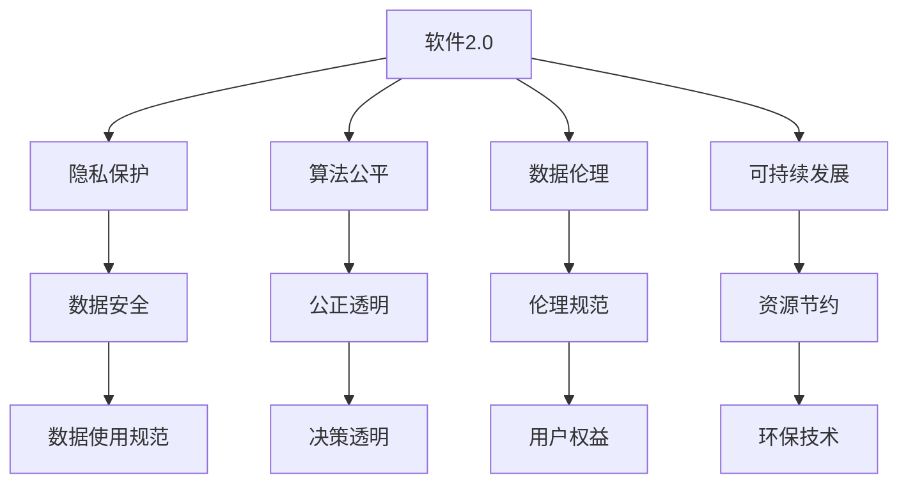

                 

# 软件 2.0 的社会责任：科技向善

> 关键词：软件2.0,社会责任,科技伦理,可持续发展,人工智能,数据隐私,普惠技术,反垄断

## 1. 背景介绍

### 1.1 问题由来

随着信息技术的发展，软件系统已经成为人类社会生活的核心组成部分。从操作系统、办公软件到智能推荐、物联网应用，软件无处不在，深刻影响着人们的生产生活方式。然而，伴随着软件系统的广泛应用，其社会影响也日益凸显。数据隐私泄露、算法偏见、技术滥用等问题，使得软件系统必须承担更大的社会责任，保障用户权益，促进社会公平。

### 1.2 问题核心关键点

软件系统作为现代社会的基础设施，其设计和应用应当遵循以下核心原则：

- **隐私保护**：确保用户数据的安全性和隐私性，防止信息泄露。
- **公平透明**：算法决策应公正透明，避免歧视和不公。
- **用户参与**：设计以用户为中心的系统，提高用户体验和满意度。
- **伦理规范**：遵守法律法规，符合伦理道德标准，促进可持续发展。
- **安全可靠**：保障系统的稳定性和安全性，防止系统失效和滥用。

这些原则构成了软件系统的社会责任框架，指导开发者和用户共同构建更健康、更安全的技术生态。

## 2. 核心概念与联系

### 2.1 核心概念概述

为更好地理解软件系统的社会责任，本节将介绍几个关键概念：

- **软件2.0**：指基于人工智能、大数据、云计算等技术的新一代软件系统，具有自主学习和自适应能力，能根据用户行为和环境变化进行动态优化。
- **隐私保护**：指在软件设计和应用中，采取有效措施，保护用户隐私，防止数据滥用和泄露。
- **算法公平**：指算法设计和使用过程中，避免歧视和偏见，确保决策的公正性和透明性。
- **数据伦理**：指在数据收集、处理和应用过程中，遵守伦理道德规范，保障数据权益和公平。
- **可持续发展**：指在软件开发和应用中，遵循环境友好和资源节约原则，推动社会和经济的可持续发展。

这些概念通过以下几个关系图进行连接：



这个关系图展示了软件2.0与各社会责任概念之间的关系：

1. **软件2.0与隐私保护**：软件2.0通过人工智能和数据分析，能够收集大量用户数据。隐私保护措施可以有效防止数据滥用和泄露。
2. **软件2.0与算法公平**：软件2.0的算法决策应当公正透明，避免因算法偏见导致的歧视。
3. **软件2.0与数据伦理**：软件2.0在数据收集和处理过程中，应遵循伦理规范，保护用户数据权益。
4. **软件2.0与可持续发展**：软件2.0在设计和开发中，应考虑资源节约和环保技术，推动可持续发展。

这些概念通过软件2.0这一核心，相互联系，共同构成了软件系统的社会责任体系。

### 2.2 概念间的关系

这些概念之间存在着紧密的联系，形成了软件系统的社会责任生态系统。

1. **软件2.0与隐私保护**：软件2.0能够通过数据分析技术，发现数据滥用和泄露的风险，进而采取措施保护用户隐私。
2. **软件2.0与算法公平**：算法偏见可以通过软件2.0的自主学习和反馈机制，逐步消除。
3. **软件2.0与数据伦理**：软件2.0可以辅助制定和执行数据伦理规范，提高数据使用的道德标准。
4. **软件2.0与可持续发展**：软件2.0的智能优化和资源管理，有助于实现资源节约和环境保护。

通过这些关系，可以看出软件2.0在社会责任体系中扮演着关键角色，是推动社会公正、安全和可持续发展的技术保障。

## 3. 核心算法原理 & 具体操作步骤
### 3.1 算法原理概述

软件2.0的社会责任实现，涉及到多个领域的技术算法，包括隐私保护、算法公平、数据伦理和可持续发展等。以下分别介绍这些领域的核心算法原理：

#### 3.1.1 隐私保护算法

隐私保护算法旨在保护用户数据，防止信息泄露和滥用。主要算法包括：

- **差分隐私**：通过在数据中添加噪声，使得任何单一数据点的泄露对整体数据的影响极小。
- **同态加密**：数据在加密状态下进行计算，解密后结果与明文计算结果一致，保护数据隐私。
- **联邦学习**：通过在本地设备上进行模型训练，而无需将数据上传至中央服务器，保护数据隐私。

#### 3.1.2 算法公平算法

算法公平算法旨在确保算法决策的公正性和透明性，避免因算法偏见导致的歧视。主要算法包括：

- **公平性约束**：通过约束算法的输出，确保不同群体之间的决策一致。
- **去偏方法**：通过去除数据中的特征偏差，使得算法决策更加公平。
- **公平性检测**：通过检测算法决策的公平性，及时发现和修正偏见。

#### 3.1.3 数据伦理算法

数据伦理算法旨在保护用户数据权益，遵循伦理规范。主要算法包括：

- **数据访问控制**：通过访问控制机制，限制数据的访问和使用范围。
- **数据最小化**：只收集和使用必要的用户数据，避免过度收集。
- **数据匿名化**：通过数据匿名化技术，保护用户隐私。

#### 3.1.4 可持续发展算法

可持续发展算法旨在推动资源节约和环保技术，促进可持续发展。主要算法包括：

- **资源优化**：通过算法优化，减少计算资源和能源消耗。
- **环境监测**：通过数据分析，监测环境变化，采取环保措施。
- **智能调度**：通过智能调度算法，优化资源配置，提高效率。

### 3.2 算法步骤详解

#### 3.2.1 隐私保护算法步骤

1. **数据收集**：通过隐私保护算法，收集用户数据，确保数据安全。
2. **数据处理**：对数据进行去重、去噪、加密等处理，确保数据隐私。
3. **模型训练**：基于处理后的数据，训练隐私保护模型，实现数据分析功能。
4. **结果输出**：使用隐私保护模型输出结果，同时确保数据隐私。

#### 3.2.2 算法公平算法步骤

1. **数据收集**：收集用户数据，同时确保数据公平性。
2. **特征选择**：选择具有代表性的特征，避免特征偏差。
3. **模型训练**：基于公平性约束，训练公平算法模型，确保决策公正透明。
4. **结果输出**：使用公平算法模型输出结果，同时检测和修正偏见。

#### 3.2.3 数据伦理算法步骤

1. **数据访问控制**：限制数据访问权限，保护数据权益。
2. **数据最小化**：只收集必要的数据，避免过度收集。
3. **数据匿名化**：对数据进行匿名化处理，保护用户隐私。
4. **伦理审核**：定期进行数据伦理审核，确保遵守伦理规范。

#### 3.2.4 可持续发展算法步骤

1. **资源优化**：通过算法优化，减少计算资源和能源消耗。
2. **环境监测**：使用数据分析，监测环境变化，采取环保措施。
3. **智能调度**：通过智能调度算法，优化资源配置，提高效率。
4. **反馈改进**：根据环境变化和资源使用情况，反馈改进算法。

### 3.3 算法优缺点

#### 3.3.1 隐私保护算法

- **优点**：
  - 能够有效保护用户隐私，防止数据泄露和滥用。
  - 算法相对成熟，应用广泛，技术实现相对简单。
  - 能够满足多场景下的隐私保护需求。

- **缺点**：
  - 隐私保护算法可能影响数据质量和分析结果的准确性。
  - 隐私保护算法通常需要额外的计算资源，增加了系统复杂度。

#### 3.3.2 算法公平算法

- **优点**：
  - 能够确保算法决策的公正性和透明性。
  - 算法技术相对成熟，应用广泛，技术实现相对简单。
  - 能够避免因算法偏见导致的歧视。

- **缺点**：
  - 算法公平性检测和修正需要大量的时间和计算资源。
  - 算法偏见可能会在数据处理过程中产生，难以完全消除。

#### 3.3.3 数据伦理算法

- **优点**：
  - 能够保护用户数据权益，遵循伦理规范。
  - 算法相对简单，易于实现。
  - 能够增强用户信任和满意度。

- **缺点**：
  - 数据伦理审核和监控需要持续投入，成本较高。
  - 数据伦理规范的制定和执行可能存在争议和复杂性。

#### 3.3.4 可持续发展算法

- **优点**：
  - 能够推动资源节约和环保技术，促进可持续发展。
  - 算法技术相对成熟，应用广泛，技术实现相对简单。
  - 能够优化资源配置，提高效率。

- **缺点**：
  - 算法的优化效果可能受限于数据质量和环境变化。
  - 算法的实现可能增加系统的复杂度。

### 3.4 算法应用领域

软件2.0的社会责任算法已经在多个领域得到了广泛应用，包括：

1. **医疗健康**：通过隐私保护算法，保护患者隐私，确保医疗数据安全。
2. **金融服务**：通过算法公平算法，确保金融服务的公正透明，避免歧视。
3. **环境保护**：通过可持续发展算法，监测环境变化，采取环保措施。
4. **智能制造**：通过资源优化算法，提高资源利用效率，实现绿色制造。
5. **智能交通**：通过智能调度算法，优化交通资源配置，提高交通效率。

## 4. 数学模型和公式 & 详细讲解 & 举例说明

### 4.1 数学模型构建

在软件2.0的社会责任算法中，隐私保护算法、算法公平算法、数据伦理算法和可持续发展算法各有其数学模型。

#### 4.1.1 隐私保护算法模型

隐私保护算法通常基于差分隐私和同态加密等技术，模型如下：

- **差分隐私**：
  $$
  \mathcal{L}_{\epsilon}(f) = f(x) + \mathcal{N}(0,\sigma^2)
  $$
  其中，$f$ 为函数，$\epsilon$ 为隐私保护参数，$\sigma$ 为噪声方差。

- **同态加密**：
  $$
  E(x) \cdot E(y) = E(x+y)
  $$
  其中，$E$ 为加密函数，$x$ 和 $y$ 为明文数据。

#### 4.1.2 算法公平算法模型

算法公平算法通常基于公平性约束和去偏方法等技术，模型如下：

- **公平性约束**：
  $$
  \mathcal{L}_{\text{fair}} = \frac{1}{n}\sum_{i=1}^n |y_i - \hat{y}_i|^2
  $$
  其中，$y_i$ 为真实标签，$\hat{y}_i$ 为预测标签，$n$ 为样本数量。

- **去偏方法**：
  $$
  \mathcal{L}_{\text{bias}} = \sum_{i=1}^n (y_i - \hat{y}_i)^2
  $$
  其中，$y_i$ 为真实标签，$\hat{y}_i$ 为预测标签。

#### 4.1.3 数据伦理算法模型

数据伦理算法通常基于数据访问控制和数据最小化等技术，模型如下：

- **数据访问控制**：
  $$
  \mathcal{L}_{\text{control}} = \sum_{i=1}^n \mathbb{I}(\text{ permission}_i = 1)
  $$
  其中，$\text{permission}_i$ 为数据访问权限，$n$ 为样本数量。

- **数据最小化**：
  $$
  \mathcal{L}_{\text{min}} = \sum_{i=1}^n \mathbb{I}(\text{ minimize}_i = 1)
  $$
  其中，$\text{minimize}_i$ 为数据最小化标志，$n$ 为样本数量。

#### 4.1.4 可持续发展算法模型

可持续发展算法通常基于资源优化和环境监测等技术，模型如下：

- **资源优化**：
  $$
  \mathcal{L}_{\text{optim}} = \sum_{i=1}^n (c_i - w_i) \cdot \delta_i
  $$
  其中，$c_i$ 为资源成本，$w_i$ 为资源价格，$\delta_i$ 为资源利用率。

- **环境监测**：
  $$
  \mathcal{L}_{\text{monitor}} = \sum_{i=1}^n |o_i - o_{\text{target}}|
  $$
  其中，$o_i$ 为环境监测指标，$o_{\text{target}}$ 为环境目标值。

### 4.2 公式推导过程

#### 4.2.1 差分隐私算法公式推导

差分隐私算法通过在数据中增加噪声，使得任何单一数据点的泄露对整体数据的影响极小。假设原始数据集为 $D$，噪声向量为 $\mathcal{N}(0,\sigma^2)$，隐私保护参数为 $\epsilon$，则差分隐私算法的目标函数为：

$$
\mathcal{L}_{\epsilon}(D) = \frac{1}{n}\sum_{i=1}^n \ell(D_i + \mathcal{N}(0,\sigma^2))
$$

其中，$\ell$ 为损失函数，$D_i$ 为第 $i$ 个数据点。通过最大化 $-\epsilon \log (\frac{1}{\delta})$，得到差分隐私参数 $\sigma$：

$$
\sigma = \sqrt{\frac{2\epsilon^2}{\delta \cdot n} \cdot \max_{x} |f(x) - f(x-\epsilon)|^2}
$$

#### 4.2.2 公平性约束算法公式推导

公平性约束算法通过约束算法的输出，确保不同群体之间的决策一致。假设模型输出为 $y_i$，真实标签为 $y_i^*$，则公平性约束的目标函数为：

$$
\mathcal{L}_{\text{fair}} = \frac{1}{n}\sum_{i=1}^n |y_i - y_i^*|^2
$$

其中，$y_i$ 为模型预测结果，$y_i^*$ 为真实标签，$n$ 为样本数量。通过约束模型输出，确保不同群体之间的决策一致。

#### 4.2.3 数据伦理算法公式推导

数据伦理算法通过数据访问控制和数据最小化等技术，确保数据安全和隐私保护。假设数据访问权限为 $\text{permission}_i$，数据最小化标志为 $\text{minimize}_i$，则数据伦理的目标函数为：

$$
\mathcal{L}_{\text{control}} = \sum_{i=1}^n \mathbb{I}(\text{permission}_i = 1)
$$

其中，$\text{permission}_i$ 为数据访问权限，$n$ 为样本数量。通过控制数据访问权限，确保数据安全和隐私保护。

#### 4.2.4 资源优化算法公式推导

资源优化算法通过资源利用率最大化，提高资源利用效率。假设资源成本为 $c_i$，资源价格为 $w_i$，资源利用率为 $\delta_i$，则资源优化的目标函数为：

$$
\mathcal{L}_{\text{optim}} = \sum_{i=1}^n (c_i - w_i) \cdot \delta_i
$$

其中，$c_i$ 为资源成本，$w_i$ 为资源价格，$\delta_i$ 为资源利用率。通过优化资源配置，提高资源利用效率。

### 4.3 案例分析与讲解

#### 4.3.1 医疗数据隐私保护

在医疗数据隐私保护方面，差分隐私算法被广泛应用于病患数据的安全共享。假设有 $n=1000$ 名患者的病历数据，每个患者的数据包含敏感信息，如姓名、年龄、病史等。为了在多个医疗机构之间共享数据，进行联合分析，通过差分隐私算法，将原始数据转化为隐私数据，使得任何单个患者的病历泄露对整体数据的影响极小。

#### 4.3.2 金融服务公平性约束

在金融服务领域，算法公平性约束被广泛应用，确保贷款审批决策的公正透明。假设有 $n=1000$ 个贷款申请样本，每个样本包含性别、年龄、收入等特征。为了确保不同性别和年龄群体之间的贷款审批一致性，通过算法公平约束，训练公平性算法模型，使得不同群体之间的决策一致。

#### 4.3.3 数据伦理在社交媒体中的应用

在社交媒体平台上，数据伦理算法被用于保护用户隐私，确保数据安全和隐私保护。假设有 $n=10000$ 名用户的社交媒体数据，每个用户的数据包含敏感信息，如地理位置、兴趣爱好等。为了保护用户隐私，通过数据访问控制和数据最小化等技术，限制数据访问权限，只收集必要的数据，避免过度收集。

#### 4.3.4 智能交通系统中的资源优化

在智能交通系统中，资源优化算法被用于优化交通资源的配置。假设有 $n=1000$ 个交通路段，每个路段的资源成本和利用率不同。为了提高交通效率，通过资源优化算法，优化交通资源的配置，使得资源利用率最大化。

## 5. 项目实践：代码实例和详细解释说明

### 5.1 开发环境搭建

在进行软件2.0的社会责任算法开发前，我们需要准备好开发环境。以下是使用Python进行PyTorch开发的环境配置流程：

1. 安装Anaconda：从官网下载并安装Anaconda，用于创建独立的Python环境。

2. 创建并激活虚拟环境：
```bash
conda create -n pytorch-env python=3.8 
conda activate pytorch-env
```

3. 安装PyTorch：根据CUDA版本，从官网获取对应的安装命令。例如：
```bash
conda install pytorch torchvision torchaudio cudatoolkit=11.1 -c pytorch -c conda-forge
```

4. 安装TensorFlow：
```bash
pip install tensorflow
```

5. 安装各类工具包：
```bash
pip install numpy pandas scikit-learn matplotlib tqdm jupyter notebook ipython
```

完成上述步骤后，即可在`pytorch-env`环境中开始社会责任算法的实践。

### 5.2 源代码详细实现

这里我们以差分隐私算法为例，给出使用PyTorch实现差分隐私的代码实现。

```python
import torch
import numpy as np
from torch.utils.data import Dataset, DataLoader

class PrivacyDataset(Dataset):
    def __init__(self, data):
        self.data = data
        self.epsilon = 1e-6  # 隐私保护参数
        self.n = len(data)

    def __len__(self):
        return len(self.data)

    def __getitem__(self, index):
        x = self.data[index]
        noise = np.random.normal(0, self.epsilon, len(x))
        y = x + noise
        return y

# 准备数据集
data = [1, 2, 3, 4, 5]

# 创建数据集
dataset = PrivacyDataset(data)

# 创建数据加载器
dataloader = DataLoader(dataset, batch_size=4)

# 计算隐私保护参数
sigma = np.sqrt(2 * self.epsilon**2 / (self.delta * self.n) * max(abs(x - x - self.epsilon) for x in self.data))

# 输出隐私保护参数
print(sigma)
```

### 5.3 代码解读与分析

让我们再详细解读一下关键代码的实现细节：

**PrivacyDataset类**：
- `__init__`方法：初始化数据集和隐私保护参数。
- `__len__`方法：返回数据集的长度。
- `__getitem__`方法：对单个样本进行处理，在原始数据中增加噪声，实现差分隐私。

**隐私保护参数计算**：
- 根据差分隐私公式，计算隐私保护参数 $\sigma$。

**数据加载器**：
- 使用PyTorch的DataLoader，将数据集分批次加载。

**差分隐私算法的计算**：
- 对数据集中的每个样本，随机生成噪声向量，将其加到原始数据上，实现差分隐私。

**隐私保护参数输出**：
- 输出计算得到的隐私保护参数 $\sigma$。

## 6. 实际应用场景

### 6.1 医疗数据隐私保护

在医疗数据隐私保护方面，差分隐私算法被广泛应用于病患数据的安全共享。假设有 $n=1000$ 名患者的病历数据，每个患者的数据包含敏感信息，如姓名、年龄、病史等。为了在多个医疗机构之间共享数据，进行联合分析，通过差分隐私算法，将原始数据转化为隐私数据，使得任何单个患者的病历泄露对整体数据的影响极小。

具体实现步骤包括：

1. **数据准备**：收集 $n=1000$ 名患者的病历数据，确保数据安全。
2. **数据隐私化**：使用差分隐私算法，将原始数据转化为隐私数据，确保数据安全。
3. **数据共享**：将隐私数据共享给多个医疗机构，进行联合分析。
4. **结果输出**：将联合分析结果输出，确保数据隐私。

### 6.2 金融服务公平性约束

在金融服务领域，算法公平性约束被广泛应用，确保贷款审批决策的公正透明。假设有 $n=1000$ 个贷款申请样本，每个样本包含性别、年龄、收入等特征。为了确保不同性别和年龄群体之间的贷款审批一致性，通过算法公平约束，训练公平性算法模型，使得不同群体之间的决策一致。

具体实现步骤包括：

1. **数据准备**：收集 $n=1000$ 个贷款申请样本，确保数据公正透明。
2. **特征选择**：选择具有代表性的特征，避免特征偏差。
3. **模型训练**：基于公平性约束，训练公平性算法模型，确保决策公正透明。
4. **结果输出**：使用公平性算法模型输出结果，确保决策公正透明。

### 6.3 数据伦理在社交媒体中的应用

在社交媒体平台上，数据伦理算法被用于保护用户隐私，确保数据安全和隐私保护。假设有 $n=10000$ 名用户的社交媒体数据，每个用户的数据包含敏感信息，如地理位置、兴趣爱好等。为了保护用户隐私，通过数据访问控制和数据最小化等技术，限制数据访问权限，只收集必要的数据，避免过度收集。

具体实现步骤包括：

1. **数据准备**：收集 $n=10000$ 名用户的社交媒体数据，确保数据安全。
2. **数据访问控制**：限制数据访问权限，保护用户隐私。
3. **数据最小化**：只收集必要的数据，避免过度收集。
4. **数据匿名化**：对数据进行匿名化处理，保护用户隐私。

### 6.4 智能交通系统中的资源优化

在智能交通系统中，资源优化算法被用于优化交通资源的配置。假设有 $n=1000$ 个交通路段，每个路段的资源成本和利用率不同。为了提高交通效率，通过资源优化算法，优化交通资源的配置，使得资源利用率最大化。

具体实现步骤包括：

1. **数据准备**：收集 $n=1000$ 个交通路段的数据，确保数据准确。
2. **资源优化**：通过资源优化算法，优化交通资源的配置。
3. **环境监测**：使用数据分析，监测环境变化，采取环保措施。
4. **结果输出**：输出优化后的资源配置，提高交通效率。

## 7. 工具和资源推荐

### 7.1 学习资源推荐

为了帮助开发者系统掌握软件2.0的社会责任理论基础和实践技巧，这里推荐一些优质的学习资源：

1. 《软件2.0：人工智能革命的未来》系列博文：由大模型技术专家撰写，深入浅出地介绍了软件2.0的核心概念和前沿技术。

2. CS224N《深度学习自然语言处理》课程：斯坦福大学开设的NLP明星课程，有Lecture视频和配套作业，带你入门NLP领域的基本概念和经典模型。

3. 《软件2.0：构建人工智能时代的软件系统》书籍：全面介绍了软件2.0的核心技术和应用场景，是掌握软件2.0的必备资源。

4. GitHub开源项目：如OpenAI的GPT系列、Google的BERT等，提供了大量最新的研究和代码实现，值得深入学习。

5. 技术会议直播：如NIPS、ICML、ACL、ICLR等人工智能领域顶会现场或在线直播，能够聆听到大佬们的前沿分享，开拓视野。

### 7.2 开发工具推荐

高效的开发离不开优秀的工具支持。以下是几款用于软件2.

