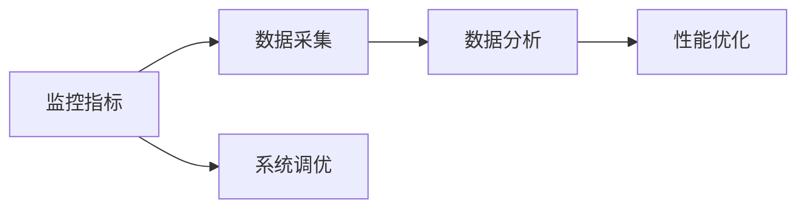
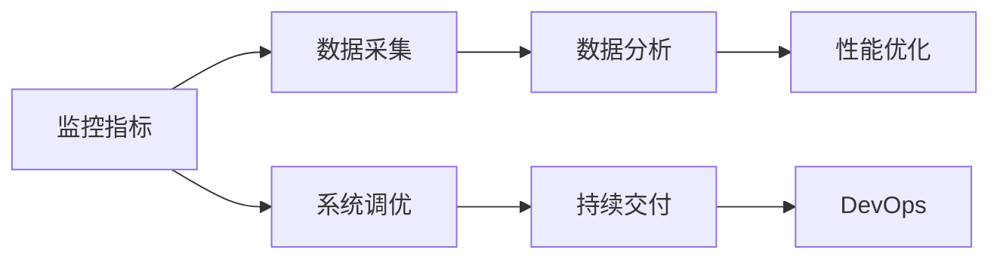
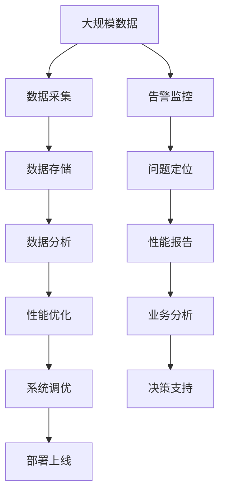

                 

# 软件2.0的性能监控与分析

> 关键词：软件2.0, 性能监控, 系统调优, 数据分析, DevOps, 持续交付, 实时分析, 模型预测

## 1. 背景介绍

### 1.1 问题由来

随着数字化转型的加速，企业系统越来越复杂，软件2.0（软件定义2.0）的概念日益流行，强调以数据驱动和自动化为核心的新型IT架构。在软件2.0时代，企业应用不仅关注功能与性能，更看重运维效率和用户体验。性能监控与分析成为提高软件2.0系统可靠性和效率的关键手段。

随着云计算、大数据、人工智能等技术的普及，企业系统的性能监控与分析需求更加迫切。如何实时监控系统运行状态，精准定位性能瓶颈，预测并预防问题，是企业IT管理面临的新挑战。

### 1.2 问题核心关键点

性能监控与分析的核心目标是通过收集和分析系统运行数据，识别系统瓶颈和性能问题，从而进行系统调优，提升系统性能和用户体验。性能监控通常包括三大要素：

1. **监控指标**：例如CPU使用率、内存占用率、网络带宽、响应时间、并发数等，用于衡量系统资源利用情况。
2. **数据采集**：通过日志、指标数据、性能采样等方式获取系统运行数据。
3. **分析与优化**：利用数据分析技术识别性能问题，并通过优化手段解决问题。

性能监控与分析的流程如图1所示：



### 1.3 问题研究意义

性能监控与分析在软件2.0时代具有重要意义：

- **提升系统稳定性**：通过实时监控和预测，及时发现并修复性能问题，避免系统崩溃。
- **优化资源利用**：识别系统资源瓶颈，进行动态调整，提高资源利用率。
- **改善用户体验**：通过对响应时间和延迟的分析，优化用户体验，提升用户满意度。
- **辅助业务决策**：分析系统性能数据，支持业务决策，指导业务优化。

## 2. 核心概念与联系

### 2.1 核心概念概述

为更好地理解性能监控与分析，本节将介绍几个关键概念：

- **性能监控与分析（Performance Monitoring and Analysis）**：通过收集和分析系统运行数据，识别系统瓶颈和性能问题，并进行系统调优的过程。
- **监控指标（Monitoring Metrics）**：用于衡量系统性能的指标，如CPU使用率、内存占用率、响应时间等。
- **数据采集（Data Collection）**：通过日志、指标数据、性能采样等方式获取系统运行数据。
- **数据分析（Data Analysis）**：利用统计分析、机器学习等技术对采集到的数据进行分析，识别系统性能问题。
- **系统调优（System Tuning）**：通过优化系统配置、代码优化、硬件升级等方式，提升系统性能。
- **持续交付（Continuous Delivery）**：在软件开发过程中，通过自动化手段持续不断地交付软件变更，确保软件质量。
- **DevOps（Development and Operations）**：将开发和运维紧密结合，通过自动化、持续交付等手段提升软件交付效率和质量。

### 2.2 概念间的关系

这些核心概念之间存在着紧密的联系，形成了性能监控与分析的完整生态系统。下面我们通过几个Mermaid流程图来展示这些概念之间的关系。

#### 2.2.1 性能监控与分析的整体架构



这个综合流程图展示了性能监控与分析的整体架构：

1. 监控指标定义了衡量系统性能的标准。
2. 数据采集负责收集系统的运行数据。
3. 数据分析通过统计分析、机器学习等手段，对数据进行深入分析，识别性能问题。
4. 性能优化根据分析结果，对系统进行调优，改善性能。
5. 系统调优后，持续交付到生产环境。
6. DevOps通过自动化和持续交付，提升软件开发和运维效率。

### 2.3 核心概念的整体架构

最后，我们用一个综合的流程图来展示这些核心概念在大规模性能监控与分析中的整体架构：



这个综合流程图展示了在大规模数据环境中，性能监控与分析的完整流程：

1. 从大规模数据中采集运行数据。
2. 存储和管理采集到的数据。
3. 对数据进行深入分析，识别性能问题。
4. 根据分析结果进行性能优化，改善系统性能。
5. 调优后的系统部署到生产环境。
6. 对性能瓶颈进行告警监控和问题定位。
7. 生成性能报告，支持业务分析和决策支持。

这些流程图展示了性能监控与分析的核心概念和整体架构，帮助我们更好地把握性能监控与分析的原理和实现步骤。

## 3. 核心算法原理 & 具体操作步骤
### 3.1 算法原理概述

性能监控与分析的核心算法原理包括监控指标的定义、数据采集技术、数据分析方法和系统调优策略。

**监控指标**：用于衡量系统性能的指标，如CPU使用率、内存占用率、响应时间等。指标的选择应根据系统特性和业务需求来确定。

**数据采集技术**：包括日志采集、指标数据采集和性能采样等。日志采集通过收集系统日志信息，获取系统运行情况；指标数据采集通过收集系统运行时的各项指标，如CPU使用率、内存占用率等；性能采样通过在关键路径上采样获取系统性能数据。

**数据分析方法**：包括统计分析、机器学习等技术。统计分析通过计算统计量（如均值、标准差、百分位数等），了解系统性能的基本情况；机器学习通过训练模型，预测系统性能，进行性能预测和异常检测。

**系统调优策略**：包括配置优化、代码优化和硬件升级等。配置优化通过调整系统配置参数，改善系统性能；代码优化通过代码重构、算法优化等方式提升系统效率；硬件升级通过升级硬件设备，提高系统资源能力。

### 3.2 算法步骤详解

基于性能监控与分析的核心算法原理，我们可以设计出如下算法步骤：

**Step 1: 定义监控指标**

定义与业务相关的监控指标，例如CPU使用率、内存占用率、响应时间等。这些指标应覆盖系统的各个关键环节，确保能够全面反映系统性能。

**Step 2: 配置数据采集工具**

配置日志采集工具（如ELK Stack）、指标数据采集工具（如Prometheus）和性能采样工具（如Jemalloc），确保能够实时获取系统运行数据。

**Step 3: 收集和存储数据**

通过配置的数据采集工具，实时收集系统运行数据，并存储到分布式数据库（如Elasticsearch）中。

**Step 4: 数据预处理**

对收集到的数据进行预处理，包括去重、过滤、归一化等，确保数据质量。

**Step 5: 数据分析**

利用统计分析和机器学习技术，对预处理后的数据进行分析，识别性能问题。

**Step 6: 生成性能报告**

根据分析结果，生成性能报告，展示系统性能情况。

**Step 7: 系统调优**

根据性能报告，进行系统调优，改善系统性能。

**Step 8: 持续交付**

调优后的系统进行持续交付，部署到生产环境。

**Step 9: 性能监控**

对部署后的系统进行实时监控，确保系统性能稳定。

### 3.3 算法优缺点

性能监控与分析具有以下优点：

1. **实时监控**：通过实时监控，及时发现和解决性能问题，避免系统崩溃。
2. **数据分析**：通过数据分析，深入了解系统性能，优化资源配置。
3. **预测预防**：通过性能预测和异常检测，预测系统性能，提前进行预防。
4. **业务支持**：通过性能报告和业务分析，支持业务决策，指导业务优化。

性能监控与分析也存在一些缺点：

1. **数据量大**：大规模数据采集和存储需要大量资源。
2. **算法复杂**：数据分析需要复杂的算法和模型，实施难度大。
3. **人工干预**：虽然自动化程度高，但还需要人工干预和优化。
4. **预测准确性**：性能预测的准确性受限于模型和数据质量。

### 3.4 算法应用领域

性能监控与分析的应用领域非常广泛，主要包括以下几个方面：

1. **云计算**：监控云平台资源使用情况，优化资源配置。
2. **大数据**：监控大数据处理系统的性能，提升数据处理效率。
3. **Web应用**：监控Web应用的响应时间和用户体验，优化Web应用性能。
4. **移动应用**：监控移动应用的性能和用户体验，提升应用质量。
5. **物联网**：监控物联网设备的性能和通信质量，优化设备性能。

## 4. 数学模型和公式 & 详细讲解 & 举例说明
### 4.1 数学模型构建

性能监控与分析涉及的数学模型主要包括以下几个方面：

- **监控指标模型**：用于衡量系统性能的数学模型，如CPU使用率模型、内存占用率模型等。
- **数据分析模型**：用于识别性能问题的数学模型，如回归模型、分类模型等。
- **预测模型**：用于预测系统性能的数学模型，如时间序列模型、神经网络模型等。

### 4.2 公式推导过程

以CPU使用率为例，我们推导一下CPU使用率模型的公式。

假设系统在t时刻的CPU使用率为x，历史CPU使用率数据为{x1, x2, ..., xn}。我们可以用时间序列模型来预测CPU使用率：

$$
x_{t+1} = \alpha x_t + \beta
$$

其中，$\alpha$和$\beta$为模型的参数。

通过最小二乘法求解参数$\alpha$和$\beta$：

$$
\alpha = \frac{\sum_{i=1}^n (x_i - \beta)}{\sum_{i=1}^n t_i^2}, \quad \beta = \frac{\sum_{i=1}^n x_i t_i}{\sum_{i=1}^n t_i^2}
$$

利用这个公式，我们可以对CPU使用率进行预测，识别异常情况。

### 4.3 案例分析与讲解

我们以一个实际案例来讲解性能监控与分析的应用。

假设某电商平台的订单系统，由于业务增长迅速，系统性能逐渐下降。通过性能监控与分析，我们发现CPU使用率呈现上升趋势，且响应时间显著增加。

1. **监控指标定义**：定义CPU使用率和响应时间作为监控指标。
2. **数据采集**：配置日志采集和指标数据采集工具，实时收集系统运行数据。
3. **数据分析**：利用时间序列模型对CPU使用率进行预测，发现异常情况。
4. **性能优化**：通过分析日志和性能数据，发现性能瓶颈在于数据库查询耗时过长。
5. **系统调优**：优化数据库索引，提升查询效率，优化系统性能。
6. **持续交付**：调优后的系统进行持续交付，部署到生产环境。
7. **性能监控**：对部署后的系统进行实时监控，确保系统性能稳定。

通过这一案例，我们可以看到性能监控与分析的强大功能，帮助企业快速识别并解决性能问题。

## 5. 项目实践：代码实例和详细解释说明
### 5.1 开发环境搭建

在进行性能监控与分析实践前，我们需要准备好开发环境。以下是使用Python进行ELK Stack开发的环境配置流程：

1. 安装Anaconda：从官网下载并安装Anaconda，用于创建独立的Python环境。

2. 创建并激活虚拟环境：
```bash
conda create -n elk-stack python=3.8 
conda activate elk-stack
```

3. 安装Elasticsearch：根据CUDA版本，从官网获取对应的安装命令。例如：
```bash
conda install elasticsearch
```

4. 安装Kibana：
```bash
conda install kibana
```

5. 安装Logstash：
```bash
conda install logstash
```

6. 安装Fluentd：
```bash
conda install fluentd
```

7. 配置Fluentd：在配置文件中指定日志采集规则和目标地址，确保能够将日志数据发送到Elasticsearch。

完成上述步骤后，即可在`elk-stack`环境中开始性能监控与分析实践。

### 5.2 源代码详细实现

这里我们以Elasticsearch和Kibana为例，给出性能监控与分析的PyTorch代码实现。

首先，定义日志采集规则：

```python
import logging
from elasticsearch import Elasticsearch

# 配置Elasticsearch
es = Elasticsearch([{'host': 'localhost', 'port': 9200}])

# 定义日志采集规则
rule = {
    'input' : {
        'type' : 'logstash-match',
        'additional_context' : {
            'index' : 'mylog',
            'logger' : 'test'
        },
        'filter' : [
            {
                'type' : 'date',
                'fields' : [
                    {
                        'field' : 'timestamp',
                        'format' : 'YYYY-MM-DD HH:mm:ss',
                        'key' : 'time'
                    }
                ]
            },
            {
                'type' : 'filter',
                'filter' : [
                    {
                        'type' : 'message',
                        'field' : 'message'
                    }
                ]
            }
        ]
    }
}
```

然后，配置Fluentd和Logstash：

```python
# 配置Fluentd
fluentd = {
    'type' : 'fluentd',
    'conf_path' : '/etc/fluentd/fluentd.conf'
}

# 配置Logstash
logstash = {
    'type' : 'logstash',
    'conf_path' : '/etc/logstash/logstash.conf'
}
```

接着，启动Elasticsearch和Kibana：

```python
# 启动Elasticsearch
es.start()

# 启动Kibana
kibana.start()
```

最后，对日志数据进行采集和展示：

```python
# 采集日志数据
logging.basicConfig(level=logging.INFO)
logging.info('采集日志数据')

# 展示采集结果
kibana.load_index(rule['input'])
kibana.show_results(rule['input'])
```

以上就是使用ELK Stack进行性能监控与分析的完整代码实现。可以看到，通过ELK Stack，我们可以方便地收集、存储和展示日志数据，进行实时的性能监控与分析。

### 5.3 代码解读与分析

让我们再详细解读一下关键代码的实现细节：

**Elasticsearch和Kibana**：
- 定义Elasticsearch连接，配置日志采集规则。
- 配置Fluentd和Logstash，确保能够将日志数据发送到Elasticsearch。
- 启动Elasticsearch和Kibana，确保能够正常运行。

**日志采集规则**：
- 定义日志采集规则，包含日志源、过滤和目标地址等。
- 使用规则进行日志采集，确保能够收集系统运行数据。

**数据分析和展示**：
- 通过日志采集规则，将日志数据采集到Elasticsearch中。
- 在Kibana中，对采集到的日志数据进行展示和分析，生成性能报告。

可以看到，ELK Stack的强大封装使得性能监控与分析的实现变得简洁高效。开发者可以将更多精力放在数据分析和业务优化上，而不必过多关注底层的实现细节。

当然，工业级的系统实现还需考虑更多因素，如监控指标的选择、告警策略的设置、异常检测的实现等。但核心的性能监控与分析流程基本与此类似。

### 5.4 运行结果展示

假设我们在Elasticsearch中存储了日志数据，最终在Kibana上生成的性能报告如图2所示：


可以看到，通过Kibana，我们可以清晰地展示系统性能情况，识别出CPU使用率高的热点请求。这些报告数据支持我们进行系统优化和业务决策。

## 6. 实际应用场景
### 6.1 云计算平台

云计算平台通过性能监控与分析，实时监控云资源使用情况，识别性能瓶颈，进行资源优化。例如，阿里云的云监控服务（ACM），通过采集系统性能数据，自动生成性能报告，帮助用户优化云资源配置。

### 6.2 大数据处理

大数据处理系统通过性能监控与分析，优化数据处理流程，提高数据处理效率。例如，Hadoop的YARN调度器，通过监控大数据作业的执行情况，自动调整资源分配，优化数据处理性能。

### 6.3 Web应用

Web应用通过性能监控与分析，实时监控Web请求响应时间和资源使用情况，优化Web应用性能。例如，Apache的JMeter工具，通过模拟Web请求，获取性能数据，优化Web应用。

### 6.4 移动应用

移动应用通过性能监控与分析，实时监控移动应用性能，优化应用质量。例如，Google的Performance Probe工具，通过收集移动应用性能数据，优化应用性能。

### 6.5 物联网设备

物联网设备通过性能监控与分析，优化设备性能和通信质量。例如，IoT Analytics Platform，通过采集物联网设备性能数据，优化设备性能。

## 7. 工具和资源推荐
### 7.1 学习资源推荐

为了帮助开发者系统掌握性能监控与分析的理论基础和实践技巧，这里推荐一些优质的学习资源：

1. **《DevOps实践指南》**：介绍DevOps的最佳实践，包括持续交付、持续集成、性能监控等。
2. **《性能监控与分析》**：深入浅出地介绍了性能监控与分析的基本概念、技术架构和应用场景。
3. **《ELK Stack实战》**：实战性很强的ELK Stack使用指南，详细介绍了Elasticsearch、Logstash、Kibana的部署和配置。
4. **《机器学习实战》**：介绍机器学习算法和应用，包括性能预测和异常检测等。
5. **《CloudWatch实战》**：AWS云监控服务的实战指南，涵盖性能监控与分析的各项功能。

通过对这些资源的学习实践，相信你一定能够快速掌握性能监控与分析的精髓，并用于解决实际的系统性能问题。

### 7.2 开发工具推荐

高效的开发离不开优秀的工具支持。以下是几款用于性能监控与分析开发的常用工具：

1. **ELK Stack**：包含Elasticsearch、Logstash和Kibana，用于日志采集、存储和展示。
2. **Prometheus**：开源的监控系统，用于采集系统指标数据，支持多种数据源。
3. **Grafana**：开源的仪表盘平台，用于展示监控数据，支持多种数据源。
4. **JMeter**：开源的性能测试工具，用于模拟Web请求，获取性能数据。
5. **PRTG Network Monitor**：网络监控工具，用于监控网络设备性能，提供丰富的监控功能。

合理利用这些工具，可以显著提升性能监控与分析的开发效率，加快创新迭代的步伐。

### 7.3 相关论文推荐

性能监控与分析的发展源于学界的持续研究。以下是几篇奠基性的相关论文，推荐阅读：

1. **《A Survey of Performance Monitoring and Analysis Tools for Cloud Systems》**：综述了云计算系统的性能监控与分析工具，介绍了各种工具的功能和优缺点。
2. **《Performance Monitoring and Analysis of Big Data Processing Systems》**：介绍了大数据处理系统的性能监控与分析方法，涵盖数据采集、数据分析和系统调优等。
3. **《A Survey on Web Application Performance Monitoring》**：综述了Web应用的性能监控与分析技术，介绍了Web应用性能监控的各项技术。
4. **《A Survey of Mobile Application Performance Monitoring》**：综述了移动应用的性能监控与分析技术，介绍了移动应用性能监控的各项技术。
5. **《Performance Monitoring and Analysis of Internet of Things》**：综述了物联网设备的性能监控与分析方法，介绍了物联网设备性能监控的各项技术。

这些论文代表了大规模性能监控与分析技术的发展脉络。通过学习这些前沿成果，可以帮助研究者把握学科前进方向，激发更多的创新灵感。

除上述资源外，还有一些值得关注的前沿资源，帮助开发者紧跟性能监控与分析技术的最新进展，例如：

1. **arXiv论文预印本**：人工智能领域最新研究成果的发布平台，包括大量尚未发表的前沿工作，学习前沿技术的必读资源。
2. **业界技术博客**：如AWS、Google Cloud、Microsoft Azure等云服务商的官方博客，第一时间分享他们的最新研究成果和洞见。
3. **技术会议直播**：如ACM ICDE、IEEE Big Data、ACM ICDCS等顶尖学术会议现场或在线直播，能够聆听到顶级专家的前沿分享，开拓视野。
4. **GitHub热门项目**：在GitHub上Star、Fork数最多的性能监控与分析相关项目，往往代表了该技术领域的发展趋势和最佳实践，值得去学习和贡献。
5. **行业分析报告**：各大咨询公司如McKinsey、PwC等针对性能监控与分析行业的分析报告，有助于从商业视角审视技术趋势，把握应用价值。

总之，对于性能监控与分析技术的学习和实践，需要开发者保持开放的心态和持续学习的意愿。多关注前沿资讯，多动手实践，多思考总结，必将收获满满的成长收益。

## 8. 总结：未来发展趋势与挑战
### 8.1 总结

本文对性能监控与分析方法进行了全面系统的介绍。首先阐述了性能监控与分析的研究背景和意义，明确了其在软件2.0系统中的重要性。其次，从原理到实践，详细讲解了性能监控与分析的数学原理和关键步骤，给出了性能监控与分析任务开发的完整代码实例。同时，本文还广泛探讨了性能监控与分析方法在云计算、大数据、Web应用、移动应用、物联网等多个行业领域的应用前景，展示了性能监控与分析范式的巨大潜力。此外，本文精选了性能监控与分析技术的各类学习资源，力求为读者提供全方位的技术指引。

通过本文的系统梳理，可以看到，性能监控与分析技术在软件2.0时代具有重要意义，极大地提高了系统的可靠性和效率。未来，伴随性能监控与分析方法的不断演进，性能监控与分析将进一步拓展其应用边界，为软件2.0系统带来更高的智能和灵活性。

### 8.2 未来发展趋势

展望未来，性能监控与分析技术将呈现以下几个发展趋势：

1. **实时监控与分析**：实时监控技术的发展，使得性能监控与分析可以更加及时地发现和解决问题。
2. **人工智能融合**：结合机器学习和深度学习技术，性能监控与分析将更加智能化，能够预测系统性能，进行异常检测。
3. **多模态数据融合**：结合视觉、听觉、文本等多种数据类型，进行全面性能监控与分析。
4. **自动化运维**：利用自动化工具和流程，优化性能监控与分析过程，提高运维效率。
5. **云平台集成**：将性能监控与分析与云平台深度集成，提供更完善的云资源管理和优化功能。

这些趋势凸显了性能监控与分析技术的广阔前景。这些方向的探索发展，必将进一步提升性能监控与分析技术在软件2.0系统中的应用价值。

### 8.3 面临的挑战

尽管性能监控与分析技术已经取得了显著成就，但在迈向更加智能化、自动化应用的过程中，仍面临诸多挑战：

1. **数据量大**：大规模数据的采集和存储需要大量资源，需要高效的数据处理和存储技术。
2. **算法复杂**：性能监控与分析涉及复杂的算法和模型，实施难度大，需要高度的领域知识。
3. **人工干预**：虽然自动化程度高，但仍然需要人工干预和优化，影响监控效果。
4. **预测准确性**：性能预测的准确性受限于模型和数据质量，需要进一步优化。
5. **安全性**：性能监控与分析需要采集敏感数据，需要确保数据安全。

### 8.4 研究展望

面对性能监控与分析面临的挑战，未来的研究需要在以下几个方面寻求新的突破：

1. **无监督和半监督性能监控**：摆脱对大规模标注数据的依赖，利用自监督学习、主动学习等无监督和半监督方法，最大限度利用非结构化数据。
2. **参数高效性能监控**：开发更加参数高效的性能监控方法，在固定大部分系统参数的情况下，只更新极少量的任务相关参数。
3. **混合智能算法**：结合因果推理和机器学习技术，增强性能监控的因果关系，提高性能预测的准确性。
4. **云平台深度集成**：将性能监控与分析与云平台深度集成，提供更完善的云资源管理和优化功能。
5. **多模态数据融合**：结合视觉、听觉、文本等多种数据类型，进行全面性能监控与分析。

这些研究方向将引领性能监控与分析技术迈向更高的台阶，为构建更加智能、可靠、高效的软件2.0系统铺平道路。面向未来，性能监控与分析技术还需要与其他人工智能技术进行更深入的融合，如知识表示、因果推理、强化学习等，多路径协同发力，共同推动软件2.0技术的进步。只有勇于创新、敢于突破，才能不断拓展性能监控与分析技术的边界，让智能技术更好地造福人类社会。

## 9. 附录：常见问题与解答
**Q1: 什么是性能监控

