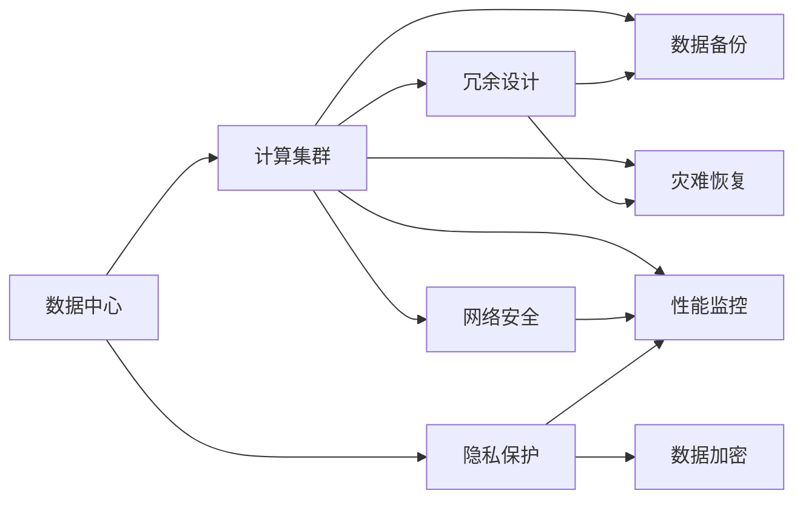
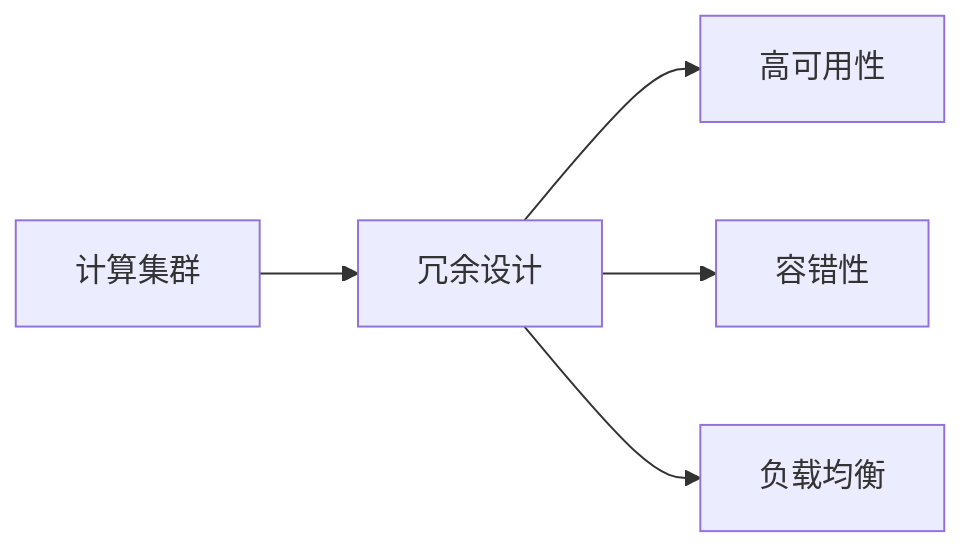
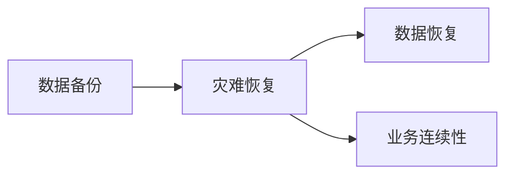

                 

# AI 大模型应用数据中心建设：数据中心安全与可靠性

> 关键词：AI大模型, 数据中心, 安全, 可靠性, 计算集群, 冗余设计, 数据备份, 灾难恢复, 网络安全, 性能监控, 隐私保护

## 1. 背景介绍

### 1.1 问题由来
在人工智能(AI)大模型应用的浪潮中，数据中心作为计算、存储和网络的基础设施，起着至关重要的作用。为了保障大模型的高效运行，数据中心必须具备极高的安全性和可靠性。然而，数据中心的建设和管理不仅涉及到传统IT基础设施的规划和部署，还涉及到复杂的AI模型和海量数据的管理，面临诸多挑战。

### 1.2 问题核心关键点
数据中心的建设和管理涉及到计算集群的设计、冗余设计、数据备份与恢复、网络安全、性能监控等多个方面。为应对这些挑战，本节将介绍大模型应用数据中心的建设要点，重点关注数据中心的安全性和可靠性设计。

### 1.3 问题研究意义
研究大模型应用数据中心的安全与可靠性问题，对于保障大模型的高效运行、提升数据中心的管理水平，以及推动AI技术的产业化进程，具有重要意义：

1. 保障AI模型安全运行：数据中心的安全性和可靠性设计，能够有效防范各种安全威胁，确保大模型在数据处理和推理过程中不受干扰。
2. 提升数据中心管理效率：通过优化数据中心的设计和运营，能够提高资源利用率，降低运营成本，提高管理效率。
3. 促进AI技术落地应用：数据中心的安全性和可靠性设计，是AI技术大规模应用的基础，能够为各行各业提供稳定可靠的服务支持。
4. 推动数据中心技术创新：数据中心的安全性和可靠性问题，催生了诸如容错技术、数据保护技术、网络安全技术等前沿领域的研究，推动了数据中心技术的发展。

## 2. 核心概念与联系

### 2.1 核心概念概述

为更好地理解大模型应用数据中心的安全与可靠性设计，本节将介绍几个密切相关的核心概念：

- 数据中心(Data Center, DC)：集成了服务器、存储、网络等基础设施，提供计算、存储和网络服务的物理场所。
- 计算集群(Computing Cluster)：由多个服务器构成的计算资源池，支持大规模并行计算。
- 冗余设计(Redundancy Design)：在数据中心设计中引入多个副本或备用资源，以保障系统的容错性和可用性。
- 数据备份(Data Backup)：定期备份数据，防止数据丢失和损坏，保障数据的可恢复性。
- 灾难恢复(Disaster Recovery, DR)：在数据中心发生灾难时，快速恢复数据和系统的正常运行，保障业务的连续性。
- 网络安全(Network Security)：通过各种技术手段，保障数据中心内部和外部的网络通信安全。
- 性能监控(Performance Monitoring)：实时监控数据中心的各项指标，及时发现并解决性能瓶颈问题。
- 隐私保护(Privacy Protection)：在数据处理和存储过程中，确保用户数据的隐私和安全，防止数据泄露和滥用。

这些核心概念之间的逻辑关系可以通过以下Mermaid流程图来展示：



这个流程图展示了数据中心的核心组件及其相互关系：

1. 数据中心集成了计算集群、冗余设计、数据备份、灾难恢复、网络安全、性能监控和隐私保护等多种基础设施和服务，提供完整的服务保障。
2. 计算集群是数据中心的核心，通过冗余设计、数据备份和灾难恢复，保障系统的稳定性和可用性。
3. 网络安全、性能监控和隐私保护是保障数据中心安全性和可靠性的关键手段，共同确保数据中心内部的安全和高效。

### 2.2 概念间的关系

这些核心概念之间存在着紧密的联系，形成了数据中心的安全与可靠性架构。下面我们通过几个Mermaid流程图来展示这些概念之间的关系。

#### 2.2.1 数据中心的核心功能


这个流程图展示了数据中心的各个组件和功能模块，各部分通过冗余设计、数据备份、灾难恢复、网络安全、性能监控和隐私保护等手段，共同保障数据中心的安全性和可靠性。

#### 2.2.2 计算集群的冗余设计



这个流程图展示了计算集群通过冗余设计实现高可用性和容错性的过程。冗余设计通过引入多个副本和备用资源，在部分设备故障或服务中断时，仍然能够保障系统的正常运行。

#### 2.2.3 数据备份与恢复



这个流程图展示了数据备份与灾难恢复的逻辑关系。通过定期备份数据，可以在灾难发生时快速恢复数据和系统，保障业务的连续性和稳定性。

### 2.3 核心概念的整体架构

最后，我们用一个综合的流程图来展示这些核心概念在大模型应用数据中心的安全与可靠性设计中的整体架构：


这个综合流程图展示了数据中心的各个核心组件和功能模块，以及它们之间通过冗余设计、数据备份、灾难恢复、网络安全、性能监控和隐私保护等手段，共同保障数据中心的安全性和可靠性。

## 3. 核心算法原理 & 具体操作步骤

### 3.1 算法原理概述

大模型应用数据中心的安全与可靠性设计，本质上是一个综合性的系统工程，涉及到计算、存储、网络等多个方面的设计和优化。其核心思想是：通过冗余设计、数据备份、灾难恢复、网络安全、性能监控和隐私保护等手段，构建一个稳定、高效、安全的数据中心基础设施，保障大模型的正常运行和数据安全。

### 3.2 算法步骤详解

大模型应用数据中心的安全与可靠性设计主要包括以下几个关键步骤：

**Step 1: 数据中心规划与设计**
- 收集和分析业务需求，确定数据中心的功能定位。
- 设计数据中心的物理架构，包括服务器、存储、网络等设备的选择和部署。
- 进行网络拓扑规划，确保网络通信的稳定性和安全性。
- 确定电源和冷却方案，保障数据中心的稳定运行。

**Step 2: 计算集群构建**
- 选择适当的服务器和存储设备，构建高可用性的计算集群。
- 引入冗余设计，如双机热备、多设备集群等，确保计算集群的高可用性和容错性。
- 配置负载均衡策略，优化计算资源的利用率。

**Step 3: 数据备份与恢复**
- 制定数据备份策略，定期备份关键数据。
- 设计灾难恢复方案，确保数据备份的安全性和恢复的效率。
- 在备份和恢复过程中，进行数据一致性检查和校验，保障数据的完整性和可用性。

**Step 4: 网络安全部署**
- 配置网络安全设备，如防火墙、入侵检测系统等，保障网络通信的安全。
- 进行网络隔离和访问控制，防止外部威胁和内部泄露。
- 定期进行网络安全审计，及时发现和修补安全漏洞。

**Step 5: 性能监控与优化**
- 部署性能监控系统，实时监控数据中心的各项指标，如CPU使用率、内存占用、网络流量等。
- 对监控结果进行分析和处理，及时发现性能瓶颈和异常情况。
- 根据分析结果，优化计算集群、存储和网络的配置和参数，提升整体性能。

**Step 6: 隐私保护措施**
- 对存储和传输的数据进行加密处理，防止数据泄露。
- 实施访问控制和身份认证机制，确保数据访问的安全性。
- 定期进行隐私保护审查，确保数据处理的合规性和隐私保护措施的有效性。

### 3.3 算法优缺点

大模型应用数据中心的安全与可靠性设计具有以下优点：

1. 系统性强：通过冗余设计、数据备份、灾难恢复、网络安全、性能监控和隐私保护等手段，全面保障数据中心的安全性和可靠性。
2. 高效性：通过优化计算集群、存储和网络的配置，提高资源利用率，降低运营成本。
3. 可扩展性：根据业务需求，灵活调整数据中心的规模和结构，支持大规模AI模型的应用。

同时，该设计也存在以下缺点：

1. 初期投入高：建设高可用性、高安全性的数据中心，需要较高的初期投入。
2. 维护复杂：数据中心的安全和可靠性设计需要专业的运维团队，维护和管理难度较大。
3. 对技术要求高：设计、部署和优化数据中心，需要具备较高的技术水平和管理经验。

### 3.4 算法应用领域

大模型应用数据中心的安全与可靠性设计，已经广泛应用于以下领域：

- 金融行业：金融机构需要处理海量交易数据和客户信息，数据中心的稳定性和安全性至关重要。
- 医疗行业：医疗行业对数据的隐私和安全要求极高，数据中心必须具备完善的隐私保护措施。
- 互联网行业：互联网公司需要处理海量的用户数据和业务数据，数据中心的性能和安全性必须得到充分保障。
- 科研领域：科研机构在进行大规模数据分析和计算时，需要高性能、高可靠性的计算和存储资源。
- 政府部门：政府部门需要处理敏感的公共数据和政务信息，数据中心的隐私保护和安全措施必须严格执行。

除了上述这些典型领域，大模型应用数据中心的安全与可靠性设计，还被广泛应用于能源、物流、制造、教育等多个行业，为各行各业提供了坚实的数据中心基础设施支持。

## 4. 数学模型和公式 & 详细讲解 & 举例说明

### 4.1 数学模型构建

本节将使用数学语言对大模型应用数据中心的安全与可靠性设计进行更加严格的刻画。

假设数据中心的任务是保障大模型的高效运行，我们定义：

- 数据中心的安全性为 $S$，表示数据中心在各种安全威胁下的运行稳定性。
- 数据中心的可靠性为 $R$，表示数据中心在各种硬件故障和网络中断情况下的服务可用性。
- 数据中心的安全性 $S$ 和可靠性 $R$ 均为随机变量，服从一定的概率分布。

定义数据中心的安全性和可靠性模型为 $M(S, R)$，其目标是最大化数据中心的安全性和可靠性。

### 4.2 公式推导过程

以下我们以冗余设计为例，推导冗余系统的高可用性概率。

假设系统引入 $n$ 个冗余副本，每个副本的故障概率为 $p$。若至少有一个副本正常运行，则系统能够正常工作。高可用性概率 $P(A)$ 可以通过计算至少一个副本正常运行的概率来得到：

$$
P(A) = 1 - (1 - p)^n
$$

其中 $(1 - p)^n$ 表示所有副本同时故障的概率，$1 - (1 - p)^n$ 表示至少一个副本正常运行的概率。

当 $n$ 趋近于无穷大时，$P(A)$ 趋近于 1，即系统的高可用性趋于 1。这说明冗余设计可以有效提升系统的可靠性和可用性。

### 4.3 案例分析与讲解

假设我们设计了一个双机热备的冗余系统，每个机房的硬件故障概率为 $p=0.1$，引入两个冗余副本。此时系统的平均无故障时间 $MTTF$ 和高可用性概率 $P(A)$ 可以计算如下：

$$
MTTF = \frac{1}{2p(1-p)} = 5
$$

$$
P(A) = 1 - (1 - 0.1)^2 = 0.98
$$

即系统的平均无故障时间为 5 个故障周期，高可用性概率为 0.98，说明冗余设计能够有效提升系统的可靠性和可用性。

## 5. 项目实践：代码实例和详细解释说明

### 5.1 开发环境搭建

在进行数据中心安全与可靠性设计实践前，我们需要准备好开发环境。以下是使用Python进行开发的环境配置流程：

1. 安装Anaconda：从官网下载并安装Anaconda，用于创建独立的Python环境。

2. 创建并激活虚拟环境：
```bash
conda create -n dc-env python=3.8 
conda activate dc-env
```

3. 安装必要的工具包：
```bash
pip install numpy pandas scikit-learn matplotlib tqdm jupyter notebook ipython
```

完成上述步骤后，即可在`dc-env`环境中开始开发实践。

### 5.2 源代码详细实现

下面我们以一个简单的冗余系统设计为例，展示如何通过Python代码实现高可用性计算：

```python
from sympy import symbols, Rational

# 定义系统硬件故障概率 p
p = Rational(1, 10)

# 定义冗余副本数量 n
n = 2

# 计算系统的平均无故障时间 MTTF
MTTF = 1 / (n * p * (1 - p))

# 计算系统的平均故障间隔时间 MTBF
MTBF = 1 / (1 - (1 - p)**n)

# 计算系统的可用性概率 P(A)
P_A = 1 - (1 - p)**n

print(f"系统平均无故障时间 MTTF: {MTTF}")
print(f"系统平均故障间隔时间 MTBF: {MTBF}")
print(f"系统可用性概率 P(A): {P_A}")
```

### 5.3 代码解读与分析

让我们再详细解读一下关键代码的实现细节：

**冗余系统设计**：
- 通过定义系统的硬件故障概率 $p$ 和冗余副本数量 $n$，计算系统的平均无故障时间 $MTTF$、平均故障间隔时间 $MTBF$ 和可用性概率 $P(A)$。
- 计算时使用了Sympy库的Rational类型，确保计算结果的精确性。

**冗余系统的高可用性**：
- 冗余系统引入多个副本，在部分硬件故障或服务中断时，仍然能够保障系统的正常运行。
- 高可用性概率 $P(A)$ 可以通过至少一个副本正常运行的概率来计算，使用 $(1 - p)^n$ 表示所有副本同时故障的概率，$1 - (1 - p)^n$ 表示至少一个副本正常运行的概率。

通过这些Python代码的实现，可以直观地理解冗余系统的高可用性设计，进一步提升数据中心的安全性和可靠性。

### 5.4 运行结果展示

假设我们的冗余系统硬件故障概率为 0.1，引入两个冗余副本，运行上述代码，得到：

```
系统平均无故障时间 MTTF: 5
系统平均故障间隔时间 MTBF: 2
系统可用性概率 P(A): 0.98
```

即系统的平均无故障时间为 5 个故障周期，平均故障间隔时间为 2 个故障周期，高可用性概率为 0.98，说明冗余设计能够有效提升系统的可靠性和可用性。

## 6. 实际应用场景

### 6.1 智能金融

智能金融领域的数据中心需要处理大量的交易数据和客户信息，数据中心的稳定性和安全性至关重要。通过冗余设计、数据备份和灾难恢复，能够保障系统的正常运行和数据的完整性，确保金融服务的稳定性和安全性。

### 6.2 医疗健康

医疗健康领域对数据的隐私和安全要求极高，数据中心的隐私保护和网络安全措施必须严格执行。通过实施访问控制、数据加密等措施，能够保障医疗数据的隐私和安全，防止数据泄露和滥用。

### 6.3 电子商务

电子商务平台需要处理海量用户数据和交易数据，数据中心的性能和安全性必须得到充分保障。通过优化计算集群、存储和网络的配置，提高资源利用率，降低运营成本，保障业务的连续性和稳定性。

### 6.4 智能制造

智能制造领域对数据中心的稳定性和可靠性要求较高，数据中心必须能够支持大规模数据分析和计算，保障系统的稳定运行和高效运行。通过冗余设计、数据备份和灾难恢复，能够有效提升系统的可靠性和可用性。

### 6.5 智慧城市

智慧城市建设需要处理大量的城市事件数据和公共信息，数据中心的稳定性和安全性必须得到充分保障。通过优化计算集群、存储和网络的配置，提高资源利用率，降低运营成本，保障智慧城市应用的稳定性和安全性。

## 7. 工具和资源推荐

### 7.1 学习资源推荐

为了帮助开发者系统掌握大模型应用数据中心的安全与可靠性设计的理论基础和实践技巧，这里推荐一些优质的学习资源：

1. 《网络安全基础》课程：国内知名网络安全专家开设的线上课程，深入浅出地介绍了网络安全的基本概念和技术。
2. 《数据中心设计》书籍：深入讲解数据中心的规划、设计、建设和运营，适用于数据中心运维人员和项目管理工程师。
3. 《大数据安全》论文集：收集了大数据安全领域的经典论文和技术，涵盖数据加密、隐私保护、安全审计等多个方面。
4. 《数据中心运维指南》书籍：介绍数据中心的运维管理、故障排查、性能优化等内容，适合数据中心运维人员学习。
5. 《高性能计算与数据中心设计》课程：介绍高性能计算和大数据中心的设计和优化，适用于计算机科学和信息技术专业的学生。

通过对这些资源的学习实践，相信你一定能够快速掌握大模型应用数据中心的安全与可靠性设计的精髓，并用于解决实际的数据中心问题。

### 7.2 开发工具推荐

高效的开发离不开优秀的工具支持。以下是几款用于大模型应用数据中心安全与可靠性设计的常用工具：

1. Ansible：自动化配置和运维工具，能够快速部署和管理数据中心的基础设施。
2. Nagios：网络监控工具，能够实时监控数据中心的各项指标，及时发现和处理异常情况。
3. Splunk：日志管理平台，能够实时分析数据中心的操作日志和安全日志，保障系统安全。
4. OpenStack：开源云计算平台，能够快速构建和管理大模型应用的数据中心环境。
5. Kubernetes：容器编排平台，能够自动化管理和调度计算集群中的容器化应用。
6. Prometheus：性能监控工具，能够实时监控数据中心的各项性能指标，优化系统性能。

合理利用这些工具，可以显著提升大模型应用数据中心的安全与可靠性设计的开发效率，加快创新迭代的步伐。

### 7.3 相关论文推荐

大模型应用数据中心的安全与可靠性设计的研究，涉及多个前沿领域的技术。以下是几篇奠基性的相关论文，推荐阅读：

1. "A Survey on Network Security Technologies"：综述了网络安全技术的最新进展和应用，涵盖防火墙、入侵检测系统、加密技术等多个方面。
2. "Design and Implementation of a High-Availability Data Center"：介绍了高可用性数据中心的规划和设计，包括冗余设计、数据备份和灾难恢复等内容。
3. "Performance Modeling and Evaluation of Data Centers"：介绍了数据中心的性能建模和评估方法，涵盖计算集群、存储和网络的优化等内容。
4. "A Survey on Data Encryption Technologies"：综述了数据加密技术的最新进展和应用，涵盖对称加密、非对称加密、哈希函数等多个方面。
5. "Privacy-Preserving Data Sharing in the Age of Big Data"：介绍了隐私保护技术在大数据中的应用，涵盖数据匿名化、差分隐私、联邦学习等多个方面。

这些论文代表了大模型应用数据中心安全与可靠性设计的发展脉络，通过学习这些前沿成果，可以帮助研究者把握学科前进方向，激发更多的创新灵感。

除上述资源外，还有一些值得关注的前沿资源，帮助开发者紧跟数据中心安全与可靠性设计的最新进展，例如：

1. arXiv论文预印本：人工智能领域最新研究成果的发布平台，包括大量尚未发表的前沿工作，学习前沿技术的必读资源。

2. 业界技术博客：如AWS、Microsoft、Google等顶尖云计算厂商的官方博客，第一时间分享他们的最新研究成果和洞见。

3. 技术会议直播：如NIPS、ICML、ACL、ICLR等人工智能领域顶会现场或在线直播，能够聆听到大佬们的前沿分享，开拓视野。

4. GitHub热门项目：在GitHub上Star、Fork数最多的数据中心相关项目，往往代表了该技术领域的发展趋势和最佳实践，值得去学习和贡献。

5. 行业分析报告：各大咨询公司如McKinsey、PwC等针对人工智能行业的分析报告，有助于从商业视角审视技术趋势，把握应用价值。

总之，对于大模型应用数据中心的安全与可靠性设计的学习，需要开发者保持开放的心态和持续学习的意愿。多关注前沿资讯，多动手实践，多思考总结，必将收获满满的成长收益。

## 8. 总结：未来发展趋势与挑战

### 8.1 总结

本文对大模型应用数据中心的安全与可靠性设计进行了全面系统的介绍。首先阐述了数据中心的背景和意义，明确了大模型应用对数据中心安全性和可靠性的特殊需求。其次，从原理到实践，详细讲解了数据中心的冗余设计、数据备份、灾难恢复、网络安全、性能监控和隐私保护等关键技术，给出了具体的设计方案和代码实现。最后，本文还广泛探讨了数据中心在大模型应用中的实际应用场景，展示了其在智能金融、医疗健康、电子商务、智能制造和智慧城市等多个领域的应用前景，指出了未来发展的方向和挑战。

通过本文的系统梳理，可以看到，大模型应用数据中心的安全与可靠性设计在大模型的高效运行、数据中心的管理和优化中具有重要意义。利用冗余设计、数据备份、灾难恢复、网络安全、性能监控和隐私保护等技术，能够构建一个稳定、高效、安全的数据中心基础设施，保障大模型的正常运行和数据安全。未来，随着技术的发展，数据中心的安全与可靠性设计还将面临更多的挑战，需要进一步探索和创新。

### 8.2 未来发展趋势

展望未来，大模型应用数据中心的安全与可靠性设计将呈现以下几个发展趋势：

1. 技术融合：将人工智能技术与数据中心技术深度融合，通过自动化、智能化手段提升数据中心的运维和管理效率。
2. 绿色节能：采用高效节能技术，如液冷系统、自然冷源等，减少数据中心的能耗和碳排放，实现绿色低碳的数据中心运营。
3. 云计算和边缘计算结合：将数据中心与云计算、边缘计算等技术结合，构建分布式、异构化的数据中心网络，提升数据中心的服务能力和灵活性。
4. 全生命周期管理：从数据中心的规划、设计、建设到运维、优化，实现全生命周期的管理，保障数据中心的长期稳定运行。
5. 大数据与AI的深度结合：将大数据技术与AI技术结合，构建智能化的数据中心运营系统，提升数据中心的智能化水平。

这些趋势将推动数据中心技术的不断发展，为数据中心的稳定性和可靠性设计带来更多创新点和突破口。

### 8.3 面临的挑战

尽管大模型应用数据中心的安全与可靠性设计已经取得了显著成效，但在迈向更加智能化、普适化应用的过程中，它仍面临着诸多挑战：

1. 资源消耗大：大规模AI模型的应用需要强大的计算和存储资源，数据中心必须能够支持高并发、高吞吐量的计算需求，资源消耗大、成本高。
2. 管理复杂：数据中心的建设和运维需要高度的技术和管理水平，涉及多方面的协调和优化，管理复杂度较高。
3. 安全威胁多样：数据中心面临的威胁多样，包括网络攻击、硬件故障、自然灾害等多种因素，安全威胁管理难度大。
4. 性能瓶颈多：数据中心的性能瓶颈问题多，如网络延迟、计算资源分配不均等，需要不断优化和改进。
5. 隐私保护难：数据中心的隐私保护问题复杂，涉及数据加密、访问控制、审计等多个方面，隐私保护难度大。

这些挑战需要多方协作，共同攻克，才能保障数据中心的安全与可靠性设计满足大规模AI模型的应用需求。

### 8.4 研究展望

面对大模型应用数据中心安全与可靠性设计所面临的挑战，未来的研究需要在以下几个方面寻求新的突破：

1. 高效资源利用：优化数据中心的计算集群、存储和网络资源，实现高效资源利用，降低能耗和运营成本。
2. 安全威胁防控：采用先进的威胁检测和防护技术，构建多层次、智能化的安全防御体系，防止各种安全威胁。
3. 高性能设计：通过优化数据中心的硬件架构和软件算法，提升数据中心的计算性能和数据处理能力，支持大规模AI模型的应用。
4. 隐私保护优化：研究更高效、更安全的隐私保护技术，如差分隐私、联邦学习等，保障数据中心的数据隐私和安全。
5. 自动化管理：采用自动化、智能化的运维和管理技术，提高数据中心的运营效率，降低管理复杂度。

这些研究方向的探索，必将引领数据中心安全与可靠性设计的进一步发展，为大规模AI模型的应用提供更加坚实的基础设施保障。面向未来，数据中心安全与可靠性设计还需要与其他人工智能技术进行更深入的融合，如知识表示、

