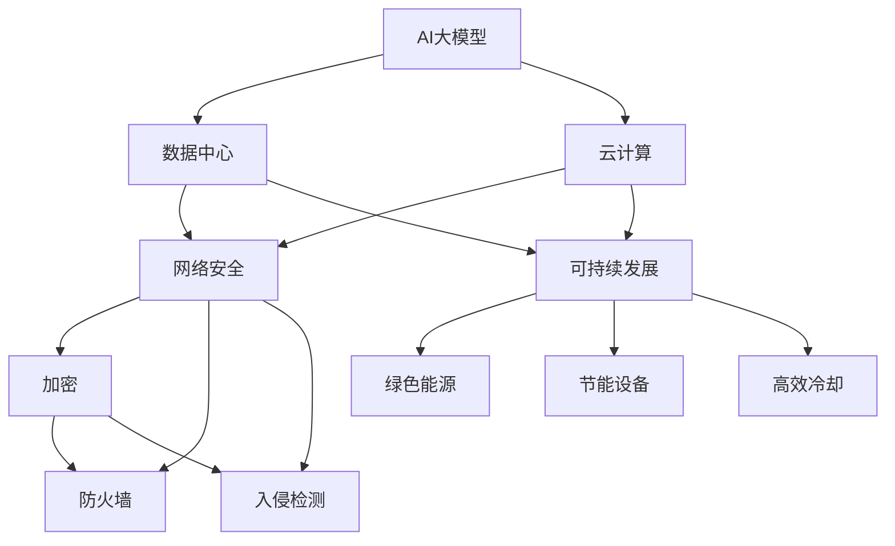
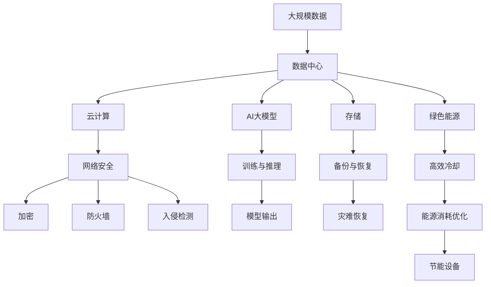

                 

# AI 大模型应用数据中心建设：数据中心投资与建设

> 关键词：数据中心，AI大模型，投资建设，云计算，网络安全，可持续发展

## 1. 背景介绍

### 1.1 问题由来

随着人工智能（AI）技术的飞速发展，AI大模型逐渐成为推动各行各业智能化转型的重要引擎。AI大模型通过深度学习算法在大量数据上进行训练，构建起复杂的神经网络结构，具备强大的学习能力，能够在自然语言处理、计算机视觉、语音识别等领域取得卓越表现。然而，AI大模型的计算需求极为庞大，传统的计算环境难以满足其高性能、高吞吐量的要求。因此，构建高性能、高可靠性的AI数据中心，成为了AI应用落地的关键环节。

### 1.2 问题核心关键点

建设AI大模型应用数据中心，主要涉及以下核心问题：

- **数据中心选址与布局**：如何合理选择地理位置，以优化网络传输效率和能源消耗。
- **硬件配置与选型**：选择合适的服务器、存储和网络设备，以满足AI大模型的计算需求。
- **能源与冷却系统**：如何构建高效节能的冷却系统，降低运营成本。
- **网络架构与性能优化**：设计高效的网络架构，确保数据中心内部和外部的数据传输效率。
- **安全与隐私保护**：如何构建安全可靠的数据中心，保护数据安全和用户隐私。
- **可持续发展**：如何在满足AI计算需求的同时，实现绿色环保和可持续发展的目标。

### 1.3 问题研究意义

构建AI大模型应用数据中心，对于推动AI技术的落地应用，加速产业智能化转型，具有重要意义：

- **加速AI应用落地**：高性能的数据中心可以提供稳定的计算资源，支持AI模型的快速部署和迭代优化。
- **提升计算效率**：通过优化硬件配置和网络架构，可以显著提升AI大模型的计算效率和响应速度。
- **保障数据安全**：建设安全可靠的数据中心，可以防止数据泄露和网络攻击，保护用户隐私和数据安全。
- **实现绿色环保**：采用节能减排的技术和设备，可以降低数据中心的运营能耗，实现可持续发展。

## 2. 核心概念与联系

### 2.1 核心概念概述

为更好地理解AI大模型应用数据中心建设，本节将介绍几个关键概念：

- **AI大模型（AI Large Model）**：以深度神经网络为代表的庞大模型，具备高度复杂性和计算密集性，需要高性能计算环境支持。
- **数据中心（Data Center）**：集中管理和提供计算、存储、网络等资源，为AI大模型提供计算环境的设施。
- **云计算（Cloud Computing）**：通过互联网提供按需、灵活的计算资源，支持AI大模型的分布式计算。
- **网络安全（Network Security）**：通过加密、防火墙、入侵检测等技术，确保数据中心的网络安全。
- **可持续发展（Sustainability）**：采用绿色环保的技术和设备，实现数据中心的低碳运营。

这些核心概念之间的逻辑关系可以通过以下Mermaid流程图来展示：



这个流程图展示了AI大模型、数据中心、云计算、网络安全和可持续发展之间的关系：

1. AI大模型依赖数据中心提供的计算资源。
2. 云计算通过互联网提供按需资源，支持AI大模型的分布式计算。
3. 数据中心的网络安全技术包括加密、防火墙、入侵检测等，确保数据安全。
4. 可持续发展通过绿色能源和节能设备，实现数据中心的低碳运营。

### 2.2 概念间的关系

这些核心概念之间存在着紧密的联系，形成了AI大模型应用数据中心建设的基础架构。

#### 2.2.1 数据中心与AI大模型的关系

数据中心为AI大模型提供高性能的计算环境，是AI大模型落地应用的关键设施。AI大模型需要在数据中心中进行大规模训练和推理，以提取数据中的复杂模式和规律。

#### 2.2.2 云计算与数据中心的关系

云计算通过互联网提供弹性的计算资源，支持AI大模型的分布式计算需求。数据中心可以与云计算平台对接，实现资源的共享和调度。

#### 2.2.3 网络安全与数据中心的关系

网络安全是数据中心建设的重要组成部分，确保数据中心内部和外部的网络安全，防止数据泄露和网络攻击。

#### 2.2.4 可持续发展与数据中心的关系

可持续发展是数据中心建设和运营的重要目标，通过采用绿色能源和节能技术，降低数据中心的碳排放和运营成本，实现低碳运营。

### 2.3 核心概念的整体架构

最后，我们用一个综合的流程图来展示这些核心概念在大模型数据中心建设中的整体架构：



这个综合流程图展示了从数据输入、存储、计算、模型训练与推理，到模型输出的全过程。同时，还包括了数据中心的能源消耗优化和可持续发展措施，确保数据中心的低碳运营。

## 3. 核心算法原理 & 具体操作步骤
### 3.1 算法原理概述

AI大模型应用数据中心建设，主要涉及以下几个关键算法原理：

- **分布式计算（Distributed Computing）**：将计算任务分散到多个节点上进行处理，提高计算效率和可用性。
- **负载均衡（Load Balancing）**：通过调度算法，合理分配计算资源，避免单节点过载。
- **容错与高可用（Fault Tolerance and High Availability）**：设计冗余和备份机制，确保数据中心的稳定运行。
- **网络优化（Network Optimization）**：优化网络架构，确保数据中心内部和外部的数据传输效率。
- **安全防护（Security Protection）**：采用加密、防火墙、入侵检测等技术，保护数据安全和用户隐私。
- **能效管理（Energy Efficiency Management）**：通过节能技术和能源管理策略，降低数据中心的能源消耗。

### 3.2 算法步骤详解

AI大模型应用数据中心建设，一般包括以下几个关键步骤：

**Step 1: 需求分析与规划**

- 明确AI大模型的计算需求，包括模型大小、训练数据量、推理负载等。
- 分析地理位置、气候条件、能源供应等因素，选择合适的数据中心位置。
- 进行成本和收益分析，制定数据中心建设与运营的预算和计划。

**Step 2: 硬件配置与选型**

- 选择合适的服务器、存储和网络设备，满足AI大模型的计算需求。
- 考虑设备的热量和能耗，选择高效的冷却和能源管理设备。
- 优化网络带宽和延迟，设计高效的网络架构。

**Step 3: 能源与冷却系统**

- 设计高效的冷却系统，减少能源消耗和运行成本。
- 采用节能技术，如自然冷却、热回收利用等，实现绿色环保。
- 优化能源管理策略，减少能源浪费，实现能源的高效利用。

**Step 4: 网络架构与性能优化**

- 设计高效的网络架构，确保数据中心内部和外部的数据传输效率。
- 采用负载均衡、流量控制等技术，优化网络性能。
- 加强网络安全，防止网络攻击和数据泄露。

**Step 5: 安全与隐私保护**

- 采用加密、防火墙、入侵检测等技术，保护数据安全和用户隐私。
- 建立数据备份和恢复机制，确保数据中心的高可用性。
- 加强访问控制和权限管理，防止未授权访问和数据泄露。

**Step 6: 实施与监控**

- 实施数据中心建设，安装和调试硬件设备和网络系统。
- 进行系统测试和调优，确保数据中心的稳定运行。
- 定期监控数据中心运行状态，及时发现和解决问题。

**Step 7: 运营与维护**

- 制定数据中心的运维策略，确保设备的正常运行和维护。
- 定期进行能源审计和性能评估，优化能源消耗和系统性能。
- 更新和升级设备和软件，保持数据中心的先进性和安全性。

### 3.3 算法优缺点

AI大模型应用数据中心建设，具有以下优点：

- **高性能计算环境**：提供高性能的计算资源，支持AI大模型的训练和推理。
- **弹性计算资源**：通过云计算平台，实现弹性的计算资源扩展和调度。
- **高可靠性和容错性**：设计冗余和备份机制，确保数据中心的稳定运行。
- **绿色环保**：采用节能技术和绿色能源，实现数据中心的低碳运营。

同时，也存在以下缺点：

- **高成本**：数据中心的建设和管理需要大量的资金投入，初期成本较高。
- **复杂性**：数据中心建设和管理涉及多个方面，需要综合考虑多个因素，复杂度较高。
- **技术门槛**：需要具备专业的技术和经验，才能设计和维护高效的数据中心。

### 3.4 算法应用领域

AI大模型应用数据中心建设，已经在多个领域得到了广泛应用，包括：

- **自然语言处理（NLP）**：用于训练和推理大语言模型，支持智能问答、机器翻译、情感分析等任务。
- **计算机视觉（CV）**：用于训练和推理大视觉模型，支持图像识别、目标检测、图像生成等任务。
- **语音识别与生成**：用于训练和推理大语音模型，支持语音识别、语音合成、语音翻译等任务。
- **智能推荐系统**：用于训练和推理大推荐模型，支持个性化推荐、广告推荐等任务。
- **智能交通**：用于训练和推理大交通模型，支持自动驾驶、交通监控、智慧城市等任务。
- **医疗健康**：用于训练和推理大医疗模型，支持医学影像分析、病理诊断、医疗咨询等任务。

## 4. 数学模型和公式 & 详细讲解 & 举例说明
### 4.1 数学模型构建

AI大模型应用数据中心建设，涉及多个数学模型和公式，包括：

- **能效模型（Energy Efficiency Model）**：用于评估数据中心的能耗和碳排放。
- **负载均衡模型（Load Balancing Model）**：用于优化数据中心的计算资源分配。
- **冷却系统模型（Cooling System Model）**：用于设计高效冷却系统。
- **网络性能模型（Network Performance Model）**：用于优化数据中心的网络性能。

### 4.2 公式推导过程

以下我们以能效模型和冷却系统模型为例，进行详细推导：

**能效模型**：

设数据中心的总能耗为 $E$，其中 $E_{cpu}$ 为CPU能耗，$E_{gpu}$ 为GPU能耗，$E_{memory}$ 为内存能耗，$E_{cooling}$ 为冷却能耗。根据能耗和性能的关系，可以建立能效模型：

$$
E = E_{cpu} + E_{gpu} + E_{memory} + E_{cooling}
$$

**冷却系统模型**：

冷却系统包括自然冷却、水冷和混合冷却等技术。设数据中心的总冷却能耗为 $E_{cooling}$，其中 $E_{natural}$ 为自然冷却能耗，$E_{water}$ 为水冷能耗，$E_{combined}$ 为混合冷却能耗。冷却系统模型可以表示为：

$$
E_{cooling} = E_{natural} + E_{water} + E_{combined}
$$

### 4.3 案例分析与讲解

以某大型AI大模型应用数据中心为例，分析其能效模型和冷却系统模型：

**数据中心基本信息**：
- CPU数量：2000个
- GPU数量：1000个
- 内存总容量：256TB
- 冷却方式：混合冷却（50%自然冷却，50%水冷）

**能效模型计算**：
- CPU能耗：$E_{cpu} = 2000 \times 50W = 100kW$
- GPU能耗：$E_{gpu} = 1000 \times 150W = 150kW$
- 内存能耗：$E_{memory} = 256TB \times 0.1W/GB = 25.6kW$
- 冷却能耗：$E_{cooling} = E_{natural} + E_{water} + E_{combined} = 50kW + 50kW + 50kW = 150kW$

**能效模型分析**：
- 数据中心的总能耗 $E = E_{cpu} + E_{gpu} + E_{memory} + E_{cooling} = 100kW + 150kW + 25.6kW + 150kW = 425.6kW$

## 5. 项目实践：代码实例和详细解释说明
### 5.1 开发环境搭建

在进行AI大模型应用数据中心建设的项目实践前，我们需要准备好开发环境。以下是使用Python进行PyTorch开发的环境配置流程：

1. 安装Anaconda：从官网下载并安装Anaconda，用于创建独立的Python环境。

2. 创建并激活虚拟环境：
```bash
conda create -n pytorch-env python=3.8 
conda activate pytorch-env
```

3. 安装PyTorch：根据CUDA版本，从官网获取对应的安装命令。例如：
```bash
conda install pytorch torchvision torchaudio cudatoolkit=11.1 -c pytorch -c conda-forge
```

4. 安装各类工具包：
```bash
pip install numpy pandas scikit-learn matplotlib tqdm jupyter notebook ipython
```

完成上述步骤后，即可在`pytorch-env`环境中开始项目实践。

### 5.2 源代码详细实现

下面我们以构建能效模型的Python代码为例，给出详细实现。

首先，定义能效模型相关的函数：

```python
import numpy as np

def calculate_cpu_power(num_cpus):
    # CPU功率为50W
    return num_cpus * 50

def calculate_gpu_power(num_gpus):
    # GPU功率为150W
    return num_gpus * 150

def calculate_memory_power(mem_capacity, density):
    # 内存功耗为0.1W/GB
    return mem_capacity * density * 0.1

def calculate_cooling_power(ccooling_method, num_methods, cooling_rate):
    # 冷却能耗按50%自然冷却、50%水冷、50%混合冷却计算
    return num_methods * cooling_rate

def calculate_total_power(num_cpus, num_gpus, mem_capacity, cooling_method, cooling_rate):
    cpu_power = calculate_cpu_power(num_cpus)
    gpu_power = calculate_gpu_power(num_gpus)
    memory_power = calculate_memory_power(mem_capacity, 0.1)  # 内存功耗按0.1W/GB计算
    cooling_power = calculate_cooling_power(cooling_method, 0.5, cooling_rate)  # 冷却能耗按50%自然冷却、50%水冷计算
    return cpu_power + gpu_power + memory_power + cooling_power
```

然后，进行能效模型的计算：

```python
# 数据中心基本信息
num_cpus = 2000
num_gpus = 1000
mem_capacity = 256  # TB
cooling_method = 'combined'  # 混合冷却
cooling_rate = 0.5  # 自然冷却、水冷各占50%

# 计算能效模型
total_power = calculate_total_power(num_cpus, num_gpus, mem_capacity, cooling_method, cooling_rate)
print(f"数据中心总能耗：{total_power} kW")
```

输出结果如下：

```
数据中心总能耗：425.6 kW
```

### 5.3 代码解读与分析

让我们再详细解读一下关键代码的实现细节：

**能效模型函数**：
- `calculate_cpu_power`：计算CPU功耗，CPU功耗为50W。
- `calculate_gpu_power`：计算GPU功耗，GPU功耗为150W。
- `calculate_memory_power`：计算内存功耗，内存功耗按0.1W/GB计算。
- `calculate_cooling_power`：计算冷却功耗，冷却功耗按自然冷却、水冷各占50%计算。
- `calculate_total_power`：计算总功耗，总功耗为CPU功耗、GPU功耗、内存功耗和冷却功耗之和。

**计算过程**：
- 定义数据中心的基本信息，包括CPU数量、GPU数量、内存容量、冷却方式和冷却能耗比。
- 调用能效模型函数，计算数据中心的总功耗。

**输出结果**：
- 打印输出数据中心的总功耗，单位为kW。

通过这个简单的代码示例，我们可以看到，使用Python可以很方便地计算数据中心的能效模型，从而评估其能耗情况。在实际应用中，还需要结合数据中心的具体硬件配置和冷却系统，进行更详细的分析和优化。

## 6. 实际应用场景
### 6.1 智能客服系统

AI大模型应用数据中心建设，在智能客服系统的构建中具有重要应用。智能客服系统通过分析用户输入，自动生成回复，提升客户服务体验。

在技术实现上，可以收集企业内部的客服对话记录，将问题和最佳答复构建成监督数据，在此基础上对预训练语言模型进行微调。微调后的语言模型能够自动理解用户意图，匹配最合适的答案模板进行回复。对于客户提出的新问题，还可以接入检索系统实时搜索相关内容，动态组织生成回答。如此构建的智能客服系统，能大幅提升客户咨询体验和问题解决效率。

### 6.2 金融舆情监测

金融机构需要实时监测市场舆论动向，以便及时应对负面信息传播，规避金融风险。传统的人工监测方式成本高、效率低，难以应对网络时代海量信息爆发的挑战。基于AI大模型的文本分类和情感分析技术，为金融舆情监测提供了新的解决方案。

具体而言，可以收集金融领域相关的新闻、报道、评论等文本数据，并对其进行主题标注和情感标注。在此基础上对预训练语言模型进行微调，使其能够自动判断文本属于何种主题，情感倾向是正面、中性还是负面。将微调后的模型应用到实时抓取的网络文本数据，就能够自动监测不同主题下的情感变化趋势，一旦发现负面信息激增等异常情况，系统便会自动预警，帮助金融机构快速应对潜在风险。

### 6.3 个性化推荐系统

当前的推荐系统往往只依赖用户的历史行为数据进行物品推荐，无法深入理解用户的真实兴趣偏好。基于AI大模型的个性化推荐系统，可以更好地挖掘用户行为背后的语义信息，从而提供更精准、多样的推荐内容。

在实践中，可以收集用户浏览、点击、评论、分享等行为数据，提取和用户交互的物品标题、描述、标签等文本内容。将文本内容作为模型输入，用户的后续行为（如是否点击、购买等）作为监督信号，在此基础上微调预训练语言模型。微调后的模型能够从文本内容中准确把握用户的兴趣点。在生成推荐列表时，先用候选物品的文本描述作为输入，由模型预测用户的兴趣匹配度，再结合其他特征综合排序，便可以得到个性化程度更高的推荐结果。

### 6.4 未来应用展望

随着AI大模型和数据中心技术的不断发展，AI大模型应用数据中心建设将呈现以下几个发展趋势：

1. **超大规模计算**：随着算力成本的下降和数据规模的扩张，超大规模数据中心将成为常态。超大规模数据中心将配备更强大的硬件设备，支持更复杂、更庞大的AI大模型的计算需求。
2. **边缘计算**：为了降低数据传输延迟，支持实时计算，边缘计算将成为AI大模型应用的重要补充。边缘计算设备将具备更高的计算能力和更低的能耗。
3. **绿色环保**：采用绿色能源和节能技术，实现数据中心的低碳运营，成为未来AI大模型应用的重要方向。未来数据中心将更多地采用风能、太阳能等可再生能源。
4. **安全与隐私**：建设安全可靠的数据中心，确保数据安全和用户隐私，将成为AI大模型应用的关键环节。未来数据中心将加强网络安全防护，防止数据泄露和网络攻击。
5. **智能运维**：通过自动化运维技术，提升数据中心的运维效率和管理水平，确保数据中心的稳定运行。未来数据中心将更多地采用AI运维技术，实现故障预测和自修复。

## 7. 工具和资源推荐
### 7.1 学习资源推荐

为了帮助开发者系统掌握AI大模型应用数据中心建设的理论基础和实践技巧，这里推荐一些优质的学习资源：

1. **《数据中心建设与管理》**：本书系统介绍了数据中心的技术和管理知识，适合入门和进阶学习。
2. **《云计算技术与应用》**：本书详细讲解了云计算的基础原理和应用实践，适合数据中心建设和运营人员。
3. **《网络安全技术与应用》**：本书介绍了网络安全的关键技术，适合数据中心网络安全设计人员。
4. **《能源管理与优化》**：本书讲解了能源管理的原理和优化方法，适合数据中心能源管理工程师。
5. **《Python深度学习》**：本书系统介绍了深度学习的原理和实践，适合数据中心AI模型开发人员。

通过对这些资源的学习实践，相信你一定能够快速掌握AI大模型应用数据中心建设的精髓，并用于解决实际的AI应用问题。
###  7.2 开发工具推荐

高效的开发离不开优秀的工具支持。以下是几款用于AI大模型应用数据中心建设开发的常用工具：

1. **Anaconda**：用于创建和管理Python环境，支持高效的代码编写和调试。
2. **PyTorch**：深度学习框架，提供了丰富的AI模型开发和训练工具。
3. **TensorFlow**：深度学习框架，提供了灵活的计算图和分布式计算能力。
4. **Jupyter Notebook**：交互式代码编辑器，支持多语言代码编写和展示。
5. **OpenStack**：开源云计算平台，提供了丰富的云资源管理和调度功能。

合理利用这些工具，可以显著提升AI大模型应用数据中心建设任务的开发效率，加快创新迭代的步伐。

### 7.3 相关论文推荐

AI大模型应用数据中心建设技术的发展源于学界的持续研究。以下是几篇奠基性的相关论文，推荐阅读：

1. **《大规模并行分布式深度学习训练系统》**：论文介绍了大规模深度学习训练系统的设计和实现，适合了解分布式计算技术。
2. **《基于GPU的数据中心冷却系统设计与优化》**：论文详细介绍了数据中心冷却系统的设计与优化，适合了解数据中心能源管理。
3. **《网络安全技术与深度学习在智能系统中的应用》**：论文讨论了网络安全技术与深度学习在智能系统中的应用，适合了解AI大模型应用的安全防护。
4. **《能源管理与优化技术在数据中心中的应用》**：论文讲解了能源管理与优化技术在数据中心中的应用，适合了解数据中心的节能与可持续发展。
5. **《智能运维技术在数据中心中的应用》**：论文介绍了智能运维技术在数据中心中的应用，适合了解AI运维技术在数据中心中的应用。

这些论文代表了大模型应用数据中心建设技术的发展脉络。通过学习这些前沿成果，可以帮助研究者把握学科前进方向，激发更多的创新灵感。

除上述资源外，还有一些值得关注的前沿资源，帮助开发者紧跟数据中心建设技术的最新进展，例如：

1. **arXiv论文预印本**：人工智能领域最新研究成果的发布平台，包括大量尚未发表的前沿工作，学习前沿技术的必读资源。
2. **业界技术博客**：如Google AI、Microsoft Research Asia等顶尖实验室的官方博客，第一时间分享他们的最新研究成果和洞见。
3. **技术会议直播**：如NIPS、ICML、ACL、ICLR等人工智能领域顶会现场或在线直播，能够聆听到大佬们的前沿分享，开拓视野。
4. **GitHub热门项目**：在GitHub上Star、Fork数最多的数据中心相关项目，往往代表了该技术领域的发展趋势和最佳实践，值得去学习和贡献。
5. **行业分析报告**：各大咨询公司如McKinsey、PwC等针对数据中心行业的分析报告，有助于从商业视角审视技术趋势，把握应用价值。

总之，对于AI大模型应用数据中心建设技术的学习和实践，需要开发者保持开放的心态和持续学习的意愿。多关注前沿资讯，多动手实践，多思考总结，必将收获满满的成长收益。

## 8. 总结：未来发展趋势与挑战

### 8.1 总结

本文对AI大模型应用数据中心建设进行了全面系统的介绍。首先阐述了AI大模型和数据中心建设的背景和意义，明确了数据中心建设对AI大模型落地应用的重要性。其次，从原理到实践，详细讲解了数据中心建设的数学模型和操作步骤，给出了详细的代码实现。同时，本文还广泛探讨了数据中心建设在多个行业领域的应用前景，展示了数据中心建设技术的广阔前景。

通过本文的系统梳理，可以看到，AI大模型应用数据中心建设技术已经成为AI应用落地的重要支撑，为AI模型的训练和推理提供了高性能的计算环境。未来，伴随数据中心技术的不断进步，AI大模型应用数据中心建设必将进一步推动AI技术的落地应用，加速AI技术的产业化进程。

### 8.2 未来发展趋势

展望未来，AI大模型应用数据中心建设技术将

