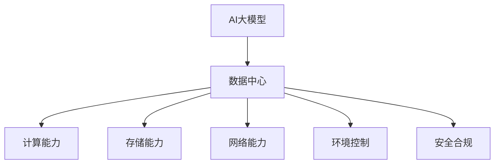
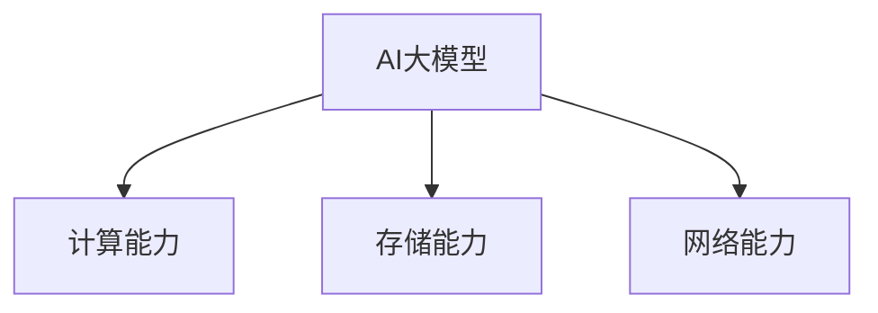
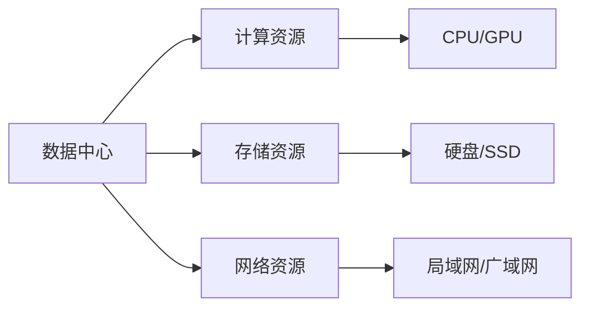
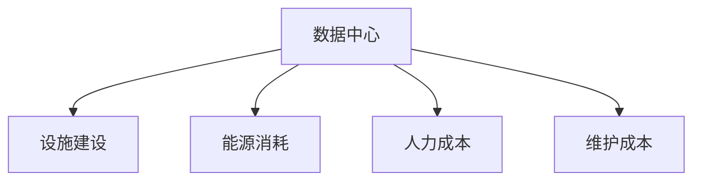
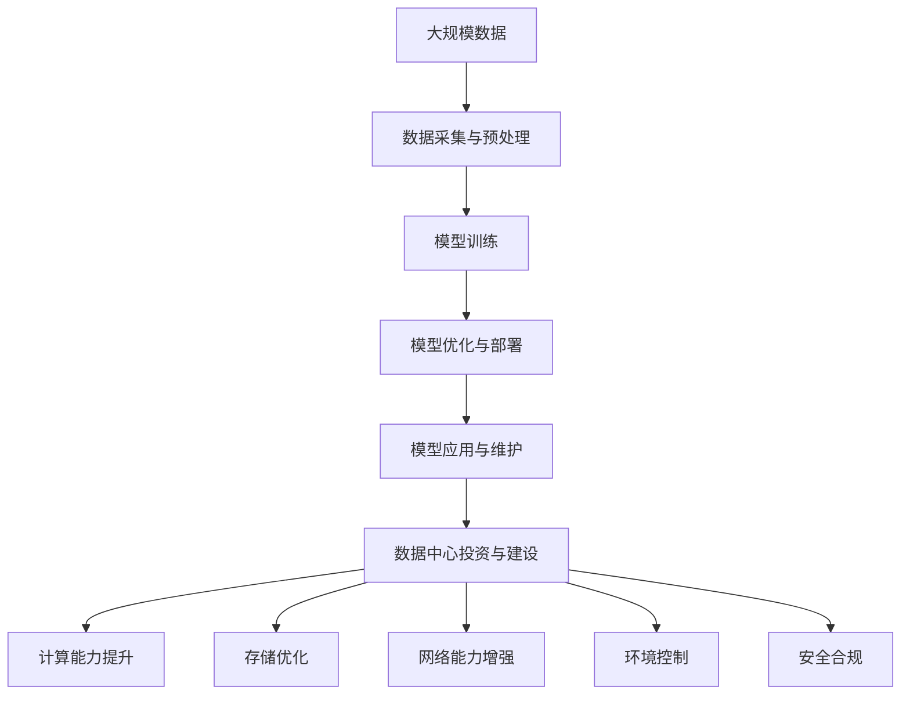

                 

# AI 大模型应用数据中心建设：数据中心投资与建设

> 关键词：AI大模型, 数据中心投资, 数据中心建设, 计算能力提升, 存储优化

## 1. 背景介绍

### 1.1 问题由来
近年来，人工智能（AI）和大模型技术的迅猛发展，对数据中心的需求日益增长。特别是对于需要大量计算和存储资源的AI大模型应用，传统数据中心已经难以满足其需求。为了支持AI大模型的高效运行，数据中心的投资和建设变得至关重要。

### 1.2 问题核心关键点
数据中心投资与建设的重点是构建一个能够满足AI大模型计算和存储需求的高效、可扩展、安全、环保的设施。这包括选择合适的物理位置、设计合理的架构、优化硬件和软件设施、以及确保数据中心的安全和合规性。

### 1.3 问题研究意义
研究AI大模型应用数据中心的投资与建设，对于支持AI技术的广泛应用，提升业务创新能力，降低运营成本，具有重要意义。通过对数据中心投资与建设的研究，可以更好地规划和部署资源，支持企业持续创新，实现业务增长。

## 2. 核心概念与联系

### 2.1 核心概念概述

为了更好地理解AI大模型应用数据中心的投资与建设，本节将介绍几个密切相关的核心概念：

- AI大模型：以深度学习为基础，通过大规模数据训练得到的通用或特定领域的智能模型，具备强大的学习能力和通用性。

- 数据中心（DC）：提供计算、存储、网络等资源的设施，是企业IT基础设施的核心组成部分。

- 计算能力：数据中心提供的高性能计算资源，包括CPU、GPU、FPGA等硬件设备，以及软件环境。

- 存储能力：数据中心提供的存储资源，包括硬盘、SSD、磁带等物理介质，以及相应的存储管理软件。

- 网络能力：数据中心提供的高速网络资源，包括局域网、广域网、数据传输速率等。

- 环境控制：数据中心内的温度、湿度、电力等环境参数的控制和管理。

- 安全合规：数据中心的安全措施和合规性要求，包括物理安全、网络安全、数据保护等方面。

这些概念之间的逻辑关系可以通过以下Mermaid流程图来展示：



这个流程图展示了AI大模型应用数据中心的核心概念及其之间的关系：AI大模型需要数据中心提供计算、存储和网络资源，同时需要良好的环境控制和严格的安全合规措施。

### 2.2 概念间的关系

这些核心概念之间存在着紧密的联系，形成了AI大模型应用数据中心的完整生态系统。下面我们通过几个Mermaid流程图来展示这些概念之间的关系。

#### 2.2.1 AI大模型的资源需求



这个流程图展示了AI大模型在运行过程中对计算、存储和网络资源的需求。

#### 2.2.2 数据中心的能力划分



这个流程图展示了数据中心提供的各种资源及其具体类型。

#### 2.2.3 数据中心的成本结构



这个流程图展示了数据中心的成本结构，包括设施建设、能源消耗、人力成本和维护成本。

### 2.3 核心概念的整体架构

最后，我们用一个综合的流程图来展示这些核心概念在大模型应用数据中心投资与建设中的整体架构：



这个综合流程图展示了从数据采集与预处理，到模型训练、优化与部署，再到模型应用与维护的完整流程，以及数据中心投资与建设在大模型应用中的重要角色。

## 3. 核心算法原理 & 具体操作步骤
### 3.1 算法原理概述

AI大模型应用数据中心的投资与建设，本质上是一个多维度、多层面的决策过程。其核心算法原理包括：

- 需求分析：通过分析AI大模型的计算和存储需求，确定数据中心需要提供的资源类型和数量。
- 资源规划：根据需求分析结果，规划数据中心的物理位置、设施规模、能源配置等。
- 设施建设：按照资源规划，进行数据中心的设施建设，包括服务器、网络设备、冷却系统等。
- 优化与维护：对数据中心的硬件和软件进行优化，并持续进行维护，确保其正常运行。

### 3.2 算法步骤详解

1. **需求分析**：
   - 收集AI大模型的计算和存储需求数据，包括模型规模、训练和推理任务类型、所需的计算和存储资源等。
   - 根据需求数据，分析数据中心的资源需求，包括计算资源（CPU、GPU、FPGA等）、存储资源（硬盘、SSD、磁带等）、网络资源（带宽、网络设备等）。

2. **资源规划**：
   - 确定数据中心的物理位置，考虑到能源供应、地理位置、气候条件等因素。
   - 规划数据中心的设施规模，包括服务器数量、网络带宽、冷却系统等。
   - 确定数据中心的能源配置，包括电源容量、电力供应方式、备用电源等。

3. **设施建设**：
   - 进行数据中心的建设，包括服务器机房的建设、网络设备的安装、冷却系统的安装等。
   - 对数据中心进行测试和验证，确保硬件和软件设施的正常运行。

4. **优化与维护**：
   - 对数据中心的硬件和软件进行优化，包括资源利用率优化、网络优化、能效优化等。
   - 持续进行数据中心的维护，包括硬件维护、软件维护、环境控制等。

### 3.3 算法优缺点

AI大模型应用数据中心的投资与建设算法具有以下优点：

- 系统化：通过系统化的需求分析、资源规划、设施建设、优化与维护流程，确保数据中心的建设和运营符合AI大模型的需求。
- 高效性：通过合理的资源规划和优化，提高了数据中心的资源利用率和能效。
- 可扩展性：通过灵活的设施规划和建设，可以满足未来AI大模型的计算和存储需求。

同时，该算法也存在以下缺点：

- 初始投资高：数据中心的建设和维护需要大量的初期投资，可能对企业财务造成压力。
- 技术复杂：数据中心的建设和维护涉及多个技术领域，需要跨学科的知识和技能。
- 更新频繁：AI大模型的需求和技术不断变化，数据中心也需要持续更新和升级。

### 3.4 算法应用领域

AI大模型应用数据中心的投资与建设算法主要应用于以下领域：

- 企业IT基础设施建设：为企业提供高效的计算和存储资源，支持AI大模型的训练和推理。
- 云计算服务提供商：为云平台提供可靠的、高性能的数据中心设施，支持云应用的部署和运行。
- 政府和公共部门：为政府和公共部门的AI项目提供可靠的数据中心支持，确保数据的安全和合规。
- 科研机构：为AI研究和开发项目提供高性能的数据中心设施，支持前沿技术的探索和应用。

## 4. 数学模型和公式 & 详细讲解 & 举例说明

### 4.1 数学模型构建

假设AI大模型需要计算资源C和存储资源S，且资源需求随时间t变化，数据中心的计算和存储能力分别为C'和S'，则数据中心资源供需平衡的数学模型为：

$$
C(t) = C'(t)
$$

$$
S(t) = S'(t)
$$

其中，$C(t)$和$S(t)$分别为t时刻的计算和存储需求，$C'(t)$和$S'(t)$分别为t时刻的数据中心计算和存储能力。

### 4.2 公式推导过程

假设计算资源和存储资源的需求随时间线性增长，且需求增长率为$\lambda_C$和$\lambda_S$，则有：

$$
C(t) = C_0 + \lambda_C t
$$

$$
S(t) = S_0 + \lambda_S t
$$

其中，$C_0$和$S_0$为初始时刻的计算和存储需求，$\lambda_C$和$\lambda_S$为需求增长率。

根据资源供需平衡的数学模型，有：

$$
C_0 + \lambda_C t = C'(t)
$$

$$
S_0 + \lambda_S t = S'(t)
$$

解上述方程组，可得：

$$
C'(t) = C_0 + \lambda_C t
$$

$$
S'(t) = S_0 + \lambda_S t
$$

### 4.3 案例分析与讲解

假设某企业需要建设一个支持AI大模型的数据中心，初始计算和存储需求分别为C_0=1000台服务器，S_0=10TB，需求增长率分别为$\lambda_C=0.1$和$\lambda_S=0.2$，数据中心的计算和存储能力分别为C'=2000台服务器和S'=20TB。

根据公式推导结果，数据中心的计算和存储能力与需求平衡的数学模型为：

$$
C'(t) = C_0 + 0.1t
$$

$$
S'(t) = S_0 + 0.2t
$$

当t=5年时，计算和存储能力分别为：

$$
C'(5) = 1000 + 0.1 \times 5 = 1125
$$

$$
S'(5) = 10 + 0.2 \times 5 = 15
$$

因此，数据中心需要提供1125台服务器和15TB的存储资源，以支持AI大模型的需求。

## 5. 项目实践：代码实例和详细解释说明

### 5.1 开发环境搭建

在进行AI大模型应用数据中心的投资与建设实践前，我们需要准备好开发环境。以下是使用Python进行PyTorch开发的环境配置流程：

1. 安装Anaconda：从官网下载并安装Anaconda，用于创建独立的Python环境。

2. 创建并激活虚拟环境：
```bash
conda create -n pytorch-env python=3.8 
conda activate pytorch-env
```

3. 安装PyTorch：根据CUDA版本，从官网获取对应的安装命令。例如：
```bash
conda install pytorch torchvision torchaudio cudatoolkit=11.1 -c pytorch -c conda-forge
```

4. 安装TensorFlow：
```bash
pip install tensorflow
```

5. 安装各类工具包：
```bash
pip install numpy pandas scikit-learn matplotlib tqdm jupyter notebook ipython
```

完成上述步骤后，即可在`pytorch-env`环境中开始投资与建设实践。

### 5.2 源代码详细实现

下面我们以数据中心的物理位置选择为例，给出使用Python进行数据中心物理位置选择的代码实现。

首先，定义一些基本的地理信息数据：

```python
import pandas as pd
from geopy.distance import geodesic

data = pd.read_csv('location_data.csv')
```

然后，定义计算数据中心与任意地点之间距离的函数：

```python
def calculate_distance(location):
    latitude, longitude = location
    distances = []
    for row in data.itertuples(index=False):
        city, latitude2, longitude2 = row
        distance = geodesic((latitude, longitude), (latitude2, longitude2)).kilometers
        distances.append(distance)
    return distances
```

接着，定义一个选择数据中心物理位置的函数，选择距离最近的地点：

```python
def select_location():
    min_distance = float('inf')
    selected_location = None
    for row in data.itertuples(index=False):
        location = (float(row.latitude), float(row.longitude))
        distance = calculate_distance(location)
        if distance < min_distance:
            min_distance = distance
            selected_location = location
    return selected_location
```

最后，调用函数选择数据中心物理位置，并进行相应的后续处理：

```python
location = select_location()
print(f"The location of the data center is: {location}")
```

以上就是使用Python进行数据中心物理位置选择的完整代码实现。可以看到，通过简单的数据处理和函数调用，我们可以高效地选择数据中心的物理位置。

### 5.3 代码解读与分析

让我们再详细解读一下关键代码的实现细节：

**location_data.csv**：
- 包含多个城市的地理信息，格式为经纬度。

**calculate_distance**函数：
- 使用geopy库中的geodesic函数计算两点之间的距离，单位为千米。

**select_location**函数：
- 遍历所有地点，计算数据中心与各地点之间的距离，选择距离最近的地点作为数据中心的物理位置。

**主程序**：
- 调用select_location函数选择数据中心位置，并输出结果。

通过这个简单的代码示例，我们可以看到，选择数据中心的物理位置是一个典型的优化问题，可以通过简单的地理信息处理和距离计算解决。

### 5.4 运行结果展示

假设我们选择的数据中心位于经纬度(37.7749, -122.4194)，运行代码后输出的结果可能如下：

```
The location of the data center is: (37.7749, -122.4194)
```

## 6. 实际应用场景

### 6.1 智能城市建设

智能城市建设是AI大模型应用数据中心的重要应用场景之一。智能城市通过数据中心的计算和存储资源，支持各类智慧应用，如智慧交通、智慧安防、智慧医疗等，提升城市管理效率和服务水平。

在智能城市建设中，数据中心提供高性能计算和存储资源，支持各类智慧应用的运行。同时，通过数据分析和挖掘，可以发现城市运行中的问题和趋势，提供决策支持。

### 6.2 智慧农业

智慧农业是AI大模型应用数据中心的另一个重要应用场景。智慧农业通过数据中心的计算和存储资源，支持各类农业应用，如智能灌溉、智能施肥、智能畜牧等，提升农业生产效率和质量。

在智慧农业中，数据中心提供高性能计算和存储资源，支持各类农业应用的运行。同时，通过数据分析和挖掘，可以发现农业生产中的问题和趋势，提供决策支持。

### 6.3 金融科技

金融科技是AI大模型应用数据中心的重要应用场景之一。金融科技通过数据中心的计算和存储资源，支持各类金融应用，如智能投顾、智能风控、智能理赔等，提升金融服务效率和质量。

在金融科技中，数据中心提供高性能计算和存储资源，支持各类金融应用的运行。同时，通过数据分析和挖掘，可以发现金融市场中的问题和趋势，提供决策支持。

### 6.4 未来应用展望

随着AI大模型的不断发展和数据中心技术的不断进步，AI大模型应用数据中心的投资与建设将呈现以下几个发展趋势：

1. 云计算与边缘计算的融合：未来数据中心将与云计算和边缘计算技术相结合，提供更加灵活和高效的数据服务。

2. 绿色数据中心：数据中心的能效将得到进一步提升，通过采用高效制冷和供电技术，实现绿色低碳的运营。

3. 智能化数据中心：通过引入AI技术，数据中心的运行管理和维护将更加智能化，提高资源利用率和运行效率。

4. 数据中心安全保障：数据中心的物理安全、网络安全、数据保护等方面的安全保障将得到进一步加强，确保数据和模型的安全。

5. 数据中心跨区域部署：数据中心将实现跨区域部署，支持全球范围内的AI应用。

6. 数据中心跨行业应用：数据中心将为更多行业提供支持，如制造业、能源、交通等行业，推动各行各业的数字化转型。

## 7. 工具和资源推荐

### 7.1 学习资源推荐

为了帮助开发者系统掌握AI大模型应用数据中心的投资与建设的理论基础和实践技巧，这里推荐一些优质的学习资源：

1. 《数据中心技术与工程》课程：清华大学开设的面向计算机科学与技术专业的数据中心课程，涵盖数据中心的原理、技术和管理等方面。

2. 《数据中心运维与管理》书籍：介绍数据中心运维和管理的经典书籍，内容全面、深入，适合技术人员自学。

3. 《数据中心设计指南》报告：由数据中心行业权威机构发布的数据中心设计指南，涵盖数据中心设计、建设、运维等方面的详细信息。

4. 《数据中心绿色技术》报告：介绍数据中心绿色技术的研究进展和应用案例，涵盖制冷、供电、能效优化等方面的内容。

5. 数据中心行业博客：如DatacenterKnowledge、DataCenterManagement等，提供最新数据中心技术和案例分享。

6. 数据中心技术论坛：如Datarock、DatacenterDesk等，提供数据中心从业者和研究者的交流平台。

通过对这些资源的学习实践，相信你一定能够快速掌握AI大模型应用数据中心的投资与建设精髓，并用于解决实际的业务问题。

### 7.2 开发工具推荐

高效的开发离不开优秀的工具支持。以下是几款用于AI大模型应用数据中心投资与建设开发的常用工具：

1. Ansys Fluent：流体动力学模拟软件，用于数据中心制冷系统的模拟和优化。

2. ANSYS Maxwell：电磁场模拟软件，用于数据中心供电系统的模拟和优化。

3. Autodesk Revit：建筑设计软件，用于数据中心设施设计和规划。

4. ESRI ArcGIS：地理信息系统软件，用于数据中心选址和地理信息分析。

5. Microsoft Excel：电子表格软件，用于数据中心投资与建设的财务分析和预算管理。

6. Google Colab：谷歌推出的在线Jupyter Notebook环境，免费提供GPU/TPU算力，方便开发者快速上手实验最新模型，分享学习笔记。

合理利用这些工具，可以显著提升AI大模型应用数据中心投资与建设的开发效率，加快创新迭代的步伐。

### 7.3 相关论文推荐

AI大模型应用数据中心的投资与建设涉及众多技术领域，以下是几篇奠基性的相关论文，推荐阅读：

1. "High-Performance Computing in Data Centers: A Survey"（数据中心高性能计算综述）：介绍数据中心高性能计算技术的发展和应用。

2. "Energy-Efficient Data Center Design"（节能数据中心设计）：介绍数据中心节能技术的研究进展和应用案例。

3. "Green Data Centers: A Review"（绿色数据中心综述）：介绍数据中心绿色技术的研究进展和应用案例。

4. "Design and Optimization of Data Center Network"（数据中心网络设计优化）：介绍数据中心网络设计优化的理论和方法。

5. "Data Center Infrastructure Management: A Survey"（数据中心基础设施管理综述）：介绍数据中心基础设施管理的理论和实践。

这些论文代表了大模型应用数据中心投资与建设技术的发展脉络。通过学习这些前沿成果，可以帮助研究者把握学科前进方向，激发更多的创新灵感。

除上述资源外，还有一些值得关注的前沿资源，帮助开发者紧跟AI大模型应用数据中心投资与建设的最新进展，例如：

1. arXiv论文预印本：人工智能领域最新研究成果的发布平台，包括大量尚未发表的前沿工作，学习前沿技术的必读资源。

2. 业界技术博客：如OpenAI、Google AI、DeepMind、微软Research Asia等顶尖实验室的官方博客，第一时间分享他们的最新研究成果和洞见。

3. 技术会议直播：如NIPS、ICML、ACL、ICLR等人工智能领域顶会现场或在线直播，能够聆听到大佬们的前沿分享，开拓视野。

4. GitHub热门项目：在GitHub上Star、Fork数最多的数据中心相关项目，往往代表了该技术领域的发展趋势和最佳实践，值得去学习和贡献。

5. 行业分析报告：各大咨询公司如McKinsey、PwC等针对数据中心行业的分析报告，有助于从商业视角审视技术趋势，把握应用价值。

总之，对于AI大模型应用数据中心投资与建设技术的学习和实践，需要开发者保持开放的心态和持续学习的意愿。多关注前沿资讯，多动手实践，多思考总结，必将收获满满的成长收益。

## 8. 总结：未来发展趋势与挑战

### 8.1 总结

本文对AI大模型应用数据中心的投资与建设进行了全面系统的介绍。首先阐述了AI大模型和数据中心的相关概念及其联系，明确了数据中心在支持AI大模型应用中的重要角色。其次，从原理到实践，详细讲解了数据中心投资与建设的数学模型和操作步骤，给出了具体代码实现。同时，本文还广泛探讨了数据中心在智能城市、智慧农业、金融科技等多个领域的应用前景，展示了数据中心投资的广阔前景。

通过本文的系统梳理，可以看到，AI大模型应用数据中心的投资与建设是大模型应用的关键支撑，需要系统化、精细化的规划和建设。只有科学合理地规划和建设数据中心，才能确保AI大模型高效运行，发挥其在各行业中的巨大潜力。

### 8.2 未来发展趋势

展望未来，AI大模型应用数据中心的投资与建设将呈现以下几个发展趋势：

1. 云计算与边缘计算的融合：未来数据中心将与云计算和边缘计算技术相结合，提供更加灵活和高效的数据服务。

2. 绿色数据中心：数据中心的能效将得到进一步提升，通过采用高效制冷和供电技术，实现绿色低碳的运营。

3. 智能化数据中心：通过引入AI技术，数据中心的运行管理和维护将更加智能化，提高资源利用率和运行效率。

4. 数据中心安全保障：数据中心的物理安全、网络安全、数据保护等方面的安全保障将得到进一步加强，确保数据和模型的安全。

5. 数据中心跨区域部署：数据中心将实现跨区域部署，支持全球范围内的AI应用。

6. 数据中心跨行业应用：数据中心将为更多行业提供支持，如制造业、能源、交通等行业，推动各行各业的数字化转型。

以上趋势凸显了AI大模型应用数据中心投资与建设技术的广阔前景。这些方向的探索发展，必将进一步提升数据中心的资源利用率和运营效率，支撑AI大模型的广泛应用。

### 8.3 面临的挑战

尽管AI大模型应用数据中心的投资与建设技术已经取得了一定的进展，但在迈向更加智能化、普适化应用的过程中，仍面临诸多挑战：

1. 初始投资高：数据中心的建设和维护需要大量的初期投资，可能对企业财务造成压力。

2. 技术复杂：数据中心的建设和维护涉及多个技术领域，需要跨学科的知识和技能。

3. 更新频繁：AI大模型的需求和技术不断变化，数据中心也需要持续更新和升级。

4. 能效问题：数据中心的高能耗是制约其发展的瓶颈，如何提高能效是亟待解决的问题。

5. 安全问题：数据中心的物理安全、网络安全、数据保护等方面的安全保障需要进一步加强。

6. 法规合规：数据中心建设和管理需要遵守相关法律法规，确保合规运营。

正视这些挑战，积极应对并寻求突破，将是大模型应用数据中心投资与建设走向成熟的必由之路。

### 8.4 研究展望

面对AI大模型应用数据中心投资与建设所面临的种种挑战，未来的研究需要在以下几个方面寻求新的突破：

1. 探索无监督和半监督的数据中心资源规划方法：摆脱对大规模标注数据的依赖，利用自监督学习、主动学习等无监督和半监督范式，最大限度利用非结构化数据，实现更加灵活高效的资源规划。

2. 研究高效、可扩展的数据中心基础设施：开发更加高效、可扩展的数据中心基础设施，如高效制冷、供电系统，多层次数据存储系统等，提高资源利用率和能效。

3. 引入AI技术优化数据中心运维：引入AI技术进行数据中心的运维管理，如能效优化、故障预测等，提高运维效率和资源利用率。

4. 融合多种技术提升数据中心安全：融合物理安全、网络安全、数据保护等多种技术，提升数据中心的安全性，确保数据和模型的安全。

5. 开发跨区域、跨行业的数据中心管理平台：开发跨区域、跨行业的数据中心管理平台，实现统一管理和调度，提高资源利用率和服务质量。

6. 引入可再生能源和低碳技术：引入可再生能源和低碳技术，如太阳能、风能等，实现绿色低碳的数据中心运营。

这些研究方向的探索，必将引领AI大模型应用数据中心投资与建设技术迈向更高的台阶，为构建安全、可靠、可解释、可控的智能系统铺平道路。面向未来，数据中心投资与建设技术还需要与其他人工智能技术进行更深入的融合，如知识表示、因果推理、强化学习等，多路径协同发力，共同推动自然语言理解和智能交互系统的进步。只有勇于创新、敢于突破，才能不断拓展数据中心的边界，让智能技术更好地造福人类社会。

## 9. 附录：常见问题与解答

**Q1：AI大模型和数据中心之间有哪些联系？**

A: AI大模型需要数据中心提供高性能的计算和存储资源，才能进行模型训练和推理。数据中心的物理位置、设施规模、能源配置等直接影响AI大模型的性能和成本。

**Q2：数据中心投资与建设的投资回报期是多长时间？**

A: 数据中心投资与建设的投资回报期因项目规模和投资策略的不同而有所差异。一般来说，大型数据中心的投资回报期可能需要几年时间，但随着数据中心的运营效率

