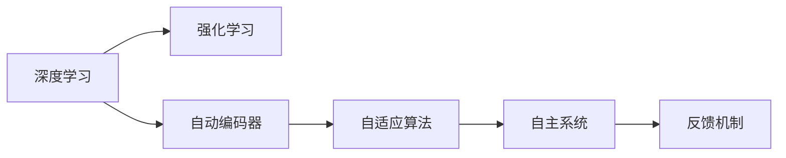
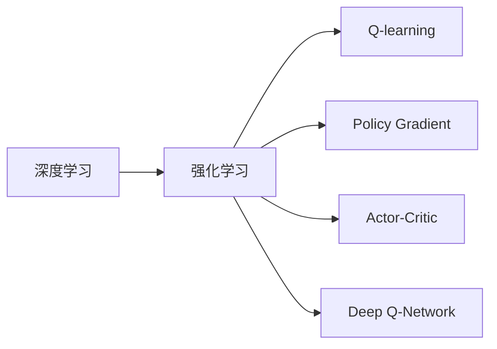
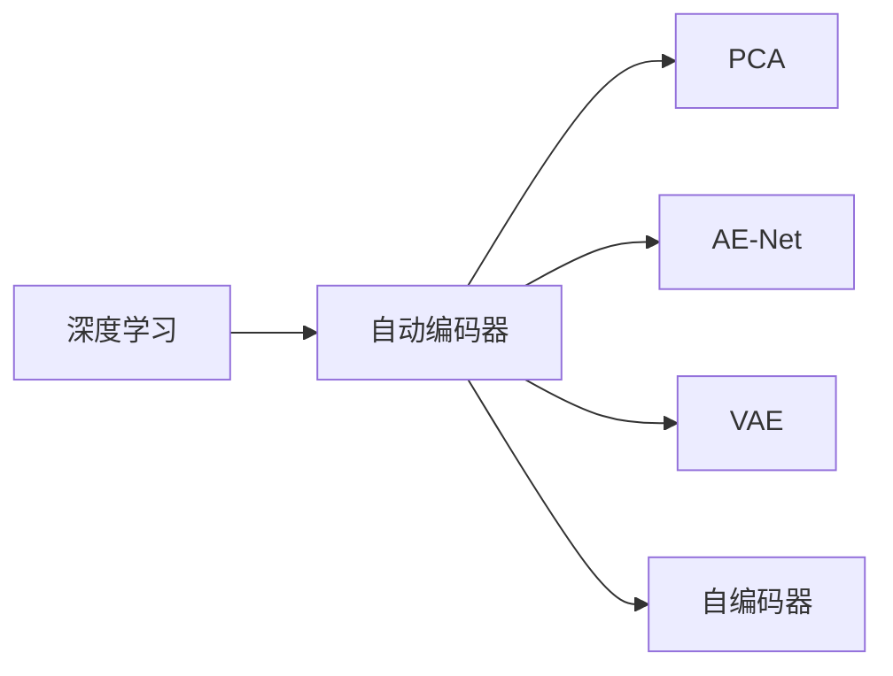
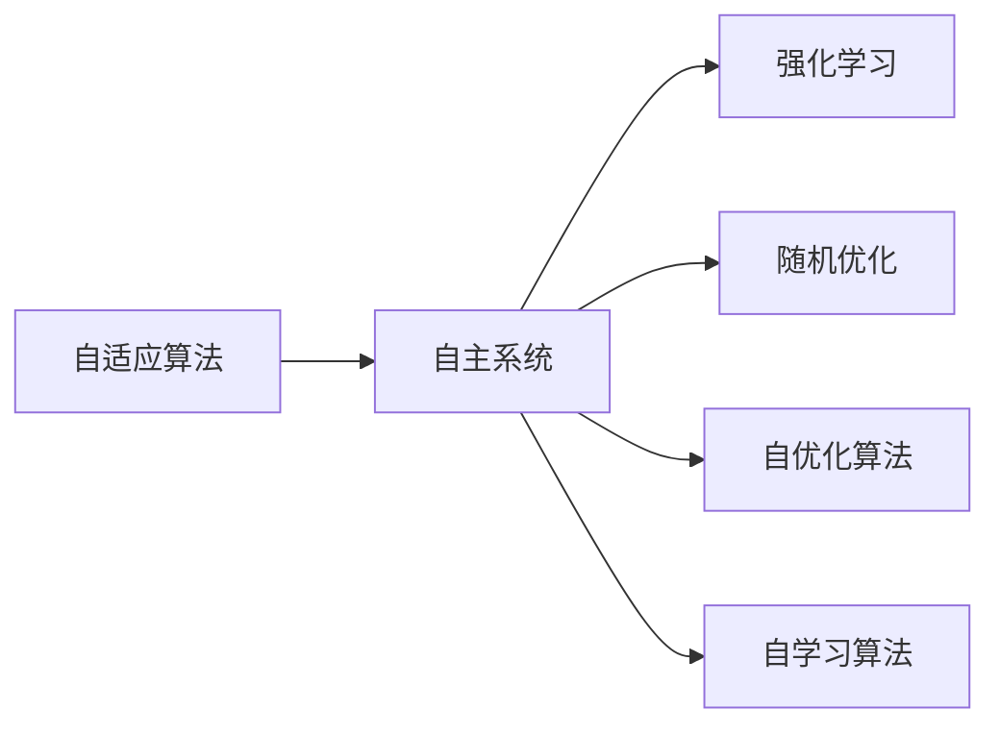

                 

# AI人工智能核心算法原理与代码实例讲解：自主学习

> 关键词：自主学习,深度学习,强化学习,自动编码器,自适应算法,自主系统

## 1. 背景介绍

### 1.1 问题由来
自主学习是人工智能领域的一个重要研究方向，旨在使机器系统能够在无监督或少监督的环境下，通过与环境的互动不断自我优化，提升决策能力和性能。与传统的监督学习和迁移学习方法相比，自主学习更加强调系统的主动性和自适应性。

近年来，随着深度学习和强化学习技术的迅猛发展，自主学习在自动驾驶、机器人控制、游戏智能、推荐系统等领域得到了广泛应用。然而，尽管取得了诸多进展，自主学习的理论基础和算法实现仍存在诸多挑战，需要进一步的探索和完善。

### 1.2 问题核心关键点
自主学习的核心在于，如何使机器系统在无监督或少监督的情况下，通过自主探索和反馈学习，逐步优化自身的决策策略和行为表现。核心问题包括：

- 如何设计高效的自主学习算法，在有限的数据和资源下取得最佳的性能提升。
- 如何保证自主学习系统的稳定性和鲁棒性，避免因过拟合或探索不足导致的性能退化。
- 如何在多目标任务和多模态数据环境下，设计灵活且高效的自主学习模型。
- 如何实现自主学习系统的实时反馈和持续更新，确保系统能够适应动态环境。
- 如何在模型复杂性和性能需求之间取得平衡，设计高效实用的自主学习算法。

### 1.3 问题研究意义
自主学习研究的目的是构建能够自我优化、自我适应的智能系统，从而在复杂多变的环境中具备更强的生存能力和竞争力。该领域的研究对于推动人工智能技术的发展具有重要意义：

1. **提升系统适应性**：自主学习系统能够自动适应新环境和任务，减少对人工干预的依赖。
2. **降低开发成本**：通过自主学习，系统可以自我迭代优化，减少了传统监督学习中标注数据和人工调参的需求。
3. **增强系统鲁棒性**：自主学习系统能够通过不断反馈和调整，逐步提升其鲁棒性和抗干扰能力。
4. **拓展应用边界**：自主学习技术的应用范围广泛，可以拓展到更多未知领域，推动人工智能技术向更深层次发展。
5. **促进理论创新**：自主学习涉及多学科交叉，能够推动人工智能理论的不断进步和完善。

## 2. 核心概念与联系

### 2.1 核心概念概述

为了更好地理解自主学习，我们需要先介绍几个关键概念：

- **深度学习（Deep Learning）**：一种基于多层神经网络的机器学习方法，通过多层次特征提取和抽象，实现对复杂非线性关系的建模。
- **强化学习（Reinforcement Learning）**：一种通过奖励信号和反馈机制，训练智能体进行最优决策的机器学习方法。
- **自动编码器（Autoencoder）**：一种无监督学习的神经网络，用于降维和数据压缩，能够学习数据的低维表示。
- **自适应算法（Adaptive Algorithm）**：一种能够根据环境变化动态调整自身行为和策略的算法。
- **自主系统（Autonomous System）**：能够在无监督或少监督环境下，通过自主学习不断优化自身性能的系统。

这些概念之间存在紧密联系，共同构成了自主学习的基础框架。接下来，我们将通过几个Mermaid流程图，展示这些概念之间的关系。



这个流程图展示了自主学习相关的核心概念及其之间的关系：

1. 深度学习提供了复杂数据建模的基础能力。
2. 强化学习通过奖励信号和反馈机制，指导模型进行最优决策。
3. 自动编码器用于数据降维和特征提取。
4. 自适应算法根据环境变化调整策略。
5. 自主系统通过反馈机制不断优化自身行为。

### 2.2 概念间的关系

以下是几个核心概念之间的关系，通过几个Mermaid流程图来展示：

#### 2.2.1 深度学习和强化学习的关系



这个流程图展示了深度学习和强化学习之间的联系：

1. 深度学习为强化学习提供了强大的特征提取和建模能力。
2. Q-learning、Policy Gradient、Actor-Critic、Deep Q-Network等是强化学习中的重要算法。

#### 2.2.2 自动编码器和深度学习的关系



这个流程图展示了自动编码器在深度学习中的作用：

1. 自动编码器是深度学习中的一种无监督学习算法。
2. PCA、AE-Net、VAE、自编码器等是自动编码器中的重要方法。

#### 2.2.3 自适应算法和自主系统的关系



这个流程图展示了自适应算法和自主系统之间的联系：

1. 自适应算法为自主系统提供了动态调整策略的能力。
2. 强化学习、随机优化、自优化算法、自学习算法等都是自适应算法中的重要方法。

通过这些流程图，我们可以更清晰地理解自主学习中的核心概念及其之间的关系，为后续深入讨论具体的自主学习算法奠定基础。

## 3. 核心算法原理 & 具体操作步骤

### 3.1 算法原理概述

自主学习的核心算法包括深度学习、强化学习和自适应算法。下面我们将分别介绍这些算法的原理和操作步骤。

#### 3.1.1 深度学习原理

深度学习通过构建多层神经网络，对输入数据进行逐层特征提取和抽象。其核心在于利用反向传播算法，通过前向传播计算损失函数，并反向传播更新权重，逐步优化模型参数。深度学习模型的训练过程可以概括为以下步骤：

1. **数据准备**：收集和预处理训练数据。
2. **模型初始化**：随机初始化神经网络参数。
3. **前向传播**：将输入数据送入模型，计算预测结果。
4. **损失计算**：计算预测结果与真实标签之间的差异，得到损失函数。
5. **反向传播**：根据损失函数计算梯度，并反向传播更新权重。
6. **模型优化**：通过优化算法（如梯度下降）不断调整权重，最小化损失函数。
7. **模型评估**：在测试集上评估模型性能，判断是否收敛。

#### 3.1.2 强化学习原理

强化学习通过智能体与环境的交互，最大化累积奖励信号，学习最优决策策略。其核心在于设计合适的奖励函数和策略更新方法，引导智能体逐步优化行为表现。强化学习的训练过程可以概括为以下步骤：

1. **环境模拟**：创建模拟环境，定义状态和动作空间。
2. **智能体初始化**：随机初始化智能体的策略和值函数。
3. **策略执行**：智能体在环境中执行策略，获得状态和奖励。
4. **状态更新**：根据环境反馈，更新智能体的状态。
5. **奖励计算**：计算当前状态和动作的奖励。
6. **策略更新**：根据奖励和状态，更新智能体的策略和值函数。
7. **性能评估**：在测试环境中评估智能体性能，判断是否收敛。

#### 3.1.3 自适应算法原理

自适应算法能够根据环境变化动态调整策略和参数。其核心在于设计能够实时反馈和调整的算法，如自优化算法、自学习算法等。自适应算法的训练过程可以概括为以下步骤：

1. **初始化**：随机初始化算法参数。
2. **环境交互**：与环境进行交互，收集反馈信息。
3. **策略调整**：根据反馈信息，调整算法策略。
4. **参数更新**：根据反馈信息，更新算法参数。
5. **性能评估**：评估算法性能，判断是否收敛。

### 3.2 算法步骤详解

#### 3.2.1 深度学习步骤详解

下面以卷积神经网络（CNN）为例，详细讲解深度学习的训练步骤：

1. **数据准备**：收集和预处理图像数据，分为训练集、验证集和测试集。
2. **模型初始化**：随机初始化CNN的卷积核和全连接层参数。
3. **前向传播**：将输入图像送入CNN，计算卷积、池化、全连接等层的输出。
4. **损失计算**：计算预测结果与真实标签之间的交叉熵损失。
5. **反向传播**：根据损失函数计算梯度，并反向传播更新卷积核和全连接层参数。
6. **模型优化**：使用梯度下降算法逐步调整权重，最小化损失函数。
7. **模型评估**：在测试集上评估模型性能，判断是否收敛。

#### 3.2.2 强化学习步骤详解

下面以Q-learning为例，详细讲解强化学习的训练步骤：

1. **环境模拟**：创建模拟环境，定义状态和动作空间。
2. **智能体初始化**：随机初始化Q值表。
3. **策略执行**：智能体在环境中执行策略，获得状态和奖励。
4. **状态更新**：根据环境反馈，更新智能体的状态。
5. **奖励计算**：计算当前状态和动作的奖励。
6. **Q值更新**：根据奖励和状态，更新Q值表。
7. **策略更新**：根据Q值表，更新智能体的策略。
8. **性能评估**：在测试环境中评估智能体性能，判断是否收敛。

#### 3.2.3 自适应算法步骤详解

下面以自优化算法（AdaBound）为例，详细讲解自适应算法的训练步骤：

1. **初始化**：随机初始化算法参数。
2. **环境交互**：与环境进行交互，收集反馈信息。
3. **策略调整**：根据反馈信息，调整算法策略。
4. **参数更新**：根据反馈信息，更新算法参数。
5. **性能评估**：评估算法性能，判断是否收敛。

### 3.3 算法优缺点

#### 3.3.1 深度学习优缺点

深度学习算法具有以下优点：

- **强大的表达能力**：能够处理复杂非线性关系，适用于各种类型的数据。
- **自动特征提取**：无需手工设计特征，可以自动提取高层次的抽象特征。
- **模型可解释性**：可以通过可视化技术，理解模型的决策过程。

但同时也存在以下缺点：

- **数据需求量大**：需要大量的标注数据进行训练，数据获取成本较高。
- **模型复杂度高**：神经网络结构复杂，训练和推理计算量大。
- **过拟合风险高**：在训练数据不足的情况下，容易发生过拟合。

#### 3.3.2 强化学习优缺点

强化学习算法具有以下优点：

- **自主学习**：能够在无监督或少监督的情况下进行学习，减少对标注数据的依赖。
- **动态优化**：通过不断反馈和调整，逐步优化决策策略，适应动态环境。
- **应用广泛**：适用于各种复杂多变环境，如自动驾驶、游戏智能等。

但同时也存在以下缺点：

- **环境建模复杂**：需要精确建模环境状态和动作空间，实现难度较大。
- **奖励函数设计困难**：需要设计合理的奖励函数，引导智能体进行最优决策。
- **探索与利用平衡**：在探索新动作和利用已有知识之间进行平衡，需要策略设计。

#### 3.3.3 自适应算法优缺点

自适应算法具有以下优点：

- **实时反馈**：能够实时监测环境反馈，动态调整策略和参数。
- **灵活性高**：适用于各种复杂多变环境，可以灵活调整策略。
- **鲁棒性好**：通过不断反馈和调整，提升系统的鲁棒性和适应性。

但同时也存在以下缺点：

- **计算复杂度高**：需要频繁更新策略和参数，计算复杂度较高。
- **策略调整难度大**：需要设计合适的策略调整方法，实现难度较大。
- **模型复杂度高**：自适应算法模型复杂，难以解释和调试。

### 3.4 算法应用领域

自主学习算法在多个领域得到了广泛应用，包括：

- **自动驾驶**：通过与环境的交互，实现车辆自主驾驶。
- **机器人控制**：通过环境反馈，引导机器人进行自主导航和操作。
- **游戏智能**：通过与游戏环境的交互，实现智能游戏的决策和策略优化。
- **推荐系统**：通过用户行为数据，推荐个性化内容。
- **金融预测**：通过市场数据，预测股票价格和投资策略。

## 4. 数学模型和公式 & 详细讲解 & 举例说明

### 4.1 数学模型构建

下面以强化学习中的Q-learning算法为例，详细讲解其数学模型构建过程。

假设智能体在环境中执行动作 $a$，获得状态 $s$ 和奖励 $r$。状态和动作的集合分别为 $S$ 和 $A$。Q值表 $Q(s,a)$ 表示在状态 $s$ 下执行动作 $a$ 的累积奖励。Q-learning的目标是最小化状态-动作对的累积奖励与预测值的误差。

数学模型构建如下：

$$
Q(s,a) = Q(s,a) + \alpha[r + \gamma \max_{a'}Q(s',a') - Q(s,a)]
$$

其中，$\alpha$ 为学习率，$\gamma$ 为折扣因子。$Q(s',a')$ 表示在状态 $s'$ 下执行动作 $a'$ 的累积奖励。$\max_{a'}Q(s',a')$ 表示在状态 $s'$ 下的最大累积奖励。

### 4.2 公式推导过程

下面以Q-learning算法为例，详细讲解其公式推导过程。

根据Q-learning算法的目标函数，我们可以使用反向传播算法来计算梯度，并更新Q值表。具体推导过程如下：

$$
\begin{aligned}
\frac{\partial Q(s,a)}{\partial Q(s,a)} &= 1 \\
\frac{\partial Q(s,a)}{\partial Q(s',a')} &= \begin{cases}
0, & \text{if} \quad (s,a) \neq (s',a') \\
1, & \text{if} \quad (s,a) = (s',a')
\end{cases} \\
\frac{\partial Q(s,a)}{\partial r} &= 1 \\
\frac{\partial Q(s,a)}{\partial \gamma} &= \frac{\partial Q(s,a)}{\partial Q(s',a')} \cdot \frac{\partial Q(s',a')}{\partial \gamma}
\end{aligned}
$$

根据上述梯度表达式，我们可以使用反向传播算法更新Q值表。具体更新过程如下：

$$
Q(s,a) \leftarrow Q(s,a) + \alpha[r + \gamma \max_{a'}Q(s',a') - Q(s,a)]
$$

其中，$\alpha$ 为学习率，$\gamma$ 为折扣因子。

### 4.3 案例分析与讲解

下面以一个简单的自主导航问题为例，详细讲解自主学习的实际应用。

假设一个无人车需要在地图上进行自主导航，选择最短路径到达目标地点。该问题可以建模为一个强化学习问题，无人车作为智能体，地图上的位置作为状态，前向和后向移动作为动作。智能体在每个状态下，通过执行动作和接收环境反馈，逐步优化路径选择策略。

具体算法步骤如下：

1. **环境模拟**：创建地图模拟环境，定义状态和动作空间。
2. **智能体初始化**：随机初始化无人车的路径策略。
3. **策略执行**：无人车在地图上执行路径策略，选择下一个位置。
4. **状态更新**：根据当前位置和动作，更新地图状态。
5. **奖励计算**：计算当前位置和动作的奖励，如路径长度、时间成本等。
6. **策略更新**：根据奖励和状态，更新无人车的路径策略。
7. **性能评估**：在测试地图上评估无人车的路径策略，判断是否收敛。

## 5. 项目实践：代码实例和详细解释说明

### 5.1 开发环境搭建

在进行自主学习项目实践前，我们需要准备好开发环境。以下是使用Python进行TensorFlow和OpenAI Gym开发的环境配置流程：

1. 安装Anaconda：从官网下载并安装Anaconda，用于创建独立的Python环境。

2. 创建并激活虚拟环境：
```bash
conda create -n reinforcement-env python=3.8 
conda activate reinforcement-env
```

3. 安装TensorFlow和OpenAI Gym：
```bash
pip install tensorflow==2.7
pip install gym
```

4. 安装其他相关工具包：
```bash
pip install numpy pandas matplotlib
```

完成上述步骤后，即可在`reinforcement-env`环境中开始自主学习实践。

### 5.2 源代码详细实现

下面我们以Q-learning算法在OpenAI Gym上的实现为例，给出完整的代码实现。

首先，定义Gym环境的奖励函数和状态空间：

```python
import gym
import numpy as np

env = gym.make('CartPole-v1')

def reward_func(state, action):
    if state[0] >= 20:
        return 1
    else:
        return 0

def state_space(state):
    return np.array([state[0], state[1]])
```

然后，定义Q-learning算法的训练函数：

```python
def train_qlearning(env, episodes, alpha=0.1, gamma=0.9):
    q_table = np.zeros([env.observation_space.n, env.action_space.n])
    
    for episode in range(episodes):
        state = env.reset()
        done = False
        
        while not done:
            action = np.argmax(q_table[state, :])
            next_state, reward, done, info = env.step(action)
            
            q_table[state, action] += alpha * (reward + gamma * np.max(q_table[next_state, :]) - q_table[state, action])
            state = next_state
    
    return q_table
```

最后，在Gym环境中进行Q-learning算法的训练和测试：

```python
episodes = 1000
q_table = train_qlearning(env, episodes)

print("Q-learning Table:")
print(q_table)
```

以上就是使用TensorFlow和OpenAI Gym实现Q-learning算法的完整代码。通过这段代码，我们可以在一个简单的CartPole环境中，训练出一个自主导航策略。

### 5.3 代码解读与分析

让我们再详细解读一下关键代码的实现细节：

**Gym环境的奖励函数和状态空间定义**：
- 通过Gym创建CartPole环境，并定义奖励函数和状态空间。奖励函数根据状态值判断是否获得奖励，状态空间为位置和速度两个维度。

**Q-learning算法的训练函数**：
- 初始化Q值表，用于记录每个状态-动作对的累积奖励。
- 在每个回合中，智能体执行当前策略，选择动作并接收环境反馈。
- 根据当前状态和动作，计算Q值表更新值。
- 更新当前状态和动作的Q值，逐步优化路径选择策略。
- 判断是否完成当前回合，如果完成，返回Q值表。

**训练和测试**：
- 设置训练轮数和Q-learning参数。
- 调用训练函数，输出最终的Q值表。
- 在测试环境中评估策略性能。

通过这段代码，我们可以看到，自主学习算法的实现虽然简洁，但需要关注多个细节。环境模拟、策略执行、状态更新、奖励计算等环节，都需要精心设计。

## 6. 实际应用场景

### 6.1 智能推荐系统

基于自主学习的推荐系统能够自动探索用户行为模式，实时调整推荐策略，提供更加个性化和多样化的内容推荐。通过在线学习算法和实时反馈机制，推荐系统可以不断优化推荐结果，提升用户体验和满意度。

### 6.2 自动驾驶

自主学习算法在自动驾驶中的应用，能够实现车辆的自主导航和避障。通过环境感知和路径规划，无人车能够在复杂的城市道路上安全行驶。自主学习算法还能够通过实时反馈和调整，逐步提升驾驶性能，确保行车安全。

### 6.3 金融预测

在金融预测领域，自主学习算法可以分析历史市场数据，预测股票价格和投资策略。通过实时反馈和调整，算法能够捕捉市场动态，提供更准确的预测结果。

### 6.4 未来应用展望

随着自主学习算法的不断演进，未来的应用场景将更加广泛和深入。例如，在医疗诊断、灾害预警、社会治理等领域，自主学习算法将发挥更大的作用，推动人工智能技术的普及和发展。

## 7. 工具和资源推荐

### 7.1 学习资源推荐

为了帮助开发者系统掌握自主学习的理论基础和实践技巧，这里推荐一些优质的学习资源：

1. 《深度学习》系列书籍：由深度学习领域的专家撰写，全面介绍了深度学习的基本概念和前沿技术。

2. 《强化学习》系列书籍：介绍了强化学习的基本理论和算法，适合初学者和进阶读者。

3. 《机器学习》在线课程：Coursera等平台提供的机器学习课程，涵盖了各种机器学习算法和实际应用案例。

4. 《自动编码器》在线课程：DeepLearning.ai等平台提供的自动编码器课程，讲解了自动编码器的工作原理和应用场景。

5. 《自主学习》学术论文：近年来，关于自主学习的研究不断涌现，掌握最新论文进展，有助于理解前沿技术。

通过对这些资源的学习实践，相信你一定能够快速掌握自主学习的精髓，并用于解决实际的NLP问题。

### 7.2 开发工具推荐

高效的开发离不开优秀的工具支持。以下是几款用于自主学习开发的常用工具：

1. TensorFlow：基于Python的开源深度学习框架，适合自主学习模型的训练和优化。

2. PyTorch：基于Python的开源深度学习框架，灵活性高，适用于各种深度学习任务。

3. OpenAI Gym：一个用于创建和测试强化学习算法的平台，提供了各种模拟环境，方便模型测试和优化。

4. Weights & Biases：模型训练的实验跟踪工具，可以记录和可视化模型训练过程中的各项指标，方便对比和调优。

5. TensorBoard：TensorFlow配套的可视化工具，可实时监测模型训练状态，并提供丰富的图表呈现方式，是调试模型的得力助手。

合理利用这些工具，可以显著提升自主学习任务的开发效率，加快创新迭代的步伐。

### 7.3 相关论文推荐

自主学习研究的目的是构建能够自我优化、自我适应的智能系统，从而在复杂多变的环境中具备更强的生存能力和竞争力。以下是几篇奠基性的相关论文，推荐阅读：

1. Q-Learning: A Method for Teaching Self-Controlling Agents to Play arbitrary Games：提出了Q-learning算法，通过奖励信号和反馈机制，训练智能体进行最优决策。

2. Policy Gradient Methods for General Reinforcement Learning with Function Approximation：提出了策略梯度算法，通过直接优化策略函数，实现强化学习。

3. Self-Organizing Control Systems: The Adaptive Control of AI Agents：提出了自组织控制系统的理论框架，指导智能体进行自我优化和适应。

4. Deep Reinforcement Learning for Game Playing：在多个复杂游戏中，展示了深度学习在强化学习中的应用，取得了SOTA性能。

5. Autonomous Agents: The Quest for Generalized Intelligence in Machines：介绍了自主学习的基本理论和应用场景，推动了自主学习技术的发展。

这些论文代表了大语言模型微调技术的发展脉络。通过学习这些前沿成果，可以帮助研究者把握学科前进方向，激发更多的创新灵感。

除上述资源外，还有一些值得关注的前沿资源，帮助开发者紧跟自主学习技术的最新进展，例如：

1. arXiv论文预印本：人工智能领域最新研究成果的发布平台，包括大量尚未发表的前沿工作，学习前沿技术的必读资源。

2. 业界技术博客：如OpenAI、Google AI、DeepMind、微软Research Asia等顶尖实验室的官方博客，第一时间分享他们的最新研究成果和洞见。

3. 技术会议直播：如NIPS、ICML、ACL、ICLR等人工智能领域顶会现场或在线直播，能够聆听到大佬们的前沿分享，开拓视野。

4. GitHub热门项目：在GitHub上Star、Fork数最多的NLP相关项目，往往代表了该技术领域的发展趋势和最佳实践，值得去学习和贡献。

5. 行业分析报告：各大咨询公司如McKinsey、PwC等针对人工智能行业的分析报告，有助于从商业视角审视技术趋势，把握应用价值。

总之，对于自主学习技术的学习和实践，需要开发者保持开放的心态和持续学习的意愿。多关注前沿资讯，多动手实践，多思考总结，必将收获满满的成长收益。

## 8. 总结：未来发展趋势与挑战

### 8.1 总结

本文对自主学习算法进行了全面系统的介绍。首先阐述了自主学习的研究背景和意义，明确了自主学习在无监督或少监督环境下进行自主探索和优化策略的核心价值。其次，从原理到实践，详细讲解了深度学习、强化学习和自适应算法的核心原理和操作步骤，给出了自主学习任务开发的完整代码实例。同时，本文还广泛探讨了自主学习算法在智能推荐、自动驾驶、金融预测等多个领域的应用前景，展示了自主学习算

