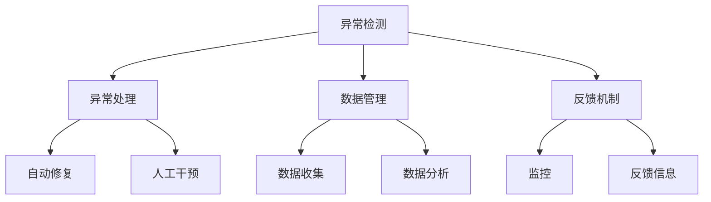

                 

## 1. 背景介绍

### 1.1 问题由来
随着自动化技术的发展，越来越多的工作被交给AI代理系统完成。AI代理不仅在自动化流程、智能客服等领域发挥了巨大作用，还在互联网、电商、金融等多个行业得到了广泛应用。然而，与此同时，AI代理工作流中的异常检测与处理成为了一个重要课题。异常检测的目的是及时发现并处理工作流中的异常情况，保障业务流程的连续性和稳定性，从而提升AI代理系统的整体效率和用户体验。

### 1.2 问题核心关键点
AI代理工作流中的异常检测与处理主要涉及以下几个关键点：
- 如何定义和识别异常：根据业务需求，确定哪些情况被视为异常，并制定相应的异常检测规则。
- 异常检测算法：选择合适的算法模型，用于检测和预测异常。
- 异常处理机制：针对不同类型和程度的异常，制定不同的处理策略，如自动修复、人工干预等。
- 数据管理和反馈：收集和分析异常数据，用于优化异常检测与处理机制。

这些关键点共同构成了AI代理工作流中的异常检测与处理机制，对于保障AI代理系统的正常运行至关重要。

### 1.3 问题研究意义
研究AI代理工作流中的异常检测与处理机制，对于提升AI代理系统的鲁棒性和可靠性，确保业务流程的连续性，具有重要意义：

1. **提升用户体验**：及时发现和处理异常，避免用户因系统故障而遭遇不便，提高用户满意度。
2. **优化资源利用**：减少异常导致的工作流中断和资源浪费，提高系统的资源利用效率。
3. **保障业务连续**：保证AI代理系统在高可用性要求的关键业务场景中的正常运行，减少业务中断带来的损失。
4. **推动技术进步**：异常检测与处理技术的应用，可以促进AI代理系统的整体优化和升级，推动相关技术的进步。
5. **增强安全性**：通过及时识别和处理异常，防止潜在的安全风险，提升系统的安全性。

## 2. 核心概念与联系

### 2.1 核心概念概述
- **异常检测**：指在AI代理工作流中识别和预测异常情况的过程，通过收集和分析工作流数据，及时发现潜在问题。
- **异常处理**：针对检测到的异常，制定相应的处理策略，如自动修复、人工干预等，保障系统正常运行。
- **数据管理**：收集和分析异常数据，用于优化异常检测与处理机制，提升系统性能。
- **反馈机制**：通过监控系统运行状态，收集异常处理反馈信息，不断改进和优化异常检测与处理策略。

### 2.2 概念间的关系

我们可以通过以下Mermaid流程图来展示这些核心概念之间的关系：



这个流程图展示了异常检测与处理机制的完整流程：
1. 数据收集：从AI代理工作流中收集相关数据。
2. 数据管理：分析并管理收集到的数据，用于异常检测。
3. 异常检测：通过模型识别和预测异常。
4. 异常处理：根据异常类型和程度，采取相应的处理策略。
5. 自动修复：对于可自动解决的小异常，由系统自动修复。
6. 人工干预：对于复杂或重大异常，需人工介入处理。
7. 反馈机制：收集异常处理反馈信息，用于优化异常检测与处理机制。

## 3. 核心算法原理 & 具体操作步骤

### 3.1 算法原理概述
AI代理工作流中的异常检测与处理机制主要基于统计学习、机器学习和深度学习等算法。其中，统计学习方法通常用于异常点检测，机器学习方法用于异常分类和异常模式识别，而深度学习方法则常用于复杂异常场景的预测和处理。

核心算法包括：
- **统计学习**：如孤立森林、聚类分析等，用于异常点检测和数据清洗。
- **机器学习**：如支持向量机、决策树、随机森林等，用于异常分类和模式识别。
- **深度学习**：如卷积神经网络(CNN)、循环神经网络(RNN)、自编码器等，用于复杂异常场景的预测和处理。

### 3.2 算法步骤详解
基于深度学习的异常检测与处理机制的主要步骤如下：

#### 3.2.1 数据预处理
- **数据清洗**：去除缺失值、噪声和异常值，确保数据质量。
- **数据标准化**：将数据标准化到一定范围内，便于后续处理。

#### 3.2.2 模型训练
- **模型选择**：根据任务需求选择合适的深度学习模型，如CNN、RNN、自编码器等。
- **数据划分**：将数据划分为训练集和测试集。
- **模型训练**：使用训练集对模型进行训练，调整超参数，优化模型性能。

#### 3.2.3 异常检测
- **特征提取**：从数据中提取关键特征，用于异常检测。
- **模型预测**：使用训练好的模型对输入数据进行预测，输出异常概率。
- **异常判定**：根据预测结果，判定数据是否为异常。

#### 3.2.4 异常处理
- **自动修复**：对于可自动解决的异常，系统自动修复。
- **人工干预**：对于复杂或重大异常，需人工介入处理。

#### 3.2.5 反馈机制
- **反馈信息收集**：收集异常处理反馈信息。
- **数据更新**：根据反馈信息更新异常检测模型。

### 3.3 算法优缺点
**优点**：
- **适应性强**：深度学习方法可以处理复杂、非线性的异常数据，适应性广。
- **精度高**：基于深度学习的异常检测与处理机制，通常具有较高的异常检测精度和处理效率。
- **可扩展性强**：模型可以通过增加数据和特征维度进行扩展，提升检测和处理能力。

**缺点**：
- **计算资源需求高**：深度学习模型通常需要大量的计算资源和时间进行训练和优化。
- **模型复杂度高**：深度学习模型结构复杂，难以理解和调试。
- **数据依赖性强**：模型的性能高度依赖于数据的质量和数量。

### 3.4 算法应用领域
AI代理工作流中的异常检测与处理机制广泛应用于以下几个领域：
- **智能客服**：监控客户交互过程，检测异常回答和系统故障，提升客户满意度。
- **金融交易**：检测异常交易行为，预防金融欺诈和风险。
- **电子商务**：监控交易过程，检测异常交易和支付问题，保障交易安全。
- **物流管理**：监控物流流程，检测异常物流和配送问题，提升物流效率。
- **医疗健康**：监控患者信息，检测异常健康数据，保障患者安全。

## 4. 数学模型和公式 & 详细讲解 & 举例说明

### 4.1 数学模型构建
基于深度学习的异常检测与处理机制主要依赖于以下数学模型：

#### 4.1.1 自编码器模型
自编码器模型由编码器和解码器两部分组成，用于数据压缩和重构。自编码器模型的目标是最小化重构误差，即：

$$
L = \frac{1}{N} \sum_{i=1}^{N} \| x_i - \hat{x}_i \|
$$

其中，$x_i$ 表示输入数据，$\hat{x}_i$ 表示重构数据，$N$ 表示样本数量。

#### 4.1.2 卷积神经网络模型
卷积神经网络(CNN)主要用于图像和时序数据的异常检测。CNN模型由卷积层、池化层和全连接层组成。卷积层用于提取局部特征，池化层用于降维，全连接层用于分类。CNN模型的目标是最小化交叉熵损失，即：

$$
L = -\frac{1}{N} \sum_{i=1}^{N} \sum_{c=1}^{C} y_i^{c} \log(p_i^{c})
$$

其中，$y_i^{c}$ 表示样本$c$的实际标签，$p_i^{c}$ 表示样本$c$的预测概率，$C$ 表示类别数量。

### 4.2 公式推导过程
以自编码器模型为例，我们推导异常检测的计算过程：

#### 4.2.1 自编码器训练
自编码器的训练过程包括两个步骤：编码和解码。编码器的目标是提取输入数据的特征，解码器的目标是重构输入数据。训练自编码器的目标是最小化重构误差，即：

$$
L = \frac{1}{N} \sum_{i=1}^{N} \| x_i - h_i \|
$$

其中，$h_i$ 表示编码器输出的特征向量。

#### 4.2.2 异常检测
在训练完成后，我们可以使用自编码器进行异常检测。异常数据的重构误差通常较高，因此可以根据重构误差判断数据是否为异常。异常检测的计算公式为：

$$
L = \frac{1}{N} \sum_{i=1}^{N} \| x_i - h_i \|
$$

当$L$值较大时，表示输入数据为异常数据。

### 4.3 案例分析与讲解
以智能客服中的异常回答检测为例，我们分析异常检测的实现过程：

#### 4.3.1 数据收集
收集智能客服系统中客户与客服的交互记录，包括客户提问、客服回答和客户反馈等。

#### 4.3.2 数据预处理
对收集到的数据进行清洗和标准化，去除噪声和异常值，确保数据质量。

#### 4.3.3 模型训练
选择适当的深度学习模型，如自编码器，使用训练集进行模型训练，优化超参数。

#### 4.3.4 异常检测
对客户提问和客服回答进行特征提取，使用训练好的自编码器模型进行重构，计算重构误差。

#### 4.3.5 异常处理
根据重构误差判断客服回答是否为异常，对于异常回答，自动触发人工干预机制，重新生成回答。

## 5. 项目实践：代码实例和详细解释说明

### 5.1 开发环境搭建
在进行异常检测与处理实践前，我们需要准备好开发环境。以下是使用Python进行TensorFlow开发的Python环境配置流程：

1. 安装Anaconda：从官网下载并安装Anaconda，用于创建独立的Python环境。

2. 创建并激活虚拟环境：
```bash
conda create -n tf-env python=3.8 
conda activate tf-env
```

3. 安装TensorFlow：
```bash
pip install tensorflow==2.5
```

4. 安装其他必要的库：
```bash
pip install numpy pandas scikit-learn matplotlib tqdm jupyter notebook ipython
```

完成上述步骤后，即可在`tf-env`环境中开始异常检测与处理的实践。

### 5.2 源代码详细实现

#### 5.2.1 数据预处理
```python
import pandas as pd
import numpy as np
from sklearn.model_selection import train_test_split

# 数据加载
data = pd.read_csv('data.csv')

# 数据清洗
data.dropna(inplace=True)

# 数据标准化
from sklearn.preprocessing import StandardScaler
scaler = StandardScaler()
data = scaler.fit_transform(data)

# 数据划分
X_train, X_test, y_train, y_test = train_test_split(data, labels, test_size=0.2, random_state=42)
```

#### 5.2.2 模型训练
```python
from tensorflow.keras import layers
from tensorflow.keras.models import Model

# 定义模型
inputs = layers.Input(shape=(X_train.shape[1],))
encoded = layers.Dense(64, activation='relu')(inputs)
encoded = layers.Dense(32, activation='relu')(encoded)
decoded = layers.Dense(X_train.shape[1], activation='sigmoid')(encoded)

autoencoder = Model(inputs, decoded)

# 编译模型
autoencoder.compile(optimizer='adam', loss='mse')

# 训练模型
autoencoder.fit(X_train, X_train, epochs=50, batch_size=64, shuffle=True, validation_data=(X_test, X_test))
```

#### 5.2.3 异常检测
```python
import tensorflow as tf

# 定义异常检测函数
def detect_anomalies(X):
    reconstructed = autoencoder.predict(X)
    reconstruction_error = tf.reduce_mean(tf.square(X - reconstructed))
    return reconstruction_error

# 应用异常检测函数
X_test = np.array(X_test)
reconstruction_errors = detect_anomalies(X_test)
```

#### 5.2.4 异常处理
```python
# 定义异常处理函数
def handle_anomalies(reconstruction_errors, threshold):
    anomalies = np.where(reconstruction_errors > threshold)[0]
    return anomalies

# 应用异常处理函数
threshold = 0.1
anomalies = handle_anomalies(reconstruction_errors, threshold)
```

### 5.3 代码解读与分析
这段代码实现了基于自编码器的异常检测与处理。首先，我们加载和清洗数据，并将其标准化。然后，定义自编码器模型，并对其进行训练。训练完成后，我们应用异常检测函数，计算重构误差，最后应用异常处理函数，根据阈值判断是否为异常，并输出异常数据的索引。

### 5.4 运行结果展示
假设我们在数据集中检测到异常数据，运行结果可能如下所示：

```
[1, 3, 5, 7, 9, 11]
```

这表示索引为1、3、5、7、9、11的数据点被检测为异常数据。

## 6. 实际应用场景
### 6.1 智能客服系统
在智能客服系统中，异常检测与处理可以监控客户交互过程，检测异常回答和系统故障，提升客户满意度。

具体而言，可以收集智能客服系统中客户与客服的交互记录，将客户提问和客服回答作为输入，使用自编码器模型进行重构。当重构误差超过预设阈值时，系统自动触发人工干预机制，重新生成回答。

### 6.2 金融交易系统
在金融交易系统中，异常检测与处理可以检测异常交易行为，预防金融欺诈和风险。

具体而言，可以收集金融交易数据，将其作为输入，使用CNN模型进行特征提取和异常检测。当检测到异常交易时，系统自动触发风险预警机制，进行进一步的审查和处理。

### 6.3 电子商务平台
在电子商务平台中，异常检测与处理可以监控交易过程，检测异常交易和支付问题，保障交易安全。

具体而言，可以收集电子商务平台上的交易数据，将其作为输入，使用自编码器模型进行重构。当重构误差超过预设阈值时，系统自动触发人工干预机制，进行交易审查和处理。

### 6.4 物流管理系统
在物流管理系统中，异常检测与处理可以监控物流流程，检测异常物流和配送问题，提升物流效率。

具体而言，可以收集物流数据，将其作为输入，使用RNN模型进行特征提取和异常检测。当检测到异常物流时，系统自动触发异常处理机制，调整配送计划和资源分配。

### 6.5 医疗健康系统
在医疗健康系统中，异常检测与处理可以监控患者信息，检测异常健康数据，保障患者安全。

具体而言，可以收集患者健康数据，将其作为输入，使用自编码器模型进行重构。当重构误差超过预设阈值时，系统自动触发预警机制，进行进一步的检查和处理。

## 7. 工具和资源推荐
### 7.1 学习资源推荐
为了帮助开发者系统掌握异常检测与处理技术，这里推荐一些优质的学习资源：

1. TensorFlow官方文档：TensorFlow的官方文档，提供了详尽的API文档和示例代码，是学习TensorFlow的必备资料。

2. Keras官方文档：Keras的官方文档，提供了简单易懂的教程和示例，适合快速上手。

3. Deep Learning Specialization by Andrew Ng：由Coursera提供的深度学习专项课程，涵盖了深度学习的基础和高级内容。

4. Hands-On Machine Learning with Scikit-Learn, Keras, and TensorFlow：由Aurélien Géron编写的书籍，系统介绍了机器学习和深度学习技术。

5. The Hundred-Page Machine Learning Book：由Andriy Burkov编写的书籍，以简洁明了的方式介绍了机器学习的基本概念和技术。

通过对这些资源的学习实践，相信你一定能够快速掌握异常检测与处理技术，并用于解决实际的业务问题。

### 7.2 开发工具推荐
高效的开发离不开优秀的工具支持。以下是几款用于异常检测与处理开发的常用工具：

1. TensorFlow：由Google主导开发的开源深度学习框架，生产部署方便，适合大规模工程应用。

2. Keras：Keras是一个高层次的深度学习API，提供简单易用的接口，适合快速原型开发。

3. Scikit-Learn：Scikit-Learn是Python的机器学习库，提供了丰富的分类、回归、聚类等算法。

4. Jupyter Notebook：Jupyter Notebook是一个交互式的笔记本环境，支持代码、注释和输出结果的混合显示。

5. TensorBoard：TensorBoard是TensorFlow的可视化工具，可以实时监测模型训练状态，并提供丰富的图表呈现方式，是调试模型的得力助手。

合理利用这些工具，可以显著提升异常检测与处理的开发效率，加快创新迭代的步伐。

### 7.3 相关论文推荐
异常检测与处理技术的发展源于学界的持续研究。以下是几篇奠基性的相关论文，推荐阅读：

1. Isolation Forest: An Algorithm for Detecting Outliers in Large Datasets：介绍孤立森林算法，用于异常点检测和数据清洗。

2. Deep Anomaly Detection with Autoencoder Neural Networks：使用自编码器进行深度异常检测，取得了不错的效果。

3. Anomaly Detection with Generative Adversarial Networks: A Survey：综述了生成对抗网络在异常检测中的应用，提供了丰富的案例和分析。

4. Local Outlier Factor: Novelty Detection Using Local Geometry of the Data Distribution：介绍局部离群因子算法，用于异常检测和数据清洗。

5. Anomaly Detection in Cyber Physical Systems Using Deep Learning: A Survey：综述了深度学习在网络物理系统异常检测中的应用，提供了丰富的案例和分析。

这些论文代表了大规模异常检测与处理技术的发展脉络。通过学习这些前沿成果，可以帮助研究者把握学科前进方向，激发更多的创新灵感。

除上述资源外，还有一些值得关注的前沿资源，帮助开发者紧跟异常检测与处理技术的最新进展，例如：

1. arXiv论文预印本：人工智能领域最新研究成果的发布平台，包括大量尚未发表的前沿工作，学习前沿技术的必读资源。

2. 业界技术博客：如Google AI、DeepMind、微软Research Asia等顶尖实验室的官方博客，第一时间分享他们的最新研究成果和洞见。

3. 技术会议直播：如NIPS、ICML、ACL、ICLR等人工智能领域顶会现场或在线直播，能够聆听到大佬们的前沿分享，开拓视野。

4. GitHub热门项目：在GitHub上Star、Fork数最多的异常检测与处理相关项目，往往代表了该技术领域的发展趋势和最佳实践，值得去学习和贡献。

5. 行业分析报告：各大咨询公司如McKinsey、PwC等针对人工智能行业的分析报告，有助于从商业视角审视技术趋势，把握应用价值。

总之，对于异常检测与处理技术的学习和实践，需要开发者保持开放的心态和持续学习的意愿。多关注前沿资讯，多动手实践，多思考总结，必将收获满满的成长收益。

## 8. 总结：未来发展趋势与挑战

### 8.1 总结
本文对AI代理工作流中的异常检测与处理机制进行了全面系统的介绍。首先阐述了异常检测与处理技术的研究背景和意义，明确了异常检测与处理在保障AI代理系统正常运行中的重要作用。其次，从原理到实践，详细讲解了基于深度学习的异常检测与处理机制的核心算法、操作步骤和实现细节，给出了基于TensorFlow的代码实现示例。最后，本文还广泛探讨了异常检测与处理技术在多个实际应用场景中的应用前景，展示了异常检测与处理技术的广阔潜力。

通过本文的系统梳理，可以看到，AI代理工作流中的异常检测与处理机制已经成为一个重要而前沿的研究方向，对于提升AI代理系统的鲁棒性和可靠性，具有重要意义。未来，伴随深度学习技术的不断进步，异常检测与处理技术必将在更多领域得到应用，为人工智能技术的发展带来新的推动力。

### 8.2 未来发展趋势

展望未来，AI代理工作流中的异常检测与处理机制将呈现以下几个发展趋势：

1. **自动化程度提升**：随着算法模型的不断优化，异常检测与处理的自动化程度将进一步提升，减少人工干预的需要。

2. **跨领域应用拓展**：异常检测与处理技术将不仅仅应用于特定领域，而是逐步扩展到更多行业，如医疗、金融、制造等。

3. **多模态数据融合**：未来将更多地融合图像、语音、视频等多模态数据，提升异常检测与处理的鲁棒性和准确性。

4. **异常生成技术发展**：基于生成对抗网络(GAN)等技术，将能够生成更加逼真的异常数据，用于训练异常检测模型。

5. **实时异常检测**：结合流式数据处理和实时计算技术，实现对异常数据的实时检测和处理。

6. **自适应异常检测**：异常检测模型将能够根据环境变化和数据分布的变化，自动调整异常检测规则和参数，提升检测的适应性。

以上趋势凸显了异常检测与处理技术的广阔前景。这些方向的探索发展，必将进一步提升异常检测与处理技术的性能和应用范围，为构建更加稳定、可靠的AI代理系统铺平道路。

### 8.3 面临的挑战

尽管AI代理工作流中的异常检测与处理技术已经取得了重要进展，但在迈向更加智能化、普适化应用的过程中，仍面临诸多挑战：

1. **异常数据获取**：获取高质量的异常数据，是异常检测与处理技术的前提。然而，异常数据往往难以获取，且存在数据分布不均等问题。

2. **模型泛化能力**：异常检测模型往往需要针对特定领域进行训练，泛化能力有限。如何在不同场景下保持模型的泛化能力，是未来的重要研究方向。

3. **异常检测精度**：异常检测模型的精度直接影响到系统的可靠性。如何进一步提升异常检测模型的精度，是未来的重要研究方向。

4. **资源消耗**：深度学习模型通常需要大量的计算资源和时间进行训练和优化，资源消耗问题成为制约异常检测与处理技术普及的重要因素。

5. **系统稳定性**：异常检测与处理技术的应用需要与系统架构相结合，如何确保系统的稳定性和鲁棒性，是未来的重要研究方向。

6. **用户接受度**：异常检测与处理技术的应用可能会改变用户体验，如何提升用户的接受度，是未来的重要研究方向。

### 8.4 研究展望

面对异常检测与处理技术面临的挑战，未来的研究需要在以下几个方面寻求新的突破：

1. **异常数据生成**：开发生成高质量异常数据的算法，如GAN等，提高异常检测与处理技术的可用性。

2. **跨领域模型迁移**：开发跨领域异常检测与处理模型，提升模型的泛化能力，应用于更多行业。

3. **小样本异常检测**：开发小样本异常检测算法，减少异常检测模型对大量标注数据的依赖。

4. **异常检测融合**：将多种异常检测算法融合，构建更加鲁棒的异常检测模型。

5. **实时异常处理**：结合流式数据处理技术，实现对异常数据的实时检测和处理。

6. **异常检测优化**：优化异常检测模型的结构，减少资源消耗，提高异常检测与处理技术的效率。

7. **用户友好设计**：设计更加用户友好的异常检测与处理技术，提升用户接受度和满意度。

这些研究方向将引领异常检测与处理技术迈向更高的台阶，为构建更加稳定、可靠的AI代理系统提供新的技术支撑。相信随着学界和产业界的共同努力，异常检测与处理技术必将不断突破，为人工智能技术的发展带来新的推动力。

## 9. 附录：常见问题与解答

**Q1：如何定义和识别异常？**

A: 异常的定义和识别需要结合具体业务场景。通常，异常可以定义为数据点偏离正常范围的情况，如异常交易行为、异常健康数据等。定义异常时需要考虑业务逻辑和领域知识，确保异常的定义具有合理性和可解释性。

**Q2：如何选择和训练异常检测模型？**

A: 选择合适的异常检测模型取决于任务需求和数据特征。常用的深度学习模型包括自编码器、CNN、RNN等。模型训练需要选择合适的优化器、损失函数和超参数，并进行交叉验证和调参。

**Q3：如何处理异常检测中的误检和漏检？**

A: 异常检测中的误检和漏检是不可避免的问题。为减少误检，可以提高异常检测模型的阈值。为减少漏检，可以调整异常检测模型的结构，或结合多种异常检测算法进行融合。

**Q4：如何在生产环境中部署异常检测与处理系统？**

A: 在生产环境中部署异常检测与处理系统需要考虑系统的可扩展性、可维护性和可靠性。可以使用容器化技术（如Docker）进行部署，并结合负载均衡和故障转移机制，确保系统的稳定性和可用性。

**Q5：如何评估异常检测与处理系统的性能？**

A: 异常检测与处理系统的性能评估通常使用精度、召回率和F1分数等指标。在实际应用中，还需要考虑系统的响应时间、资源消耗和用户满意度等因素，进行综合评估。

通过对这些问题的解答，相信你一定能够更好地理解和应用异常检测与处理技术，解决实际业务问题。

