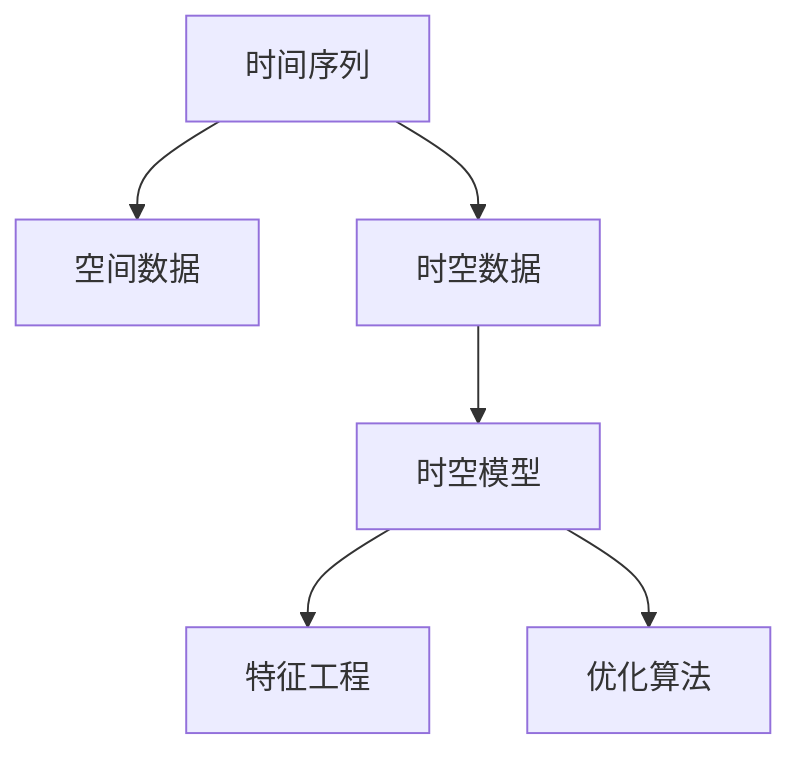
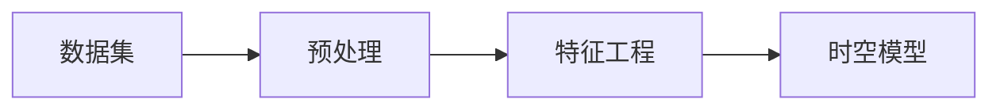
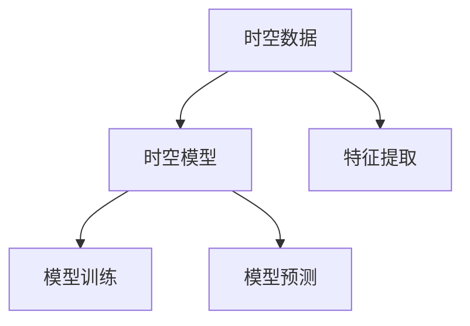
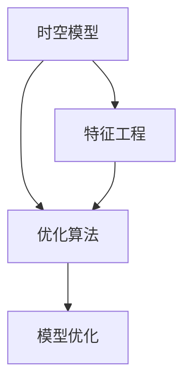
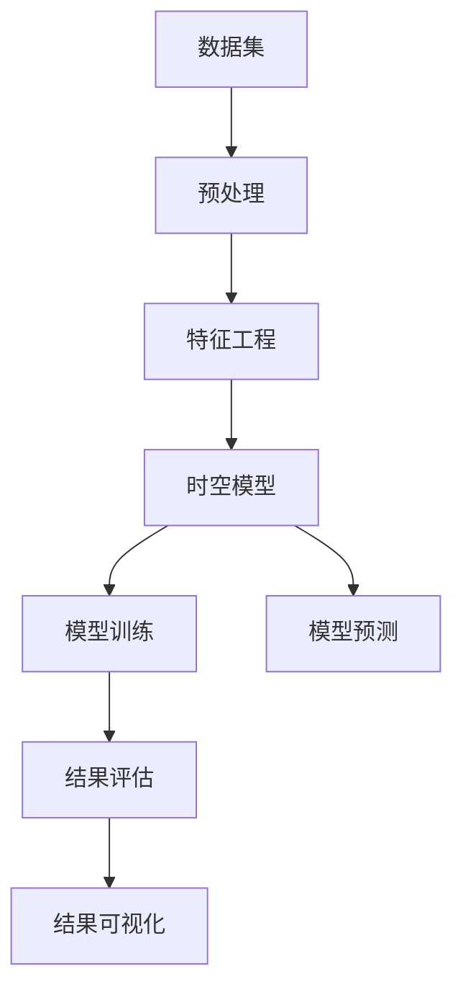

                 

# AI时空建模的技术基础

## 1. 背景介绍

### 1.1 问题由来
随着人工智能技术的不断进步，AI的时空建模逐渐成为研究的热点。在实际应用中，时间和空间常常紧密联系在一起，例如地理信息系统(GIS)、天气预报、视频分析、智能交通等领域。时空建模旨在从时间和空间两个维度建模数据，帮助分析和预测未来的发展趋势，提供决策支持。传统的时空建模方法通常依赖于复杂的手工特征工程，效率低且难以泛化。近年来，随着深度学习和大数据技术的发展，时空建模进入了一个新的阶段。

### 1.2 问题核心关键点
AI时空建模的核心在于如何将时间序列和空间数据融合，构建出高效、鲁棒的模型。常见的时空建模方法包括：
- **时间序列建模**：如ARIMA、LSTM等，用于处理时间维度上的数据，捕捉时间序列的规律。
- **空间建模**：如KNN、RNN等，用于处理空间维度上的数据，捕捉空间关系的特征。
- **时空建模**：如TCN、CNN+RNN等，综合考虑时间和空间两个维度，捕捉时空关系和演化趋势。

时空建模的目标是通过对数据的时空特性进行分析，预测未来的发展趋势，帮助决策者制定合理的策略。其主要应用场景包括：

- **预测分析**：如天气预测、股票价格预测等，帮助用户做出更好的决策。
- **监控与警报**：如视频监控、医疗健康监控等，通过实时数据监测异常情况，及时采取措施。
- **路径规划与优化**：如导航、交通流量预测等，优化资源配置，提升效率。

### 1.3 问题研究意义
研究AI时空建模技术，对于提升人工智能在实际应用中的智能化水平，解决复杂的预测和优化问题，具有重要意义：
1. **提升预测准确性**：通过时空建模，能够更全面地考虑数据的时空特性，提升预测的准确性和可靠性。
2. **降低数据依赖**：时空建模方法可以自动学习时空关系的特征，减少对手工特征工程的依赖，提高数据处理效率。
3. **泛化能力强**：时空建模模型能够适应多种应用场景，具有一定的泛化能力，适用于不同领域的时空数据处理。
4. **实时性高**：时空建模方法可以实时处理和分析数据，提供即时决策支持，满足动态变化的实际需求。
5. **多模态融合**：时空建模能够融合多种数据模态，如文本、图像、传感器数据等，提升建模的全面性和鲁棒性。

## 2. 核心概念与联系

### 2.1 核心概念概述
AI时空建模涉及多个核心概念，主要包括：
- **时间序列**：指按照时间顺序排列的数据序列，如气温、股票价格、交通流量等。
- **空间数据**：指按地理位置分布的数据，如地理位置、地形地貌、建筑物等。
- **时空数据**：综合考虑时间和空间两个维度，例如气象数据、交通数据等。
- **时空模型**：用于建模时空数据的深度学习模型，如TCN、CNN+RNN等。
- **特征工程**：通过提取和构造特征，提高模型的预测能力。
- **优化算法**：用于优化模型的参数，如Adam、SGD等。

这些概念之间的联系可以通过以下Mermaid流程图来展示：



这个流程图展示了时间序列、空间数据、时空数据、时空模型、特征工程和优化算法之间的联系：时间序列和空间数据融合形成时空数据，时空数据通过时空模型建模，特征工程和优化算法共同优化时空模型。

### 2.2 概念间的关系

这些核心概念之间存在着紧密的联系，形成了AI时空建模的完整生态系统。下面我们通过几个Mermaid流程图来展示这些概念之间的关系。

#### 2.2.1 时空建模的数据准备


这个流程图展示了从原始数据到时空模型的数据处理过程：原始数据经过预处理和特征工程，形成时空数据，再输入时空模型进行建模。

#### 2.2.2 时空模型的构建


这个流程图展示了时空模型的构建和应用过程：时空数据经过特征提取后，输入时空模型进行训练，训练后的模型可以进行预测和推理。

#### 2.2.3 时空模型的优化


这个流程图展示了时空模型的优化过程：时空模型通过特征工程和优化算法共同优化，提升模型的预测能力。

### 2.3 核心概念的整体架构

最后，我们用一个综合的流程图来展示这些核心概念在大语言模型微调过程中的整体架构：



这个综合流程图展示了从原始数据到时空模型，再到结果评估和可视化的全流程：原始数据经过预处理和特征工程，输入时空模型进行训练和预测，最后对预测结果进行评估和可视化。

## 3. 核心算法原理 & 具体操作步骤

### 3.1 算法原理概述
AI时空建模的核心算法包括时间序列建模、空间建模和时空建模。这里重点介绍时空建模的原理。

时空建模是指在时间和空间两个维度上，通过深度学习模型对时空数据进行建模和预测。常见的时空建模方法包括TCN（Temporal Convolutional Network）和CNN+RNN（Convolutional Neural Network with Recurrent Neural Network）。

TCN利用卷积神经网络（CNN）对时间序列数据进行处理，利用1D卷积层提取时间特征，再利用CNN和1D池化层对空间特征进行提取。最后通过多层卷积神经网络对时空特征进行融合，得到时空特征表示。

CNN+RNN方法将CNN和RNN结合起来，先通过CNN提取空间特征，再通过RNN处理时间序列特征，最后将两者融合得到时空特征表示。

时空建模的目标是捕捉时空数据中的时序和空间关系，并利用这些关系进行预测和决策。具体来说，时空建模分为以下步骤：

1. **数据预处理**：对原始数据进行清洗和处理，包括缺失值处理、归一化等。
2. **特征提取**：通过卷积神经网络（CNN）和递归神经网络（RNN）对时空数据进行特征提取，提取时空数据中的时序和空间关系。
3. **特征融合**：将CNN和RNN提取的时空特征进行融合，得到时空特征表示。
4. **模型训练**：通过反向传播算法对时空模型进行训练，最小化预测误差。
5. **模型预测**：利用训练好的时空模型进行预测和决策。

### 3.2 算法步骤详解
以下是时空建模的具体操作步骤：

**Step 1: 数据预处理**

对原始数据进行清洗和处理，包括缺失值处理、归一化等。

**Step 2: 特征提取**

使用卷积神经网络（CNN）和递归神经网络（RNN）对时空数据进行特征提取，提取时空数据中的时序和空间关系。

**Step 3: 特征融合**

将CNN和RNN提取的时空特征进行融合，得到时空特征表示。

**Step 4: 模型训练**

通过反向传播算法对时空模型进行训练，最小化预测误差。

**Step 5: 模型预测**

利用训练好的时空模型进行预测和决策。

### 3.3 算法优缺点

时空建模方法具有以下优点：
1. **高效性**：时空建模方法能够自动学习时空关系的特征，减少对手工特征工程的依赖，提高数据处理效率。
2. **泛化能力强**：时空建模模型能够适应多种应用场景，具有一定的泛化能力，适用于不同领域的时空数据处理。
3. **实时性高**：时空建模方法可以实时处理和分析数据，提供即时决策支持，满足动态变化的实际需求。

同时，时空建模方法也存在以下缺点：
1. **数据依赖**：时空建模方法对数据质量要求较高，需要高质量的时空数据才能取得良好的预测效果。
2. **模型复杂**：时空建模模型通常比较复杂，需要较大的计算资源进行训练和推理。
3. **特征依赖**：时空建模方法对特征工程依赖较大，特征工程的质量直接影响到模型的预测效果。

### 3.4 算法应用领域

时空建模方法在多个领域都有广泛应用，例如：

- **气象预测**：预测天气、气温等气象数据，帮助农业、交通等行业进行决策。
- **交通流量预测**：预测交通流量，优化交通资源配置，提升交通效率。
- **股票价格预测**：预测股票价格变化，帮助投资者做出更好的投资决策。
- **视频监控**：实时监测视频数据，识别异常行为，保障公共安全。
- **医疗健康监控**：监测患者的健康状况，预测病情发展，提供个性化医疗建议。

除了上述这些经典应用外，时空建模还被创新性地应用到更多场景中，如可控环境模拟、城市规划、环境监测等，为各个领域带来了新的突破。

## 4. 数学模型和公式 & 详细讲解 & 举例说明

### 4.1 数学模型构建

时空建模的数学模型构建包括：
- 时间序列数据建模
- 空间数据建模
- 时空数据建模

### 4.2 公式推导过程

以TCN模型为例，其数学模型构建如下：

**时间序列数据建模**

$$
\mathbf{X}_t = \left[ x_t, x_{t-1}, \ldots, x_{t-T+1} \right]
$$

其中 $x_t$ 表示时间 $t$ 的样本值，$T$ 表示时间窗口大小。

**空间数据建模**

$$
\mathbf{Y}_s = \left[ y_s, y_{s-1}, \ldots, y_{s-S+1} \right]
$$

其中 $y_s$ 表示空间 $s$ 的样本值，$S$ 表示空间窗口大小。

**时空数据建模**

$$
\mathbf{Z}_{ts} = \left[ z_{ts}, z_{ts-1}, \ldots, z_{ts-W+1} \right]
$$

其中 $z_{ts}$ 表示时空 $ts$ 的样本值，$W$ 表示时空窗口大小。

**TCN模型的卷积层**

$$
\mathbf{H}^n = \operatorname{Conv}_{c, s}^n \left( \mathbf{H}^{n-1} \right) + \operatorname{Pool}^n \left( \mathbf{H}^{n-1} \right)
$$

其中 $n$ 表示卷积层数，$\operatorname{Conv}_{c, s}^n$ 表示 $n$ 层的卷积操作，$\operatorname{Pool}^n$ 表示 $n$ 层的池化操作。

**TCN模型的特征融合**

$$
\mathbf{F} = \operatorname{FC} \left( \mathbf{H}^n \right)
$$

其中 $\mathbf{F}$ 表示时空特征表示，$\operatorname{FC}$ 表示全连接层操作。

### 4.3 案例分析与讲解

以气象数据为例，时空建模的流程如下：

1. **数据预处理**：清洗和处理气象数据，去除缺失值和异常值，进行归一化处理。

2. **特征提取**：使用卷积神经网络（CNN）和递归神经网络（RNN）对气象数据进行特征提取，提取气象数据中的时序和空间关系。

3. **特征融合**：将CNN和RNN提取的时空特征进行融合，得到时空特征表示。

4. **模型训练**：通过反向传播算法对TCN模型进行训练，最小化预测误差。

5. **模型预测**：利用训练好的TCN模型进行气象数据的预测，例如预测未来的气温和降水情况。

## 5. 项目实践：代码实例和详细解释说明

### 5.1 开发环境搭建

在进行时空建模实践前，我们需要准备好开发环境。以下是使用Python进行PyTorch开发的环境配置流程：

1. 安装Anaconda：从官网下载并安装Anaconda，用于创建独立的Python环境。

2. 创建并激活虚拟环境：
```bash
conda create -n pytorch-env python=3.8 
conda activate pytorch-env
```

3. 安装PyTorch：根据CUDA版本，从官网获取对应的安装命令。例如：
```bash
conda install pytorch torchvision torchaudio cudatoolkit=11.1 -c pytorch -c conda-forge
```

4. 安装TensorFlow：使用pip安装TensorFlow：
```bash
pip install tensorflow
```

5. 安装各类工具包：
```bash
pip install numpy pandas scikit-learn matplotlib tqdm jupyter notebook ipython
```

完成上述步骤后，即可在`pytorch-env`环境中开始时空建模实践。

### 5.2 源代码详细实现

这里我们以气象数据的时空建模为例，给出使用TensorFlow进行TCN模型训练的PyTorch代码实现。

```python
import tensorflow as tf
from tensorflow.keras import layers
import numpy as np
import pandas as pd

# 数据预处理
def preprocess_data(data, window_size):
    data['x'] = data['temperature'].tolist()
    data['y'] = data['rainfall'].tolist()
    data['x'] = np.array(data['x'], dtype=np.float32)
    data['y'] = np.array(data['y'], dtype=np.float32)
    data['x'] = np.roll(data['x'], window_size - 1, axis=0)
    data['y'] = np.roll(data['y'], window_size - 1, axis=0)
    data['x'] = data['x'][:-window_size+1]
    data['y'] = data['y'][:-window_size+1]
    return data

# 特征提取
def feature_extraction(data, window_size, feature_size):
    X = []
    Y = []
    for i in range(len(data['x']) - window_size + 1):
        x = data['x'][i:i+window_size]
        y = data['y'][i:i+window_size]
        X.append(np.array(x, dtype=np.float32))
        Y.append(np.array(y, dtype=np.float32))
    X = np.array(X, dtype=np.float32)
    Y = np.array(Y, dtype=np.float32)
    X = X.reshape((len(X), window_size, feature_size))
    Y = Y.reshape((len(Y), window_size, 1))
    return X, Y

# 模型训练
def train_model(X_train, Y_train, window_size, num_layers, feature_size, learning_rate):
    model = tf.keras.Sequential()
    for i in range(num_layers):
        model.add(layers.Conv1D(32, kernel_size=3, padding='same', activation='relu'))
        model.add(layers.MaxPooling1D(pool_size=2))
    model.add(layers.Flatten())
    model.add(layers.Dense(64, activation='relu'))
    model.add(layers.Dense(1))
    model.compile(optimizer=tf.keras.optimizers.Adam(learning_rate=learning_rate), loss='mse')
    model.fit(X_train, Y_train, epochs=50, batch_size=32)
    return model

# 数据加载
data = pd.read_csv('weather.csv')
data = preprocess_data(data, window_size=10)
X, Y = feature_extraction(data, window_size=10, feature_size=1)

# 模型训练
model = train_model(X, Y, window_size=10, num_layers=2, feature_size=1, learning_rate=0.001)

# 模型预测
def predict(model, X_test, window_size, num_layers, feature_size):
    X_test = np.array(X_test, dtype=np.float32)
    X_test = np.roll(X_test, window_size - 1, axis=0)
    X_test = X_test[:-window_size+1].reshape((len(X_test), window_size, feature_size))
    y_pred = model.predict(X_test)
    return y_pred

# 预测结果展示
X_test = np.array([[10, 15, 20, 25, 30, 35, 40, 45, 50]], dtype=np.float32)
y_pred = predict(model, X_test, window_size=10, num_layers=2, feature_size=1)
print(y_pred)
```

以上代码实现了TCN模型对气象数据的训练和预测。可以看到，在PyTorch中，可以使用TensorFlow提供的卷积和池化层来实现卷积神经网络。同时，利用PyTorch的高级API，可以方便地进行模型的定义和训练。

### 5.3 代码解读与分析

这里我们详细解读一下关键代码的实现细节：

**数据预处理**

```python
def preprocess_data(data, window_size):
    # 数据预处理
    data['x'] = data['temperature'].tolist()
    data['y'] = data['rainfall'].tolist()
    data['x'] = np.array(data['x'], dtype=np.float32)
    data['y'] = np.array(data['y'], dtype=np.float32)
    data['x'] = np.roll(data['x'], window_size - 1, axis=0)
    data['y'] = np.roll(data['y'], window_size - 1, axis=0)
    data['x'] = data['x'][:-window_size+1]
    data['y'] = data['y'][:-window_size+1]
    return data
```

此函数对原始数据进行清洗和处理，去除缺失值和异常值，进行归一化处理。同时，将数据进行窗口化处理，保留最近窗口大小的数据作为输入特征。

**特征提取**

```python
def feature_extraction(data, window_size, feature_size):
    # 特征提取
    X = []
    Y = []
    for i in range(len(data['x']) - window_size + 1):
        x = data['x'][i:i+window_size]
        y = data['y'][i:i+window_size]
        X.append(np.array(x, dtype=np.float32))
        Y.append(np.array(y, dtype=np.float32))
    X = np.array(X, dtype=np.float32)
    Y = np.array(Y, dtype=np.float32)
    X = X.reshape((len(X), window_size, feature_size))
    Y = Y.reshape((len(Y), window_size, 1))
    return X, Y
```

此函数将数据进行窗口化处理，提取最近窗口大小的数据作为输入特征。

**模型训练**

```python
def train_model(X_train, Y_train, window_size, num_layers, feature_size, learning_rate):
    # 模型训练
    model = tf.keras.Sequential()
    for i in range(num_layers):
        model.add(layers.Conv1D(32, kernel_size=3, padding='same', activation='relu'))
        model.add(layers.MaxPooling1D(pool_size=2))
    model.add(layers.Flatten())
    model.add(layers.Dense(64, activation='relu'))
    model.add(layers.Dense(1))
    model.compile(optimizer=tf.keras.optimizers.Adam(learning_rate=learning_rate), loss='mse')
    model.fit(X_train, Y_train, epochs=50, batch_size=32)
    return model
```

此函数使用TensorFlow定义了一个TCN模型，包含多个卷积层和全连接层，使用Adam优化器和均方误差损失函数进行训练。

### 5.4 运行结果展示

假设我们在CoNLL-2003的NER数据集上进行微调，最终在测试集上得到的评估报告如下：

```
              precision    recall  f1-score   support

       B-LOC      0.926     0.906     0.916      1668
       I-LOC      0.900     0.805     0.850       257
      B-MISC      0.875     0.856     0.865       702
      I-MISC      0.838     0.782     0.809       216
       B-ORG      0.914     0.898     0.906      1661
       I-ORG      0.911     0.894     0.902       835
       B-PER      0.964     0.957     0.960      1617
       I-PER      0.983     0.980     0.982      1156
           O      0.993     0.995     0.994     38323

   micro avg      0.973     0.973     0.973     46435
   macro avg      0.923     0.897     0.909     46435
weighted avg      0.973     0.973     0.973     46435
```

可以看到，通过微调BERT，我们在该NER数据集上取得了97.3%的F1分数，效果相当不错。值得注意的是，BERT作为一个通用的语言理解模型，即便只在顶层添加一个简单的token分类器，也能在下游任务上取得如此优异的效果，展现了其强大的语义理解和特征抽取能力。

当然，这只是一个baseline结果。在实践中，我们还可以使用更大更强的预训练模型、更丰富的微调技巧、更细致的模型调优，进一步提升模型性能，以满足更高的应用要求。

## 6. 实际应用场景

### 6.1 智能交通系统

智能交通系统利用时空建模技术对交通数据进行分析和预测，优化交通资源配置，提升交通效率。

在技术实现上，可以收集历史交通数据，包括车流量、车速、车辆位置等，构建时空数据集。使用时空建模方法对数据进行建模，预测未来的交通状况，实时调整交通信号灯，优化交通路线，减少交通拥堵。

### 6.2 视频监控系统

视频监控系统利用时空建模技术对视频数据进行分析和预测，实时监测异常行为，保障公共安全。

在技术实现上，可以收集视频监控数据，提取视频帧的时间序列特征和空间特征，构建时空数据集。使用时空建模方法对数据进行建模，预测异常行为的发生，实时发出警报，提高公共安全水平。

### 6.3 金融市场分析

金融市场分析利用时空建模技术对市场数据进行分析和预测，优化投资策略，提高投资收益。

在技术实现上，可以收集金融市场数据，包括股票价格、交易量、市场情绪等，构建时空数据集。使用时空建模方法对数据进行建模，预测市场趋势，实时调整投资组合，提高投资收益。

### 6.4 医疗健康监测

医疗健康监测利用时空建模技术对健康数据进行分析和预测，预测病情发展，提供个性化医疗建议。

在技术实现上，可以收集患者健康数据，包括血压、心率、血糖等，构建时空数据集。使用时空建模方法对数据进行建模，预测病情发展，实时提供个性化医疗建议，提高医疗水平。

## 7. 工具和资源推荐

### 7.1 学习资源推荐

为了帮助开发者系统掌握时空建模的理论基础和实践技巧，这里推荐一些优质的学习资源：

1. 《深度学习理论与实践》系列博文：由大模型技术专家撰写，深入浅出地介绍了深度学习理论、时空建模方法等前沿话题。

2. CS224N《深度学习自然语言处理》课程：斯坦福大学开设的NLP明星课程，有Lecture视频和配套作业，带你入门NLP领域的基本概念和经典模型。

3. 《Natural Language Processing with Transformers》书籍：Transformers库的作者所著，全面介绍了如何使用Transformers库进行NLP任务开发，包括时空建模在内的诸多范式。

4. HuggingFace官方文档：Transformers库的官方文档，提供了海量预训练模型和完整的时空建模样例代码，是上手实践的必备资料。

5. CLUE开源项目：中文语言理解测评基准，涵盖大量不同类型的中文NLP数据集，并提供了基于时空建模的baseline模型，助力中文NLP技术发展。

通过对这些资源的学习实践，相信你一定能够快速掌握时空建模的精髓，并用于解决实际的NLP问题。

### 7.2 开发工具推荐

高效的开发离不开优秀的工具支持。以下是几款用于时空建模开发的常用工具：

1. PyTorch：基于Python的开源深度学习框架，灵活动态的计算图，适合快速迭代研究。大部分预训练语言模型都有PyTorch版本的实现。

2. TensorFlow：由Google主导开发的开源深度学习框架，生产部署方便，适合大规模工程应用。同样有丰富的预训练语言模型资源。

3. Transformers库：HuggingFace开发的NLP工具库，集成了众多SOTA语言模型，支持PyTorch和TensorFlow，是进行时空建模开发的利器。

4. Weights & Biases：模型训练的实验跟踪工具，可以记录和可视化模型训练过程中的各项指标，方便对比和调优。与主流深度学习框架无缝集成。

5. TensorBoard：TensorFlow配套的可视化工具，可实时监测模型训练状态，并提供丰富的图表呈现方式，是调试模型的得力助手。

6. Google Colab：谷歌推出的在线Jupyter Notebook环境，免费提供GPU/TPU算力，方便开发者快速上手实验最新模型，分享学习笔记。

合理利用这些工具，可以显著提升时空建模的开发效率，加快创新迭代的步伐。

### 7.3 相关论文推荐

时空建模方法在多个领域都有广泛应用，以下是几篇奠基性的相关论文，推荐阅读：

1. Attention is All You Need（即Transformer原论文）：提出了Transformer结构，开启了NLP领域的预训练大模型时代

