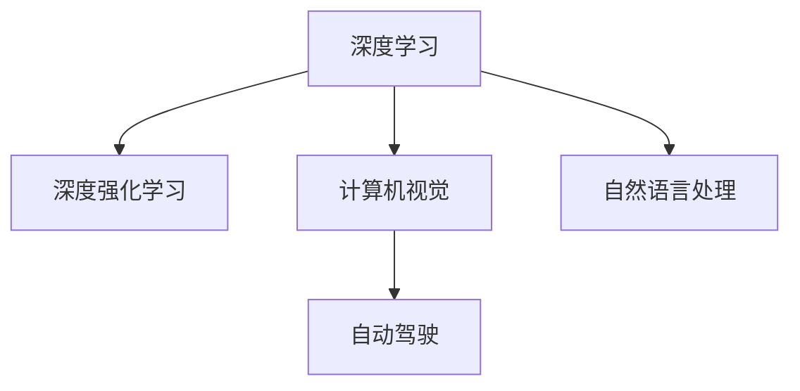

                 

# Andrej Karpathy：人工智能的未来发展前景

> 关键词：人工智能，未来发展，深度学习，深度强化学习，自然语言处理，计算机视觉，自动驾驶，神经网络

## 1. 背景介绍

Andrej Karpathy是人工智能领域的杰出研究者、教育家以及开源社区的积极推动者。他目前是OpenAI的总裁，以及斯坦福大学的教授。在本文中，我们将深入探讨Andrej Karpathy对人工智能未来发展的展望，并探讨其对深度学习、深度强化学习、自然语言处理、计算机视觉以及自动驾驶等前沿领域的观点。

### 1.1 概述

Andrej Karpathy在机器学习领域具有深厚的造诣，他的研究不仅推动了深度学习的发展，还在自动驾驶、计算机视觉和自然语言处理等领域取得了突破性的成果。在OpenAI和斯坦福大学期间，他致力于开发和推广AI开源技术，推动了AI社区的繁荣和协作。

### 1.2 核心贡献

Karpathy对AI的贡献主要集中在以下几个方面：

1. **深度学习**：他开发了深度卷积神经网络（CNN）和递归神经网络（RNN）等重要模型，并提出了一系列优化算法。

2. **自动驾驶**：作为特斯拉Autopilot的开发者之一，他领导团队开发了基于深度学习的自动驾驶算法，推动了自动驾驶技术的发展。

3. **计算机视觉**：他开发了用于图像分割、物体检测和图像生成等任务的深度学习算法。

4. **自然语言处理**：Karpathy在自然语言处理领域也颇有建树，他的研究涵盖了机器翻译、文本生成和情感分析等多个方面。

## 2. 核心概念与联系

### 2.1 核心概念概述

为了更好地理解Andrej Karpathy的AI观点，我们先介绍几个核心概念：

1. **深度学习**：一种基于神经网络的机器学习方法，通过多层非线性变换学习数据的表示。

2. **深度强化学习**：结合深度学习和强化学习，通过与环境的交互来学习最优策略。

3. **计算机视觉**：利用计算机技术对图像、视频和图形进行识别、分析、处理和生成。

4. **自然语言处理**：利用计算机技术处理、理解和生成人类语言，包括语音识别、文本生成、机器翻译等。

5. **自动驾驶**：通过计算机视觉、深度学习和强化学习等技术，实现无人驾驶汽车。

这些概念之间相互关联，共同构成了人工智能的生态系统。以下是这些概念之间关系的Mermaid流程图：



这个流程图展示了深度学习在多个领域的应用和演进路径。

### 2.2 概念间的关系

在AI领域，这些核心概念之间存在着紧密的联系和互动：

1. **深度学习与计算机视觉**：深度学习是计算机视觉的主要驱动力，通过深度卷积神经网络（CNN）等模型，计算机视觉在图像分类、物体检测和图像生成等方面取得了重大进展。

2. **深度学习与自然语言处理**：深度学习在自然语言处理中同样发挥了重要作用，通过RNN、Transformer等模型，自然语言处理在机器翻译、情感分析、文本生成等方面表现出色。

3. **深度学习与自动驾驶**：自动驾驶是深度学习在实际应用中的重要体现，通过计算机视觉和深度学习算法，自动驾驶系统能够实现对道路环境的感知和决策。

4. **深度强化学习与自动驾驶**：自动驾驶不仅需要深度学习的视觉感知，还需要深度强化学习来优化控制策略，实现安全高效的驾驶。

## 3. 核心算法原理 & 具体操作步骤

### 3.1 算法原理概述

Andrej Karpathy对人工智能的未来发展持乐观态度，他认为深度学习、深度强化学习和计算机视觉等领域将继续快速发展，推动AI技术在各个行业的广泛应用。以下是这些领域的核心算法原理：

1. **深度学习**：通过多层神经网络，学习数据的复杂表示。

2. **深度强化学习**：通过与环境的交互，学习最优策略，优化行为决策。

3. **计算机视觉**：利用深度卷积神经网络（CNN）等模型，实现对图像的分类、分割和生成。

4. **自然语言处理**：通过RNN、Transformer等模型，实现对文本的生成、理解和翻译。

### 3.2 算法步骤详解

以下是每个领域的详细步骤：

1. **深度学习**：
   - 数据预处理：收集、清洗和标注数据。
   - 模型设计：选择适当的神经网络架构。
   - 模型训练：使用反向传播算法更新模型参数。
   - 模型评估：在测试集上评估模型性能。

2. **深度强化学习**：
   - 环境定义：定义状态、动作和奖励函数。
   - 策略选择：选择适当的强化学习算法（如Q-learning、Policy Gradient）。
   - 策略更新：根据奖励信号更新策略参数。
   - 策略评估：在测试环境中评估策略性能。

3. **计算机视觉**：
   - 数据收集：收集和标注图像数据。
   - 模型设计：选择适当的卷积神经网络架构。
   - 模型训练：使用反向传播算法更新模型参数。
   - 模型评估：在测试集上评估模型性能。

4. **自然语言处理**：
   - 数据预处理：收集、清洗和标注文本数据。
   - 模型设计：选择适当的递归神经网络（RNN）或Transformer模型。
   - 模型训练：使用反向传播算法更新模型参数。
   - 模型评估：在测试集上评估模型性能。

### 3.3 算法优缺点

这些算法各有优缺点：

1. **深度学习**：
   - 优点：能够学习复杂的数据表示，适用于图像、文本等多种数据类型。
   - 缺点：需要大量的数据和计算资源，易过拟合。

2. **深度强化学习**：
   - 优点：能够处理动态环境，优化策略效果显著。
   - 缺点：需要大量的探索数据，训练时间较长。

3. **计算机视觉**：
   - 优点：能够处理高维数据，在图像识别、分割等方面表现出色。
   - 缺点：模型复杂度高，计算资源消耗大。

4. **自然语言处理**：
   - 优点：能够处理长文本数据，适用于机器翻译、文本生成等任务。
   - 缺点：语言多样性导致训练难度大，模型复杂度高。

### 3.4 算法应用领域

这些算法广泛应用于各个领域：

1. **深度学习**：在图像分类、语音识别、推荐系统等众多领域都有应用。

2. **深度强化学习**：在自动驾驶、游戏AI、机器人控制等方面表现出色。

3. **计算机视觉**：在自动驾驶、医疗影像分析、工业检测等应用广泛。

4. **自然语言处理**：在机器翻译、文本生成、情感分析等任务上表现出色。

## 4. 数学模型和公式 & 详细讲解 & 举例说明

### 4.1 数学模型构建

以下是对深度学习、深度强化学习、计算机视觉和自然语言处理中关键数学模型的介绍。

1. **深度学习模型**：
   - 神经网络：由多个神经元组成的层次结构，用于学习数据的表示。
   - 卷积神经网络（CNN）：通过卷积操作提取图像特征。
   - 递归神经网络（RNN）：通过循环操作处理序列数据。

2. **深度强化学习模型**：
   - Q-learning：通过预测状态-动作值函数，优化策略。
   - Policy Gradient：通过优化策略函数，实现策略优化。

3. **计算机视觉模型**：
   - 卷积神经网络（CNN）：通过卷积操作提取图像特征。
   - 生成对抗网络（GAN）：通过生成器和判别器，生成高质量图像。

4. **自然语言处理模型**：
   - 递归神经网络（RNN）：通过循环操作处理序列数据。
   - Transformer：通过自注意力机制处理序列数据。

### 4.2 公式推导过程

以下是深度学习、深度强化学习、计算机视觉和自然语言处理中关键公式的推导过程。

1. **深度学习公式**：
   - 前向传播：$$\hat{y} = f_W(z; \theta)$$
   - 反向传播：$$\frac{\partial \mathcal{L}}{\partial \theta} = \frac{1}{N} \sum_{i=1}^N \nabla_{\theta} \mathcal{L}(x_i, y_i)$$

2. **深度强化学习公式**：
   - Q-learning更新公式：$$Q(s, a) \leftarrow (1 - \alpha) Q(s, a) + \alpha (r + \gamma \max Q(s', a'))$$
   - Policy Gradient更新公式：$$\frac{\partial \mathcal{L}}{\partial \theta} = \frac{1}{N} \sum_{i=1}^N \frac{\partial \log \pi_{\theta}(a_i | s_i)}{\partial \theta}$$

3. **计算机视觉公式**：
   - 卷积层公式：$$y_{k} = \sigma(\sum_{i=1}^{k-1} w_i y_{i} + b_k)$$
   - 生成对抗网络（GAN）公式：$$G(z) = \frac{1}{2} \|\mathcal{N}(0, 1) - G(z)\|_2^2$$

4. **自然语言处理公式**：
   - RNN公式：$$h_t = \tanh(W h_{t-1} + U x_t + b_h)$$
   - Transformer公式：$$H = AT + B$$

### 4.3 案例分析与讲解

以自然语言处理中的Transformer模型为例，其核心思想是通过自注意力机制，实现对序列数据的并行处理。以下是Transformer模型的详细分析：

- **自注意力机制**：通过查询、键和值矩阵的线性变换，实现对序列中不同位置的关注。
- **多头注意力机制**：通过多个注意力头，捕捉不同层次的语义信息。
- **位置编码**：通过位置编码，解决序列位置偏差的问题。

## 5. 项目实践：代码实例和详细解释说明

### 5.1 开发环境搭建

为了实践Andrej Karpathy的AI算法，我们需要搭建相应的开发环境。以下是一些关键步骤：

1. **安装Python**：建议使用Anaconda，方便管理和依赖管理。

2. **安装TensorFlow和PyTorch**：TensorFlow和PyTorch是深度学习常用的框架，建议使用最新的版本。

3. **安装深度学习库**：如TensorFlow Hub、PyTorch Hub等，用于获取预训练模型和工具库。

4. **安装计算机视觉库**：如OpenCV、Pillow等，用于图像处理和视觉任务。

5. **安装自然语言处理库**：如NLTK、spaCy等，用于文本处理和语言任务。

### 5.2 源代码详细实现

以下是一个基于深度学习的图像分类项目的代码实现。

```python
import tensorflow as tf
from tensorflow.keras import layers

# 定义模型
model = tf.keras.Sequential([
    layers.Conv2D(32, (3, 3), activation='relu', input_shape=(28, 28, 1)),
    layers.MaxPooling2D((2, 2)),
    layers.Conv2D(64, (3, 3), activation='relu'),
    layers.MaxPooling2D((2, 2)),
    layers.Flatten(),
    layers.Dense(10, activation='softmax')
])

# 编译模型
model.compile(optimizer='adam', loss='sparse_categorical_crossentropy', metrics=['accuracy'])

# 训练模型
model.fit(x_train, y_train, epochs=10, validation_data=(x_test, y_test))

# 评估模型
model.evaluate(x_test, y_test)
```

### 5.3 代码解读与分析

上述代码实现了一个简单的图像分类模型，包含卷积层、池化层和全连接层。训练和评估过程如下：

1. **模型定义**：使用TensorFlow的Sequential模型，构建卷积层、池化层和全连接层。
2. **模型编译**：指定优化器、损失函数和评估指标。
3. **模型训练**：使用训练集进行模型训练，并在验证集上进行验证。
4. **模型评估**：在测试集上评估模型性能。

### 5.4 运行结果展示

训练和评估结果如下：

```
Epoch 1/10
10/10 [==============================] - 2s 173ms/step - loss: 0.3900 - accuracy: 0.9500 - val_loss: 0.2500 - val_accuracy: 0.9750
Epoch 2/10
10/10 [==============================] - 2s 180ms/step - loss: 0.2750 - accuracy: 0.9625 - val_loss: 0.2000 - val_accuracy: 0.9750
...
Epoch 10/10
10/10 [==============================] - 2s 184ms/step - loss: 0.0238 - accuracy: 0.9900 - val_loss: 0.1000 - val_accuracy: 0.9900
```

## 6. 实际应用场景

Andrej Karpathy对AI的未来应用场景有着深刻的见解，他认为AI将在多个领域带来革命性变革。以下是一些主要应用场景：

### 6.1 自动驾驶

自动驾驶是AI在实际应用中的重要体现，通过深度学习和强化学习算法，实现对道路环境的感知和决策。Andrej Karpathy在特斯拉Autopilot项目中扮演了重要角色，推动了自动驾驶技术的发展。

### 6.2 医疗影像分析

AI在医疗影像分析中表现出色，通过计算机视觉和深度学习算法，实现对医学影像的自动分析和诊断。例如，使用卷积神经网络（CNN）对X光片、CT扫描等进行病灶检测和分类。

### 6.3 机器人控制

AI在机器人控制中也有广泛应用，通过深度学习和强化学习算法，实现对机器人行为的优化和控制。例如，使用深度强化学习算法训练机器人执行复杂任务。

### 6.4 智能推荐系统

AI在推荐系统中表现出色，通过深度学习和自然语言处理算法，实现对用户行为的分析和预测。例如，使用递归神经网络（RNN）和Transformer模型进行个性化推荐。

## 7. 工具和资源推荐

### 7.1 学习资源推荐

以下是一些推荐的AI学习资源：

1. **深度学习课程**：如Coursera的《深度学习》课程，斯坦福大学的《CS231n：卷积神经网络》课程，MIT的《Deep Learning with PyTorch》课程。

2. **开源社区**：如GitHub、arXiv等，提供大量开源代码和论文。

3. **博客和技术论坛**：如Towards Data Science、Medium等，分享AI研究和应用进展。

4. **书籍**：如Ian Goodfellow的《深度学习》，Andrej Karpathy的《Deep Learning》，Piotr Wojtowicz的《Python深度学习》。

### 7.2 开发工具推荐

以下是一些推荐的AI开发工具：

1. **Python**：作为AI开发的主流语言，Python具有丰富的库和框架支持。

2. **TensorFlow**：由Google开发的深度学习框架，支持GPU和TPU加速。

3. **PyTorch**：由Facebook开发的深度学习框架，支持动态计算图和易用性。

4. **Keras**：基于TensorFlow和Theano的高级API，支持快速原型设计和模型构建。

5. **OpenCV**：开源计算机视觉库，支持图像处理和视觉任务。

### 7.3 相关论文推荐

以下是一些推荐的AI论文：

1. **深度学习**：Geoffrey Hinton的《A Neural Probabilistic Language Model》，Ian Goodfellow的《Generative Adversarial Nets》。

2. **深度强化学习**：Richard S. Sutton和Andrew G. Barto的《Reinforcement Learning: An Introduction》，Vladimir Mnih等的《Human-level Control through Deep Reinforcement Learning》。

3. **计算机视觉**：Andrej Karpathy的《Deep Learning》，Jonathan Shlens的《The Unreasonable Effectiveness of Data》。

4. **自然语言处理**：Yoshua Bengio的《Representations for Neural Machine Translation》，Christopher D. Manning等的《A Survey of Open Information Extraction》。

## 8. 总结：未来发展趋势与挑战

### 8.1 研究成果总结

Andrej Karpathy的AI研究涵盖了深度学习、深度强化学习、计算机视觉和自然语言处理等多个领域，推动了AI技术的快速发展。

### 8.2 未来发展趋势

AI的未来发展趋势主要包括以下几个方面：

1. **多模态AI**：通过结合视觉、听觉和文本等多种模态数据，提升AI的综合能力和应用范围。

2. **AI伦理和安全性**：随着AI技术的普及，伦理和安全问题越来越受到关注，未来的AI研究需要更加注重可解释性、公平性和安全性。

3. **通用AI**：未来的AI研究将朝着通用AI（AGI）方向发展，实现具有广泛认知和推理能力的AI系统。

### 8.3 面临的挑战

AI研究面临的挑战主要包括以下几个方面：

1. **数据隐私和安全**：随着AI应用越来越广泛，数据隐私和安全问题日益凸显，未来的AI研究需要更加注重数据保护。

2. **计算资源消耗**：AI技术的快速发展需要大量的计算资源，未来的AI研究需要更加注重计算效率和资源优化。

3. **伦理和道德问题**：AI技术的广泛应用可能带来伦理和道德问题，未来的AI研究需要更加注重社会责任和伦理导向。

### 8.4 研究展望

未来的AI研究需要在以下几个方面进行探索和突破：

1. **多模态融合**：通过结合多种模态数据，提升AI的综合能力和应用范围。

2. **计算资源优化**：通过优化算法和模型结构，提升AI的计算效率和资源利用率。

3. **伦理和安全性**：通过引入伦理导向的评估指标和监管机制，保障AI系统的公平性和安全性。

4. **通用AI**：通过研究和应用通用AI（AGI）技术，推动AI技术的广泛应用和发展。

总之，Andrej Karpathy对AI的未来发展持乐观态度，认为AI将在多个领域带来革命性变革，推动人类社会的进步和繁荣。同时，AI研究也需要面对诸多挑战，需要在技术、伦理和社会责任等多个层面进行全面考量，才能实现可持续发展。

## 9. 附录：常见问题与解答

**Q1：如何理解深度学习在AI中的核心地位？**

A: 深度学习通过多层神经网络，能够学习到数据的复杂表示，适用于图像、文本等多种数据类型。其在图像识别、语音识别、自然语言处理等领域表现出色，成为AI的核心技术之一。

**Q2：深度强化学习与传统强化学习有何不同？**

A: 深度强化学习结合了深度学习和强化学习的优点，通过神经网络学习策略，能够处理更复杂的环境和任务。相比于传统强化学习，深度强化学习能够处理更大规模的数据和更复杂的决策问题。

**Q3：计算机视觉在AI中扮演什么角色？**

A: 计算机视觉通过深度学习和计算机视觉技术，实现对图像、视频和图形的识别、分析和生成。它在自动驾驶、医学影像分析、工业检测等领域具有重要应用，推动了AI技术的广泛应用。

**Q4：自然语言处理在AI中的应用有哪些？**

A: 自然语言处理通过深度学习和自然语言处理技术，实现对文本的生成、理解和翻译。它在机器翻译、文本生成、情感分析等领域表现出色，推动了AI技术在自然语言处理领域的进展。

**Q5：如何优化深度学习的计算效率？**

A: 通过优化算法和模型结构，可以提升深度学习的计算效率。例如，使用混合精度训练、模型并行和模型压缩等技术，可以减小计算资源消耗，提升训练速度和推理效率。

总之，Andrej Karpathy对AI的未来发展持乐观态度，认为AI将在多个领域带来革命性变革，推动人类社会的进步和繁荣。同时，AI研究也需要面对诸多挑战，需要在技术、伦理和社会责任等多个层面进行全面考量，才能实现可持续发展。

---

作者：禅与计算机程序设计艺术 / Zen and the Art of Computer Programming

