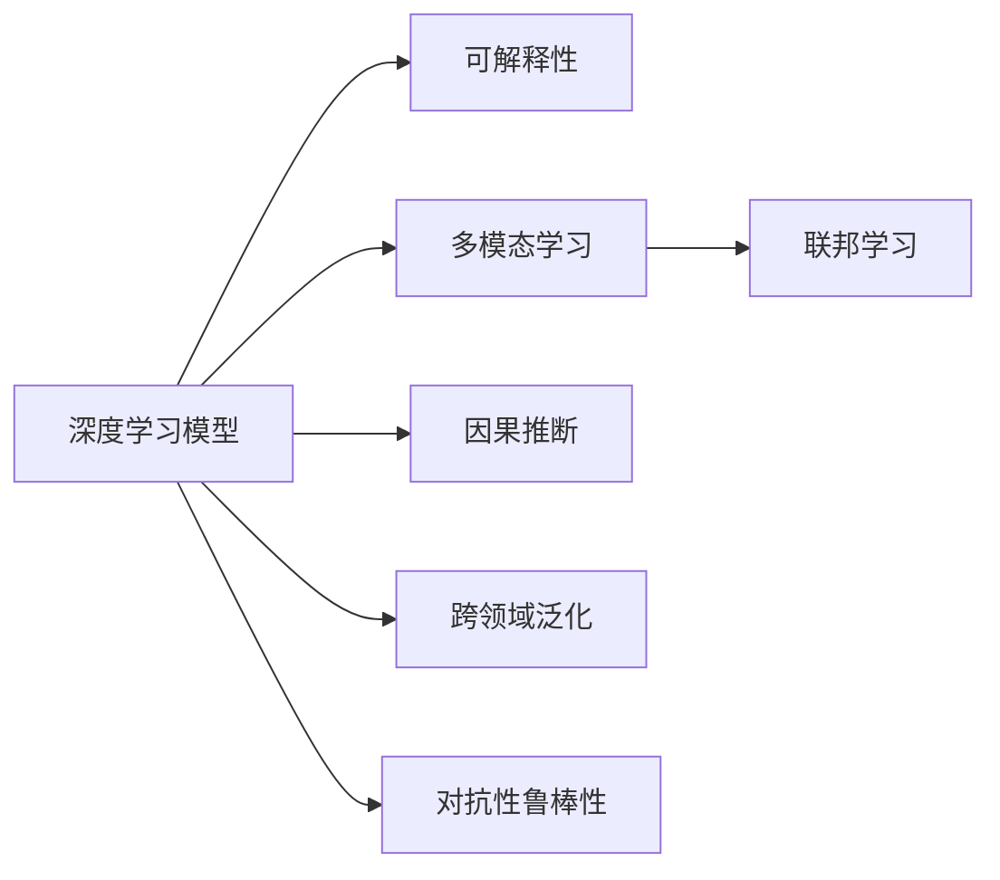

                 

## 1. 背景介绍

### 1.1 问题由来
Andrej Karpathy作为深度学习领域的顶尖专家，始终站在人工智能研究的前沿，深度剖析了人工智能未来的发展方向。在本博客中，他将基于自己丰富的研究成果和前沿洞见，探讨人工智能领域的前景和挑战，为从业者指明方向。

### 1.2 问题核心关键点
Karpathy认为，人工智能的未来发展方向将包括以下几个关键点：
1. **模型复杂度与可解释性**：如何在大规模复杂模型和高性能之间找到平衡，提升模型的可解释性和透明度。
2. **多模态学习**：如何让模型能够处理和理解多模态数据，如图像、语音、文本等。
3. **联邦学习与隐私保护**：如何在保护用户隐私的前提下，通过分布式训练提高模型的泛化能力。
4. **因果推断**：如何让模型不仅预测结果，还能够理解因果关系，提高决策的合理性和可解释性。
5. **跨领域泛化**：如何让模型在新的领域和任务上表现出色，提升模型的适应性和泛化能力。
6. **对抗性鲁棒性**：如何增强模型的对抗性鲁棒性，抵御各种攻击和干扰。

这些关键点将深刻影响未来人工智能的发展路径和应用领域。

## 2. 核心概念与联系

### 2.1 核心概念概述

为更好地理解人工智能未来的发展方向，我们需要理解以下核心概念：

- **深度学习模型**：基于神经网络结构的模型，通过学习大规模数据集的特征来预测新数据。
- **可解释性**：模型输出的解释能力，即能够通过简单、直观的方式解释模型的决策过程。
- **多模态学习**：处理多种数据形式（如文本、图像、音频等）的技术。
- **联邦学习**：通过分散式数据计算来训练模型，保护用户隐私。
- **因果推断**：理解事件之间的因果关系，而不是仅仅预测结果。
- **跨领域泛化**：模型在不同领域和任务上的泛化能力。
- **对抗性鲁棒性**：模型抵抗恶意攻击和干扰的能力。

### 2.2 核心概念间的联系

这些核心概念通过以下Mermaid流程图展示它们之间的联系：



该流程图展示了深度学习模型通过不同的技术实现可解释性、多模态学习、联邦学习、因果推断、跨领域泛化、对抗性鲁棒性等多方面的提升，形成了未来人工智能的核心能力。

## 3. 核心算法原理 & 具体操作步骤
### 3.1 算法原理概述

未来人工智能的发展，将依赖于以下几个核心算法原理：

1. **神经网络结构优化**：通过网络结构的优化，提升模型的泛化能力和效率。
2. **正则化技术**：通过正则化技术，如Dropout、L2正则化等，防止过拟合，提升模型泛化能力。
3. **数据增强**：通过数据增强技术，扩充训练数据，提升模型鲁棒性。
4. **多模态融合**：通过多模态数据融合技术，将不同模态的数据进行融合，提升模型理解复杂信息的能力。
5. **联邦学习**：通过联邦学习技术，分散式训练模型，保护用户隐私。
6. **因果推断**：通过因果推断技术，理解事件之间的因果关系，提升决策的合理性。

### 3.2 算法步骤详解

以下是详细的算法步骤：

1. **数据准备**：收集大规模数据集，进行预处理，准备好训练集和验证集。
2. **模型选择**：选择合适的神经网络结构，如CNN、RNN、Transformer等。
3. **模型初始化**：初始化模型参数，使用随机初始化或预训练模型。
4. **模型训练**：在训练集上进行模型训练，使用优化器进行参数更新。
5. **验证集验证**：在验证集上验证模型性能，使用正则化技术和早停法防止过拟合。
6. **模型评估**：在测试集上评估模型性能，进行多模态数据融合和因果推断。
7. **模型部署**：将训练好的模型部署到生产环境中，进行实时推理。
8. **持续学习**：在实时数据上持续学习，更新模型参数，提升模型泛化能力。

### 3.3 算法优缺点

深度学习模型具有以下优点：
1. **高效性**：通过学习大规模数据，模型可以自动发现特征，减少特征工程的工作量。
2. **适应性**：通过优化神经网络结构和正则化技术，模型能够适应各种复杂数据。
3. **泛化能力强**：通过多模态数据融合和因果推断，模型能够理解复杂信息，进行跨领域泛化。

但同时，深度学习模型也存在一些缺点：
1. **可解释性差**：深度学习模型通常被视为"黑盒"，难以解释其内部工作机制。
2. **过拟合风险**：在大规模数据上训练，容易发生过拟合现象。
3. **计算资源需求高**：深度学习模型需要大量的计算资源进行训练和推理。

### 3.4 算法应用领域

深度学习模型在多个领域都有广泛应用，包括但不限于：

- **自然语言处理**：如文本分类、情感分析、机器翻译等。
- **计算机视觉**：如图像识别、目标检测、图像生成等。
- **语音识别**：如语音转文本、语音命令控制等。
- **智能推荐**：如电商推荐、音乐推荐等。
- **自动驾驶**：如环境感知、路径规划等。

## 4. 数学模型和公式 & 详细讲解 & 举例说明
### 4.1 数学模型构建

以神经网络模型为例，其数学模型可以表示为：

$$
f(x; \theta) = \sigma(Wx + b)
$$

其中，$x$为输入数据，$\theta$为模型参数，$W$为权重矩阵，$b$为偏置向量，$\sigma$为激活函数。

### 4.2 公式推导过程

以反向传播算法为例，推导过程如下：

1. **前向传播**：将输入数据$x$通过神经网络，得到输出$f(x; \theta)$。
2. **计算损失函数**：计算模型输出与真实标签之间的差异，如交叉熵损失。
3. **反向传播**：通过链式法则，计算损失函数对模型参数的梯度。
4. **更新参数**：使用优化器，如Adam，根据梯度更新模型参数。

### 4.3 案例分析与讲解

以图像识别为例，使用卷积神经网络(CNN)进行图像分类任务。训练集包含大量图像和对应的标签，模型通过学习这些数据，能够自动发现图像特征，并进行分类。

## 5. 项目实践：代码实例和详细解释说明
### 5.1 开发环境搭建

1. 安装Python和相关库，如TensorFlow、Keras等。
2. 安装GPU驱动和CUDA库。
3. 配置环境变量，设置路径和依赖。

### 5.2 源代码详细实现

以下是一个简单的神经网络模型实现的示例代码：

```python
import tensorflow as tf
from tensorflow import keras

# 定义模型结构
model = keras.Sequential([
    keras.layers.Dense(256, activation='relu'),
    keras.layers.Dense(128, activation='relu'),
    keras.layers.Dense(10, activation='softmax')
])

# 编译模型
model.compile(optimizer='adam',
              loss=tf.keras.losses.SparseCategoricalCrossentropy(from_logits=True),
              metrics=['accuracy'])

# 训练模型
model.fit(train_dataset, epochs=10, validation_data=val_dataset)
```

### 5.3 代码解读与分析

该代码实现了一个简单的神经网络模型，包含两个全连接层和一个softmax层。使用Adam优化器进行模型训练，交叉熵损失函数进行损失计算，准确率进行模型评估。训练过程中，使用验证集进行模型验证，防止过拟合。

### 5.4 运行结果展示

训练结束后，可以在测试集上进行模型评估，输出准确率等性能指标。

## 6. 实际应用场景
### 6.1 未来应用展望

未来，人工智能将在多个领域得到广泛应用，包括但不限于：

- **智能医疗**：通过深度学习，辅助医生进行疾病诊断和治疗决策。
- **智能制造**：通过深度学习，优化生产流程，提高生产效率。
- **智能交通**：通过深度学习，优化交通流量，减少拥堵。
- **智能城市**：通过深度学习，提升城市治理和公共服务水平。

## 7. 工具和资源推荐
### 7.1 学习资源推荐

1. Coursera《Deep Learning Specialization》：由Andrew Ng开设，涵盖深度学习的基础和进阶内容。
2. Udacity《AI Nanodegree》：提供综合性的深度学习和人工智能课程。
3. DeepLearning.AI：提供深度学习相关的在线课程和书籍。
4. GitHub开源项目：搜索相关的开源项目，学习最佳实践和代码实现。

### 7.2 开发工具推荐

1. TensorFlow：Google开发的深度学习框架，支持分布式训练和模型部署。
2. PyTorch：Facebook开发的深度学习框架，支持动态计算图和高效的张量操作。
3. Keras：高层次的深度学习框架，易于上手。

### 7.3 相关论文推荐

1. "Deep Learning" by Ian Goodfellow、Yoshua Bengio和Aaron Courville。
2. "Learning from Data: A Selective Overview" by Vladimir Vapnik。
3. "Human-Centered AI" by Casper lowell Oesterle。

## 8. 总结：未来发展趋势与挑战
### 8.1 研究成果总结

未来人工智能的发展，将依赖于以下几个方面：

1. **模型复杂度与可解释性**：提升模型可解释性和透明度，帮助人类理解AI决策过程。
2. **多模态学习**：处理多种数据形式，提升模型理解复杂信息的能力。
3. **联邦学习与隐私保护**：在保护用户隐私的前提下，通过分布式训练提高模型的泛化能力。
4. **因果推断**：理解事件之间的因果关系，提升决策的合理性和可解释性。
5. **跨领域泛化**：提升模型的适应性和泛化能力，在不同领域和任务上表现出色。
6. **对抗性鲁棒性**：增强模型的对抗性鲁棒性，抵御各种攻击和干扰。

### 8.2 未来发展趋势

1. **模型复杂度提升**：未来深度学习模型将更加复杂，参数数量将进一步增长。
2. **可解释性增强**：研究如何提升模型的可解释性，增强透明性和可信度。
3. **多模态数据融合**：通过多模态数据融合，提升模型的理解和生成能力。
4. **联邦学习普及**：联邦学习技术将得到广泛应用，保护用户隐私。
5. **因果推断应用**：因果推断技术将在决策支持系统中发挥重要作用。
6. **跨领域泛化扩展**：模型将在更多领域和任务上表现出色。
7. **对抗性鲁棒性增强**：通过对抗性鲁棒性技术，增强模型抵抗恶意攻击的能力。

### 8.3 面临的挑战

未来人工智能面临的挑战包括：

1. **数据隐私和安全**：如何在保护用户隐私的前提下，进行数据训练和模型部署。
2. **模型可解释性**：如何提升模型的可解释性，增强透明性和可信度。
3. **计算资源需求**：深度学习模型需要大量的计算资源进行训练和推理。
4. **对抗性攻击**：如何增强模型的对抗性鲁棒性，抵御各种攻击和干扰。
5. **伦理和社会责任**：如何避免AI模型的偏见和歧视，确保公平性。

### 8.4 研究展望

未来研究需要关注以下几个方向：

1. **可解释AI**：提升AI模型的可解释性，增强透明性和可信度。
2. **多模态学习**：研究如何处理多种数据形式，提升模型理解复杂信息的能力。
3. **联邦学习**：研究如何在保护用户隐私的前提下，进行分布式训练。
4. **因果推断**：研究如何理解事件之间的因果关系，提升决策的合理性。
5. **跨领域泛化**：研究如何提升模型的适应性和泛化能力，在不同领域和任务上表现出色。
6. **对抗性鲁棒性**：研究如何增强模型的对抗性鲁棒性，抵御各种攻击和干扰。

## 9. 附录：常见问题与解答
----------------------------------------------------------------

**Q1：什么是深度学习模型？**

A: 深度学习模型是基于神经网络结构的模型，通过学习大规模数据集的特征来预测新数据。

**Q2：什么是可解释性？**

A: 可解释性是指模型输出的解释能力，即能够通过简单、直观的方式解释模型的决策过程。

**Q3：什么是多模态学习？**

A: 多模态学习是指处理多种数据形式（如文本、图像、音频等）的技术。

**Q4：什么是联邦学习？**

A: 联邦学习是指通过分散式数据计算来训练模型，保护用户隐私。

**Q5：什么是因果推断？**

A: 因果推断是指理解事件之间的因果关系，而不是仅仅预测结果。

**Q6：什么是跨领域泛化？**

A: 跨领域泛化是指模型在不同领域和任务上的泛化能力。

**Q7：什么是对抗性鲁棒性？**

A: 对抗性鲁棒性是指模型抵抗恶意攻击和干扰的能力。

**Q8：未来人工智能的发展方向有哪些？**

A: 未来人工智能的发展方向包括提升模型复杂度与可解释性、多模态学习、联邦学习与隐私保护、因果推断、跨领域泛化和对抗性鲁棒性。

**Q9：深度学习模型有哪些优点和缺点？**

A: 深度学习模型具有高效性、适应性和泛化能力强的优点。缺点是可解释性差、容易过拟合和计算资源需求高。

**Q10：未来人工智能将面临哪些挑战？**

A: 未来人工智能将面临数据隐私和安全、模型可解释性、计算资源需求、对抗性攻击、伦理和社会责任等挑战。

**Q11：未来人工智能的研究方向有哪些？**

A: 未来人工智能的研究方向包括可解释AI、多模态学习、联邦学习、因果推断、跨领域泛化和对抗性鲁棒性。

**Q12：如何提升深度学习模型的可解释性？**

A: 可以通过使用可解释的模型结构、简化模型复杂度、引入可解释的特征工程等方法提升深度学习模型的可解释性。

**Q13：如何处理多模态数据？**

A: 可以使用多模态融合技术，将不同模态的数据进行融合，提升模型理解复杂信息的能力。

**Q14：如何保护用户隐私？**

A: 可以使用联邦学习技术，通过分散式数据计算来训练模型，保护用户隐私。

**Q15：如何理解事件之间的因果关系？**

A: 可以使用因果推断技术，理解事件之间的因果关系，提升决策的合理性。

**Q16：如何提升模型的泛化能力？**

A: 可以使用正则化技术、数据增强技术、对抗训练技术等方法提升模型的泛化能力。

**Q17：如何增强模型的对抗性鲁棒性？**

A: 可以使用对抗训练技术、知识蒸馏技术、模型压缩技术等方法增强模型的对抗性鲁棒性。

**Q18：如何部署深度学习模型？**

A: 可以将训练好的模型部署到生产环境中，进行实时推理。

**Q19：如何在分布式系统中进行深度学习？**

A: 可以使用联邦学习技术，在保护用户隐私的前提下，通过分布式训练提高模型的泛化能力。

**Q20：如何保护深度学习模型的安全性？**

A: 可以使用安全认证技术、数据脱敏技术、异常检测技术等方法保护深度学习模型的安全性。

作者：禅与计算机程序设计艺术 / Zen and the Art of Computer Programming

