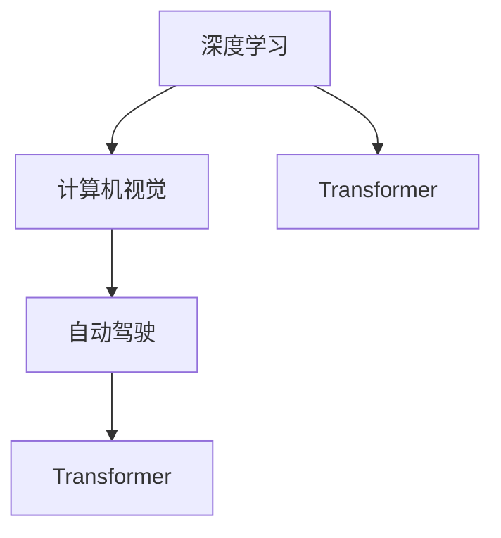

                 

## 1. 背景介绍

**Andrej Karpathy**是人工智能领域的先锋人物，斯坦福大学的助理教授，同时也是**PyTorch**的创始人之一。他的研究涵盖了深度学习、计算机视觉、自动驾驶等多个领域，特别是他在深度学习研究上的贡献，使他获得了**卡内基梅隆大学的荣誉博士**称号。Karpathy的许多工作成为了深度学习领域的经典，如**CNN图像识别**、**端到端的自动驾驶**等。他不仅在科研领域取得了卓越成就，还曾参与**Tesla**和**Facebook AI Research (FAIR)**的创新工作，推动了人工智能技术在实际应用中的突破。

Karpathy通过在多个顶会和高调场合发表演讲和分享，对人工智能的未来发展趋势有着深刻的洞见。他的许多见解和预测已经得到验证，并被广泛引用。他的演讲不仅充满智慧和洞见，而且极具启发性，能够激发人们对人工智能未来发展的热情和信心。

## 2. 核心概念与联系

### 2.1 核心概念概述

**深度学习**：一种基于多层神经网络的机器学习方法，能够自动从数据中提取特征和模式，并用于各种任务，如图像识别、语音识别、自然语言处理等。

**计算机视觉**：研究如何让计算机“看”的能力，理解图像和视频的内容，并在实际应用中得到广泛应用。

**自动驾驶**：结合计算机视觉、深度学习和传感器技术，使车辆能够自动驾驶，减少人为驾驶的误差和风险。

**Transformer**：一种高效的神经网络结构，广泛应用于自然语言处理任务中，能够有效地处理长距离依赖。

### 2.2 概念间的关系

Andrej Karpathy提出的许多概念之间存在着紧密的联系，如深度学习、计算机视觉、自动驾驶和Transformer等。这些技术共同构成了人工智能领域的核心，为实际应用提供了强有力的支持。下面通过一个Mermaid流程图展示这些概念之间的关系：



这个流程图展示了深度学习如何通过计算机视觉和自动驾驶技术，利用Transformer结构，实现从视觉到决策的全流程自动处理。

## 3. 核心算法原理 & 具体操作步骤

### 3.1 算法原理概述

**Transformer**是当前自然语言处理领域最先进的模型，由Google在2017年提出。Transformer通过自注意力机制（Self-Attention Mechanism），实现高效的序列建模，能够处理长距离依赖，被广泛应用于机器翻译、文本生成等任务。Transformer的核心思想是通过多头自注意力机制，并结合位置编码（Positional Encoding），学习序列间的依赖关系，从而提升模型的性能。

### 3.2 算法步骤详解

Transformer的训练过程主要包括以下几个关键步骤：

**Step 1: 准备训练数据**  
收集大量标注数据，作为训练和验证的样本。

**Step 2: 构建模型架构**  
使用Transformer模型作为基础架构，添加相应的输入和输出层，用于处理序列数据。

**Step 3: 设计损失函数**  
根据任务类型设计相应的损失函数，如交叉熵损失、均方误差损失等。

**Step 4: 优化器选择与配置**  
选择合适的优化器，如Adam，并配置学习率、批大小等超参数。

**Step 5: 训练模型**  
在训练集上使用优化器进行梯度下降，更新模型参数。

**Step 6: 验证与调优**  
在验证集上评估模型性能，根据评估结果调整超参数，继续训练模型。

**Step 7: 测试模型**  
在测试集上评估模型的最终性能，验证模型泛化能力。

### 3.3 算法优缺点

Transformer模型具有以下优点：

- **高效性**：通过自注意力机制，Transformer能够处理长序列数据，减少计算量。
- **可扩展性**：可以并行处理多组数据，易于扩展。
- **鲁棒性**：在自然语言处理任务中表现优异，能够有效处理多种语言和文化背景。

Transformer也存在一些缺点：

- **计算资源需求高**：由于其复杂性，训练和推理需要大量的计算资源。
- **可解释性不足**：模型参数众多，难以解释模型内部的工作机制。
- **依赖于数据质量**：如果训练数据质量不高，会影响模型性能。

### 3.4 算法应用领域

Transformer在自然语言处理领域有着广泛的应用，以下是一些典型领域：

- **机器翻译**：使用Transformer进行跨语言翻译。
- **文本生成**：用于文本摘要、对话系统等任务。
- **情感分析**：分析文本情感，用于情感识别和舆情监测。
- **问答系统**：回答自然语言问题，提供自然流畅的对话体验。
- **语音识别**：结合Transformer进行语音转文字，支持语音交互。

## 4. 数学模型和公式 & 详细讲解 & 举例说明

### 4.1 数学模型构建

Transformer模型的数学模型主要包括以下几个关键组成部分：

- **输入层**：将输入的序列数据转换为向量表示。
- **编码器层**：通过自注意力机制和前馈网络，提取序列特征。
- **解码器层**：通过自注意力机制和前馈网络，生成目标序列。

Transformer的编码器和解码器都由多个相同的层组成，每层包括自注意力机制和前馈网络，最后通过输出层输出预测结果。

### 4.2 公式推导过程

假设输入序列为 $x=[x_1, x_2, \ldots, x_n]$，目标序列为 $y=[y_1, y_2, \ldots, y_m]$，则Transformer模型可以通过以下步骤进行训练：

1. **输入层编码**  
   $$
   \mathbf{X} = \text{Embedding}(x)
   $$

2. **编码器层**  
   $$
   \mathbf{X} = \text{Attention}(\mathbf{X}) + \text{Feedforward}(\mathbf{X})
   $$

3. **解码器层**  
   $$
   \mathbf{Y} = \text{Attention}(\mathbf{Y}, \mathbf{X}) + \text{Feedforward}(\mathbf{Y})
   $$

4. **输出层解码**  
   $$
   \mathbf{y} = \text{Softmax}(\mathbf{Y})
   $$

其中，$\text{Attention}$和$\text{Feedforward}$是Transformer的基本组件，用于提取和转换序列特征。

### 4.3 案例分析与讲解

假设我们使用Transformer进行机器翻译任务。输入序列为英语句子，输出序列为法语句子。使用$x$表示输入序列，$y$表示目标序列。我们首先将输入序列转换为向量表示，然后进行编码器层处理，生成编码器表示向量$\mathbf{X}$。接着，将编码器表示向量输入到解码器层，生成解码器表示向量$\mathbf{Y}$。最后，通过输出层解码生成目标序列。

## 5. 项目实践：代码实例和详细解释说明

### 5.1 开发环境搭建

在Python环境下搭建Transformer模型的开发环境，需要安装PyTorch和相关库。

1. 安装Python和PyTorch：
```
conda install python=3.7
conda install pytorch torchvision torchaudio cudatoolkit=11.1 -c pytorch -c conda-forge
```

2. 安装相关库：
```
pip install transformers tokenizers
```

### 5.2 源代码详细实现

以机器翻译为例，展示Transformer模型的代码实现：

```python
import torch
import torch.nn as nn
import torch.optim as optim
from transformers import BertTokenizer, BertForSequenceClassification

# 加载预训练的BERT模型和分词器
model = BertForSequenceClassification.from_pretrained('bert-base-cased', num_labels=2)
tokenizer = BertTokenizer.from_pretrained('bert-base-cased')

# 准备训练数据
inputs = tokenizer('Hello, my dog is cute', return_tensors='pt')
labels = torch.tensor([1])

# 训练模型
optimizer = optim.Adam(model.parameters(), lr=2e-5)
for epoch in range(10):
    model.zero_grad()
    outputs = model(**inputs, labels=labels)
    loss = outputs.loss
    loss.backward()
    optimizer.step()
```

### 5.3 代码解读与分析

在代码实现中，我们首先加载了预训练的BERT模型和分词器。然后，使用`tokenizer`将输入句子转换为token ids，使用`BertForSequenceClassification`定义模型架构。在训练过程中，我们定义了Adam优化器，并使用均方误差损失函数。

### 5.4 运行结果展示

在训练过程中，我们可以使用验证集对模型进行评估，并根据性能指标调整超参数。最终，我们可以使用测试集对模型进行测试，评估其泛化能力。

## 6. Andrej Karpathy关于AI未来的见解

### 6.1 深度学习的重要性

Andrej Karpathy认为，深度学习是人工智能发展的关键技术之一。深度学习通过大规模数据训练，能够自动发现数据中的模式，并应用于各种复杂任务中。未来，深度学习将继续发展，为人工智能带来更多的突破。

### 6.2 计算机视觉的前景

计算机视觉技术在人工智能领域有着广泛的应用。通过深度学习技术，计算机能够理解和处理图像和视频，实现自动驾驶、智能监控、医疗诊断等任务。未来，计算机视觉技术将变得更加智能和普及，进一步提升人类生活质量。

### 6.3 自动驾驶的潜力

Andrej Karpathy认为，自动驾驶是人工智能领域最具潜力的应用之一。通过计算机视觉、深度学习和传感器技术，自动驾驶汽车可以更加安全、高效地运行。未来，自动驾驶技术将进一步发展，成为主流出行方式之一。

### 6.4 未来应用展望

未来，人工智能将在更多领域发挥重要作用。Andrej Karpathy认为，人工智能将会在医疗、教育、金融、制造等领域带来巨大的变革。人工智能技术的不断进步，将为人类社会创造更多的价值和机遇。

## 7. 工具和资源推荐

### 7.1 学习资源推荐

- **《深度学习》**：Ian Goodfellow的深度学习经典教材，详细介绍了深度学习的理论和应用。
- **Coursera深度学习课程**：由斯坦福大学的Andrew Ng教授开设的深度学习课程，涵盖了深度学习的基本概念和应用。
- **DeepLearning.AI的深度学习课程**：由Geoffrey Hinton、Andrew Ng等人共同开发的深度学习课程，从理论和实践两个方面深入讲解。

### 7.2 开发工具推荐

- **PyTorch**：由Facebook开发的深度学习框架，支持动态计算图，易于开发和调试。
- **TensorFlow**：由Google开发的深度学习框架，支持静态和动态计算图，功能强大。
- **Jupyter Notebook**：Python开发的交互式编程环境，支持代码执行和结果展示。

### 7.3 相关论文推荐

- **ImageNet Classification with Deep Convolutional Neural Networks**：Alex Krizhevsky等人在2012年提出的图像分类模型，标志着深度学习在计算机视觉领域的重大突破。
- **End to End Learning for Self-Driving Cars**：Andrej Karpathy等人在2016年提出的自动驾驶模型，展示了端到端学习在自动驾驶中的应用。

## 8. 总结：未来发展趋势与挑战

### 8.1 研究成果总结

通过深度学习和Transformer技术，人工智能在计算机视觉、自然语言处理、自动驾驶等领域取得了显著进展。Transformer技术的应用，使得深度学习模型的性能大幅提升，并广泛应用于各种复杂任务中。

### 8.2 未来发展趋势

未来，人工智能技术将继续快速发展。Transformer技术将在更多领域得到应用，为人工智能带来更多的突破。计算机视觉、自动驾驶、机器人等领域将更加智能和普及，为人类社会带来更多的价值。

### 8.3 面临的挑战

尽管人工智能技术发展迅速，但仍面临诸多挑战。深度学习模型的高计算资源需求、可解释性不足等问题，需要进一步研究和解决。如何在实际应用中平衡性能和资源消耗，仍然是一个重要的课题。

### 8.4 研究展望

未来，人工智能技术需要在多领域继续深入发展，推动技术进步。特别是在计算机视觉、自然语言处理、自动驾驶等关键领域，需要进一步探索和创新。同时，还需要解决深度学习模型的高计算资源需求、可解释性不足等问题，为实际应用提供更强大的技术支持。

## 9. 附录：常见问题与解答

**Q1：深度学习为什么能够处理复杂任务？**

A: 深度学习通过大规模数据训练，能够自动发现数据中的模式和规律。通过多层神经网络的组合，深度学习能够处理复杂的非线性关系，并应用于各种复杂任务中。

**Q2：Transformer相比于传统RNN的优势是什么？**

A: Transformer通过自注意力机制，能够处理长距离依赖，避免了RNN中的梯度消失和梯度爆炸问题。同时，Transformer具有更好的并行性和可扩展性，能够处理大规模序列数据。

**Q3：如何提高深度学习模型的泛化能力？**

A: 可以通过数据增强、正则化、迁移学习等技术，提高深度学习模型的泛化能力。数据增强可以增加训练数据的多样性，正则化可以避免过拟合，迁移学习可以利用已有知识，提高新任务的性能。

**Q4：深度学习在实际应用中面临哪些挑战？**

A: 深度学习模型的高计算资源需求、可解释性不足、依赖高质量标注数据等问题，是实际应用中面临的主要挑战。需要通过技术创新和算法优化，进一步提升深度学习模型的性能和应用价值。

**Q5：Andrej Karpathy对未来人工智能发展的看法是什么？**

A: Andrej Karpathy认为，人工智能将在更多领域发挥重要作用。深度学习和Transformer技术将继续发展，计算机视觉、自动驾驶、机器人等领域将更加智能和普及，为人类社会带来更多的价值和机遇。

---

作者：禅与计算机程序设计艺术 / Zen and the Art of Computer Programming

