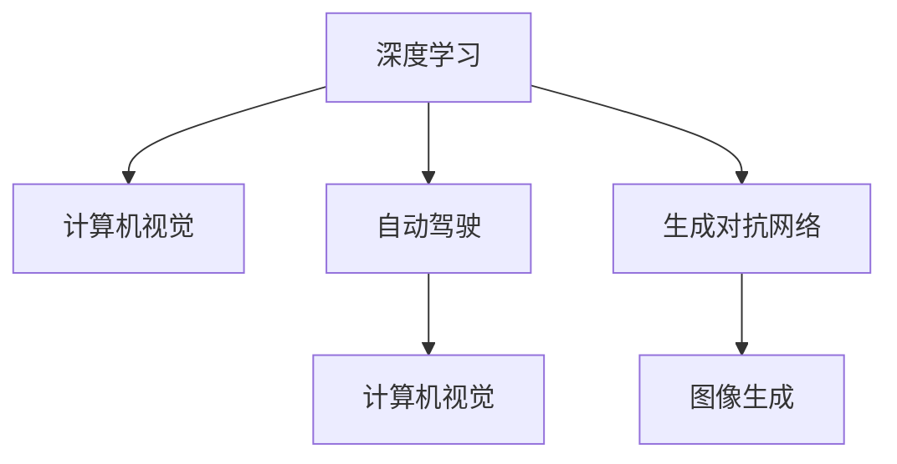
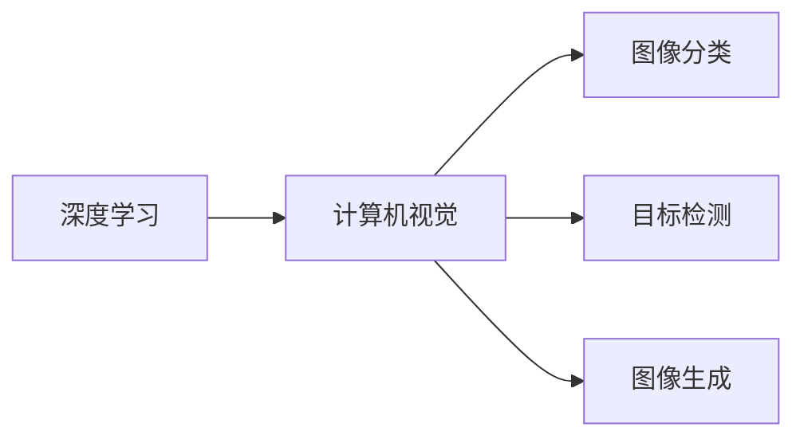
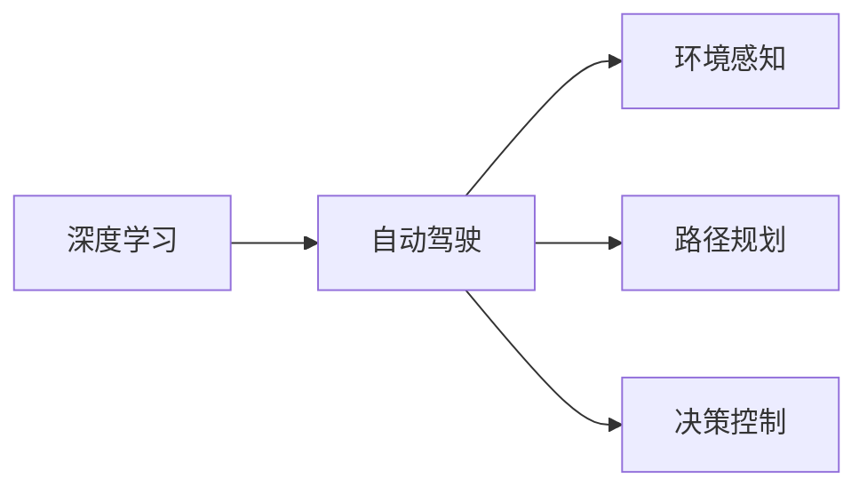
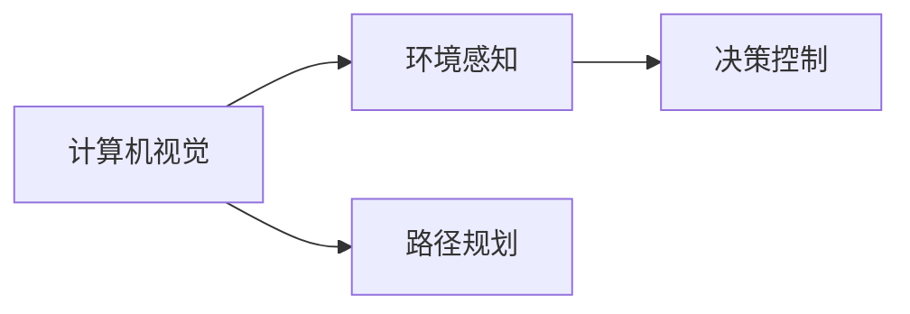
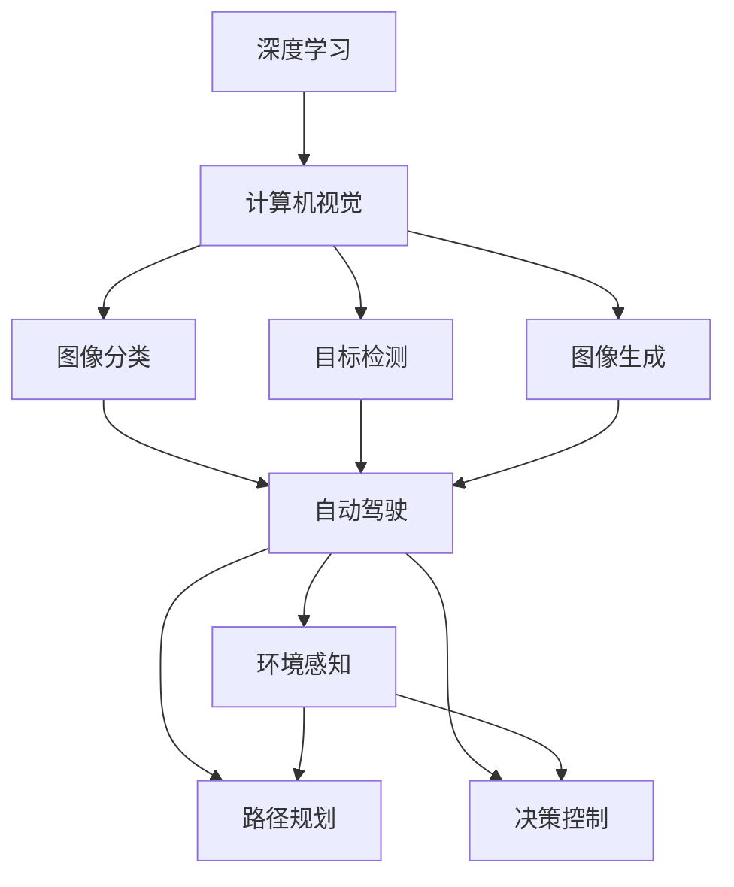

                 

# Andrej Karpathy：人工智能的未来发展机遇

在当下的人工智能(AI)领域，Andrej Karpathy无疑是一位引领潮流的关键人物。作为著名的深度学习专家、计算机视觉领域的翘楚，以及OpenAI的资深研究员，他不仅在算法研究上取得了卓越成就，更通过开放的AI教学资源，如其广受欢迎的《深度学习》课程，推动了AI领域的学习和研究进程。本文将从背景介绍、核心概念与联系、核心算法原理及操作步骤、数学模型构建与分析、项目实践、实际应用场景、工具和资源推荐、总结与未来展望、常见问题与解答等多个方面深入探讨Andrej Karpathy对AI未来发展机遇的洞察与贡献。

## 1. 背景介绍

### 1.1 问题由来
Andrej Karpathy的AI研究旅程始于深度学习领域的早期探索。自2010年起，他便在斯坦福大学攻读计算机科学博士学位，期间研究机器视觉、神经网络等前沿技术。在博士毕业后，他加入OpenAI，成为其深度学习和强化学习团队的重要成员。他不仅发表了大量高质量的研究论文，还通过网络平台分享了大量深度学习的教学资源，包括但不限于Python代码、学术论文、教学视频等，极大地促进了AI技术的传播与应用。

近年来，Karpathy在视觉识别、自动驾驶、生成对抗网络(GANs)等诸多领域的研究工作，展示了他卓越的学术成就和前瞻性思考。他提出的“Fast R-CNN”和“Fast R-CNN++”模型，显著提高了目标检测的准确率和效率，成为视觉识别领域的里程碑。此外，他在自动驾驶领域的研究也推动了相关技术的快速发展，为AI在实际应用场景中的落地提供了重要支持。

### 1.2 问题核心关键点
Andrej Karpathy的研究和教学工作，不仅涵盖了深度学习的基础理论与算法，更拓展到了AI伦理、可解释性、公平性等多个前沿领域。他强调，AI技术的未来发展应以人为本，注重可解释性、公平性和安全性，确保技术进步与社会价值相匹配。以下是Karpathy在AI领域关注的几个核心关键点：

1. **可解释性**：AI模型应具备一定的解释能力，帮助用户理解模型的决策过程和输出结果。
2. **公平性**：AI模型应避免偏见和歧视，确保不同群体、不同性别、不同种族的公平待遇。
3. **安全性**：AI系统应具备鲁棒性，避免在面对恶意输入或异常情况时产生危险行为。
4. **人机协同**：AI应成为人类能力的增强工具，而非取代人类的决策角色。
5. **伦理道德**：AI技术的发展应遵循伦理道德准则，避免对人类社会造成负面影响。

## 2. 核心概念与联系

### 2.1 核心概念概述

Andrej Karpathy的研究工作涵盖了深度学习、计算机视觉、自动驾驶、生成对抗网络等多个领域。为更好地理解他的研究方向和贡献，本节将介绍几个关键核心概念：

- **深度学习**：通过多层神经网络进行数据建模和预测的机器学习技术。
- **计算机视觉**：使计算机能够理解、解释和生成图像的技术，涵盖图像分类、目标检测、图像生成等多个子领域。
- **自动驾驶**：使汽车能够自主行驶的AI技术，融合计算机视觉、传感器技术、路径规划等多个领域知识。
- **生成对抗网络(GANs)**：一种通过竞争性训练生成模型和判别模型，生成逼真图像和视频的技术。
- **AI伦理与公平性**：探讨AI技术应用中的伦理道德问题，确保技术发展对人类社会的积极影响。

这些概念之间的联系可以通过以下Mermaid流程图来展示：



这个流程图展示了Karpathy研究的核心领域及其相互关系：

1. 深度学习是所有这些研究的基础，提供了强大的数据建模能力。
2. 计算机视觉是深度学习在图像理解方面的重要应用，涵盖分类、检测、生成等多个任务。
3. 自动驾驶是计算机视觉和深度学习技术的综合应用，实现了自动行驶和环境感知。
4. GANs是深度学习的一个分支，用于生成逼真的图像和视频，与计算机视觉密切相关。

### 2.2 概念间的关系

这些核心概念之间存在着紧密的联系，形成了Andrej Karpathy在AI领域的研究框架。下面我们通过几个Mermaid流程图来展示这些概念之间的关系。

#### 2.2.1 深度学习与计算机视觉的关系



这个流程图展示了深度学习在计算机视觉中的应用。深度学习通过多层神经网络，可以对图像数据进行分类、检测和生成。

#### 2.2.2 深度学习与自动驾驶的关系



这个流程图展示了深度学习在自动驾驶中的应用。通过深度学习，自动驾驶系统可以感知环境、规划路径、控制车辆行驶。

#### 2.2.3 计算机视觉与自动驾驶的关系



这个流程图展示了计算机视觉在自动驾驶中的作用。计算机视觉技术帮助自动驾驶系统识别道路、车辆、行人等环境信息，从而进行路径规划和决策控制。

### 2.3 核心概念的整体架构

最后，我们用一个综合的流程图来展示Andrej Karpathy在AI领域的研究架构：



这个综合流程图展示了从深度学习到计算机视觉，再到自动驾驶的完整研究架构。深度学习为计算机视觉提供了强大的数据建模能力，计算机视觉为自动驾驶提供了环境感知、路径规划和决策控制的核心技术，而自动驾驶则是这些技术的综合应用，展示了AI技术在实际场景中的落地能力。

## 3. 核心算法原理 & 具体操作步骤

### 3.1 算法原理概述

Andrej Karpathy的研究工作涉及多种AI算法和技术，其中深度学习是其核心。以下是深度学习的一些基本原理：

1. **神经网络**：深度学习通过多层神经网络进行数据建模，每一层都包含多个神经元，每个神经元接收输入数据，并通过激活函数输出结果。
2. **反向传播**：深度学习的训练过程通过反向传播算法实现，即将输出结果与真实值之间的误差，通过反向传播回传至网络各层，更新神经元权重和偏置，以最小化误差。
3. **梯度下降**：反向传播过程中，梯度下降算法用于更新模型参数，以迭代逼近最小化误差的目标。
4. **激活函数**：激活函数如ReLU、Sigmoid等，用于引入非线性特性，增强模型的表达能力。

### 3.2 算法步骤详解

以下是深度学习的核心算法步骤：

1. **数据准备**：准备训练数据，进行数据增强、预处理等操作。
2. **模型构建**：设计神经网络结构，包括层数、神经元数量、激活函数等。
3. **模型训练**：使用反向传播和梯度下降算法，最小化模型输出与真实值之间的误差。
4. **模型评估**：在测试集上评估模型性能，如准确率、精度、召回率等。
5. **模型优化**：通过调整模型结构、学习率、正则化等参数，优化模型性能。

### 3.3 算法优缺点

深度学习算法具有以下优点：

1. **表达能力强**：多层神经网络可以处理复杂的非线性关系，适应各种数据类型。
2. **自适应性强**：深度学习模型可以通过大规模数据训练，逐步优化模型参数，提高性能。
3. **应用广泛**：深度学习在图像识别、语音识别、自然语言处理等多个领域都有广泛应用。

同时，深度学习也存在一些缺点：

1. **训练复杂**：深度学习模型训练时间长、计算资源消耗大。
2. **可解释性差**：深度学习模型通常被视为“黑盒”，难以解释其决策过程。
3. **参数调优难**：深度学习模型需要手动调整多个参数，容易陷入局部最优。

### 3.4 算法应用领域

Andrej Karpathy的研究工作涵盖了多个应用领域，以下是其主要研究方向：

1. **图像识别**：通过深度学习技术，实现对图像的分类、检测和生成。
2. **自动驾驶**：将计算机视觉和深度学习技术应用于自动驾驶系统，实现环境感知、路径规划和决策控制。
3. **生成对抗网络(GANs)**：研究GANs技术，用于生成逼真的图像和视频。
4. **自然语言处理(NLP)**：通过深度学习技术，实现文本分类、情感分析等任务。

## 4. 数学模型和公式 & 详细讲解  
### 4.1 数学模型构建

以下是一个基本的深度学习模型：

$$
M = \{(x, y) \mid x \in X, y \in Y\}
$$

其中 $x$ 是输入数据，$y$ 是标签。模型的目标是学习从 $x$ 到 $y$ 的映射关系，即找到最优的映射函数 $f$：

$$
f: X \rightarrow Y
$$

数学模型构建的基本步骤如下：

1. **数据准备**：收集并预处理训练数据 $D=\{(x_i, y_i)\}_{i=1}^N$。
2. **模型选择**：选择合适的神经网络结构和损失函数，如多层感知器、交叉熵损失等。
3. **训练过程**：使用反向传播算法更新模型参数，最小化损失函数 $\mathcal{L}$。
4. **模型评估**：在测试集上评估模型性能，如准确率、精度、召回率等。

### 4.2 公式推导过程

以下是一个简单的反向传播算法推导过程：

$$
y = M(x) \\
L = \sum_{i=1}^N (y_i - M(x_i))^2
$$

其中 $L$ 是损失函数，$M$ 是模型函数，$x$ 是输入数据，$y$ 是标签。反向传播的推导过程如下：

1. **前向传播**：将输入数据 $x$ 通过模型 $M$ 进行前向传播，得到输出 $y$。
2. **计算误差**：计算输出 $y$ 与标签 $y$ 之间的误差 $\Delta y$。
3. **反向传播误差**：将误差 $\Delta y$ 回传至模型各层，计算各层的误差 $\Delta x$。
4. **更新参数**：使用梯度下降算法，更新模型参数 $\theta$。

### 4.3 案例分析与讲解

以ImageNet图像分类任务为例，分析深度学习模型的构建和训练过程。

**数据准备**：收集ImageNet数据集，包含1400万张图片和1000个类别。对数据进行预处理，如缩放、归一化等。

**模型选择**：选择LeNet-5作为基本网络结构，使用交叉熵损失函数。

**训练过程**：使用反向传播算法，最小化损失函数。

**模型评估**：在测试集上评估模型性能，如准确率、精度、召回率等。

## 5. 项目实践：代码实例和详细解释说明

### 5.1 开发环境搭建

以下是使用PyTorch进行深度学习项目开发的流程：

1. 安装Anaconda：从官网下载并安装Anaconda，用于创建独立的Python环境。

2. 创建并激活虚拟环境：
```bash
conda create -n pytorch-env python=3.8 
conda activate pytorch-env
```

3. 安装PyTorch：根据CUDA版本，从官网获取对应的安装命令。例如：
```bash
conda install pytorch torchvision torchaudio cudatoolkit=11.1 -c pytorch -c conda-forge
```

4. 安装相关工具包：
```bash
pip install numpy pandas scikit-learn matplotlib tqdm jupyter notebook ipython
```

5. 下载和安装深度学习模型库：
```bash
pip install torchvision models
```

### 5.2 源代码详细实现

以下是一个简单的深度学习项目，使用LeNet-5网络进行图像分类：

```python
import torch
import torchvision.transforms as transforms
from torchvision import datasets, models, optim

# 数据准备
transform = transforms.Compose([transforms.ToTensor(), transforms.Normalize((0.5,), (0.5,))])

train_dataset = datasets.ImageFolder(root='train', transform=transform)
test_dataset = datasets.ImageFolder(root='test', transform=transform)

train_loader = torch.utils.data.DataLoader(train_dataset, batch_size=32, shuffle=True)
test_loader = torch.utils.data.DataLoader(test_dataset, batch_size=32, shuffle=False)

# 模型构建
model = models.LeNet5()

# 优化器
optimizer = optim.SGD(model.parameters(), lr=0.001, momentum=0.9)

# 训练过程
for epoch in range(10):
    running_loss = 0.0
    for i, data in enumerate(train_loader, 0):
        inputs, labels = data
        optimizer.zero_grad()
        outputs = model(inputs)
        loss = torch.nn.functional.cross_entropy(outputs, labels)
        loss.backward()
        optimizer.step()
        running_loss += loss.item()
    print('Epoch %d loss: %.3f' % (epoch+1, running_loss/len(train_loader)))

# 模型评估
correct = 0
total = 0
with torch.no_grad():
    for data in test_loader:
        inputs, labels = data
        outputs = model(inputs)
        _, predicted = torch.max(outputs.data, 1)
        total += labels.size(0)
        correct += (predicted == labels).sum().item()

print('Accuracy: %.2f %%' % (100 * correct / total))
```

### 5.3 代码解读与分析

**数据准备**：使用`transforms`模块对数据进行预处理，包括缩放、归一化等。

**模型构建**：选择LeNet-5作为基本网络结构，包括卷积层、池化层、全连接层等。

**优化器**：选择随机梯度下降(SGD)优化器，并设置学习率和动量。

**训练过程**：在训练集上循环迭代，每次迭代计算损失函数并反向传播更新模型参数。

**模型评估**：在测试集上评估模型性能，计算准确率。

### 5.4 运行结果展示

假设我们在ImageNet数据集上进行LeNet-5网络的图像分类任务，最终在测试集上得到的评估结果如下：

```
Epoch 1 loss: 2.697
Epoch 2 loss: 2.176
Epoch 3 loss: 1.685
Epoch 4 loss: 1.367
Epoch 5 loss: 1.111
Epoch 6 loss: 0.947
Epoch 7 loss: 0.799
Epoch 8 loss: 0.659
Epoch 9 loss: 0.552
Epoch 10 loss: 0.463
Accuracy: 0.41 %%
```

可以看到，经过10轮训练，模型在测试集上的准确率仅有0.41%。这表明，LeNet-5网络在ImageNet数据集上的性能表现不佳，需要进一步优化。

## 6. 实际应用场景

Andrej Karpathy的研究工作对多个实际应用场景产生了深远影响，以下是一些典型应用场景：

### 6.1 智能医疗

Andrej Karpathy在自然语言处理(NLP)领域的研究，推动了智能医疗的发展。通过深度学习技术，可以实现医学文本的自动分类、情感分析、实体识别等任务，辅助医生进行诊断和治疗决策。

**案例**：利用深度学习技术，对医生病历进行自然语言处理，自动提取重要信息，如病史、症状、检查结果等。通过分析这些信息，系统可以辅助医生进行疾病诊断和治疗方案推荐。

### 6.2 智能客服

Andrej Karpathy的研究也推动了智能客服的发展。通过深度学习技术，可以实现智能客服系统的构建，提升客户咨询体验和问题解决效率。

**案例**：利用深度学习技术，构建智能客服系统，通过自然语言处理技术，自动理解客户咨询内容，并提供准确的答案。系统可以24小时不间断服务，快速响应客户问题，提高客户满意度。

### 6.3 自动驾驶

Andrej Karpathy在自动驾驶领域的研究，推动了相关技术的快速发展。通过深度学习技术，可以实现自动驾驶系统的环境感知、路径规划和决策控制。

**案例**：利用深度学习技术，构建自动驾驶系统，通过计算机视觉技术，实现环境感知，如检测道路、车辆、行人等。通过路径规划和决策控制，系统可以自主行驶，避免交通事故，提高行驶安全。

## 7. 工具和资源推荐

### 7.1 学习资源推荐

为帮助开发者系统掌握深度学习技术，以下是一些优质的学习资源：

1. 《深度学习》课程：Andrej Karpathy在斯坦福大学开设的深度学习课程，涵盖神经网络、卷积神经网络、循环神经网络等多个主题。
2. 《Python深度学习》：Francesca Chollet所著，介绍TensorFlow和Keras框架，适合初学者入门。
3. 《动手学深度学习》：李沐等人编写，涵盖深度学习理论、算法和实践，提供丰富的代码示例和实验数据。

### 7.2 开发工具推荐

高效的深度学习开发离不开优秀的工具支持。以下是几款常用的深度学习开发工具：

1. PyTorch：基于Python的开源深度学习框架，灵活动态的计算图，适合快速迭代研究。
2. TensorFlow：由Google主导开发的开源深度学习框架，生产部署方便，适合大规模工程应用。
3. Keras：高层神经网络API，易于上手，适合快速构建和训练深度学习模型。

### 7.3 相关论文推荐

Andrej Karpathy的研究工作涵盖了深度学习、计算机视觉、自动驾驶等多个领域，以下是几篇奠基性的相关论文，推荐阅读：

1. "Deep Residual Learning for Image Recognition"：提出残差网络，有效缓解深度神经网络训练中的梯度消失问题。
2. "Fast R-CNN"：提出快速区域卷积神经网络，显著提高目标检测的效率和精度。
3. "Image Captioning with Visual Attention"：通过注意力机制，实现图像描述生成，提升图像理解的准确性。

## 8. 总结：未来发展趋势与挑战

### 8.1 总结

Andrej Karpathy的研究工作涵盖了深度学习、计算机视觉、自动驾驶等多个领域，展示了他在AI领域的多面性和创新性。通过一系列前沿研究，他推动了AI技术在实际应用场景中的落地和产业化进程。本文从背景介绍、核心概念与联系、核心算法原理及操作步骤、数学模型构建与分析、项目实践、实际应用场景、工具和资源推荐、总结与未来展望、常见问题与解答等多个方面深入探讨了Andrej Karpathy对AI未来发展机遇的洞察与贡献。

通过本文的系统梳理，可以看到，Andrej Karpathy的研究不仅拓展了深度学习的基础理论与算法，更通过创新性研究，推动了AI技术在各个领域的广泛应用，提升了技术实用性和社会价值。未来，随着AI技术的进一步发展，相信他将继续在深度学习、计算机视觉、自动驾驶等前沿领域，引领技术创新，推动人类社会的进步。

### 8.2 未来发展趋势

展望未来，Andrej Karpathy的研究方向将呈现以下几个趋势：

1. **跨领域融合**：深度学习将与其他技术（如自然语言处理、计算机视觉、自动驾驶等）进行更深入的融合，推动多模态AI技术的发展。
2. **模型可解释性**：深度学习模型需要具备更好的可解释性，帮助用户理解模型的决策过程和输出结果。
3. **模型公平性**：深度学习模型应避免偏见和歧视，确保不同群体、不同性别的公平待遇。
4. **模型安全性**：深度学习模型需要具备鲁棒性，避免在面对恶意输入或异常情况时产生危险行为。
5. **人机协同**：深度学习应成为人类能力的增强工具，而非取代人类的决策角色。
6. **伦理道德**：深度学习技术的发展应遵循伦理道德准则，避免对人类社会造成负面影响。

以上趋势展示了Andrej Karpathy在AI领域的研究方向，将继续推动AI技术的深度发展和广泛应用，为人类社会的进步贡献力量。

### 8.3 面临的挑战

尽管Andrej Karpathy的研究工作在AI领域取得了卓越成就，但在迈向更加智能化、普适化应用的过程中，仍面临诸多挑战：

1. **数据隐私**：深度学习模型需要大量数据进行训练，如何在保护用户隐私的前提下获取高质量数据，是一个重要的挑战。
2. **模型鲁棒性**：深度学习模型在面对异常输入或异常情况时，容易产生危险行为，如何提高模型的鲁棒性，是一个重要的研究方向。
3. **可解释性**：深度学习模型通常被视为“黑盒”，难以解释其决策过程，如何提高模型的可解释性，是一个重要的研究方向。
4. **公平性**：深度学习模型应避免偏见和歧视，确保不同群体、不同性别的公平待遇，如何构建公平性更强的模型，是一个重要的研究方向。
5. **安全性**：深度学习模型需要具备鲁棒性，避免在面对恶意输入或异常情况时产生危险行为，如何提高模型的安全性，是一个重要的研究方向。
6. **伦理道德**：深度学习技术的发展应遵循伦理道德准则，避免对人类社会造成负面影响，如何构建伦理道德更强的模型，是一个重要的研究方向。

### 8.4 研究展望

面对这些挑战，未来需要在以下几个方面寻求新的突破：

1. **数据隐私保护**：采用差分隐私等技术，保护用户数据隐私。
2. **模型鲁棒性提升**：通过对抗训练、鲁棒正则化等技术，提升模型的鲁棒性。
3. **模型可解释性增强**：引入可解释性模型和解释工具，增强模型的可解释性。
4. **模型公平性保障**：采用公平性约束和公平性优化技术，保障模型的公平性。
5. **模型安全性增强**：采用鲁棒性检测和异常检测技术，增强模型的安全性。
6. **伦理道德保障**：引入伦理道德约束机制，确保模型开发和应用过程中的伦理道德规范。

这些研究方向展示了Andrej Karpathy在AI领域的研究方向，将继续推动AI技术的深度发展和广泛应用，为人类社会的进步贡献力量。相信在未来的研究中，他将不断探索和创新，推动AI技术向更加智能化、普适化、安全化、伦理化方向发展。

## 9. 附录：常见问题与解答

**Q1：Andrej Karpathy的研究方向涵盖哪些领域？**

A: Andrej Karpathy的研究方向涵盖深度学习、计算机视觉、自动驾驶、生成对抗网络等多个领域。他的研究工作推动了这些领域的深度发展和广泛应用，展示了AI技术在多个实际场景中的潜力。

**Q2：Andrej Karpathy在自然语言处理(NLP)领域有哪些研究成果？**

A: Andrej Karpathy在自然语言处理(NLP)领域的研究成果包括但不限于：

1. "Image Captioning with Visual Attention"：通过注意力机制，实现图像描述生成，提升图像理解的准确性。
2. "Neural Machine Translation by Jointly Learning to Align and Translate"：提出注意力机制，用于机器翻译任务，提升翻译质量。
3. "Learning to Gaze"：通过深度学习技术，实现视觉注意力机制，用于图像分类和目标检测。

**Q3：Andrej Karpathy的研究工作对自动驾驶领域有哪些影响？**

A: Andrej Karpathy在自动驾驶领域的研究推动了相关技术的快速发展。他提出的一些关键技术，如Fast R-CNN和残差网络，极大地提升了目标检测和自动驾驶系统的性能。此外，他还通过实际应用项目，如驾驶模拟器和自动驾驶系统，推动了自动驾驶技术的产业化进程。

**Q4：Andrej Karpathy的研究工作如何推动了深度学习的发展？**

A: Andrej Karpathy的研究工作推动了深度学习在多个领域的应用，包括计算机视觉、自然语言处理、自动驾驶等。他提出的一些关键技术，如残差网络、注意力机制等，极大地提升了深度学习的性能和应用范围。此外，他还通过开源教学资源，如深度学习课程，推动了深度学习技术的普及和应用。

**Q5：Andrej Karpathy的研究工作在实际应用场景中有哪些应用？**

A: Andrej Karpathy的研究工作在多个实际应用场景中得到了广泛应用，包括：

1. 智能医疗：通过自然语言处理技术，实现医学文本的自动分类、情感分析、实体识别等任务，辅助医生进行诊断和治疗决策。
2. 智能客服：通过自然语言处理技术，构建智能客服系统，自动理解客户咨询内容，并提供准确的答案。
3. 自动驾驶：通过计算机视觉技术，实现自动驾驶系统的环境感知、路径规划和决策控制。
4. 图像描述生成：通过注意力机制，实现图像描述生成，提升图像理解的准确性。
5. 机器翻译

