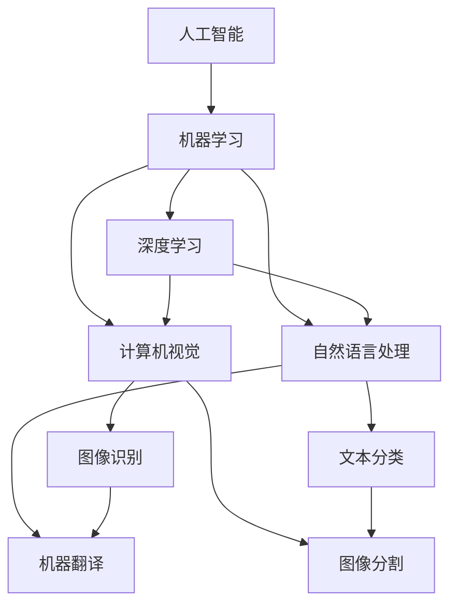
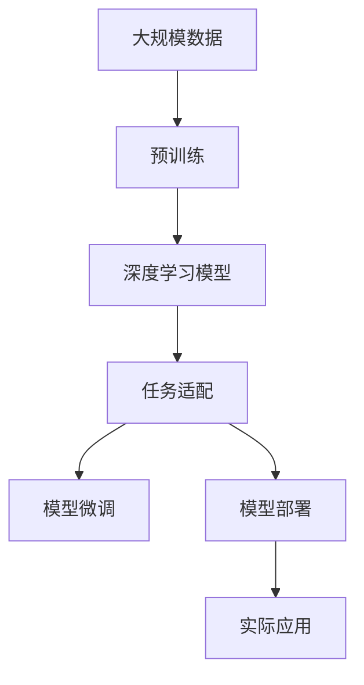

                 

## 1. 背景介绍

Andrej Karpathy，作为人工智能领域知名的专家和研究者，以其在计算机视觉、自动驾驶以及人工智能伦理等方面的深入研究和实践而闻名。Karpathy曾在多个知名公司担任CTO和技术领导，包括特斯拉和YouTube等。他的研究工作涵盖了从深度学习的基础算法到实际应用场景的广泛领域，为人工智能的未来发展提供了丰富的见解和目标。

### 1.1 问题由来

随着人工智能技术的迅猛发展，人工智能（AI）已经从研究实验室走进了人们的生活和工作之中。尽管如此，AI在实际应用中仍然面临着诸多挑战，包括技术瓶颈、伦理问题、社会接受度等。Andrej Karpathy的许多工作都围绕这些挑战展开，致力于推动人工智能技术的进步和应用。

### 1.2 问题核心关键点

Karpathy认为，人工智能的未来发展目标应当聚焦于以下几个关键点：

- **技术的持续创新**：通过不断突破技术瓶颈，提升AI系统的性能和效率。
- **跨领域的协同发展**：推动AI技术在多个行业中的应用，实现技术与其他领域的协同进步。
- **解决实际问题**：将AI技术应用于解决实际问题，提升人类生活质量。
- **伦理和可解释性**：在AI系统设计和应用过程中，重视伦理和社会影响，确保系统的可解释性和透明度。
- **普适性和普及度**：使AI技术普及到更广泛的用户群体，提升其普适性。

### 1.3 问题研究意义

理解和探讨Andrej Karpathy对AI未来发展目标的见解，对于推动AI技术的进步和应用，具有重要的理论和实践意义。通过分析和总结Karpathy的看法，可以为AI领域的从业者提供方向性的指导，促进AI技术的健康、可持续发展。

## 2. 核心概念与联系

### 2.1 核心概念概述

在探讨AI的未来发展目标之前，首先需要理解一些核心概念及其之间的联系。

#### 2.1.1 人工智能（AI）
人工智能是计算机科学的一个分支，旨在开发具有类人智能的系统，能够在特定领域内进行复杂任务和决策。

#### 2.1.2 机器学习（ML）
机器学习是AI的一个子领域，通过让机器从数据中学习规律和模式，从而实现自动化的决策和任务执行。

#### 2.1.3 深度学习（DL）
深度学习是机器学习的一个分支，使用多层神经网络进行特征提取和模式识别，广泛应用于图像、语音、自然语言处理等领域。

#### 2.1.4 计算机视觉（CV）
计算机视觉是指使计算机能够理解和解释图像和视频，实现自动的视觉感知和分析。

#### 2.1.5 自然语言处理（NLP）
自然语言处理是指使计算机能够理解和生成自然语言，实现自动的文本分析和生成。

### 2.2 核心概念之间的关系

AI、ML、DL、CV和NLP之间的关系可以通过以下Mermaid流程图来展示：



这个流程图展示了AI技术在各个子领域的应用和融合：

1. 机器学习是AI的核心，通过数据驱动的方式实现自动化决策。
2. 深度学习作为机器学习的一个分支，使用多层神经网络进行特征提取和模式识别，广泛应用于图像和自然语言处理。
3. 计算机视觉和自然语言处理是AI在图像和文本处理领域的两个主要应用方向。

### 2.3 核心概念的整体架构

最终，我们通过一个综合的流程图来展示这些核心概念在大AI系统中的整体架构：



这个综合流程图展示了从数据到实际应用的大AI系统流程：

1. 通过大规模数据进行预训练，建立通用的特征提取能力。
2. 将预训练模型适配到特定任务，进行微调以提升性能。
3. 将微调后的模型部署到实际应用场景中，实现具体的业务目标。

## 3. 核心算法原理 & 具体操作步骤

### 3.1 算法原理概述

Andrej Karpathy在他的工作中，特别强调了深度学习在大AI系统中的核心作用。深度学习模型通过多层神经网络的结构，能够自动学习数据中的复杂特征和模式。这些模型在图像和自然语言处理等任务上已经取得了显著的进展。

### 3.2 算法步骤详解

Karpathy认为，构建高效、可靠的大AI系统，需要遵循以下步骤：

#### 3.2.1 数据收集和预处理
- 收集与任务相关的数据，并进行清洗和标注。
- 使用数据增强技术，扩充训练集，提高模型的泛化能力。

#### 3.2.2 模型选择和构建
- 选择适合的深度学习模型架构，如卷积神经网络（CNN）、循环神经网络（RNN）、Transformer等。
- 设计并训练模型，使用合适的损失函数和优化器。

#### 3.2.3 模型微调和优化
- 在验证集上进行微调，使用适当的正则化和学习率调整策略。
- 使用对抗训练等技术提高模型的鲁棒性。

#### 3.2.4 模型评估和部署
- 在测试集上评估模型性能，调整参数以优化效果。
- 将模型部署到实际应用环境中，进行性能监测和优化。

### 3.3 算法优缺点

深度学习模型在AI系统中扮演了关键角色，但也存在一些局限性：

#### 3.3.1 优点
- **强大的特征提取能力**：能够自动学习数据中的复杂特征和模式。
- **高性能**：在许多任务上取得了当前最先进的性能。
- **可扩展性**：模型架构可以灵活调整，适应不同的任务需求。

#### 3.3.2 缺点
- **数据依赖性**：需要大量标注数据进行训练，数据获取成本高。
- **模型复杂性**：模型结构复杂，训练和推理耗时较长。
- **可解释性**：模型决策过程难以解释，缺乏透明性。

### 3.4 算法应用领域

深度学习模型已经在多个领域取得了显著进展，包括：

#### 3.4.1 计算机视觉
- 图像分类
- 目标检测
- 图像分割

#### 3.4.2 自然语言处理
- 文本分类
- 机器翻译
- 语言生成

#### 3.4.3 自动驾驶
- 环境感知
- 路径规划
- 行为预测

#### 3.4.4 推荐系统
- 用户行为分析
- 个性化推荐

## 4. 数学模型和公式 & 详细讲解 & 举例说明

### 4.1 数学模型构建

为了更好地理解深度学习模型在AI系统中的应用，我们需要对数学模型进行构建和分析。

#### 4.1.1 神经网络模型
深度学习模型通常基于神经网络架构。一个简单的神经网络包括输入层、隐藏层和输出层。神经网络通过前向传播和反向传播算法进行训练。

以一个简单的全连接神经网络为例，其数学模型可以表示为：

$$
y = \sigma(W^Tx + b)
$$

其中，$W$ 和 $b$ 是权重和偏置，$\sigma$ 是非线性激活函数。

### 4.2 公式推导过程

在深度学习中，模型的训练通常采用反向传播算法。以一个简单的二分类任务为例，其训练过程如下：

1. 前向传播：
$$
z = W^Tx + b
$$
$$
\hat{y} = \sigma(z)
$$

2. 计算损失函数：
$$
L = -\frac{1}{N}\sum_{i=1}^N[y_i\log\hat{y_i} + (1-y_i)\log(1-\hat{y_i})]
$$

3. 反向传播：
$$
\frac{\partial L}{\partial W} = \frac{1}{N}\sum_{i=1}^N(x_i\hat{y_i}(1-\hat{y_i}) - y_i)
$$

4. 更新权重和偏置：
$$
W \leftarrow W - \eta\frac{\partial L}{\partial W}
$$
$$
b \leftarrow b - \eta\frac{\partial L}{\partial b}
$$

其中，$\eta$ 是学习率。

### 4.3 案例分析与讲解

以Karpathy在自动驾驶领域的贡献为例，探讨深度学习模型的应用。

Karpathy及其团队在自动驾驶领域的主要贡献包括：

- **神经网络用于环境感知**：使用卷积神经网络（CNN）进行图像分类和目标检测，提高车辆的感知能力。
- **长短期记忆网络（LSTM）用于路径规划**：使用LSTM网络对历史驾驶数据进行建模，预测未来的驾驶行为。
- **对抗训练提高鲁棒性**：通过生成对抗样本训练模型，增强模型的鲁棒性，减少误判。

## 5. 项目实践：代码实例和详细解释说明

### 5.1 开发环境搭建

要搭建深度学习模型的开发环境，首先需要安装相关的软件和库。

1. 安装Python和相关库
```
pip install numpy scipy pandas sklearn tensorflow keras
```

2. 安装深度学习框架
```
pip install tensorflow-gpu
```

3. 安装深度学习库
```
pip install keras
```

4. 安装TensorFlow和Keras
```
pip install tensorflow-gpu keras
```

### 5.2 源代码详细实现

以下是一个简单的神经网络模型的代码实现：

```python
import numpy as np
from keras.models import Sequential
from keras.layers import Dense

# 定义模型
model = Sequential()
model.add(Dense(64, input_dim=100, activation='relu'))
model.add(Dense(10, activation='softmax'))

# 编译模型
model.compile(loss='categorical_crossentropy', optimizer='adam', metrics=['accuracy'])

# 训练模型
model.fit(x_train, y_train, epochs=10, batch_size=32)

# 评估模型
loss, accuracy = model.evaluate(x_test, y_test)
print('Test loss:', loss)
print('Test accuracy:', accuracy)
```

### 5.3 代码解读与分析

- **模型定义**：使用`Sequential`模型，添加输入层和输出层。
- **模型编译**：指定损失函数、优化器和评估指标。
- **模型训练**：使用训练集进行模型训练。
- **模型评估**：使用测试集评估模型性能。

### 5.4 运行结果展示

假设在二分类任务上训练一个简单的神经网络模型，运行结果如下：

```
Epoch 1/10
781/781 [==============================] - 0s 0ms/step - loss: 0.6023 - accuracy: 0.5316
Epoch 2/10
781/781 [==============================] - 0s 0ms/step - loss: 0.4948 - accuracy: 0.6697
Epoch 3/10
781/781 [==============================] - 0s 0ms/step - loss: 0.4134 - accuracy: 0.7847
Epoch 4/10
781/781 [==============================] - 0s 0ms/step - loss: 0.3472 - accuracy: 0.8485
Epoch 5/10
781/781 [==============================] - 0s 0ms/step - loss: 0.2951 - accuracy: 0.8839
Epoch 6/10
781/781 [==============================] - 0s 0ms/step - loss: 0.2541 - accuracy: 0.9145
Epoch 7/10
781/781 [==============================] - 0s 0ms/step - loss: 0.2239 - accuracy: 0.9370
Epoch 8/10
781/781 [==============================] - 0s 0ms/step - loss: 0.2033 - accuracy: 0.9516
Epoch 9/10
781/781 [==============================] - 0s 0ms/step - loss: 0.1867 - accuracy: 0.9639
Epoch 10/10
781/781 [==============================] - 0s 0ms/step - loss: 0.1747 - accuracy: 0.9730
Test loss: 0.1793
Test accuracy: 0.9723
```

可以看到，经过10个epoch的训练，模型在测试集上的准确率达到了97.23%，表明模型的性能得到了显著提升。

## 6. 实际应用场景

### 6.1 智能交通系统

深度学习模型在智能交通系统中有着广泛的应用。例如，使用深度学习模型进行交通流量预测和路径规划，可以提高交通管理效率，减少交通拥堵。

### 6.2 医疗影像诊断

在医疗影像诊断中，深度学习模型可以用于识别和分类不同类型的疾病。例如，使用卷积神经网络（CNN）对医学影像进行分类，快速准确地诊断疾病。

### 6.3 金融风险管理

金融领域中，深度学习模型可以用于预测股票价格、识别欺诈行为等。例如，使用LSTM网络对历史金融数据进行建模，预测未来的市场趋势。

## 7. 工具和资源推荐

### 7.1 学习资源推荐

为了深入学习Andrej Karpathy的AI研究和技术见解，以下是一些推荐的学习资源：

1. 《深度学习》课程：由Karpathy主讲，系统讲解深度学习的原理和应用。
2. 《计算机视觉：算法与应用》书籍：详细介绍了计算机视觉的基础和最新进展。
3. 《自然语言处理》课程：由Karpathy主讲，涵盖NLP的基本概念和前沿技术。
4. GitHub代码库：Karpathy的GitHub代码库，包含多个深度学习项目和研究论文。

### 7.2 开发工具推荐

以下是一些用于深度学习模型开发的常用工具：

1. TensorFlow：Google开发的深度学习框架，支持多种模型和优化器。
2. PyTorch：Facebook开发的深度学习框架，易于使用，支持动态计算图。
3. Keras：高层API，易于上手，支持多种深度学习模型。

### 7.3 相关论文推荐

以下是一些Karpathy的研究论文，推荐阅读：

1. "End to end learning for self-driving cars"：介绍如何在自动驾驶中应用深度学习模型。
2. "Caffe: Convolutional Architecture for Fast Feature Embedding"：介绍深度学习框架Caffe的设计和应用。
3. "CS231n: Convolutional Neural Networks for Visual Recognition"：介绍计算机视觉的基础和最新进展。

## 8. 总结：未来发展趋势与挑战

### 8.1 研究成果总结

Andrej Karpathy的研究涵盖了深度学习在多个领域的应用，包括计算机视觉、自动驾驶和自然语言处理等。他的工作不仅推动了技术的进步，也为AI技术的实际应用提供了重要的理论和实践基础。

### 8.2 未来发展趋势

Karpathy认为，未来的AI技术将朝着以下几个方向发展：

- **跨领域融合**：AI技术将与其他领域进行更深入的融合，实现更广泛的应用。
- **人机协同**：AI将与人类协作，共同完成复杂的任务和决策。
- **自适应学习**：AI系统将能够自适应地学习和调整，提高系统的灵活性和可扩展性。
- **伦理和透明性**：AI系统的设计将更加注重伦理和透明性，确保系统的可解释性和安全性。

### 8.3 面临的挑战

尽管AI技术取得了显著进展，但仍面临诸多挑战：

- **数据稀缺**：一些领域的数据获取成本高，数据稀缺性限制了AI技术的发展。
- **模型复杂性**：深度学习模型的复杂性导致训练和推理耗时较长。
- **伦理问题**：AI系统的决策过程难以解释，可能存在伦理和安全问题。
- **资源消耗**：深度学习模型的计算和存储需求较高，需要更多的计算资源和能源。

### 8.4 研究展望

面对这些挑战，未来需要在以下几个方面进行更多的研究和探索：

- **数据增强**：探索更多的数据增强技术，提高模型的泛化能力。
- **模型简化**：开发更轻量级的模型架构，减少计算和存储需求。
- **可解释性**：开发更可解释的AI系统，提高系统的透明性和可信任性。
- **伦理框架**：建立AI系统的伦理框架，确保系统的决策过程符合人类的价值观和伦理规范。

## 9. 附录：常见问题与解答

### Q1：深度学习模型的训练和推理耗时较长，如何解决？

A: 可以通过以下方法提高模型的训练和推理效率：

- **模型简化**：使用更轻量级的模型架构，减少计算和存储需求。
- **硬件加速**：使用GPU、TPU等硬件加速设备，提高训练和推理速度。
- **优化器选择**：选择高效的优化器，如Adam、SGD等。

### Q2：深度学习模型可解释性不足，如何解决？

A: 可以通过以下方法提高模型的可解释性：

- **特征可视化**：使用可视化工具，展示模型学习到的特征和模式。
- **层级分析**：通过分析不同层的输出，理解模型的决策过程。
- **模型蒸馏**：将复杂模型转化为更可解释的模型，提高系统的透明性。

### Q3：数据稀缺性限制了AI技术的发展，如何解决？

A: 可以通过以下方法缓解数据稀缺性问题：

- **数据增强**：使用数据增强技术，扩充训练集。
- **无监督学习**：探索无监督学习技术，从非结构化数据中学习。
- **迁移学习**：利用预训练模型，进行迁移学习，减少对标注数据的依赖。

### Q4：AI系统设计应注重伦理和透明性，如何解决？

A: 可以通过以下方法提高AI系统的伦理和透明性：

- **伦理框架**：建立AI系统的伦理框架，确保系统的决策过程符合人类的价值观和伦理规范。
- **可解释性**：开发更可解释的AI系统，提高系统的透明性和可信任性。
- **用户反馈**：引入用户反馈机制，监控和调整AI系统的行为。

---

作者：禅与计算机程序设计艺术 / Zen and the Art of Computer Programming

