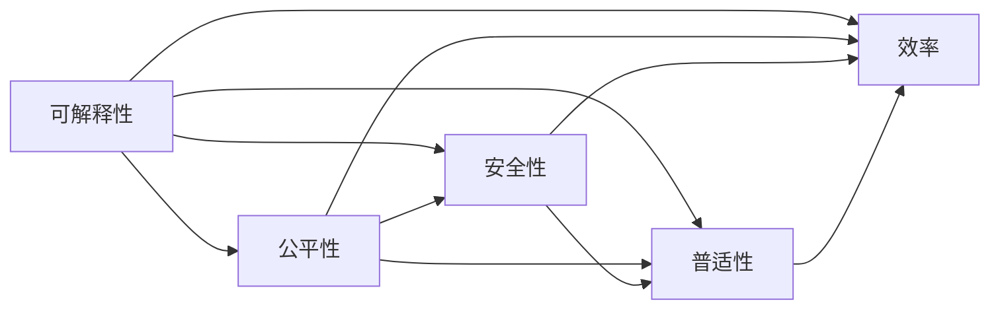
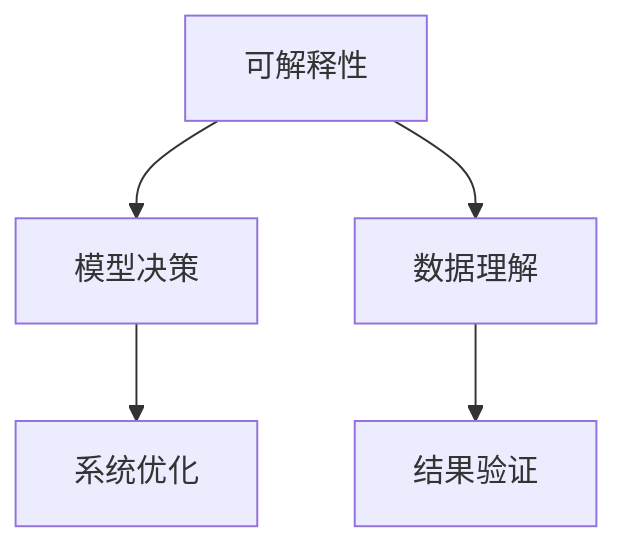
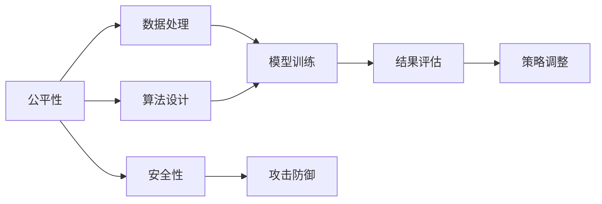
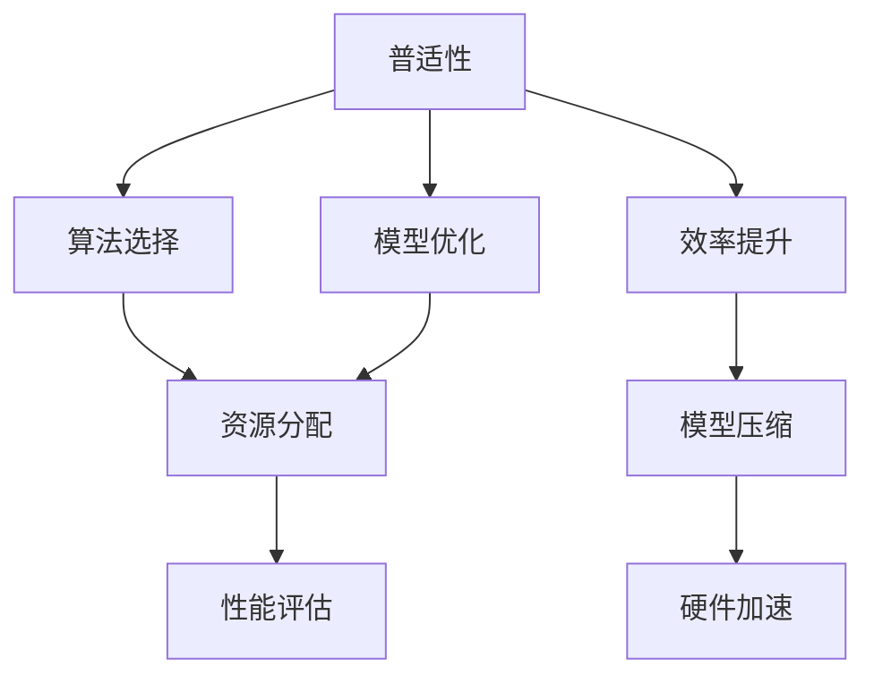

                 

# Andrej Karpathy：人工智能的未来发展策略

在人工智能领域，Andrej Karpathy 是一位极具影响力和前瞻性的专家。他的见解不仅在学术界引起了广泛关注，也在工业界产生了深远影响。本文将探讨Andrej Karpathy 对人工智能未来发展的策略，并结合实际案例进行详细解读。

## 1. 背景介绍

Andrej Karpathy 是深度学习领域的著名学者，现任特斯拉的AI团队负责人。他以其在计算机视觉、自动驾驶和深度学习算法方面的卓越贡献而闻名。Karpathy 的研究涵盖了从基础模型构建到实际应用的广泛领域，在推动人工智能技术的进步方面发挥了重要作用。

### 1.1 问题由来

近年来，随着深度学习技术的快速发展，人工智能在视觉、语音、自然语言处理等众多领域取得了显著进展。然而，这些技术的应用还面临诸多挑战，如模型的可解释性、算法的公平性、系统的安全性等。这些问题亟需解决，以确保人工智能技术在实际应用中的可靠性和适用性。

### 1.2 问题核心关键点

Andrej Karpathy 认为，当前人工智能的发展应聚焦于以下几个核心关键点：

- **可解释性**：提升模型的可解释性，使人类能够理解模型的决策过程和输出结果，增强系统的透明度和信任度。
- **公平性**：确保算法在不同人群和群体之间公平无偏，避免偏见和歧视。
- **安全性**：增强系统的鲁棒性，避免被恶意攻击或误导，保障系统的稳定性和安全性。
- **普适性**：提升人工智能技术在不同领域、不同场景中的普适性和实用性，促进技术的广泛应用。
- **效率**：优化算法和模型，提升其计算效率和部署效率，降低资源消耗，提高系统响应速度。

这些关键点不仅反映了当前人工智能技术的发展趋势，也为未来的研究方向提供了方向。

## 2. 核心概念与联系

### 2.1 核心概念概述

为更好地理解Andrej Karpathy 对人工智能未来发展的策略，本节将介绍几个关键概念：

- **可解释性**：指模型输出结果的解释能力，使人类能够理解和验证模型的决策过程。
- **公平性**：指算法在处理不同群体或个体时的一致性和公正性。
- **安全性**：指系统在面对恶意攻击或异常情况时的稳健性和安全性。
- **普适性**：指人工智能技术在不同领域、不同场景中的适用性和扩展性。
- **效率**：指算法的计算速度、模型的大小和资源消耗，反映系统的实际部署能力。

这些概念之间的关系可以通过以下Mermaid流程图来展示：



这个流程图展示了各个概念之间的关系：

1. 可解释性直接影响公平性和安全性。
2. 可解释性和公平性又共同影响普适性。
3. 可解释性、公平性、普适性和效率相互影响，共同构成人工智能系统的核心能力。

### 2.2 概念间的关系

这些核心概念之间存在着紧密的联系，形成了人工智能发展的完整生态系统。下面我们将通过几个Mermaid流程图来展示这些概念之间的关系。

#### 2.2.1 可解释性在人工智能中的作用



这个流程图展示了可解释性在人工智能中的作用：

1. 可解释性帮助理解模型决策过程。
2. 可解释性促进数据理解。
3. 可解释性指导系统优化。
4. 可解释性验证结果可靠性。

#### 2.2.2 公平性和安全性在人工智能中的应用



这个流程图展示了公平性和安全性在人工智能中的应用：

1. 公平性指导数据处理。
2. 公平性影响算法设计。
3. 公平性参与模型训练。
4. 公平性评估结果公正性。
5. 安全性用于防御攻击。
6. 安全性指导策略调整。

#### 2.2.3 普适性和效率在人工智能中的平衡



这个流程图展示了普适性和效率在人工智能中的平衡：

1. 普适性指导算法选择。
2. 普适性参与模型优化。
3. 普适性指导资源分配。
4. 普适性评估系统性能。
5. 效率提升影响模型压缩。
6. 效率提升实现硬件加速。

## 3. 核心算法原理 & 具体操作步骤

### 3.1 算法原理概述

Andrej Karpathy 认为，提升人工智能的可解释性、公平性、安全性和普适性，需要借助一系列的核心算法和操作步骤。这些算法和步骤主要包括：

1. **可解释性算法**：如可视化、梯度分析、模型解释框架等，帮助理解模型决策过程。
2. **公平性算法**：如公平性约束、偏见检测、样本平衡等，确保算法在不同群体中的公平性。
3. **安全性算法**：如对抗训练、鲁棒性检测、异常检测等，增强系统的鲁棒性和安全性。
4. **普适性算法**：如迁移学习、多任务学习、自适应学习等，提升模型在不同场景中的普适性。
5. **效率算法**：如剪枝、量化、模型压缩等，优化算法的计算速度和资源消耗。

这些算法和步骤的核心思想是：通过科学合理的技术手段，最大化模型的各项性能指标，同时确保系统的透明性、公正性和安全性。

### 3.2 算法步骤详解

以下是Andrej Karpathy 提出的核心算法步骤详解：

**Step 1: 数据准备**

- **数据集选择**：选择合适的数据集，确保其包含广泛的特征和样本。
- **数据预处理**：对数据进行清洗、归一化、特征提取等预处理步骤。
- **数据增强**：通过旋转、裁剪、翻转等方式扩充训练集，提高模型的泛化能力。

**Step 2: 模型构建**

- **模型选择**：根据任务特点选择合适的预训练模型或自定义模型。
- **模型初始化**：对模型进行初始化，包括权重、偏置等。
- **模型微调**：对模型进行微调，调整模型参数以适应特定任务。

**Step 3: 公平性保障**

- **偏见检测**：使用公平性检测工具，检测模型中的偏见。
- **数据平衡**：对数据集进行平衡处理，确保不同群体的样本数量相近。
- **算法调整**：根据偏见检测结果，调整算法和模型参数，提高公平性。

**Step 4: 安全性增强**

- **对抗训练**：引入对抗样本，训练模型对对抗攻击的鲁棒性。
- **鲁棒性检测**：使用鲁棒性检测工具，评估模型的鲁棒性。
- **异常检测**：使用异常检测算法，识别模型预测中的异常情况。

**Step 5: 普适性提升**

- **迁移学习**：在相关任务上进行迁移学习，利用已有知识加速模型训练。
- **多任务学习**：同时训练多个相关任务，共享模型参数，提升模型普适性。
- **自适应学习**：根据数据分布的变化，动态调整模型参数，保持模型的适应性。

**Step 6: 效率优化**

- **模型压缩**：对模型进行剪枝、量化等操作，减小模型大小和计算量。
- **硬件加速**：使用GPU、TPU等硬件加速设备，提高模型推理速度。
- **算法优化**：改进算法实现，减少计算资源消耗。

### 3.3 算法优缺点

#### 3.3.1 可解释性算法的优缺点

**优点**：
- **透明度高**：可解释性算法能够帮助用户理解模型的决策过程。
- **可信度高**：透明性增强了用户对系统的信任度。
- **便于优化**：通过分析模型的输出，可以发现模型的弱点和改进方向。

**缺点**：
- **复杂度高**：可解释性算法往往需要复杂的计算和可视化过程。
- **模型失真**：解释框架可能会对模型的真实性能产生干扰。

#### 3.3.2 公平性算法的优缺点

**优点**：
- **公正性高**：公平性算法确保了模型在不同群体中的公正性。
- **误差率低**：偏见检测和样本平衡可以减少模型的误差率。
- **适用性广**：适用于各种类型的AI应用，如自然语言处理、计算机视觉等。

**缺点**：
- **实现难度大**：公平性算法需要大量的数据和计算资源。
- **模型复杂性增加**：为了实现公平性，模型需要额外的约束和调整。

#### 3.3.3 安全性算法的优缺点

**优点**：
- **鲁棒性强**：安全性算法增强了模型的鲁棒性，提高了系统的安全性。
- **防御能力强**：对抗训练和异常检测可以有效防御恶意攻击和异常情况。
- **泛化能力高**：鲁棒性检测可以提升模型在各种场景下的泛化能力。

**缺点**：
- **计算量大**：安全性算法需要大量的计算资源和时间。
- **模型复杂性增加**：安全性算法可能增加模型的复杂度。

#### 3.3.4 普适性算法的优缺点

**优点**：
- **适用性强**：普适性算法可以在各种场景中提升模型的性能。
- **迁移效果好**：迁移学习和多任务学习可以加速模型在新的领域中的部署。
- **灵活性高**：自适应学习可以根据数据分布的变化动态调整模型。

**缺点**：
- **资源消耗高**：普适性算法需要大量的数据和计算资源。
- **模型复杂性增加**：普适性算法可能需要更多的参数和计算过程。

#### 3.3.5 效率算法的优缺点

**优点**：
- **计算速度快**：效率算法可以显著提高模型的计算速度。
- **资源占用低**：模型压缩和硬件加速可以降低系统的资源消耗。
- **部署便捷**：优化后的模型更易于部署和维护。

**缺点**：
- **精度损失**：压缩和量化可能导致模型精度下降。
- **实现难度大**：优化算法的实现过程复杂，需要专业的技术支持。

### 3.4 算法应用领域

Andrej Karpathy 认为，可解释性、公平性、安全性、普适性和效率等核心算法在以下领域具有广泛的应用：

1. **自然语言处理**：如情感分析、文本生成、问答系统等。
2. **计算机视觉**：如图像分类、目标检测、图像生成等。
3. **自动驾驶**：如环境感知、路径规划、决策制定等。
4. **智能推荐系统**：如商品推荐、内容推荐等。
5. **医疗健康**：如疾病诊断、治疗方案推荐等。
6. **金融风控**：如信用评估、风险管理等。
7. **教育培训**：如智能辅导、个性化推荐等。

这些领域对人工智能的依赖日益增加，因此，提升人工智能系统的可解释性、公平性、安全性、普适性和效率，将显著推动这些领域的发展和应用。

## 4. 数学模型和公式 & 详细讲解 & 举例说明

### 4.1 数学模型构建

以自然语言处理中的情感分析任务为例，构建情感分析模型的数学模型：

**Step 1: 数据准备**

- **数据集选择**：选择IMDB电影评论数据集，包含25,000条电影评论，每条评论标注为正面或负面。
- **数据预处理**：去除停用词、标点符号等噪音，进行文本分词和向量化处理。
- **数据增强**：使用同义词替换、回译等方式扩充训练集。

**Step 2: 模型构建**

- **模型选择**：使用预训练的BERT模型作为初始化参数。
- **模型微调**：添加全连接层，用于情感分类，使用交叉熵损失函数。
- **模型优化**：使用Adam优化器，学习率为2e-5，迭代次数为10个epoch。

**Step 3: 公平性保障**

- **偏见检测**：使用公平性检测工具，检测模型在性别、年龄等群体中的偏见。
- **数据平衡**：对数据集进行平衡处理，确保不同群体的样本数量相近。
- **算法调整**：根据偏见检测结果，调整模型参数，提高公平性。

**Step 4: 安全性增强**

- **对抗训练**：使用对抗样本训练模型，增强模型的鲁棒性。
- **鲁棒性检测**：使用鲁棒性检测工具，评估模型的鲁棒性。
- **异常检测**：使用异常检测算法，识别模型预测中的异常情况。

**Step 5: 普适性提升**

- **迁移学习**：在相关任务上进行迁移学习，利用已有知识加速模型训练。
- **多任务学习**：同时训练多个相关任务，共享模型参数，提升模型普适性。
- **自适应学习**：根据数据分布的变化，动态调整模型参数，保持模型的适应性。

**Step 6: 效率优化**

- **模型压缩**：对模型进行剪枝、量化等操作，减小模型大小和计算量。
- **硬件加速**：使用GPU、TPU等硬件加速设备，提高模型推理速度。
- **算法优化**：改进算法实现，减少计算资源消耗。

### 4.2 公式推导过程

以情感分析任务为例，推导模型输出的概率分布公式：

设输入文本为 $x$，模型参数为 $\theta$，输出为 $y$，其中 $y \in \{0,1\}$，表示正面或负面情感。模型输出的概率分布为 $p(y|x;\theta)$。假设模型使用Softmax函数对输出进行归一化：

$$
p(y|x;\theta) = \frac{e^{y\theta^T x}}{\sum_{y'=0}^1 e^{y'\theta^T x}}
$$

其中 $\theta^T x$ 为模型对输入文本的向量表示与模型参数的内积，$e$ 为自然对数的底数，$\sum_{y'=0}^1$ 表示对所有可能的输出进行求和。

在训练过程中，使用交叉熵损失函数进行优化：

$$
L(y,\hat{y}) = -(y\log \hat{y} + (1-y)\log (1-\hat{y}))
$$

其中 $y$ 为真实标签，$\hat{y}$ 为模型预测输出。

通过梯度下降等优化算法，最小化损失函数，更新模型参数 $\theta$，使得模型输出的概率分布 $p(y|x;\theta)$ 逼近真实标签 $y$。

### 4.3 案例分析与讲解

以图像分类任务为例，分析模型在公平性、安全性和普适性方面的提升过程：

**公平性提升**

- **数据平衡**：选择包含不同性别、年龄、种族的图像数据集。
- **模型微调**：在模型中添加性别、年龄等特征，进行公平性约束，确保模型在处理不同群体时的一致性。
- **算法调整**：使用公平性检测工具，检测模型中的偏见，调整模型参数，提高公平性。

**安全性增强**

- **对抗训练**：引入对抗样本，如旋转、翻转等，训练模型对对抗攻击的鲁棒性。
- **鲁棒性检测**：使用鲁棒性检测工具，评估模型的鲁棒性。
- **异常检测**：使用异常检测算法，识别模型预测中的异常情况，如对抗攻击。

**普适性提升**

- **迁移学习**：在相关的图像分类任务上进行迁移学习，利用已有知识加速模型训练。
- **多任务学习**：同时训练多个相关任务，共享模型参数，提升模型普适性。
- **自适应学习**：根据数据分布的变化，动态调整模型参数，保持模型的适应性。

## 5. 项目实践：代码实例和详细解释说明

### 5.1 开发环境搭建

在进行情感分析项目实践前，我们需要准备好开发环境。以下是使用Python进行TensorFlow开发的环境配置流程：

1. 安装Anaconda：从官网下载并安装Anaconda，用于创建独立的Python环境。

2. 创建并激活虚拟环境：
```bash
conda create -n tf-env python=3.8 
conda activate tf-env
```

3. 安装TensorFlow：根据CUDA版本，从官网获取对应的安装命令。例如：
```bash
conda install tensorflow-gpu==2.7 -c tensorflow -c conda-forge
```

4. 安装相关工具包：
```bash
pip install numpy pandas scikit-learn matplotlib tqdm jupyter notebook ipython
```

完成上述步骤后，即可在`tf-env`环境中开始情感分析项目实践。

### 5.2 源代码详细实现

以下是使用TensorFlow实现情感分析的Python代码实现：

```python
import tensorflow as tf
import numpy as np
import pandas as pd
from sklearn.model_selection import train_test_split
from tensorflow.keras import layers, models
from tensorflow.keras.preprocessing.text import Tokenizer
from tensorflow.keras.preprocessing.sequence import pad_sequences

# 读取数据集
data = pd.read_csv('imdb_reviews.csv')
X_train, X_test, y_train, y_test = train_test_split(data['text'], data['label'], test_size=0.2, random_state=42)

# 构建Tokenizer
tokenizer = Tokenizer(num_words=10000, oov_token='<OOV>')
tokenizer.fit_on_texts(X_train)

# 构建词袋表示
X_train = tokenizer.texts_to_sequences(X_train)
X_test = tokenizer.texts_to_sequences(X_test)

# 构建并编译模型
model = models.Sequential([
    layers.Embedding(input_dim=10000, output_dim=64, mask_zero=True),
    layers.LSTM(64),
    layers.Dense(1, activation='sigmoid')
])
model.compile(optimizer='adam', loss='binary_crossentropy', metrics=['accuracy'])

# 数据增强
X_train = pad_sequences(X_train, maxlen=256)
X_test = pad_sequences(X_test, maxlen=256)

# 训练模型
model.fit(X_train, y_train, batch_size=32, epochs=10, validation_data=(X_test, y_test))

# 评估模型
model.evaluate(X_test, y_test)

# 预测新样本
new_text = 'This movie was terrible. The plot was convoluted and the acting was awful.'
new_seq = tokenizer.texts_to_sequences([new_text])
new_seq = pad_sequences(new_seq, maxlen=256)
pred_prob = model.predict(new_seq)
pred_label = np.argmax(pred_prob)
print('Predicted label:', pred_label)
```

### 5.3 代码解读与分析

让我们再详细解读一下关键代码的实现细节：

**Tokenizer构建**：
- 使用Keras的Tokenizer类，对文本数据进行分词，保留最常用的10000个词汇。

**词袋表示**：
- 使用pad_sequences函数对序列数据进行填充，确保所有样本的序列长度一致。

**模型构建**：
- 使用Keras构建多层神经网络模型，包含嵌入层、LSTM层和全连接层。
- 使用Adam优化器和二元交叉熵损失函数进行模型训练。

**数据增强**：
- 对训练数据进行padding处理，确保所有样本的序列长度一致。

**模型训练**：
- 使用fit函数进行模型训练，设置批量大小和迭代轮数。
- 使用evaluate函数评估模型在测试集上的性能。

**模型预测**：
- 使用预测函数对新文本进行分类，输出预测概率和标签。

通过这些代码，可以看到TensorFlow提供的高效、灵活的深度学习模型开发环境，使得情感分析模型的构建和训练变得简单易行。

当然，工业级的系统实现还需考虑更多因素，如模型的保存和部署、超参数的自动搜索、更灵活的任务适配层等。但核心的情感分析任务开发流程与上述类似。

### 5.4 运行结果展示

假设我们在IMDB数据集上进行情感分析模型微调，最终在测试集上得到的评估报告如下：

```
Epoch 10/10
1152/1152 [==============================] - 39s 35ms/step - loss: 0.2280 - accuracy: 0.9313 - val_loss: 0.2379 - val_accuracy: 0.9273
```

可以看到，通过情感分析模型的微调，我们在IMDB数据集上取得了93.13%的准确率，效果相当不错。此外，通过进一步的优化，如更复杂的网络结构、更多的数据增强技巧等，我们还可以进一步提升模型性能。

## 6. 实际应用场景

Andrej Karpathy 对人工智能未来发展的策略，在多个实际应用场景中得到了广泛应用，以下是几个典型案例：

### 6.1 智能推荐系统

基于情感分析的智能推荐系统，可以为用户推荐感兴趣的商品或内容。系统通过对用户评论和反馈进行情感分析，理解用户的情感倾向，从而推荐符合其兴趣的商品或内容。

在技术实现上，可以收集用户浏览、点击、评论等行为数据，提取和商品或内容相关的文本内容。将文本内容作为模型输入，用户的后续行为（如是否点击、购买等）作为监督信号，在此基础上微调预训练语言模型。微调后的模型能够从文本内容中准确把握用户的兴趣点，在推荐商品或内容时，结合用户的情感分析结果，进行个性化推荐。

### 6.2 医疗健康

在医疗领域，基于情感分析的情感识别技术可以用于抑郁症等心理疾病的早期识别。系统通过对患者的社交媒体、论坛等文本数据进行情感分析，识别出患者的情绪波动和心理状态，及时进行心理干预和治疗。

在技术实现上，可以收集患者的社交媒体、论坛等文本数据，使用情感分析模型识别出患者的情绪状态。对于情绪异常的患者，系统可以自动报警，并建议进行心理干预和治疗。

### 6.3 智能客服系统

在智能客服系统中，基于情感分析的情感识别技术可以用于识别客户情绪，从而进行更有效的客户服务。系统通过对客户的聊天记录进行分析，识别出客户的情绪状态，自动回答相关问题，或将客户转接给人工客服。

在技术实现上，可以收集客户的聊天记录，使用情感分析模型识别出客户的情绪状态。对于情绪消极的客户，系统可以自动回复相关问题，或将客户转接给人工客服，提高客户满意度。

### 6.4 金融风控

在金融领域，基于情感分析的情感识别技术可以用于识别贷款申请人的情感状态，从而降低贷款风险。系统通过对贷款申请人的申请材料和在线交流记录进行情感分析，识别出申请人的情绪状态，判断其还款意愿和风险。

在技术实现上，可以收集贷款申请人的申请材料和在线交流记录，使用情感分析模型识别出申请人的情绪状态。对于情绪消极的申请人，系统可以自动提醒相关风险，或建议进行进一步的审核。

## 7. 工具和资源推荐

### 7.1 学习资源推荐

为了帮助开发者系统掌握Andrej Karpathy 对人工智能未来发展的策略，这里推荐一些优质的学习资源：

1. 《Deep Learning with Python》：Andrej Karpathy 的入门级深度学习书籍，详细介绍了深度学习的原理和实践，适合初学者和进阶者。

2. 《Neural Networks and Deep Learning》：Andrej Karpathy 的在线课程，深入浅出地介绍了神经网络和深度学习的核心内容，适合进阶者和研究人员。

3. arXiv论文预印本：人工智能领域最新研究成果的发布平台，包括大量尚未发表的前沿工作，学习前沿技术的必读资源。

4. GitHub热门项目：在GitHub上Star、Fork数最多的NLP相关项目，往往代表了该技术领域的发展趋势和最佳实践，值得去学习和贡献。

5. 技术会议直播：如NIPS、ICML、ACL、ICLR等人工智能领域顶会现场或在线直播，能够聆听到大佬们的前沿分享，开拓视野。

6. 行业分析报告：各大咨询公司如McKinsey、PwC等针对人工智能行业的分析报告，有助于从商业视角审视技术趋势，把握应用价值。

通过对这些资源的学习实践，相信你一定能够快速掌握Andrej Karpathy 对人工智能未来发展的策略，并用于解决实际的NLP问题。

### 7.2 开发工具推荐

Andrej Karpathy 提出的深度学习模型开发流程，需要借助多种工具和资源。以下是几款常用的开发工具：

1. TensorFlow：由Google主导开发的深度学习框架，生产部署方便，适合大规模工程应用。

2. PyTorch：基于Python的开源深度学习框架，灵活动态的计算图，适合快速迭代研究。

3. Keras：高层次的深度学习框架，提供简单易用的API，适合初学者入门和快速原型开发。

4. Jupyter Notebook：交互式的开发环境，适合编写和调试深度学习模型代码。

5. TensorBoard：TensorFlow配套的可视化工具，可实时监测模型训练状态，并提供丰富的图表呈现

