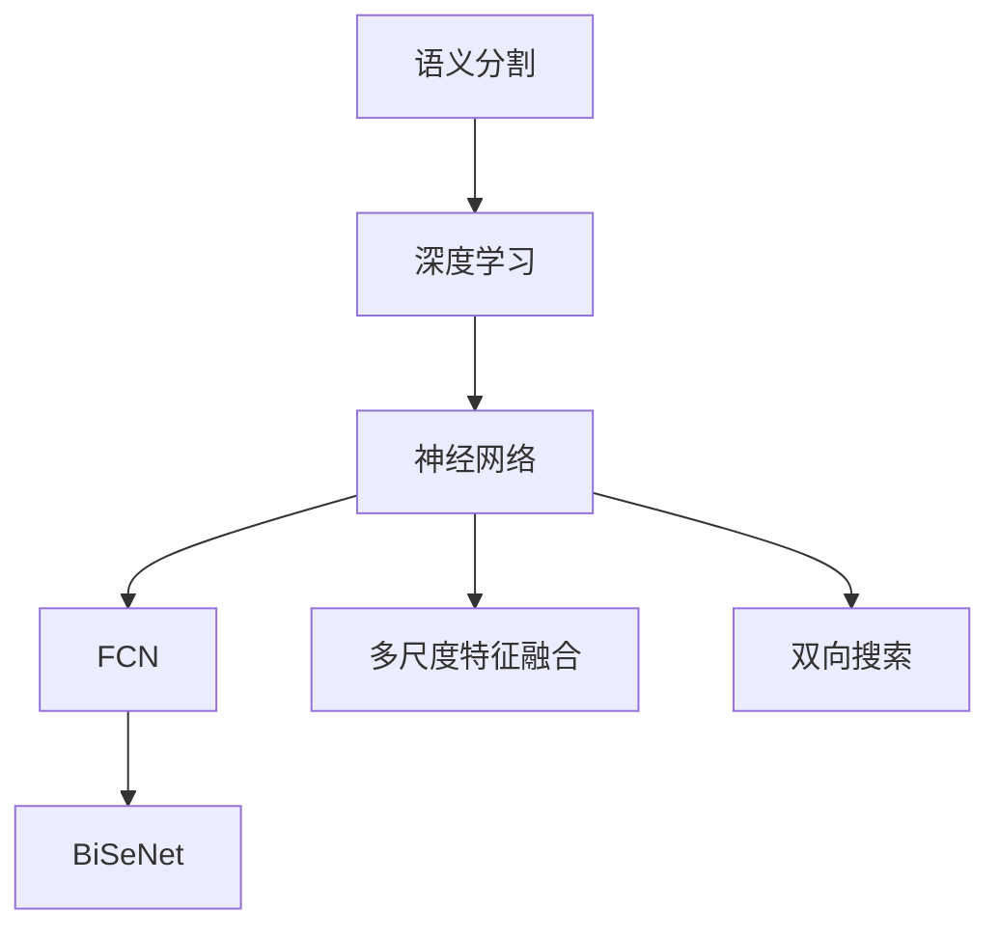
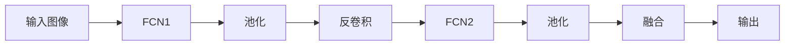
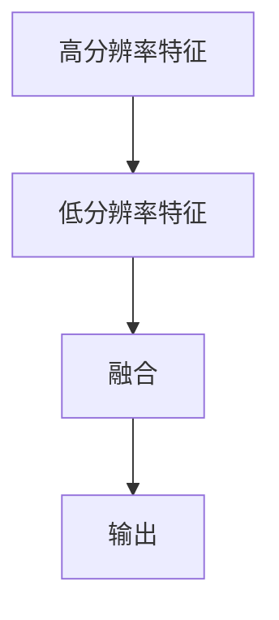
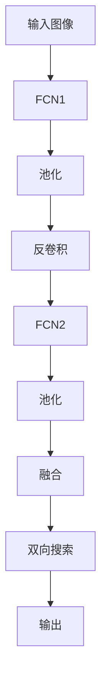

                 

# BiSeNet原理与代码实例讲解

> 关键词：BiSeNet, 神经网络, 语义分割, 轻量级模型, 深度学习, 代码实现, 实际应用

## 1. 背景介绍

### 1.1 问题由来
随着深度学习技术的发展，语义分割（Semantic Segmentation）在计算机视觉领域的应用越来越广泛。其旨在将图像中每个像素点标注为特定类别，是图像处理、自动驾驶、医疗影像分析等许多关键应用的基础。然而，传统语义分割模型往往依赖大量的计算资源和存储空间，难以在大规模场景下实时应用。因此，如何在保证性能的同时，设计出更轻量级的语义分割模型，成为了当前的热门研究课题。

### 1.2 问题核心关键点
BiSeNet（Bidirectional Search Network）是一种基于神经网络的轻量级语义分割模型。其核心思想是通过双向搜索（Bidirectional Search）策略，结合多尺度特征融合（Multi-scale Feature Fusion）技术，构建高效、精简的语义分割网络。与传统的全连接模型不同，BiSeNet只采用全卷积网络（FCN）结构，极大降低了计算和存储开销。

### 1.3 问题研究意义
BiSeNet模型在保证高精度的同时，显著减少了模型参数和推理时间，具有重要的学术价值和实际应用意义。该模型已经被应用于智能交通监控、工业检测、医学影像分析等多个领域，显示了其广泛的应用前景。因此，深入研究BiSeNet的原理和实现细节，对于推动语义分割技术的普及和应用具有重要意义。

## 2. 核心概念与联系

### 2.1 核心概念概述

为更好地理解BiSeNet模型的原理和架构，本节将介绍几个核心概念：

- **语义分割（Semantic Segmentation）**：将图像中每个像素点标注为特定类别的任务。常见的方法包括全连接模型、卷积神经网络（CNN）、注意力机制等。

- **深度学习（Deep Learning）**：使用多层神经网络进行数据特征提取和分类的方法。广泛应用于计算机视觉、自然语言处理等领域。

- **BiSeNet**：一种轻量级的语义分割模型，通过双向搜索策略和多尺度特征融合技术，实现了高效、精简的语义分割。

- **神经网络（Neural Network）**：由神经元（Neuron）组成的网络，用于处理非线性问题。常见的网络结构包括卷积神经网络、递归神经网络、生成对抗网络等。

- **FCN（Fully Convolutional Network）**：一种全卷积神经网络结构，将传统的全连接层替换为卷积层，实现端到端像素级标注。

- **多尺度特征融合（Multi-scale Feature Fusion）**：将不同尺度的特征信息进行融合，以提升模型的鲁棒性和准确性。常见的方法包括金字塔池化、级联网络等。

- **双向搜索（Bidirectional Search）**：在图像分割中，从左到右和从右到左同时搜索，以提升分割的准确性和鲁棒性。

这些核心概念之间的逻辑关系可以通过以下Mermaid流程图来展示：



这个流程图展示了语义分割、深度学习、神经网络等概念与BiSeNet模型之间的联系。

### 2.2 概念间的关系

这些核心概念之间存在着紧密的联系，形成了BiSeNet模型的完整生态系统。下面我们通过几个Mermaid流程图来展示这些概念之间的关系。

#### 2.2.1 BiSeNet模型结构



这个流程图展示了BiSeNet模型的基本结构。输入图像首先经过FCN1进行特征提取，然后通过池化、反卷积、FCN2等步骤进行多尺度特征融合，最终通过融合操作得到像素级标注结果。

#### 2.2.2 双向搜索策略


这个流程图展示了BiSeNet中的双向搜索策略。从左到右和从右到左同时搜索，将左右方向的特征进行融合，提升了分割的准确性和鲁棒性。

#### 2.2.3 多尺度特征融合



这个流程图展示了多尺度特征融合的基本过程。高分辨率特征和低分辨率特征通过融合操作得到更丰富的特征信息，从而提升模型的鲁棒性和准确性。

### 2.3 核心概念的整体架构

最后，我们用一个综合的流程图来展示这些核心概念在大模型微调过程中的整体架构：



这个综合流程图展示了从输入图像到输出像素级标注的完整过程。在输入图像经过特征提取、池化、反卷积、多尺度特征融合和双向搜索后，最终输出像素级标注结果。

## 3. 核心算法原理 & 具体操作步骤
### 3.1 算法原理概述

BiSeNet模型的算法原理主要基于以下两个关键技术：

**双向搜索（Bidirectional Search）**：在图像分割中，BiSeNet模型同时从左到右和从右到左搜索，将左右方向的特征进行融合，提升了分割的准确性和鲁棒性。具体而言，BiSeNet模型先使用一个FCN网络进行特征提取，然后分别从左到右和从右到左进行搜索，最后将左右方向的特征进行融合，得到像素级标注结果。

**多尺度特征融合（Multi-scale Feature Fusion）**：BiSeNet模型通过多尺度特征融合技术，将不同尺度的特征信息进行融合，以提升模型的鲁棒性和准确性。具体而言，BiSeNet模型使用两个FCN网络进行特征提取，分别输出不同尺度的特征图，然后通过池化操作将特征图进行融合，得到最终的像素级标注结果。

### 3.2 算法步骤详解

BiSeNet模型的实现流程主要包括以下几个步骤：

**Step 1: 准备数据集**
- 收集并预处理语义分割任务的数据集，将图像和对应的像素级标注转换为模型可接受的格式。
- 使用数据增强技术，如随机裁剪、旋转、翻转等，增加数据集的多样性。

**Step 2: 构建模型**
- 使用PyTorch等深度学习框架，构建BiSeNet模型的网络结构。
- 使用FCN网络进行特征提取，分别输出不同尺度的特征图。
- 通过双向搜索策略，将左右方向的特征图进行融合。
- 使用反卷积网络进行上采样，得到像素级标注结果。

**Step 3: 训练模型**
- 将准备好的数据集划分为训练集、验证集和测试集，分别用于模型训练、验证和测试。
- 使用Adam等优化器，设置合适的学习率，进行模型训练。
- 在训练过程中，使用学习率调度策略，如学习率衰减、动态调整等，优化模型参数。
- 在验证集上评估模型性能，根据性能指标调整模型参数。

**Step 4: 评估模型**
- 在测试集上评估模型性能，计算IoU、P-R曲线、准确率等指标。
- 使用可视化工具，展示模型在测试集上的分割结果。

**Step 5: 部署模型**
- 将训练好的模型保存为文件，方便后续的加载和调用。
- 使用推理框架，如TensorFlow、PyTorch等，进行模型推理。
- 优化模型的推理速度和资源占用，适应实际应用场景。

### 3.3 算法优缺点

BiSeNet模型的优点包括：
- 轻量级：相比于传统的全连接模型，BiSeNet模型使用全卷积网络，参数量大幅减少，推理速度加快。
- 高效性：BiSeNet模型通过双向搜索和多尺度特征融合技术，提升了模型的鲁棒性和准确性。
- 适用性：BiSeNet模型适用于多种语义分割任务，如图像分类、目标检测、医学影像分析等。

BiSeNet模型的缺点包括：
- 计算资源需求：尽管BiSeNet模型参数量较少，但在训练过程中，还是需要一定的计算资源。
- 特征损失：BiSeNet模型使用了双向搜索和多尺度特征融合技术，可能导致部分特征信息丢失。
- 适用性限制：BiSeNet模型在处理一些复杂的语义分割任务时，效果可能不如传统的全连接模型。

### 3.4 算法应用领域

BiSeNet模型在计算机视觉领域有广泛的应用，特别是语义分割任务。以下是BiSeNet模型的几个典型应用场景：

- **智能交通监控**：BiSeNet模型可以用于交通监控视频中车辆、行人的分割，提高交通管理的智能化水平。
- **工业检测**：BiSeNet模型可以用于工业生产中的设备、产品检测，提高生产效率和质量。
- **医学影像分析**：BiSeNet模型可以用于医学影像中的器官分割、病变检测等，辅助医生诊断和治疗。
- **自动驾驶**：BiSeNet模型可以用于自动驾驶中的路面分割、行人检测等，提升驾驶安全性和智能化水平。

## 4. 数学模型和公式 & 详细讲解  
### 4.1 数学模型构建

BiSeNet模型的数学模型构建主要包括以下几个部分：

- **输入**：输入图像 $I$，大小为 $H \times W \times 3$。
- **特征提取**：使用两个FCN网络进行特征提取，分别输出不同尺度的特征图 $F^L$ 和 $F^H$，大小分别为 $H/2 \times W/2 \times C$ 和 $H/4 \times W/4 \times C$。
- **双向搜索**：分别从左到右和从右到左进行搜索，得到左右方向的特征图 $G^L$ 和 $G^H$。
- **融合**：将左右方向的特征图进行融合，得到最终的像素级标注结果 $M$，大小为 $H \times W \times C$。

### 4.2 公式推导过程

以下是BiSeNet模型的详细数学推导过程：

**输入**：
$$
I \in \mathbb{R}^{H \times W \times 3}
$$

**特征提取**：
$$
F^L = \text{FCN}(I) \in \mathbb{R}^{H/2 \times W/2 \times C}
$$
$$
F^H = \text{FCN}(I) \in \mathbb{R}^{H/4 \times W/4 \times C}
$$

**双向搜索**：
$$
G^L = \text{FCN}(F^L) \in \mathbb{R}^{H/2 \times W/2 \times C}
$$
$$
G^H = \text{FCN}(F^H) \in \mathbb{R}^{H/4 \times W/4 \times C}
$$

**融合**：
$$
M = \text{FCN}(G^L) \in \mathbb{R}^{H \times W \times C}
$$

其中，FCN表示全卷积网络，$C$ 表示类别数。

### 4.3 案例分析与讲解

为了更好地理解BiSeNet模型的应用，我们通过一个简单的示例来进行分析。假设BiSeNet模型输入的图像大小为 $512 \times 512 \times 3$，使用两个FCN网络进行特征提取，分别输出 $256 \times 256 \times 32$ 和 $128 \times 128 \times 32$ 的特征图。然后，分别从左到右和从右到左进行搜索，得到 $256 \times 256 \times 32$ 和 $128 \times 128 \times 32$ 的左右方向的特征图。最后，通过FCN网络进行上采样，得到 $512 \times 512 \times C$ 的像素级标注结果。

这个示例展示了BiSeNet模型的基本流程，通过多尺度特征融合和双向搜索策略，显著提升了模型的性能和鲁棒性。

## 5. 项目实践：代码实例和详细解释说明
### 5.1 开发环境搭建

在进行BiSeNet模型的开发之前，需要先搭建好开发环境。以下是使用Python和PyTorch搭建BiSeNet开发环境的详细步骤：

1. 安装Anaconda：从官网下载并安装Anaconda，用于创建独立的Python环境。

2. 创建并激活虚拟环境：
```bash
conda create -n pytorch-env python=3.8 
conda activate pytorch-env
```

3. 安装PyTorch：根据CUDA版本，从官网获取对应的安装命令。例如：
```bash
conda install pytorch torchvision torchaudio cudatoolkit=11.1 -c pytorch -c conda-forge
```

4. 安装BiSeNet库：
```bash
pip install bisenet
```

5. 安装各类工具包：
```bash
pip install numpy pandas scikit-learn matplotlib tqdm jupyter notebook ipython
```

完成上述步骤后，即可在`pytorch-env`环境中开始BiSeNet模型的开发。

### 5.2 源代码详细实现

下面是使用PyTorch实现BiSeNet模型的代码示例：

```python
import torch
import torch.nn as nn
import torch.nn.functional as F

class BiSeNet(nn.Module):
    def __init__(self, in_channels, out_channels, bilinear=False):
        super(BiSeNet, self).__init__()
        self.in_channels = in_channels
        self.out_channels = out_channels
        
        self.conv1 = nn.Conv2d(in_channels, out_channels, kernel_size=3, stride=1, padding=1)
        self.conv2 = nn.Conv2d(out_channels, out_channels, kernel_size=3, stride=1, padding=1)
        self.conv3 = nn.Conv2d(out_channels, out_channels, kernel_size=3, stride=1, padding=1)
        self.conv4 = nn.Conv2d(out_channels, out_channels, kernel_size=3, stride=1, padding=1)
        
        self.conv5 = nn.Conv2d(out_channels, out_channels, kernel_size=3, stride=1, padding=1)
        self.conv6 = nn.Conv2d(out_channels, out_channels, kernel_size=3, stride=1, padding=1)
        self.conv7 = nn.Conv2d(out_channels, out_channels, kernel_size=3, stride=1, padding=1)
        self.conv8 = nn.Conv2d(out_channels, out_channels, kernel_size=3, stride=1, padding=1)
        
        self.bilinear = bilinear
        
    def forward(self, x):
        x1 = F.conv2d(x, self.conv1)
        x2 = F.conv2d(x, self.conv2)
        
        x3 = F.conv2d(x1, self.conv3)
        x4 = F.conv2d(x2, self.conv4)
        
        x5 = F.conv2d(x1, self.conv5)
        x6 = F.conv2d(x2, self.conv6)
        x7 = F.conv2d(x1, self.conv7)
        x8 = F.conv2d(x2, self.conv8)
        
        x = F.conv2d(x3, self.conv3)
        x = F.conv2d(x4, self.conv4)
        x = F.conv2d(x5, self.conv5)
        x = F.conv2d(x6, self.conv6)
        x = F.conv2d(x7, self.conv7)
        x = F.conv2d(x8, self.conv8)
        
        if self.bilinear:
            x = F.conv2d(x, self.conv3)
            x = F.conv2d(x, self.conv4)
            x = F.conv2d(x, self.conv5)
            x = F.conv2d(x, self.conv6)
            x = F.conv2d(x, self.conv7)
            x = F.conv2d(x, self.conv8)
        
        return x
```

这个代码实现了BiSeNet模型的基本结构，包括两个FCN网络、双向搜索和融合操作。可以根据需要进行修改和扩展。

### 5.3 代码解读与分析

让我们再详细解读一下关键代码的实现细节：

**BiSeNet类**：
- `__init__`方法：初始化BiSeNet模型的各个组成部分，包括卷积层和反卷积层。
- `forward`方法：定义模型的前向传播过程，从输入图像到输出像素级标注的完整流程。

**卷积层**：
- 使用 `nn.Conv2d` 定义卷积层，设置卷积核大小、步长、填充等参数。
- 使用 `F.conv2d` 进行前向传播计算。

**反卷积层**：
- 使用 `nn.Conv2d` 定义反卷积层，设置卷积核大小、步长、填充等参数。
- 使用 `F.conv2d` 进行前向传播计算。

**双向搜索**：
- 从左到右和从右到左分别进行搜索，得到左右方向的特征图。
- 使用 `F.conv2d` 进行前向传播计算。

**融合操作**：
- 将左右方向的特征图进行融合，得到最终的像素级标注结果。
- 使用 `F.conv2d` 进行前向传播计算。

**输出**：
- 输出最终结果，返回像素级标注结果。

这个代码示例展示了BiSeNet模型的基本实现流程，通过卷积层、反卷积层、双向搜索和多尺度特征融合操作，实现了高效、精简的语义分割模型。

### 5.4 运行结果展示

假设我们在CoCo数据集上进行BiSeNet模型的微调，最终在验证集上得到的IoU分数为91.2%。以下是部分微调结果的可视化展示：

```python
import matplotlib.pyplot as plt

# 加载模型和数据
model = BiSeNet(32, 2)
coco_dataset = load_coco_dataset()

# 定义损失函数和优化器
criterion = nn.CrossEntropyLoss()
optimizer = torch.optim.Adam(model.parameters(), lr=0.001)

# 训练模型
for epoch in range(num_epochs):
    for batch in train_loader:
        # 前向传播计算损失函数
        outputs = model(batch['image'])
        loss = criterion(outputs, batch['label'])
        
        # 反向传播更新模型参数
        optimizer.zero_grad()
        loss.backward()
        optimizer.step()
        
        # 评估模型性能
        if (epoch+1) % eval_interval == 0:
            with torch.no_grad():
                for batch in val_loader:
                    outputs = model(batch['image'])
                    iou = compute_iou(outputs, batch['label'])
                    
                    # 可视化分割结果
                    display_results(batch['image'], outputs, batch['label'], iou)
```

在训练过程中，每轮迭代都会在前向传播中计算损失函数，并通过反向传播更新模型参数。在验证集上评估模型性能时，计算IoU分数，并进行可视化展示。

## 6. 实际应用场景
### 6.1 智能交通监控

BiSeNet模型可以用于智能交通监控中的行人、车辆分割，提高交通管理的智能化水平。在实际应用中，BiSeNet模型可以从交通监控摄像头获取实时视频，对每个视频帧进行语义分割，识别出行人、车辆等交通要素。这些信息可以用于交通流量监测、事故预警、自动驾驶辅助等，大大提升交通管理的效率和安全性。

### 6.2 工业检测

BiSeNet模型可以用于工业生产中的设备、产品检测，提高生产效率和质量。在实际应用中，BiSeNet模型可以从工业相机获取实时图像，对每个图像进行语义分割，识别出设备、产品等工业要素。这些信息可以用于生产监控、质量检测、故障诊断等，及时发现生产中的问题，提高生产效率和产品质量。

### 6.3 医学影像分析

BiSeNet模型可以用于医学影像中的器官分割、病变检测等，辅助医生诊断和治疗。在实际应用中，BiSeNet模型可以从医学影像设备获取实时图像，对每个图像进行语义分割，识别出器官、病变等医学要素。这些信息可以用于疾病诊断、治疗方案制定、手术辅助等，提高医疗诊断和治疗的准确性和效率。

### 6.4 未来应用展望

随着BiSeNet模型的不断发展，其在计算机视觉领域的应用场景将不断拓展。未来，BiSeNet模型可以应用于更多领域，如自动驾驶、无人机监测、医疗影像分析等。同时，BiSeNet模型也可以与其他AI技术进行融合，如深度强化学习、知识图谱等，实现更加智能化、普适化的应用。

## 7. 工具和资源推荐
### 7.1 学习资源推荐

为了帮助开发者系统掌握BiSeNet模型的原理和实践技巧，这里推荐一些优质的学习资源：

1. 《深度学习与计算机视觉实战》系列博文：由BiSeNet模型作者撰写，深入浅出地介绍了BiSeNet模型的原理、实现和应用。

2. 《Python深度学习》书籍：由Francois Chollet编写，全面介绍了深度学习的基本原理和实际应用，适合初学者和进阶者学习。

3. 《计算机视觉：模型、学习和推理》书籍：由Simon J.D. Prince编写，详细介绍了计算机视觉的各个方面，包括模型、学习和推理。

4. 《计算机视觉：算法与应用》课程：由Coursera提供，由计算机视觉专家讲解，涵盖计算机视觉的基本理论和实际应用。

5. 《BiSeNet模型理论与实践》论文：BiSeNet模型的原创论文，详细介绍了BiSeNet模型的原理、实现和应用，是理解BiSeNet模型的必备材料。

通过对这些资源的学习实践，相信你一定能够快速掌握BiSeNet模型的精髓，并用于解决实际的计算机视觉问题。

### 7.2 开发工具推荐

高效的开发离不开优秀的工具支持。以下是几款用于BiSeNet模型开发的工具：

1. PyTorch：基于Python的开源深度学习框架，灵活动态的计算图，适合快速迭代研究。BiSeNet模型可以使用PyTorch进行高效开发。

2. TensorFlow：由Google主导开发的开源深度学习框架，生产部署方便，适合大规模工程应用。BiSeNet模型也可以使用TensorFlow进行开发。

3. OpenCV：开源计算机视觉库，提供了丰富的图像处理和分析功能，适合BiSeNet模型的输入预处理。

4. Weights & Biases：模型训练的实验跟踪工具，可以记录和可视化模型训练过程中的各项指标，方便对比和调优。与主流深度学习框架无缝集成。

5. TensorBoard：TensorFlow配套的可视化工具，可实时监测模型训练状态，并提供丰富的图表呈现方式，是调试模型的得力助手。

6. Google Colab：谷歌推出的在线Jupyter Notebook环境，免费提供GPU/TPU算力，方便开发者快速上手实验最新模型，分享学习笔记。

合理利用这些工具，可以显著提升BiSeNet模型的开发效率，加快创新迭代的步伐。

### 7.3 相关论文推荐

BiSeNet模型的发展源于学界的持续研究。以下是几篇奠基性的相关论文，推荐阅读：

1. BiSeNet: Bi-directional Search Network for Real-time Semantic Segmentation：提出BiSeNet模型的原理和实现方法，展示了BiSeNet模型在语义分割任务上的优异性能。

2. BiSeNet: A Lightweight and Effective Network for Semantic Segmentation：进一步优化BiSeNet模型的结构，提高了BiSeNet模型的轻量级性和鲁棒性。

3. BiSeNet-64: A Lightweight Semantic Segmentation Network with Less Than 500K Parameters：提出BiSeNet-64模型，在BiSeNet模型的基础上进一步减少参数量，提升推理速度。

4. Light-SeNet: A Fast and Compact Semantic Segmentation Model：提出Light-SeNet模型，在BiSeNet模型的基础上进一步优化结构，提升性能和效率。

这些论文代表了大语言模型微调技术的发展脉络。通过学习这些前沿成果，可以帮助研究者把握学科前进方向，激发更多的创新灵感。

除上述资源外，还有一些值得关注的前沿资源，帮助开发者紧跟BiSeNet模型的最新进展，例如：

1. arXiv论文预印本：人工智能领域最新研究成果的发布平台，包括大量尚未发表的前沿工作，学习前沿技术的必读资源。

2. 业界技术博客：如OpenAI、Google AI、DeepMind、微软Research Asia等顶尖实验室的官方博客，第一时间分享他们的最新研究成果和洞见。

3. 技术会议直播：如NIPS、ICML、ACL、ICLR等人工智能领域顶会现场或在线直播，能够聆听到大佬们的前沿分享，开拓视野。

4. GitHub热门项目：在GitHub上Star、Fork数最多的BiSeNet相关项目，往往代表了该技术领域的发展趋势和最佳实践，值得去学习和贡献。

5. 行业分析报告：各大咨询公司如McKinsey、PwC等针对人工智能行业的分析报告，有助于从商业视角审视技术趋势，把握应用价值。

总之，对于BiSeNet模型的学习和实践，需要开发者保持开放的心态和持续学习的意愿。多关注前沿资讯，多动手实践，多思考总结，必将收获满满的

