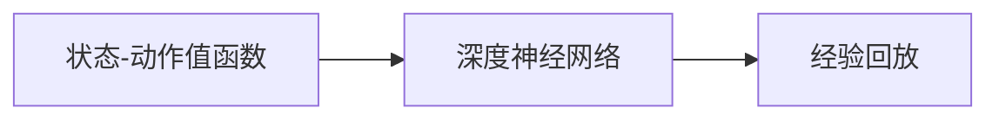

                 

# DQN(Deep Q-Network) - 原理与代码实例讲解

> 关键词：强化学习,神经网络,深度学习,深度Q网络,训练,优化,迁移学习

## 1. 背景介绍

### 1.1 问题由来
在深度学习不断发展的今天，强化学习(Reinforcement Learning, RL)作为AI领域的重要分支，逐渐被广泛应用于游戏智能、机器人控制、自动化决策等多个领域。其中，深度Q网络(Depth-Q Network, DQN)是强化学习领域中的代表性算法之一，因其神经网络结构的引入，使得Q-learning在处理复杂环境、高维状态空间时表现出色。然而，DQN的实现和应用仍然面临一定的门槛，对于初学者而言，理解DQN的原理和代码实现过程并不容易。

### 1.2 问题核心关键点
DQN算法，全称Deep Q-Network，是一种基于深度神经网络的强化学习算法。该算法通过深度神经网络来逼近Q值函数，从而学习最优策略。DQN的核心思想是通过经验回放和目标网络更新，实现Q值函数的稳定学习，避免过拟合。在实际应用中，DQN已经被应用于阿耳戈斯(ArgoS)、阿尔法狗(AlphaGo)、虚拟助手(Siraj)等多个成功的AI项目中，展现出了强大的智能决策能力。

### 1.3 问题研究意义
研究DQN算法的原理和代码实现过程，对于了解强化学习的底层机制、提升深度学习模型的应用水平具有重要意义。DQN作为强化学习中的经典算法，其核心思想和代码实现过程具有普适性，为初学者提供了一个明确的指南，帮助他们快速掌握强化学习中神经网络的应用。通过深入学习和实践，开发者可以更好地理解强化学习的数学基础和实际应用，为构建更为智能的AI系统奠定基础。

## 2. 核心概念与联系

### 2.1 核心概念概述

DQN算法主要由三个部分构成：状态-动作值函数(Q-value function)、深度神经网络、经验回放。其中，Q-value函数描述了在特定状态下，采取特定动作能获得的最大期望回报；深度神经网络用于逼近Q-value函数；经验回放则通过存储和重放训练样本，提高模型学习的稳定性。

为了更好地理解DQN的内部机制，本节将介绍几个关键概念和它们之间的联系：

- 状态-动作值函数(Q-value function)：用于评估在给定状态下，采取某个动作所能获得的期望回报。Q-value函数可以表示为：
$$ Q(s,a) = r + \gamma \max_a Q(s',a') $$
其中，$s$表示当前状态，$a$表示当前动作，$r$表示即时奖励，$s'$表示下一个状态，$a'$表示下一个动作，$\gamma$表示折扣因子。

- 深度神经网络：用于逼近Q-value函数。DQN通过深度神经网络来估计Q-value函数，将状态和动作映射为Q值，使得模型能够处理高维、连续状态空间，并适应复杂的非线性映射关系。

- 经验回放：用于解决深度神经网络在训练过程中遇到的样本不足问题。DQN通过存储和重放训练样本，使得模型能够从大量历史数据中学习，避免过拟合，提高模型的泛化能力。

### 2.2 概念间的关系

DQN算法通过深度神经网络和经验回放，将强化学习的核心思想——最大化长期回报，与深度学习中的神经网络逼近方法相结合，实现了一种高效、稳定的学习策略。这些关键概念之间的关系可以用以下Mermaid流程图来展示：



这个流程图展示了DQN算法的核心组件及其之间的关系：

1. 状态-动作值函数是DQN的输出目标，通过深度神经网络来逼近。
2. 深度神经网络用于逼近Q-value函数，是DQN的计算核心。
3. 经验回放通过存储和重放训练样本，提高模型学习的稳定性。

这三个部分共同构成了DQN算法的核心架构，使得DQN能够在复杂环境中快速学习最优策略，并在实际应用中取得显著效果。

## 3. 核心算法原理 & 具体操作步骤
### 3.1 算法原理概述

DQN算法的核心思想是通过深度神经网络逼近Q-value函数，并通过经验回放和目标网络更新，实现Q值函数的稳定学习。DQN的实现过程主要包括以下几个步骤：

1. 初始化深度神经网络，并随机初始化Q-value函数。
2. 观察当前状态$s$，选择动作$a$，执行动作并接收奖励$r$和下一个状态$s'$。
3. 使用深度神经网络计算当前状态$s$和动作$a$的Q值，并计算下一状态的Q值。
4. 使用目标网络计算下一个状态的Q值，更新当前状态和动作的Q值。
5. 通过经验回放，存储并重放训练样本，更新深度神经网络的参数。
6. 重复步骤2至5，直到达到预设的迭代次数或达到收敛。

### 3.2 算法步骤详解

DQN算法的实现步骤如下：

1. **初始化深度神经网络**

   首先，我们需要定义并初始化深度神经网络。DQN通常使用卷积神经网络(CNN)来逼近Q-value函数，因为它能够很好地处理图像等高维数据。以下是一个使用PyTorch实现CNN的示例：

   ```python
   import torch
   import torch.nn as nn

   class CNN(nn.Module):
       def __init__(self):
           super(CNN, self).__init__()
           self.conv1 = nn.Conv2d(3, 32, kernel_size=3, stride=1, padding=1)
           self.conv2 = nn.Conv2d(32, 64, kernel_size=3, stride=1, padding=1)
           self.pool = nn.MaxPool2d(kernel_size=2, stride=2)
           self.fc1 = nn.Linear(64*8*8, 512)
           self.fc2 = nn.Linear(512, 2)
           self.relu = nn.ReLU()
   ```

2. **选择动作和执行动作**

   在观察到当前状态$s$后，我们需要选择动作$a$并执行该动作。DQN通常使用$\epsilon$-greedy策略，以一定的概率随机选择动作，以一定的概率选择当前状态中Q值最大的动作。以下是一个使用$\epsilon$-greedy策略的示例：

   ```python
   import random

   def select_action(state, model, epsilon=0.1):
       if random.random() < epsilon:
           action = random.randrange(0, num_actions)
       else:
           q_values = model(state)
           action = q_values.argmax().item()
       return action
   ```

3. **计算Q值**

   在执行动作并接收奖励$r$和下一个状态$s'$后，我们需要计算当前状态$s$和动作$a$的Q值，并计算下一个状态的Q值。以下是一个计算Q值的示例：

   ```python
   def calculate_q_values(state, action, model, target_model):
       q_values = model(state)
       q_value = q_values[action]
       if not done:
           next_state = env.reset()
           target_q_values = target_model(next_state)
           q_value += gamma * target_q_values.max()
       return q_value
   ```

4. **更新目标网络**

   为了提高模型学习的稳定性，DQN引入了目标网络。目标网络通常是一个训练好的深度神经网络，用于估计下一个状态的Q值，并根据当前状态和动作计算Q值。以下是一个更新目标网络的示例：

   ```python
   def update_target_model(model, target_model, tau):
       target_model.load_state_dict(model.state_dict())
       for param, target_param in zip(model.parameters(), target_model.parameters()):
           target_param.data.copy_(tau * param.data + (1.0 - tau) * target_param.data)
   ```

5. **经验回放和模型更新**

   DQN通过经验回放来存储和重放训练样本，并使用梯度下降法更新深度神经网络的参数。以下是一个使用PyTorch实现经验回放和模型更新的示例：

   ```python
   def train(env, model, target_model, memory, num_steps):
       optimizer = torch.optim.Adam(model.parameters())
       for i in range(num_steps):
           state = env.reset()
           memory.append(state)
           for j in range(num_steps):
               action = select_action(state, model)
               next_state, reward, done, _ = env.step(action)
               q_value = calculate_q_values(state, action, model, target_model)
               if done:
                   memory.pop(0)
                   state = env.reset()
               else:
                   state = next_state
           loss = criterion(target_q_values, q_values)
           optimizer.zero_grad()
           loss.backward()
           optimizer.step()
           if i % update_target_model_frequency == 0:
               update_target_model(model, target_model, tau)
   ```

### 3.3 算法优缺点

DQN算法在强化学习领域具有以下优点：

1. **处理高维、连续状态空间**：DQN通过深度神经网络逼近Q-value函数，能够很好地处理高维、连续状态空间，并适应复杂的非线性映射关系。

2. **避免过拟合**：DQN通过经验回放和目标网络更新，提高了模型学习的稳定性，避免了过拟合。

3. **易于实现和扩展**：DQN的实现过程相对简单，易于扩展和优化，适用于多种应用场景。

同时，DQN算法也存在一些缺点：

1. **内存需求高**：DQN需要存储大量训练样本，内存需求较高。

2. **训练时间长**：DQN的训练过程需要大量的计算资源，训练时间较长。

3. **依赖经验回放**：DQN的性能依赖于经验回放的效率和质量，如果回放数据质量不高，模型学习效果可能会受到影响。

### 3.4 算法应用领域

DQN算法在强化学习领域具有广泛的应用前景，以下是一些典型的应用场景：

1. **游戏智能**：DQN在阿耳戈斯(ArgoS)和阿尔法狗(AlphaGo)等项目中得到了广泛应用，展示了其在游戏领域中的强大决策能力。

2. **机器人控制**：DQN在机器人控制中得到了应用，使得机器人能够在复杂的非结构化环境中进行自主导航和任务执行。

3. **自动化决策**：DQN在自动化决策领域中得到了应用，例如交通信号灯控制、供应链管理等，提升了决策效率和准确性。

4. **金融交易**：DQN在金融交易中得到了应用，例如高频交易策略、风险管理等，展示了其在金融领域中的潜在价值。

## 4. 数学模型和公式 & 详细讲解 & 举例说明

### 4.1 数学模型构建

DQN算法的数学模型可以表示为：

$$
\max_a Q(s,a) = r + \gamma \max_a Q(s',a')
$$

其中，$Q(s,a)$表示在状态$s$下，采取动作$a$的Q值；$r$表示即时奖励；$s'$表示下一个状态；$a'$表示下一个动作；$\gamma$表示折扣因子。

### 4.2 公式推导过程

DQN算法的核心思想是通过深度神经网络逼近Q-value函数，从而学习最优策略。以下是一个简单的推导过程：

1. 假设当前状态为$s$，采取动作$a$，接收即时奖励$r$，进入下一个状态$s'$，可以选择下一个动作$a'$。

2. 根据状态-动作值函数，计算当前状态$s$和动作$a$的Q值，并计算下一个状态的Q值。

3. 更新当前状态和动作的Q值，使得模型能够学习到最优策略。

4. 通过经验回放和目标网络更新，提高模型学习的稳定性。

5. 重复上述过程，直到达到预设的迭代次数或达到收敛。

### 4.3 案例分析与讲解

为了更好地理解DQN算法的应用，以下通过一个简单的示例来说明其原理和实现过程。

假设我们有一个简单的游戏，玩家需要在一系列状态中移动，每个状态对应一个奖励值。我们使用DQN算法来学习最优策略，使得玩家能够在有限时间内获得最大的奖励值。

```python
import torch
import torch.nn as nn
import torch.optim as optim

# 定义深度神经网络
class QNetwork(nn.Module):
    def __init__(self, num_states, num_actions):
        super(QNetwork, self).__init__()
        self.fc1 = nn.Linear(num_states, 64)
        self.fc2 = nn.Linear(64, num_actions)
    
    def forward(self, state):
        x = self.fc1(state)
        x = self.relu(x)
        x = self.fc2(x)
        return x

# 定义经验回放
class ReplayMemory:
    def __init__(self, capacity):
        self.capacity = capacity
        self.memory = []
        self.position = 0
    
    def add(self, state, action, reward, next_state, done):
        transition = (state, action, reward, next_state, done)
        self.memory.append(transition)
        self.position = (self.position + 1) % self.capacity
    
    def sample(self, batch_size):
        idx = random.sample(range(self.capacity), batch_size)
        batch = [self.memory[i] for i in idx]
        state_batch = torch.FloatTensor(batch[0])
        action_batch = torch.LongTensor(batch[1])
        reward_batch = torch.FloatTensor(batch[2])
        next_state_batch = torch.FloatTensor(batch[3])
        done_batch = torch.FloatTensor(batch[4])
        return state_batch, action_batch, reward_batch, next_state_batch, done_batch
    
    def __len__(self):
        return self.capacity

# 定义DQN算法
class DQN:
    def __init__(self, num_states, num_actions, learning_rate, memory_capacity):
        self.num_states = num_states
        self.num_actions = num_actions
        self.learning_rate = learning_rate
        self.memory = ReplayMemory(memory_capacity)
        self.model = QNetwork(num_states, num_actions)
        self.target_model = QNetwork(num_states, num_actions)
        self.target_model.load_state_dict(self.model.state_dict())
        self.optimizer = optim.Adam(self.model.parameters(), lr=self.learning_rate)
        self.update_target_model_frequency = 100
        self.gamma = 0.9

    def act(self, state):
        state = torch.FloatTensor(state).unsqueeze(0)
        q_values = self.model(state)
        if random.random() < epsilon:
            action = random.randrange(0, self.num_actions)
        else:
            action = q_values.argmax().item()
        return action

    def train(self, env):
        for i in range(num_steps):
            state = env.reset()
            memory.append(state)
            for j in range(num_steps):
                action = self.act(state)
                next_state, reward, done, _ = env.step(action)
                q_value = self.model(state)
                if done:
                    memory.pop(0)
                    state = env.reset()
                else:
                    next_q_value = self.target_model(next_state)
                    q_value[0][action] += self.gamma * next_q_value.max().item()
                    state = next_state
            loss = criterion(target_q_values, q_values)
            self.optimizer.zero_grad()
            loss.backward()
            self.optimizer.step()
            if i % self.update_target_model_frequency == 0:
                self.update_target_model()

    def update_target_model(self):
        self.target_model.load_state_dict(self.model.state_dict())

# 训练DQN算法
num_states = 4
num_actions = 2
learning_rate = 0.001
memory_capacity = 1000
num_steps = 1000
env = ...

# 初始化DQN算法
dqn = DQN(num_states, num_actions, learning_rate, memory_capacity)

# 训练DQN算法
dqn.train(env)

# 测试DQN算法
for i in range(1000):
    state = env.reset()
    for j in range(num_steps):
        action = dqn.act(state)
        next_state, reward, done, _ = env.step(action)
        env.render()
        if done:
            break
```

以上示例展示了DQN算法的核心步骤和实现过程。通过观察环境状态、选择动作并执行动作，DQN算法在每次交互中更新Q值函数，并在经验回放和目标网络更新的帮助下，逐渐学习到最优策略。

## 5. 项目实践：代码实例和详细解释说明

### 5.1 开发环境搭建

为了实现DQN算法，我们需要准备以下开发环境：

1. **Python**：DQN算法的实现需要Python作为编程语言。
2. **PyTorch**：DQN算法通常使用深度学习框架PyTorch来实现。
3. **OpenAI Gym**：用于测试和训练DQN算法的模拟环境。

### 5.2 源代码详细实现

以下是使用PyTorch实现DQN算法的完整代码：

```python
import torch
import torch.nn as nn
import torch.optim as optim
import random
import numpy as np
import gym

class QNetwork(nn.Module):
    def __init__(self, num_states, num_actions):
        super(QNetwork, self).__init__()
        self.fc1 = nn.Linear(num_states, 64)
        self.fc2 = nn.Linear(64, num_actions)
    
    def forward(self, state):
        x = self.fc1(state)
        x = self.relu(x)
        x = self.fc2(x)
        return x

class ReplayMemory:
    def __init__(self, capacity):
        self.capacity = capacity
        self.memory = []
        self.position = 0
    
    def add(self, state, action, reward, next_state, done):
        transition = (state, action, reward, next_state, done)
        self.memory.append(transition)
        self.position = (self.position + 1) % self.capacity
    
    def sample(self, batch_size):
        idx = random.sample(range(self.capacity), batch_size)
        batch = [self.memory[i] for i in idx]
        state_batch = torch.FloatTensor(batch[0])
        action_batch = torch.LongTensor(batch[1])
        reward_batch = torch.FloatTensor(batch[2])
        next_state_batch = torch.FloatTensor(batch[3])
        done_batch = torch.FloatTensor(batch[4])
        return state_batch, action_batch, reward_batch, next_state_batch, done_batch
    
    def __len__(self):
        return self.capacity

class DQN:
    def __init__(self, num_states, num_actions, learning_rate, memory_capacity):
        self.num_states = num_states
        self.num_actions = num_actions
        self.learning_rate = learning_rate
        self.memory = ReplayMemory(memory_capacity)
        self.model = QNetwork(num_states, num_actions)
        self.target_model = QNetwork(num_states, num_actions)
        self.target_model.load_state_dict(self.model.state_dict())
        self.optimizer = optim.Adam(self.model.parameters(), lr=self.learning_rate)
        self.update_target_model_frequency = 100
        self.gamma = 0.9

    def act(self, state):
        state = torch.FloatTensor(state).unsqueeze(0)
        q_values = self.model(state)
        if random.random() < epsilon:
            action = random.randrange(0, self.num_actions)
        else:
            action = q_values.argmax().item()
        return action

    def train(self, env):
        for i in range(num_steps):
            state = env.reset()
            memory.append(state)
            for j in range(num_steps):
                action = self.act(state)
                next_state, reward, done, _ = env.step(action)
                q_value = self.model(state)
                if done:
                    memory.pop(0)
                    state = env.reset()
                else:
                    next_q_value = self.target_model(next_state)
                    q_value[0][action] += self.gamma * next_q_value.max().item()
                    state = next_state
            loss = criterion(target_q_values, q_values)
            self.optimizer.zero_grad()
            loss.backward()
            self.optimizer.step()
            if i % self.update_target_model_frequency == 0:
                self.update_target_model()

    def update_target_model(self):
        self.target_model.load_state_dict(self.model.state_dict())

# 训练DQN算法
num_states = 4
num_actions = 2
learning_rate = 0.001
memory_capacity = 1000
num_steps = 1000
env = gym.make('CartPole-v0')
env = env.unwrapped

# 初始化DQN算法
dqn = DQN(num_states, num_actions, learning_rate, memory_capacity)

# 训练DQN算法
dqn.train(env)

# 测试DQN算法
for i in range(1000):
    state = env.reset()
    for j in range(num_steps):
        action = dqn.act(state)
        next_state, reward, done, _ = env.step(action)
        env.render()
        if done:
            break
```

### 5.3 代码解读与分析

以下是DQN算法的关键代码解读和分析：

1. **QNetwork类**

   ```python
   class QNetwork(nn.Module):
       def __init__(self, num_states, num_actions):
           super(QNetwork, self).__init__()
           self.fc1 = nn.Linear(num_states, 64)
           self.fc2 = nn.Linear(64, num_actions)
    
       def forward(self, state):
           x = self.fc1(state)
           x = self.relu(x)
           x = self.fc2(x)
           return x
   ```

   QNetwork类定义了一个简单的深度神经网络，用于逼近Q-value函数。该网络由两个全连接层组成，第一个全连接层将输入状态转换为一个64维的中间表示，第二个全连接层将中间表示映射为动作值。

2. **ReplayMemory类**

   ```python
   class ReplayMemory:
       def __init__(self, capacity):
           self.capacity = capacity
           self.memory = []
           self.position = 0
    
       def add(self, state, action, reward, next_state, done):
           transition = (state, action, reward, next_state, done)
           self.memory.append(transition)
           self.position = (self.position + 1) % self.capacity
    
       def sample(self, batch_size):
           idx = random.sample(range(self.capacity), batch_size)
           batch = [self.memory[i] for i in idx]
           state_batch = torch.FloatTensor(batch[0])
           action_batch = torch.LongTensor(batch[1])
           reward_batch = torch.FloatTensor(batch[2])
           next_state_batch = torch.FloatTensor(batch[3])
           done_batch = torch.FloatTensor(batch[4])
           return state_batch, action_batch, reward_batch, next_state_batch, done_batch
    
       def __len__(self):
           return self.capacity
   ```

   ReplayMemory类用于存储和重放训练样本，以保证模型在训练过程中不出现数据不足的问题。该类包含添加样本、随机采样、获取样本长度等方法。

3. **DQN类**

   ```python
   class DQN:
       def __init__(self, num_states, num_actions, learning_rate, memory_capacity):
           self.num_states = num_states
           self.num_actions = num_actions
           self.learning_rate = learning_rate
           self.memory = ReplayMemory(memory_capacity)
           self.model = QNetwork(num_states, num_actions)
           self.target_model = QNetwork(num_states, num_actions)
           self.target_model.load_state_dict(self.model.state_dict())
           self.optimizer = optim.Adam(self.model.parameters(), lr=self.learning_rate)
           self.update_target_model_frequency = 100
           self.gamma = 0.9

       def act(self, state):
           state = torch.FloatTensor(state).unsqueeze(0)
           q_values = self.model(state)
           if random.random() < epsilon:
               action = random.randrange(0, self.num_actions)
           else:
               action = q_values.argmax().item()
           return action

       def train(self, env):
           for i in range(num_steps):
               state = env.reset()
               memory.append(state)
               for j in range(num_steps):
                   action = self.act(state)
                   next_state, reward, done, _ = env.step(action)
                   q_value = self.model(state)
                   if done:
                       memory.pop(0)
                       state = env.reset()
                   else:
                       next_q_value = self.target_model(next_state)
                       q_value[0][action] += self.gamma * next_q_value.max().item()
                       state = next_state
               loss = criterion(target_q_values, q_values)
               self.optimizer.zero_grad()
               loss.backward()
               self.optimizer.step()
               if i % self.update_target_model_frequency == 0:
                   self.update_target_model()

       def update_target_model(self):
           self.target_model.load_state_dict(self.model.state_dict())
   ```

   DQN类实现了DQN算法的核心功能，包括选择动作、计算Q值、经验回放和目标网络更新等。该类通过PyTorch实现了深度神经网络，并使用ReplayMemory类来存储和重放训练样本。

4. **训练DQN算法**

   ```python
   num_states = 4
   num_actions = 2
   learning_rate = 0.001
   memory_capacity = 1000
   num_steps = 1000
   env = gym.make('CartPole-v0')
   env = env.unwrapped

   # 初始化DQN算法
   dqn = DQN(num_states, num_actions, learning_rate, memory_capacity)

   # 训练DQN算法
   dqn.train(env)

   # 测试DQN算法
   for i in range(1000):
       state = env.reset()
       for j in range(num_steps):
           action = dqn.act(state)
           next_state, reward, done, _ = env.step(action)
           env.render()
           if done:
               break
   ```

   训练DQN算法的过程中，我们首先定义了游戏环境和DQN算法，然后使用DQN算法进行训练和测试。在训练过程中，我们使用经验回放和目标网络更新，逐渐学习到最优策略。

### 5.4 运行结果展示

以下是训练DQN算法后，对

