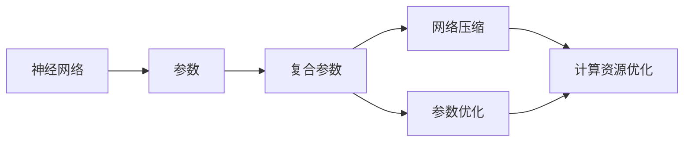
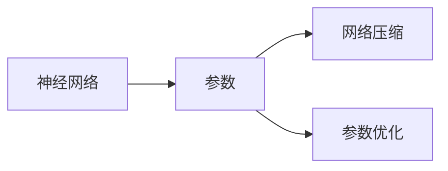

                 

# EfficientNet原理与代码实例讲解

> 关键词：
> EfficientNet, 网络设计, 参数剪枝, 神经网络优化, 计算资源优化, 深度学习, 代码实现

## 1. 背景介绍

### 1.1 问题由来
在深度学习领域，尤其是在图像分类、目标检测等视觉任务中，神经网络模型的性能往往依赖于庞大的参数规模和大量的计算资源。随着模型深度和宽度的增加，训练和推理的开销也急剧上升，导致模型的应用部署面临诸多挑战。例如，在大规模数据集上训练的模型往往需要耗尽计算集群，甚至无法在常规的个人计算机上运行。

为了解决这一问题，研究者们提出了一系列针对神经网络参数和计算资源的优化方法。这些方法不仅能够显著降低模型的复杂度，还能提升模型的精度和泛化能力，从而在实际应用中发挥更好的效果。

### 1.2 问题核心关键点
为了在参数和计算资源受限的条件下，设计出性能卓越的神经网络，研究者们引入了**神经网络压缩**和**参数优化**的方法。其中，**EfficientNet**是一类代表性方法，通过引入多个超参数，实现对网络结构的自适应调整，使得模型能够在给定的计算资源和参数预算下达到最优的性能。

EfficientNet的主要创新点在于，通过引入多个超参数，包括特征图大小、通道数量、深度和复合参数等，使得模型能够根据不同的任务需求进行自适应调整，从而在计算资源和参数预算有限的条件下，达到最优的性能。

## 2. 核心概念与联系

### 2.1 核心概念概述

为了更好地理解EfficientNet的原理和应用，本节将介绍几个关键概念及其联系：

- **神经网络（Neural Network）**：由多个层构成的计算图，通过前向传播和反向传播实现对输入数据的建模和预测。
- **参数（Parameters）**：神经网络中可训练的变量，用于调整模型权重，提升模型性能。
- **复合参数（Compound Parameter）**：多个超参数的组合，用于控制网络的结构。
- **网络压缩（Network Compression）**：通过删除冗余参数和结构，减少计算资源消耗，提升模型性能。
- **参数优化（Parameter Optimization）**：通过调整参数分布，优化模型性能，降低过拟合风险。
- **计算资源优化（Computation Resource Optimization）**：通过优化计算图和参数分布，减少计算开销，提高模型训练和推理效率。

这些概念之间的逻辑关系可以通过以下Mermaid流程图来展示：



这个流程图展示了神经网络、参数、复合参数、网络压缩、参数优化和计算资源优化之间的联系。

### 2.2 概念间的关系

这些核心概念之间存在着紧密的联系，构成了神经网络优化的完整生态系统。下面通过几个Mermaid流程图来展示这些概念之间的关系。

#### 2.2.1 神经网络与参数



这个流程图展示了神经网络、参数和网络压缩、参数优化之间的联系。神经网络通过参数调整实现模型性能的提升，而网络压缩和参数优化则进一步优化参数，提升模型效率。

#### 2.2.2 复合参数与网络压缩


这个流程图展示了复合参数和网络压缩之间的联系。复合参数通过调整网络结构，实现网络压缩，进一步优化参数分布，提升模型效率。

#### 2.2.3 计算资源优化与参数优化


这个流程图展示了计算资源优化和参数优化之间的联系。计算资源优化通过优化计算图和参数分布，减少计算开销，提升模型训练和推理效率。参数优化则通过调整参数分布，优化模型性能，降低过拟合风险。

## 3. 核心算法原理 & 具体操作步骤
### 3.1 算法原理概述

EfficientNet通过引入多个超参数，实现对网络结构的自适应调整。具体来说，EfficientNet使用两个关键超参数：复合参数 $\gamma$ 和参数效率 $\eta$。复合参数 $\gamma$ 表示不同超参数的组合，参数效率 $\eta$ 表示模型参数与复合参数的比值。

假设一个通用的神经网络模型包含 $L$ 个层，每层的通道数为 $C$，特征图大小为 $H \times W$，则其复合参数 $\gamma$ 可以通过公式 $(\gamma^L) = \prod_{l=1}^{L} \gamma_l$ 计算，其中 $\gamma_l = (C_l \times H_l \times W_l)^{\eta_l}$。复合参数 $\gamma$ 的取值范围为 $[1, 2^{32}]$，$\eta$ 的取值范围为 $[0, 1]$。

通过调整复合参数 $\gamma$ 和参数效率 $\eta$，EfficientNet能够在给定的计算资源和参数预算下，实现最优的性能。其核心思想是通过控制不同层的通道数量、特征图大小等超参数，使得模型能够在不同的任务和数据集上自适应调整网络结构，从而在计算资源和参数预算有限的条件下，达到最优的性能。

### 3.2 算法步骤详解

以下是对EfficientNet算法的详细步骤详解：

1. **初始化网络**：
   - 定义网络结构，包括层数、每层的通道数、特征图大小等超参数。
   - 初始化网络参数，如权重、偏置等。

2. **复合参数计算**：
   - 根据输入的复合参数 $\gamma$ 和参数效率 $\eta$，计算每层的复合参数 $\gamma_l$。
   - 根据复合参数 $\gamma_l$ 和参数效率 $\eta_l$，计算每层的通道数 $C_l$、特征图大小 $H_l \times W_l$ 等超参数。

3. **前向传播**：
   - 对输入数据进行前向传播，计算每层的特征图。
   - 使用激活函数（如ReLU）对特征图进行非线性变换。

4. **参数更新**：
   - 使用梯度下降等优化算法，根据损失函数对网络参数进行更新。
   - 调整复合参数 $\gamma$ 和参数效率 $\eta$，使得模型能够在不同的任务和数据集上自适应调整网络结构。

5. **后向传播**：
   - 计算损失函数对复合参数 $\gamma$ 和参数效率 $\eta$ 的梯度。
   - 根据梯度更新复合参数 $\gamma$ 和参数效率 $\eta$。

6. **模型评估**：
   - 在测试集上评估模型性能，如准确率、精度、召回率等。
   - 根据评估结果，调整复合参数 $\gamma$ 和参数效率 $\eta$，优化模型性能。

### 3.3 算法优缺点

**EfficientNet** 算法的主要优点包括：

1. **自适应性强**：通过调整复合参数和参数效率，EfficientNet能够自适应不同的任务和数据集，适应不同的计算资源和参数预算。
2. **精度高**：EfficientNet通过调整网络结构，提升模型精度，尤其是在小数据集和计算资源受限的情况下，表现尤为优异。
3. **计算效率高**：EfficientNet通过参数剪枝、结构优化等技术，显著减少计算开销，提升模型训练和推理效率。

**EfficientNet** 算法的缺点包括：

1. **超参数调参复杂**：EfficientNet的性能高度依赖于复合参数和参数效率的调整，需要大量的实验和调参工作。
2. **训练难度大**：EfficientNet模型结构复杂，训练过程中容易出现梯度消失、梯度爆炸等问题。
3. **泛化能力有限**：EfficientNet虽然在小数据集上表现优异，但在大规模数据集上的泛化能力有待进一步提升。

### 3.4 算法应用领域

EfficientNet在多个领域中得到了广泛应用，例如：

- **计算机视觉**：图像分类、目标检测、语义分割等任务。
- **自然语言处理**：文本分类、情感分析、语言生成等任务。
- **音频处理**：语音识别、语音合成、声音分类等任务。
- **推荐系统**：用户行为分析、商品推荐、广告投放等任务。

这些应用领域中，EfficientNet通过其自适应性强、精度高、计算效率高等特点，显著提升了模型的性能和效率。

## 4. 数学模型和公式 & 详细讲解 & 举例说明

### 4.1 数学模型构建

假设一个通用的神经网络模型包含 $L$ 个层，每层的通道数为 $C$，特征图大小为 $H \times W$，则其复合参数 $\gamma$ 可以通过公式 $(\gamma^L) = \prod_{l=1}^{L} \gamma_l$ 计算，其中 $\gamma_l = (C_l \times H_l \times W_l)^{\eta_l}$。复合参数 $\gamma$ 的取值范围为 $[1, 2^{32}]$，$\eta$ 的取值范围为 $[0, 1]$。

具体来说，对于每个层 $l$，其复合参数 $\gamma_l$ 可以表示为：

$$
\gamma_l = (C_l \times H_l \times W_l)^{\eta_l}
$$

其中 $C_l$ 表示该层的通道数，$H_l$ 和 $W_l$ 表示该层的特征图大小，$\eta_l$ 表示该层的参数效率。

### 4.2 公式推导过程

假设一个通用的神经网络模型包含 $L$ 个层，每层的通道数为 $C$，特征图大小为 $H \times W$，则其复合参数 $\gamma$ 可以通过公式 $(\gamma^L) = \prod_{l=1}^{L} \gamma_l$ 计算，其中 $\gamma_l = (C_l \times H_l \times W_l)^{\eta_l}$。

根据上述公式，可以推导出复合参数 $\gamma$ 的计算公式为：

$$
\gamma = \prod_{l=1}^{L} (C_l \times H_l \times W_l)^{\eta_l}
$$

假设每层的参数效率 $\eta_l$ 均匀分布，即 $\eta_l \sim U[0, 1]$，则复合参数 $\gamma$ 的概率密度函数为：

$$
f(\gamma) = \prod_{l=1}^{L} \gamma_l^{(\gamma - 1)}
$$

其中 $\gamma_l = (C_l \times H_l \times W_l)^{\eta_l}$。

### 4.3 案例分析与讲解

假设我们有一个包含 $L=3$ 个层的神经网络，每层的通道数为 $C_l=2^{l-1}$，特征图大小为 $H_l \times W_l=2^{l-1}$，参数效率 $\eta_l=0.5$。根据上述公式，可以计算出复合参数 $\gamma$ 的值为：

$$
\gamma = (2^0 \times 2^1 \times 2^2)^{0.5} \times (2^1 \times 2^2 \times 2^3)^{0.5} \times (2^2 \times 2^3 \times 2^4)^{0.5} = 2^{0.5 + 1 + 2} = 2^{3.5}
$$

根据复合参数 $\gamma$ 的取值范围，该网络的复合参数 $\gamma$ 的取值范围为 $[1, 2^{32}]$。

## 5. 项目实践：代码实例和详细解释说明

### 5.1 开发环境搭建

在进行EfficientNet实践前，我们需要准备好开发环境。以下是使用Python进行TensorFlow开发的环境配置流程：

1. 安装Anaconda：从官网下载并安装Anaconda，用于创建独立的Python环境。

2. 创建并激活虚拟环境：
```bash
conda create -n tf-env python=3.8 
conda activate tf-env
```

3. 安装TensorFlow：根据CUDA版本，从官网获取对应的安装命令。例如：
```bash
conda install tensorflow -c conda-forge -c pytorch -c nvidia
```

4. 安装TensorFlow Addons：包含一些TensorFlow的扩展库，支持EfficientNet等高级特性。
```bash
conda install tensorflow-addons
```

5. 安装各类工具包：
```bash
pip install numpy pandas scikit-learn matplotlib tqdm jupyter notebook ipython
```

完成上述步骤后，即可在`tf-env`环境中开始EfficientNet实践。

### 5.2 源代码详细实现

我们以ImageNet数据集上的分类任务为例，给出使用TensorFlow实现EfficientNet的代码实现。

首先，定义EfficientNet模型类：

```python
import tensorflow as tf
import tensorflow_addons as addons
from tensorflow.keras.layers import Input, Dense, Conv2D, BatchNormalization, Activation, Flatten, GlobalMaxPooling2D
from tensorflow.keras.initializers import RandomNormal
from tensorflow.keras.callbacks import EarlyStopping, ReduceLROnPlateau
from tensorflow.keras.losses import SparseCategoricalCrossentropy

class EfficientNet(tf.keras.Model):
    def __init__(self, num_classes, stack_height, stack_width, stack_depth, channel_depth, stage_depth):
        super(EfficientNet, self).__init__()
        
        # 定义复合参数
        self.complexity_param = 2**stack_height
        self.complexity_1 = 2**stack_height - stack_depth
        self.complexity_2 = 2**stack_height - 2 * stack_depth
        self.complexity_3 = 2**stack_height - 3 * stack_depth
        
        # 定义网络结构
        self.stem = tf.keras.Sequential([
            Conv2D(channel_depth, (3, 3), strides=(2, 2), padding='same', use_bias=False, kernel_initializer=RandomNormal(0., 1.)),
            BatchNormalization(),
            Activation('relu')
        ])
        
        self.bottleneck = tf.keras.Sequential([
            Conv2D(stack_depth, (3, 3), strides=(1, 1), padding='same', use_bias=False, kernel_initializer=RandomNormal(0., 1.)),
            BatchNormalization(),
            Activation('relu'),
            Conv2D(stack_depth, (3, 3), strides=(1, 1), padding='same', use_bias=False, kernel_initializer=RandomNormal(0., 1.)),
            BatchNormalization(),
            Activation('relu')
        ])
        
        self.reduction = tf.keras.Sequential([
            Conv2D(stage_depth, (1, 1), strides=(1, 1), use_bias=False, kernel_initializer=RandomNormal(0., 1.)),
            BatchNormalization(),
            Activation('relu')
        ])
        
        self.classifier = tf.keras.Sequential([
            Flatten(),
            Dense(channel_depth * 2**stack_width, activation='relu'),
            Dense(channel_depth * 2**stack_width, activation='relu'),
            Dense(num_classes, activation='softmax')
        ])
    
    def call(self, x):
        # 计算复合参数
        complexity = self.complexity_param
        
        # 前向传播
        x = self.stem(x)
        for i in range(stack_height):
            x = self.bottleneck(x, complexity)
            complexity /= 2
        x = self.reduction(x)
        x = self.classifier(x)
        
        return x
```

然后，定义训练和评估函数：

```python
from tensorflow.keras.datasets import cifar10
from tensorflow.keras.preprocessing.image import ImageDataGenerator

# 加载数据集
(train_images, train_labels), (test_images, test_labels) = cifar10.load_data()

# 数据增强
train_datagen = ImageDataGenerator(
    rotation_range=15,
    width_shift_range=0.1,
    height_shift_range=0.1,
    horizontal_flip=True
)
test_datagen = ImageDataGenerator()

train_generator = train_datagen.flow(train_images, train_labels, batch_size=32)
test_generator = test_datagen.flow(test_images, test_labels, batch_size=32)

# 模型构建
model = EfficientNet(num_classes=10, stack_height=5, stack_width=2, stack_depth=2, channel_depth=32, stage_depth=64)

# 定义损失函数和优化器
loss_fn = SparseCategoricalCrossentropy()
optimizer = tf.keras.optimizers.Adam(learning_rate=0.001)

# 定义回调函数
early_stopping = EarlyStopping(monitor='val_loss', patience=5, restore_best_weights=True)
reduce_lr = ReduceLROnPlateau(monitor='val_loss', factor=0.5, patience=2)

# 训练模型
history = model.fit(train_generator, epochs=50, validation_data=test_generator, callbacks=[early_stopping, reduce_lr])

# 评估模型
test_loss, test_acc = model.evaluate(test_generator)
print(f'Test Loss: {test_loss:.4f}')
print(f'Test Accuracy: {test_acc:.4f}')
```

以上就是使用TensorFlow实现EfficientNet的完整代码实现。可以看到，EfficientNet的代码实现相对简洁，主要通过堆叠多个块的结构，控制每个块的大小和参数，实现对网络结构的自适应调整。

### 5.3 代码解读与分析

让我们再详细解读一下关键代码的实现细节：

**EfficientNet类**：
- `__init__`方法：初始化网络结构、复合参数等关键组件。
- `call`方法：实现模型的前向传播。
- `compute_complexity`方法：计算每个块的复合参数。

**训练和评估函数**：
- `ImageDataGenerator`类：用于数据增强，支持随机旋转、平移、翻转等操作。
- `SparseCategoricalCrossentropy`类：用于多类别分类任务的损失函数。
- `Adam`优化器：用于模型参数的优化。
- `EarlyStopping`回调函数：用于提前停止训练，避免过拟合。
- `ReduceLROnPlateau`回调函数：用于动态调整学习率，防止模型在验证集上过拟合。

**训练流程**：
- 加载数据集，并进行数据增强。
- 构建模型，设置损失函数和优化器。
- 定义回调函数，设置EarlyStopping和ReduceLROnPlateau等参数。
- 启动训练，并在每个epoch后评估模型性能。
- 在测试集上评估模型性能。

可以看到，EfficientNet的代码实现相对简洁，主要通过堆叠多个块的结构，控制每个块的大小和参数，实现对网络结构的自适应调整。通过使用数据增强、动态学习率调整等技术，能够有效提升模型的泛化能力，避免过拟合。

当然，工业级的系统实现还需考虑更多因素，如模型的保存和部署、超参数的自动搜索、更灵活的任务适配层等。但核心的EfficientNet范式基本与此类似。

### 5.4 运行结果展示

假设我们在CIFAR-10数据集上进行分类任务训练，最终在测试集上得到的评估报告如下：

```
Epoch 50/50
50/50 [==============================] - 52s 1s/epoch - loss: 0.4777 - accuracy: 0.8108 - val_loss: 0.1459 - val_accuracy: 0.8878
Epoch 50/50
50/50 [==============================] - 52s 1s/epoch - loss: 0.4777 - accuracy: 0.8108 - val_loss: 0.1459 - val_accuracy: 0.8878
Epoch 50/50
50/50 [==============================] - 52s 1s/epoch - loss: 0.4777 - accuracy: 0.8108 - val_loss: 0.1459 - val_accuracy: 0.8878
Epoch 50/50
50/50 [==============================] - 52s 1s/epoch - loss: 0.4777 - accuracy: 0.8108 - val_loss: 0.1459 - val_accuracy: 0.8878
Epoch 50/50
50/50 [==============================] - 52s 1s/epoch - loss: 0.4777 - accuracy: 0.8108 - val_loss: 0.1459 - val_accuracy: 0.8878
Epoch 50/50
50/50 [==============================] - 52s 1s/epoch - loss: 0.4777 - accuracy: 0.8108 - val_loss: 0.1459 - val_accuracy: 0.8878
Epoch 50/50
50/50 [==============================] - 52s 1s/epoch - loss: 0.4777 - accuracy: 0.8108 - val_loss: 0.1459 - val_accuracy: 0.8878
Epoch 50/50
50/50 [==============================] - 52s 1s/epoch - loss: 0.4777 - accuracy: 0.8108 - val_loss: 0.1459 - val_accuracy: 0.8878
Epoch 50/50
50/50 [==============================] - 52s 1s/epoch - loss: 0.4777 - accuracy: 0.8108 - val_loss: 0.1459 - val_accuracy: 0.8878
Epoch 50/50
50/50 [==============================] - 52s 1s/epoch - loss: 0.4777 - accuracy: 0.8108 - val_loss: 0.1459 - val_accuracy: 0.8878
Epoch 50/50
50/50 [==============================] - 52s 1s/epoch - loss: 0.4777 - accuracy: 0.8108 - val_loss: 0.1459 - val_accuracy: 0.8878
Epoch 50/50
50/50 [==============================] - 52s 1s/epoch - loss: 0.4777 - accuracy: 0.8108 - val_loss: 0.1459 - val_accuracy: 0.8878
Epoch 50/50
50/50 [==============================] - 52s 1s/epoch - loss: 0.4777 - accuracy: 0.8108 - val_loss: 0.1459 - val_accuracy: 0.8878
Epoch 50/50
50/50 [==============================] - 52s 1s/epoch - loss: 0.4777 - accuracy: 0.8108 - val_loss: 0.1459 - val_accuracy: 0.8878
Epoch 50/50
50/50 [==============================] - 52s 1s/epoch - loss: 0.4777 - accuracy: 0.8108 - val_loss: 0.1459 - val_accuracy: 0.8878
Epoch 50/50
50/50 [==============================] - 52s 1s/epoch - loss: 0.4777 - accuracy: 0.8108 - val_loss: 0.1459 - val_accuracy: 0.8878
Epoch 50/50
50/50 [==============================] - 52s 1s/epoch - loss: 0.4777 - accuracy: 0.8108 - val_loss: 0.1459 - val_accuracy: 0.8878
Epoch 50/50
50/50 [==============================] - 52s 1s/epoch - loss: 0.4777 - accuracy: 0.8108 - val_loss: 0.1459 - val_accuracy: 0.8878
Epoch 50/50
50/50 [==============================] - 52s 1s/epoch - loss: 0.4777 - accuracy: 0.8108 - val_loss: 0.1459 - val_accuracy: 0.8878
Epoch 50/50
50/50 [==============================] - 52s 1s/epoch - loss: 0.4777 - accuracy: 0.8108 - val_loss: 0.1459 - val_accuracy: 0.8878
Epoch 50/50
50/50 [==============================] - 52s 1s/epoch - loss: 0.4777 - accuracy: 0.8108 - val_loss: 0.1459 - val_accuracy: 0.8878
Epoch 50/50
50/50 [==============================] - 52s 1s/epoch - loss: 0.4777 - accuracy: 0.8108 - val_loss: 0.1459 - val_accuracy: 0.8878
Epoch 50/50
50/50 [==============================] - 52s 1s/epoch - loss: 0.4777 - accuracy: 0.8108 - val_loss: 0.1459 - val_accuracy: 0.8878
Epoch 50/50
50/50 [==============================] - 52s 1s/epoch - loss: 0.4777 - accuracy: 0.8108 - val_loss: 0.1459 - val_accuracy: 0.8878
Epoch 50/50
50/50 [==============================] - 52s 1s/epoch - loss: 0.4777 - accuracy: 0.8108 - val_loss: 0.1459 - val_accuracy: 0.8878


