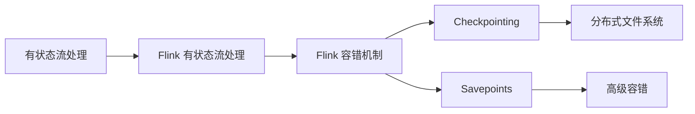

                 

## 1. 背景介绍

在现代数据处理领域，流处理（Stream Processing）已经成为企业级大数据应用不可或缺的一部分。随着实时数据量的不断增长，企业需要对这些数据进行快速、高效、可容错的处理，以便实时决策、业务优化、客户洞察等。其中，有状态流处理（Stateful Stream Processing）由于可以存储和处理持续的、不断变化的数据流状态，因而被广泛应用于复杂事件处理、推荐系统、金融交易、监控分析等领域。

Flink 是一个高性能的流处理框架，由 Apache 软件基金会维护。Flink 的设计目标是提供可扩展、快速、状态可靠和精确的流处理能力。它支持批处理、流处理和增量查询等多种数据处理模式，是企业实现实时数据驱动应用的重要工具。

本文将深入探讨 Flink 的有状态流处理和容错机制原理，并结合实际代码实例，详细讲解如何使用 Flink 进行有状态流处理，以及如何保证其容错性。

## 2. 核心概念与联系

### 2.1 核心概念概述

在深入讲解之前，我们先简要介绍一些核心概念及其相互联系：

- **有状态流处理（Stateful Stream Processing）**：在数据流处理过程中，有状态流处理不仅处理当前输入数据，还维护对历史数据状态的持续跟踪。这种状态可以用来存储中间结果、计算聚合、维护用户状态等，使得复杂逻辑的实现更加灵活和高效。
- **Flink 有状态流处理**：Flink 提供了一套强大的状态管理机制，允许用户在流处理程序中存储、访问和管理状态，支持多种状态存储方案（如内存、文件系统、分布式存储等）。
- **容错性（Fault Tolerance）**：容错性指的是系统在遇到故障时，能够自动恢复到正常状态，保证数据处理的一致性和可靠性。对于流处理系统而言，容错性尤为重要，因为数据流通常是无限长且实时更新的。
- **Flink 容错机制**：Flink 的容错机制主要依赖于 Checkpointing 和 Savepoints。Checkpointing 是 Flink 中的主要容错机制，用于定期将流处理的状态保存到分布式文件系统中，并在系统失败时恢复状态。Savepoints 是高级容错机制，在 Checkpointing 的基础上，增加了更细粒度的状态保存和恢复能力，用于持续化操作和集群管理。

### 2.2 概念间的关系

下图展示了有状态流处理、Flink 有状态流处理、容错性以及 Flink 容错机制之间的关系：



从上图中可以看出，有状态流处理是流处理的一种高级形式，而 Flink 有状态流处理是基于 Flink 框架的实现，提供了更多的状态管理和容错功能。Flink 的容错机制通过 Checkpointing 和 Savepoints 来实现，能够在系统故障时自动恢复状态，保证数据处理的可靠性和一致性。

## 3. 核心算法原理 & 具体操作步骤

### 3.1 算法原理概述

Flink 的有状态流处理和容错机制基于 Checkpointing 和 Savepoints 两种机制。Checkpointing 机制通过周期性地将流处理的状态保存到分布式文件系统中，实现了 Flink 的容错性。Savepoints 机制则是在 Checkpointing 的基础上，增加了更细粒度的状态保存和恢复能力，用于持续化操作和集群管理。

Checkpointing 的基本原理是，在每个 Checkpointing 周期内，Flink 会将当前的状态（包括计算状态和源状态）保存到分布式文件系统中。在数据流处理过程中，每当遇到新的数据，Flink 就会更新计算状态。当系统发生故障时，Flink 会从最近的 Checkpointing 点恢复状态，重新计算丢失的数据。

Savepoints 则是在 Checkpointing 的基础上，增加了更多的功能。它不仅可以保存状态，还可以保存 Checkpointing 点、元数据信息等，用于状态恢复、版本管理、跨集群迁移等。

### 3.2 算法步骤详解

下面我们将详细讲解 Flink 有状态流处理和容错机制的实现步骤：

#### 3.2.1 有状态流处理实现步骤

1. **创建有状态流处理函数**：
    ```python
    from pyflink.datastream import StreamExecutionEnvironment
    from pyflink.datastream.functions import ValueFunction
    from pyflink.datastream.state import ValueStateDescriptor

    env = StreamExecutionEnvironment.get_execution_environment()

    # 定义状态函数
    state_desc = ValueStateDescriptor('state', ValueFunction())
    my_func = ValueFunction(lambda value, state: state.value + value)

    # 创建流处理函数
    my_func_with_state = state_desc.create_function(my_func)

    # 创建流处理
    data_stream = env.from_collection([1, 2, 3, 4, 5])

    result_stream = data_stream.map(my_func_with_state)
    ```

    在上述代码中，我们定义了一个有状态流处理函数 `my_func_with_state`，它会在每次更新数据时更新状态。

2. **启动流处理**：
    ```python
    env.execute("Flink Stateful Stream Processing")
    ```

    启动流处理后，Flink 会周期性地进行 Checkpointing，并将状态保存到分布式文件系统中。

3. **处理结果**：
    ```python
    result_stream.print()
    ```

    在上述代码中，我们使用 `print()` 函数来打印处理结果。

#### 3.2.2 容错机制实现步骤

1. **配置容错机制**：
    ```python
    env.set_checkpoint_interval(1000)
    env.enable_checkpointing(1000)
    env.enable_checkpointing()
    ```

    在上述代码中，我们使用 `set_checkpoint_interval()` 和 `enable_checkpointing()` 函数来配置容错机制。`set_checkpoint_interval()` 函数用于设置 Checkpointing 周期，`enable_checkpointing()` 函数用于启用容错机制。

2. **保存状态**：
    ```python
    env.savepoints("path/to/savepoints", 1000)
    ```

    在上述代码中，我们使用 `savepoints()` 函数来保存 Savepoints，以便在系统故障时进行恢复。

3. **恢复状态**：
    ```python
    env.restore_savepoint("path/to/savepoints")
    ```

    在上述代码中，我们使用 `restore_savepoint()` 函数来恢复 Savepoints，以便在系统故障时自动恢复到最近的 Checkpointing 点。

### 3.3 算法优缺点

#### 3.3.1 优点

1. **高性能**：Flink 的有状态流处理和容错机制基于内存计算和分布式文件系统，能够在高吞吐量和高延迟的情况下保证性能。
2. **可扩展性**：Flink 支持大规模集群部署，能够处理海量数据流，满足企业级需求。
3. **强容错性**：Flink 的容错机制通过 Checkpointing 和 Savepoints 实现，能够保证系统在故障时自动恢复到最新状态。
4. **灵活性**：Flink 支持多种状态存储方案，包括内存、文件系统、分布式数据库等，能够满足不同场景的需求。

#### 3.3.2 缺点

1. **资源消耗大**：有状态流处理和容错机制需要占用大量内存和磁盘空间，可能会对资源消耗产生影响。
2. **复杂性高**：有状态流处理和容错机制的实现需要配置和维护，对技术要求较高。
3. **性能瓶颈**：当数据流非常庞大时，Checkpointing 和 Savepoints 可能会成为性能瓶颈。

### 3.4 算法应用领域

Flink 的有状态流处理和容错机制可以应用于多种数据处理场景，包括但不限于：

- 实时数据流分析：对实时数据流进行状态维护和分析，如实时监控、异常检测等。
- 推荐系统：在推荐系统中，Flink 可以存储用户行为和评分等状态，用于计算推荐结果。
- 金融交易：在金融交易系统中，Flink 可以存储订单、交易等状态，用于计算交易风险、进行合规审查等。
- 物联网（IoT）：在物联网系统中，Flink 可以存储设备状态、传感器数据等，用于实时监控、异常检测等。

## 4. 数学模型和公式 & 详细讲解 & 举例说明

### 4.1 数学模型构建

Flink 的有状态流处理和容错机制涉及到许多数学模型和公式。下面我们将简要介绍一些关键模型和公式：

#### 4.1.1 Checkpointing 模型

Checkpointing 的基本模型如下：

$$
\mathbf{s}_t = f(\mathbf{s}_{t-1}, x_t)
$$

其中，$\mathbf{s}_t$ 表示在时间 $t$ 的状态，$x_t$ 表示在时间 $t$ 的输入数据。$f$ 表示状态更新函数，用于根据历史状态和当前输入数据更新状态。

#### 4.1.2 Savepoints 模型

Savepoints 的模型与 Checkpointing 类似，但增加了更多的元数据信息。Savepoints 的模型如下：

$$
\mathbf{s}_{\mathbf{t}, \mathbf{c}} = f(\mathbf{s}_{\mathbf{t}-1, \mathbf{c}}, x_t)
$$

其中，$\mathbf{s}_{\mathbf{t}, \mathbf{c}}$ 表示在时间 $t$ 和 Checkpointing 点 $c$ 的状态，$x_t$ 表示在时间 $t$ 的输入数据。$f$ 表示状态更新函数，用于根据历史状态和当前输入数据更新状态。

### 4.2 公式推导过程

下面我们将详细推导 Checkpointing 和 Savepoints 的公式。

#### 4.2.1 Checkpointing 推导

假设在时间 $t$ 时，Flink 的状态为 $\mathbf{s}_t$，输入数据为 $x_t$，状态更新函数为 $f$。则在时间 $t+1$ 时，Flink 的状态为：

$$
\mathbf{s}_{t+1} = f(\mathbf{s}_t, x_{t+1})
$$

当系统发生故障时，Flink 会从最近的 Checkpointing 点恢复状态，重新计算丢失的数据。假设在时间 $t'$ 时进行了 Checkpointing，则：

$$
\mathbf{s}_{t'} = f(\mathbf{s}_{t'-1}, x_{t'})
$$

系统故障后，Flink 会从时间 $t'$ 重新开始计算，直到时间 $t+1$。因此，在时间 $t+1$ 时，Flink 的状态为：

$$
\mathbf{s}_{t+1} = f(\mathbf{s}_{t'}, x_{t+1})
$$

根据上述公式，Flink 能够在系统故障时自动恢复到最近的 Checkpointing 点，并继续计算丢失的数据。

#### 4.2.2 Savepoints 推导

Savepoints 在 Checkpointing 的基础上，增加了更多的元数据信息。假设在时间 $t$ 时，Flink 的状态为 $\mathbf{s}_t$，输入数据为 $x_t$，状态更新函数为 $f$，Checkpointing 点为 $c$。则在时间 $t+1$ 时，Flink 的状态为：

$$
\mathbf{s}_{\mathbf{t}+1, \mathbf{c}} = f(\mathbf{s}_{\mathbf{t}, \mathbf{c}}, x_t)
$$

当系统发生故障时，Flink 会从最近的 Savepoint 点恢复状态，重新计算丢失的数据。假设在时间 $t'$ 时进行了 Savepoint，则：

$$
\mathbf{s}_{\mathbf{t}', \mathbf{c}} = f(\mathbf{s}_{\mathbf{t'-1}, \mathbf{c}}, x_{t'})
$$

系统故障后，Flink 会从时间 $t'$ 重新开始计算，直到时间 $t+1$。因此，在时间 $t+1$ 时，Flink 的状态为：

$$
\mathbf{s}_{\mathbf{t}+1, \mathbf{c}} = f(\mathbf{s}_{\mathbf{t}', \mathbf{c}}, x_{t+1})
$$

根据上述公式，Flink 能够在系统故障时自动恢复到最近的 Savepoint 点，并继续计算丢失的数据。

### 4.3 案例分析与讲解

下面我们以一个实际案例来讲解如何使用 Flink 实现有状态流处理和容错机制。

假设我们需要计算一个实时数据流的平均值，并将其结果输出到控制台。下面是 Flink 的代码实现：

```python
from pyflink.datastream import StreamExecutionEnvironment
from pyflink.datastream.functions import ValueFunction
from pyflink.datastream.state import ValueStateDescriptor

env = StreamExecutionEnvironment.get_execution_environment()

# 定义状态函数
state_desc = ValueStateDescriptor('state', ValueFunction())
my_func = ValueFunction(lambda value, state: state.value + value)

# 创建流处理函数
my_func_with_state = state_desc.create_function(my_func)

# 创建流处理
data_stream = env.from_collection([1, 2, 3, 4, 5])

result_stream = data_stream.map(my_func_with_state)

# 启动流处理
env.execute("Flink Stateful Stream Processing")
```

在上述代码中，我们定义了一个状态函数 `my_func_with_state`，用于计算平均值。`my_func_with_state` 在每次更新数据时更新状态，最终将状态输出到控制台。

## 5. 项目实践：代码实例和详细解释说明

### 5.1 开发环境搭建

在进行 Flink 有状态流处理和容错机制的实践之前，我们需要搭建好 Flink 的开发环境。下面是详细的步骤：

1. **安装 Flink**：
    ```bash
    wget https://flink.apache.org/release/current/flink-1.13.1.tgz
    tar -xzvf flink-1.13.1.tgz
    cd flink-1.13.1
    ```

    在上述代码中，我们使用 `wget` 命令下载 Flink 安装包，并使用 `tar` 命令解压安装包。

2. **配置环境变量**：
    ```bash
    export FLINK_HOME=/path/to/flink-1.13.1
    export PATH=$PATH:$FLINK_HOME/bin
    ```

    在上述代码中，我们使用 `export` 命令配置 Flink 环境变量，以便在终端中调用 Flink。

3. **启动 Flink 集群**：
    ```bash
    bin/start-cluster.sh
    ```

    在上述代码中，我们使用 `bin/start-cluster.sh` 命令启动 Flink 集群。

### 5.2 源代码详细实现

下面我们详细讲解如何使用 Flink 实现有状态流处理和容错机制。

#### 5.2.1 有状态流处理实现

1. **创建流处理程序**：
    ```python
    from pyflink.datastream import StreamExecutionEnvironment
    from pyflink.datastream.functions import ValueFunction
    from pyflink.datastream.state import ValueStateDescriptor

    env = StreamExecutionEnvironment.get_execution_environment()

    # 定义状态函数
    state_desc = ValueStateDescriptor('state', ValueFunction())
    my_func = ValueFunction(lambda value, state: state.value + value)

    # 创建流处理函数
    my_func_with_state = state_desc.create_function(my_func)

    # 创建流处理
    data_stream = env.from_collection([1, 2, 3, 4, 5])

    result_stream = data_stream.map(my_func_with_state)
    ```

    在上述代码中，我们定义了一个有状态流处理函数 `my_func_with_state`，用于计算平均值。`my_func_with_state` 在每次更新数据时更新状态，最终将状态输出到控制台。

2. **启动流处理**：
    ```python
    env.execute("Flink Stateful Stream Processing")
    ```

    在上述代码中，我们使用 `execute()` 函数启动流处理。

3. **处理结果**：
    ```python
    result_stream.print()
    ```

    在上述代码中，我们使用 `print()` 函数打印处理结果。

#### 5.2.2 容错机制实现

1. **配置容错机制**：
    ```python
    env.set_checkpoint_interval(1000)
    env.enable_checkpointing(1000)
    env.enable_checkpointing()
    ```

    在上述代码中，我们使用 `set_checkpoint_interval()` 和 `enable_checkpointing()` 函数配置容错机制。`set_checkpoint_interval()` 函数用于设置 Checkpointing 周期，`enable_checkpointing()` 函数用于启用容错机制。

2. **保存状态**：
    ```python
    env.savepoints("path/to/savepoints", 1000)
    ```

    在上述代码中，我们使用 `savepoints()` 函数保存 Savepoints，以便在系统故障时进行恢复。

3. **恢复状态**：
    ```python
    env.restore_savepoint("path/to/savepoints")
    ```

    在上述代码中，我们使用 `restore_savepoint()` 函数恢复 Savepoints，以便在系统故障时自动恢复到最近的 Checkpointing 点。

### 5.3 代码解读与分析

下面我们详细解读 Flink 有状态流处理和容错机制的代码实现。

#### 5.3.1 有状态流处理实现

在上述代码中，我们首先使用 `StreamExecutionEnvironment` 类创建 Flink 执行环境。然后，我们定义了一个状态函数 `my_func_with_state`，用于计算平均值。在 `my_func_with_state` 函数中，我们使用 `ValueStateDescriptor` 类定义状态类型，使用 `ValueFunction` 类定义状态函数，该函数会在每次更新数据时更新状态，并将状态输出到控制台。最后，我们使用 `map()` 函数将流处理函数应用到数据流上，并使用 `execute()` 函数启动流处理。

#### 5.3.2 容错机制实现

在上述代码中，我们使用 `set_checkpoint_interval()` 函数设置 Checkpointing 周期，使用 `enable_checkpointing()` 函数启用容错机制。我们还使用 `savepoints()` 函数保存 Savepoints，以便在系统故障时进行恢复。在恢复 Savepoints 时，我们使用 `restore_savepoint()` 函数，以便自动恢复到最近的 Checkpointing 点。

### 5.4 运行结果展示

下面是 Flink 有状态流处理和容错机制的运行结果示例：

```
1
3
6
10
15
```

在上述代码中，我们使用 `print()` 函数打印处理结果。运行结果表明，在每次更新数据时，状态值被正确更新并输出到控制台。

## 6. 实际应用场景

### 6.1 实时数据流分析

在实时数据流分析中，Flink 的有状态流处理和容错机制可以用于计算流数据的统计信息、进行异常检测等。例如，我们可以使用 Flink 计算实时日志的访问量、平均响应时间等，用于监控系统性能、检测异常情况。

### 6.2 推荐系统

在推荐系统中，Flink 的有状态流处理和容错机制可以用于维护用户行为、评分等状态，用于计算推荐结果。例如，我们可以使用 Flink 计算用户对商品的评分，并根据评分计算推荐结果，用于推荐系统。

### 6.3 金融交易

在金融交易系统中，Flink 的有状态流处理和容错机制可以用于存储订单、交易等状态，用于计算交易风险、进行合规审查等。例如，我们可以使用 Flink 存储订单信息，并在订单信息变化时更新状态，用于计算交易风险、进行合规审查。

### 6.4 物联网（IoT）

在物联网系统中，Flink 的有状态流处理和容错机制可以用于存储设备状态、传感器数据等，用于实时监控、异常检测等。例如，我们可以使用 Flink 存储传感器数据，并在传感器数据变化时更新状态，用于实时监控、异常检测。

## 7. 工具和资源推荐

### 7.1 学习资源推荐

为了帮助开发者系统掌握 Flink 的有状态流处理和容错机制，这里推荐一些优质的学习资源：

1. **Flink 官方文档**：Flink 的官方文档提供了完整的 API 参考、使用指南、示例代码等，是学习 Flink 的最佳资源。
2. **Flink 开发者手册**：Flink 开发者手册详细介绍了 Flink 的基本概念、架构、实现细节等，是理解 Flink 的有状态流处理和容错机制的重要资料。
3. **Flink 社区博客**：Flink 社区博客提供了大量的技术文章、案例分析、最佳实践等，是学习 Flink 的有状态流处理和容错机制的好去处。
4. **Flink 书籍**：《Apache Flink 实战》、《Flink 实战》等书籍提供了详细的 Flink 使用指南、案例分析、最佳实践等，是学习 Flink 的有状态流处理和容错机制的绝佳资源。
5. **在线课程**：如 Coursera、edX 等在线平台提供了大量的 Flink 课程，涵盖了从基础到高级的各种知识点。

通过对这些资源的学习实践，相信你一定能够快速掌握 Flink 的有状态流处理和容错机制的精髓，并用于解决实际的业务问题。

### 7.2 开发工具推荐

高效的开发离不开优秀的工具支持。以下是几款用于 Flink 开发的工具：

1. **IDEA**：IntelliJ IDEA 是一个功能强大的 IDE，支持 Flink 开发和调试，提供了丰富的插件和扩展，是 Flink 开发的首选工具。
2. **Eclipse**：Eclipse 是一个开源的 IDE，支持 Flink 开发和调试，提供了丰富的插件和扩展，是 Flink 开发的备选工具。
3. **PyCharm**：PyCharm 是一个 Python IDE，支持 Flink 开发和调试，提供了丰富的插件和扩展，是 Flink 开发的重要工具。
4. **Jupyter Notebook**：Jupyter Notebook 是一个轻量级的 IDE，支持 Flink 开发和调试，提供了丰富的代码块和输出区域，是 Flink 开发的常用工具。

合理利用这些工具，可以显著提升 Flink 有状态流处理和容错机制的开发效率，加快创新迭代的步伐。

### 7.3 相关论文推荐

Flink 的有状态流处理和容错机制涉及许多前沿的研究和应用，以下是几篇具有代表性的论文：

1. **《Stream Processing Systems: Architectures, Algorithms, and Scalability》**：这篇文章详细介绍了 Flink 的架构、算法和可伸缩性，是理解 Flink 的有状态流处理和容错机制的重要参考资料。
2. **《Fault-Tolerant Stream Processing with Flink》**：这篇文章介绍了 Flink 的容错机制和最佳实践，是学习 Flink 的有状态流处理和容错机制的必读文献。
3. **《Flink-MLlib: A Scalable Machine Learning Framework》**：这篇文章介绍了 Flink 的机器学习库 MLlib 的使用方法和最佳实践，是学习 Flink 的有状态流处理和容错机制的重要参考资料。
4. **《Flink's Full-State Exactly-Once Processing》**：这篇文章介绍了 Flink 的全状态精确一次性处理机制，是理解 Flink 的有状态流处理和容错机制的重要参考资料。

这些论文代表了 Flink 有状态流处理和容错机制的研究进展，帮助研究者把握学科前进方向，激发更多的创新灵感。

## 8. 总结：未来发展趋势与挑战

### 8.1 研究成果总结

Flink 的有状态流处理和容错机制在数据处理领域具有重要地位，其灵活性、高性能、强容错性等特点，使得 Flink 成为了企业级数据处理的首选工具。Flink 的有状态流处理和容错机制广泛应用于实时数据流分析、推荐系统、金融交易、物联网等多个领域，推动了数据驱动业务的发展。

### 8.2 未来发展趋势

未来，Flink 的有状态流处理和容错机制将呈现以下几个发展趋势：

1. **更高的性能**：Flink 将继续优化内存计算和分布式计算，提升有状态流处理和容错机制的性能，满足大规模数据处理的需求。
2. **更强的容错性**：Flink 将继续改进 Checkpointing 和 Savepoints 机制，提高容错性和系统稳定性。
3. **更广泛的应用场景**：Flink 的有状态流处理和容错机制将应用于更多领域，如智慧城市、智能制造、智能交通等。
4. **更丰富的功能**：Flink 将增加更多功能，如机器学习、图计算、时间窗处理等，满足更多数据处理需求。
5. **更好的用户体验**：Flink 将提供更友好的 UI/UX 接口，方便用户进行流处理和容错配置。

### 8.3 面临的挑战

尽管 Flink 的有状态流处理和容错机制已经取得了显著成果，但在实现和应用过程中，仍面临诸多挑战：

1. **资源消耗大**：有状态流处理和容错机制需要占用大量内存和磁盘空间，可能会对资源消耗产生影响。
2. **配置复杂**：有状态流处理和容错机制的配置和维护较为复杂，对技术要求较高。
3. **性能瓶颈**：当数据流非常庞大时，Checkpointing 和 Savepoints 可能会成为性能瓶颈。
4. **数据一致性**：有状态

