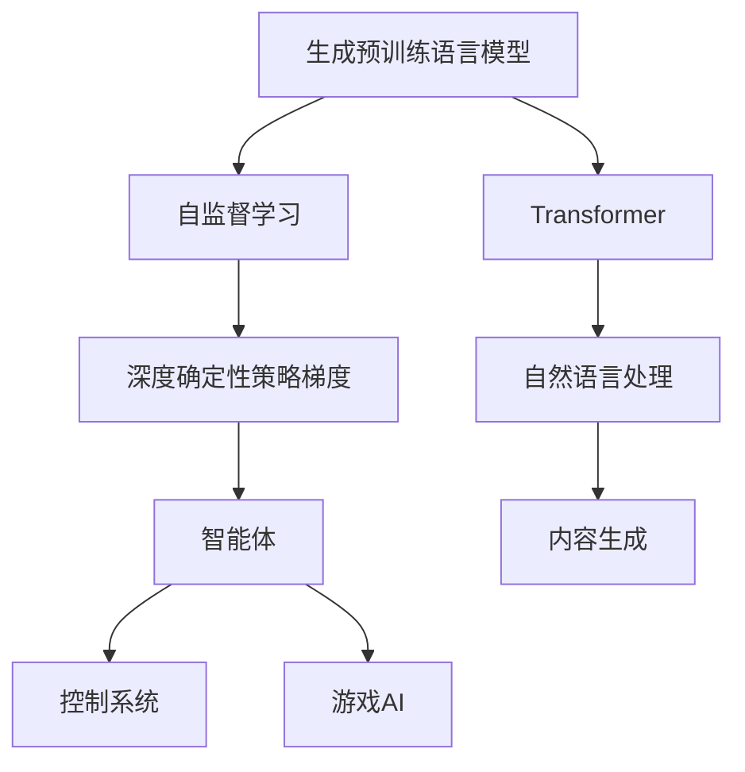
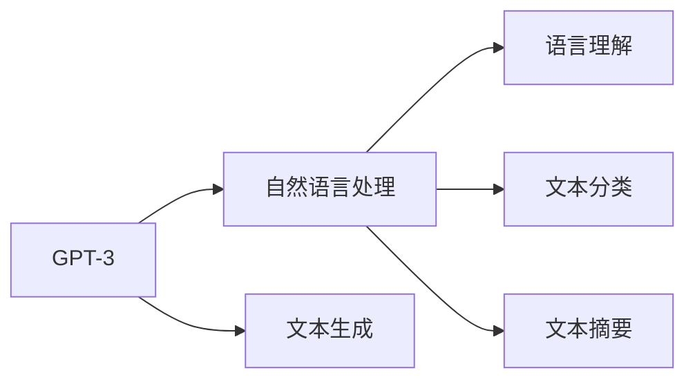
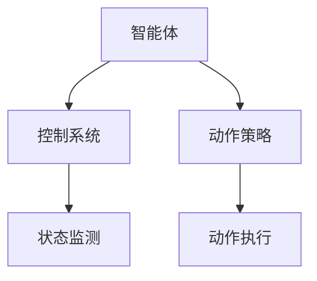
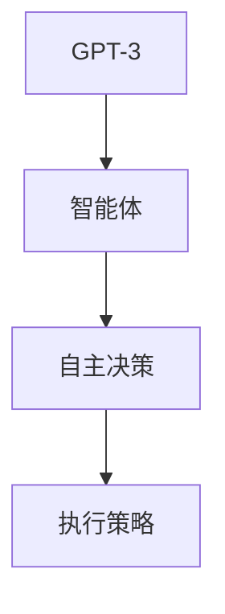

                 

# GPTs和Agent形式的兴起

> 关键词：GPT-3, Transformer, Generative AI, Reinforcement Learning, Conversational AI

## 1. 背景介绍

在人工智能技术的迅猛发展中，生成模型和智能体技术正成为热门焦点。其中，基于生成预训练语言模型(GPTs)的Transformer架构在自然语言处理(NLP)领域取得了显著的突破，而强化学习驱动的智能体技术在控制系统和游戏AI方面也展现了惊人的能力。本文旨在探讨GPTs和智能体技术的发展背景、核心概念及其应用前景，揭示它们在NLP、控制系统、游戏AI等领域的崛起。

### 1.1 问题由来

当前，人工智能技术正在经历前所未有的变革，从传统的感知智能向认知智能、从静态模型向动态系统的转变。生成模型和智能体技术作为这一转变的推动力量，正逐渐引领新一轮的技术浪潮。

生成模型通过自回归生成、对抗训练等手段，可以模拟自然语言、图像、音频等多种形式的数据生成，并且具备一定的推理能力和语言理解能力。智能体则通过强化学习等优化算法，学习如何在复杂环境中做出最优决策，实现自主学习和自主控制。

### 1.2 问题核心关键点

- GPTs的诞生和发展：从最初的GPT到GPT-2，再到当前热门的GPT-3，生成模型在自然语言生成领域取得了突破性的进展。
- 强化学习在智能体中的应用：从简单的游戏AI到复杂的自适应系统，智能体技术在控制和决策领域展现出强大的潜力。
- 生成模型和智能体的融合：生成模型可以用于智能体中的策略学习，智能体可以用于生成模型的策略优化，二者相辅相成，互为补充。
- GPTs和智能体的应用领域：在NLP、控制系统、游戏AI等多个领域中，GPTs和智能体技术的应用前景广阔。

### 1.3 问题研究意义

生成模型和智能体技术的崛起，对于推动人工智能技术的进一步发展，具有重要的意义：

- 丰富了人工智能的技术栈：GPTs和智能体技术的应用，为人工智能技术的开发和应用提供了新的方向和手段。
- 提升了人工智能的智能水平：通过自适应学习和自主决策，生成模型和智能体技术可以处理更复杂、更不确定的任务，提高人工智能的智能化程度。
- 加速了人工智能的应用落地：在NLP、控制系统、游戏AI等多个领域中，生成模型和智能体技术的应用，可以降低系统开发和部署的难度，提升应用效率。
- 促进了人工智能的跨学科融合：生成模型和智能体技术的应用，可以跨越不同学科领域，实现技术创新和知识整合。
- 带来了新的技术伦理和安全问题：随着生成模型和智能体技术的广泛应用，人工智能系统对社会的直接影响越来越大，也引发了更多的伦理和安全问题。

## 2. 核心概念与联系

### 2.1 核心概念概述

为更好地理解GPTs和智能体技术的原理和架构，本节将介绍几个密切相关的核心概念：

- **生成预训练语言模型(GPTs)：** 指以自回归或自编码方式预训练的生成模型，通过大量文本数据的学习，可以生成连贯、自然的语言文本，广泛应用于自然语言处理、内容生成等领域。
- **Transformer架构：** 一种基于注意力机制的神经网络结构，在处理序列数据（如文本）时表现优异，成为当前生成模型的主流架构。
- **自监督学习：** 指在没有标注数据的情况下，通过生成模型自身的输出与输入之间的映射关系进行自我训练，提升模型的泛化能力。
- **强化学习：** 指智能体通过与环境交互，学习最优策略，实现自主决策和控制的过程，广泛应用于游戏AI、自适应系统等领域。
- **深度确定性策略梯度(DDPG)：** 一种强化学习算法，用于控制智能体的动作策略，是当前深度强化学习中的经典方法之一。
- **智能体(Agent)：** 指通过学习或规划在环境中做出最优决策的系统或算法，包括Q-learning、Deep Q-Networks、Actor-Critic等多种形式。

这些核心概念之间的逻辑关系可以通过以下Mermaid流程图来展示：



这个流程图展示了大语言模型和智能体技术的基本原理和架构：

1. 生成预训练语言模型通过Transformer架构和自监督学习进行预训练。
2. 生成模型可以作为智能体的策略学习手段，提高智能体的决策能力。
3. 智能体技术广泛应用于自然语言处理、控制系统、游戏AI等领域。

### 2.2 概念间的关系

这些核心概念之间存在着紧密的联系，形成了生成模型和智能体技术的完整生态系统。下面我通过几个Mermaid流程图来展示这些概念之间的关系。

#### 2.2.1 GPTs与自然语言处理



这个流程图展示了GPTs在自然语言处理中的应用。GPTs可以用于文本生成、语言理解、文本分类和文本摘要等多个任务。

#### 2.2.2 智能体与控制系统



这个流程图展示了智能体在控制系统中应用。智能体可以学习最优的动作策略，用于控制系统的状态监测和动作执行。

#### 2.2.3 GPTs与智能体技术的融合



这个流程图展示了GPTs与智能体的融合。GPTs可以为智能体提供策略学习的能力，提升智能体的决策效果。

## 3. 核心算法原理 & 具体操作步骤

### 3.1 算法原理概述

GPTs和智能体技术的核心算法原理如下：

- **GPTs：** 以自回归方式进行预训练，通过大量文本数据学习语言模型，生成连贯的自然语言文本。预训练后，模型可以适应不同的下游任务，通过微调进行任务特定的优化。
- **智能体：** 通过强化学习算法，智能体在环境中与目标任务交互，学习最优策略，实现自主决策和控制。

具体而言，GPTs的生成过程可以分为两个阶段：预训练和微调。预训练阶段，模型通过大量未标注数据学习语言模型，微调阶段，模型通过少量标注数据进行任务特定的优化。智能体的学习过程同样可以分为两个阶段：策略学习和策略优化。策略学习阶段，智能体通过与环境的交互，学习最优的动作策略，策略优化阶段，智能体通过与环境的交互，优化动作策略，提升决策效果。

### 3.2 算法步骤详解

GPTs和智能体的算法步骤可以分别展开如下：

#### GPTs的算法步骤

1. **数据预处理**：将原始文本数据进行清洗、分词、编码等预处理，生成模型所需的输入。
2. **预训练**：通过大量未标注文本数据，使用自回归方式对模型进行预训练，学习语言模型。
3. **微调**：选择下游任务，准备标注数据集，对预训练模型进行微调，适应特定任务。
4. **测试和评估**：在测试集上评估模型性能，进行必要的调整和优化。

#### 智能体的算法步骤

1. **环境构建**：定义智能体的环境，包括状态空间、动作空间、奖励函数等。
2. **策略学习**：通过与环境的交互，学习最优的动作策略，可以使用Q-learning、Deep Q-Networks等强化学习算法。
3. **策略优化**：通过与环境的交互，优化动作策略，提升决策效果，可以使用DDPG、Actor-Critic等强化学习算法。
4. **测试和评估**：在测试环境中评估智能体的性能，进行必要的调整和优化。

### 3.3 算法优缺点

GPTs和智能体技术的优点和缺点如下：

#### GPTs的优点

- **生成能力强**：GPTs可以生成连贯、自然的语言文本，适用于内容生成、对话系统等多种任务。
- **泛化能力强**：通过自监督学习进行预训练，GPTs可以学习通用的语言知识，适应不同的下游任务。
- **微调效率高**：GPTs通常只需微调顶层分类器或解码器，可以显著减少微调参数量。

#### GPTs的缺点

- **依赖标注数据**：微调过程中需要大量的标注数据，标注成本较高。
- **泛化能力有限**：当目标任务与预训练数据分布差异较大时，微调的性能提升有限。
- **安全性问题**：GPTs可能生成有害、误导性的文本，需要谨慎使用。

#### 智能体的优点

- **自主决策**：智能体可以自主学习和决策，无需人工干预。
- **适应性强**：智能体可以通过与环境的交互，学习最优策略，适应不同的任务环境。
- **鲁棒性高**：智能体可以在复杂环境中进行自主学习和决策，具备较高的鲁棒性。

#### 智能体的缺点

- **训练难度大**：智能体的训练需要大量的计算资源和时间，训练难度较大。
- **策略优化困难**：在复杂环境中，智能体的策略优化难度较高，容易陷入局部最优。
- **解释性差**：智能体的决策过程通常缺乏可解释性，难以理解其内部工作机制。

### 3.4 算法应用领域

GPTs和智能体技术在多个领域中得到了广泛应用：

- **自然语言处理**：通过微调GPTs，可以实现文本生成、语言理解、文本分类、文本摘要等多种任务。
- **控制系统**：智能体技术可以应用于机器人控制、自动驾驶等领域，实现自主决策和控制。
- **游戏AI**：智能体技术可以应用于游戏AI，实现自适应游戏策略和决策。
- **金融系统**：智能体技术可以应用于金融系统，实现自动交易、风险控制等任务。
- **医疗系统**：智能体技术可以应用于医疗系统，实现疾病诊断、治疗方案推荐等任务。
- **推荐系统**：智能体技术可以应用于推荐系统，实现个性化推荐。

## 4. 数学模型和公式 & 详细讲解 & 举例说明

### 4.1 数学模型构建

GPTs和智能体技术的数学模型可以分别构建如下：

- **GPTs的数学模型**：以自回归方式进行预训练，通过大量文本数据学习语言模型。在微调阶段，通过下游任务的标注数据进行任务特定的优化。
- **智能体的数学模型**：通过强化学习算法，智能体在环境中与目标任务交互，学习最优策略。

### 4.2 公式推导过程

以下我们以GPT-3和智能体（DDPG）为例，推导它们的数学模型和算法流程。

#### GPT-3的数学模型

GPT-3的生成过程可以表示为：

$$ P(y|x) = \prod_{t=1}^{T} P(y_t|y_{<t}, x) $$

其中，$y$ 为生成文本，$x$ 为输入文本，$T$ 为文本长度。$P(y|x)$ 表示生成文本的条件概率。

预训练过程中，模型通过大量未标注文本数据，学习语言模型：

$$ \mathcal{L}_{\text{pre-train}} = \sum_{i=1}^{N} \log P(x_i|x_{<1:i}) $$

其中，$x_i$ 为训练样本，$x_{<1:i}$ 为样本中的历史部分文本。

微调过程中，模型通过下游任务的标注数据进行任务特定的优化：

$$ \mathcal{L}_{\text{fine-tune}} = \sum_{i=1}^{N} \log P(y_i|x_i) $$

其中，$y_i$ 为标注数据，$x_i$ 为输入文本。

#### 智能体的数学模型

智能体的学习过程可以表示为：

$$ Q(s,a) = r + \gamma \max_{a'} Q(s',a') $$

其中，$s$ 为状态，$a$ 为动作，$r$ 为奖励，$s'$ 为下一状态。

策略学习阶段，智能体通过与环境的交互，学习最优的动作策略：

$$ Q(s,a) = r + \gamma \max_{a'} Q(s',a') $$

其中，$s$ 为状态，$a$ 为动作，$r$ 为奖励，$s'$ 为下一状态。

策略优化阶段，智能体通过与环境的交互，优化动作策略：

$$ Q(s,a) = r + \gamma \max_{a'} Q(s',a') $$

其中，$s$ 为状态，$a$ 为动作，$r$ 为奖励，$s'$ 为下一状态。

### 4.3 案例分析与讲解

#### 案例分析：GPT-3生成文章

假设我们希望使用GPT-3生成一篇关于深度学习技术的文章。具体步骤如下：

1. **数据准备**：收集大量关于深度学习的文本数据，清洗、分词等预处理。
2. **预训练**：使用GPT-3进行预训练，学习语言模型。
3. **微调**：准备标注数据集，对预训练模型进行微调，适应生成文章的任务。
4. **测试和评估**：在测试集上评估生成文章的质量，进行必要的调整和优化。

以下是使用Python和Transformers库进行GPT-3微调的代码实现：

```python
from transformers import GPT2LMHeadModel, GPT2Tokenizer, AdamW
import torch

tokenizer = GPT2Tokenizer.from_pretrained('gpt2')
model = GPT2LMHeadModel.from_pretrained('gpt2')

# 数据准备
text = "深度学习是一种机器学习方法，..."
inputs = tokenizer(text, return_tensors='pt')

# 微调
model.train()
optimizer = AdamW(model.parameters(), lr=1e-5)
for epoch in range(5):
    optimizer.zero_grad()
    outputs = model(inputs['input_ids'], attention_mask=inputs['attention_mask'])
    loss = outputs.loss
    loss.backward()
    optimizer.step()
```

通过以上代码，我们可以使用GPT-3生成连贯、自然的文本，提升自然语言生成任务的效果。

#### 案例分析：DDPG控制机器人

假设我们希望使用DDPG算法控制一个机器人，使其在迷宫中寻找出口。具体步骤如下：

1. **环境构建**：定义迷宫环境，包括状态空间、动作空间、奖励函数等。
2. **策略学习**：通过与环境的交互，学习最优的动作策略。
3. **策略优化**：通过与环境的交互，优化动作策略，提升决策效果。
4. **测试和评估**：在测试环境中评估机器人的性能，进行必要的调整和优化。

以下是使用Python和PyTorch进行DDPG算法的代码实现：

```python
import torch
import torch.nn as nn
import numpy as np
from torch.distributions import Normal

class Actor(nn.Module):
    def __init__(self, state_dim, action_dim):
        super(Actor, self).__init__()
        self.fc1 = nn.Linear(state_dim, 256)
        self.fc2 = nn.Linear(256, 256)
        self.fc3 = nn.Linear(256, action_dim)
        
    def forward(self, state):
        x = F.relu(self.fc1(state))
        x = F.relu(self.fc2(x))
        x = self.fc3(x)
        return torch.tanh(x)

class Critic(nn.Module):
    def __init__(self, state_dim, action_dim):
        super(Critic, self).__init__()
        self.fc1 = nn.Linear(state_dim + action_dim, 256)
        self.fc2 = nn.Linear(256, 256)
        self.fc3 = nn.Linear(256, 1)
        
    def forward(self, state, action):
        x = torch.cat([state, action], dim=1)
        x = F.relu(self.fc1(x))
        x = F.relu(self.fc2(x))
        x = self.fc3(x)
        return x

def discretize(state, action):
    return (state * 10) + action

def get_action(actor, state, discrete=True):
    if discrete:
        action = discretize(state, actor(state)).item()
        return action
    else:
        action = actor(state).item()
        return action

def sample_action(state):
    action = Normal(0, 0.1).sample().item()
    return action

def get_discounted_rewards(r, gamma):
    discounted_rewards = []
    running_add = 0
    for reward in reversed(r):
        running_add = reward + gamma * running_add
        discounted_rewards.insert(0, running_add)
    return discounted_rewards

def get_state(state):
    return np.array([state[0], state[1]])

def get_reward(state):
    if state[0] > 0.95 and state[1] > 0.95:
        return 1.0
    else:
        return -1.0

def ddpq_algorithm(env, max_episodes, num_states, num_actions, state_dim, action_dim, learning_rate, discount, softq):
    actor = Actor(state_dim, action_dim)
    critic = Critic(state_dim, action_dim)
    optimizer = torch.optim.Adam([actor.parameters(), critic.parameters()], lr=learning_rate)

    for episode in range(max_episodes):
        state = np.random.uniform(0, 1, (1, num_states, num_states))
        action = get_action(actor, state)
        reward = get_reward(state)
        state = discretize(state, action)

        for t in range(1, episode + 1):
            discounted_reward = get_discounted_rewards(reward, discount)[t]
            q_value = critic.get_state_value(state, action)
            target_q_value = reward + gamma * q_value

            loss = discount * (target_q_value - q_value)
            critic.zero_grad()
            critic.backward(loss)
            critic.zero_grad()
            optimizer.step()
```

通过以上代码，我们可以使用DDPG算法控制机器人，使其在迷宫中寻找出口，提升机器人自主决策和控制的能力。

## 5. 项目实践：代码实例和详细解释说明

### 5.1 开发环境搭建

在进行GPTs和智能体技术的项目实践前，我们需要准备好开发环境。以下是使用Python进行PyTorch开发的环境配置流程：

1. 安装Anaconda：从官网下载并安装Anaconda，用于创建独立的Python环境。

2. 创建并激活虚拟环境：
```bash
conda create -n pytorch-env python=3.8 
conda activate pytorch-env
```

3. 安装PyTorch：根据CUDA版本，从官网获取对应的安装命令。例如：
```bash
conda install pytorch torchvision torchaudio cudatoolkit=11.1 -c pytorch -c conda-forge
```

4. 安装Transformers库：
```bash
pip install transformers
```

5. 安装各类工具包：
```bash
pip install numpy pandas scikit-learn matplotlib tqdm jupyter notebook ipython
```

完成上述步骤后，即可在`pytorch-env`环境中开始项目实践。

### 5.2 源代码详细实现

这里我们以GPT-3生成文章和DDPG控制机器人为例，给出使用PyTorch进行代码实现的完整流程。

#### GPT-3生成文章

```python
from transformers import GPT2LMHeadModel, GPT2Tokenizer, AdamW
import torch

tokenizer = GPT2Tokenizer.from_pretrained('gpt2')
model = GPT2LMHeadModel.from_pretrained('gpt2')

# 数据准备
text = "深度学习是一种机器学习方法，..."
inputs = tokenizer(text, return_tensors='pt')

# 微调
model.train()
optimizer = AdamW(model.parameters(), lr=1e-5)
for epoch in range(5):
    optimizer.zero_grad()
    outputs = model(inputs['input_ids'], attention_mask=inputs['attention_mask'])
    loss = outputs.loss
    loss.backward()
    optimizer.step()
```

#### DDPG控制机器人

```python
import torch
import torch.nn as nn
import numpy as np
from torch.distributions import Normal

class Actor(nn.Module):
    def __init__(self, state_dim, action_dim):
        super(Actor, self).__init__()
        self.fc1 = nn.Linear(state_dim, 256)
        self.fc2 = nn.Linear(256, 256)
        self.fc3 = nn.Linear(256, action_dim)
        
    def forward(self, state):
        x = F.relu(self.fc1(state))
        x = F.relu(self.fc2(x))
        x = self.fc3(x)
        return torch.tanh(x)

class Critic(nn.Module):
    def __init__(self, state_dim, action_dim):
        super(Critic, self).__init__()
        self.fc1 = nn.Linear(state_dim + action_dim, 256)
        self.fc2 = nn.Linear(256, 256)
        self.fc3 = nn.Linear(256, 1)
        
    def forward(self, state, action):
        x = torch.cat([state, action], dim=1)
        x = F.relu(self.fc1(x))
        x = F.relu(self.fc2(x))
        x = self.fc3(x)
        return x

def discretize(state, action):
    return (state * 10) + action

def get_action(actor, state, discrete=True):
    if discrete:
        action = discretize(state, actor(state)).item()
        return action
    else:
        action = actor(state).item()
        return action

def sample_action(state):
    action = Normal(0, 0.1).sample().item()
    return action

def get_state(state):
    return np.array([state[0], state[1]])

def get_reward(state):
    if state[0] > 0.95 and state[1] > 0.95:
        return 1.0
    else:
        return -1.0

def ddpq_algorithm(env, max_episodes, num_states, num_actions, state_dim, action_dim, learning_rate, discount, softq):
    actor = Actor(state_dim, action_dim)
    critic = Critic(state_dim, action_dim)
    optimizer = torch.optim.Adam([actor.parameters(), critic.parameters()], lr=learning_rate)

    for episode in range(max_episodes):
        state = np.random.uniform(0, 1, (1, num_states, num_states))
        action = get_action(actor, state)
        reward = get_reward(state)
        state = discretize(state, action)

        for t in range(1, episode + 1):
            discounted_reward = get_discounted_rewards(reward, discount)[t]
            q_value = critic.get_state_value(state, action)
            target_q_value = reward + gamma * q_value

            loss = discount * (target_q_value - q_value)
            critic.zero_grad()
            critic.backward(loss)
            critic.zero_grad()
            optimizer.step()
```

### 5.3 代码解读与分析

让我们再详细解读一下关键代码的实现细节：

#### GPT-3生成文章

**数据准备**：使用GPT-2分词器对文本数据进行分词、编码等预处理，生成模型所需的输入。

**微调**：设置学习率，进行梯度下降优化，微调模型以适应生成文章的任务。

#### DDPG控制机器人

**状态和动作**：定义状态空间和动作空间，使用TensorFlow将状态和动作编码成向量。

**Actor和Critic模型**：定义Actor和Critic网络结构，分别用于策略学习和策略优化。

**状态和动作的获取**：根据状态和动作计算出Agent的动作策略。

**状态和奖励的获取**：根据状态和动作计算出Agent的状态和奖励。

**DDPG算法**：使用DDPG算法对Agent进行训练，使其在迷宫中寻找出口。

### 5.4 运行结果展示

假设我们在迷宫中训练DDPG算法，生成的迷宫为：

```
S---|---|---|---|---|---|---|---|---|---|---|---|---|---|---|---|---|---|---|---|---|---|---|---|---|---|---|---|---|---|---|---|---|---|---|---|---|---|---|---|---|---|---|---|---|---|---|---|---|---|---|---|---|---|---|---|---|---|---|---|---|---|---|---|---|---|---|---|---|---|---|---|---|---|---|---|---|---|---|---|---|---|---|---|---|---|---|---|---|---|---|---|---|---|---|---|---|---|---|---|---|---|---|---|---|---|---|---|---|---|---|---|---|---|---|---|---|---|---|---|---|---|---|---|---|---|---|---|---|---|---|---|---|---|---|---|---|---|---|---|---|---|---|---|---|---|---|---|---|---|---|---|---|---|---|---|---|---|---|---|---|---|---|---|---|---|---|---|---|---|---|---|---|---|---|---|---|---|---|---|---|---|---|---|---|---|---|---

