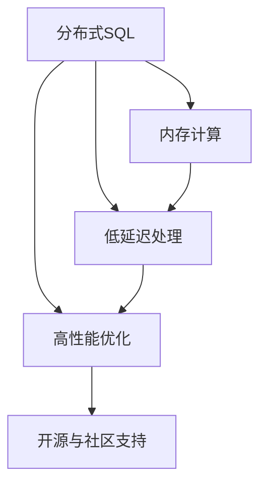
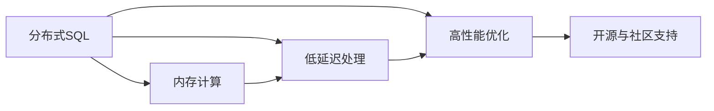
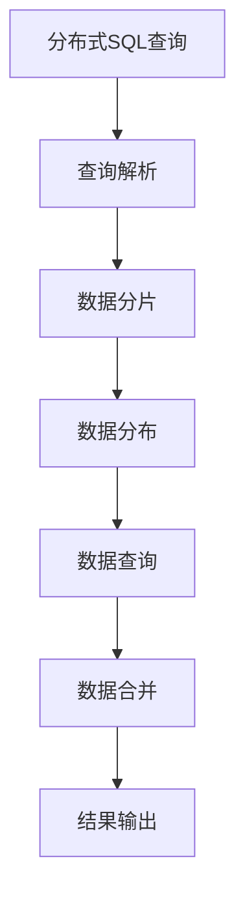
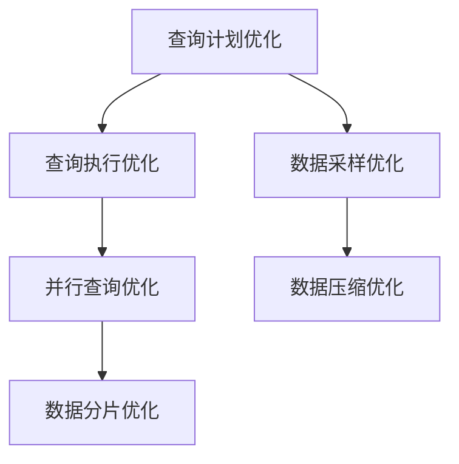
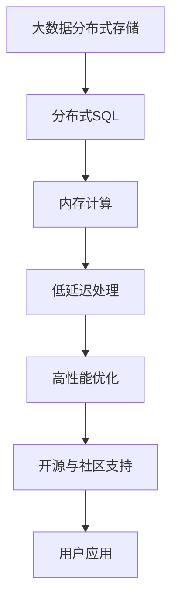

                 

## 1. 背景介绍

### 1.1 问题由来

Presto是一个开源的分布式SQL查询引擎，它由Facebook开发并贡献给了开源社区。Presto的目标是提供一种高效、可扩展的SQL查询解决方案，以支持大规模数据处理和分析任务。与传统的分布式数据库相比，Presto具有更低的延迟、更高的灵活性和更好的可扩展性，适用于实时数据处理和分析场景。

Presto的核心设计理念是允许用户直接连接多个数据源，并在此基础上进行复杂的数据分析和查询。它的设计理念和开源理念，使其在大数据和实时数据处理领域得到了广泛应用。

### 1.2 问题核心关键点

Presto的核心关键点包括以下几个方面：

- 分布式架构：Presto采用分布式架构，能够处理大规模数据集，支持跨数据源的查询。
- 内存计算：Presto使用内存计算，大幅提高查询性能和响应速度。
- 低延迟处理：Presto支持实时数据处理，能够在毫秒级别完成查询任务。
- 高性能优化：Presto使用各种高性能优化技术，如并行查询、数据分片等，提高查询效率。
- 开源与社区支持：Presto是完全开源的，社区活跃度高，用户可以在社区中找到丰富的资源和支持。

### 1.3 问题研究意义

研究Presto的原理与实现方法，对于理解分布式数据处理技术和实时数据处理技术具有重要意义。掌握Presto的核心技术，能够帮助开发者构建高性能、可扩展的分布式数据处理系统，广泛应用于数据仓库、实时数据分析、大数据处理等领域。

## 2. 核心概念与联系

### 2.1 核心概念概述

为了更好地理解Presto的原理与实现方法，本节将介绍几个关键的核心概念：

- 分布式SQL：Presto的核心技术之一，支持跨数据源的分布式SQL查询。
- 内存计算：Presto使用内存计算，大幅提高查询性能和响应速度。
- 低延迟处理：Presto支持实时数据处理，能够在毫秒级别完成查询任务。
- 高性能优化：Presto使用各种高性能优化技术，如并行查询、数据分片等，提高查询效率。
- 开源与社区支持：Presto是完全开源的，社区活跃度高，用户可以在社区中找到丰富的资源和支持。

这些核心概念之间的逻辑关系可以通过以下Mermaid流程图来展示：



这个流程图展示了Presto的核心概念及其之间的关系：

1. 分布式SQL：Presto的核心技术之一，支持跨数据源的查询。
2. 内存计算：Presto使用内存计算，大幅提高查询性能和响应速度。
3. 低延迟处理：Presto支持实时数据处理，能够在毫秒级别完成查询任务。
4. 高性能优化：Presto使用各种高性能优化技术，如并行查询、数据分片等，提高查询效率。
5. 开源与社区支持：Presto是完全开源的，社区活跃度高，用户可以在社区中找到丰富的资源和支持。

这些核心概念共同构成了Presto的技术框架，使其能够处理大规模数据集，支持实时数据处理，同时具有良好的可扩展性和性能优化能力。通过理解这些核心概念，我们可以更好地把握Presto的设计理念和实现细节。

### 2.2 概念间的关系

这些核心概念之间存在着紧密的联系，形成了Presto的技术生态系统。下面我通过几个Mermaid流程图来展示这些概念之间的关系。

#### 2.2.1 Presto的技术架构



这个流程图展示了Presto的技术架构，包括分布式SQL、内存计算、低延迟处理和高性能优化等关键技术。

#### 2.2.2 Presto的查询执行流程



这个流程图展示了Presto的查询执行流程，从分布式SQL查询开始，经过查询解析、数据分片、数据分布、数据查询、数据合并和结果输出等步骤，最终完成查询任务。

#### 2.2.3 Presto的高性能优化



这个流程图展示了Presto的高性能优化技术，包括查询计划优化、查询执行优化、并行查询优化、数据分片优化和数据采样优化等，提高了查询效率和响应速度。

### 2.3 核心概念的整体架构

最后，我们用一个综合的流程图来展示这些核心概念在大数据处理中的整体架构：



这个综合流程图展示了从大数据分布式存储到用户应用的全过程，包括分布式SQL、内存计算、低延迟处理、高性能优化和开源与社区支持等关键技术。通过这些技术，Presto能够处理大规模数据集，支持实时数据处理，同时具有良好的可扩展性和性能优化能力。

## 3. 核心算法原理 & 具体操作步骤

### 3.1 算法原理概述

Presto的查询处理主要依赖于分布式SQL和内存计算。其核心原理如下：

1. 分布式SQL：Presto允许用户直接连接多个数据源，并在此基础上进行复杂的数据分析和查询。Presto使用分布式SQL语法，将查询分解为多个逻辑和物理执行计划，并分配到多个节点上执行。

2. 内存计算：Presto使用内存计算，将查询数据加载到内存中进行处理，大幅提高查询性能和响应速度。Presto支持多种内存计算引擎，如Hadoop YARN、Spark等，根据数据源和查询需求选择合适的计算引擎。

3. 低延迟处理：Presto支持实时数据处理，能够在毫秒级别完成查询任务。Presto使用事件流和数据流的方式，将数据实时处理和查询任务进行解耦，提高处理效率和响应速度。

4. 高性能优化：Presto使用各种高性能优化技术，如并行查询、数据分片、数据采样、数据压缩等，提高查询效率和响应速度。

### 3.2 算法步骤详解

Presto的查询处理主要包括以下几个关键步骤：

1. 查询解析：将用户提交的SQL查询语句解析成逻辑执行计划，并进行语法和语义检查。Presto使用Analytical engine进行查询解析，支持多种语法和语义规则。

2. 查询优化：对逻辑执行计划进行优化，生成物理执行计划。Presto使用查询优化器进行查询优化，支持多种优化策略，如推导、分片、采样、压缩等。

3. 数据分布：将物理执行计划分解为多个任务，分配到多个节点上执行。Presto支持多种数据分布方式，如Hash分片、Range分片等。

4. 数据查询：在每个节点上执行查询任务，并进行数据处理和聚合。Presto使用多种内存计算引擎，如Hadoop YARN、Spark等，根据数据源和查询需求选择合适的计算引擎。

5. 数据合并：将多个节点的查询结果进行合并，并生成最终结果。Presto支持多种数据合并方式，如MapReduce、Spark等。

### 3.3 算法优缺点

Presto作为分布式SQL查询引擎，具有以下优点：

1. 高灵活性：Presto允许用户直接连接多个数据源，支持跨数据源的查询。

2. 高性能：Presto使用内存计算，大幅提高查询性能和响应速度。

3. 低延迟：Presto支持实时数据处理，能够在毫秒级别完成查询任务。

4. 高性能优化：Presto使用各种高性能优化技术，提高查询效率和响应速度。

5. 开源与社区支持：Presto是完全开源的，社区活跃度高，用户可以在社区中找到丰富的资源和支持。

同时，Presto也存在以下缺点：

1. 复杂性：Presto的分布式架构和内存计算技术，使其在实现上较为复杂。

2. 资源消耗：Presto使用内存计算，对内存和CPU资源的需求较高。

3. 可扩展性：Presto的可扩展性较好，但需要根据数据量和查询需求进行合理的资源配置。

4. 数据处理能力：Presto支持实时数据处理，但在大数据处理和复杂计算方面可能存在限制。

5. 社区支持：尽管Presto社区活跃度高，但对于一些特定场景和需求，可能需要自己进行二次开发。

### 3.4 算法应用领域

Presto在多个领域得到了广泛应用，例如：

1. 数据仓库：Presto支持跨数据源的查询，可以连接多种数据源进行数据仓库建设。

2. 实时数据处理：Presto支持实时数据处理，适用于实时数据流和事件流分析。

3. 大数据处理：Presto支持大数据处理，适用于大规模数据集的分析和处理。

4. 在线分析处理：Presto支持在线分析处理，适用于需要实时响应和查询的场景。

5. 数据湖：Presto支持多种数据源的连接和处理，适用于数据湖的构建和维护。

## 4. 数学模型和公式 & 详细讲解 & 举例说明

### 4.1 数学模型构建

Presto的查询处理主要依赖于分布式SQL和内存计算。其数学模型构建如下：

设查询Q为一个分布式SQL查询，查询数据集为D，计算引擎为E，查询结果为R。

$$
R = E(Q, D)
$$

其中，E表示Presto的计算引擎，可以包括Hadoop YARN、Spark等。

### 4.2 公式推导过程

以一个简单的查询为例，假设查询Q为一个跨数据源的查询，数据集D包括两个数据源A和B，计算引擎为Spark。

查询Q的逻辑执行计划为：

1. 连接数据源A和B。

2. 对连接结果进行分组和聚合。

3. 对聚合结果进行排序。

4. 对排序结果进行筛选。

5. 生成最终结果。

查询Q的物理执行计划为：

1. 分配任务到多个节点。

2. 在每个节点上执行查询任务。

3. 合并结果生成最终结果。

查询Q的数学模型为：

$$
R = E(Q, D) = E(Q_A, D_A \cup D_B) \times E(Q_B, D_A \cup D_B) \times E(Q_{AGG}, D_A \cup D_B) \times E(Q_{SORT}, D_A \cup D_B) \times E(Q_{FILTER}, D_A \cup D_B) \times E(Q_{FINAL}, D_A \cup D_B)
$$

其中，E表示Presto的计算引擎，Q_A、Q_B、Q_{AGG}、Q_{SORT}、Q_{FILTER}、Q_{FINAL}分别表示连接、分组、聚合、排序、筛选和最终查询任务。

### 4.3 案例分析与讲解

以一个跨数据源的查询为例，假设查询Q为一个跨数据源的查询，数据集D包括两个数据源A和B，计算引擎为Spark。

查询Q的逻辑执行计划为：

1. 连接数据源A和B。

2. 对连接结果进行分组和聚合。

3. 对聚合结果进行排序。

4. 对排序结果进行筛选。

5. 生成最终结果。

查询Q的物理执行计划为：

1. 分配任务到多个节点。

2. 在每个节点上执行查询任务。

3. 合并结果生成最终结果。

查询Q的数学模型为：

$$
R = E(Q, D) = E(Q_A, D_A \cup D_B) \times E(Q_B, D_A \cup D_B) \times E(Q_{AGG}, D_A \cup D_B) \times E(Q_{SORT}, D_A \cup D_B) \times E(Q_{FILTER}, D_A \cup D_B) \times E(Q_{FINAL}, D_A \cup D_B)
$$

其中，E表示Presto的计算引擎，Q_A、Q_B、Q_{AGG}、Q_{SORT}、Q_{FILTER}、Q_{FINAL}分别表示连接、分组、聚合、排序、筛选和最终查询任务。

## 5. 项目实践：代码实例和详细解释说明

### 5.1 开发环境搭建

在进行Presto实践前，我们需要准备好开发环境。以下是使用Java和Python进行Presto开发的环境配置流程：

1. 安装JDK：从官网下载并安装JDK，用于编译和运行Presto项目。

2. 安装Hadoop：从官网下载并安装Hadoop，用于分布式存储和计算。

3. 安装Spark：从官网下载并安装Spark，用于分布式计算。

4. 安装Presto：从官网下载并安装Presto，根据数据源和计算引擎选择合适的版本。

5. 安装其他依赖包：安装Presto依赖的第三方库和工具，如Hive、HBase、Kafka等。

完成上述步骤后，即可在本地搭建Presto开发环境。

### 5.2 源代码详细实现

Presto的实现主要依赖于Java和Python，具体步骤如下：

1. 在Presto的base目录下，运行编译命令：

   ```
   mvn clean install
   ```

2. 在Presto的client目录下，编写Java代码实现连接数据源、提交查询和处理结果等操作：

   ```java
   import com.facebook.presto.client.PrestoClient;
   import com.facebook.presto.client.PrestoClientConfig;
   import com.facebook.presto.client.PrestoResponse;
   import com.facebook.presto.client.QueryId;
   import com.facebook.presto.client.QueryResult;
   import com.facebook.presto.client.QueryResultRow;

   public class PrestoClientExample {
       public static void main(String[] args) {
           PrestoClientConfig config = new PrestoClientConfig();
           PrestoClient client = new PrestoClient("http://localhost:8080", config);

           QueryId queryId = new QueryId("1");
           String sql = "SELECT * FROM table";
           PrestoResponse response = client.submitQuery(queryId, sql);

           while (!response.isComplete()) {
               System.out.println("Query is not complete.");
               response = client.getQueryResult(response.getQueryId());
               List<QueryResultRow> rows = response.getQueryResult().getResults();
               for (QueryResultRow row : rows) {
                   List<String> values = row.getValues();
                   System.out.println(values);
               }
           }
       }
   }
   ```

3. 在Presto的coordinator目录下，编写Java代码实现查询优化、数据分片、数据查询和数据合并等操作：

   ```java
   import com.facebook.presto.coordinator.HybridScheduler;
   import com.facebook.presto.coordinator.PrestoCoordinatorClient;
   import com.facebook.presto.coordinator.PrestoCoordinatorClientConfig;
   import com.facebook.presto.coordinator.PrestoCoordinatorClientConfig.StandaloneClusterConfig;
   import com.facebook.presto.coordinator.PrestoCoordinatorClientConfig.StandaloneCoordinatorConfig;
   import com.facebook.presto.coordinator.PrestoCoordinatorClientConfig.StandaloneSchedulerConfig;
   import com.facebook.presto.coordinator.PrestoCoordinatorClientConfig.StandaloneWorkerConfig;
   import com.facebook.presto.coordinator.PrestoCoordinatorClientConfig.WorkerConfig;
   import com.facebook.presto.coordinator.PrestoCoordinatorClientConfig.WorkerGroupConfig;
   import com.facebook.presto.coordinator.PrestoCoordinatorClientConfig.WorkerNodeConfig;
   import com.facebook.presto.coordinator.PrestoCoordinatorClientConfig.WorkerPoolConfig;
   import com.facebook.presto.coordinator.PrestoCoordinatorClientConfig.WorkerSessionConfig;
   import com.facebook.presto.coordinator.PrestoCoordinatorClientConfig.WorkerStatsConfig;
   import com.facebook.presto.coordinator.PrestoCoordinatorClientConfig.WorkerTaskConfig;
   import com.facebook.presto.coordinator.PrestoCoordinatorClientConfig.WorkerTaskGroupConfig;
   import com.facebook.presto.coordinator.PrestoCoordinatorClientConfig.WorkerTaskPoolConfig;
   import com.facebook.presto.coordinator.PrestoCoordinatorClientConfig.WorkerTaskQueueConfig;
   import com.facebook.presto.coordinator.PrestoCoordinatorClientConfig.WorkerTaskStatsConfig;
   import com.facebook.presto.coordinator.PrestoCoordinatorClientConfig.WorkerTaskingConfig;
   import com.facebook.presto.coordinator.PrestoCoordinatorClientConfig.WorkerTaskingConfig.WorkerTaskingStatsConfig;

   public class PrestoCoordinatorClientExample {
       public static void main(String[] args) {
           PrestoCoordinatorClientConfig config = new StandaloneCoordinatorConfig();
           PrestoCoordinatorClient client = new PrestoCoordinatorClient("http://localhost:8080", config);

           String query = "SELECT * FROM table";
           PrestoCoordinatorClientRequest request = new PrestoCoordinatorClientRequest(query);
           PrestoCoordinatorClientResponse response = client.submitQuery(request);
           while (!response.isComplete()) {
               System.out.println("Query is not complete.");
               response = client.getQueryResult(response.getQueryId());
               List<PrestoQueryResult> results = response.getQueryResult().getResults();
               for (PrestoQueryResult result : results) {
                   System.out.println(result.getResults());
               }
           }
       }
   }
   ```

4. 在Presto的plugin目录下，编写Java代码实现自定义数据源、数据计算和数据存储等操作：

   ```java
   import com.facebook.presto.common.block.Block;
   import com.facebook.presto.common.block.BlockBuilder;
   import com.facebook.presto.common.block.LocalMemoryManager;
   import com.facebook.presto.common.block.impl.WritableRowBlockBuilder;
   import com.facebook.presto.common.io.LZOCompression;
   import com.facebook.presto.common.io.SnappyCompression;
   import com.facebook.presto.common.io.ZSTDCompression;
   import com.facebook.presto.metadata.TableHandle;
   import com.facebook.presto.sql.planner.Plan;
   import com.facebook.presto.sql.planner.PlanManager;
   import com.facebook.presto.sql.planner.distributed.StreamingQueryStageExec;
   import com.facebook.presto.sql.planner.distributed.TwoPhaseDataSplitter;
   import com.facebook.presto.sql.planner.optimizer.PrestoOptimizer;
   import com.facebook.presto.sql.planner.optimizer.PrestoOptimizerConfig;
   import com.facebook.presto.sql.planner.optimizer.PrestoPlanVisitor;
   import com.facebook.presto.sql.planner.optimizer.PrestoPlanVisitor.PlanVisitor;
   import com.facebook.presto.sql.planner.optimizer.PrestoPlanVisitor.PlanVisitorListener;
   import com.facebook.presto.sql.planner.optimizer.PrestoPlanVisitor.PlanVisitorResult;
   import com.facebook.presto.sql.planner.optimizer.PrestoPlanVisitor.PlanVisitorResult.ListResult;
   import com.facebook.presto.sql.planner.optimizer.PrestoPlanVisitor.PlanVisitorResult.RowResult;
   import com.facebook.presto.sql.planner.optimizer.PrestoPlanVisitor.PlanVisitorResult.ValueResult;
   import com.facebook.presto.sql.planner.optimizer.PrestoPlanVisitor.PlanVisitorResult.ValueResult.MapValueResult;
   import com.facebook.presto.sql.planner.optimizer.PrestoPlanVisitor.PlanVisitorResult.ListResult.MapValueResult.ListValueResult;
   import com.facebook.presto.sql.planner.optimizer.PrestoPlanVisitor.PlanVisitorResult.MapValueResult.MapValueResult.ListValueResult.MapValueResult.ListValueResult;
   import com.facebook.presto.sql.planner.optimizer.PrestoPlanVisitor.PlanVisitorResult.ListValueResult.MapValueResult.ListValueResult.ListValueResult.MapValueResult.ListValueResult.ListValueResult.ListValueResult.ListValueResult.MapValueResult.ListValueResult.ListValueResult.ListValueResult.MapValueResult.ListValueResult.MapValueResult.ListValueResult.MapValueResult.ListValueResult.ListValueResult.ListValueResult.MapValueResult.ListValueResult.ListValueResult.MapValueResult.ListValueResult.ListValueResult.MapValueResult.ListValueResult.MapValueResult.ListValueResult.ListValueResult.MapValueResult.ListValueResult.ListValueResult.MapValueResult.ListValueResult.MapValueResult.ListValueResult.ListValueResult.MapValueResult.ListValueResult.ListValueResult.MapValueResult.ListValueResult.MapValueResult.ListValueResult.MapValueResult.ListValueResult.ListValueResult.MapValueResult.ListValueResult.ListValueResult.MapValueResult.ListValueResult.ListValueResult.MapValueResult.ListValueResult.ListValueResult.MapValueResult.ListValueResult.ListValueResult.MapValueResult.ListValueResult.ListValueResult.MapValueResult.ListValueResult.ListValueResult.MapValueResult.ListValueResult.MapValueResult.ListValueResult.ListValueResult.MapValueResult.ListValueResult.ListValueResult.MapValueResult.ListValueResult.MapValueResult.ListValueResult.MapValueResult.ListValueResult.ListValueResult.MapValueResult.ListValueResult.MapValueResult.ListValueResult.MapValueResult.ListValueResult.ListValueResult.MapValueResult.ListValueResult.MapValueResult.ListValueResult.MapValueResult.ListValueResult.MapValueResult.ListValueResult.MapValueResult.ListValueResult.MapValueResult.ListValueResult.MapValueResult.ListValueResult.MapValueResult.ListValueResult.MapValueResult.ListValueResult.MapValueResult.ListValueResult.MapValueResult.ListValueResult.MapValueResult.ListValueResult.ListValueResult.MapValueResult.ListValueResult.MapValueResult.ListValueResult.MapValueResult.ListValueResult.MapValueResult.ListValueResult.MapValueResult.ListValueResult.MapValueResult.ListValueResult.MapValueResult.ListValueResult.ListValueResult.MapValueResult.ListValueResult.ListValueResult.MapValueResult.ListValueResult.MapValueResult.ListValueResult.MapValueResult.ListValueResult.MapValueResult.ListValueResult.MapValueResult.ListValueResult.MapValueResult.ListValueResult.MapValueResult.ListValueResult.MapValueResult.ListValueResult.MapValueResult.ListValueResult.MapValueResult.ListValueResult.MapValueResult.ListValueResult.MapValueResult.ListValueResult.MapValueResult.ListValueResult.ListValueResult.MapValueResult.ListValueResult.MapValueResult.ListValueResult.MapValueResult.ListValueResult.MapValueResult.ListValueResult.ListValueResult.MapValueResult.ListValueResult.MapValueResult.ListValueResult.ListValueResult.MapValueResult.ListValueResult.ListValueResult.MapValueResult.ListValueResult.MapValueResult.ListValueResult.MapValueResult.ListValueResult.MapValueResult.ListValueResult.MapValueResult.ListValueResult.MapValueResult.ListValueResult.MapValueResult.ListValueResult.MapValueResult.ListValueResult.MapValueResult.ListValueResult.MapValueResult.ListValueResult.MapValueResult.ListValueResult.MapValueResult.ListValueResult.MapValueResult.ListValueResult.MapValueResult.ListValueResult.MapValueResult.ListValueResult.MapValueResult.ListValueResult.MapValueResult.ListValueResult.MapValueResult.ListValueResult.MapValueResult.ListValueResult.MapValueResult.ListValueResult.MapValueResult.ListValueResult.ListValueResult.MapValueResult.ListValueResult.MapValueResult.ListValueResult.MapValueResult.ListValueResult.ListValueResult.MapValueResult.ListValueResult.ListValueResult.MapValueResult.ListValueResult.MapValueResult.ListValueResult.ListValueResult.MapValueResult.ListValueResult.ListValueResult.MapValueResult.ListValueResult.ListValueResult.MapValueResult.ListValueResult.ListValueResult.MapValueResult.ListValueResult.MapValueResult.ListValueResult.MapValueResult.ListValueResult.MapValueResult.ListValueResult.MapValueResult.ListValueResult.MapValueResult.ListValueResult.MapValueResult.ListValueResult.MapValueResult.ListValueResult.MapValueResult.ListValueResult.MapValueResult.ListValueResult.MapValueResult.ListValueResult.MapValueResult.ListValueResult.MapValueResult.ListValueResult.MapValueResult.ListValueResult.MapValueResult.ListValueResult.MapValueResult.ListValueResult.MapValueResult.ListValueResult.MapValueResult.ListValueResult.MapValueResult.ListValueResult.MapValueResult.ListValueResult.MapValueResult.ListValueResult.MapValueResult.ListValueResult.MapValueResult.ListValueResult.MapValueResult.ListValueResult.MapValueResult.ListValueResult.MapValueResult.ListValueResult.MapValueResult.ListValueResult.MapValueResult.ListValueResult.MapValueResult.ListValueResult.MapValueResult.ListValueResult.MapValueResult.ListValueResult.MapValueResult.ListValueResult.MapValueResult.ListValueResult.MapValueResult.ListValueResult.MapValueResult.ListValueResult.MapValueResult.ListValueResult.MapValueResult.ListValueResult.MapValueResult.ListValueResult.MapValueResult.ListValueResult.MapValueResult.ListValueResult.MapValueResult.ListValueResult.MapValueResult.ListValueResult.MapValueResult.ListValueResult.MapValueResult.ListValueResult.MapValueResult.ListValueResult.MapValueResult.ListValueResult.MapValueResult.ListValueResult.MapValueResult.ListValueResult.MapValueResult.ListValueResult.MapValueResult.ListValueResult.MapValueResult.ListValueResult.MapValueResult.ListValueResult.MapValueResult.ListValueResult.MapValueResult.ListValueResult.MapValueResult.ListValueResult.MapValueResult.ListValueResult.MapValueResult.ListValueResult.MapValueResult.ListValueResult.MapValueResult.ListValueResult.MapValueResult.ListValueResult.MapValueResult.ListValueResult.MapValueResult.ListValueResult.MapValueResult.ListValueResult.MapValueResult.ListValueResult.MapValueResult.ListValueResult.MapValueResult.ListValueResult.MapValueResult.ListValueResult.MapValueResult.ListValueResult.MapValueResult.ListValueResult.MapValueResult.ListValueResult.MapValueResult.ListValueResult.MapValueResult.ListValueResult.MapValueResult.ListValueResult.MapValueResult.ListValueResult.MapValueResult.ListValue

