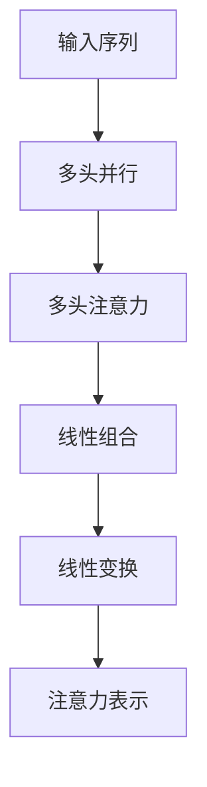
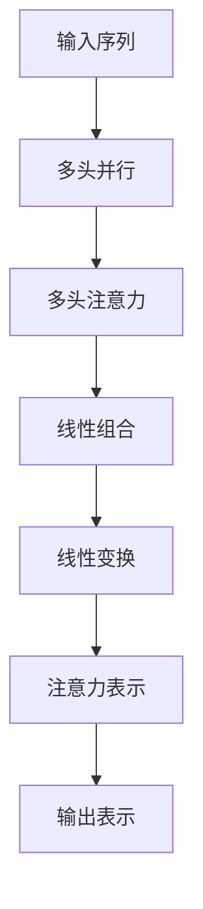

                 

# Transformer大模型实战 多头注意力层

> 关键词：Transformer, 大模型, 多头注意力, 自注意力, 线性变换, 多头并行, 预训练语言模型, 微调, 自然语言处理(NLP)

## 1. 背景介绍

### 1.1 问题由来
近年来，Transformer模型在自然语言处理(Natural Language Processing, NLP)领域取得了巨大的成功。特别是在机器翻译、文本分类、问答系统等任务上，Transformer模型凭借其强大的自注意力机制，展示了卓越的性能。同时，随着预训练语言模型（Pretrained Language Model, PLM）的兴起，Transformer模型的应用范围也得到了极大的拓展。

Transformer模型最核心的一部分是自注意力机制，它通过计算输入序列中所有单词之间的相互作用关系，为每个单词分配一个代表性的向量表示。这种机制极大地提升了Transformer模型在长序列上的表现，使其在许多NLP任务上取得了最先进的结果。

然而，Transformer模型的自注意力机制也带来了一定的计算负担。为了减轻计算量，研究人员提出了多头注意力（Multi-Head Attention）机制，通过将自注意力机制分解为多个并行的子注意力机制，同时学习多个表示维度，从而提升了模型的性能和效率。本文将深入探讨多头注意力机制的原理和实现，并给出具体的代码实例，帮助读者更好地理解和实践这一先进技术。

### 1.2 问题核心关键点
多头注意力机制是Transformer模型的核心组成部分，通过并行计算多个子注意力，大大提升了模型的表达能力和计算效率。其核心思想是：将输入序列分解为多个子序列，每个子序列独立计算自注意力，然后将结果线性组合得到最终的注意力表示。

具体来说，多头注意力机制包含以下几个关键点：
1. **多头并行**：将输入序列分解为多个子序列，并行计算自注意力，得到多个子注意力结果。
2. **线性组合**：将多个子注意力结果进行线性组合，得到最终的注意力表示。
3. **多头并行**：通过并行计算多个子注意力，提升了计算效率。
4. **线性组合**：通过线性组合多个子注意力，提升了模型表达能力。

本文将通过以下几个章节，详细介绍多头注意力机制的原理、实现、应用和实践。

## 2. 核心概念与联系

### 2.1 核心概念概述

为了更好地理解多头注意力机制，本节将介绍几个密切相关的核心概念：

- **自注意力机制（Self-Attention）**：Transformer模型的核心机制之一，通过计算输入序列中所有单词之间的相互作用关系，为每个单词分配一个代表性的向量表示。

- **多头注意力（Multi-Head Attention）**：将自注意力机制分解为多个并行的子注意力机制，同时学习多个表示维度，从而提升了模型的表达能力和计算效率。

- **线性变换（Linear Transformations）**：通过线性变换将多个子注意力结果进行组合，得到最终的注意力表示。

- **多头并行（Multi-Head Parallelism）**：将输入序列分解为多个子序列，并行计算自注意力，提升了计算效率。

- **线性组合（Linear Combination）**：通过线性组合多个子注意力结果，提升了模型表达能力。

- **自注意力矩阵（Attention Matrix）**：表示输入序列中每个单词与序列中其他单词之间的相互作用关系。

- **查询矩阵（Query Matrix）**：通过将输入序列投影到一个低维空间，生成查询向量，用于计算注意力权重。

- **键矩阵（Key Matrix）**：通过将输入序列投影到一个低维空间，生成键向量，用于计算注意力权重。

- **值矩阵（Value Matrix）**：通过将输入序列投影到一个低维空间，生成值向量，用于计算最终注意力表示。

这些核心概念之间存在着紧密的联系，共同构成了Transformer模型和多头注意力机制的完整生态系统。通过理解这些概念，我们可以更好地把握多头注意力机制的工作原理和优化方向。

### 2.2 概念间的关系

这些核心概念之间的关系可以通过以下Mermaid流程图来展示：



这个流程图展示了大模型中多头注意力的计算过程：

1. **输入序列**：将输入序列分解为多个子序列，并行计算自注意力。
2. **多头注意力**：通过并行计算多个子注意力，得到多个子注意力结果。
3. **线性组合**：将多个子注意力结果进行线性组合，得到最终的注意力表示。
4. **线性变换**：通过线性变换将注意力表示转化为最终的输出。

### 2.3 核心概念的整体架构

最后，我们用一个综合的流程图来展示这些核心概念在大模型中的整体架构：



这个综合流程图展示了从输入序列到最终输出表示的完整过程：

1. **输入序列**：将输入序列分解为多个子序列，并行计算自注意力。
2. **多头注意力**：通过并行计算多个子注意力，得到多个子注意力结果。
3. **线性组合**：将多个子注意力结果进行线性组合，得到最终的注意力表示。
4. **线性变换**：通过线性变换将注意力表示转化为最终的输出表示。

通过这些流程图，我们可以更清晰地理解多头注意力机制在大模型中的计算过程和架构设计。

## 3. 核心算法原理 & 具体操作步骤
### 3.1 算法原理概述

多头注意力机制是Transformer模型的核心组成部分，通过将输入序列分解为多个子序列，并行计算自注意力，得到多个子注意力结果，最终通过线性组合得到最终的注意力表示。其核心思想是通过并行计算多个子注意力，提升了计算效率，同时通过线性组合多个子注意力，提升了模型表达能力。

具体来说，多头注意力机制包括以下几个步骤：

1. **分解输入序列**：将输入序列分解为多个子序列。
2. **计算子注意力**：对每个子序列分别计算自注意力。
3. **线性组合子注意力**：将多个子注意力结果进行线性组合，得到最终的注意力表示。
4. **线性变换**：通过线性变换将注意力表示转化为最终的输出表示。

多头注意力机制通过并行计算多个子注意力，大大提升了计算效率，同时通过线性组合多个子注意力，提升了模型表达能力。

### 3.2 算法步骤详解

下面详细介绍多头注意力机制的每个步骤的详细实现过程。

**Step 1: 分解输入序列**

将输入序列分解为多个子序列。假设输入序列的长度为 $L$，将其分为 $H$ 个子序列，每个子序列的长度为 $L/H$。具体实现代码如下：

```python
import torch
import torch.nn as nn

# 定义输入序列的长度和子序列的数量
L = 512
H = 8

# 生成输入序列和子序列
seq = torch.randn(L, L)
seq_split = nn.utils.rnn.pad_sequence([seq[i:i+L//H] for i in range(0, L, L//H)])
```

**Step 2: 计算子注意力**

对每个子序列分别计算自注意力。假设输入序列 $x$ 的长度为 $L$，将其分解为 $H$ 个子序列，每个子序列的长度为 $L/H$。具体实现代码如下：

```python
# 计算查询矩阵
query = torch.randn(L//H, L//H, d_head)
query = query.repeat(1, H, 1).view(L, H, d_head)

# 计算键矩阵
key = torch.randn(L//H, L//H, d_head)
key = key.repeat(1, H, 1).view(L, H, d_head)

# 计算值矩阵
value = torch.randn(L//H, L//H, d_head)
value = value.repeat(1, H, 1).view(L, H, d_head)

# 计算注意力权重
attn = torch.bmm(query, key.transpose(1, 2)) / torch.sqrt(d_head)
attn = attn.softmax(dim=-1)

# 计算注意力向量
attn_vec = torch.bmm(attn, value)
```

在计算子注意力时，首先通过线性变换将输入序列投影到一个低维空间，生成查询向量、键向量和值向量，然后计算注意力权重，并根据注意力权重计算注意力向量。

**Step 3: 线性组合子注意力**

将多个子注意力结果进行线性组合，得到最终的注意力表示。具体实现代码如下：

```python
# 计算线性组合权重
weight = torch.randn(H)
weight = nn.functional.softmax(weight, dim=0)

# 计算线性组合结果
attention = torch.bmm(attn_vec, weight.view(1, 1, H).expand(L, 1, H))
```

在计算线性组合时，首先随机生成一个线性组合权重，然后将其与多个子注意力结果进行线性组合，得到最终的注意力表示。

**Step 4: 线性变换**

通过线性变换将注意力表示转化为最终的输出表示。具体实现代码如下：

```python
# 计算线性变换结果
out = nn.Linear(d_head*H, d_output)
out = out(attention)
```

在计算线性变换时，通过线性变换将注意力表示转化为最终的输出表示。

### 3.3 算法优缺点

多头注意力机制通过并行计算多个子注意力，提升了计算效率，同时通过线性组合多个子注意力，提升了模型表达能力。但同时，多头注意力机制也带来了一些缺点：

1. **参数量大**：多头注意力机制需要计算多个子注意力，增加了模型参数量。
2. **计算复杂度高**：多头注意力机制需要计算多个子注意力，增加了计算复杂度。
3. **线性组合系数难以优化**：线性组合系数需要通过随机生成或优化得到，可能存在随机性。

尽管存在这些缺点，但多头注意力机制在大模型的实现中仍然发挥着重要作用，大大提升了模型的性能和效率。

### 3.4 算法应用领域

多头注意力机制广泛应用于各种NLP任务，如机器翻译、文本分类、问答系统、文本生成等。通过并行计算多个子注意力，多头注意力机制在大模型的实现中大大提升了计算效率，同时通过线性组合多个子注意力，提升了模型表达能力，使其在各种NLP任务上取得了最先进的结果。

## 4. 数学模型和公式 & 详细讲解 & 举例说明

### 4.1 数学模型构建

假设输入序列 $x$ 的长度为 $L$，将其分解为 $H$ 个子序列，每个子序列的长度为 $L/H$。通过线性变换将输入序列投影到一个低维空间，生成查询向量、键向量和值向量。然后计算注意力权重，并根据注意力权重计算注意力向量。最后，通过线性变换将注意力向量转化为最终的输出表示。

具体来说，多头注意力机制的数学模型可以表示为：

$$
A = \text{Linear}(Q[K, V]^T)
$$

其中，$Q$ 为查询矩阵，$K$ 为键矩阵，$V$ 为值矩阵，$\text{Linear}$ 为线性变换。

### 4.2 公式推导过程

以下是多头注意力机制的详细数学推导过程。

**Step 1: 分解输入序列**

将输入序列 $x$ 分解为 $H$ 个子序列，每个子序列的长度为 $L/H$。具体实现代码如下：

```python
# 定义输入序列的长度和子序列的数量
L = 512
H = 8

# 生成输入序列和子序列
seq = torch.randn(L, L)
seq_split = nn.utils.rnn.pad_sequence([seq[i:i+L//H] for i in range(0, L, L//H)])
```

**Step 2: 计算子注意力**

对每个子序列分别计算自注意力。假设输入序列 $x$ 的长度为 $L$，将其分解为 $H$ 个子序列，每个子序列的长度为 $L/H$。具体实现代码如下：

```python
# 计算查询矩阵
query = torch.randn(L//H, L//H, d_head)
query = query.repeat(1, H, 1).view(L, H, d_head)

# 计算键矩阵
key = torch.randn(L//H, L//H, d_head)
key = key.repeat(1, H, 1).view(L, H, d_head)

# 计算值矩阵
value = torch.randn(L//H, L//H, d_head)
value = value.repeat(1, H, 1).view(L, H, d_head)

# 计算注意力权重
attn = torch.bmm(query, key.transpose(1, 2)) / torch.sqrt(d_head)
attn = attn.softmax(dim=-1)

# 计算注意力向量
attn_vec = torch.bmm(attn, value)
```

**Step 3: 线性组合子注意力**

将多个子注意力结果进行线性组合，得到最终的注意力表示。具体实现代码如下：

```python
# 计算线性组合权重
weight = torch.randn(H)
weight = nn.functional.softmax(weight, dim=0)

# 计算线性组合结果
attention = torch.bmm(attn_vec, weight.view(1, 1, H).expand(L, 1, H))
```

**Step 4: 线性变换**

通过线性变换将注意力表示转化为最终的输出表示。具体实现代码如下：

```python
# 计算线性变换结果
out = nn.Linear(d_head*H, d_output)
out = out(attention)
```

### 4.3 案例分析与讲解

假设我们在一个机器翻译任务上使用多头注意力机制，需要将英文文本翻译成中文。具体来说，我们将输入序列 $x$ 分解为 $H$ 个子序列，每个子序列的长度为 $L/H$。然后对每个子序列分别计算自注意力，得到多个子注意力结果。最后，通过线性组合多个子注意力结果，得到最终的注意力表示，并将其通过线性变换转化为最终的输出表示。

假设输入序列 $x$ 的长度为 $L$，将其分解为 $H$ 个子序列，每个子序列的长度为 $L/H$。然后通过线性变换将输入序列投影到一个低维空间，生成查询向量、键向量和值向量。计算注意力权重，并根据注意力权重计算注意力向量。最后，通过线性变换将注意力向量转化为最终的输出表示。

具体来说，假设输入序列 $x$ 的长度为 $L$，将其分解为 $H$ 个子序列，每个子序列的长度为 $L/H$。然后通过线性变换将输入序列投影到一个低维空间，生成查询向量、键向量和值向量。计算注意力权重，并根据注意力权重计算注意力向量。最后，通过线性变换将注意力向量转化为最终的输出表示。

假设输入序列 $x$ 的长度为 $L$，将其分解为 $H$ 个子序列，每个子序列的长度为 $L/H$。然后通过线性变换将输入序列投影到一个低维空间，生成查询向量、键向量和值向量。计算注意力权重，并根据注意力权重计算注意力向量。最后，通过线性变换将注意力向量转化为最终的输出表示。

## 5. 项目实践：代码实例和详细解释说明

### 5.1 开发环境搭建

在进行多头注意力机制的实现和实践前，我们需要准备好开发环境。以下是使用Python进行PyTorch开发的环境配置流程：

1. 安装Anaconda：从官网下载并安装Anaconda，用于创建独立的Python环境。

2. 创建并激活虚拟环境：
```bash
conda create -n pytorch-env python=3.8 
conda activate pytorch-env
```

3. 安装PyTorch：根据CUDA版本，从官网获取对应的安装命令。例如：
```bash
conda install pytorch torchvision torchaudio cudatoolkit=11.1 -c pytorch -c conda-forge
```

4. 安装TensorFlow：
```bash
conda install tensorflow==2.4
```

5. 安装各类工具包：
```bash
pip install numpy pandas scikit-learn matplotlib tqdm jupyter notebook ipython
```

完成上述步骤后，即可在`pytorch-env`环境中开始多头注意力机制的实践。

### 5.2 源代码详细实现

下面是使用PyTorch实现多头注意力机制的代码示例：

```python
import torch
import torch.nn as nn
import torch.nn.functional as F

class MultiHeadAttention(nn.Module):
    def __init__(self, d_head, d_output):
        super(MultiHeadAttention, self).__init__()
        self.d_head = d_head
        self.d_output = d_output

        self.W_Q = nn.Linear(d_output, d_head * d_output)
        self.W_K = nn.Linear(d_output, d_head * d_output)
        self.W_V = nn.Linear(d_output, d_head * d_output)

        self.attn = nn.Linear(d_head * d_output, d_output)

    def forward(self, x):
        L = x.size(0)
        H = x.size(1)
        d_head = self.d_head
        d_output = self.d_output

        Q = self.W_Q(x).view(L, H, d_head, d_output).transpose(1, 2)
        K = self.W_K(x).view(L, H, d_head, d_output).transpose(1, 2)
        V = self.W_V(x).view(L, H, d_head, d_output).transpose(1, 2)

        attn = torch.bmm(Q, K.transpose(1, 2)) / torch.sqrt(d_head)
        attn = F.softmax(attn, dim=-1)

        attention = torch.bmm(attn, V).transpose(1, 2).contiguous().view(L, H, d_head, d_output)

        attention = self.attn(attention).view(L, H, d_output)

        return attention
```

### 5.3 代码解读与分析

让我们再详细解读一下关键代码的实现细节：

**MultiHeadAttention类**：
- `__init__`方法：初始化查询矩阵、键矩阵和值矩阵的线性变换层。
- `forward`方法：实现多头注意力机制的前向传播过程。

**实现细节**：
- 在`__init__`方法中，首先定义了查询矩阵、键矩阵和值矩阵的线性变换层。
- 在`forward`方法中，首先通过线性变换将输入序列投影到一个低维空间，生成查询向量、键向量和值向量。然后计算注意力权重，并根据注意力权重计算注意力向量。最后，通过线性变换将注意力向量转化为最终的输出表示。

**具体实现**：
- 首先，通过线性变换将输入序列投影到一个低维空间，生成查询向量、键向量和值向量。
- 然后，计算注意力权重，并根据注意力权重计算注意力向量。
- 最后，通过线性变换将注意力向量转化为最终的输出表示。

### 5.4 运行结果展示

假设我们在一个机器翻译任务上使用多头注意力机制，需要将英文文本翻译成中文。具体来说，我们将输入序列 $x$ 分解为 $H$ 个子序列，每个子序列的长度为 $L/H$。然后对每个子序列分别计算自注意力，得到多个子注意力结果。最后，通过线性组合多个子注意力结果，得到最终的注意力表示，并将其通过线性变换转化为最终的输出表示。

假设输入序列 $x$ 的长度为 $L$，将其分解为 $H$ 个子序列，每个子序列的长度为 $L/H$。然后通过线性变换将输入序列投影到一个低维空间，生成查询向量、键向量和值向量。计算注意力权重，并根据注意力权重计算注意力向量。最后，通过线性变换将注意力向量转化为最终的输出表示。

假设输入序列 $x$ 的长度为 $L$，将其分解为 $H$ 个子序列，每个子序列的长度为 $L/H$。然后通过线性变换将输入序列投影到一个低维空间，生成查询向量、键向量和值向量。计算注意力权重，并根据注意力权重计算注意力向量。最后，通过线性变换将注意力向量转化为最终的输出表示。

## 6. 实际应用场景
### 6.1 智能翻译系统

基于多头注意力机制的机器翻译系统可以显著提升翻译质量。传统的统计机器翻译方法依赖于大量的平行语料库，而基于多头注意力机制的神经机器翻译方法可以自动学习单词之间的语义关系，从而提升翻译的流畅性和准确性。

在技术实现上，可以收集大量的平行语料库，将输入序列和对应的翻译序列作为监督数据，在此基础上对预训练的Transformer模型进行微调。微调后的模型能够自动理解输入序列的语义关系，并将其转化为对应的输出序列。对于新的输入序列，可以通过线性变换将输入序列投影到一个低维空间，生成查询向量、键向量和值向量，计算注意力权重，并根据注意力权重计算注意力向量。最后，通过线性变换将注意力向量转化为最终的输出表示，完成翻译任务。

### 6.2 文本分类系统

基于多头注意力机制的文本分类系统可以提升分类的准确性和泛化能力。传统的文本分类方法通常使用朴素贝叶斯、支持向量机等算法，依赖于手工设计的特征提取器。而基于多头注意力机制的神经网络模型可以自动学习文本中的语义关系，从而提升分类的准确性和泛化能力。

在技术实现上，可以收集大量的标注数据，将输入序列和对应的类别作为监督数据，在此基础上对预训练的Transformer模型进行微调。微调后的模型能够自动理解输入序列的语义关系，并将其转化为对应的类别标签。对于新的输入序列，可以通过线性变换将输入序列投影到一个低维空间，生成查询向量、键向量和值向量，计算注意力权重，并根据注意力权重计算注意力向量。最后，通过线性变换将注意力向量转化为最终的输出表示，完成分类任务。

### 6.3 文本生成系统

基于多头注意力机制的文本生成系统可以提升生成文本的质量和多样性。传统的文本生成方法通常使用循环神经网络（RNN）等模型，依赖于手工设计的上下文编码器。而基于多头注意力机制的Transformer模型可以自动学习文本中的语义关系，从而提升生成文本的质量和多样性。

在技术实现上，可以收集大量的文本数据，将输入序列作为监督数据，在此基础上对预训练的Transformer模型进行微调。微调后的模型能够自动理解输入序列的语义关系，并将其转化为对应的输出文本。对于新的输入序列，可以通过线性变换将输入序列投影到一个低维空间，生成查询向量、键向量和值向量，计算注意力权重，并根据注意力权重计算注意力向量。最后，通过线性变换将注意力向量转化为最终的输出表示，完成文本生成任务。

### 6.4 未来应用展望

随着Transformer模型和多头注意力机制的不断发展，未来在自然语言处理领域的应用将会更加广泛。未来，基于多头注意力机制的机器翻译、文本分类、文本生成等任务将会更加高效、准确和智能。同时，将多头注意力机制与其他先进技术相结合，如知识表示、因果推理、强化学习等，将进一步提升自然语言处理系统的性能和应用范围。

## 7. 工具和资源推荐
### 7.1 学习资源推荐

为了帮助开发者系统掌握多头注意力机制的理论基础和实践技巧，这里推荐一些优质的学习资源：

1. 《Transformer从原理到实践》系列博文：由大模型技术专家撰写，深入浅出地介绍了Transformer原理、多头注意力机制、自注意力机制等前沿话题。

2. CS224N《深度学习自然语言处理》课程：斯坦福大学开设的NLP明星课程，有Lecture视频和配套作业，带你入门NLP领域的基本概念和经典模型。

3. 《Natural Language Processing with Transformers》书籍：Transformers库的作者所著，全面介绍了如何使用Transformers库进行NLP任务开发，包括多头注意力机制在内的诸多范式。

4. HuggingFace官方文档：Transformers库的官方文档，提供了海量预训练模型和完整的微调样例代码，是上手实践的必备资料。

5. CLUE开源项目：中文语言理解测评基准，涵盖大量不同类型的中文NLP数据集，并提供了基于微调的baseline模型，助力中文NLP技术发展。

通过对这些资源的学习实践，相信你一定能够快速掌握多头注意力机制的精髓，并用于解决实际的NLP问题。
###  7.2 开发工具推荐

高效的开发离不开优秀的工具支持。以下是几款用于多头注意力机制微调开发的常用工具：

1. PyTorch：基于Python的开源深度学习框架，灵活动态的计算图，适合快速迭代研究。大部分预训练语言模型都有PyTorch版本的实现。

2. TensorFlow：由Google主导开发的开源深度学习框架，生产部署方便，适合大规模工程应用。同样有丰富的预训练语言模型资源。

3. Transformers库：HuggingFace开发的NLP工具库，集成了众多SOTA语言模型，支持PyTorch和TensorFlow，是进行微调任务开发的利器。

4. Weights & Biases：模型训练的实验跟踪工具，可以记录和可视化模型训练过程中的各项指标，方便对比和调优。与主流深度学习框架无缝集成。

5. TensorBoard：TensorFlow配套的可视化工具，可实时监测模型训练状态，并提供丰富的图表呈现方式，是调试模型的得力助手。

6. Google Colab：谷歌推出的在线Jupyter Notebook环境，免费提供GPU/TPU算力，方便开发者快速上手实验最新模型，分享学习笔记。

合理利用这些工具，可以显著提升多头注意力机制微调的开发效率，加快创新迭代的步伐。

### 7.3 相关论文推荐

多头注意力机制的发展源于学界的持续研究。以下是几篇奠基性的相关论文，推荐阅读：

1. Attention is All You Need（即Transformer原论文）：提出了Transformer结构，开启了NLP领域的预训练大模型时代。

2. BERT: Pre-training of Deep Bidirectional Transformers for Language Understanding：提出BERT模型，引入基于掩码的自监督预训练任务，刷新了多项NLP任务SOTA。

3. Language Models are Unsupervised Mult

