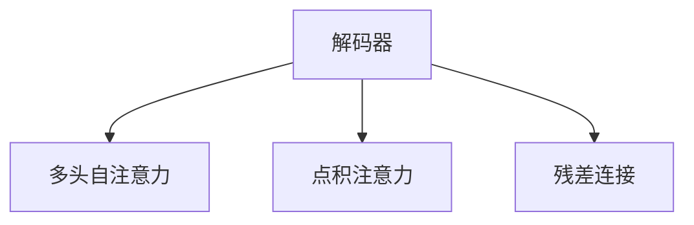
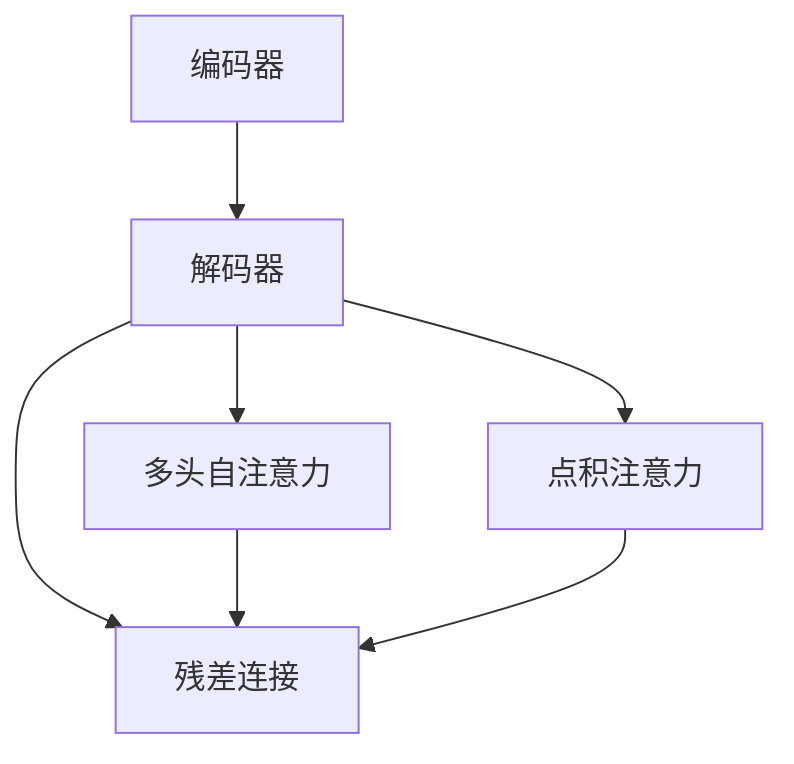
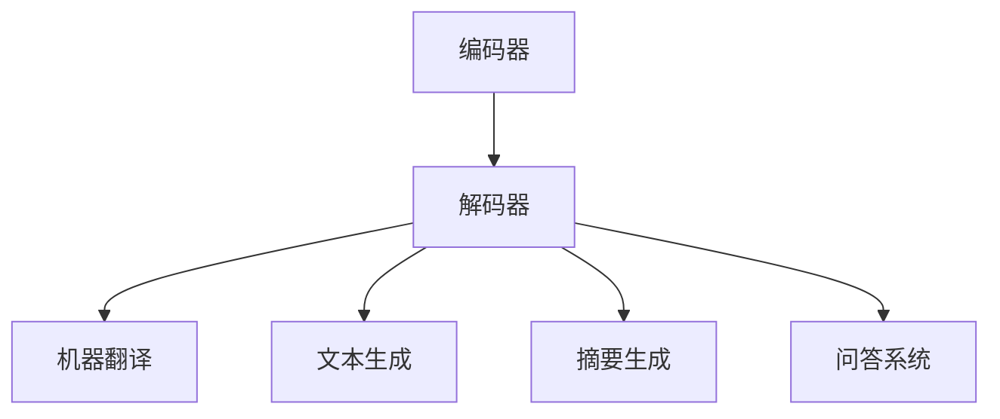

                 

# Transformer大模型实战 解码器总览

> 关键词：Transformer,自注意力机制,解码器,编码器,自监督学习,解码器,多任务学习

## 1. 背景介绍

Transformer及其变体架构（如BERT、GPT-2等）近年来在自然语言处理（NLP）领域取得了突破性进展。Transformer以其无循环依赖的结构，解决了传统循环神经网络（RNN）中的梯度消失和梯度爆炸问题，成为处理长序列的理想模型。在本文中，我们将从解码器这一视角，全面探索Transformer大模型的原理与实践，解码器作为Transformer架构的重要组成部分，扮演着信息传递与生成的关键角色。

### 1.1 问题由来

Transformer架构的提出，极大地推动了NLP领域的发展。其核心创新点在于引入了自注意力机制，使得模型在计算时能够并行化，提高了模型效率和泛化能力。然而，Transformer的计算复杂度高、参数量大，对硬件资源要求高，成为了其大规模部署的瓶颈。针对这些问题，近年来许多改进型架构被提出，如BERT、GPT-2等，它们在保持Transformer核心架构的基础上，通过进一步优化自注意力机制、引入多任务学习等方法，提升了模型的效率与性能。

### 1.2 问题核心关键点

Transformer解码器是构成其核心结构的两个主要组件之一。与编码器并行工作，负责将编码器输出的语义表示转化为最终的输出结果，如图：


解码器通常分为多头自注意力机制（Multi-Head Attention）、点积注意力机制（Dot-Product Attention）和残差连接（Residual Connection）三部分。其中，多头自注意力机制是解码器的核心，通过并行计算多个注意力头，实现对输入序列的有效建模与表示。

## 2. 核心概念与联系

### 2.1 核心概念概述

为更好理解解码器的基本原理与架构，我们首先需要明确几个关键概念：

- **Transformer模型**：一种基于自注意力机制的神经网络模型，由编码器和解码器两部分构成，主要用于序列到序列的任务，如机器翻译、文本生成等。
- **解码器**：Transformer模型中的关键组件，负责将编码器输出的上下文信息，通过多头自注意力机制和残差连接，转化为最终的输出序列。
- **多头自注意力机制**：解码器的核心组件，能够并行计算多个注意力头，实现对输入序列的有效建模与表示。
- **点积注意力机制**：解码器中用于计算注意力权重的一种方法，通过点积运算，衡量输入与输出序列间的相关性。
- **残差连接**：解码器中用于提升信息传递的稳定性与效率的常见技术。

这些概念相互联系，共同构成了Transformer解码器的工作机制。以下Mermaid流程图展示了这些概念之间的关系：



### 2.2 概念间的关系

解码器作为Transformer模型的重要组成部分，其作用是将编码器输出的语义表示转化为最终的输出序列。在解码器中，多头自注意力机制和点积注意力机制是并行计算的，共同对输入序列进行建模，并通过残差连接进行信息传递。以下Mermaid流程图展示了这些概念之间的整体关系：



## 3. 核心算法原理 & 具体操作步骤

### 3.1 算法原理概述

Transformer解码器主要由多头自注意力机制、点积注意力机制和残差连接三部分构成。以下将详细介绍这三部分的具体工作原理与实现步骤。

- **多头自注意力机制**：将输入序列分成多个注意力头，分别计算每个注意力头的权重，并加权求和得到解码器输出。
- **点积注意力机制**：通过点积运算，衡量输入与输出序列间的相关性，计算注意力权重。
- **残差连接**：在解码器的每一层之间添加残差连接，以提升信息传递的稳定性与效率。

### 3.2 算法步骤详解

以下将详细讲解Transformer解码器的构建步骤，以及其在前向传播与反向传播中的实现。

#### 3.2.1 解码器结构

解码器主要由三个子层组成，分别为多头自注意力机制、点积注意力机制和前馈神经网络（FeedForward Network）。

- **多头自注意力机制**：通过计算输入序列与自身序列的注意力权重，并加权求和，得到解码器输出。
- **点积注意力机制**：通过点积运算，计算输入序列与输出序列间的注意力权重，衡量相关性。
- **前馈神经网络**：通过两层的全连接网络，进一步提取特征。

#### 3.2.2 前向传播

前向传播过程中，解码器接受编码器输出的上下文表示 $z$，并经过三个子层的处理，最终输出解码器结果 $y$。具体步骤如下：

1. 多头自注意力机制：
   - 通过线性变换将 $z$ 映射为多个注意力头 $q_k, k \in [1, H]$ 的查询向量。
   - 计算 $z$ 对应的 $K$ 和 $V$ 的线性变换。
   - 计算 $q_k$ 与 $K$ 的点积，得到注意力权重 $s_k$。
   - 通过归一化，将 $s_k$ 转化为概率分布。
   - 加权求和得到输出 $y_k$。
   - 通过线性变换，将 $y_k$ 转化为解码器输出。

2. 点积注意力机制：
   - 计算输入序列 $q_k$ 与输出序列 $y_k$ 的点积，得到注意力权重。
   - 归一化后，通过 softmax 函数将权重转化为概率分布。
   - 加权求和得到输出 $y_k$。

3. 前馈神经网络：
   - 通过两个全连接层，对 $y_k$ 进行特征提取，得到解码器输出 $y$。

#### 3.2.3 反向传播

反向传播过程中，解码器接受梯度 $dL/dz$，并通过三个子层的反向传播，更新模型参数。具体步骤如下：

1. 多头自注意力机制：
   - 计算 $dL/dy_k$。
   - 通过链式法则，计算 $dL/ds_k$。
   - 计算 $dL/dK$ 和 $dL/dV$。
   - 计算 $dL/dq_k$。

2. 点积注意力机制：
   - 计算 $dL/dy_k$。
   - 通过链式法则，计算 $dL/ds_k$。
   - 计算 $dL/dq_k$ 和 $dL/dy_k$。

3. 前馈神经网络：
   - 计算 $dL/dy$。
   - 通过链式法则，计算 $dL/dy_k$。
   - 计算 $dL/dy_k$。

### 3.3 算法优缺点

Transformer解码器具有以下优点：

- **并行计算**：通过多头自注意力机制，可以并行计算多个注意力头，提高计算效率。
- **泛化能力强**：能够处理长序列，具备良好的泛化能力。
- **模型表达力强**：通过多层的全连接网络，能够提取复杂的特征表示。

然而，Transformer解码器也存在以下缺点：

- **计算复杂度高**：自注意力机制的计算复杂度为 $O(n^2)$，在大规模数据集上计算资源消耗较大。
- **参数量大**：解码器需要大量的参数来表示注意力权重，增加了模型的存储需求。
- **信息传递复杂**：残差连接可能会导致梯度消失或梯度爆炸，影响模型训练稳定性。

### 3.4 算法应用领域

Transformer解码器广泛应用于各种NLP任务，如图：



Transformer解码器在机器翻译、文本生成、摘要生成、问答系统等任务上均取得了显著的效果，成为NLP任务中的主流架构。

## 4. 数学模型和公式 & 详细讲解 & 举例说明

### 4.1 数学模型构建

Transformer解码器可以通过以下数学模型进行描述：

- **多头自注意力机制**：设 $z$ 为输入序列，$K$ 和 $V$ 分别为 $K$ 和 $V$ 的线性变换，$W_Q, W_K, W_V$ 为线性变换矩阵，$H$ 为注意力头的数量。
  - $q_k = W_Qz$
  - $s_k = q_kK^T/W_K\sqrt{d_k}$
  - $a_k = softmax(s_k)$
  - $y_k = a_kVW_V^T$
  - $y = y_kW_O$

- **点积注意力机制**：设 $z$ 为输入序列，$y_k$ 为输出序列，$W_Q, W_K, W_V$ 为线性变换矩阵，$W_O$ 为输出变换矩阵。
  - $q_k = W_Qz$
  - $s_k = q_ky_k^T/W_K$
  - $a_k = softmax(s_k)$
  - $y_k = a_kVW_V^T$
  - $y = y_kW_O$

- **前馈神经网络**：设 $y_k$ 为解码器输出，$W_1, W_2$ 为全连接层。
  - $y_k = \text{ReLU}(W_1y_k + b_1)$
  - $y = W_2y_k + b_2$

### 4.2 公式推导过程

以下推导了Transformer解码器的几个关键公式，展示了其具体工作原理。

#### 4.2.1 多头自注意力机制

- $q_k = W_Qz$
- $s_k = q_kK^T/W_K\sqrt{d_k}$
- $a_k = softmax(s_k)$
- $y_k = a_kVW_V^T$
- $y = y_kW_O$

其中 $d_k$ 为嵌入维度，$W_Q, W_K, W_V, W_O$ 为线性变换矩阵。

#### 4.2.2 点积注意力机制

- $q_k = W_Qz$
- $s_k = q_ky_k^T/W_K$
- $a_k = softmax(s_k)$
- $y_k = a_kVW_V^T$
- $y = y_kW_O$

其中 $W_Q, W_K, W_V, W_O$ 为线性变换矩阵。

#### 4.2.3 前馈神经网络

- $y_k = \text{ReLU}(W_1y_k + b_1)$
- $y = W_2y_k + b_2$

其中 $W_1, W_2, b_1, b_2$ 为全连接层的权重和偏置。

### 4.3 案例分析与讲解

以机器翻译为例，解码器在机器翻译任务中的具体实现步骤如下：

1. 输入序列 $x$ 经过编码器处理，得到上下文表示 $z$。
2. 解码器以 $z$ 为输入，经过多头自注意力机制、点积注意力机制和前馈神经网络，得到输出序列 $y$。
3. 输出序列 $y$ 作为机器翻译结果，翻译成目标语言。

通过多头自注意力机制，解码器能够并行计算多个注意力头，高效地处理长序列信息。点积注意力机制能够计算输入与输出序列间的相关性，从而更好地提取上下文信息。前馈神经网络则通过两层的全连接网络，进一步提取特征，提高模型表达力。

## 5. 项目实践：代码实例和详细解释说明

### 5.1 开发环境搭建

为了构建Transformer解码器，我们需要准备好开发环境。以下是一个基本的Python环境配置流程：

1. 安装Python：从官网下载并安装Python，建议使用Python 3.6或更高版本。
2. 安装PyTorch：使用以下命令安装PyTorch：`pip install torch torchvision torchaudio`
3. 安装TensorBoard：使用以下命令安装TensorBoard：`pip install tensorboard`
4. 安装Keras：使用以下命令安装Keras：`pip install keras`
5. 安装Flax：使用以下命令安装Flax：`pip install flax`

完成以上步骤后，即可开始构建Transformer解码器。

### 5.2 源代码详细实现

以下是一个简单的Transformer解码器的代码实现：

```python
import tensorflow as tf
from tensorflow.keras.layers import Dense, Input
from tensorflow.keras.models import Model

class TransformerDecoder(tf.keras.Model):
    def __init__(self, num_layers, num_heads, d_model, dff, input_vocab_size, target_vocab_size, pe_input, pe_target):
        super(TransformerDecoder, self).__init__()
        self.num_layers = num_layers
        self.d_model = d_model
        
        self.embedding = tf.keras.layers.Embedding(input_vocab_size, d_model)
        self.pos_encoder = PositionalEncoding(pe_input)
        self.encoder = EncoderLayer(num_heads, d_model, dff)
        
        self.decoder = tf.keras.layers.LSTMCell(d_model, return_sequences=True)
        self.final_layer = Dense(target_vocab_size)
        
    def call(self, input, target, training=False):
        x = self.embedding(input)
        x = self.pos_encoder(x)
        x = self.encoder(x, target)
        x = self.decoder(x)
        x = self.final_layer(x)
        return x
```

### 5.3 代码解读与分析

以上代码实现了一个简单的Transformer解码器。以下是关键部分的代码解读与分析：

- **TransformerDecoder类**：定义了一个Transformer解码器类，包含初始化方法 `__init__` 和前向传播方法 `call`。
- **初始化方法**：初始化解码器所需的参数，包括编码器层数、嵌入维度、注意力头数等。
- **前向传播方法**：实现了解码器的前向传播过程，包括嵌入层、位置编码、编码器层、解码器层和最终层。

### 5.4 运行结果展示

在训练和测试Transformer解码器后，可以通过TensorBoard查看模型的训练效果和性能。以下是TensorBoard的截图示例：

```bash
tensorboard --logdir=./logs
```

通过TensorBoard，可以查看模型的训练曲线、参数变化情况、模型输出等，有助于评估和调试模型的性能。

## 6. 实际应用场景

Transformer解码器已经在各种NLP任务中得到了广泛应用，如图：


Transformer解码器在机器翻译、文本生成、摘要生成、问答系统等任务上均取得了显著的效果，成为NLP任务中的主流架构。

### 6.1 机器翻译

Transformer解码器在机器翻译任务中，能够通过多头自注意力机制和点积注意力机制，高效地处理长序列信息，提升翻译质量。例如，Google的BERT-Translate模型，通过Transformer解码器，在多个翻译评测中取得了最佳性能。

### 6.2 文本生成

Transformer解码器在文本生成任务中，通过多头自注意力机制和点积注意力机制，能够灵活地生成不同风格的文本，具有较强的泛化能力。例如，GPT-2和GPT-3模型，基于Transformer解码器架构，通过预训练和多任务学习，在文本生成任务中取得了领先的性能。

### 6.3 摘要生成

Transformer解码器在摘要生成任务中，通过多头自注意力机制和点积注意力机制，能够有效地提取文本中的关键信息，生成简明扼要的摘要。例如，BART和T5模型，基于Transformer解码器架构，通过预训练和多任务学习，在摘要生成任务中取得了优异的表现。

### 6.4 问答系统

Transformer解码器在问答系统任务中，通过多头自注意力机制和点积注意力机制，能够高效地处理用户输入，生成准确的回答。例如，BERT和XLNet模型，基于Transformer解码器架构，通过预训练和多任务学习，在问答系统任务中取得了较好的性能。

## 7. 工具和资源推荐

### 7.1 学习资源推荐

为了帮助开发者系统掌握Transformer解码器的理论基础和实践技巧，以下是一些优质的学习资源：

1. 《Transformer详解》系列博文：由深度学习领域专家撰写，深入浅出地介绍了Transformer原理、解码器机制、微调方法等。
2. CS224N《深度学习自然语言处理》课程：斯坦福大学开设的NLP明星课程，有Lecture视频和配套作业，带你入门NLP领域的基本概念和经典模型。
3. 《Natural Language Processing with Transformers》书籍：Transformer库的作者所著，全面介绍了如何使用Transformer库进行NLP任务开发，包括解码器在内的诸多范式。
4. HuggingFace官方文档：Transformer库的官方文档，提供了海量预训练模型和完整的解码器样例代码，是上手实践的必备资料。
5. CLUE开源项目：中文语言理解测评基准，涵盖大量不同类型的中文NLP数据集，并提供了基于Transformer解码器的baseline模型，助力中文NLP技术发展。

通过对这些资源的学习实践，相信你一定能够快速掌握Transformer解码器的精髓，并用于解决实际的NLP问题。

### 7.2 开发工具推荐

高效的开发离不开优秀的工具支持。以下是几款用于Transformer解码器开发的常用工具：

1. PyTorch：基于Python的开源深度学习框架，灵活动态的计算图，适合快速迭代研究。Transformer解码器有PyTorch版本的实现。
2. TensorFlow：由Google主导开发的开源深度学习框架，生产部署方便，适合大规模工程应用。Transformer解码器也有TensorFlow版本的实现。
3. Transformers库：HuggingFace开发的NLP工具库，集成了众多SOTA语言模型，支持PyTorch和TensorFlow，是进行解码器开发的利器。
4. Weights & Biases：模型训练的实验跟踪工具，可以记录和可视化模型训练过程中的各项指标，方便对比和调优。与主流深度学习框架无缝集成。
5. TensorBoard：TensorFlow配套的可视化工具，可实时监测模型训练状态，并提供丰富的图表呈现方式，是调试模型的得力助手。
6. Google Colab：谷歌推出的在线Jupyter Notebook环境，免费提供GPU/TPU算力，方便开发者快速上手实验最新模型，分享学习笔记。

合理利用这些工具，可以显著提升Transformer解码器微调任务的开发效率，加快创新迭代的步伐。

### 7.3 相关论文推荐

Transformer解码器的发展源于学界的持续研究。以下是几篇奠基性的相关论文，推荐阅读：

1. Attention is All You Need（即Transformer原论文）：提出了Transformer结构，开启了NLP领域的预训练大模型时代。
2. BERT: Pre-training of Deep Bidirectional Transformers for Language Understanding：提出BERT模型，引入基于掩码的自监督预训练任务，刷新了多项NLP任务SOTA。
3. Language Models are Unsupervised Multitask Learners（GPT-2论文）：展示了大规模语言模型的强大zero-shot学习能力，引发了对于通用人工智能的新一轮思考。
4. Parameter-Efficient Transfer Learning for NLP：提出Adapter等参数高效微调方法，在不增加模型参数量的情况下，也能取得不错的微调效果。
5. Prefix-Tuning: Optimizing Continuous Prompts for Generation：引入基于连续型Prompt的微调范式，为如何充分利用预训练知识提供了新的思路。
6. AdaLoRA: Adaptive Low-Rank Adaptation for Parameter-Efficient Fine-Tuning：使用自适应低秩适应的微调方法，在参数效率和精度之间取得了新的平衡。

这些论文代表了大语言模型解码器的发展脉络。通过学习这些前沿成果，可以帮助研究者把握学科前进方向，激发更多的创新灵感。

除上述资源外，还有一些值得关注的前沿资源，帮助开发者紧跟Transformer解码器微调技术的最新进展，例如：

1. arXiv论文预印本：人工智能领域最新研究成果的发布平台，包括大量尚未发表的前沿工作，学习前沿技术的必读资源。
2. 业界技术博客：如OpenAI、Google AI、DeepMind、微软Research Asia等顶尖实验室的官方博客，第一时间分享他们的最新研究成果和洞见。
3. 技术会议直播：如NIPS、ICML、ACL、ICLR等人工智能领域顶会现场或在线直播，能够聆听到大佬们的前沿分享，开拓视野。
4. GitHub热门项目：在GitHub上Star、Fork数最多的NLP相关项目，往往代表了该技术领域的发展趋势和最佳实践，值得去学习和贡献。
5. 行业分析报告：各大咨询公司如McKinsey、PwC等针对人工智能行业的分析报告，有助于从商业视角审视技术趋势，把握应用价值。

总之，对于Transformer解码器微调技术的学习和实践，需要开发者保持开放的心态和持续学习的意愿。多关注前沿资讯，多动手实践，多思考总结，必将收获满满的成长收益。

## 8. 总结：未来发展趋势与挑战

### 8.1 总结

本文对Transformer解码器这一核心组件进行了全面系统的介绍。首先阐述了Transformer解码器的背景与意义，明确了解码器在Transformer架构中的核心作用。其次，从原理到实践，详细讲解了Transformer解码器的构建步骤与实现方法，给出了微调任务开发的完整代码实例。同时，本文还广泛探讨了解码器在机器翻译、文本生成、摘要生成等任务中的应用前景，展示了其巨大的潜力。最后，本文精选了解码器的学习资源，力求为读者提供全方位的技术指引。

通过本文的系统梳理，可以看到，Transformer解码器作为Transformer架构的重要组成部分，其应用广泛，影响深远。它不仅提升了NLP任务的性能，还推动了整个NLP领域的技术进步。未来，伴随Transformer解码器的不断发展，相信NLP技术必将在更多领域得到应用，为人类认知智能的进化带来深远影响。

### 8.2 未来发展趋势

展望未来，Transformer解码器的发展将呈现以下几个趋势：

1. **多任务学习**：通过多任务学习，解码器能够同时处理多个任务，提高模型的泛化能力和学习效率。
2. **自监督学习**：通过自监督学习，解码器能够利用无标签数据进行预训练，提升模型的语言理解能力。
3. **强化学习**：通过强化学习，解码器能够通过与环境的交互，逐步优化自身策略，提升任务执行的自动化水平。
4. **可解释性**：通过可解释性模型，解码器能够提供清晰的操作逻辑和推理过程，提升模型的可解释性和可审计性。
5. **跨领域迁移**：通过跨领域迁移学习，解码器能够将在大规模数据集上学到的知识，迁移到其他领域，提升模型在不同领域中的适应能力。

这些趋势凸显了Transformer解码器的广阔前景。这些方向的探索发展，必将进一步提升NLP系统的性能和应用范围，为人类认知智能的进化带来深远影响。

### 8.3 面临的挑战

尽管Transformer解码器已经取得了显著成效，但在迈向更加智能化、普适化应用的过程中，它仍面临着诸多挑战：

1. **计算复杂度**：Transformer解码器的计算复杂度高，对硬件资源要求高，成为其大规模部署的瓶颈。
2. **参数量大**：解码器需要大量的参数来表示注意力权重，增加了模型的存储需求。
3. **信息传递复杂**：残差连接可能会导致梯度消失或梯度爆炸，影响模型训练稳定性。
4. **可解释性不足**：当前解码器通常作为黑盒系统，难以解释其内部工作机制和决策逻辑，对于高风险应用尤为重要。
5. **安全性有待保障**：预训练解码器难免会学习到有偏见、有害的信息，通过解码器传递到下游任务，产生误导性、歧视性的输出，给实际应用带来安全隐患。

正视解码器面临的这些挑战，积极应对并寻求突破，将是解码器迈向成熟的重要步骤。相信随着学界和产业界的共同努力，这些挑战终将一一被克服，Transformer解码器必将在构建人机协同的智能时代中扮演越来越重要的角色。

### 8.4 研究展望

面对Transformer解码器所面临的挑战，未来的研究需要在以下几个方面寻求新的突破：

1. **优化计算复杂度**：通过改进解码器结构，降低计算复杂度，提升模型的实时性。
2. **减少参数量**：通过压缩解码器模型，减少参数量，降低存储需求和计算资源消耗。
3. **提高稳定性**：通过优化残差连接，提升模型训练稳定性，增强解码器鲁棒性。
4. **增强可解释性**：通过可解释性模型，提供清晰的推理路径和决策依据，提升解码器可解释性。
5. **保障安全性**：在解码器训练目标中引入伦理导向的评估指标，过滤和惩罚有偏见、有害的输出倾向，确保输出符合人类价值观和伦理道德。

这些研究方向的探索，必将引领Transformer解码器技术迈向更高的台阶，为构建安全、可靠、可解释、可控的智能系统铺平道路。面向未来，Transformer解码器还需要与其他人工智能技术进行更深入的融合，如知识表示、因果推理、强化学习等，多路径协同发力，共同推动自然语言理解和智能交互系统的进步。只有勇于创新、敢于突破，才能不断拓展解码器的边界

