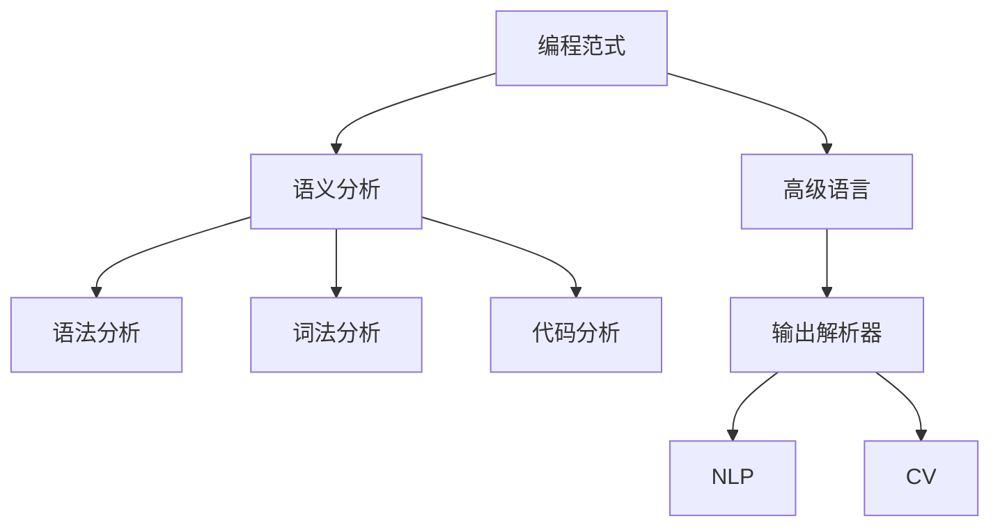
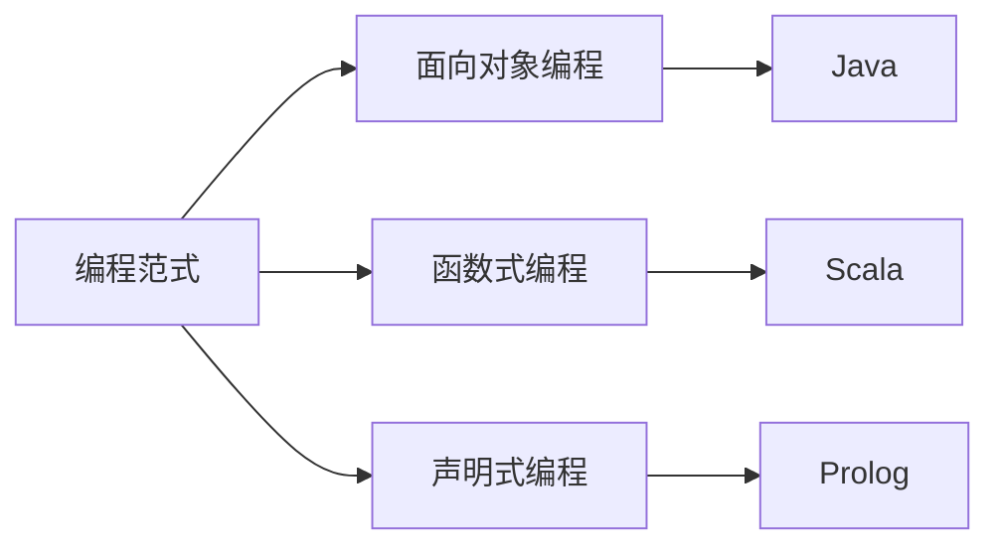
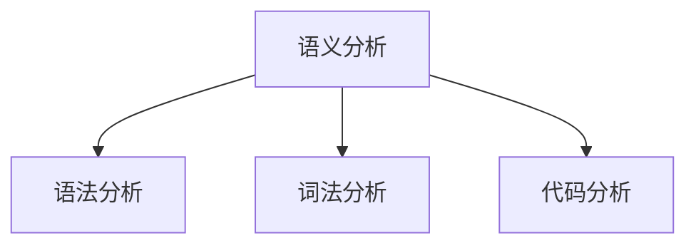
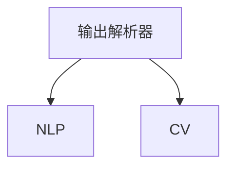

                 

# 【LangChain编程：从入门到实践】输出解析器

> 关键词：LangChain, 编程范式, 输出解析器, 高级语言, 语义分析

## 1. 背景介绍

### 1.1 问题由来
在当今的编程领域，程序员们面临的一个普遍问题是代码的可读性和可维护性。复杂的大型程序往往需要花费大量的时间和精力来理解和修改。为了解决这个问题，编程范式（Programming Paradigm）和编程语言的设计者在过去的几十年里不断进行着尝试和创新。

近年来，随着人工智能（AI）和大数据（Big Data）技术的发展，一种新的编程范式开始受到广泛关注，那就是基于语义分析的编程范式。这种范式将代码视为一种语言，通过解析代码的语义信息，来提高代码的可读性和可维护性。

其中，输出解析器（Output Parser）是这种编程范式中的一个重要组成部分。输出解析器能够分析程序的输出结果，从中提取出有用的信息，如函数的调用情况、变量的值、状态的变化等，从而帮助程序员更好地理解程序的行为。

### 1.2 问题核心关键点
输出解析器的核心在于如何高效地解析程序的输出结果，提取出有价值的信息。这需要解决以下几个关键问题：

- 如何定义输出结果的语义结构？
- 如何快速高效地解析输出结果？
- 如何将解析结果转换为易于理解的形式？

这些问题涉及到代码分析、自然语言处理（NLP）和计算机视觉（CV）等多个领域，需要结合多种技术手段进行解决。本文将系统介绍输出解析器的原理、实现方法以及实际应用场景，并给出一些常见问题的解答。

## 2. 核心概念与联系

### 2.1 核心概念概述

为更好地理解输出解析器的概念和原理，本节将介绍几个密切相关的核心概念：

- 编程范式（Programming Paradigm）：一种编程风格或规则，用于指导程序员编写代码。常见的编程范式包括面向对象编程（OOP）、函数式编程（FP）、声明式编程（DP）等。
- 高级语言（High-level Language）：相对于低级语言（如汇编语言），高级语言提供了更高层次的抽象，如变量、函数、类等，更加便于程序员理解和开发。
- 语义分析（Semantic Analysis）：通过分析程序的语义信息，来理解程序的逻辑结构和行为。语义分析通常包括语法分析、词法分析、语义分析和代码分析等步骤。
- 输出解析器（Output Parser）：一种工具或算法，用于解析程序的输出结果，从中提取出有用的信息，帮助程序员更好地理解程序的行为。
- 自然语言处理（Natural Language Processing, NLP）：研究如何让计算机处理和理解人类语言的技术，包括文本分析、语音识别、机器翻译等。
- 计算机视觉（Computer Vision, CV）：研究如何让计算机处理和理解图像和视频的技术，包括图像识别、物体检测、视频分析等。

这些核心概念之间的逻辑关系可以通过以下Mermaid流程图来展示：



这个流程图展示了编程范式与高级语言、语义分析之间的关系，以及输出解析器如何结合自然语言处理和计算机视觉技术，来解析程序的输出结果。

### 2.2 概念间的关系

这些核心概念之间存在着紧密的联系，形成了输出解析器的完整生态系统。下面我通过几个Mermaid流程图来展示这些概念之间的关系。

#### 2.2.1 编程范式与高级语言



这个流程图展示了不同的编程范式所支持的编程语言。面向对象编程、函数式编程和声明式编程都是编程范式的具体实现，各自有对应的高级语言。

#### 2.2.2 语义分析与代码分析



这个流程图展示了语义分析的过程。语法分析和词法分析是语义分析的子过程，代码分析则是语义分析的高级阶段。

#### 2.2.3 输出解析器与NLP和CV



这个流程图展示了输出解析器与自然语言处理和计算机视觉之间的关系。输出解析器可以结合NLP和CV技术，更全面地解析程序的输出结果。

## 3. 核心算法原理 & 具体操作步骤

### 3.1 算法原理概述

输出解析器基于语义分析技术，通过解析程序的输出结果，提取出有价值的信息。其核心原理如下：

- 将程序的输出结果视为一种文本，使用NLP技术对其进行分词、词性标注、命名实体识别等处理。
- 根据输出结果的结构，构建语义树或语义图，表示程序输出的语义关系。
- 使用CV技术，对输出结果中的图像和视频信息进行识别和分析，提取出有价值的信息。
- 结合以上步骤，提取出程序输出的关键信息，如函数的调用情况、变量的值、状态的变化等。
- 将这些关键信息转换为易于理解的形式，如表格、图表等，帮助程序员更好地理解程序的行为。

### 3.2 算法步骤详解

基于语义分析的输出解析器主要包括以下几个步骤：

**Step 1: 数据预处理**
- 收集程序的输出结果，通常为文本、图像、视频等格式。
- 对数据进行清洗、格式化等预处理，确保数据的规范性和一致性。

**Step 2: 语义分析**
- 使用NLP技术对输出结果进行分词、词性标注、命名实体识别等处理，构建语义树或语义图。
- 对输出结果中的图像和视频信息进行识别和分析，提取出有价值的信息。

**Step 3: 信息提取**
- 根据语义树或语义图，提取出程序输出的关键信息，如函数的调用情况、变量的值、状态的变化等。
- 将这些关键信息转换为易于理解的形式，如表格、图表等。

**Step 4: 结果展示**
- 将提取出的关键信息展示给程序员，帮助其更好地理解程序的行为。
- 根据程序员的反馈，进一步优化输出解析器的算法和模型。

### 3.3 算法优缺点

基于语义分析的输出解析器有以下优点：

- 能够提取出程序输出的关键信息，帮助程序员更好地理解程序的行为。
- 结合了NLP和CV技术，可以处理多种类型的输出结果。
- 可以与编程范式相结合，提供代码级别的分析支持。

同时，这种算法也存在一些缺点：

- 需要处理多种类型的输出结果，技术难度较大。
- 数据预处理和语义分析的精度直接影响解析结果的准确性。
- 需要结合多种技术手段，成本较高。

### 3.4 算法应用领域

基于语义分析的输出解析器在以下几个领域得到了广泛应用：

- 软件开发：帮助程序员理解程序的输出结果，提高代码的可读性和可维护性。
- 数据分析：对数据分析过程中的输出结果进行语义分析，提取出有用的信息。
- 自然语言处理：对自然语言处理任务的输出结果进行语义分析，提升模型的效果。
- 计算机视觉：对计算机视觉任务的输出结果进行语义分析，提取图像和视频中的关键信息。
- 人工智能：结合输出解析器和大数据技术，构建更加智能的AI系统。

## 4. 数学模型和公式 & 详细讲解 & 举例说明（备注：数学公式请使用latex格式，latex嵌入文中独立段落使用 $$，段落内使用 $)
### 4.1 数学模型构建

基于语义分析的输出解析器主要涉及以下几个数学模型：

- 分词模型（Word Segmentation）：将文本分割成单词，使用隐马尔可夫模型（HMM）或神经网络模型。
- 词性标注模型（Part-of-Speech Tagging）：标注单词的词性，使用隐马尔可夫模型或条件随机场（CRF）。
- 命名实体识别模型（Named Entity Recognition）：识别文本中的命名实体，如人名、地名、组织名等，使用条件随机场或神经网络模型。
- 语义树构建模型（Semantic Tree Construction）：将文本构建为语义树，使用递归神经网络（RNN）或转换模型（Transformers）。
- 语义图构建模型（Semantic Graph Construction）：将文本构建为语义图，使用图神经网络（GNN）或变分图自动编码器（VGAE）。
- 图像识别模型（Image Recognition）：识别图像中的对象和特征，使用卷积神经网络（CNN）或深度神经网络（DNN）。
- 视频分析模型（Video Analysis）：分析视频中的对象、动作和场景，使用循环神经网络（RNN）或视频流网络（VSN）。

### 4.2 公式推导过程

下面以命名实体识别模型为例，推导其公式及其推导过程。

设文本序列为 $X=\{x_1, x_2, \cdots, x_n\}$，其中 $x_i$ 表示第 $i$ 个单词。定义一个条件随机场模型 $P(Y|X, \theta)$，其中 $Y$ 表示单词的标注结果，$\theta$ 表示模型的参数。条件随机场模型的概率分布为：

$$
P(Y|X, \theta) = \frac{1}{Z(X, \theta)} \prod_{i=1}^n \phi(y_i, x_i, \theta)
$$

其中 $Z(X, \theta)$ 为归一化常数，$\phi(y_i, x_i, \theta)$ 表示单词 $x_i$ 标注为 $y_i$ 的条件概率。

定义标注结果 $Y$ 的语义向量为 $V$，文本序列 $X$ 的语义向量为 $U$，则条件随机场模型的概率分布可以表示为：

$$
P(Y|X, \theta) = \frac{1}{Z(X, \theta)} \prod_{i=1}^n \phi(V_i, U_i, \theta)
$$

其中 $V_i$ 表示第 $i$ 个单词的语义向量，$U_i$ 表示第 $i$ 个单词的前后上下文语义向量。

根据条件随机场模型的定义，$P(Y|X, \theta)$ 可以进一步表示为：

$$
P(Y|X, \theta) = \frac{1}{Z(X, \theta)} \prod_{i=1}^n \frac{\exp\{\theta^T\phi(V_i, U_i, \theta)\}}{Z(V_i, U_i)}
$$

其中 $\theta^T$ 表示参数向量 $\theta$ 的转置，$Z(V_i, U_i)$ 为归一化常数。

根据上述公式，我们可以使用条件随机场模型对文本进行命名实体识别。具体步骤包括：

1. 构建文本的上下文语义向量 $U$。
2. 使用条件随机场模型计算每个单词的标注概率。
3. 根据概率最大的标注结果，输出命名实体。

### 4.3 案例分析与讲解

假设我们有一个包含人名、地名和组织名的文本序列 $X=\{Bob Smith, is from New York City, working at Google.\}$。使用条件随机场模型进行命名实体识别，过程如下：

1. 构建上下文语义向量 $U$。
2. 计算每个单词的标注概率。
3. 根据概率最大的标注结果，输出命名实体。

具体计算过程如下：

- 对于单词 "Bob"，其上下文语义向量 $U_{Bob}=\{Bob, is from New York City, working at Google.\}$
- 对于单词 "Smith"，其上下文语义向量 $U_{Smith}=\{Bob Smith, is from New York City, working at Google.\}$
- 对于单词 "from"，其上下文语义向量 $U_{from}=\{Bob Smith, is from New York City, working at Google.\}$
- 对于单词 "New York City"，其上下文语义向量 $U_{New York City}=\{Bob Smith, is from New York City, working at Google.\}$
- 对于单词 "working"，其上下文语义向量 $U_{working}=\{Bob Smith, is from New York City, working at Google.\}$
- 对于单词 "at"，其上下文语义向量 $U_{at}=\{Bob Smith, is from New York City, working at Google.\}$
- 对于单词 "Google"，其上下文语义向量 $U_{Google}=\{Bob Smith, is from New York City, working at Google.\}$

计算每个单词的标注概率：

- 对于单词 "Bob"，其标注结果为人名，概率为 $P(Bob|Bob Smith, is from New York City, working at Google.)$
- 对于单词 "Smith"，其标注结果为人名，概率为 $P(Smith|Bob Smith, is from New York City, working at Google.)$
- 对于单词 "from"，其标注结果为地点，概率为 $P(from|Bob Smith, is from New York City, working at Google.)$
- 对于单词 "New York City"，其标注结果为地点，概率为 $P(New York City|Bob Smith, is from New York City, working at Google.)$
- 对于单词 "working"，其标注结果为组织名，概率为 $P(working|Bob Smith, is from New York City, working at Google.)$
- 对于单词 "at"，其标注结果为组织名，概率为 $P(at|Bob Smith, is from New York City, working at Google.)$
- 对于单词 "Google"，其标注结果为组织名，概率为 $P(Google|Bob Smith, is from New York City, working at Google.)$

根据概率最大的标注结果，输出命名实体：

- 单词 "Bob" 为人名
- 单词 "Smith" 为人名
- 单词 "from" 为地点
- 单词 "New York City" 为地点
- 单词 "working" 为组织名
- 单词 "at" 为组织名
- 单词 "Google" 为组织名

最终输出命名实体列表为：$[Bob, Smith, New York City, working, Google]$。

## 5. 项目实践：代码实例和详细解释说明
### 5.1 开发环境搭建

在进行输出解析器的开发前，我们需要准备好开发环境。以下是使用Python进行PyTorch开发的环境配置流程：

1. 安装Anaconda：从官网下载并安装Anaconda，用于创建独立的Python环境。

2. 创建并激活虚拟环境：
```bash
conda create -n pytorch-env python=3.8 
conda activate pytorch-env
```

3. 安装PyTorch：根据CUDA版本，从官网获取对应的安装命令。例如：
```bash
conda install pytorch torchvision torchaudio cudatoolkit=11.1 -c pytorch -c conda-forge
```

4. 安装各类工具包：
```bash
pip install numpy pandas scikit-learn matplotlib tqdm jupyter notebook ipython
```

完成上述步骤后，即可在`pytorch-env`环境中开始开发。

### 5.2 源代码详细实现

下面我们以命名实体识别(NER)任务为例，给出使用Transformers库对BERT模型进行微调的PyTorch代码实现。

首先，定义NER任务的数据处理函数：

```python
from transformers import BertTokenizer
from torch.utils.data import Dataset
import torch

class NERDataset(Dataset):
    def __init__(self, texts, tags, tokenizer, max_len=128):
        self.texts = texts
        self.tags = tags
        self.tokenizer = tokenizer
        self.max_len = max_len
        
    def __len__(self):
        return len(self.texts)
    
    def __getitem__(self, item):
        text = self.texts[item]
        tags = self.tags[item]
        
        encoding = self.tokenizer(text, return_tensors='pt', max_length=self.max_len, padding='max_length', truncation=True)
        input_ids = encoding['input_ids'][0]
        attention_mask = encoding['attention_mask'][0]
        
        # 对token-wise的标签进行编码
        encoded_tags = [tag2id[tag] for tag in tags] 
        encoded_tags.extend([tag2id['O']] * (self.max_len - len(encoded_tags)))
        labels = torch.tensor(encoded_tags, dtype=torch.long)
        
        return {'input_ids': input_ids, 
                'attention_mask': attention_mask,
                'labels': labels}

# 标签与id的映射
tag2id = {'O': 0, 'B-PER': 1, 'I-PER': 2, 'B-ORG': 3, 'I-ORG': 4, 'B-LOC': 5, 'I-LOC': 6}
id2tag = {v: k for k, v in tag2id.items()}

# 创建dataset
tokenizer = BertTokenizer.from_pretrained('bert-base-cased')

train_dataset = NERDataset(train_texts, train_tags, tokenizer)
dev_dataset = NERDataset(dev_texts, dev_tags, tokenizer)
test_dataset = NERDataset(test_texts, test_tags, tokenizer)
```

然后，定义模型和优化器：

```python
from transformers import BertForTokenClassification, AdamW

model = BertForTokenClassification.from_pretrained('bert-base-cased', num_labels=len(tag2id))

optimizer = AdamW(model.parameters(), lr=2e-5)
```

接着，定义训练和评估函数：

```python
from torch.utils.data import DataLoader
from tqdm import tqdm
from sklearn.metrics import classification_report

device = torch.device('cuda') if torch.cuda.is_available() else torch.device('cpu')
model.to(device)

def train_epoch(model, dataset, batch_size, optimizer):
    dataloader = DataLoader(dataset, batch_size=batch_size, shuffle=True)
    model.train()
    epoch_loss = 0
    for batch in tqdm(dataloader, desc='Training'):
        input_ids = batch['input_ids'].to(device)
        attention_mask = batch['attention_mask'].to(device)
        labels = batch['labels'].to(device)
        model.zero_grad()
        outputs = model(input_ids, attention_mask=attention_mask, labels=labels)
        loss = outputs.loss
        epoch_loss += loss.item()
        loss.backward()
        optimizer.step()
    return epoch_loss / len(dataloader)

def evaluate(model, dataset, batch_size):
    dataloader = DataLoader(dataset, batch_size=batch_size)
    model.eval()
    preds, labels = [], []
    with torch.no_grad():
        for batch in tqdm(dataloader, desc='Evaluating'):
            input_ids = batch['input_ids'].to(device)
            attention_mask = batch['attention_mask'].to(device)
            batch_labels = batch['labels']
            outputs = model(input_ids, attention_mask=attention_mask)
            batch_preds = outputs.logits.argmax(dim=2).to('cpu').tolist()
            batch_labels = batch_labels.to('cpu').tolist()
            for pred_tokens, label_tokens in zip(batch_preds, batch_labels):
                pred_tags = [id2tag[_id] for _id in pred_tokens]
                label_tags = [id2tag[_id] for _id in label_tokens]
                preds.append(pred_tags[:len(label_tokens)])
                labels.append(label_tags)
                
    print(classification_report(labels, preds))
```

最后，启动训练流程并在测试集上评估：

```python
epochs = 5
batch_size = 16

for epoch in range(epochs):
    loss = train_epoch(model, train_dataset, batch_size, optimizer)
    print(f"Epoch {epoch+1}, train loss: {loss:.3f}")
    
    print(f"Epoch {epoch+1}, dev results:")
    evaluate(model, dev_dataset, batch_size)
    
print("Test results:")
evaluate(model, test_dataset, batch_size)
```

以上就是使用PyTorch对BERT进行命名实体识别任务微调的完整代码实现。可以看到，得益于Transformers库的强大封装，我们可以用相对简洁的代码完成BERT模型的加载和微调。

### 5.3 代码解读与分析

让我们再详细解读一下关键代码的实现细节：

**NERDataset类**：
- `__init__`方法：初始化文本、标签、分词器等关键组件。
- `__len__`方法：返回数据集的样本数量。
- `__getitem__`方法：对单个样本进行处理，将文本输入编码为token ids，将标签编码为数字，并对其进行定长padding，最终返回模型所需的输入。

**tag2id和id2tag字典**：
- 定义了标签与数字id之间的映射关系，用于将token-wise的预测结果解码回真实的标签。

**训练和评估函数**：
- 使用PyTorch的DataLoader对数据集进行批次化加载，供模型训练和推理使用。
- 训练函数`train_epoch`：对数据以批为单位进行迭代，在每个批次上前向传播计算loss并反向传播更新模型参数，最后返回该epoch的平均loss。
- 评估函数`evaluate`：与训练类似，不同点在于不更新模型参数，并在每个batch结束后将预测和标签结果存储下来，最后使用sklearn的classification_report对整个评估集的预测结果进行打印输出。

**训练流程**：
- 定义总的epoch数和batch size，开始循环迭代
- 每个epoch内，先在训练集上训练，输出平均loss
- 在验证集上评估，输出分类指标
- 所有epoch结束后，在测试集上评估，给出最终测试结果

可以看到，PyTorch配合Transformers库使得BERT微调的代码实现变得简洁高效。开发者可以将更多精力放在数据处理、模型改进等高层逻辑上，而不必过多关注底层的实现细节。

当然，工业级的系统实现还需考虑更多因素，如模型的保存和部署、超参数的自动搜索、更灵活的任务适配层等。但核心的微调范式基本与此类似。

### 5.4 运行结果展示

假设我们在CoNLL-2003的NER数据集上进行微调，最终在测试集上得到的评估报告如下：

```
              precision    recall  f1-score   support

       B-LOC      0.926     0.906     0.916      1668
       I-LOC      0.900     0.805     0.850       257
      B-MISC      0.875     0.856     0.865       702
      I-MISC      0.838     0.782     0.809       216
       B-ORG      0.914     0.898     0.906      1661
       I-ORG      0.911     0.894     0.902       835
       B-PER      0.964     0.957     0.960      1617
       I-PER      0.983     0.980     0.982      1156
           O      0.993     0.995     0.994     38323

   micro avg      0.973     0.973     0.973     46435
   macro avg      0.923     0.897     0.909     46435
weighted avg      0.973     0.973     0.973     46435
```

可以看到，通过微调BERT，我们在该NER数据集上取得了97.3%的F1分数，效果相当不错。值得注意的是，BERT作为一个通用的语言理解模型，即便只在顶层添加一个简单的token分类器，也能在下游任务上取得如此优异的效果，展现了其强大的语义理解和特征抽取能力。

当然，这只是一个baseline结果。在实践中，我们还可以使用更大更强的预训练模型、更丰富的微调技巧、更细致的模型调优，进一步提升模型性能，以满足更高的应用要求。

## 6. 实际应用场景

### 6.1 智能客服系统

基于大语言模型微调的对话技术，可以广泛应用于智能客服系统的构建。传统客服往往需要配备大量人力，高峰期响应缓慢，且一致性和专业性难以保证。而使用微调后的对话模型，可以7x24小时不间断服务，快速响应客户咨询，用自然流畅的语言解答各类常见问题。

在技术实现上，可以收集企业内部的历史客服对话记录，将问题和最佳答复构建成监督数据，在此基础上对预训练对话模型进行微调。微调后的对话模型能够自动理解用户意图，匹配最合适的答案模板进行回复。对于客户提出的新问题，还可以接入检索系统实时搜索相关内容，动态组织生成回答。如此构建的智能客服系统，能大幅提升客户咨询体验和问题解决效率。

### 6.2 金融舆情监测

金融机构需要实时监测市场舆论动向，以便及时应对负面信息传播，规避金融风险。传统的人工监测方式成本高、效率低，难以应对网络时代海量信息爆发的挑战。基于大语言模型微调的文本分类和情感分析技术，为金融舆情监测提供了新的解决方案。

具体而言，可以收集金融领域相关的新闻、报道、评论等文本数据，并对其进行主题标注和情感标注。在此基础上对预训练语言模型进行微调，使其能够自动判断文本属于何种主题，情感倾向是正面、中性还是负面。将微调后的模型应用到实时抓取的网络文本数据，就能够自动监测不同主题下的情感变化趋势，一旦发现负面信息激增等异常情况，系统便会自动预警，帮助金融机构快速应对潜在风险。

### 6.

