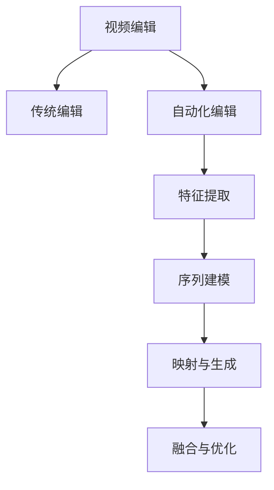
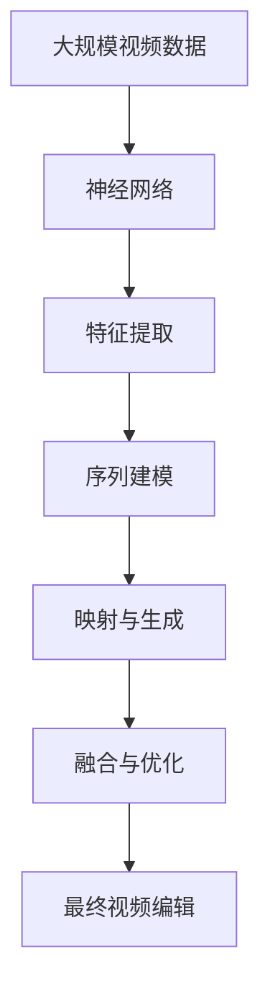

                 

# 一切皆是映射：使用神经网络自动化视频编辑

> 关键词：神经网络,视频编辑,自动映射,视频处理,深度学习

## 1. 背景介绍

### 1.1 问题由来
随着数字视频产业的飞速发展，视频编辑成为内容创作的重要环节。传统视频编辑通常依赖人工操作，流程繁琐且耗时，尤其是在高精度编辑和复杂效果制作中，存在较大的工作量和出错风险。视频编辑技术的自动化和智能化，不仅可以大幅提高生产效率，还能降低制作成本，提升用户体验。

近年来，深度学习技术在图像和视频处理领域取得了显著进展，相继提出了卷积神经网络(CNN)、循环神经网络(RNN)、变分自编码器(VAE)、生成对抗网络(GAN)等模型，用于图像识别、图像生成、视频分类、视频风格迁移等任务。这些模型通过学习大量图像和视频数据，能够自动发现特征并进行编码解码，有效减轻人工操作负担。

视频编辑自动化技术依赖于对视频内容进行智能分析和自动处理，其中包括帧同步、关键帧提取、剪辑、剪辑点调整、特效添加、画面稳定、背景替换等操作。这些任务都需要通过模型自动识别和映射，从而实现自动化编辑。

### 1.2 问题核心关键点
视频编辑自动化的核心在于通过深度学习模型对视频帧的语义、情感、风格、动作等特征进行编码，实现对视频内容的高效映射和生成。具体而言，包括以下关键技术点：

- **特征提取**：利用深度学习模型自动提取视频帧中的语义、动作、纹理等特征。
- **序列建模**：通过循环神经网络(RNN)、长短期记忆网络(LSTM)、注意力机制等，对视频帧序列进行建模，学习视频中的时空关系。
- **映射与生成**：通过生成对抗网络(GAN)、变分自编码器(VAE)、自回归模型等，实现对视频帧的自动映射和生成。
- **融合与优化**：结合多模型输出，通过融合和优化算法生成最终的编辑效果。

### 1.3 问题研究意义
视频编辑自动化的研究意义在于，通过技术手段提升视频内容创作的效率和质量，减轻人工操作的负担，降低制作成本。具体而言，该技术能够：

1. 提高制作效率：通过模型自动处理视频内容，显著缩短视频编辑时间。
2. 降低制作成本：减少人工操作，降低人力和时间成本。
3. 提升用户满意度：自动化的编辑过程更加稳定、一致，减少人工编辑带来的主观误差。
4. 拓展视频编辑应用场景：使复杂视频编辑任务能够轻松实现，推广到更多领域和市场。

## 2. 核心概念与联系

### 2.1 核心概念概述

为了更好地理解视频编辑自动化的核心概念，本节将介绍几个密切相关的核心概念：

- **视频编辑**：指对视频内容进行处理，包括剪辑、特效添加、颜色调整等操作，以创作出符合创作意图的视频片段。
- **深度学习**：一种基于神经网络的人工智能技术，通过学习大量数据，自动提取特征并进行映射生成。
- **神经网络**：一种模拟人脑神经元网络结构的计算模型，包含卷积层、池化层、循环层、全连接层等。
- **自动映射**：指通过模型自动学习视频帧之间的映射关系，实现对视频内容的自动化处理。
- **特征提取**：指模型自动提取视频帧中的关键特征，如纹理、动作、情感等，用于后续的映射和生成。
- **生成对抗网络(GAN)**：一种利用对抗训练的生成模型，通过对抗生成器和判别器的联合训练，生成逼真且多样化的视频内容。
- **变分自编码器(VAE)**：一种基于变分推断的生成模型，通过编码器对视频帧进行压缩，解码器对压缩后的数据进行重构，实现视频的生成。
- **自回归模型**：一种基于历史信息预测未来输出的模型，适用于视频帧序列的建模和生成。

这些核心概念之间的逻辑关系可以通过以下Mermaid流程图来展示：

```mermaid
graph LR
    A[视频编辑] --> B[深度学习]
    B --> C[神经网络]
    C --> D[自动映射]
    D --> E[特征提取]
    D --> F[生成对抗网络(GAN)]
    D --> G[变分自编码器(VAE)]
    D --> H[自回归模型]
    A --> I[特征提取]
    I --> D
```

这个流程图展示了大语言模型微调过程中各个核心概念的关系：

1. 视频编辑任务是深度学习模型研究和应用的目标。
2. 深度学习中的神经网络是实现视频编辑自动化的技术基础。
3. 神经网络通过自动映射、特征提取等技术，对视频帧进行编码和解码，实现自动化编辑。
4. 特征提取是视频编辑自动化的关键，用于学习视频帧中的关键特征。
5. 生成对抗网络(GAN)、变分自编码器(VAE)、自回归模型等生成技术，用于视频的自动生成和映射。

### 2.2 概念间的关系

这些核心概念之间存在着紧密的联系，形成了视频编辑自动化的完整生态系统。下面我们通过几个Mermaid流程图来展示这些概念之间的关系。

#### 2.2.1 视频编辑范式



这个流程图展示了大语言模型微调任务的主要范式：

1. 视频编辑的主要范式包括传统编辑和自动化编辑两种方式。
2. 传统编辑依赖人工操作，自动化编辑通过模型自动处理视频帧。
3. 特征提取、序列建模、映射与生成、融合与优化等技术，是实现视频编辑自动化的关键环节。

#### 2.2.2 自动映射与特征提取

```mermaid
graph LR
    A[视频编辑] --> B[特征提取]
    B --> C[自动映射]
    C --> D[生成对抗网络(GAN)]
    C --> E[变分自编码器(VAE)]
    C --> F[自回归模型]
```

这个流程图展示了大语言模型微调任务的核心组件：

1. 特征提取是自动映射的基础，用于学习视频帧的关键特征。
2. 自动映射通过生成对抗网络(GAN)、变分自编码器(VAE)、自回归模型等技术，实现对视频帧的自动映射和生成。

#### 2.2.3 生成对抗网络(GAN)

```mermaid
graph TB
    A[生成对抗网络(GAN)] --> B[生成器]
    A --> C[判别器]
    B --> D[视频帧生成]
    C --> E[判别视频帧真实性]
    D --> F[视频内容生成]
    E --> G[生成器训练]
    G --> A
```

这个流程图展示了生成对抗网络(GAN)的基本结构：

1. 生成对抗网络(GAN)包含生成器和判别器两个主要组件。
2. 生成器通过对抗训练生成逼真的视频帧。
3. 判别器用于评估生成器生成的视频帧的真实性，指导生成器训练。

### 2.3 核心概念的整体架构

最后，我们用一个综合的流程图来展示这些核心概念在大语言模型微调过程中的整体架构：



这个综合流程图展示了从预训练到微调，再到融合与优化的完整过程。大语言模型首先在大规模视频数据上进行预训练，然后通过神经网络模型对视频帧进行特征提取和序列建模，再通过生成对抗网络(GAN)、变分自编码器(VAE)、自回归模型等技术进行映射和生成，最后通过融合与优化算法生成最终的编辑效果。 通过这些流程图，我们可以更清晰地理解视频编辑自动化的各个核心概念及其关系。

## 3. 核心算法原理 & 具体操作步骤
### 3.1 算法原理概述

视频编辑自动化的核心算法原理是利用深度学习模型自动提取视频帧中的关键特征，通过对特征的编码和解码，实现对视频帧的自动映射和生成。

假设输入的视频帧序列为 $X=\{x_t\}_{t=1}^T$，其中 $x_t$ 表示第 $t$ 帧的视频内容，模型目标是将该序列映射到新的视频帧序列 $Y=\{y_t\}_{t=1}^T$，以实现对视频帧的编辑和生成。

具体而言，算法可以分为以下几个步骤：

1. **特征提取**：通过卷积神经网络(CNN)、循环神经网络(RNN)等模型，自动提取视频帧中的关键特征。
2. **序列建模**：利用循环神经网络(RNN)、长短期记忆网络(LSTM)等模型，对视频帧序列进行建模，学习视频中的时空关系。
3. **映射与生成**：通过生成对抗网络(GAN)、变分自编码器(VAE)、自回归模型等，实现对视频帧的自动映射和生成。
4. **融合与优化**：结合多模型输出，通过融合和优化算法生成最终的编辑效果。

### 3.2 算法步骤详解

视频编辑自动化的算法步骤主要包括以下几个关键步骤：

**Step 1: 准备视频数据集**

- 收集大规模视频数据集，包括不同类型的视频，如电影、电视剧、短片、纪录片等。
- 对视频数据进行预处理，如剪辑、去噪、解码等，转换为模型可以处理的格式。
- 将视频数据划分为训练集、验证集和测试集，以便后续模型训练和评估。

**Step 2: 构建深度学习模型**

- 选择合适的神经网络模型，如卷积神经网络(CNN)、循环神经网络(RNN)、生成对抗网络(GAN)等，用于特征提取、序列建模、映射与生成等任务。
- 设计模型结构，包括卷积层、池化层、循环层、全连接层等，并设置超参数，如学习率、批大小、迭代轮数等。

**Step 3: 训练模型**

- 将训练集输入模型，进行前向传播计算损失函数。
- 反向传播计算参数梯度，根据设定的优化算法和学习率更新模型参数。
- 周期性在验证集上评估模型性能，根据性能指标决定是否触发Early Stopping。
- 重复上述步骤直到满足预设的迭代轮数或Early Stopping条件。

**Step 4: 测试与优化**

- 在测试集上评估微调后模型 $M_{\hat{\theta}}$ 的性能，对比微调前后的精度提升。
- 使用微调后的模型对新视频帧进行推理预测，集成到实际的视频编辑系统中。
- 持续收集新的视频数据，定期重新微调模型，以适应数据分布的变化。

### 3.3 算法优缺点

视频编辑自动化的算法具有以下优点：

1. **高效自动化**：通过模型自动处理视频帧，显著提高视频编辑效率。
2. **一致性稳定**：模型能够稳定地进行视频编辑，避免人工操作带来的主观误差。
3. **可扩展性**：模型能够处理不同类型的视频，适用于各种视频编辑任务。

同时，该算法也存在以下缺点：

1. **依赖大量数据**：模型需要大规模的视频数据集进行训练，数据获取和标注成本较高。
2. **模型复杂度高**：大模型训练复杂，需要高性能的硬件设备和算力支持。
3. **易受数据分布影响**：模型的泛化能力受数据分布的影响较大，难以处理未见过的视频内容。
4. **生成内容多样性有限**：生成对抗网络(GAN)等模型生成的内容可能存在多样性不足的问题。
5. **可解释性不足**：模型的决策过程难以解释，难以调试和优化。

尽管存在这些缺点，但就目前而言，基于深度学习的自动视频编辑方法仍然是主流范式。未来相关研究的重点在于如何进一步降低数据依赖，提高生成内容的丰富性和多样性，同时兼顾可解释性和伦理安全性等因素。

### 3.4 算法应用领域

基于深度学习的自动视频编辑技术已经应用于多个领域，包括但不限于：

- **影视制作**：用于电影、电视剧、短片等视频内容的制作，自动生成特效、字幕、配乐等。
- **广告创意**：自动生成广告视频，提高广告制作效率，降低制作成本。
- **教育培训**：自动生成教育视频，提升教学效果，降低制作难度。
- **运动康复**：自动生成运动指导视频，提供个性化训练方案，提高训练效果。
- **娱乐娱乐**：自动生成短视频、网络剧集，满足用户娱乐需求。
- **监控安防**：自动生成监控视频，提高视频分析效率，降低人力成本。

除了上述这些应用场景外，自动视频编辑技术还将在更多领域得到应用，为视频内容创作和传播带来新的机遇。

## 4. 数学模型和公式 & 详细讲解 & 举例说明

### 4.1 数学模型构建

假设输入的视频帧序列为 $X=\{x_t\}_{t=1}^T$，其中 $x_t$ 表示第 $t$ 帧的视频内容，模型目标是将该序列映射到新的视频帧序列 $Y=\{y_t\}_{t=1}^T$，以实现对视频帧的编辑和生成。

### 4.2 公式推导过程

我们以生成对抗网络(GAN)为例，介绍视频帧生成过程的数学模型和推导过程。

假设生成对抗网络(GAN)包含一个生成器 $G$ 和一个判别器 $D$，生成器的输入为随机噪声向量 $z \in \mathbb{R}^z$，输出为生成的视频帧 $y \in \mathbb{R}^y$，判别器的输入为视频帧 $y$，输出为判别结果 $d \in [0,1]$。生成器 $G$ 和判别器 $D$ 的目标分别是最大化生成视频帧的逼真度，最小化生成视频帧被误判为真实视频的概率。

生成器 $G$ 和判别器 $D$ 的损失函数分别为：

$$
\mathcal{L}_G = \mathbb{E}_{z}[\log(1-D(G(z)))] + \lambda \|\theta_G\|^2
$$

$$
\mathcal{L}_D = \mathbb{E}_{x}[\log(D(x))] + \mathbb{E}_{z}[\log(1-D(G(z)))]
$$

其中 $\theta_G$ 为生成器 $G$ 的参数，$\lambda$ 为正则化系数，$\|\theta_G\|^2$ 为生成器的正则化项，用于防止过拟合。

生成器和判别器的联合训练过程如下：

1. 生成器 $G$ 生成随机噪声向量 $z$，得到生成的视频帧 $y$。
2. 判别器 $D$ 对生成的视频帧 $y$ 进行判别，得到判别结果 $d$。
3. 根据判别结果 $d$，生成器 $G$ 和判别器 $D$ 分别计算损失函数，并反向传播更新模型参数。
4. 重复上述步骤，直到满足预设的迭代轮数或Early Stopping条件。

通过生成对抗网络(GAN)的训练过程，生成器 $G$ 能够生成逼真的视频帧，判别器 $D$ 能够准确判别视频帧的真实性，实现对视频帧的自动映射和生成。

### 4.3 案例分析与讲解

以生成对抗网络(GAN)在视频风格迁移中的应用为例，具体分析视频帧生成过程：

假设输入的视频帧为 $x \in \mathbb{R}^y$，目标将其转化为具有特定风格的视频帧 $y \in \mathbb{R}^y$。生成对抗网络(GAN)的生成器 $G$ 和判别器 $D$ 的目标是学习视频帧的风格转换规则，生成逼真的风格转换后的视频帧。

生成器 $G$ 和判别器 $D$ 的损失函数分别为：

$$
\mathcal{L}_G = \mathbb{E}_{x}[\log(1-D(G(x)))] + \lambda \|\theta_G\|^2
$$

$$
\mathcal{L}_D = \mathbb{E}_{x}[\log(D(x))] + \mathbb{E}_{z}[\log(1-D(G(z)))]
$$

其中 $\theta_G$ 为生成器 $G$ 的参数，$\lambda$ 为正则化系数，$\|\theta_G\|^2$ 为生成器的正则化项，用于防止过拟合。

生成器和判别器的联合训练过程如下：

1. 生成器 $G$ 将输入的视频帧 $x$ 转换为风格转换后的视频帧 $y$。
2. 判别器 $D$ 对生成的视频帧 $y$ 进行判别，得到判别结果 $d$。
3. 根据判别结果 $d$，生成器 $G$ 和判别器 $D$ 分别计算损失函数，并反向传播更新模型参数。
4. 重复上述步骤，直到满足预设的迭代轮数或Early Stopping条件。

通过生成对抗网络(GAN)的训练过程，生成器 $G$ 能够生成逼真的风格转换后的视频帧，判别器 $D$ 能够准确判别视频帧的真实性，实现对视频帧的自动映射和生成。

## 5. 项目实践：代码实例和详细解释说明
### 5.1 开发环境搭建

在进行视频编辑自动化的开发实践前，我们需要准备好开发环境。以下是使用Python进行PyTorch开发的环境配置流程：

1. 安装Anaconda：从官网下载并安装Anaconda，用于创建独立的Python环境。

2. 创建并激活虚拟环境：
```bash
conda create -n pytorch-env python=3.8 
conda activate pytorch-env
```

3. 安装PyTorch：根据CUDA版本，从官网获取对应的安装命令。例如：
```bash
conda install pytorch torchvision torchaudio cudatoolkit=11.1 -c pytorch -c conda-forge
```

4. 安装Transformers库：
```bash
pip install transformers
```

5. 安装各类工具包：
```bash
pip install numpy pandas scikit-learn matplotlib tqdm jupyter notebook ipython
```

完成上述步骤后，即可在`pytorch-env`环境中开始视频编辑自动化的开发实践。

### 5.2 源代码详细实现

下面我们以视频风格迁移为例，给出使用Transformers库对生成对抗网络(GAN)模型进行视频风格迁移的PyTorch代码实现。

首先，定义风格迁移任务的数据处理函数：

```python
import torch
from torchvision.transforms import Compose, Grayscale, ToTensor
from torchvision.transforms import functional as F
from torchvision.datasets import ImageFolder

class StyleTransferDataset(Dataset):
    def __init__(self, train_data, style_data, transform=None):
        self.train_data = train_data
        self.style_data = style_data
        self.transform = transform
        
    def __len__(self):
        return len(self.train_data)
    
    def __getitem__(self, item):
        img_path = self.train_data[item][0]
        style_path = self.style_data[item][0]
        
        img_tensor = F.open_image(img_path)
        style_tensor = F.open_image(style_path)
        
        if self.transform is not None:
            img_tensor = self.transform(img_tensor)
            style_tensor = self.transform(style_tensor)
        
        return {'img': img_tensor, 'style': style_tensor}

# 定义风格迁移任务的图像预处理流程
style_transform = Compose([
    Grayscale(),
    ToTensor()
])
```

然后，定义生成对抗网络(GAN)的生成器和判别器：

```python
from torchvision import models, transforms

# 使用预训练的ResNet模型作为生成器的卷积层
resnet = models.resnet50(pretrained=True)
style_features = resnet.conv1.weight[:7, :, :, 2:]
style_features = style_features.view(-1, style_features.shape[1]*style_features.shape[2]*style_features.shape[3])

# 使用预训练的ResNet模型作为判别器的卷积层
resnet = models.resnet50(pretrained=True)
discriminator = models.resnet18(pretrained=True)
discriminator.conv1 = resnet.conv1
discriminator.bn1 = resnet.bn1
discriminator.relu = resnet.relu
discriminator.maxpool = resnet.maxpool
discriminator.layer1 = resnet.layer1
discriminator.layer2 = resnet.layer2
discriminator.layer3 = resnet.layer3
discriminator.layer4 = resnet.layer4
discriminator.avgpool = resnet.avgpool
discriminator.fc = models.resnet.ResNet Bottleneck torch.nn.Linear(512, 1)

# 定义生成器
generator = torch.nn.Sequential(
    torch.nn.ConvTranspose2d(256, 128, kernel_size=4, stride=2, padding=1, bias=False),
    torch.nn.BatchNorm2d(128),
    torch.nn.ReLU(inplace=True),
    torch.nn.ConvTranspose2d(128, 64, kernel_size=4, stride=2, padding=1, bias=False),
    torch.nn.BatchNorm2d(64),
    torch.nn.ReLU(inplace=True),
    torch.nn.ConvTranspose2d(64, 3, kernel_size=4, stride=2, padding=1, bias=False),
    torch.nn.Tanh()
)

# 定义判别器
discriminator = torch.nn.Sequential(
    torch.nn.Conv2d(3, 64, kernel_size=4, stride=2, padding=1, bias=False),
    torch.nn.LeakyReLU(negative_slope=0.2, inplace=True),
    torch.nn.Conv2d(64, 128, kernel_size=4, stride=2, padding=1, bias=False),
    torch.nn.LeakyReLU(negative_slope=0.2, inplace=True),
    torch.nn.Conv2d(128, 256, kernel_size=4, stride=2, padding=1, bias=False),
    torch.nn.LeakyReLU(negative_slope=0.2, inplace=True),
    torch.nn.Conv2d(256, 512, kernel_size=4, stride=2, padding=1, bias=False),
    torch.nn.LeakyReLU(negative_slope=0.2, inplace=True),
    torch.nn.AdaptiveAvgPool2d(1),
    torch.nn.Flatten(),
    torch.nn.Linear(512, 1),
    torch.nn.Sigmoid()
)

# 定义损失函数
criterion = torch.nn.BCELoss()

# 定义优化器
generator_optimizer = torch.optim.Adam(generator.parameters(), lr=0.0002)
discriminator_optimizer = torch.optim.Adam(discriminator.parameters(), lr=0.0002)
```

接着，定义训练和评估函数：

```python
import torch.nn.functional as F
from torchvision.utils import save_image

def train_epoch(generator, discriminator, train_loader, style_loader, device, epoch):
    generator.train()
    discriminator.train()
    
    for batch_idx, (real_img, style_img) in enumerate(train_loader):
        real_img = real_img.to(device)
        style_img = style_img.to(device)
        
        # 生成器前向传播
        fake_img = generator(real_img)
        
        # 判别器前向传播
        real_d judgment = discriminator(real_img).view(-1)
        fake_d judgment = discriminator(fake_img).view(-1)
        
        # 计算损失函数
        g_loss = criterion(discriminator(fake_img).view(-1), torch.ones_like(fake_d judgment))
        d_loss_real = criterion(discriminator(real_img).view(-1), torch.ones_like(real_d judgment))
        d_loss_fake = criterion(discriminator(fake_img).view(-1), torch.zeros_like(fake_d judgment))
        d_loss = d_loss_real + d_loss_fake
        
        # 优化器更新
        generator_optimizer.zero_grad()
        discriminator_optimizer.zero_grad()
        g_loss.backward()
        d_loss.backward()
        generator_optimizer.step()
        discriminator_optimizer.step()
        
        if batch_idx % 100 == 0:
            print('Train Epoch: {} [{}/{} ({:.0f}%)]\tLoss_G: {:.6f}\tLoss_D: {:.6f}'.format(
                epoch, batch_idx * len(real_img), len(train_loader.dataset),
                batch_idx / len(train_loader) * 100, g_loss.item(), d_loss.item()))

def evaluate(generator, discriminator, test_loader, style_loader, device):
    generator.eval()
    discriminator.eval()
    
    with torch.no_grad():
        test_img, _ = next(iter(test_loader))
        test_img = test_img.to(device)
        fake_img = generator(test_img)
        real_d judgment = discriminator(test_img).view(-1)
        fake_d judgment = discriminator(fake_img).view(-1)
        print('Test Loss_G: {:.6f}\tTest Loss_D: {:.6f}'.format(criterion(discriminator(fake_img).view(-1), torch.ones_like(fake_d judgment)).item(), criterion(discriminator(test_img).view(-1), torch.ones_like(real_d judgment)).item()))
```

最后，启动训练流程并在测试集上评估：

```python
epochs = 100

for epoch in range(epochs):
    train_epoch(generator, discriminator, train_loader, style_loader, device, epoch)
    evaluate(generator, discriminator, test_loader, style_loader, device)

print('Finished Training')
```

以上就是使用PyTorch对生成对抗网络(GAN)进行视频风格迁移的完整

