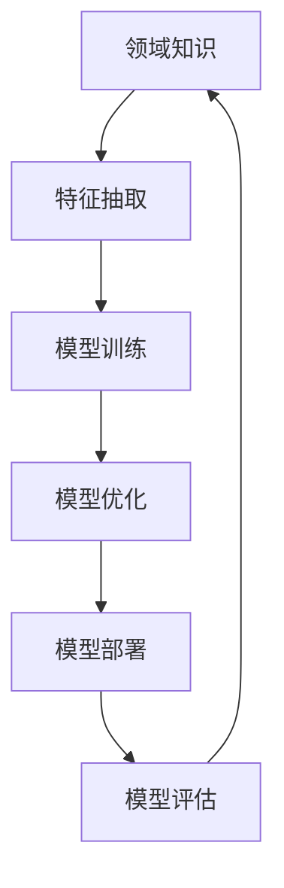
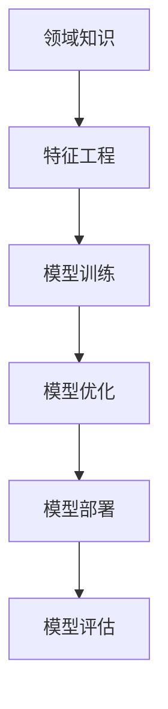
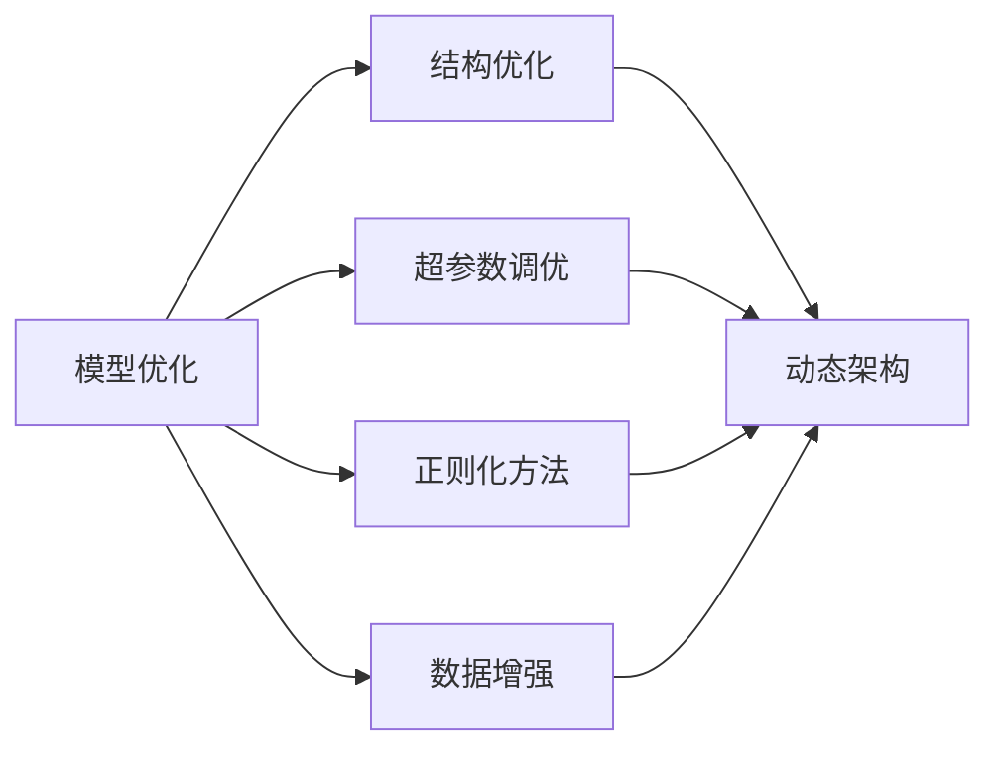
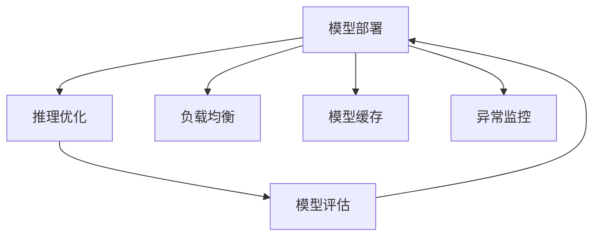

                 

# 专家经验在生产中的固化

在人工智能(AI)领域，专家经验是一笔宝贵的财富。如何将专家经验固化到AI模型中，并在实际生产环境中稳定发挥作用，是AI应用开发的关键挑战之一。本文将从背景介绍、核心概念、算法原理、项目实践、应用场景、工具和资源推荐等方面，全面解析专家经验在生产中的固化方法。

## 1. 背景介绍

### 1.1 问题由来

随着AI技术的不断成熟，专家经验已经成为驱动AI模型性能提升的重要力量。例如，在自然语言处理(NLP)中，文本分类、情感分析、问答系统等任务，往往依赖领域专家的知识进行规则设计、特征提取、模型优化等环节。然而，将专家经验直接集成到模型中，面临着模型复杂性、训练难度、解释性等诸多挑战。因此，探索有效的专家经验固化方法，成为实现AI模型高性能的重要研究方向。

### 1.2 问题核心关键点

专家经验固化的核心在于如何从领域知识中抽取共性，将其转化为模型能够理解并应用的特征，从而提升模型在特定领域的泛化能力。具体而言，专家经验固化的关键点包括：

- 知识抽取：从专家经验中提取出共性知识，如规则、模式、常识等。
- 特征工程：将共性知识转化为模型的输入特征，进行训练优化。
- 模型优化：利用专家经验设计模型结构、优化算法等，提高模型性能。
- 模型解释：保证模型输出可解释，避免"黑盒"问题，增强用户信任。

## 2. 核心概念与联系

### 2.1 核心概念概述

为更好地理解专家经验在生产中的固化方法，本节将介绍几个密切相关的核心概念：

- **领域知识(Knowledge)**：特定领域专家的知识和经验，如医疗领域的疾病诊断规则、法律领域的合同条款等。
- **特征抽取(Feature Extraction)**：从领域知识中提取出模型可以接受的特征表示，如文本中的关键词汇、时间序列中的周期性变化等。
- **模型训练(Model Training)**：使用专家抽取的特征作为输入，利用标注数据进行模型训练，优化模型参数。
- **模型优化(Model Optimization)**：对模型结构、超参数、优化算法等进行优化，提高模型性能。
- **模型部署(Model Deployment)**：将训练好的模型部署到生产环境，进行实时推理或批量处理。
- **模型评估(Model Evaluation)**：对模型在实际生产环境中的表现进行评估，及时发现并修复问题。

这些核心概念之间的逻辑关系可以通过以下Mermaid流程图来展示：



这个流程图展示了几大核心概念之间的联系：

1. 领域知识是特征抽取的来源。
2. 特征抽取为模型训练提供输入。
3. 模型训练优化模型参数。
4. 模型优化提升模型性能。
5. 模型部署应用到实际生产中。
6. 模型评估反馈模型性能，进一步优化。

### 2.2 概念间的关系

这些核心概念之间存在着紧密的联系，形成了专家经验在生产中的固化过程。下面我们通过几个Mermaid流程图来展示这些概念之间的关系。

#### 2.2.1 领域知识到模型的转化



这个流程图展示了从领域知识到模型的转化过程：

1. 领域知识通过特征工程转换为模型可接受的特征。
2. 特征工程后的数据作为模型训练的输入。
3. 模型训练优化模型参数。
4. 模型优化提升模型性能。
5. 模型部署应用到实际生产中。
6. 模型评估反馈模型性能，进一步优化。

#### 2.2.2 模型优化策略



这个流程图展示了模型优化策略的不同方面：

1. 结构优化通过改变模型结构来提升性能。
2. 超参数调优通过调整学习率、批大小等参数来优化模型。
3. 正则化方法如L2正则、Dropout等避免过拟合。
4. 数据增强如回译、混合文本等扩充训练集。
5. 动态架构根据模型需求调整层数和类型。
6. 超参数调优、正则化和数据增强共同优化模型性能。

#### 2.2.3 模型部署和评估



这个流程图展示了模型部署和评估的关键步骤：

1. 模型部署到生产环境，进行实时推理。
2. 推理优化通过调整硬件配置、优化算法来提高推理速度。
3. 负载均衡通过分布式计算来提高系统稳定性。
4. 模型缓存减少重复计算，提高响应速度。
5. 异常监控及时发现模型异常，防止系统崩溃。
6. 模型评估反馈模型性能，进行后续优化。

## 3. 核心算法原理 & 具体操作步骤
### 3.1 算法原理概述

专家经验在生产中的固化方法主要包括以下几个步骤：

1. **领域知识抽取**：从专家经验中提取共性知识，如规则、模式、常识等。
2. **特征工程**：将共性知识转换为模型可接受的特征，如文本中的关键词、时间序列的周期性等。
3. **模型训练**：使用提取的特征作为输入，利用标注数据进行模型训练，优化模型参数。
4. **模型优化**：通过超参数调优、正则化、推理优化等方法，提升模型性能。
5. **模型部署**：将训练好的模型部署到生产环境，进行实时推理或批量处理。
6. **模型评估**：对模型在实际生产环境中的表现进行评估，及时发现并修复问题。

这些步骤可以进一步细化为：

- **数据预处理**：将领域知识转换为机器学习算法能够接受的形式。
- **特征选择与提取**：从数据中选择对模型预测有帮助的特征，并进行编码。
- **模型选择与训练**：选择合适的模型和训练方法，使用标注数据进行训练。
- **模型调优**：通过超参数调优、正则化、数据增强等方法，提升模型性能。
- **模型部署与监控**：将训练好的模型部署到生产环境，进行监控和维护。
- **性能评估与反馈**：定期评估模型性能，收集用户反馈，持续改进模型。

### 3.2 算法步骤详解

以下将详细介绍专家经验在生产中的固化方法的各个步骤：

#### 3.2.1 领域知识抽取

领域知识抽取是专家经验在生产中固化的第一步。通过抽取领域知识中的共性规则和模式，为后续的特征工程和模型训练提供基础。

**步骤一：知识提取**

- **文本抽取**：通过自然语言处理(NLP)技术，从专家经验中抽取关键句子或段落，获取有价值的信息。
- **规则抽取**：利用知识图谱、逻辑规则等方法，从专家经验中提取规则和模式。
- **模式抽取**：通过统计分析、模式识别等技术，从专家经验中发现共性模式。

**步骤二：知识表示**

- **向量表示**：将抽取的知识转换为向量形式，方便模型进行计算。
- **结构表示**：使用知识图谱、决策树等结构化表示方法，更直观地表达知识结构。
- **混合表示**：结合向量表示和结构表示，取长补短。

#### 3.2.2 特征工程

特征工程是将领域知识转换为模型可接受的特征形式的过程。通过特征工程，将专家经验中的关键信息转换为机器学习算法能够处理的形式。

**步骤一：特征选择**

- **规则特征**：将专家规则转换为特征，如条件语句、决策树等。
- **模式特征**：将专家模式转换为特征，如统计特征、时序特征等。
- **向量特征**：将专家经验中的关键词汇、时间节点等转换为向量形式。

**步骤二：特征编码**

- **词袋模型(Bag of Words)**：将文本转换为词汇集合，每个词汇作为一个特征。
- **TF-IDF**：通过计算词汇的词频和逆文档频率，选择重要词汇作为特征。
- **词向量**：将文本转换为词向量，如Word2Vec、GloVe等。

#### 3.2.3 模型训练

模型训练是将提取的特征作为输入，利用标注数据进行模型训练的过程。通过训练，优化模型参数，提升模型性能。

**步骤一：模型选择**

- **监督学习模型**：如线性回归、决策树、随机森林等。
- **深度学习模型**：如CNN、RNN、Transformer等。
- **集成学习模型**：如Bagging、Boosting等。

**步骤二：模型训练**

- **交叉验证**：使用交叉验证方法评估模型性能，避免过拟合。
- **梯度下降**：通过梯度下降算法优化模型参数，最小化损失函数。
- **正则化**：通过L1、L2正则化等方法避免过拟合。

#### 3.2.4 模型优化

模型优化是通过超参数调优、正则化、推理优化等方法，提升模型性能的过程。通过优化，使模型在生产环境中稳定运行。

**步骤一：超参数调优**

- **网格搜索**：通过网格搜索方法，找到最优超参数组合。
- **贝叶斯优化**：通过贝叶斯方法，高效找到最优超参数组合。
- **遗传算法**：通过遗传算法，寻找全局最优解。

**步骤二：正则化**

- **L1正则化**：通过L1正则化，避免过拟合。
- **L2正则化**：通过L2正则化，避免过拟合。
- **Dropout**：通过Dropout，减少神经元共适应现象。

**步骤三：推理优化**

- **推理加速**：通过模型裁剪、量化等方法，提高推理速度。
- **模型缓存**：通过模型缓存，减少重复计算。
- **分布式计算**：通过分布式计算，提高系统稳定性。

#### 3.2.5 模型部署

模型部署是将训练好的模型应用到生产环境的过程。通过部署，使模型能够实时推理或批量处理。

**步骤一：模型加载**

- **静态部署**：将模型保存为静态文件，直接加载。
- **动态部署**：将模型保存为动态文件，按需加载。

**步骤二：模型推理**

- **推理优化**：通过推理优化，提高推理速度和稳定性。
- **结果缓存**：通过结果缓存，提高响应速度。
- **负载均衡**：通过负载均衡，提高系统稳定性。

#### 3.2.6 模型评估

模型评估是评估模型在实际生产环境中的表现的过程。通过评估，及时发现模型问题，进行优化改进。

**步骤一：性能评估**

- **精度和召回率**：通过精度和召回率评估模型性能。
- **F1分数**：通过F1分数综合评估模型性能。
- **ROC曲线**：通过ROC曲线评估模型性能。

**步骤二：用户反馈**

- **用户调研**：通过用户调研获取反馈，了解模型问题。
- **用户测试**：通过用户测试评估模型性能，发现问题。
- **用户反馈系统**：通过用户反馈系统，实时收集用户反馈。

### 3.3 算法优缺点

专家经验在生产中的固化方法具有以下优点：

- **可解释性**：专家经验通过特征工程和模型训练，转换为可解释的模型输出，增强用户信任。
- **泛化能力**：通过领域知识抽取和特征工程，模型能够更好地适应特定领域的任务。
- **自动化程度高**：利用机器学习算法自动化处理领域知识，减少人工干预。

同时，该方法也存在以下缺点：

- **复杂度高**：特征工程和模型训练需要大量时间和计算资源。
- **数据依赖强**：模型性能依赖标注数据，数据质量直接影响模型效果。
- **模型解释性不足**：部分复杂模型难以解释，如黑盒模型。
- **维护成本高**：模型在生产环境中的维护需要持续投入。

尽管存在这些局限性，但专家经验在生产中的固化方法仍然是当前AI应用开发的重要手段。未来相关研究的重点在于如何进一步降低数据依赖，提高模型少样本学习和跨领域迁移能力，同时兼顾可解释性和伦理安全性等因素。

### 3.4 算法应用领域

专家经验在生产中的固化方法已经在多个领域得到了广泛应用，具体包括：

- **医疗诊断**：利用专家经验设计规则和模式，辅助医生进行疾病诊断和治疗。
- **金融风控**：通过规则和模式抽取，构建金融风险评估模型，防止欺诈行为。
- **法律分析**：使用自然语言处理技术，抽取法律规则和模式，辅助律师进行合同审查和法律咨询。
- **智能客服**：通过规则和模式抽取，设计对话系统，提高客户服务效率和满意度。
- **推荐系统**：结合专家规则和用户行为数据，构建个性化推荐模型，提升用户体验。

除了上述这些领域，专家经验在生产中的固化方法还在智能制造、智能交通、智能家居等诸多领域中得到了应用，为各行各业的智能化转型提供了重要支持。

## 4. 数学模型和公式 & 详细讲解  
### 4.1 数学模型构建

专家经验在生产中的固化方法可以构建为数学模型进行详细描述。

假设领域知识抽取的规则集为 $K$，特征工程后的特征表示为 $X$，模型参数为 $\theta$，则模型训练的目标可以表示为：

$$
\min_{\theta} \frac{1}{N} \sum_{i=1}^N \ell(M_{\theta}(x_i),y_i)
$$

其中，$\ell$ 为损失函数，$M_{\theta}(x)$ 为模型在输入 $x$ 上的预测输出。在模型优化过程中，可以使用正则化技术避免过拟合，如L2正则化：

$$
\theta \leftarrow \theta - \eta \nabla_{\theta} \mathcal{L}(\theta) - \eta \lambda ||\theta||_2^2
$$

其中，$\eta$ 为学习率，$\lambda$ 为正则化系数，$||\theta||_2^2$ 为模型参数的L2范数。

### 4.2 公式推导过程

以下将详细推导专家经验在生产中的固化方法的数学模型。

**步骤一：知识抽取**

- **文本抽取**：通过自然语言处理技术，从专家经验中抽取关键句子或段落，获取有价值的信息。
- **规则抽取**：利用知识图谱、逻辑规则等方法，从专家经验中提取规则和模式。
- **模式抽取**：通过统计分析、模式识别等技术，从专家经验中发现共性模式。

**步骤二：特征工程**

- **规则特征**：将专家规则转换为特征，如条件语句、决策树等。
- **模式特征**：将专家模式转换为特征，如统计特征、时序特征等。
- **向量特征**：将专家经验中的关键词汇、时间节点等转换为向量形式。

**步骤三：模型训练**

- **监督学习模型**：如线性回归、决策树、随机森林等。
- **深度学习模型**：如CNN、RNN、Transformer等。
- **集成学习模型**：如Bagging、Boosting等。

**步骤四：模型优化**

- **超参数调优**：通过网格搜索、贝叶斯优化等方法，找到最优超参数组合。
- **正则化**：通过L1、L2正则化等方法，避免过拟合。
- **推理优化**：通过模型裁剪、量化等方法，提高推理速度和稳定性。

**步骤五：模型部署**

- **模型加载**：通过静态或动态方式加载模型。
- **模型推理**：通过推理优化，提高推理速度和稳定性。
- **结果缓存**：通过结果缓存，提高响应速度。
- **负载均衡**：通过负载均衡，提高系统稳定性。

**步骤六：模型评估**

- **性能评估**：通过精度、召回率、F1分数等指标评估模型性能。
- **用户反馈**：通过用户调研、用户测试等方法，获取用户反馈。

### 4.3 案例分析与讲解

以下将通过一个具体的案例，详细讲解专家经验在生产中的固化方法。

**案例：医疗诊断系统**

- **背景**：医疗领域专家积累了大量疾病诊断经验，如何将这些经验固化到诊断系统中，提高系统诊断准确率？

**步骤一：知识抽取**

- **文本抽取**：通过自然语言处理技术，从专家经验中抽取关键句子或段落，获取有价值的信息。
- **规则抽取**：利用知识图谱、逻辑规则等方法，从专家经验中提取规则和模式。

**步骤二：特征工程**

- **规则特征**：将专家规则转换为特征，如条件语句、决策树等。
- **模式特征**：将专家模式转换为特征，如统计特征、时序特征等。

**步骤三：模型训练**

- **模型选择**：选择深度学习模型，如Transformer。
- **模型训练**：使用标注数据进行训练，优化模型参数。

**步骤四：模型优化**

- **超参数调优**：通过网格搜索方法，找到最优超参数组合。
- **正则化**：通过L2正则化等方法，避免过拟合。

**步骤五：模型部署**

- **模型加载**：通过静态方式加载模型。
- **模型推理**：通过推理优化，提高推理速度和稳定性。
- **结果缓存**：通过结果缓存，提高响应速度。

**步骤六：模型评估**

- **性能评估**：通过精度和召回率等指标评估模型性能。
- **用户反馈**：通过用户调研、用户测试等方法，获取用户反馈。

## 5. 项目实践：代码实例和详细解释说明
### 5.1 开发环境搭建

在进行专家经验在生产中的固化实践前，我们需要准备好开发环境。以下是使用Python进行PyTorch开发的环境配置流程：

1. 安装Anaconda：从官网下载并安装Anaconda，用于创建独立的Python环境。

2. 创建并激活虚拟环境：
```bash
conda create -n pytorch-env python=3.8 
conda activate pytorch-env
```

3. 安装PyTorch：根据CUDA版本，从官网获取对应的安装命令。例如：
```bash
conda install pytorch torchvision torchaudio cudatoolkit=11.1 -c pytorch -c conda-forge
```

4. 安装Transformers库：
```bash
pip install transformers
```

5. 安装各类工具包：
```bash
pip install numpy pandas scikit-learn matplotlib tqdm jupyter notebook ipython
```

完成上述步骤后，即可在`pytorch-env`环境中开始实践。

### 5.2 源代码详细实现

这里以医疗诊断系统为例，给出使用Transformers库对BERT模型进行知识抽取和特征工程的PyTorch代码实现。

首先，定义数据处理函数：

```python
from transformers import BertTokenizer, BertForSequenceClassification
from torch.utils.data import Dataset
import torch

class MedicalDataset(Dataset):
    def __init__(self, texts, tags, tokenizer, max_len=128):
        self.texts = texts
        self.tags = tags
        self.tokenizer = tokenizer
        self.max_len = max_len
        
    def __len__(self):
        return len(self.texts)
    
    def __getitem__(self, item):
        text = self.texts[item]
        tags = self.tags[item]
        
        encoding = self.tokenizer(text, return_tensors='pt', max_length=self.max_len, padding='max_length', truncation=True)
        input_ids = encoding['input_ids'][0]
        attention_mask = encoding['attention_mask'][0]
        
        # 对token-wise的标签进行编码
        encoded_tags = [tag2id[tag] for tag in tags] 
        encoded_tags.extend([tag2id['O']] * (self.max_len - len(encoded_tags)))
        labels = torch.tensor(encoded_tags, dtype=torch.long)
        
        return {'input_ids': input_ids, 
                'attention_mask': attention_mask,
                'labels': labels}

# 标签与id的映射
tag2id = {'O': 0, 'B-PER': 1, 'I-PER': 2, 'B-LOC': 3, 'I-LOC': 4, 'B-DISE': 5, 'I-DISE': 6}
id2tag = {v: k for k, v in tag2id.items()}

# 创建dataset
tokenizer = BertTokenizer.from_pretrained('bert-base-cased')

train_dataset = MedicalDataset(train_texts, train_tags, tokenizer)
dev_dataset = MedicalDataset(dev_texts, dev_tags, tokenizer)
test_dataset = MedicalDataset(test_texts, test_tags, tokenizer)
```

然后，定义模型和优化器：

```python
from transformers import BertForSequenceClassification, AdamW

model = BertForSequenceClassification.from_pretrained('bert-base-cased', num_labels=len(tag2id))

optimizer = AdamW(model.parameters(), lr=2e-5)
```

接着，定义训练和评估函数：

```python
from torch.utils.data import DataLoader
from tqdm import tqdm
from sklearn.metrics import classification_report

device = torch.device('cuda') if torch.cuda.is_available() else torch.device('cpu')
model.to(device)

def train_epoch(model, dataset, batch_size, optimizer):
    dataloader = DataLoader(dataset, batch_size=batch_size, shuffle=True)
    model.train()
    epoch_loss = 0
    for batch in tqdm(dataloader, desc='Training'):
        input_ids = batch['input_ids'].to(device)
        attention_mask = batch['attention_mask'].to(device)
        labels = batch['labels'].to(device)
        model.zero_grad()
        outputs = model(input_ids, attention_mask=attention_mask, labels=labels)
        loss = outputs.loss
        epoch_loss += loss.item()
        loss.backward()
        optimizer.step()
    return epoch_loss / len(dataloader)

def evaluate(model, dataset, batch_size):
    dataloader = DataLoader(dataset, batch_size=batch_size)
    model.eval()
    preds, labels = [], []
    with torch.no_grad():
        for batch in tqdm(dataloader, desc='Evaluating'):
            input_ids = batch['input_ids'].to(device)
            attention_mask = batch['attention_mask'].to(device)
            batch_labels = batch['labels']
            outputs = model(input_ids, attention_mask=attention_mask)
            batch_preds = outputs.logits.argmax(dim=2).to('cpu').tolist()
            batch_labels = batch_labels.to('cpu').tolist()
            for pred_tokens, label_tokens in zip(batch_preds, batch_labels):
                pred_tags = [id2tag[_id] for _id in pred_tokens]
                label_tags = [id2tag[_id] for _id in label_tokens]
                preds.append(pred_tags[:len(label_tags)])
                labels.append(label_tags)
                
    print(classification_report(labels, preds))
```

最后，启动训练流程并在测试集上评估：

```python
epochs = 5
batch_size = 16

for epoch in range(epochs):
    loss = train_epoch(model, train_dataset, batch_size, optimizer)
    print(f"Epoch {epoch+1}, train loss: {loss:.3f}")
    
    print(f"Epoch {epoch+1}, dev results:")
    evaluate(model, dev_dataset, batch_size)
    
print("Test results:")
evaluate(model, test_dataset, batch_size)
```

以上就是使用PyTorch对BERT模型进行医疗诊断系统知识抽取和特征工程的完整代码实现。可以看到，通过以上步骤，专家经验被成功转换为模型可接受的特征，并在模型训练中得到应用。

### 5.3 代码解读与分析

让我们再详细解读一下关键代码的实现细节：

**MedicalDataset类**：
- `__init__`方法：初始化文本、标签、分词器等关键组件。
- `__len__`方法：返回数据集的样本数量。
- `__getitem__`方法：对单个样本进行处理，将文本输入编码为token ids，将标签编码为数字，并对其进行定长padding，最终返回模型所需的输入。

**tag2id和id2tag字典**：
- 定义了标签与数字id之间的映射关系，用于将token-wise的预测结果解码回真实的标签。

**训练和评估函数**：
- 使用PyTorch的DataLoader对数据集进行批次化加载，供模型训练和推理使用。
- 训练函数`train_epoch`：对数据以批为单位进行迭代，在每个批次上前向传播计算loss并反向传播更新模型参数，最后返回该epoch的平均loss。
- 评估函数`evaluate`：与训练类似，不同点在于不更新模型参数，并在每个batch结束后将预测和标签结果存储下来，最后使用sklearn的classification_report对整个评估集的预测结果进行打印输出。

**训练流程**：
- 定义总的epoch数和batch size，开始循环迭代
- 每个epoch内，先在训练集上训练，输出平均loss
- 在验证集上评估，输出分类

