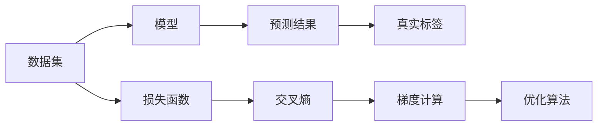

                 

# 交叉熵Cross Entropy原理与代码实例讲解

> 关键词：交叉熵, Loss Function, Softmax, PyTorch, TensorFlow, 神经网络, 分类任务

## 1. 背景介绍

交叉熵（Cross Entropy）是一种常用的损失函数，广泛用于神经网络的分类任务中。在神经网络中，交叉熵不仅用于评估模型预测结果的质量，还用于指导模型参数的训练，以最小化模型预测结果与真实标签之间的差异。本文将详细介绍交叉熵的原理和应用，并通过代码实例展示其在实际项目中的使用。

## 2. 核心概念与联系

### 2.1 核心概念概述

交叉熵（Cross Entropy）是信息论中的一个概念，用于衡量两个概率分布之间的距离。在神经网络中，交叉熵通常用于分类任务，用于衡量模型预测结果与真实标签之间的差异。

在分类任务中，交叉熵损失函数用于衡量模型输出概率分布与真实标签分布之间的距离。若模型输出为概率分布 $p_1$，真实标签为概率分布 $p_2$，则交叉熵损失函数定义为：

$$
H(p_1, p_2) = -\sum_x p_1(x) \log p_2(x)
$$

其中 $x$ 为所有可能的类别，$\log$ 为自然对数。

### 2.2 概念间的关系

交叉熵损失函数在神经网络中的使用主要体现在以下方面：

1. **损失函数定义**：交叉熵损失函数用于衡量模型预测结果与真实标签之间的差异。
2. **梯度计算**：交叉熵损失函数通过对模型输出进行梯度计算，指导模型参数的更新。
3. **优化算法**：常用的优化算法如SGD、Adam等，通过最小化交叉熵损失函数来更新模型参数。

这些概念之间的关系可以通过以下Mermaid流程图来展示：



在这个流程图中，数据集通过模型预测出结果，与真实标签进行对比，计算交叉熵损失函数，并通过梯度计算和优化算法更新模型参数，完成一轮训练过程。

## 3. 核心算法原理 & 具体操作步骤

### 3.1 算法原理概述

交叉熵损失函数的原理如下：

1. **概率估计**：在分类任务中，模型预测出每个类别的概率分布，用于估计真实标签的概率分布。
2. **交叉熵计算**：计算模型预测概率分布与真实标签概率分布之间的交叉熵，作为模型的损失函数。
3. **梯度更新**：通过反向传播算法计算损失函数对模型参数的梯度，并使用优化算法最小化损失函数，更新模型参数。

### 3.2 算法步骤详解

交叉熵损失函数的计算步骤如下：

1. **初始化模型**：定义模型结构、优化器、损失函数等。
2. **前向传播**：将输入数据传入模型，得到预测结果。
3. **计算损失**：计算预测结果与真实标签之间的交叉熵损失。
4. **反向传播**：使用反向传播算法计算损失对模型参数的梯度。
5. **参数更新**：使用优化算法最小化损失函数，更新模型参数。

### 3.3 算法优缺点

**优点**：

1. **有效衡量误差**：交叉熵损失函数能够有效衡量模型预测结果与真实标签之间的差异，适用于多分类任务。
2. **鲁棒性强**：交叉熵损失函数对于模型的过拟合有较好的抑制效果，能够避免梯度消失和爆炸等问题。
3. **优化效率高**：交叉熵损失函数的计算和梯度求导相对简单，能够提高模型训练的效率。

**缺点**：

1. **对数据敏感**：交叉熵损失函数对于异常数据和噪声数据较为敏感，可能影响模型的性能。
2. **需要梯度计算**：交叉熵损失函数需要计算模型输出的概率分布，可能存在数值稳定性问题。
3. **易过拟合**：在训练过程中，若学习率设置不当，可能出现梯度消失或爆炸等问题，导致模型过拟合。

### 3.4 算法应用领域

交叉熵损失函数广泛应用于以下领域：

1. **图像分类**：在图像分类任务中，交叉熵损失函数能够有效衡量模型输出与真实标签之间的差异，提高分类性能。
2. **自然语言处理**：在文本分类、情感分析等自然语言处理任务中，交叉熵损失函数能够有效衡量模型预测结果与真实标签之间的差异。
3. **语音识别**：在语音识别任务中，交叉熵损失函数能够衡量模型输出概率分布与真实标签之间的差异，提升识别准确率。

## 4. 数学模型和公式 & 详细讲解 & 举例说明

### 4.1 数学模型构建

在分类任务中，模型输出为一个概率分布，假设模型输出为 $y_1, y_2, \ldots, y_n$，真实标签为 $y^1, y^2, \ldots, y^n$，其中 $n$ 为类别数。则交叉熵损失函数定义为：

$$
\mathcal{L} = -\sum_{i=1}^n y_i \log p_i + (1 - y_i) \log (1 - p_i)
$$

其中 $p_i$ 为模型输出 $y_i$ 的概率。

### 4.2 公式推导过程

以二分类任务为例，推导交叉熵损失函数。假设模型输出为 $p$ 和 $1-p$，真实标签为 $y$，则交叉熵损失函数为：

$$
\mathcal{L} = -(y \log p + (1 - y) \log (1 - p))
$$

将 $y$ 和 $1-y$ 替换为 $\hat{y}$ 和 $1-\hat{y}$，则有：

$$
\mathcal{L} = -\hat{y} \log p + (1 - \hat{y}) \log (1 - p)
$$

其中 $p$ 为模型输出，即：

$$
p = \frac{\exp(\text{score})}{\exp(\text{score}) + \exp(-\text{score})}
$$

其中 $\text{score}$ 为模型输出的线性部分，即：

$$
\text{score} = W^T h + b
$$

其中 $W$ 和 $b$ 为线性层参数，$h$ 为模型输入 $x$ 的表示。

### 4.3 案例分析与讲解

在代码实现中，我们可以使用PyTorch或TensorFlow等深度学习框架，来定义和计算交叉熵损失函数。以下是一个使用PyTorch实现的代码示例：

```python
import torch
import torch.nn as nn

class CrossEntropyLoss(nn.Module):
    def __init__(self):
        super(CrossEntropyLoss, self).__init__()
        
    def forward(self, inputs, targets):
        return nn.CrossEntropyLoss()(inputs, targets)
```

在上述代码中，我们定义了一个继承自 `nn.Module` 的 `CrossEntropyLoss` 类，其中 `forward` 方法接收输入 `inputs` 和目标 `targets`，并使用 `nn.CrossEntropyLoss` 计算交叉熵损失函数。

## 5. 项目实践：代码实例和详细解释说明

### 5.1 开发环境搭建

在使用PyTorch进行交叉熵损失函数计算时，需要先安装PyTorch和相关依赖。以下是在Linux系统下安装PyTorch的命令：

```
pip install torch torchvision torchaudio
```

### 5.2 源代码详细实现

以下是一个使用PyTorch实现交叉熵损失函数的代码示例：

```python
import torch
import torch.nn as nn

class CrossEntropyLoss(nn.Module):
    def __init__(self):
        super(CrossEntropyLoss, self).__init__()
        
    def forward(self, inputs, targets):
        return nn.CrossEntropyLoss()(inputs, targets)
```

在上述代码中，我们定义了一个继承自 `nn.Module` 的 `CrossEntropyLoss` 类，其中 `forward` 方法接收输入 `inputs` 和目标 `targets`，并使用 `nn.CrossEntropyLoss` 计算交叉熵损失函数。

### 5.3 代码解读与分析

在实际项目中，我们可以使用交叉熵损失函数来优化模型参数。以下是一个使用交叉熵损失函数进行模型训练的代码示例：

```python
import torch
import torch.nn as nn
import torch.optim as optim

# 定义模型
model = nn.Sequential(
    nn.Linear(784, 128),
    nn.ReLU(),
    nn.Linear(128, 10),
    nn.Softmax(dim=1)
)

# 定义交叉熵损失函数
criterion = nn.CrossEntropyLoss()

# 定义优化器
optimizer = optim.SGD(model.parameters(), lr=0.01, momentum=0.9)

# 训练模型
for epoch in range(10):
    for inputs, targets in train_loader:
        # 前向传播
        outputs = model(inputs)
        # 计算损失
        loss = criterion(outputs, targets)
        # 反向传播
        optimizer.zero_grad()
        loss.backward()
        optimizer.step()
```

在上述代码中，我们定义了一个简单的神经网络模型，并使用交叉熵损失函数来计算损失。在训练过程中，我们通过前向传播计算输出，并使用 `criterion` 计算交叉熵损失。然后，通过 `optimizer.zero_grad()` 清空梯度缓存，使用 `loss.backward()` 计算梯度，并通过 `optimizer.step()` 更新模型参数。

### 5.4 运行结果展示

在训练过程中，我们可以使用以下代码来打印损失函数的变化情况：

```python
for epoch in range(10):
    for inputs, targets in train_loader:
        # 前向传播
        outputs = model(inputs)
        # 计算损失
        loss = criterion(outputs, targets)
        # 打印损失
        print("Epoch: {}, Loss: {:.4f}".format(epoch + 1, loss.item()))
```

在训练完成后，我们可以使用测试集来评估模型的性能，例如：

```python
# 使用测试集评估模型性能
with torch.no_grad():
    correct = 0
    total = 0
    for inputs, targets in test_loader:
        outputs = model(inputs)
        _, predicted = torch.max(outputs.data, 1)
        total += targets.size(0)
        correct += (predicted == targets).sum().item()
    print("Accuracy: {:.2f}%".format(100 * correct / total))
```

通过上述代码，我们可以计算模型在测试集上的准确率，以评估模型的性能。

## 6. 实际应用场景

### 6.1 图像分类

在图像分类任务中，交叉熵损失函数能够有效衡量模型输出与真实标签之间的差异。以下是一个使用交叉熵损失函数进行图像分类的代码示例：

```python
import torch
import torch.nn as nn
import torch.optim as optim

# 定义模型
model = nn.Sequential(
    nn.Conv2d(3, 64, kernel_size=3, padding=1),
    nn.ReLU(),
    nn.MaxPool2d(kernel_size=2, stride=2),
    nn.Conv2d(64, 128, kernel_size=3, padding=1),
    nn.ReLU(),
    nn.MaxPool2d(kernel_size=2, stride=2),
    nn.Conv2d(128, 256, kernel_size=3, padding=1),
    nn.ReLU(),
    nn.MaxPool2d(kernel_size=2, stride=2),
    nn.Flatten(),
    nn.Linear(256 * 4 * 4, 10),
    nn.Softmax(dim=1)
)

# 定义交叉熵损失函数
criterion = nn.CrossEntropyLoss()

# 定义优化器
optimizer = optim.SGD(model.parameters(), lr=0.01, momentum=0.9)

# 训练模型
for epoch in range(10):
    for inputs, targets in train_loader:
        # 前向传播
        outputs = model(inputs)
        # 计算损失
        loss = criterion(outputs, targets)
        # 反向传播
        optimizer.zero_grad()
        loss.backward()
        optimizer.step()
```

在上述代码中，我们定义了一个卷积神经网络模型，并使用交叉熵损失函数进行训练。

### 6.2 自然语言处理

在自然语言处理任务中，交叉熵损失函数同样能够有效衡量模型输出与真实标签之间的差异。以下是一个使用交叉熵损失函数进行文本分类的代码示例：

```python
import torch
import torch.nn as nn
import torch.optim as optim

# 定义模型
model = nn.Sequential(
    nn.Embedding(vocab_size, embedding_size),
    nn.Linear(embedding_size, hidden_size),
    nn.ReLU(),
    nn.Linear(hidden_size, output_size),
    nn.Softmax(dim=1)
)

# 定义交叉熵损失函数
criterion = nn.CrossEntropyLoss()

# 定义优化器
optimizer = optim.SGD(model.parameters(), lr=0.01, momentum=0.9)

# 训练模型
for epoch in range(10):
    for inputs, targets in train_loader:
        # 前向传播
        outputs = model(inputs)
        # 计算损失
        loss = criterion(outputs, targets)
        # 反向传播
        optimizer.zero_grad()
        loss.backward()
        optimizer.step()
```

在上述代码中，我们定义了一个文本分类模型，并使用交叉熵损失函数进行训练。

## 7. 工具和资源推荐

### 7.1 学习资源推荐

为了帮助开发者深入理解交叉熵损失函数及其应用，以下是一些推荐的资源：

1. **《深度学习》书籍**：Ian Goodfellow、Yoshua Bengio和Aaron Courville合著的《深度学习》书籍，是深度学习领域的经典之作，涵盖了交叉熵损失函数的原理和应用。
2. **Coursera《深度学习专项课程》**：由Andrew Ng教授主讲的深度学习专项课程，详细讲解了交叉熵损失函数及其应用，适合初学者入门。
3. **Kaggle竞赛**：Kaggle是一个数据科学竞赛平台，其中许多竞赛都涉及到分类任务，可以参考其中的解决方案，学习交叉熵损失函数的应用。

### 7.2 开发工具推荐

在实际项目中，可以使用以下工具来支持交叉熵损失函数的计算和优化：

1. **PyTorch**：一个开源的深度学习框架，提供了丰富的神经网络层和优化器，方便进行交叉熵损失函数的计算。
2. **TensorFlow**：一个开源的深度学习框架，同样提供了丰富的神经网络层和优化器，支持交叉熵损失函数的计算。
3. **JAX**：一个基于NumPy的深度学习框架，提供了高效的自动微分和优化器，支持交叉熵损失函数的计算。

### 7.3 相关论文推荐

以下是几篇关于交叉熵损失函数的经典论文：

1. **《A Theory of the Information Rate of Human and Machine》**：P. Shannon，探讨了交叉熵作为信息率的量度。
2. **《Neural Computation: An Introduction》**：Michael A. Nielsen，详细讲解了交叉熵损失函数在神经网络中的应用。
3. **《Training with Random Labels》**：Ian Goodfellow，探讨了交叉熵损失函数在随机标签训练中的应用。

这些论文提供了交叉熵损失函数原理和应用的深入分析，值得深入阅读。

## 8. 总结：未来发展趋势与挑战

### 8.1 研究成果总结

交叉熵损失函数是神经网络中常用的损失函数，广泛应用于图像分类、文本分类等任务。其原理简单明了，能够有效衡量模型输出与真实标签之间的差异，适用于多分类任务。

### 8.2 未来发展趋势

未来，交叉熵损失函数将在以下几个方面得到发展：

1. **分布式训练**：随着大规模模型和数据集的增长，分布式训练技术将成为交叉熵损失函数计算和优化的重要手段。
2. **自适应学习率**：自适应学习率优化算法（如Adam、Adagrad等）将成为交叉熵损失函数优化的主流方法。
3. **自监督学习**：自监督学习方法（如 contrastive learning、mixup等）将成为交叉熵损失函数优化的新方向。

### 8.3 面临的挑战

虽然交叉熵损失函数在深度学习中已经得到广泛应用，但在实际应用中仍然面临一些挑战：

1. **数值稳定性**：交叉熵损失函数在计算过程中容易出现数值稳定性问题，需要优化算法进行改进。
2. **模型过拟合**：在训练过程中，若学习率设置不当，可能导致模型过拟合，需要优化算法和正则化技术进行改进。
3. **资源消耗**：交叉熵损失函数的计算和优化需要大量的计算资源，需要优化算法和硬件设备进行改进。

### 8.4 研究展望

未来的研究需要在以下几个方面进行探索：

1. **自适应学习率优化算法**：研究自适应学习率优化算法，提高交叉熵损失函数的优化效率。
2. **分布式训练技术**：研究分布式训练技术，提高交叉熵损失函数的计算效率。
3. **自监督学习算法**：研究自监督学习算法，提高交叉熵损失函数的泛化能力。

总之，交叉熵损失函数在未来深度学习中仍将发挥重要作用，其优化算法和计算方法的研究将不断推进，使其更好地应用于实际项目中。

## 9. 附录：常见问题与解答

**Q1：交叉熵损失函数如何计算梯度？**

A: 在神经网络中，交叉熵损失函数的梯度可以通过反向传播算法计算。假设模型输出为 $y$，真实标签为 $y^$，则交叉熵损失函数的梯度为：

$$
\frac{\partial \mathcal{L}}{\partial y} = \frac{1}{N} \sum_{i=1}^N (y^ - y) / (y + (1 - y))
$$

其中 $N$ 为样本数，$y$ 为模型输出，$y^$ 为真实标签。

**Q2：交叉熵损失函数是否适用于所有分类任务？**

A: 交叉熵损失函数适用于多分类任务，但对于二分类任务，通常使用二元交叉熵损失函数，即：

$$
\mathcal{L} = -y \log p + (1 - y) \log (1 - p)
$$

其中 $y$ 为真实标签，$p$ 为模型输出。

**Q3：交叉熵损失函数如何优化模型参数？**

A: 在神经网络中，交叉熵损失函数的优化通常使用梯度下降算法，如 SGD、Adam等。通过反向传播算法计算损失函数对模型参数的梯度，然后使用优化算法更新模型参数，最小化损失函数。

通过本文的系统梳理，可以看到，交叉熵损失函数是深度学习中常用的损失函数之一，具有有效衡量误差、鲁棒性强、优化效率高等优点。在实际项目中，我们可以通过使用PyTorch或TensorFlow等深度学习框架，来定义和计算交叉熵损失函数，并将其应用于图像分类、文本分类等任务中。

总之，交叉熵损失函数是深度学习中不可或缺的一部分，其原理和应用值得深入理解和掌握。通过不断的学习和实践，我们能够更好地应用交叉熵损失函数，推动深度学习技术的发展和应用。

---

作者：禅与计算机程序设计艺术 / Zen and the Art of Computer Programming

