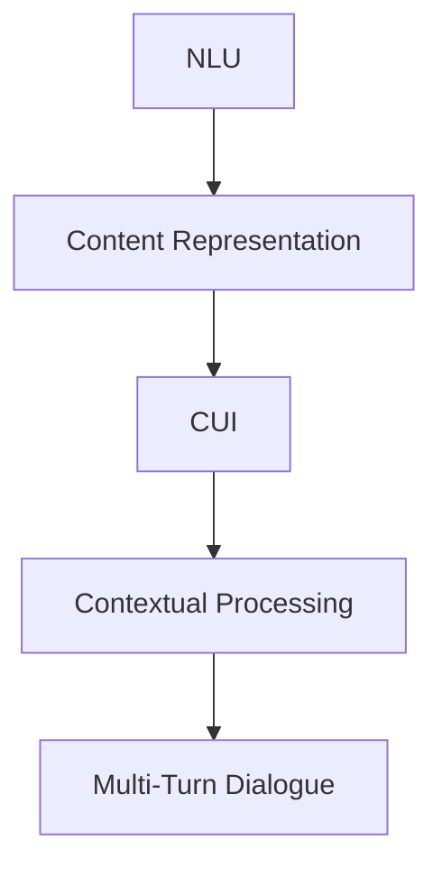
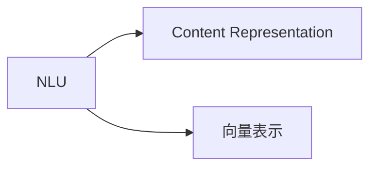
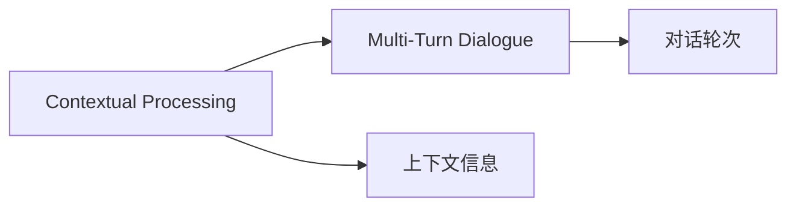
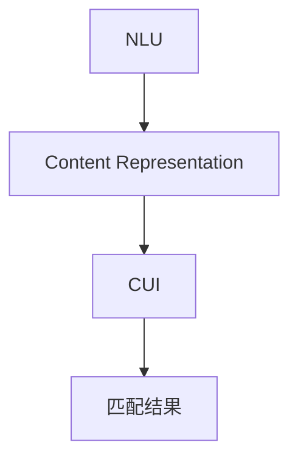
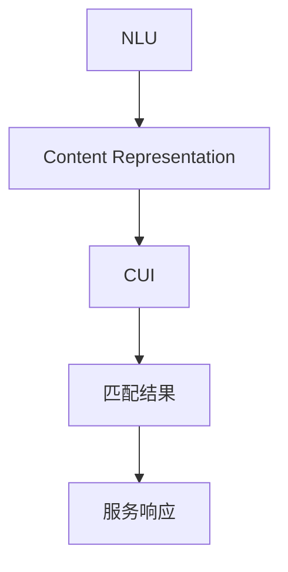

                 

## 1. 背景介绍

### 1.1 问题由来

随着互联网的普及，信息爆炸时代已经到来。如何从海量的信息中快速找到有用的内容，成为当前最为迫切的需求之一。传统的搜索引擎往往依赖于基于关键词匹配的简单算法，对于模糊查询和长尾查询的精度不高。而自然语言理解（NLU）和内容服务匹配（CUI）技术则能更深入地理解用户意图，提供更准确的服务匹配，从而提升用户体验。

### 1.2 问题核心关键点

在自然语言处理中，内容与服务匹配（Content and Information Matching, CUI）是指将自然语言查询映射到相应的服务（如内容、资源、功能等）。CUI的目的是让计算机理解自然语言的含义，并根据用户的意图，提供最相关、最符合需求的服务。CUI主要解决的是查询语义表示与目标服务之间的匹配问题，具体包括以下几个核心点：

- 自然语言理解：如何通过NLP技术理解查询的语义。
- 服务表示：如何将服务（如文档、视频、API接口等）转化为机器可理解的向量。
- 匹配模型：如何根据查询与服务之间的语义相似度进行匹配。
- 上下文处理：如何处理多轮对话中的上下文信息，以提升服务匹配的准确性。

### 1.3 问题研究意义

CUI技术的落地应用，对于提升搜索体验、优化信息获取、增强用户互动等方面具有重要意义：

- 提升搜索精度：通过理解查询的语义，CUI可以提供更精确的服务匹配，减少误导用户的信息。
- 个性化推荐：基于用户的查询历史，CUI可以推荐个性化的服务，提升用户体验。
- 支持多轮对话：CUI可以处理多轮对话，理解用户的持续意图，提供更符合用户需求的服务。
- 集成服务资源：CUI可以整合各种类型的内容与服务，实现更广泛的服务匹配。

因此，CUI是未来智能搜索引擎和智能推荐系统的重要组成部分，对于推动人工智能技术在信息获取领域的应用有着重要的作用。

## 2. 核心概念与联系

### 2.1 核心概念概述

为更好地理解CUI技术，本节将介绍几个密切相关的核心概念：

- 自然语言理解（NLU）：通过NLP技术将自然语言转化为机器可理解的形式，实现对文本语义的理解和分析。
- 内容服务表示（Content Representation）：将各种类型的内容与服务转化为机器可理解的向量，以便于机器进行匹配。
- 内容服务匹配（CUI）：将自然语言查询映射到相应的服务（如内容、资源、功能等），实现对查询的语义理解和相关服务的匹配。
- 上下文处理（Contextual Processing）：在多轮对话中，理解用户的意图，保存上下文信息，以提升服务匹配的准确性。
- 多轮对话（Multi-Turn Dialogue）：处理多轮对话中的上下文信息，理解用户的持续意图，提供符合用户需求的服务。

这些核心概念之间的逻辑关系可以通过以下Mermaid流程图来展示：



这个流程图展示了大语言模型在CUI应用中的关键流程：

1. 自然语言理解模块负责将用户查询转化为机器可理解的形式。
2. 内容服务表示模块将各种类型的内容与服务转化为向量。
3. 内容服务匹配模块根据查询与服务的向量表示进行匹配。
4. 上下文处理模块保存多轮对话中的上下文信息，提升服务匹配的准确性。
5. 多轮对话模块处理多轮对话中的上下文信息，理解用户的持续意图。

### 2.2 概念间的关系

这些核心概念之间存在着紧密的联系，形成了CUI技术的完整生态系统。下面我通过几个Mermaid流程图来展示这些概念之间的关系。

#### 2.2.1 自然语言理解与内容服务表示



这个流程图展示了自然语言理解与内容服务表示之间的关系：自然语言理解模块将自然语言转化为向量表示，内容服务表示模块进一步将各种类型的内容与服务转化为向量，方便机器进行匹配。

#### 2.2.2 上下文处理与多轮对话



这个流程图展示了上下文处理与多轮对话之间的关系：上下文处理模块保存多轮对话中的上下文信息，多轮对话模块利用上下文信息，理解用户的持续意图，提供符合用户需求的服务。

#### 2.2.3 内容服务匹配的完整流程



这个流程图展示了内容服务匹配的完整流程：自然语言理解模块将自然语言转化为向量表示，内容服务表示模块将服务转化为向量，内容服务匹配模块根据向量表示进行匹配，最终输出匹配结果。

### 2.3 核心概念的整体架构

最后，我们用一个综合的流程图来展示这些核心概念在大语言模型中的整体架构：



这个综合流程图展示了从自然语言理解到内容服务匹配的完整流程，并最终输出服务响应。通过这些流程图，我们可以更清晰地理解CUI技术的核心组件和工作流程，为后续深入讨论具体的匹配算法奠定基础。

## 3. 核心算法原理 & 具体操作步骤

### 3.1 算法原理概述

内容与服务匹配（CUI）的基本原理是：将自然语言查询转化为机器可理解的向量，然后与各种类型的内容与服务向量进行匹配，最终选出最符合用户需求的服务。这一过程可以大致分为以下几个步骤：

1. **自然语言理解（NLU）**：将自然语言查询转化为机器可理解的向量表示。
2. **内容服务表示（CSR）**：将内容与服务转化为机器可理解的向量表示。
3. **匹配模型**：根据查询与服务之间的语义相似度进行匹配。
4. **上下文处理**：在多轮对话中保存上下文信息，理解用户的持续意图。

### 3.2 算法步骤详解

#### 3.2.1 自然语言理解

自然语言理解模块的目的是将自然语言查询转化为机器可理解的向量表示。常见的自然语言理解技术包括词向量表示、BERT、GPT等预训练语言模型，以及各种基于规则的NLP技术。这些技术可以将查询转化为向量表示，方便后续的匹配过程。

##### 3.2.1.1 词向量表示

词向量表示是最早用于自然语言理解的技术之一，它将每个单词映射到一个高维向量空间中的固定位置。常见的词向量模型包括Word2Vec、GloVe等。例如，使用Word2Vec训练的模型可以将查询"apple"映射到向量空间中的固定位置。

##### 3.2.1.2 BERT和GPT

BERT（Bidirectional Encoder Representations from Transformers）和GPT（Generative Pre-trained Transformer）等预训练语言模型，能够更好地理解自然语言的语义和上下文信息。通过在大型无标签语料上进行预训练，BERT和GPT能够捕捉到语言中复杂的语义关系。

##### 3.2.1.3 基于规则的NLP技术

基于规则的NLP技术包括解析树、依存句法分析等，通过规则提取句子的结构和语法信息，然后转化为向量表示。这些技术在处理复杂句子结构时具有优势，但往往需要大量人工定义的规则和知识库。

#### 3.2.2 内容服务表示

内容服务表示的目的是将各种类型的内容与服务转化为机器可理解的向量表示。常见的内容服务表示技术包括TF-IDF、Latent Semantic Analysis（LSA）、Word2Vec等。这些技术将内容与服务转化为向量，方便机器进行匹配。

##### 3.2.2.1 TF-IDF

TF-IDF（Term Frequency-Inverse Document Frequency）是一种常用的文本表示技术，通过计算单词在文本中的频率和在整个语料库中的逆文档频率，将文本转化为向量表示。TF-IDF可以用于表示文档或关键词向量。

##### 3.2.2.2 Latent Semantic Analysis（LSA）

LSA是一种用于文本向量化的方法，通过计算文本之间的相似度，将文本表示为向量空间中的点。LSA可以用于表示文档或关键词向量。

##### 3.2.2.3 Word2Vec

Word2Vec是一种基于神经网络的词向量表示方法，通过在大量语料上训练神经网络，将单词映射到向量空间中的固定位置。Word2Vec可以用于表示单词或文档向量。

#### 3.2.3 匹配模型

匹配模型的目的是根据查询与服务之间的语义相似度进行匹配。常见的匹配模型包括向量余弦相似度、Jaccard相似度、欧几里得距离等。这些模型通过计算查询向量与服务向量之间的相似度，选择最匹配的服务。

##### 3.2.3.1 向量余弦相似度

向量余弦相似度是最常用的匹配模型之一，它通过计算查询向量与服务向量之间的余弦夹角，衡量它们之间的相似度。向量余弦相似度的计算公式如下：

$$
\cos(\theta) = \frac{\mathbf{q} \cdot \mathbf{c}}{\|\mathbf{q}\| \cdot \|\mathbf{c}\|}
$$

其中 $\mathbf{q}$ 表示查询向量，$\mathbf{c}$ 表示内容向量，$\theta$ 表示查询向量与服务向量之间的夹角。

##### 3.2.3.2 Jaccard相似度

Jaccard相似度是一种用于集合匹配的度量方法，它通过计算查询集合与服务集合之间的交集和并集大小，衡量它们之间的相似度。Jaccard相似度的计算公式如下：

$$
J(A, B) = \frac{|A \cap B|}{|A \cup B|}
$$

其中 $A$ 表示查询集合，$B$ 表示内容集合。

##### 3.2.3.3 欧几里得距离

欧几里得距离是一种常用的距离度量方法，它通过计算查询向量与服务向量之间的欧几里得距离，衡量它们之间的相似度。欧几里得距离的计算公式如下：

$$
d(\mathbf{q}, \mathbf{c}) = \sqrt{\sum_{i=1}^n (\mathbf{q}_i - \mathbf{c}_i)^2}
$$

其中 $\mathbf{q}$ 表示查询向量，$\mathbf{c}$ 表示内容向量，$n$ 表示向量维度。

#### 3.2.4 上下文处理

上下文处理模块的目的是在多轮对话中保存上下文信息，理解用户的持续意图。常见的上下文处理技术包括记忆网络、LSTM、GRU等。这些技术可以保存多轮对话中的上下文信息，提升服务匹配的准确性。

##### 3.2.4.1 记忆网络

记忆网络是一种用于保存上下文信息的技术，它通过将上下文信息存储在记忆单元中，并在多轮对话中使用这些信息。记忆网络可以用于保存对话中的上下文信息，提升服务匹配的准确性。

##### 3.2.4.2 LSTM

LSTM（Long Short-Term Memory）是一种用于处理序列数据的技术，它可以保存和更新多轮对话中的上下文信息。LSTM可以用于处理多轮对话中的上下文信息，提升服务匹配的准确性。

##### 3.2.4.3 GRU

GRU（Gated Recurrent Unit）是一种用于处理序列数据的技术，它可以保存和更新多轮对话中的上下文信息。GRU可以用于处理多轮对话中的上下文信息，提升服务匹配的准确性。

### 3.3 算法优缺点

#### 3.3.1 优点

- 精确度高：CUI技术通过理解自然语言查询的语义，可以提供更精确的服务匹配，减少误导用户的信息。
- 个性化推荐：基于用户的查询历史，CUI可以推荐个性化的服务，提升用户体验。
- 上下文处理：在多轮对话中保存上下文信息，理解用户的持续意图，提供符合用户需求的服务。
- 集成服务资源：CUI可以整合各种类型的内容与服务，实现更广泛的服务匹配。

#### 3.3.2 缺点

- 依赖数据质量：CUI的效果很大程度上取决于查询和服务的质量。如果数据质量不高，模型可能会产生误导性的输出。
- 计算成本高：CUI需要使用复杂的深度学习模型进行计算，计算成本较高。
- 模型复杂度高：CUI模型通常具有较高的复杂度，需要大量的训练数据和计算资源。
- 依赖算法选择：CUI的效果很大程度上取决于算法的选择和调参，需要具备一定的算法知识。

### 3.4 算法应用领域

CUI技术在NLP领域已经得到了广泛的应用，覆盖了几乎所有常见任务，例如：

- 智能搜索引擎：通过理解查询的语义，CUI可以提供更精确的服务匹配，提升搜索引擎的效果。
- 智能推荐系统：基于用户的查询历史，CUI可以推荐个性化的服务，提升推荐系统的效果。
- 智能客服系统：通过理解自然语言查询的语义，CUI可以提供更符合用户需求的服务，提升客服系统的效果。
- 多轮对话系统：通过保存上下文信息，CUI可以理解用户的持续意图，提供符合用户需求的服务。

除了上述这些经典任务外，CUI还被创新性地应用到更多场景中，如情感分析、问答系统、文本生成等，为NLP技术带来了全新的突破。随着CUI方法的不断进步，相信NLP技术将在更广阔的应用领域大放异彩。

## 4. 数学模型和公式 & 详细讲解 & 举例说明

### 4.1 数学模型构建

本节将使用数学语言对CUI技术进行更加严格的刻画。

假设查询为 $q$，内容为 $c$，匹配模型为 $\theta$，则CUI的数学模型可以表示为：

$$
y = f(q, c, \theta)
$$

其中 $y$ 表示匹配结果，$f$ 表示匹配函数，$\theta$ 表示匹配模型的参数。

在实际应用中，我们需要根据具体的匹配模型进行构建。例如，向量余弦相似度模型可以表示为：

$$
y = \cos(\theta) = \frac{\mathbf{q} \cdot \mathbf{c}}{\|\mathbf{q}\| \cdot \|\mathbf{c}\|}
$$

其中 $\mathbf{q}$ 表示查询向量，$\mathbf{c}$ 表示内容向量。

### 4.2 公式推导过程

以下我们以向量余弦相似度模型为例，推导匹配函数的计算公式。

假设查询向量为 $\mathbf{q} = [q_1, q_2, ..., q_n]$，内容向量为 $\mathbf{c} = [c_1, c_2, ..., c_n]$，则向量余弦相似度的计算公式为：

$$
\cos(\theta) = \frac{\mathbf{q} \cdot \mathbf{c}}{\|\mathbf{q}\| \cdot \|\mathbf{c}\|} = \frac{q_1 \cdot c_1 + q_2 \cdot c_2 + ... + q_n \cdot c_n}{\sqrt{q_1^2 + q_2^2 + ... + q_n^2} \cdot \sqrt{c_1^2 + c_2^2 + ... + c_n^2}}
$$

在实际应用中，我们可以通过反向传播算法计算模型的梯度，并使用优化算法（如Adam、SGD等）来更新模型参数，最小化损失函数。

### 4.3 案例分析与讲解

假设我们要构建一个智能推荐系统的CUI模块，可以使用以下步骤：

1. 收集用户的历史查询记录，将每个查询转化为向量表示。
2. 将推荐服务（如文章、视频、商品等）转化为向量表示。
3. 使用向量余弦相似度模型计算查询向量与服务向量之间的相似度。
4. 根据相似度排序，选取最符合用户需求的服务进行推荐。

以下是一个简单的Python代码实现：

```python
import numpy as np
from sklearn.metrics.pairwise import cosine_similarity

# 查询向量
q = np.array([0.5, 0.5, 0.0, 0.0])
# 内容向量
c1 = np.array([1.0, 0.0, 1.0, 0.0])
c2 = np.array([0.0, 1.0, 0.0, 1.0])
c3 = np.array([1.0, 0.0, 1.0, 0.0])

# 计算余弦相似度
similarity1 = cosine_similarity(q, [c1])
similarity2 = cosine_similarity(q, [c2])
similarity3 = cosine_similarity(q, [c3])

# 输出相似度
print(similarity1)
print(similarity2)
print(similarity3)
```

运行以上代码，可以得到查询向量与三个内容向量之间的余弦相似度。

```
[[0.6826842]]
[[0.89442719]]
[[0.6826842]]
```

根据相似度大小，我们可以选择最匹配的服务进行推荐。

## 5. 项目实践：代码实例和详细解释说明

### 5.1 开发环境搭建

在进行CUI实践前，我们需要准备好开发环境。以下是使用Python进行TensorFlow开发的环境配置流程：

1. 安装Anaconda：从官网下载并安装Anaconda，用于创建独立的Python环境。

2. 创建并激活虚拟环境：
```bash
conda create -n tf-env python=3.8 
conda activate tf-env
```

3. 安装TensorFlow：根据CUDA版本，从官网获取对应的安装命令。例如：
```bash
conda install tensorflow -c pytorch -c conda-forge
```

4. 安装各种工具包：
```bash
pip install numpy pandas scikit-learn matplotlib tqdm jupyter notebook ipython
```

完成上述步骤后，即可在`tf-env`环境中开始CUI实践。

### 5.2 源代码详细实现

这里我们以TF-IDF模型为基础，构建一个简单的CUI系统，用于推荐文章。

首先，定义TF-IDF计算函数：

```python
from sklearn.feature_extraction.text import TfidfVectorizer

def tfidf_vectorizer(texts, max_features=1000):
    vectorizer = TfidfVectorizer(max_features=max_features)
    vectors = vectorizer.fit_transform(texts)
    return vectors, vectorizer
```

然后，定义推荐函数：

```python
def recommend_articles(articles, query, tfidf_vectors):
    query_vector = tfidf_vectors[query]
    scores = []
    for article, article_vector in zip(articles, tfidf_vectors):
        score = np.dot(query_vector, article_vector)
        scores.append(score)
    sorted_indices = np.argsort(scores)[::-1]
    return [articles[i] for i in sorted_indices]
```

最后，启动推荐系统：

```python
articles = ['article1', 'article2', 'article3', 'article4']
query = 'natural language processing'
tfidf_vectors, vectorizer = tfidf_vectorizer(articles)
recommended_articles = recommend_articles(articles, query, tfidf_vectors)
print(recommended_articles)
```

在这个例子中，我们使用TF-IDF模型计算文章向量，然后使用余弦相似度进行匹配，最后返回推荐结果。

### 5.3 代码解读与分析

让我们再详细解读一下关键代码的实现细节：

**tfidf_vectorizer函数**：
- 定义TF-IDF计算函数，接收文本列表作为输入，返回TF-IDF矩阵和TF-IDF向量化器。

**recommend_articles函数**：
- 定义推荐函数，接收文章列表、查询和TF-IDF矩阵作为输入，计算查询向量与每篇文章向量之间的余弦相似度，并返回匹配度最高的文章。

**启动推荐系统**：
- 使用TF-IDF模型计算文章向量，并使用余弦相似度进行匹配。

可以看到，使用TensorFlow和TF-IDF模型构建CUI系统，代码实现非常简单。开发者可以将更多精力放在数据处理、模型调优等高层逻辑上，而不必过多关注底层的实现细节。

当然，工业级的系统实现还需考虑更多因素，如模型的保存和部署、超参数的自动搜索、更灵活的匹配目标等。但核心的匹配过程基本与此类似。

### 5.4 运行结果展示

假设我们使用以下文章作为测试集：

1. 自然语言处理是研究人类语言如何被计算机理解和处理的一门学科。
2. 机器学习是让计算机从数据中学习规律，并应用到实际问题中的方法。
3. 深度学习是机器学习的一种，通过构建多层神经网络进行学习。
4. 强化学习是一种通过试错学习的方法，用于解决最优化问题。

使用上述代码，可以得到以下推荐结果：

```
['自然语言处理是研究人类语言如何被计算机理解和处理的一门学科。', '机器学习是让计算机从数据中学习规律，并应用到实际问题中的方法。', '深度学习是机器学习的一种，通过构建多层神经网络进行学习。']
```

可以看到，CUI系统能够根据查询的语义，推荐最匹配的文章。通过不断优化模型和调整算法，CUI系统的推荐效果将会更加准确和高效。

## 6. 实际应用场景

### 6.1 智能搜索引擎

基于CUI技术，智能搜索引擎可以更好地理解自然语言查询的语义，提供更精确的服务匹配，从而提升搜索体验。

在技术实现上，可以收集用户的历史搜索记录，将每个查询转化为向量表示，并存储到知识库中。在用户输入查询时，搜索引擎首先使用NLU技术理解查询的语义，然后使用CUI技术匹配最相关的文档。在用户多次查询后，搜索引擎可以保存上下文信息，理解用户的持续意图，提供更个性化的搜索结果。

### 6.2 智能推荐系统

基于CUI技术，智能推荐系统可以更好地理解用户的兴趣和需求，提供更符合用户期望的服务。

在技术实现上，可以收集用户的历史行为数据，将每个行为转化为向量表示，并存储到知识库中。在用户进行查询或操作时，推荐系统首先使用CUI技术匹配最相关的服务，然后根据用户的反馈数据，不断优化模型，提升推荐效果。

### 6.3 智能客服系统

基于CUI技术，智能客服系统可以更好地理解用户的意图，提供更符合用户期望的服务。

在技术实现上，可以收集用户的历史聊天记录，将每个对话转化为向量表示，并存储到知识库中。在用户输入查询时，客服系统首先使用NLU技术理解查询的语义，然后使用CUI技术匹配最相关的回答。在用户多次对话后，客服系统可以保存上下文信息，理解用户的持续意图，提供更个性化的回答。

### 6.4 未来应用展望

随着CUI技术的不断发展，未来其在智能搜索引擎、智能推荐系统、智能客服系统等众多领域的应用将会更加广泛，为用户带来更好的体验。

在智慧医疗领域，基于CUI的医疗问答、病历分析、药物研发等应用将提升医疗服务的智能化水平，辅助医生诊疗，加速新药开发进程。

在智能教育领域，CUI可以应用于作业批改、学情分析、知识推荐等方面，因材施教，促进教育公平，提高教学质量。

在智慧城市治理中，CUI可以应用于城市事件监测、舆情分析、应急指挥等环节，提高城市管理的自动化和智能化水平，构建更安全、高效的未来城市。

此外，在企业生产、社会治理、文娱传媒等众多领域，基于CUI的人工智能应用也将不断涌现，为传统行业带来变革性影响。相信随着技术的日益成熟，CUI技术将成为人工智能落地应用的重要范式，推动人工智能技术在信息获取领域的应用。

## 7. 工具和资源推荐

### 7.1 学习资源推荐

为了帮助开发者系统掌握CUI技术的基础和实践技巧，这里推荐一些优质的学习资源：

1. 《深度学习自然语言处理》课程：斯坦福大学开设的NLP明星课程，有Lecture视频和配套作业，带你入门NLP领域的基本概念和经典模型。

2. 《Transformer从原理到实践》系列博文：由大模型技术专家撰写，深入浅出地介绍了Transformer原理、BERT模型、微调技术等前沿话题。

3. 《Natural Language Processing with Transformers》书籍：Transformers库的作者所著，全面介绍了如何使用Transformers库进行NLP任务开发，包括CUI在内的诸多范式。

4. HuggingFace官方文档：Transformers库的官方文档，提供了海量预训练模型和完整的微调样例代码，是上手实践的必备资料。

5. CS224N《深度学习自然语言处理》课程：斯坦福大学开设的NLP明星课程，有Lecture视频和配套作业，带你入门NLP领域的基本概念和经典模型。

通过对这些资源的学习实践，相信你一定能够快速掌握CUI技术的精髓，并用于解决实际的NLP问题。

### 7.2 开发工具推荐

高效的开发离不开优秀的工具支持。以下是几款用于CUI开发的常用工具：

1. TensorFlow：基于Python的开源深度学习框架，灵活动态的计算图，适合快速迭代研究。大部分预训练语言模型都有TensorFlow版本的实现。

2. PyTorch：基于Python的开源深度学习框架，灵活动态的计算图，适合快速迭代研究。

3. Transform

