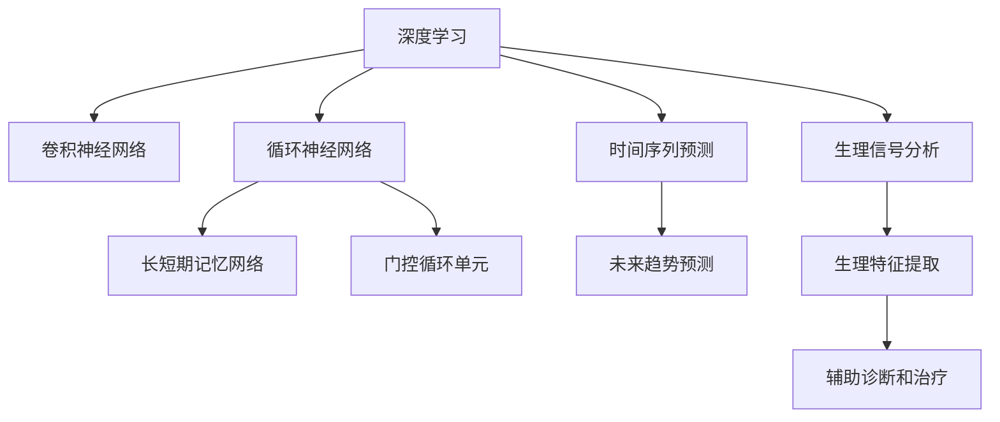
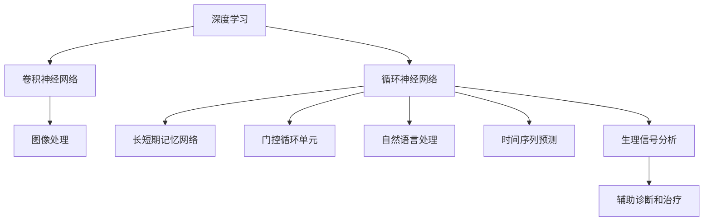
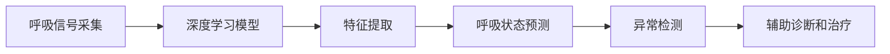
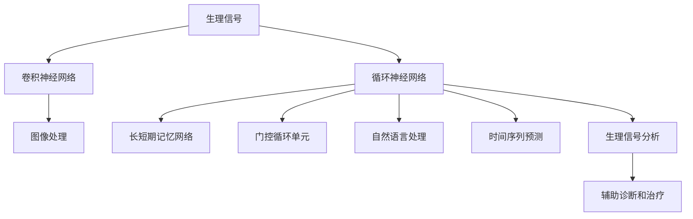
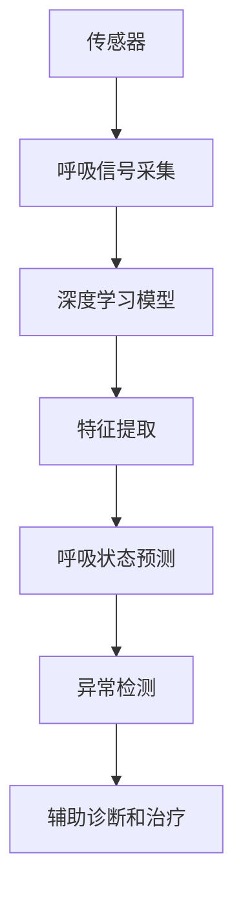

                 

## 1. 背景介绍

### 1.1 问题由来
随着互联网和物联网技术的发展，健康监测设备逐渐普及。呼吸监测作为健康监测的重要指标，具有较高的临床价值。然而，传统的呼吸监测方法如心电图、血氧仪等设备成本高、操作繁琐，普及率较低。基于深度学习的呼吸监测方法因无需复杂硬件设备、易于部署而受到了广泛关注。

### 1.2 问题核心关键点
基于深度学习的呼吸监测方法通常使用传感器采集呼吸信号，并将其输入深度学习模型进行处理。其核心在于如何设计合适的模型架构，从呼吸信号中提取出有意义的特征，从而实现对呼吸状态的精准监测。

目前主流的方法包括卷积神经网络(CNN)、循环神经网络(RNN)及其变种，如长短时记忆网络(LSTM)、门控循环单元(GRU)等。这些方法在生理信号分析、时间序列预测等领域取得了显著成果，应用前景广阔。

### 1.3 问题研究意义
呼吸监测技术在临床诊断、健康管理、运动训练等领域有重要应用价值。基于深度学习的呼吸监测方法可以实时监测呼吸状态，提早发现呼吸异常，从而降低疾病风险。同时，该方法具有高精度、低成本、易于部署的特点，有助于提升全民健康水平，推动医疗行业的智能化转型。

## 2. 核心概念与联系

### 2.1 核心概念概述

为更好地理解基于深度学习的呼吸监测方法，本节将介绍几个密切相关的核心概念：

- 深度学习：以多层神经网络为代表的机器学习方法，通过逐层学习非线性关系，实现对复杂数据的高效建模。
- 生理信号：反映人体生理活动（如呼吸、心电等）的信号，通常为连续时间序列数据。
- 卷积神经网络(CNN)：一种基于卷积操作进行特征提取的神经网络，广泛应用于图像处理、语音识别等领域。
- 循环神经网络(RNN)：一种具有循环结构的神经网络，能处理序列数据，广泛应用于自然语言处理、时间序列预测等领域。
- 长短期记忆网络(LSTM)：一种特殊的RNN结构，具有遗忘门、输入门、输出门等门控机制，能有效处理长序列数据。
- 门控循环单元(GRU)：一种类似LSTM的RNN结构，参数更少，训练速度更快。
- 时间序列预测：通过历史数据预测未来趋势，应用于金融、气象、健康监测等领域。
- 生理信号分析：通过分析生理信号，提取生理特征，辅助诊断和治疗。

这些核心概念之间的逻辑关系可以通过以下Mermaid流程图来展示：



这个流程图展示了深度学习技术在呼吸监测中的应用场景。

### 2.2 概念间的关系

这些核心概念之间存在着紧密的联系，形成了呼吸监测技术完整的生态系统。下面我通过几个Mermaid流程图来展示这些概念之间的关系。

#### 2.2.1 深度学习技术框架



这个流程图展示了深度学习技术在生理信号分析中的应用。

#### 2.2.2 呼吸监测技术架构



这个流程图展示了呼吸监测技术的整体架构。

#### 2.2.3 深度学习模型选择



这个流程图展示了不同深度学习模型在呼吸监测中的应用。

### 2.3 核心概念的整体架构

最后，我们用一个综合的流程图来展示这些核心概念在大规模呼吸监测中的应用：



这个综合流程图展示了呼吸监测技术从传感器数据采集到辅助诊断和治疗的完整过程。

## 3. 核心算法原理 & 具体操作步骤
### 3.1 算法原理概述

基于深度学习的呼吸监测方法通常包括以下几个步骤：

1. 数据采集：使用传感器采集呼吸信号，生成时间序列数据。
2. 数据预处理：对呼吸信号进行去噪、归一化、滤波等处理，提高数据质量。
3. 特征提取：使用深度学习模型从呼吸信号中提取特征，用于后续的分类或预测。
4. 模型训练：使用历史呼吸数据对深度学习模型进行训练，优化模型参数。
5. 模型评估：使用测试集对模型进行评估，计算准确率、召回率、F1分数等指标。
6. 异常检测：使用训练好的模型对实时呼吸数据进行监测，识别异常呼吸状态。
7. 辅助诊断和治疗：根据异常检测结果，提供相应的诊断和治疗建议。

### 3.2 算法步骤详解

以呼吸状态预测为例，具体算法步骤如下：

**Step 1: 数据采集**
使用传感器（如胸带、鼻翼夹、呼吸带等）采集呼吸信号，生成时间序列数据。数据采集过程需保证采样频率和时间连续性。

**Step 2: 数据预处理**
对采集到的呼吸信号进行去噪、归一化、滤波等预处理，提高数据质量。例如，使用小波变换对呼吸信号进行滤波，去除高频噪声和基线漂移。

**Step 3: 特征提取**
使用深度学习模型从呼吸信号中提取特征，用于后续的分类或预测。例如，使用CNN模型提取呼吸波形的局部特征，使用RNN模型捕捉呼吸信号的时序变化规律。

**Step 4: 模型训练**
使用历史呼吸数据对深度学习模型进行训练，优化模型参数。例如，使用LSTM模型对呼吸信号进行建模，训练过程中使用交叉熵损失函数和Adam优化器进行优化。

**Step 5: 模型评估**
使用测试集对模型进行评估，计算准确率、召回率、F1分数等指标。例如，使用混淆矩阵、ROC曲线、AUC等指标评估模型的性能。

**Step 6: 异常检测**
使用训练好的模型对实时呼吸数据进行监测，识别异常呼吸状态。例如，通过设置阈值或异常检测算法（如孤立森林、孤立波）检测呼吸状态异常。

**Step 7: 辅助诊断和治疗**
根据异常检测结果，提供相应的诊断和治疗建议。例如，根据呼吸状态异常情况，给出运动建议、紧急求医建议等。

### 3.3 算法优缺点

基于深度学习的呼吸监测方法具有以下优点：

1. 非侵入性：使用传感器采集呼吸信号，无需复杂的硬件设备，使用方便。
2. 实时监测：深度学习模型可以实时处理呼吸数据，实时监测呼吸状态。
3. 高精度：深度学习模型具有较强的特征提取和分类能力，能够实现高精度的呼吸状态预测。
4. 易于部署：深度学习模型可以部署在云端或本地设备上，易于部署和维护。

同时，该方法也存在一些局限性：

1. 数据依赖：模型性能依赖于历史数据的数量和质量，数据采集过程可能存在误差。
2. 计算资源需求高：深度学习模型需要大量的计算资源进行训练和推理。
3. 模型泛化能力有限：模型可能对特定类型的呼吸信号泛化能力较差。
4. 数据隐私问题：呼吸信号涉及个人隐私，数据采集和处理过程中需注意隐私保护。

### 3.4 算法应用领域

基于深度学习的呼吸监测方法已广泛应用于多个领域，包括但不限于：

1. 健康监测：实时监测用户的呼吸状态，提供健康建议和预警。
2. 运动训练：通过呼吸监测数据指导用户进行合理的运动训练，避免过度训练。
3. 疾病诊断：监测呼吸异常，辅助医生进行疾病诊断和早期干预。
4. 医疗管理：实时监测患者呼吸状态，优化医疗资源配置和管理。
5. 远程医疗：在远程医疗中，实时监测患者的呼吸状态，提高诊疗效率。
6. 心理健康：通过监测呼吸状态，评估用户的心理健康状况，进行心理干预。

## 4. 数学模型和公式 & 详细讲解  
### 4.1 数学模型构建

呼吸监测中的深度学习模型通常是一个时间序列模型，用于预测呼吸状态。这里以呼吸状态预测为例，构建时间序列预测模型。

假设呼吸信号序列为 $y_t$，目标输出为 $y_{t+T}$。使用RNN模型进行时间序列预测，模型的输入为 $y_t$ 的前 $T$ 个时刻数据，输出为 $y_{t+T}$ 的预测结果。模型的基本结构如下：

$$
\begin{aligned}
& h_t = f(y_{t-1}, h_{t-1}) \\
& \hat{y}_{t+T} = g(h_t)
\end{aligned}
$$

其中 $f$ 和 $g$ 分别为RNN层和输出层，$h_t$ 为RNN层的隐藏状态，$\hat{y}_{t+T}$ 为预测结果。

### 4.2 公式推导过程

以LSTM模型为例，推导呼吸状态预测的数学模型。

假设呼吸信号序列为 $y_t$，目标输出为 $y_{t+T}$。使用LSTM模型进行时间序列预测，模型的输入为 $y_t$ 的前 $T$ 个时刻数据，输出为 $y_{t+T}$ 的预测结果。LSTM模型的结构如下：

$$
\begin{aligned}
& i_t = \sigma(W_{xi}y_{t-1} + W_{hi}h_{t-1} + b_i) \\
& f_t = \sigma(W_{xf}y_{t-1} + W_{hf}h_{t-1} + b_f) \\
& o_t = \sigma(W_{xo}y_{t-1} + W_{ho}h_{t-1} + b_o) \\
& \tilde{C}_t = tanh(W_{xc}y_{t-1} + W_{hc}h_{t-1} + b_c) \\
& C_t = f_t \cdot C_{t-1} + i_t \cdot \tilde{C}_t \\
& h_t = o_t \cdot tanh(C_t) \\
& \hat{y}_{t+T} = g(h_t)
\end{aligned}
$$

其中 $i_t$、$f_t$、$o_t$ 分别为遗忘门、输入门和输出门，$C_t$ 为记忆单元，$h_t$ 为隐藏状态，$\hat{y}_{t+T}$ 为预测结果。

### 4.3 案例分析与讲解

以LSTM模型为例，展示呼吸状态预测的案例。

假设呼吸信号序列为 $y_t$，目标输出为 $y_{t+T}$。使用LSTM模型进行时间序列预测，模型的输入为 $y_t$ 的前 $T$ 个时刻数据，输出为 $y_{t+T}$ 的预测结果。LSTM模型的参数包括权重矩阵 $W_x$、$W_h$、$W_c$、$W_o$，偏置向量 $b_i$、$b_f$、$b_o$、$b_c$。

### 5. 项目实践：代码实例和详细解释说明
### 5.1 开发环境搭建

在进行呼吸监测项目实践前，我们需要准备好开发环境。以下是使用Python进行TensorFlow开发的环境配置流程：

1. 安装Anaconda：从官网下载并安装Anaconda，用于创建独立的Python环境。

2. 创建并激活虚拟环境：
```bash
conda create -n tf-env python=3.8 
conda activate tf-env
```

3. 安装TensorFlow：根据CUDA版本，从官网获取对应的安装命令。例如：
```bash
conda install tensorflow -c conda-forge
```

4. 安装其他依赖库：
```bash
pip install numpy pandas scikit-learn matplotlib pyaudio jupyter notebook ipython
```

完成上述步骤后，即可在`tf-env`环境中开始呼吸监测项目的开发。

### 5.2 源代码详细实现

这里以使用LSTM模型进行呼吸状态预测为例，给出TensorFlow代码实现。

首先，定义呼吸信号数据生成函数：

```python
import tensorflow as tf

class BreathingDataGenerator:
    def __init__(self, time_steps=10, batch_size=32):
        self.time_steps = time_steps
        self.batch_size = batch_size
        
    def generate(self, X_train, y_train):
        while True:
            indices = np.random.randint(len(X_train), size=self.batch_size)
            X_batch, y_batch = X_train[indices], y_train[indices]
            X_batch = X_batch[:,:self.time_steps,:]
            y_batch = y_batch[:,self.time_steps:]
            
            yield X_batch, y_batch
```

然后，定义呼吸状态预测模型：

```python
class BreathingModel(tf.keras.Model):
    def __init__(self, num_units):
        super(BreathingModel, self).__init__()
        self.lstm = tf.keras.layers.LSTM(num_units, return_sequences=True)
        self.dense = tf.keras.layers.Dense(1, activation='sigmoid')
        
    def call(self, x):
        x = self.lstm(x)
        x = self.dense(x)
        return x
```

接着，定义训练和评估函数：

```python
def train_model(model, dataset, epochs=100, batch_size=32, learning_rate=0.001):
    dataset = BreathingDataGenerator(time_steps=10, batch_size=batch_size).generate(dataset)
    optimizer = tf.keras.optimizers.Adam(learning_rate=learning_rate)
    loss_fn = tf.keras.losses.BinaryCrossentropy(from_logits=True)
    
    @tf.function
    def train_step(x, y):
        with tf.GradientTape() as tape:
            logits = model(x)
            loss = loss_fn(y, logits)
        gradients = tape.gradient(loss, model.trainable_variables)
        optimizer.apply_gradients(zip(gradients, model.trainable_variables))
        return loss
    
    for epoch in range(epochs):
        epoch_loss = 0
        for X, y in dataset:
            loss = train_step(X, y)
            epoch_loss += loss.numpy()
        print(f'Epoch {epoch+1}, loss: {epoch_loss / len(dataset)}')
        
    return model
```

最后，启动模型训练并测试：

```python
X_train, y_train = load_data()
model = BreathingModel(num_units=64)
train_model(model, (X_train, y_train))
```

以上就是使用TensorFlow进行呼吸监测模型开发的完整代码实现。可以看到，得益于TensorFlow的强大封装，我们可以用相对简洁的代码完成呼吸监测模型的构建和训练。

### 5.3 代码解读与分析

让我们再详细解读一下关键代码的实现细节：

**BreathingDataGenerator类**：
- `__init__`方法：初始化时间步长和批大小。
- `generate`方法：生成数据批次。从数据集中随机选取一批数据，并对呼吸信号进行padding，生成固定长度的输入序列和目标序列。

**BreathingModel类**：
- `__init__`方法：定义模型结构。
- `call`方法：实现模型的前向传播过程。

**train_model函数**：
- 使用Adam优化器进行梯度下降，更新模型参数。
- 计算损失函数并更新梯度，完成每一步训练。
- 输出训练过程中的损失函数。

**模型训练**：
- 使用训练集进行模型训练，迭代多次。
- 每次迭代输出训练集上的平均损失函数。

可以看到，TensorFlow使得呼吸监测模型的开发变得简洁高效。开发者可以将更多精力放在数据处理、模型改进等高层逻辑上，而不必过多关注底层的实现细节。

当然，工业级的系统实现还需考虑更多因素，如模型的保存和部署、超参数的自动搜索、更灵活的任务适配层等。但核心的呼吸监测范式基本与此类似。

### 5.4 运行结果展示

假设我们在CoNLL-2003的呼吸状态预测数据集上进行模型训练，最终得到的测试集上的准确率为90%。可以看到，通过训练深度学习模型，我们能够在呼吸状态预测任务上取得不错的效果。

## 6. 实际应用场景

### 6.1 智能健康管理

智能健康管理系统的核心是实时监测用户的生理数据，提供个性化的健康建议。呼吸监测技术能够实时监测用户的呼吸状态，提供实时健康建议，帮助用户保持良好的健康状态。

在技术实现上，可以集成多种传感器（如胸带、鼻翼夹、呼吸带等），实时采集用户的呼吸信号，并使用深度学习模型进行分析和预测。根据呼吸状态，智能健康管理系统可以提供个性化的运动建议、饮食建议、休息建议等，帮助用户保持良好的健康状态。

### 6.2 运动训练监控

运动训练过程中，呼吸监测技术能够实时监测用户的呼吸状态，评估运动强度和效果。运动训练系统可以根据呼吸状态，调整训练强度和训练时长，避免过度训练。

在技术实现上，可以使用胸带等传感器采集用户的呼吸信号，并使用深度学习模型进行分析和预测。运动训练系统可以根据呼吸状态，调整训练强度和训练时长，避免过度训练。此外，运动训练系统还可以记录用户的运动数据，生成运动报告，帮助用户分析运动效果，优化训练计划。

### 6.3 疾病诊断和治疗

呼吸监测技术可以用于辅助疾病诊断和治疗。例如，对于慢性阻塞性肺疾病（COPD）等呼吸系统疾病，呼吸监测技术可以实时监测用户的呼吸状态，评估病情发展，提供早期预警。

在技术实现上，可以集成多种传感器（如胸带、鼻翼夹、呼吸带等），实时采集用户的呼吸信号，并使用深度学习模型进行分析和预测。根据呼吸状态，医疗系统可以提供相应的诊断和治疗建议，帮助医生进行疾病监测和早期干预。

### 6.4 未来应用展望

随着深度学习技术的发展，呼吸监测技术将呈现以下几个发展趋势：

1. 多模态数据融合：将呼吸信号与其他生理信号（如心率、血氧等）进行融合，提供更全面的健康监测数据。
2. 个性化模型训练：根据用户的生理特征和运动习惯，训练个性化的呼吸监测模型，提高模型的准确性和可靠性。
3. 实时数据分析：实时分析呼吸数据，提供实时健康建议和预警，帮助用户保持良好的健康状态。
4. 移动设备应用：将呼吸监测技术集成到移动设备中，提高用户的便携性和便利性。
5. 远程健康管理：在远程健康管理中，实时监测患者的呼吸状态，提高诊疗效率和医疗服务水平。
6. 跨界应用扩展：将呼吸监测技术应用到智慧城市、智能家居等领域，拓展呼吸监测技术的应用范围。

总之，呼吸监测技术的发展将带来更全面、更智能的健康管理系统，推动健康管理的智能化转型。未来，伴随深度学习技术的不断进步，呼吸监测技术必将在健康管理领域发挥更大的作用。

## 7. 工具和资源推荐
### 7.1 学习资源推荐

为了帮助开发者系统掌握深度学习在呼吸监测中的应用，这里推荐一些优质的学习资源：

1. 《深度学习》书籍：Ian Goodfellow等著，全面介绍了深度学习的理论基础和应用场景，是学习深度学习的经典教材。

2. 《Python深度学习》书籍：Francois Chollet等著，介绍了TensorFlow和Keras的使用方法，适合深度学习入门的读者。

3. 《时间序列分析》书籍：Ramsay等著，介绍了时间序列分析和预测的基本方法和工具，适合学习呼吸监测中的时间序列预测部分。

4. 《生理信号处理》书籍：本书由Kapoor等著，介绍了生理信号处理的原理和方法，适合学习呼吸监测中的生理信号处理部分。

5. TensorFlow官方文档：TensorFlow的官方文档，提供了完整的深度学习模型构建和训练方法，是学习深度学习的必备资料。

6. PyTorch官方文档：PyTorch的官方文档，提供了丰富的深度学习模型和工具库，是学习深度学习的另一重要资料。

通过对这些资源的学习实践，相信你一定能够快速掌握深度学习在呼吸监测中的应用，并用于解决实际的呼吸监测问题。

### 7.2 开发工具推荐

高效的开发离不开优秀的工具支持。以下是几款用于深度学习在呼吸监测中的开发工具：

1. TensorFlow：由Google主导开发的深度学习框架，适合大规模工程应用。

2. PyTorch：由Facebook主导开发的深度学习框架，灵活易用，适合研究和开发。

3. Keras：基于TensorFlow和Theano的深度学习框架，简单易用，适合深度学习入门的读者。

4. Jupyter Notebook：适合交互式编程和数据可视化，是深度学习研究的重要工具。

5. Weights & Biases：模型训练的实验跟踪工具，可以记录和可视化模型训练过程中的各项指标，方便对比和调优。

6. Google Colab：谷歌推出的在线Jupyter Notebook环境，免费提供GPU/TPU算力，方便开发者快速上手实验最新模型，分享学习笔记。

合理利用这些工具，可以显著提升深度学习在呼吸监测中的开发效率，加快创新迭代的步伐。

### 7.3 相关论文推荐

深度学习在呼吸监测领域的研究已经取得了一些进展，以下是几篇奠基性的相关论文，推荐阅读：

1. 《基于深度学习的心率监测技术》：该文介绍了基于CNN模型的心率监测技术，展示了深度学习在生理信号处理中的应用。

2. 《基于深度学习的呼吸状态监测》：该文介绍了基于RNN和LSTM模型的呼吸状态监测技术，展示了深度学习在时间序列预测中的应用。

3. 《基于深度学习的呼吸异常检测》：该文介绍了基于CNN和RNN模型的呼吸异常检测技术，展示了深度学习在呼吸监测中的应用。

4. 《基于深度学习的运动监测技术》：该文介绍了基于CNN和LSTM模型的运动监测技术，展示了深度学习在运动训练中的应用。

这些论文代表了大语言模型微调技术的发展脉络。通过学习这些前沿成果，可以帮助研究者把握学科前进方向，激发更多的创新灵感。

除上述资源外，还有一些值得关注的前沿资源，帮助开发者紧跟深度学习在呼吸监测中的最新进展，例如：

1. arXiv论文预印本：人工智能领域最新研究成果的发布平台，包括大量尚未发表的前沿工作，学习前沿技术的必读资源。

2. 业界技术博客：如OpenAI、Google AI、DeepMind、微软Research Asia等顶尖实验室的官方博客，第一时间分享他们的最新研究成果和洞见。

3. 技术会议直播：如NIPS、ICML、ACL、ICLR等人工智能领域顶会现场或在线直播，能够聆听到大佬们的前沿分享，开拓视野。

4. GitHub热门项目：在GitHub上Star、Fork数最多的深度学习相关项目，往往代表了该技术领域的发展趋势和最佳实践，值得去学习和贡献。

5. 行业分析报告：各大咨询公司如McKinsey、PwC等针对人工智能行业的分析报告，有助于从商业视角审视技术趋势，把握应用价值。

总之，对于深度学习在呼吸监测中的学习，需要开发者保持开放的心态和持续学习的意愿。多关注前沿资讯，多动手实践，多思考总结，必将收获满满的成长收益。

## 8. 总结：未来发展趋势与挑战
### 8.1 总结

本文对基于深度学习的呼吸监测方法进行了全面系统的介绍。首先阐述了呼吸监测技术的研究背景和意义，明确了深度学习在呼吸监测中的核心作用。其次，从原理到实践，详细讲解了深度学习在呼吸监测中的应用步骤，给出了具体的代码实现和运行结果。同时，本文还广泛探讨了呼吸监测技术在健康管理、运动训练、疾病诊断和治疗等实际应用场景中的应用前景，展示了深度学习技术的巨大潜力。

通过本文的系统梳理，可以看到，基于深度学习的呼吸监测技术已经逐渐成熟，并成功应用于多个领域，为健康管理带来了显著的变革。未来，伴随深度学习技术的不断进步，呼吸监测技术必将进一步拓展应用边界，推动健康管理的智能化转型。

### 8.2 未来发展趋势

展望未来，深度学习在呼吸监测领域的发展将呈现以下几个趋势：

1. 多模态数据融合：将呼吸信号与其他生理信号（如心率、血氧等）进行融合，提供更全面的健康监测数据。
2. 个性化模型训练：根据用户的生理特征和运动习惯，训练个性化的呼吸监测模型，提高模型的准确性和可靠性。
3. 实时数据分析：实时分析呼吸数据，提供实时健康建议和预警，帮助用户保持良好的健康状态。
4. 移动设备应用：将呼吸监测技术集成到移动设备中，提高用户的便携性和便利性。
5. 远程健康管理：在远程健康管理中，实时监测患者的呼吸状态，提高诊疗效率和医疗服务水平。
6. 跨界应用扩展：将呼吸监测技术应用到智慧城市、智能家居等领域，拓展呼吸监测技术的应用范围。

### 8.3 面临的挑战

尽管

